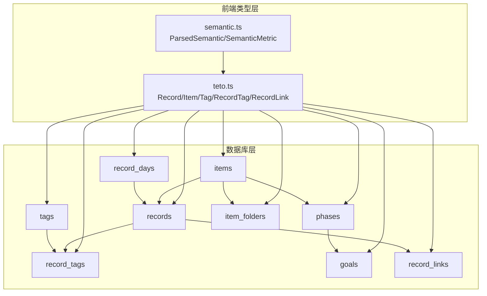
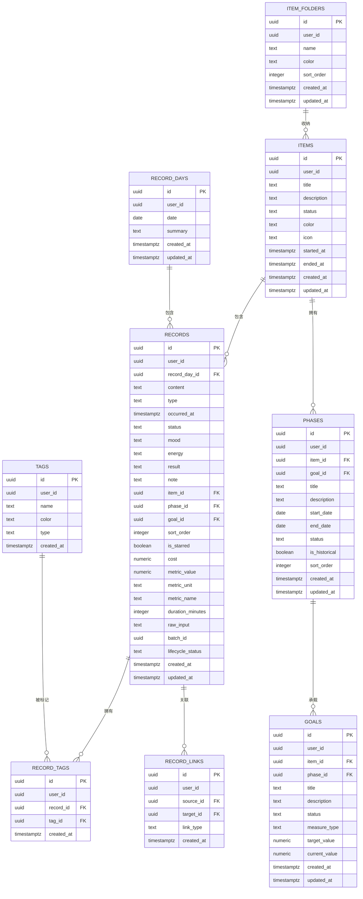
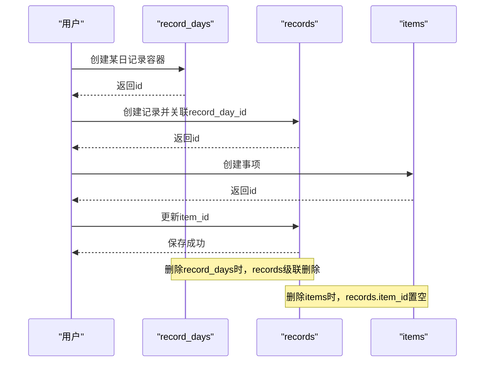
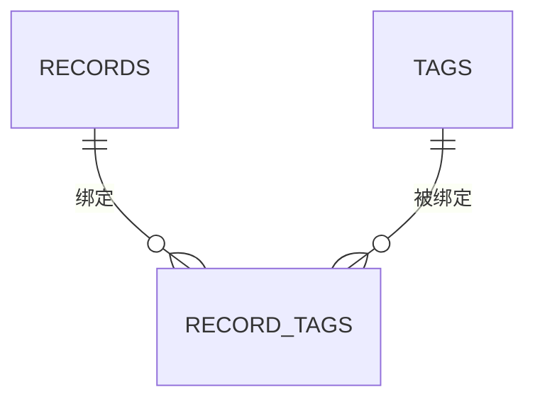
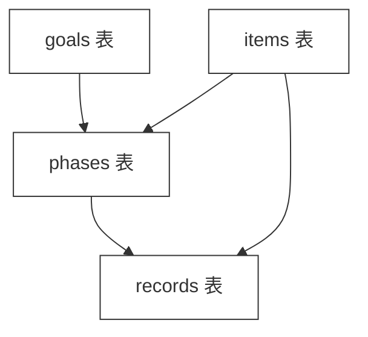
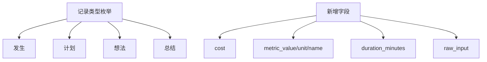
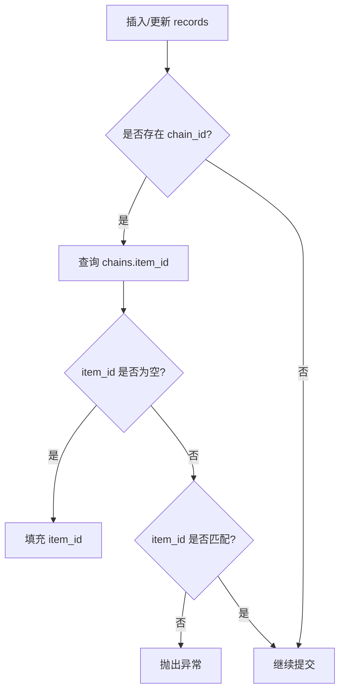
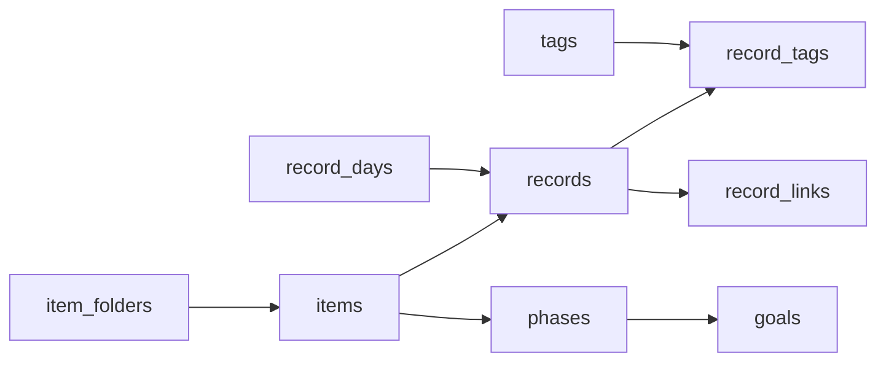

# 实体关系映射

<cite>
**本文引用的文件**
- [001_teto_1_3_records_model.sql](file://sql/001_teto_1_3_records_model.sql)
- [002_drop_chain_structure.sql](file://sql/002_drop_chain_structure.sql)
- [003_teto_1_4_phases_and_goals.sql](file://sql/003_teto_1_4_phases_and_goals.sql)
- [004_teto_1_4_record_type_convergence.sql](file://sql/004_teto_1_4_record_type_convergence.sql)
- [005_teto_1_4_status_chinese_migration.sql](file://sql/005_teto_1_4_status_chinese_migration.sql)
- [006_item_folders.sql](file://sql/006_item_folders.sql)
- [007_record_metric_fields.sql](file://sql/007_record_metric_fields.sql)
- [008_add_raw_input_to_records.sql](file://sql/008_add_raw_input_to_records.sql)
- [008_record_links_and_batch.sql](file://sql/008_record_links_and_batch.sql)
- [009_teto_1_4_topic_module_upgrade.sql](file://sql/009_teto_1_4_topic_module_upgrade.sql)
- [teto.ts](file://src/types/teto.ts)
- [semantic.ts](file://src/types/semantic.ts)
</cite>

## 目录
1. [简介](#简介)
2. [项目结构](#项目结构)
3. [核心组件](#核心组件)
4. [架构总览](#架构总览)
5. [详细组件分析](#详细组件分析)
6. [依赖分析](#依赖分析)
7. [性能考量](#性能考量)
8. [故障排除指南](#故障排除指南)
9. [结论](#结论)
10. [附录](#附录)

## 简介
本文件面向TETO实体关系映射，聚焦于记录模型与主题模块的演进历程，系统梳理record_days、items、records以及tags/record_tags之间的层级与多对多关系，解释外键约束、级联操作与数据一致性保障机制，并基于SQL迁移脚本还原关系变更历史，最后说明触发器如何维护实体关系完整性。

## 项目结构
- 数据库结构主要位于sql目录，按版本与功能分批迁移脚本组织，涵盖记录模型、标签多对多、阶段与目标、记录微关联与批次、文件夹收纳、度量字段、原始输入、状态中文化等。
- 前端类型定义位于src/types，提供Record、Item、Tag、RecordTag、RecordLink等核心接口，与数据库表结构形成契约对齐。



**图表来源**
- [001_teto_1_3_records_model.sql:18-109](file://sql/001_teto_1_3_records_model.sql#L18-L109)
- [003_teto_1_4_phases_and_goals.sql:16-61](file://sql/003_teto_1_4_phases_and_goals.sql#L16-L61)
- [006_item_folders.sql:8-19](file://sql/006_item_folders.sql#L8-L19)
- [008_record_links_and_batch.sql:7-31](file://sql/008_record_links_and_batch.sql#L7-L31)
- [teto.ts:28-121](file://src/types/teto.ts#L28-L121)
- [semantic.ts:1-66](file://src/types/semantic.ts#L1-L66)

**章节来源**
- [001_teto_1_3_records_model.sql:18-109](file://sql/001_teto_1_3_records_model.sql#L18-L109)
- [003_teto_1_4_phases_and_goals.sql:16-61](file://sql/003_teto_1_4_phases_and_goals.sql#L16-L61)
- [006_item_folders.sql:8-19](file://sql/006_item_folders.sql#L8-L19)
- [008_record_links_and_batch.sql:7-31](file://sql/008_record_links_and_batch.sql#L7-L31)
- [teto.ts:28-121](file://src/types/teto.ts#L28-L121)

## 核心组件
- record_days：按天容器，记录某用户某日的汇总摘要，提供唯一性约束(user_id, date)。
- items：主题/事项容器，支持状态、图标、颜色、起止时间等，新增置顶字段与索引。
- records：最小记录单元，关联record_days与items，支持类型、时间、状态、情绪、能量、结果、笔记、星标、排序、花费、度量字段、时长、生命周期状态、批次ID、原始输入等。
- tags：标签，支持名称、颜色、类型。
- record_tags：记录-标签多对多关联表，提供唯一性约束(record_id, tag_id)，并设置ON DELETE CASCADE。
- phases：阶段，归属items，可选归属goals，支持起止日期、状态、历史标记、排序。
- goals：目标，支持布尔/数值两种度量类型，可归属items或phases，支持目标值与当前值。
- item_folders：事项文件夹，items可归属文件夹。
- record_links：记录微关联，支持多种类型(completes/derived_from/postponed_from/related_to)，并设置唯一性约束(source_id, target_id, link_type)。

**章节来源**
- [001_teto_1_3_records_model.sql:18-109](file://sql/001_teto_1_3_records_model.sql#L18-L109)
- [003_teto_1_4_phases_and_goals.sql:16-61](file://sql/003_teto_1_4_phases_and_goals.sql#L16-L61)
- [006_item_folders.sql:8-19](file://sql/006_item_folders.sql#L8-L19)
- [008_record_links_and_batch.sql:7-31](file://sql/008_record_links_and_batch.sql#L7-L31)
- [teto.ts:28-121](file://src/types/teto.ts#L28-L121)

## 架构总览
TETO的记录模型以“天-事项-记录”为主线，辅以“标签多对多”、“阶段-目标”、“记录微关联”、“文件夹收纳”等扩展能力。外键链路体现为：
- record_days → records（ON DELETE CASCADE）
- items → records（ON DELETE SET NULL）
- tags → record_tags（ON DELETE CASCADE）
- records → record_tags（ON DELETE CASCADE）
- items → phases（ON DELETE CASCADE）
- phases → goals（ON DELETE SET NULL）
- items → item_folders（ON DELETE SET NULL）
- records → record_links（ON DELETE CASCADE）



**图表来源**
- [001_teto_1_3_records_model.sql:18-109](file://sql/001_teto_1_3_records_model.sql#L18-L109)
- [003_teto_1_4_phases_and_goals.sql:16-61](file://sql/003_teto_1_4_phases_and_goals.sql#L16-L61)
- [006_item_folders.sql:8-19](file://sql/006_item_folders.sql#L8-L19)
- [008_record_links_and_batch.sql:7-31](file://sql/008_record_links_and_batch.sql#L7-L31)

## 详细组件分析

### 记录模型与层级关系
- record_days → records：按天容器，记录与日期绑定；删除record_days时，其下所有records通过ON DELETE CASCADE级联删除，确保时间维度数据完整性。
- items → records：事项作为记录的归属对象；删除items时，records的item_id被SET NULL，避免孤立记录。
- record_tags：多对多关联，UNIQUE(record_id, tag_id)保证同一记录不可重复绑定同一标签；删除records或tags时，record_tags行级级联删除，保持标签关系表整洁。



**图表来源**
- [001_teto_1_3_records_model.sql:66-85](file://sql/001_teto_1_3_records_model.sql#L66-L85)

**章节来源**
- [001_teto_1_3_records_model.sql:66-85](file://sql/001_teto_1_3_records_model.sql#L66-L85)

### 标签多对多设计与使用场景
- 设计目的：为记录提供灵活的语义标注与检索能力，支持跨记录的标签聚合与过滤。
- 使用场景：
  - 按标签快速筛选记录
  - 统计标签分布与使用频率
  - 记录间通过标签建立弱关联（结合record_links）
- 约束与一致性：UNIQUE(record_id, tag_id)避免重复绑定；ON DELETE CASCADE保证级联清理。



**图表来源**
- [001_teto_1_3_records_model.sql:102-109](file://sql/001_teto_1_3_records_model.sql#L102-L109)

**章节来源**
- [001_teto_1_3_records_model.sql:102-109](file://sql/001_teto_1_3_records_model.sql#L102-L109)

### 阶段与目标模型演进
- 新增goals与phases表，items与records新增goal_id外键，实现“目标-阶段-事项-记录”的层级关系。
- goals支持布尔/数值两类度量，可归属items或phases；phases不再持有goal_id，避免双向绑定导致的脏关联。
- 记录新增phase_id外键，支持记录可选归属阶段。



**图表来源**
- [003_teto_1_4_phases_and_goals.sql:16-61](file://sql/003_teto_1_4_phases_and_goals.sql#L16-L61)
- [009_teto_1_4_topic_module_upgrade.sql:30-84](file://sql/009_teto_1_4_topic_module_upgrade.sql#L30-L84)

**章节来源**
- [003_teto_1_4_phases_and_goals.sql:16-61](file://sql/003_teto_1_4_phases_and_goals.sql#L16-L61)
- [009_teto_1_4_topic_module_upgrade.sql:30-84](file://sql/009_teto_1_4_topic_module_upgrade.sql#L30-L84)

### 记录类型收敛与字段扩展
- 记录类型收敛为“发生/计划/想法/总结”，并新增cost、metric_*、duration_minutes、raw_input等字段，提升结构化统计与原始输入保留能力。
- 状态中文化迁移：goals与phases的状态值从英文迁移到中文，并更新CHECK约束与默认值。



**图表来源**
- [004_teto_1_4_record_type_convergence.sql:7-19](file://sql/004_teto_1_4_record_type_convergence.sql#L7-L19)
- [005_teto_1_4_status_chinese_migration.sql:12-35](file://sql/005_teto_1_4_status_chinese_migration.sql#L12-L35)
- [007_record_metric_fields.sql:8-19](file://sql/007_record_metric_fields.sql#L8-L19)
- [008_add_raw_input_to_records.sql:9-11](file://sql/008_add_raw_input_to_records.sql#L9-L11)

**章节来源**
- [004_teto_1_4_record_type_convergence.sql:7-19](file://sql/004_teto_1_4_record_type_convergence.sql#L7-L19)
- [005_teto_1_4_status_chinese_migration.sql:12-35](file://sql/005_teto_1_4_status_chinese_migration.sql#L12-L35)
- [007_record_metric_fields.sql:8-19](file://sql/007_record_metric_fields.sql#L8-L19)
- [008_add_raw_input_to_records.sql:9-11](file://sql/008_add_raw_input_to_records.sql#L9-L11)

### 记录微关联与批次管理
- 新增record_links表，支持四种链接类型：完成、衍生自、推迟自、相关，UNIQUE(source_id, target_id, link_type)避免重复链接。
- records新增batch_id与lifecycle_status，支持同源拆分批次与Todo流转生命周期管理。

```mermaid
sequenceDiagram
participant SRC as "source record"
participant LINK as "record_links"
participant TGT as "target record"
SRC->>LINK : 创建链接(类型, 关联目标)
LINK-->>SRC : 返回链接
TGT-->>LINK : 关联目标存在
Note over SRC,TGT : 删除任一记录时，其作为source/target的链接级联删除
```

**图表来源**
- [008_record_links_and_batch.sql:7-31](file://sql/008_record_links_and_batch.sql#L7-L31)

**章节来源**
- [008_record_links_and_batch.sql:7-31](file://sql/008_record_links_and_batch.sql#L7-L31)

### 事项文件夹收纳
- 新增item_folders表，items新增folder_id外键，支持事项按文件夹归类管理。

**章节来源**
- [006_item_folders.sql:8-19](file://sql/006_item_folders.sql#L8-L19)

### 触发器与数据一致性
- chain/item一致性触发器（1.3版本）：确保records的chain_id与item_id一致，若不一致则抛异常；1.3后期删除chain结构，该触发器随之移除。
- updated_at自动更新触发器：对record_days、records、items、chains、goals、phases、item_folders等表的更新自动刷新updated_at。
- RLS策略：所有表启用行级安全，策略以auth.uid() = user_id为核心，确保用户数据隔离。



**图表来源**
- [001_teto_1_3_records_model.sql:121-149](file://sql/001_teto_1_3_records_model.sql#L121-L149)

**章节来源**
- [001_teto_1_3_records_model.sql:121-149](file://sql/001_teto_1_3_records_model.sql#L121-L149)
- [002_drop_chain_structure.sql:16-19](file://sql/002_drop_chain_structure.sql#L16-L19)

## 依赖分析
- 外键依赖链：
  - record_days → records（删除级联）
  - items → records（删除置空）
  - tags → record_tags（删除级联）
  - records → record_tags（删除级联）
  - items → phases（删除级联）
  - phases → goals（删除置空）
  - item_folders → items（删除置空）
  - records → record_links（删除级联）
- 索引覆盖：
  - record_days：(user_id, date)
  - records：(user_id, record_day_id), (user_id, occurred_at), item_id, phase_id, goal_id, cost（条件索引）
  - items：(user_id, status), folder_id, is_pinned（部分索引）
  - tags：(user_id, name)
  - record_tags：record_id, tag_id
  - phases：(user_id, item_id), item_id, goal_id
  - item_folders：(user_id, name)
  - record_links：source_id, target_id



**图表来源**
- [001_teto_1_3_records_model.sql:282-299](file://sql/001_teto_1_3_records_model.sql#L282-L299)
- [003_teto_1_4_phases_and_goals.sql:117-129](file://sql/003_teto_1_4_phases_and_goals.sql#L117-L129)
- [006_item_folders.sql:35-37](file://sql/006_item_folders.sql#L35-L37)
- [008_record_links_and_batch.sql:21-22](file://sql/008_record_links_and_batch.sql#L21-L22)

**章节来源**
- [001_teto_1_3_records_model.sql:282-299](file://sql/001_teto_1_3_records_model.sql#L282-L299)
- [003_teto_1_4_phases_and_goals.sql:117-129](file://sql/003_teto_1_4_phases_and_goals.sql#L117-L129)
- [006_item_folders.sql:35-37](file://sql/006_item_folders.sql#L35-L37)
- [008_record_links_and_batch.sql:21-22](file://sql/008_record_links_and_batch.sql#L21-L22)

## 性能考量
- 索引策略：
  - 按用户+时间/日期的复合索引支撑高频查询与唯一性约束。
  - 部分索引（如items.is_pinned）减少索引体积并提升特定查询效率。
  - 条件索引（如records.cost IS NOT NULL）优化统计查询。
- 级联删除：
  - 在删除record_days时，通过ON DELETE CASCADE一次性清理当日所有记录，降低应用层循环删除开销。
- RLS与触发器：
  - RLS策略简单明确，配合触发器自动维护updated_at，减少应用层样板代码。

[本节为通用指导，无需具体文件分析]

## 故障排除指南
- 记录类型错误：
  - 现象：插入/更新记录时报类型非法。
  - 排查：确认type值在“发生/计划/想法/总结”范围内，检查CHECK约束是否被修改。
  - 参考：[004_teto_1_4_record_type_convergence.sql:18-19](file://sql/004_teto_1_4_record_type_convergence.sql#L18-L19)
- 记录与事项/阶段/目标关联异常：
  - 现象：更新记录的goal_id/phase_id/item_id时出现约束错误。
  - 排查：确认目标/阶段/事项存在且归属正确；检查外键约束与ON DELETE行为。
  - 参考：[003_teto_1_4_phases_and_goals.sql:30-61](file://sql/003_teto_1_4_phases_and_goals.sql#L30-L61)
- 标签重复绑定：
  - 现象：绑定标签时报唯一性冲突。
  - 排查：确认record_id与tag_id组合唯一，避免重复插入。
  - 参考：[001_teto_1_3_records_model.sql](file://sql/001_teto_1_3_records_model.sql#L108)
- 记录微关联重复：
  - 现象：创建链接时报唯一性冲突。
  - 排查：确认source_id、target_id、link_type组合唯一。
  - 参考：[008_record_links_and_batch.sql](file://sql/008_record_links_and_batch.sql#L19)
- 状态值不合法：
  - 现象：更新goals/phases状态时报错。
  - 排查：确认状态值为中文枚举集合，检查CHECK约束与默认值。
  - 参考：[005_teto_1_4_status_chinese_migration.sql:17-35](file://sql/005_teto_1_4_status_chinese_migration.sql#L17-L35)

**章节来源**
- [004_teto_1_4_record_type_convergence.sql:18-19](file://sql/004_teto_1_4_record_type_convergence.sql#L18-L19)
- [003_teto_1_4_phases_and_goals.sql:30-61](file://sql/003_teto_1_4_phases_and_goals.sql#L30-L61)
- [001_teto_1_3_records_model.sql](file://sql/001_teto_1_3_records_model.sql#L108)
- [008_record_links_and_batch.sql](file://sql/008_record_links_and_batch.sql#L19)
- [005_teto_1_4_status_chinese_migration.sql:17-35](file://sql/005_teto_1_4_status_chinese_migration.sql#L17-L35)

## 结论
TETO的实体关系以“天-事项-记录”为核心，通过标签多对多、阶段-目标、记录微关联与文件夹收纳等扩展，构建了从日常记录到目标管理的完整闭环。外键约束与级联删除确保数据一致性，触发器与RLS策略保障更新自动化与用户隔离。随版本迭代，关系模型逐步收敛与稳定，为后续统计分析与AI语义解析奠定坚实基础。

[本节为总结性内容，无需具体文件分析]

## 附录

### 关系变更历史概览
- 1.3版本：确立record_days/items/chains/records/tags/record_tags结构，引入chain/item一致性触发器与updated_at触发器。
- 1.3后期：删除chain结构，移除触发器、外键字段与索引，简化关系。
- 1.4版本：新增goals与phases，为items与records添加goal_id；记录类型收敛；状态中文化；新增度量字段与原始输入；新增record_links与批次管理；新增item_folders。

**章节来源**
- [001_teto_1_3_records_model.sql:115-189](file://sql/001_teto_1_3_records_model.sql#L115-L189)
- [002_drop_chain_structure.sql:16-48](file://sql/002_drop_chain_structure.sql#L16-L48)
- [003_teto_1_4_phases_and_goals.sql:16-61](file://sql/003_teto_1_4_phases_and_goals.sql#L16-L61)
- [004_teto_1_4_record_type_convergence.sql:7-19](file://sql/004_teto_1_4_record_type_convergence.sql#L7-L19)
- [005_teto_1_4_status_chinese_migration.sql:12-35](file://sql/005_teto_1_4_status_chinese_migration.sql#L12-L35)
- [007_record_metric_fields.sql:8-19](file://sql/007_record_metric_fields.sql#L8-L19)
- [008_add_raw_input_to_records.sql:9-11](file://sql/008_add_raw_input_to_records.sql#L9-L11)
- [008_record_links_and_batch.sql:7-31](file://sql/008_record_links_and_batch.sql#L7-L31)
- [009_teto_1_4_topic_module_upgrade.sql:30-84](file://sql/009_teto_1_4_topic_module_upgrade.sql#L30-L84)