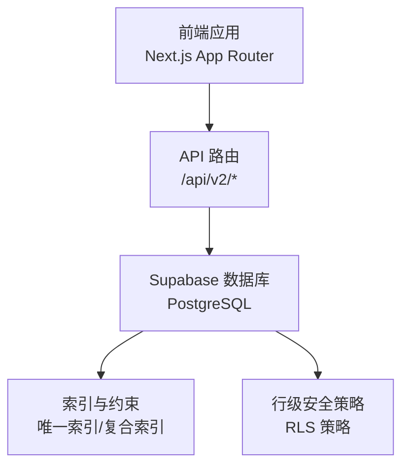
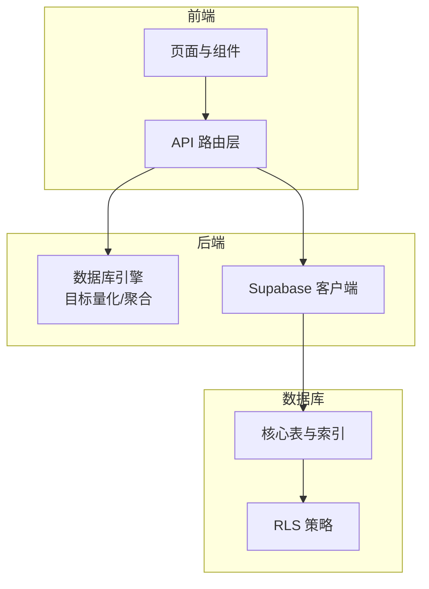
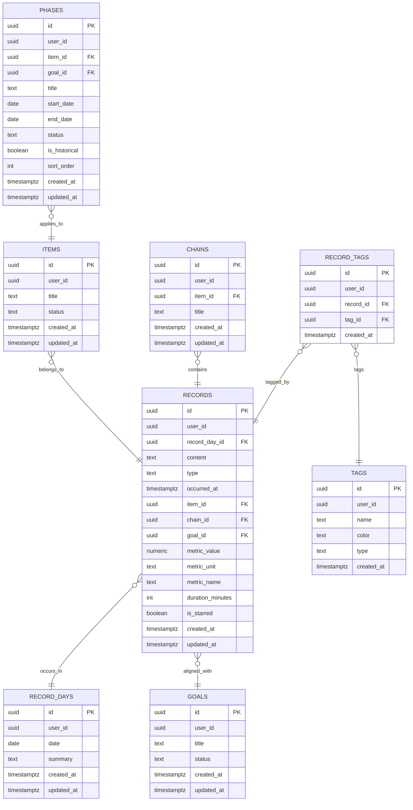
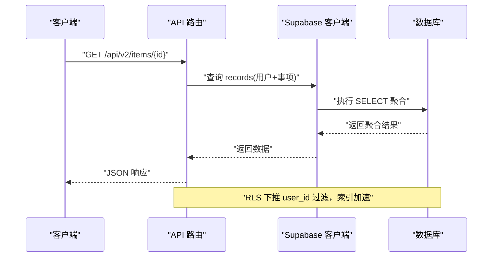
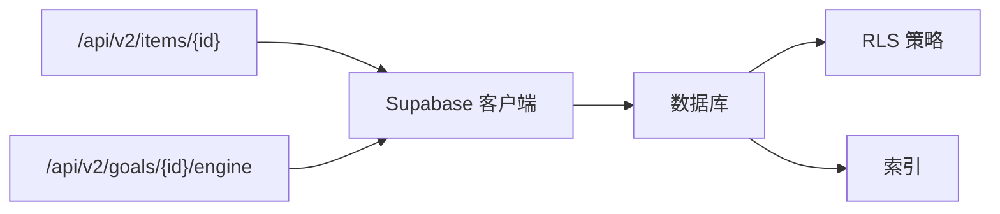

# 性能优化策略

<cite>
**本文引用的文件**
- [README.md](file://README.md)
- [DATA_RULES.md](file://DATA_RULES.md)
- [001_init_core_tables.sql](file://sql/保留存档sql/sql1.0.1/001_init_core_tables.sql)
- [002_enable_rls_core_tables.sql](file://sql/保留存档sql/sql1.0.1/002_enable_rls_core_tables.sql)
- [001_teto_1_3_records_model.sql](file://sql/001_teto_1_3_records_model.sql)
- [003_teto_1_4_phases_and_goals.sql](file://sql/003_teto_1_4_phases_and_goals.sql)
- [007_record_metric_fields.sql](file://sql/007_record_metric_fields.sql)
- [client.ts](file://src/lib/supabase/client.ts)
- [server.ts](file://src/lib/supabase/server.ts)
- [route.ts（目标引擎）](file://src/app/api\v2\goals\{id}\engine\route.ts)
- [route.ts（事项聚合）](file://src/app/api\v2\items\{id}\route.ts)
- [goal-engine.ts](file://src/lib/db/goal-engine.ts)
- [test-api-performance.js](file://test/scripts/test-api-performance.js)
- [test-stats-api.ps1](file://test/scripts/test-stats-api.ps1)
</cite>

## 目录
1. [简介](#简介)
2. [项目结构](#项目结构)
3. [核心组件](#核心组件)
4. [架构总览](#架构总览)
5. [详细组件分析](#详细组件分析)
6. [依赖关系分析](#依赖关系分析)
7. [性能考量](#性能考量)
8. [故障排除指南](#故障排除指南)
9. [结论](#结论)
10. [附录](#附录)

## 简介
本文件面向TETO数据库性能优化，聚焦索引设计策略、查询优化技术、缓存机制、行级安全策略（RLS）影响与优化、慢查询分析、执行计划优化、索引使用建议、数据分区、查询重写与连接优化、监控指标、性能测试与基准测试方法、并发控制与锁机制、事务优化策略，以及生产环境最佳实践与故障排除指南。文档以仓库中的SQL建模、RLS策略、API路由与数据库引擎实现为依据，结合实际查询路径进行深入分析，并提供可操作的优化建议。

## 项目结构
- 数据库层：采用PostgreSQL（Supabase托管），通过SQL脚本定义表结构、索引与RLS策略。
- 应用层：Next.js应用，通过Supabase客户端访问数据库，提供REST API接口。
- 测试层：包含API性能测试脚本，用于评估查询与聚合性能。

**章节来源**
- [README.md: 13-21:13-21](file://README.md#L13-L21)
- [README.md: 63-90:63-90](file://README.md#L63-L90)

## 核心组件
- 数据模型与索引
  - 1.3/1.4模型引入record_days、items、chains、records、tags、record_tags等表，配套复合索引与唯一约束，支撑按用户+日期、用户+事项、用户+阶段等高效过滤。
  - 关键索引包括：record_days(user_id,date)、records(user_id,record_day_id)、records(user_id,occurred_at)、records(item_id)、records(chain_id)、items(user_id,status)、phases(user_id,item_id)、records(goal_id)等。
- 行级安全策略（RLS）
  - 对所有核心表启用RLS，策略以user_id与auth.uid()匹配，确保数据隔离；部分子表通过父表存在性检查实现间接授权。
- 查询与聚合
  - API路由与数据库引擎实现围绕“按用户+事项+日期范围”的组合过滤，典型场景包括事项级聚合、阶段内聚合、目标量化引擎计算。
- 客户端与服务端访问
  - 浏览器端使用匿名密钥，服务端在开发模式下可使用服务角色密钥绕过RLS，便于测试与后台任务。

**章节来源**
- [001_teto_1_3_records_model.sql: 18-300:18-300](file://sql/001_teto_1_3_records_model.sql#L18-L300)
- [003_teto_1_4_phases_and_goals.sql: 16-130:16-130](file://sql/003_teto_1_4_phases_and_goals.sql#L16-L130)
- [002_enable_rls_core_tables.sql: 10-298:10-298](file://sql/保留存档sql/sql1.0.1/002_enable_rls_core_tables.sql#L10-L298)
- [server.ts: 6-35:6-35](file://src/lib/supabase/server.ts#L6-L35)
- [client.ts: 3-8:3-8](file://src/lib/supabase/client.ts#L3-L8)

## 架构总览
TETO采用“前端API路由 -> Supabase查询 -> 数据库索引/RLS”的典型三层架构。查询路径围绕“用户维度 + 日期维度 + 事项/阶段维度”展开，索引与RLS共同决定查询性能与安全性。

**图示来源**
- [route.ts（目标引擎）: 9-34:9-34](file://src/app/api\v2\goals\{id}\engine\route.ts#L9-L34)
- [route.ts（事项聚合）: 99-211:99-211](file://src/app/api\v2\items\{id}\route.ts#L99-L211)
- [goal-engine.ts: 49-294:49-294](file://src/lib/db/goal-engine.ts#L49-L294)
- [001_teto_1_3_records_model.sql: 282-300:282-300](file://sql/001_teto_1_3_records_model.sql#L282-L300)
- [003_teto_1_4_phases_and_goals.sql: 117-130:117-130](file://sql/003_teto_1_4_phases_and_goals.sql#L117-L130)

## 详细组件分析

### 数据模型与索引设计
- 表与关系
  - record_days：按用户+日期唯一，作为records的时间容器。
  - items/chains：事项与事件链，支撑记录的上下文组织。
  - records：最小事实单元，包含成本、时长、指标值与单位等。
  - tags/record_tags：记录与标签多对多，支持标签维度聚合。
  - goals/phases：目标与阶段，支撑目标量化引擎与阶段聚合。
- 索引策略
  - 复合索引优先：user_id+date、user_id+record_day_id、user_id+occurred_at、user_id+status等，覆盖高频过滤条件。
  - 外键索引：item_id、chain_id、goal_id等，降低连接代价。
  - 唯一约束：避免重复数据，减少扫描范围。
- RLS与索引协同
  - RLS强制按user_id过滤，索引可显著提升策略执行效率；同时需避免回表过多导致策略评估开销上升。

**图示来源**
- [001_teto_1_3_records_model.sql: 18-109:18-109](file://sql/001_teto_1_3_records_model.sql#L18-L109)
- [003_teto_1_4_phases_and_goals.sql: 16-61:16-61](file://sql/003_teto_1_4_phases_and_goals.sql#L16-L61)

**章节来源**
- [001_teto_1_3_records_model.sql: 18-300:18-300](file://sql/001_teto_1_3_records_model.sql#L18-L300)
- [003_teto_1_4_phases_and_goals.sql: 16-130:16-130](file://sql/003_teto_1_4_phases_and_goals.sql#L16-L130)

### 行级安全策略（RLS）对性能的影响与优化
- 影响
  - RLS在每次DML/SELECT上执行策略检查，增加CPU与I/O开销；在高并发写入或复杂子查询中尤为明显。
  - 子表RLS通过父表存在性检查（EXISTS）实现，可能引入额外的连接/子查询成本。
- 优化建议
  - 尽可能将RLS过滤条件下推至索引可覆盖的谓词（如user_id），减少策略评估范围。
  - 使用服务角色密钥仅在受控后台任务中绕过RLS，避免在常规API路径中滥用。
  - 对热点表建立合适的复合索引，降低RLS评估时的回表与扫描成本。

**章节来源**
- [002_enable_rls_core_tables.sql: 10-298:10-298](file://sql/保留存档sql/sql1.0.1/002_enable_rls_core_tables.sql#L10-L298)
- [server.ts: 13-15:13-15](file://src/lib/supabase/server.ts#L13-L15)

### 关键查询路径与性能瓶颈
- 事项级聚合
  - 路径：records(user_id=item_id) -> 聚合成本、时长、指标。
  - 瓶颈：无索引或索引不匹配导致全表扫描；大量小记录聚合引发内存与序列化开销。
  - 优化：确保records(user_id,item_id)与records(user_id,occurred_at)索引存在；限制返回字段与数量。
- 阶段内聚合
  - 路径：先查record_days(user_id,date范围)获取day_ids，再查records(record_day_id in ...)。
  - 瓶颈：日期范围过大导致day_ids过多，in列表膨胀；子查询EXISTS成本高。
  - 优化：合理限定日期范围；使用JOIN替代EXISTS；必要时分页或分段聚合。
- 目标量化引擎
  - 路径：按goal配置过滤records(metric_name/unit)，并按日期范围求和。
  - 瓶颈：多次区间求和与日期转换；JS侧reduce求和替代SUM聚合。
  - 优化：在数据库侧使用SUM与WHERE条件组合；为metric_name/metric_unit建立索引；缓存近期聚合结果。

**图示来源**
- [route.ts（事项聚合）: 102-143:102-143](file://src/app/api\v2\items\{id}\route.ts#L102-L143)
- [001_teto_1_3_records_model.sql: 285-289:285-289](file://sql/001_teto_1_3_records_model.sql#L285-L289)

**章节来源**
- [route.ts（事项聚合）: 102-211:102-211](file://src/app/api\v2\items\{id}\route.ts#L102-L211)
- [goal-engine.ts: 234-294:234-294](file://src/lib/db/goal-engine.ts#L234-L294)

### 慢查询分析与执行计划优化
- 慢查询识别
  - 使用Supabase SQL Editor执行EXPLAIN/EXPLAIN ANALYZE，观察是否命中索引、是否存在Nested Loop/Hash Join、是否有排序/临时表。
- 优化手段
  - 索引覆盖：WHERE + ORDER BY + LIMIT的组合尽量走索引。
  - 查询重写：将IN子查询改写为JOIN，减少EXISTS成本。
  - 分页与分段：大范围日期聚合拆分为多段，降低单次查询负载。
  - 聚合下推：在数据库侧完成SUM/COUNT，避免JS侧循环求和。

**章节来源**
- [goal-engine.ts: 258-293:258-293](file://src/lib/db/goal-engine.ts#L258-L293)

### 缓存机制与数据分区
- 缓存策略
  - 读多写少的聚合结果（如事项/阶段/目标指标）可缓存于应用层或边缘缓存（CDN/Redis），设置合理TTL。
  - 对热点API响应进行压缩与ETag校验，减少网络与数据库压力。
- 数据分区
  - 按record_day_id或occurred_at进行水平分区，缩小扫描范围；对历史冷数据进行归档或只读副本分离。

**章节来源**
- [DATA_RULES.md: 164-166:164-166](file://DATA_RULES.md#L164-L166)

### 查询重写与连接优化
- 重写建议
  - 将“先子查询取ID，再主查询IN”的模式改为JOIN，减少中间结果集与EXISTS成本。
  - 对频繁出现的过滤条件（user_id、item_id、date范围）建立复合索引。
- 连接优化
  - 使用EXISTS替代IN（当子查询结果集较大时）；使用EXPLAIN确认连接顺序与算法。
  - 避免SELECT *，仅选择必要字段，减少I/O与序列化。

**章节来源**
- [route.ts（事项聚合）: 158-176:158-176](file://src/app/api\v2\items\{id}\route.ts#L158-L176)
- [001_teto_1_3_records_model.sql: 285-289:285-289](file://sql/001_teto_1_3_records_model.sql#L285-L289)

### 监控指标与性能测试
- 监控指标
  - 查询延迟（p50/p95/p99）、QPS、错误率、RLS策略命中率、索引使用率、数据库连接数与排队等待时间。
- 性能测试
  - 使用提供的性能测试脚本模拟并发请求，评估不同查询路径在不同数据规模下的表现。
  - 基准测试：固定数据集上对比优化前后指标变化，形成回归基线。

**章节来源**
- [test-api-performance.js](file://test/scripts/test-api-performance.js)
- [test-stats-api.ps1](file://test/scripts/test-stats-api.ps1)

### 并发控制、锁机制与事务优化
- 并发控制
  - 利用PostgreSQL默认隔离级别与行级锁；对高并发写入场景，采用批量提交与幂等写入策略。
- 锁机制
  - RLS与索引共同作用，避免不必要的行扫描；对UPDATE/DELETE使用WHERE条件精确锁定。
- 事务优化
  - 将多个相关写操作放入单事务，减少锁持有时间；对只读查询使用快照隔离，避免长事务阻塞。

**章节来源**
- [001_teto_1_3_records_model.sql: 115-189:115-189](file://sql/001_teto_1_3_records_model.sql#L115-L189)

## 依赖关系分析
- API路由依赖Supabase客户端与数据库引擎模块。
- 数据库引擎依赖RLS与索引设计，确保查询在策略与索引双重保障下高效运行。
- RLS策略依赖auth.uid()与user_id，需配合索引提升策略评估效率。

**图示来源**
- [route.ts（事项聚合）: 1-97:1-97](file://src/app/api\v2\items\{id}\route.ts#L1-L97)
- [route.ts（目标引擎）: 1-34:1-34](file://src/app/api\v2\goals\{id}\engine\route.ts#L1-L34)
- [server.ts: 6-35:6-35](file://src/lib/supabase/server.ts#L6-L35)

**章节来源**
- [route.ts（事项聚合）: 1-97:1-97](file://src/app/api\v2\items\{id}\route.ts#L1-L97)
- [route.ts（目标引擎）: 1-34:1-34](file://src/app/api\v2\goals\{id}\engine\route.ts#L1-L34)

## 性能考量
- 索引设计
  - 优先满足高频过滤条件（user_id、date、item_id、chain_id、goal_id）。
  - 对聚合字段（metric_value、duration_minutes）建立合适索引，避免隐式转换导致的索引失效。
- RLS与索引协同
  - 将RLS过滤条件纳入索引谓词，减少策略评估成本。
- 查询路径
  - 优先使用复合索引覆盖的WHERE条件；避免在WHERE中对列进行函数变换。
- 缓存与分区
  - 对热点聚合结果进行缓存；对历史数据进行分区或归档，降低热数据扫描范围。

## 故障排除指南
- 常见问题
  - 查询缓慢：检查EXPLAIN输出，确认索引是否被使用；排查RLS导致的额外开销。
  - RLS报错或权限异常：确认auth.uid()与user_id匹配；检查策略定义与触发器。
  - 聚合结果异常：核对日期边界与occurred_at/record_days的关系；检查NULL值过滤条件。
- 排查步骤
  - 使用SQL Editor执行EXPLAIN/EXPLAIN ANALYZE定位瓶颈。
  - 逐步简化WHERE条件，确认索引命中情况。
  - 对比优化前后的QPS与延迟指标，验证改进效果。

**章节来源**
- [002_enable_rls_core_tables.sql: 10-298:10-298](file://sql/保留存档sql/sql1.0.1/002_enable_rls_core_tables.sql#L10-L298)
- [goal-engine.ts: 234-294:234-294](file://src/lib/db/goal-engine.ts#L234-L294)

## 结论
TETO的数据库层通过清晰的表结构、完善的索引与RLS策略，为高性能查询提供了基础。针对高频查询路径（事项/阶段/目标聚合），建议重点优化索引覆盖、查询重写与缓存策略；在RLS与索引协同的前提下，进一步通过分区与并发控制提升整体吞吐与稳定性。结合性能测试与监控指标，持续迭代优化方案，确保生产环境的可靠性与可扩展性。

## 附录
- 环境与部署
  - 本地开发与生产环境的Supabase密钥配置差异，开发模式可使用服务角色密钥绕过RLS，便于测试。
- 数据规则
  - 明确统计口径与数据真源，避免重复统计与歧义，有助于减少不必要的聚合与查询。

**章节来源**
- [README.md: 22-53:22-53](file://README.md#L22-L53)
- [DATA_RULES.md: 1-174:1-174](file://DATA_RULES.md#L1-L174)