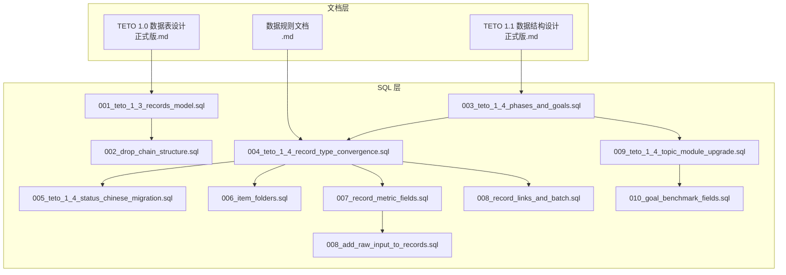
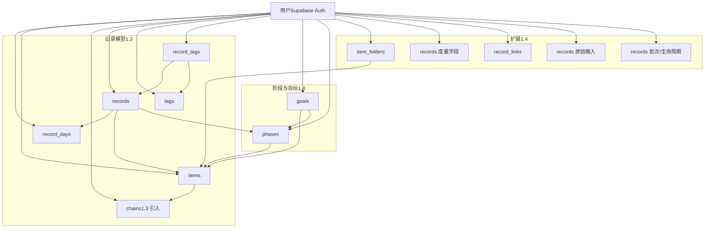
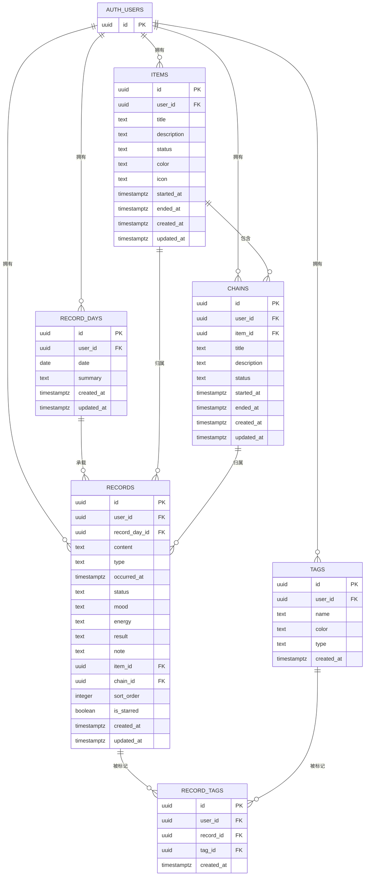
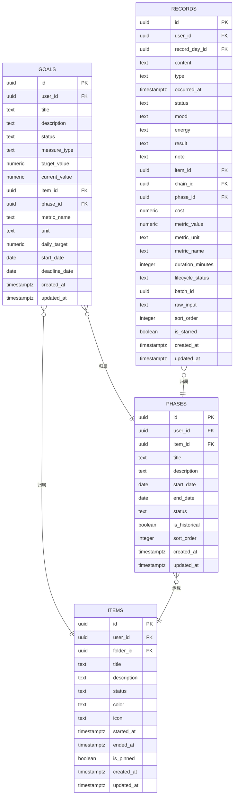
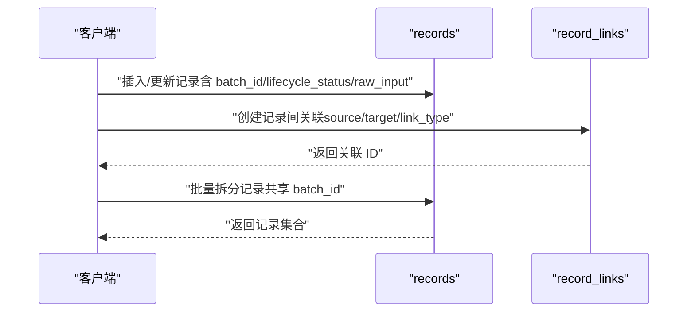
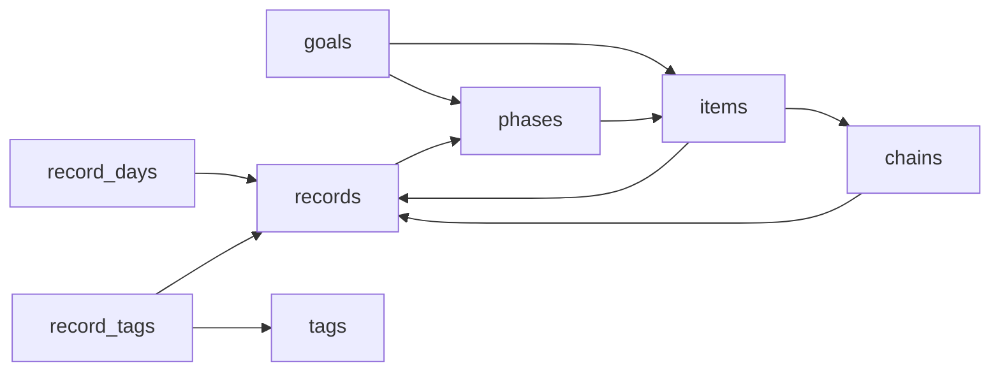

# 数据库设计

<cite>
**本文引用的文件**
- [《TETO 1.0 数据表设计（正式版）》.md](file://docs/10-版本归档/TETO 1.0.0/《TETO 1.0 数据表设计（正式版）》.md)
- [《TETO 1.1 数据结构设计正式版》.md](file://docs/10-版本归档/TETO 1.1.0/TETO 1.1 数据结构设计正式版.md)
- [数据规则文档.md](file://DATA_RULES.md)
- [001_teto_1_3_records_model.sql](file://sql/001_teto_1_3_records_model.sql)
- [002_drop_chain_structure.sql](file://sql/002_drop_chain_structure.sql)
- [003_teto_1_4_phases_and_goals.sql](file://sql/003_teto_1_4_phases_and_goals.sql)
- [004_teto_1_4_record_type_convergence.sql](file://sql/004_teto_1_4_record_type_convergence.sql)
- [005_teto_1_4_status_chinese_migration.sql](file://sql/005_teto_1_4_status_chinese_migration.sql)
- [006_item_folders.sql](file://sql/006_item_folders.sql)
- [007_record_metric_fields.sql](file://sql/007_record_metric_fields.sql)
- [008_add_raw_input_to_records.sql](file://sql/008_add_raw_input_to_records.sql)
- [008_record_links_and_batch.sql](file://sql/008_record_links_and_batch.sql)
- [009_teto_1_4_topic_module_upgrade.sql](file://sql/009_teto_1_4_topic_module_upgrade.sql)
- [010_goal_benchmark_fields.sql](file://sql/010_goal_benchmark_fields.sql)
</cite>

## 目录
1. [简介](#简介)
2. [项目结构](#项目结构)
3. [核心组件](#核心组件)
4. [架构总览](#架构总览)
5. [详细组件分析](#详细组件分析)
6. [依赖分析](#依赖分析)
7. [性能考虑](#性能考虑)
8. [故障排查指南](#故障排查指南)
9. [结论](#结论)
10. [附录](#附录)

## 简介
本文件面向 TETO 数据库设计，系统化梳理实体关系模型、表结构定义、字段约束与索引设计，给出数据模型演进历史、版本化管理策略与迁移脚本规范，解释主键/外键关系、数据完整性约束与业务规则，提供数据库架构图与实体关系图，说明数据访问模式、缓存策略与性能考量，覆盖数据生命周期管理、保留策略与归档规则，并阐述数据安全、隐私要求与访问控制，最后提供数据迁移路径与版本管理指南。

## 项目结构
- 文档层：版本化数据设计文档与规则文档，定义实体、字段、约束与业务规则。
- SQL 层：版本化迁移脚本，按版本演进逐步构建与调整表结构、触发器、RLS 策略与索引。
- 应用层：前端与 API 层通过 Supabase 认证与行级安全策略实现用户隔离与权限控制。

图表来源
- [《TETO 1.0 数据表设计（正式版）》.md:1-1105](file://docs/10-版本归档/TETO 1.0.0/《TETO 1.0 数据表设计（正式版）》.md#L1-L1105)
- [《TETO 1.1 数据结构设计正式版》.md:1-891](file://docs/10-版本归档/TETO 1.1.0/TETO 1.1 数据结构设计正式版.md#L1-L891)
- [数据规则文档.md:1-174](file://DATA_RULES.md#L1-L174)
- [001_teto_1_3_records_model.sql:1-300](file://sql/001_teto_1_3_records_model.sql#L1-L300)
- [002_drop_chain_structure.sql:1-49](file://sql/002_drop_chain_structure.sql#L1-L49)
- [003_teto_1_4_phases_and_goals.sql:1-130](file://sql/003_teto_1_4_phases_and_goals.sql#L1-L130)
- [004_teto_1_4_record_type_convergence.sql:1-20](file://sql/004_teto_1_4_record_type_convergence.sql#L1-L20)
- [005_teto_1_4_status_chinese_migration.sql:1-38](file://sql/005_teto_1_4_status_chinese_migration.sql#L1-L38)
- [006_item_folders.sql:1-38](file://sql/006_item_folders.sql#L1-L38)
- [007_record_metric_fields.sql:1-20](file://sql/007_record_metric_fields.sql#L1-L20)
- [008_add_raw_input_to_records.sql:1-12](file://sql/008_add_raw_input_to_records.sql#L1-L12)
- [008_record_links_and_batch.sql:1-32](file://sql/008_record_links_and_batch.sql#L1-L32)
- [009_teto_1_4_topic_module_upgrade.sql:1-97](file://sql/009_teto_1_4_topic_module_upgrade.sql#L1-L97)
- [010_goal_benchmark_fields.sql:1-40](file://sql/010_goal_benchmark_fields.sql#L1-L40)

章节来源
- [《TETO 1.0 数据表设计（正式版）》.md:1-1105](file://docs/10-版本归档/TETO 1.0.0/《TETO 1.0 数据表设计（正式版）》.md#L1-L1105)
- [《TETO 1.1 数据结构设计正式版》.md:1-891](file://docs/10-版本归档/TETO 1.1.0/TETO 1.1 数据结构设计正式版.md#L1-L891)
- [数据规则文档.md:1-174](file://DATA_RULES.md#L1-L174)

## 核心组件
- 记录模型（TETO 1.3）：record_days、items、chains（1.3 引入）、records、tags、record_tags。
- 阶段与目标（TETO 1.4）：goals、phases，并为 items、records、goals、phases 增加外键与字段。
- 事项文件夹（TETO 1.4）：item_folders，items 增加 folder_id。
- 记录度量字段（TETO 1.4）：records 增加 metric_value、metric_unit、metric_name、duration_minutes。
- 原始输入与链接（TETO 1.4）：records 增加 raw_input；新增 record_links；records 增加 batch_id、lifecycle_status。
- 状态中文化（TETO 1.4）：goals、phases 的 status 英文迁移到中文。
- 链路一致性与更新时间（TETO 1.3）：触发器保障 chain/item 一致性与 updated_at 自动更新。
- 行级安全（RLS）：所有核心表启用 RLS 并按 user_id 控制访问。

章节来源
- [001_teto_1_3_records_model.sql:1-300](file://sql/001_teto_1_3_records_model.sql#L1-L300)
- [002_drop_chain_structure.sql:1-49](file://sql/002_drop_chain_structure.sql#L1-L49)
- [003_teto_1_4_phases_and_goals.sql:1-130](file://sql/003_teto_1_4_phases_and_goals.sql#L1-L130)
- [004_teto_1_4_record_type_convergence.sql:1-20](file://sql/004_teto_1_4_record_type_convergence.sql#L1-L20)
- [005_teto_1_4_status_chinese_migration.sql:1-38](file://sql/005_teto_1_4_status_chinese_migration.sql#L1-L38)
- [006_item_folders.sql:1-38](file://sql/006_item_folders.sql#L1-L38)
- [007_record_metric_fields.sql:1-20](file://sql/007_record_metric_fields.sql#L1-L20)
- [008_add_raw_input_to_records.sql:1-12](file://sql/008_add_raw_input_to_records.sql#L1-L12)
- [008_record_links_and_batch.sql:1-32](file://sql/008_record_links_and_batch.sql#L1-L32)
- [009_teto_1_4_topic_module_upgrade.sql:1-97](file://sql/009_teto_1_4_topic_module_upgrade.sql#L1-L97)
- [010_goal_benchmark_fields.sql:1-40](file://sql/010_goal_benchmark_fields.sql#L1-L40)

## 架构总览
TETO 数据库以“用户隔离 + 行级安全 + 事件驱动（触发器）+ 版本化迁移”为核心架构。用户通过 Supabase 认证，RLS 策略确保每张表仅对 auth.uid() 对应用户可见；通过迁移脚本按版本演进，逐步引入阶段/目标、文件夹、度量字段、原始输入与记录链接等能力；触发器保障数据一致性与审计字段更新。

图表来源
- [001_teto_1_3_records_model.sql:1-300](file://sql/001_teto_1_3_records_model.sql#L1-L300)
- [002_drop_chain_structure.sql:1-49](file://sql/002_drop_chain_structure.sql#L1-L49)
- [003_teto_1_4_phases_and_goals.sql:1-130](file://sql/003_teto_1_4_phases_and_goals.sql#L1-L130)
- [006_item_folders.sql:1-38](file://sql/006_item_folders.sql#L1-L38)
- [007_record_metric_fields.sql:1-20](file://sql/007_record_metric_fields.sql#L1-L20)
- [008_add_raw_input_to_records.sql:1-12](file://sql/008_add_raw_input_to_records.sql#L1-L12)
- [008_record_links_and_batch.sql:1-32](file://sql/008_record_links_and_batch.sql#L1-L32)
- [009_teto_1_4_topic_module_upgrade.sql:1-97](file://sql/009_teto_1_4_topic_module_upgrade.sql#L1-L97)
- [010_goal_benchmark_fields.sql:1-40](file://sql/010_goal_benchmark_fields.sql#L1-L40)

## 详细组件分析

### 记录模型（TETO 1.3）：record_days、items、chains、records、tags、record_tags
- 主键与外键
  - record_days：主键 id，UNIQUE(user_id, date)。
  - items：主键 id，外键 user_id → auth.users(id)。
  - chains：主键 id，外键 item_id → items(id)，ON DELETE CASCADE。
  - records：主键 id，外键 record_day_id → record_days(id)，ON DELETE CASCADE；可选外键 item_id → items(id)；可选外键 chain_id → chains(id)；ON DELETE SET NULL。
  - tags：主键 id，外键 user_id → auth.users(id)。
  - record_tags：主键 id，双外键 record_id → records(id)、tag_id → tags(id)，ON DELETE CASCADE；UNIQUE(record_id, tag_id)。
- 约束与检查
  - items.status ∈ {'活跃','推进中','放缓','停滞','已完成','已搁置'}。
  - chains.status ∈ {'进行中','已完成','已搁置'}。
  - records.type ∈ {'发生','计划','情绪','想法','花费','总结','结果'}（1.4 收敛为 4 类）。
- 触发器
  - chain/item 一致性触发器：确保 records.chain_id 与 item_id 一致，不一致时报错。
  - updated_at 自动更新触发器：所有表在 UPDATE 时自动设置 updated_at。
- RLS
  - 所有表启用 RLS，策略按 user_id 控制 SELECT/INSERT/UPDATE/DELETE。
- 索引
  - record_days：(user_id, date)。
  - records：(user_id, record_day_id)、(user_id, occurred_at)、item_id、chain_id。
  - items：(user_id, status)。
  - chains：(user_id, item_id)。
  - record_tags：record_id、tag_id。

图表来源
- [001_teto_1_3_records_model.sql:1-300](file://sql/001_teto_1_3_records_model.sql#L1-L300)

章节来源
- [001_teto_1_3_records_model.sql:1-300](file://sql/001_teto_1_3_records_model.sql#L1-L300)

### 阶段与目标（TETO 1.4）：goals、phases、items、records
- 新增表与字段
  - goals：主键 id，外键 user_id → auth.users(id)，新增 measure_type、target_value、current_value、item_id、phase_id、metric_name、unit、daily_target、start_date、deadline_date。
  - phases：主键 id，外键 user_id → auth.users(id)，外键 item_id → items(id)，ON DELETE CASCADE；移除 goal_id（避免双向绑定）。
  - items：新增 folder_id → item_folders(id)；新增 is_pinned。
  - records：新增 phase_id → phases(id)；新增 cost、lifecycle_status。
- 约束与检查
  - goals.measure_type ∈ {'boolean','numeric'}。
  - goals.status ∈ {'进行中','已达成','已放弃','已暂停'}（1.4 状态中文化）。
  - phases.status ∈ {'进行中','已结束','停滞'}。
  - records.lifecycle_status ∈ {'active','completed','postponed','cancelled'}。
- RLS 与索引
  - goals、phases 启用 RLS；新增索引：idx_goals_user_status、idx_goals_item、idx_goals_phase、idx_phases_user_item、idx_phases_item、idx_records_phase、idx_items_pinned、idx_item_folders_user、idx_items_folder。

图表来源
- [003_teto_1_4_phases_and_goals.sql:1-130](file://sql/003_teto_1_4_phases_and_goals.sql#L1-L130)
- [009_teto_1_4_topic_module_upgrade.sql:1-97](file://sql/009_teto_1_4_topic_module_upgrade.sql#L1-L97)
- [010_goal_benchmark_fields.sql:1-40](file://sql/010_goal_benchmark_fields.sql#L1-L40)

章节来源
- [003_teto_1_4_phases_and_goals.sql:1-130](file://sql/003_teto_1_4_phases_and_goals.sql#L1-L130)
- [009_teto_1_4_topic_module_upgrade.sql:1-97](file://sql/009_teto_1_4_topic_module_upgrade.sql#L1-L97)
- [010_goal_benchmark_fields.sql:1-40](file://sql/010_goal_benchmark_fields.sql#L1-L40)

### 事项文件夹（TETO 1.4）：item_folders、items
- 新增 item_folders 表，items 新增 folder_id 外键。
- RLS 与索引：item_folders 启用 RLS；索引 idx_item_folders_user、idx_items_folder。

章节来源
- [006_item_folders.sql:1-38](file://sql/006_item_folders.sql#L1-L38)

### 记录度量字段（TETO 1.4）：records
- 新增 metric_value、metric_unit、metric_name、duration_minutes，用于结构化统计与分析。
- 索引策略：字段仅新增，索引留待后续确认查询路径后再补。

章节来源
- [007_record_metric_fields.sql:1-20](file://sql/007_record_metric_fields.sql#L1-L20)

### 原始输入与链接（TETO 1.4）：records、record_links
- records 新增 raw_input（原始自然语言输入）。
- 新增 record_links 表，支持 completes、derived_from、postponed_from、related_to 四种类型；records 新增 batch_id、lifecycle_status。
- 索引：idx_record_links_source、idx_record_links_target、idx_records_batch_id。

图表来源
- [008_record_links_and_batch.sql:1-32](file://sql/008_record_links_and_batch.sql#L1-L32)
- [008_add_raw_input_to_records.sql:1-12](file://sql/008_add_raw_input_to_records.sql#L1-L12)

章节来源
- [008_record_links_and_batch.sql:1-32](file://sql/008_record_links_and_batch.sql#L1-L32)
- [008_add_raw_input_to_records.sql:1-12](file://sql/008_add_raw_input_to_records.sql#L1-L12)

### 状态中文化（TETO 1.4）：goals、phases
- 将 status 从英文迁移为中文，并更新 CHECK 约束与默认值。
- goals：进行中/已达成/已放弃/已暂停。
- phases：进行中/已结束/停滞。

章节来源
- [005_teto_1_4_status_chinese_migration.sql:1-38](file://sql/005_teto_1_4_status_chinese_migration.sql#L1-L38)

### 记录类型收敛（TETO 1.4）：records
- 新增 cost 字段与索引；将旧类型（情绪/花费/结果）收敛为“发生”；type 约束收敛为 4 个值。

章节来源
- [004_teto_1_4_record_type_convergence.sql:1-20](file://sql/004_teto_1_4_record_type_convergence.sql#L1-L20)

### 链路一致性与更新时间（TETO 1.3）
- 触发器：check_record_chain_item_consistency（确保 chain/item 一致性）；set_updated_at（自动更新 updated_at）。
- 1.3 引入 chains，1.3 → 1.4 迁移中删除 chains 结构，清理触发器、外键、索引与 RLS。

章节来源
- [001_teto_1_3_records_model.sql:1-300](file://sql/001_teto_1_3_records_model.sql#L1-L300)
- [002_drop_chain_structure.sql:1-49](file://sql/002_drop_chain_structure.sql#L1-L49)

## 依赖分析
- 版本依赖
  - 1.0 设计奠定基础实体与约束。
  - 1.1 设计引入任务/目标/项目/导入等概念，为 1.3 的记录模型打基础。
  - 1.3 引入 record_days/items/chains/records/tags/record_tags，形成“按天容器-事项-事件链-记录-标签”的核心模型。
  - 1.4 在 1.3 基础上引入 goals/phases，重构 items/records 的归属关系，新增文件夹、度量字段、原始输入与记录链接。
- 外键与级联
  - record_days → records（ON DELETE CASCADE）。
  - items → chains（ON DELETE CASCADE）。
  - records → items（ON DELETE SET NULL）。
  - records → phases（ON DELETE SET NULL）。
  - record_tags → records/tags（ON DELETE CASCADE）。
  - goals → items/phases（ON DELETE SET NULL/CASCADE）。
  - phases → items（ON DELETE CASCADE）。
- 约束与检查
  - items/status、chains/status、records/type、goals/status、phases/status、goals/measure_type、records/lifecycle_status。
- RLS
  - 所有核心表启用 RLS，策略按 user_id 控制访问。

图表来源
- [001_teto_1_3_records_model.sql:1-300](file://sql/001_teto_1_3_records_model.sql#L1-L300)
- [003_teto_1_4_phases_and_goals.sql:1-130](file://sql/003_teto_1_4_phases_and_goals.sql#L1-L130)
- [009_teto_1_4_topic_module_upgrade.sql:1-97](file://sql/009_teto_1_4_topic_module_upgrade.sql#L1-L97)

章节来源
- [001_teto_1_3_records_model.sql:1-300](file://sql/001_teto_1_3_records_model.sql#L1-L300)
- [003_teto_1_4_phases_and_goals.sql:1-130](file://sql/003_teto_1_4_phases_and_goals.sql#L1-L130)
- [009_teto_1_4_topic_module_upgrade.sql:1-97](file://sql/009_teto_1_4_topic_module_upgrade.sql#L1-L97)

## 性能考虑
- 索引策略
  - 按用户与时间维度建立复合索引：record_days(user_id,date)、records(user_id,record_day_id)、records(user_id,occurred_at)。
  - 按外键建立单列索引：records(item_id)、records(chain_id)、records(phase_id)、record_tags(record_id)、record_tags(tag_id)、items(user_id,status)、chains(user_id,item_id)、item_folders(user_id)、items(folder_id)。
  - 部分索引：items(is_pinned=true)、records(cost IS NOT NULL)、records(batch_id IS NOT NULL)。
- 查询路径
  - 优先使用 (user_id, date)、(user_id, record_day_id)、(user_id, occurred_at) 等复合条件。
  - 使用 lifecycle_status、lifecycle_status、status 等过滤字段减少扫描范围。
- 触发器与更新
  - updated_at 自动更新减少应用层负担，但注意批量更新场景的开销。
- 缓存策略
  - 建议在应用层对热点查询（如今日记录、事项列表、阶段/目标概览）进行缓存，结合 updated_at 做失效策略。
  - 对高频统计（如最近 N 日趋势）建议缓存聚合结果，定期刷新。

## 故障排查指南
- 数据不显示或报权限错误
  - 检查 RLS 策略是否启用，确认 auth.uid() 与 user_id 一致。
  - 确认用户是否登录且 token 正确。
- 记录无法删除或更新
  - 检查是否存在外键约束（如 records → record_days、chains → items）。
  - 确认是否使用正确的 CASCADE/SET NULL 策略。
- 记录类型不正确或报错
  - 检查 records.type 的 CHECK 约束是否被修改；1.4 已收敛为 4 个值。
- 链路一致性错误
  - 1.3 引入的 chain/item 一致性触发器在 1.4 已删除；如仍有报错，确认是否残留旧触发器。
- 状态值异常
  - 1.4 已将 goals/phases 的 status 中文化；检查是否仍使用英文值。
- 批量导入冲突
  - 检查 batch_id 与 lifecycle_status 的使用，确认是否正确设置。

章节来源
- [001_teto_1_3_records_model.sql:1-300](file://sql/001_teto_1_3_records_model.sql#L1-L300)
- [002_drop_chain_structure.sql:1-49](file://sql/002_drop_chain_structure.sql#L1-L49)
- [005_teto_1_4_status_chinese_migration.sql:1-38](file://sql/005_teto_1_4_status_chinese_migration.sql#L1-L38)
- [008_record_links_and_batch.sql:1-32](file://sql/008_record_links_and_batch.sql#L1-L32)

## 结论
TETO 数据库设计以“用户隔离 + 行级安全 + 事件驱动 + 版本化迁移”为核心，通过 TETO 1.3 的记录模型与 TETO 1.4 的阶段/目标、文件夹、度量字段、原始输入与记录链接，构建了从“按天容器-事项-记录-标签”到“目标-阶段-事项-记录”的完整闭环。版本化迁移脚本确保了演进过程中的数据安全与一致性，索引与查询路径优化兼顾了性能与可维护性。建议在应用层配合缓存与批量处理策略，进一步提升用户体验与系统吞吐。

## 附录

### 数据模型演进历史与版本化管理
- TETO 1.0：奠定 profiles/daily_records/daily_record_items/diary_reviews/projects/project_logs 的基础模型与约束。
- TETO 1.1：引入任务/目标/项目/导入等概念，为后续记录模型与阶段/目标奠定基础。
- TETO 1.3：建立 record_days/items/chains/records/tags/record_tags 的核心记录模型，引入触发器与 RLS。
- TETO 1.4：引入 goals/phases，重构 items/records 的归属关系；新增文件夹、度量字段、原始输入与记录链接；状态中文化；删除 chains 结构。

章节来源
- [《TETO 1.0 数据表设计（正式版）》.md:1-1105](file://docs/10-版本归档/TETO 1.0.0/《TETO 1.0 数据表设计（正式版）》.md#L1-L1105)
- [《TETO 1.1 数据结构设计正式版》.md:1-891](file://docs/10-版本归档/TETO 1.1.0/TETO 1.1 数据结构设计正式版.md#L1-L891)
- [001_teto_1_3_records_model.sql:1-300](file://sql/001_teto_1_3_records_model.sql#L1-L300)
- [002_drop_chain_structure.sql:1-49](file://sql/002_drop_chain_structure.sql#L1-L49)
- [003_teto_1_4_phases_and_goals.sql:1-130](file://sql/003_teto_1_4_phases_and_goals.sql#L1-L130)
- [004_teto_1_4_record_type_convergence.sql:1-20](file://sql/004_teto_1_4_record_type_convergence.sql#L1-L20)
- [005_teto_1_4_status_chinese_migration.sql:1-38](file://sql/005_teto_1_4_status_chinese_migration.sql#L1-L38)
- [006_item_folders.sql:1-38](file://sql/006_item_folders.sql#L1-L38)
- [007_record_metric_fields.sql:1-20](file://sql/007_record_metric_fields.sql#L1-L20)
- [008_add_raw_input_to_records.sql:1-12](file://sql/008_add_raw_input_to_records.sql#L1-L12)
- [008_record_links_and_batch.sql:1-32](file://sql/008_record_links_and_batch.sql#L1-L32)
- [009_teto_1_4_topic_module_upgrade.sql:1-97](file://sql/009_teto_1_4_topic_module_upgrade.sql#L1-L97)
- [010_goal_benchmark_fields.sql:1-40](file://sql/010_goal_benchmark_fields.sql#L1-L40)

### 迁移脚本规范
- 幂等性：使用 IF NOT EXISTS/IF EXISTS 保证重复执行安全。
- 依赖顺序：先建表（按外键依赖）、再建索引、最后建触发器与 RLS。
- 数据迁移：状态中文化、字段新增（nullable/默认值）优先，避免破坏既有数据。
- 触发器：先清理旧触发器/函数，再重建；确保 CASCADE/SET NULL 策略正确。
- 验证：提供验证要点（如列存在性检查），确保迁移成功。

章节来源
- [003_teto_1_4_phases_and_goals.sql:1-130](file://sql/003_teto_1_4_phases_and_goals.sql#L1-L130)
- [005_teto_1_4_status_chinese_migration.sql:1-38](file://sql/005_teto_1_4_status_chinese_migration.sql#L1-L38)
- [009_teto_1_4_topic_module_upgrade.sql:1-97](file://sql/009_teto_1_4_topic_module_upgrade.sql#L1-L97)

### 数据访问模式与缓存策略
- 访问模式
  - 按用户隔离：RLS 策略按 user_id 控制。
  - 按时间聚合：record_days 与 records 的日期/时间字段用于趋势与汇总。
  - 多维过滤：status、lifecycle_status、phase_id、folder_id 等字段用于筛选。
- 缓存策略
  - 热点查询缓存：今日记录、事项列表、阶段/目标概览。
  - 聚合结果缓存：最近 N 日趋势、完成度、项目进度。
  - 失效策略：结合 updated_at 与生命周期状态变更触发刷新。

章节来源
- [001_teto_1_3_records_model.sql:1-300](file://sql/001_teto_1_3_records_model.sql#L1-L300)
- [009_teto_1_4_topic_module_upgrade.sql:1-97](file://sql/009_teto_1_4_topic_module_upgrade.sql#L1-L97)

### 数据生命周期管理、保留策略与归档规则
- 生命周期状态
  - records：lifecycle_status ∈ {'active','completed','postponed','cancelled'}，用于 Todo 流转与生命周期管理。
  - items：status ∈ {'活跃','推进中','放缓','停滞','已完成','已搁置'}，支持归档与暂停。
  - goals/phases：status ∈ {'进行中','已达成','已放弃','已暂停'}/{'进行中','已结束','停滞'}。
- 归档与删除
  - 建议对 items/goals/phases 设置归档状态而非硬删除，保留历史数据用于统计与回溯。
  - 删除策略：用户删除建议延后实现，避免误删历史数据。

章节来源
- [008_record_links_and_batch.sql:1-32](file://sql/008_record_links_and_batch.sql#L1-L32)
- [003_teto_1_4_phases_and_goals.sql:1-130](file://sql/003_teto_1_4_phases_and_goals.sql#L1-L130)
- [009_teto_1_4_topic_module_upgrade.sql:1-97](file://sql/009_teto_1_4_topic_module_upgrade.sql#L1-L97)

### 数据安全、隐私要求与访问控制
- 行级安全（RLS）
  - 所有核心表启用 RLS，策略按 user_id 控制 SELECT/INSERT/UPDATE/DELETE。
- 认证与授权
  - 依赖 Supabase Auth，user_id 与 auth.uid() 一致。
- 敏感字段
  - 建议对 raw_input 等原始输入进行脱敏处理或最小化保留策略。

章节来源
- [001_teto_1_3_records_model.sql:1-300](file://sql/001_teto_1_3_records_model.sql#L1-L300)
- [003_teto_1_4_phases_and_goals.sql:1-130](file://sql/003_teto_1_4_phases_and_goals.sql#L1-L130)

### 数据迁移路径与版本管理指南
- 迁移路径
  - 1.0 → 1.1：引入任务/目标/项目/导入，准备记录模型。
  - 1.1 → 1.3：建立 record_days/items/chains/records/tags/record_tags。
  - 1.3 → 1.4：引入 goals/phases，重构归属关系，新增文件夹、度量字段、原始输入与记录链接。
- 版本管理
  - 以 SQL 脚本为版本载体，按版本号顺序执行。
  - 保持幂等性与依赖顺序，提供验证步骤。
  - 对关键字段（如 status）进行中文化迁移时，先迁移数据再更新约束。

章节来源
- [《TETO 1.1 数据结构设计正式版》.md:1-891](file://docs/10-版本归档/TETO 1.1.0/TETO 1.1 数据结构设计正式版.md#L1-L891)
- [001_teto_1_3_records_model.sql:1-300](file://sql/001_teto_1_3_records_model.sql#L1-L300)
- [003_teto_1_4_phases_and_goals.sql:1-130](file://sql/003_teto_1_4_phases_and_goals.sql#L1-L130)
- [005_teto_1_4_status_chinese_migration.sql:1-38](file://sql/005_teto_1_4_status_chinese_migration.sql#L1-L38)
- [009_teto_1_4_topic_module_upgrade.sql:1-97](file://sql/009_teto_1_4_topic_module_upgrade.sql#L1-L97)