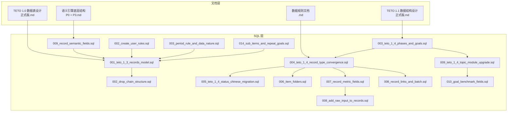
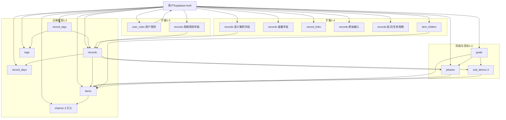
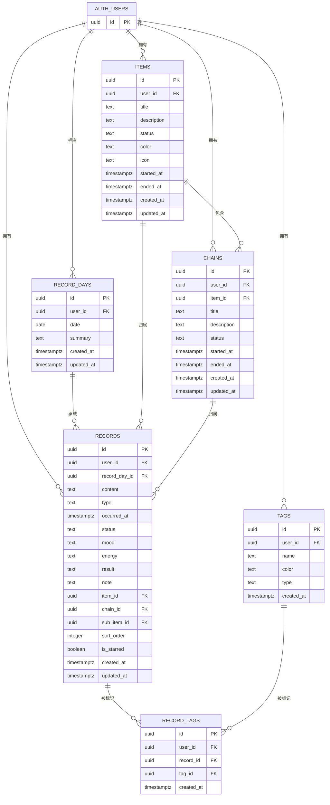
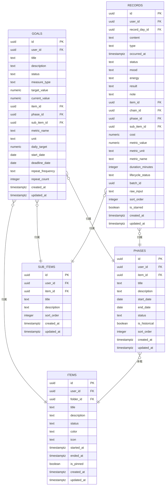
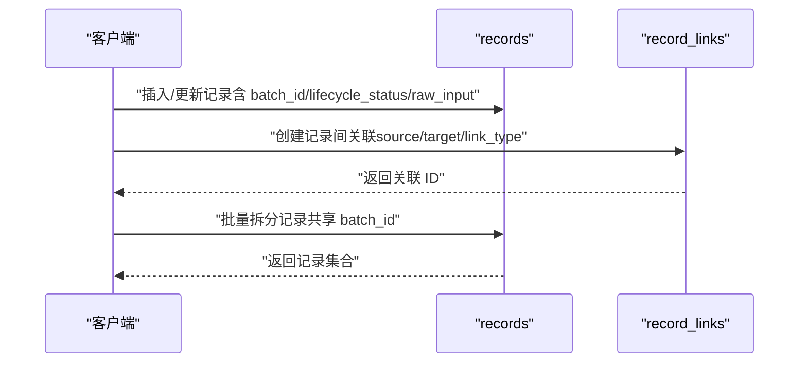
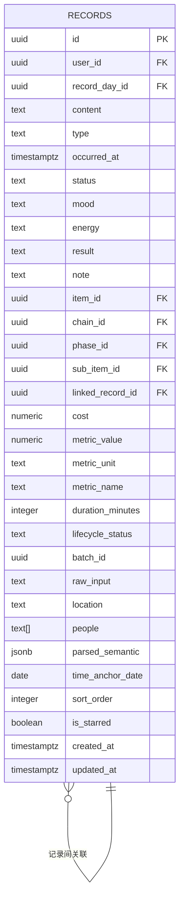
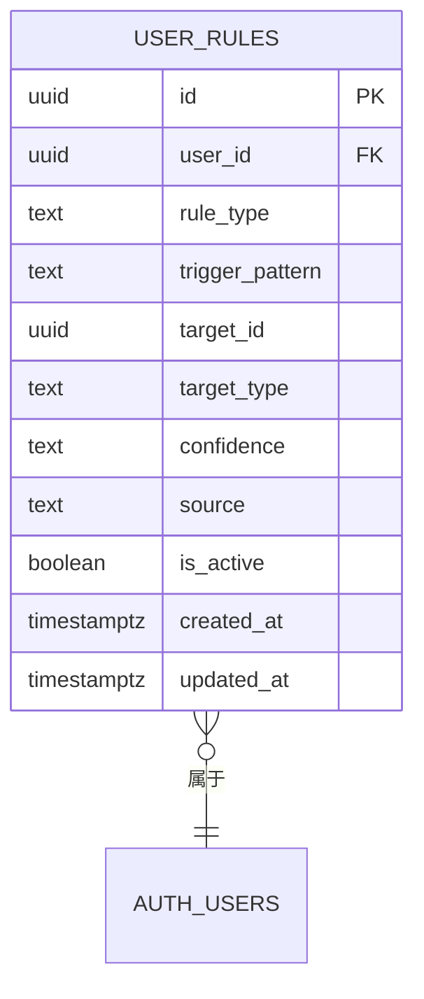
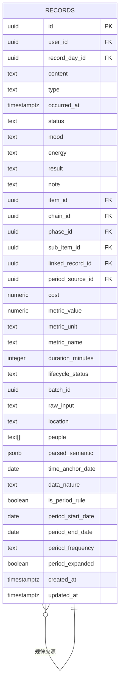
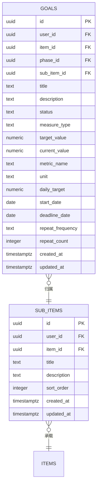
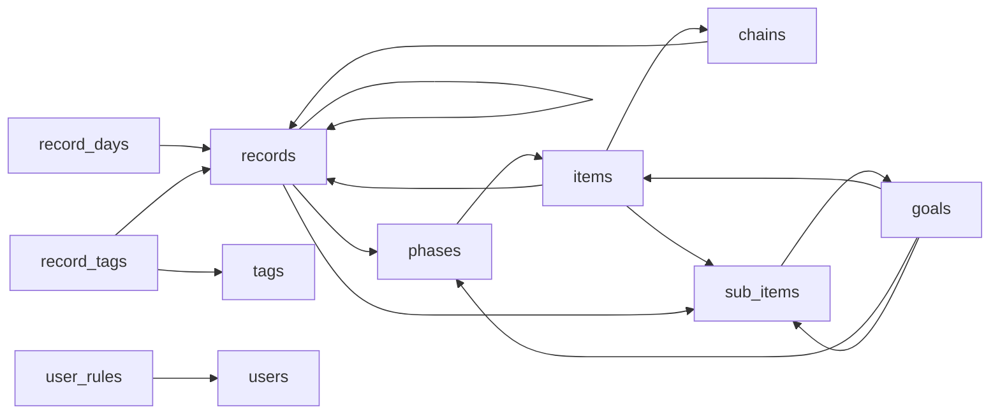

# 数据库设计

<cite>
**本文引用的文件**
- [《TETO 1.0 数据表设计（正式版）》.md](file://docs/10-版本归档/TETO 1.0.0/《TETO 1.0 数据表设计（正式版）》.md)
- [《TETO 1.1 数据结构设计正式版》.md](file://docs/10-版本归档/TETO 1.1.0/TETO 1.1 数据结构设计正式版.md)
- [数据规则文档.md](file://DATA_RULES.md)
- [001_teto_1_3_records_model.sql](file://sql/001_teto_1_3_records_model.sql)
- [002_drop_chain_structure.sql](file://sql/002_drop_chain_structure.sql)
- [003_teto_1_4_phases_and_goals.sql](file://sql/003_teto_1_4_phases_and_goals.sql)
- [004_teto_1_4_record_type_convergence.sql](file://sql/004_teto_1_4_record_type_convergence.sql)
- [005_teto_1_4_status_chinese_migration.sql](file://sql/005_teto_1_4_status_chinese_migration.sql)
- [006_item_folders.sql](file://sql/006_item_folders.sql)
- [007_record_metric_fields.sql](file://sql/007_record_metric_fields.sql)
- [008_add_raw_input_to_records.sql](file://sql/008_add_raw_input_to_records.sql)
- [008_record_links_and_batch.sql](file://sql/008_record_links_and_batch.sql)
- [009_teto_1_4_topic_module_upgrade.sql](file://sql/009_teto_1_4_topic_module_upgrade.sql)
- [010_goal_benchmark_fields.sql](file://sql/010_goal_benchmark_fields.sql)
- [002_create_user_rules.sql](file://sql/002_create_user_rules.sql)
- [003_period_rule_and_data_nature.sql](file://sql/003_period_rule_and_data_nature.sql)
- [014_sub_items_and_repeat_goals.sql](file://sql/保留存档sql/sql1.1-1.4/014_sub_items_and_repeat_goals.sql)
- [语义引擎底层结构（P0 + P3）.md](file://docs/01-生效版本/TETO 1.4/TET O1.4新相关内容/TETO 1.4/语义引擎底层结构（P0 + P3）.md)
- [semantic.ts](file://src/types/semantic.ts)
- [teto.ts](file://src/types/teto.ts)
- [records.ts](file://src/lib/db/records.ts)
- [ItemPortrait.tsx](file://src/app/(dashboard)/insights/components/ItemPortrait.tsx)
- [user-rules/route.ts](file://src/app/api/v2/user-rules/route.ts)
- [user-rules.ts](file://src/lib/db/user-rules.ts)
- [sub-items.ts](file://src/lib/db/sub-items.ts)
- [goal-engine.ts](file://src/lib/db/goal-engine.ts)
- [GoalForm.tsx](file://src/app/(dashboard)/items/components/GoalForm.tsx)
- [SubItemForm.tsx](file://src/app/(dashboard)/items/components/SubItemForm.tsx)
- [SubItemTabBar.tsx](file://src/app/(dashboard)/items/components/SubItemTabBar.tsx)
- [RulePanel.tsx](file://src/app/(dashboard)/insights/components/RulePanel.tsx)
</cite>

## 目录
1. [简介](#简介)
2. [项目结构](#项目结构)
3. [核心组件](#核心组件)
4. [架构总览](#架构总览)
5. [详细组件分析](#详细组件分析)
6. [依赖分析](#依赖分析)
7. [性能考虑](#性能考虑)
8. [故障排查指南](#故障排查指南)
9. [结论](#结论)
10. [附录](#附录)

## 简介
本文件面向 TETO 数据库设计，系统化梳理实体关系模型、表结构定义、字段约束与索引设计，给出数据模型演进历史、版本化管理策略与迁移脚本规范，解释主键/外键关系、数据完整性约束与业务规则，提供数据库架构图与实体关系图，说明数据访问模式、缓存策略与性能考量，覆盖数据生命周期管理、保留策略与归档规则，并阐述数据安全、隐私要求与访问控制，最后提供数据迁移路径与版本管理指南。

## 项目结构
- 文档层：版本化数据设计文档与规则文档，定义实体、字段、约束与业务规则。
- SQL 层：版本化迁移脚本，按版本演进逐步构建与调整表结构、触发器、RLS 策略与索引。
- 应用层：前端与 API 层通过 Supabase 认证与行级安全策略实现用户隔离与权限控制。

图表来源
- [《TETO 1.0 数据表设计（正式版）》.md:1-1105](file://docs/10-版本归档/TETO 1.0.0/《TETO 1.0 数据表设计（正式版）》.md#L1-L1105)
- [《TETO 1.1 数据结构设计正式版》.md:1-891](file://docs/10-版本归档/TETO 1.1.0/TETO 1.1 数据结构设计正式版.md#L1-L891)
- [数据规则文档.md:1-174](file://DATA_RULES.md#L1-L174)
- [语义引擎底层结构（P0 + P3）.md:1-142](file://docs/01-生效版本/TETO 1.4/TET O1.4新相关内容/TETO 1.4/语义引擎底层结构（P0 + P3）.md#L1-L142)
- [001_teto_1_3_records_model.sql:1-300](file://sql/001_teto_1_3_records_model.sql#L1-L300)
- [002_drop_chain_structure.sql:1-49](file://sql/002_drop_chain_structure.sql#L1-L49)
- [003_teto_1_4_phases_and_goals.sql:1-130](file://sql/003_teto_1_4_phases_and_goals.sql#L1-L130)
- [004_teto_1_4_record_type_convergence.sql:1-20](file://sql/004_teto_1_4_record_type_convergence.sql#L1-L20)
- [005_teto_1_4_status_chinese_migration.sql:1-38](file://sql/005_teto_1_4_status_chinese_migration.sql#L1-L38)
- [006_item_folders.sql:1-38](file://sql/006_item_folders.sql#L1-L38)
- [007_record_metric_fields.sql:1-20](file://sql/007_record_metric_fields.sql#L1-L20)
- [008_add_raw_input_to_records.sql:1-12](file://sql/008_add_raw_input_to_records.sql#L1-L12)
- [008_record_links_and_batch.sql:1-32](file://sql/008_record_links_and_batch.sql#L1-L32)
- [009_teto_1_4_topic_module_upgrade.sql:1-97](file://sql/009_teto_1_4_topic_module_upgrade.sql#L1-L97)
- [010_goal_benchmark_fields.sql:1-40](file://sql/010_goal_benchmark_fields.sql#L1-L40)
- [002_create_user_rules.sql:1-86](file://sql/002_create_user_rules.sql#L1-L86)
- [003_period_rule_and_data_nature.sql:1-69](file://sql/003_period_rule_and_data_nature.sql#L1-L69)
- [014_sub_items_and_repeat_goals.sql:1-157](file://sql/保留存档sql/sql1.1-1.4/014_sub_items_and_repeat_goals.sql#L1-L157)

章节来源
- [《TETO 1.0 数据表设计（正式版）》.md:1-1105](file://docs/10-版本归档/TETO 1.0.0/《TETO 1.0 数据表设计（正式版）》.md#L1-L1105)
- [《TETO 1.1 数据结构设计正式版》.md:1-891](file://docs/10-版本归档/TETO 1.1.0/TETO 1.1 数据结构设计正式版.md#L1-L891)
- [数据规则文档.md:1-174](file://DATA_RULES.md#L1-L174)

## 核心组件
- 记录模型（TETO 1.3）：record_days、items、chains（1.3 引入）、records、tags、record_tags。
- 阶段与目标（TETO 1.4）：goals、phases，并为 items、records、goals、phases 增加外键与字段。
- 事项文件夹（TETO 1.4）：item_folders，items 增加 folder_id。
- 记录度量字段（TETO 1.4）：records 增加 metric_value、metric_unit、metric_name、duration_minutes。
- 原始输入与链接（TETO 1.4）：records 增加 raw_input；新增 record_links；records 增加 batch_id、lifecycle_status。
- 状态中文化（TETO 1.4）：goals、phases 的 status 英文迁移到中文。
- 语义解析字段（TETO 1.4）：records 新增 parsed_semantic（JSONB）、time_anchor_date（DATE）、linked_record_id（UUID）、location（TEXT）、people（TEXT[]）。
- 用户规则（TETO 1.5）：user_rules，支持关键词→事项/子项映射、类型分流、模糊表达解析。
- 周期规则与数据性质（TETO 1.5）：records 新增 data_nature、is_period_rule、period_* 系列字段。
- 子项目与重复目标（TETO 1.4）：sub_items、goals 新增 sub_item_id、repeat_frequency、repeat_count。

章节来源
- [001_teto_1_3_records_model.sql:1-300](file://sql/001_teto_1_3_records_model.sql#L1-L300)
- [002_drop_chain_structure.sql:1-49](file://sql/002_drop_chain_structure.sql#L1-L49)
- [003_teto_1_4_phases_and_goals.sql:1-130](file://sql/003_teto_1_4_phases_and_goals.sql#L1-L130)
- [004_teto_1_4_record_type_convergence.sql:1-20](file://sql/004_teto_1_4_record_type_convergence.sql#L1-L20)
- [005_teto_1_4_status_chinese_migration.sql:1-38](file://sql/005_teto_1_4_status_chinese_migration.sql#L1-L38)
- [006_item_folders.sql:1-38](file://sql/006_item_folders.sql#L1-L38)
- [007_record_metric_fields.sql:1-20](file://sql/007_record_metric_fields.sql#L1-L20)
- [008_add_raw_input_to_records.sql:1-12](file://sql/008_add_raw_input_to_records.sql#L1-L12)
- [008_record_links_and_batch.sql:1-32](file://sql/008_record_links_and_batch.sql#L1-L32)
- [009_teto_1_4_topic_module_upgrade.sql:1-97](file://sql/009_teto_1_4_topic_module_upgrade.sql#L1-L97)
- [010_goal_benchmark_fields.sql:1-40](file://sql/010_goal_benchmark_fields.sql#L1-L40)
- [002_create_user_rules.sql:1-86](file://sql/002_create_user_rules.sql#L1-L86)
- [003_period_rule_and_data_nature.sql:1-69](file://sql/003_period_rule_and_data_nature.sql#L1-L69)
- [014_sub_items_and_repeat_goals.sql:1-157](file://sql/保留存档sql/sql1.1-1.4/014_sub_items_and_repeat_goals.sql#L1-L157)
- [语义引擎底层结构（P0 + P3）.md:105-129](file://docs/01-生效版本/TETO 1.4/TET O1.4新相关内容/TETO 1.4/语义引擎底层结构（P0 + P3）.md#L105-L129)

## 架构总览
TETO 数据库以"用户隔离 + 行级安全 + 事件驱动（触发器）+ 版本化迁移"为核心架构。用户通过 Supabase 认证，RLS 策略确保每张表仅对 auth.uid() 对应用户可见；通过迁移脚本按版本演进，逐步引入阶段/目标、文件夹、度量字段、原始输入与记录链接等能力；触发器保障数据一致性与审计字段更新；新增语义解析字段为可视化分析提供结构化数据基础；新增用户规则表支持智能分类与路由；新增周期规则与数据性质字段支持规律识别与推断分析；新增子项目与重复目标支持精细化目标管理。

图表来源
- [001_teto_1_3_records_model.sql:1-300](file://sql/001_teto_1_3_records_model.sql#L1-L300)
- [002_drop_chain_structure.sql:1-49](file://sql/002_drop_chain_structure.sql#L1-L49)
- [003_teto_1_4_phases_and_goals.sql:1-130](file://sql/003_teto_1_4_phases_and_goals.sql#L1-L130)
- [006_item_folders.sql:1-38](file://sql/006_item_folders.sql#L1-L38)
- [007_record_metric_fields.sql:1-20](file://sql/007_record_metric_fields.sql#L1-L20)
- [008_add_raw_input_to_records.sql:1-12](file://sql/008_add_raw_input_to_records.sql#L1-L12)
- [008_record_links_and_batch.sql:1-32](file://sql/008_record_links_and_batch.sql#L1-L32)
- [009_teto_1_4_topic_module_upgrade.sql:1-97](file://sql/009_teto_1_4_topic_module_upgrade.sql#L1-L97)
- [010_goal_benchmark_fields.sql:1-40](file://sql/010_goal_benchmark_fields.sql#L1-L40)
- [002_create_user_rules.sql:1-86](file://sql/002_create_user_rules.sql#L1-L86)
- [003_period_rule_and_data_nature.sql:1-69](file://sql/003_period_rule_and_data_nature.sql#L1-L69)
- [014_sub_items_and_repeat_goals.sql:1-157](file://sql/保留存档sql/sql1.1-1.4/014_sub_items_and_repeat_goals.sql#L1-L157)
- [语义引擎底层结构（P0 + P3）.md:105-129](file://docs/01-生效版本/TETO 1.4/TET O1.4新相关内容/TETO 1.4/语义引擎底层结构（P0 + P3）.md#L105-L129)

## 详细组件分析

### 记录模型（TETO 1.3）：record_days、items、chains、records、tags、record_tags
- 主键与外键
  - record_days：主键 id，UNIQUE(user_id, date)。
  - items：主键 id，外键 user_id → auth.users(id)。
  - chains：主键 id，外键 item_id → items(id)，ON DELETE CASCADE。
  - records：主键 id，外键 record_day_id → record_days(id)，ON DELETE CASCADE；可选外键 item_id → items(id)，ON DELETE SET NULL；可选外键 chain_id → chains(id)；ON DELETE SET NULL。
  - tags：主键 id，外键 user_id → auth.users(id)。
  - record_tags：主键 id，双外键 record_id → records(id)、tag_id → tags(id)，ON DELETE CASCADE；UNIQUE(record_id, tag_id)。
- 约束与检查
  - items.status ∈ {'活跃','推进中','放缓','停滞','已完成','已搁置'}。
  - chains.status ∈ {'进行中','已完成','已搁置'}。
  - records.type ∈ {'发生','计划','情绪','想法','花费','总结','结果'}（1.4 收敛为 4 类）。
- 触发器
  - chain/item 一致性触发器：确保 records.chain_id 与 item_id 一致，不一致时报错。
  - updated_at 自动更新触发器：所有表在 UPDATE 时自动设置 updated_at。
- RLS
  - 所有表启用 RLS，策略按 user_id 控制 SELECT/INSERT/UPDATE/DELETE。
- 索引
  - record_days：(user_id, date)。
  - records：(user_id, record_day_id)、(user_id, occurred_at)、item_id、chain_id。
  - items：(user_id, status)。
  - chains：(user_id, item_id)。
  - record_tags：record_id、tag_id。

图表来源
- [001_teto_1_3_records_model.sql:1-300](file://sql/001_teto_1_3_records_model.sql#L1-L300)

章节来源
- [001_teto_1_3_records_model.sql:1-300](file://sql/001_teto_1_3_records_model.sql#L1-L300)

### 阶段与目标（TETO 1.4）：goals、phases、items、records、sub_items
- 新增表与字段
  - goals：主键 id，外键 user_id → auth.users(id)，新增 measure_type、target_value、current_value、item_id、phase_id、metric_name、unit、daily_target、start_date、deadline_date、sub_item_id、repeat_frequency、repeat_count。
  - phases：主键 id，外键 user_id → auth.users(id)，外键 item_id → items(id)，ON DELETE CASCADE；移除 goal_id（避免双向绑定）。
  - items：新增 folder_id → item_folders(id)；新增 is_pinned。
  - records：新增 phase_id → phases(id)；新增 cost、lifecycle_status、sub_item_id → sub_items(id)。
  - sub_items：主键 id，外键 user_id → auth.users(id)，外键 item_id → items(id)，ON DELETE CASCADE。
- 约束与检查
  - goals.measure_type ∈ {'boolean','numeric','repeat'}。
  - goals.status ∈ {'进行中','已达成','已放弃','已暂停'}（1.4 状态中文化）。
  - phases.status ∈ {'进行中','已结束','停滞'}。
  - records.lifecycle_status ∈ {'active','completed','postponed','cancelled'}。
  - sub_items.sort_order 默认 0。
- RLS 与索引
  - goals、phases、sub_items 启用 RLS；新增索引：idx_goals_user_status、idx_goals_item、idx_goals_phase、idx_goals_sub_item、idx_phases_user_item、idx_phases_item、idx_records_phase、idx_records_sub_item、idx_items_pinned、idx_item_folders_user、idx_items_folder、idx_sub_items_user、idx_sub_items_item、idx_sub_items_user_item。

图表来源
- [003_teto_1_4_phases_and_goals.sql:1-130](file://sql/003_teto_1_4_phases_and_goals.sql#L1-L130)
- [009_teto_1_4_topic_module_upgrade.sql:1-97](file://sql/009_teto_1_4_topic_module_upgrade.sql#L1-L97)
- [010_goal_benchmark_fields.sql:1-40](file://sql/010_goal_benchmark_fields.sql#L1-L40)
- [014_sub_items_and_repeat_goals.sql:1-157](file://sql/保留存档sql/sql1.1-1.4/014_sub_items_and_repeat_goals.sql#L1-L157)

章节来源
- [003_teto_1_4_phases_and_goals.sql:1-130](file://sql/003_teto_1_4_phases_and_goals.sql#L1-L130)
- [009_teto_1_4_topic_module_upgrade.sql:1-97](file://sql/009_teto_1_4_topic_module_upgrade.sql#L1-L97)
- [010_goal_benchmark_fields.sql:1-40](file://sql/010_goal_benchmark_fields.sql#L1-L40)
- [014_sub_items_and_repeat_goals.sql:1-157](file://sql/保留存档sql/sql1.1-1.4/014_sub_items_and_repeat_goals.sql#L1-L157)

### 事项文件夹（TETO 1.4）：item_folders、items
- 新增 item_folders 表，items 新增 folder_id 外键。
- RLS 与索引：item_folders 启用 RLS；索引 idx_item_folders_user、idx_items_folder。

章节来源
- [006_item_folders.sql:1-38](file://sql/006_item_folders.sql#L1-L38)

### 记录度量字段（TETO 1.4）：records
- 新增 metric_value、metric_unit、metric_name、duration_minutes，用于结构化统计与分析。
- 索引策略：字段仅新增，索引留待后续确认查询路径后再补。

章节来源
- [007_record_metric_fields.sql:1-20](file://sql/007_record_metric_fields.sql#L1-L20)

### 原始输入与链接（TETO 1.4）：records、record_links
- records 新增 raw_input（原始自然语言输入）。
- 新增 record_links 表，支持 completes、derived_from、postponed_from、related_to 四种类型；records 新增 batch_id、lifecycle_status。
- 索引：idx_record_links_source、idx_record_links_target、idx_records_batch_id。

图表来源
- [008_record_links_and_batch.sql:1-32](file://sql/008_record_links_and_batch.sql#L1-L32)
- [008_add_raw_input_to_records.sql:1-12](file://sql/008_add_raw_input_to_records.sql#L1-L12)

章节来源
- [008_record_links_and_batch.sql:1-32](file://sql/008_record_links_and_batch.sql#L1-L32)
- [008_add_raw_input_to_records.sql:1-12](file://sql/008_add_raw_input_to_records.sql#L1-L12)

### 状态中文化（TETO 1.4）：goals、phases
- 将 status 从英文迁移为中文，并更新 CHECK 约束与默认值。
- goals：进行中/已达成/已放弃/已暂停。
- phases：进行中/已结束/停滞。

章节来源
- [005_teto_1_4_status_chinese_migration.sql:1-38](file://sql/005_teto_1_4_status_chinese_migration.sql#L1-L38)

### 记录类型收敛（TETO 1.4）：records
- 新增 cost 字段与索引；将旧类型（情绪/花费/结果）收敛为"发生"；type 约束收敛为 4 个值。

章节来源
- [004_teto_1_4_record_type_convergence.sql:1-20](file://sql/004_teto_1_4_record_type_convergence.sql#L1-L20)

### 语义解析字段（TETO 1.4）：records
- 新增 parsed_semantic（JSONB）存储 LLM 解析的完整结构化语义。
- 新增 time_anchor_date（DATE）存储时间锚点解析后的目标日期。
- 新增 linked_record_id（UUID）建立记录间关联（如"上周考试90分"关联到上周的考试记录）。
- 新增 location（TEXT）存储地点信息。
- 新增 people（TEXT[]）存储关系人数组。
- 外键约束：linked_record_id 引用 records(id) ON DELETE SET NULL。
- 类型定义：在 semantic.ts 中定义 ParsedSemantic、TimeAnchor、SemanticMetric 等核心类型。
- 应用集成：QuickInput 组件调用 /api/v2/parse 获取解析结果，自动填充语义字段。

图表来源
- [语义引擎底层结构（P0 + P3）.md:105-129](file://docs/01-生效版本/TETO 1.4/TET O1.4新相关内容/TETO 1.4/语义引擎底层结构（P0 + P3）.md#L105-L129)
- [semantic.ts:13-69](file://src/types/semantic.ts#L13-L69)
- [teto.ts:37-74](file://src/types/teto.ts#L37-L74)

章节来源
- [语义引擎底层结构（P0 + P3）.md:105-129](file://docs/01-生效版本/TETO 1.4/TET O1.4新相关内容/TETO 1.4/语义引擎底层结构（P0 + P3）.md#L105-L129)
- [semantic.ts:13-69](file://src/types/semantic.ts#L13-L69)
- [teto.ts:37-74](file://src/types/teto.ts#L37-L74)
- [records.ts:73-87](file://src/lib/db/records.ts#L73-L87)

### 用户规则表（TETO 1.5）：user_rules
- 新增 user_rules 表，支持用户自定义的分类规则。
- 规则类型：
  - item_mapping：关键词→事项映射（如"背单词"→英语）
  - sub_item_mapping：关键词→子项映射（如"听力"→英语.听读）
  - type_routing：关键词→记录类型分流（如"明天"→计划）
  - fuzzy_resolution：常见模糊表达→默认解释
- 字段与约束：
  - rule_type：枚举值限制
  - trigger_pattern：触发模式（关键词/表达式）
  - target_id/target_type：目标对象ID与类型（item/sub_item）
  - confidence：置信度（high/medium/low，默认 high）
  - source：规则来源（ai_learned/user_set/system_default，默认 ai_learned）
  - is_active：是否激活，默认 true
- RLS 与索引：
  - 启用 RLS，按 user_id 控制访问
  - 索引：idx_user_rules_user_trigger、idx_user_rules_user_type、idx_user_rules_user_active
- API 支持：
  - GET /api/v2/user-rules（支持 rule_type、is_active、source 过滤）
  - POST /api/v2/user-rules（创建规则）
  - PUT /api/v2/user-rules?id=xxx（更新规则）
  - DELETE /api/v2/user-rules?id=xxx 或 DELETE /api/v2/user-rules?reset=type（删除或重置规则）

图表来源
- [002_create_user_rules.sql:14-86](file://sql/002_create_user_rules.sql#L14-L86)
- [user-rules/route.ts:1-171](file://src/app/api/v2/user-rules/route.ts#L1-L171)
- [user-rules.ts:17-267](file://src/lib/db/user-rules.ts#L17-L267)

章节来源
- [002_create_user_rules.sql:1-86](file://sql/002_create_user_rules.sql#L1-L86)
- [user-rules/route.ts:1-171](file://src/app/api/v2/user-rules/route.ts#L1-L171)
- [user-rules.ts:1-267](file://src/lib/db/user-rules.ts#L1-L267)

### 周期规则与数据性质（TETO 1.5）：records
- 新增 data_nature 字段：区分原始事实记录（fact）与推断生成的条目（inferred），默认 fact。
- 新增 is_period_rule 字段：标记是否为概括性规律记录，默认 false。
- 新增 period_* 系列字段：
  - period_start_date：规律起始日
  - period_end_date：规律结束日
  - period_frequency：规律频率（daily/weekly/monthly/irregular）
  - period_expanded：规律是否已展开为逐日推断条目，默认 false
  - period_source_id：推断条目的来源规律记录ID（外键引用 records.id ON DELETE SET NULL）
- 索引策略：
  - idx_records_data_nature：按数据性质过滤推断数据
  - idx_records_period_rule：按规律记录查找
  - idx_records_period_source：按来源规律查找推断条目
- 应用场景：
  - 支持"那段时间基本每天7:40起床"等概括性历史识别
  - 支持将概括性规律展开为逐日推断条目
  - 支持区分事实记录与推断条目进行统计分析

图表来源
- [003_period_rule_and_data_nature.sql:15-69](file://sql/003_period_rule_and_data_nature.sql#L15-L69)
- [teto.ts:68-78](file://src/types/teto.ts#L68-L78)

章节来源
- [003_period_rule_and_data_nature.sql:1-69](file://sql/003_period_rule_and_data_nature.sql#L1-L69)
- [teto.ts:68-78](file://src/types/teto.ts#L68-L78)

### 子项目与重复目标（TETO 1.4）：sub_items、goals
- 新增 sub_items 表：事项下的行动线，支持更细粒度的目标分解。
- goals 新增字段：
  - sub_item_id：归属子项目（外键引用 sub_items.id ON DELETE SET NULL）
  - repeat_frequency：重复频率（daily/weekly/monthly）
  - repeat_count：每周期完成次数
- goals.measure_type 扩展为包含 repeat 类型。
- records 新增 sub_item_id 外键，支持按子项目统计。
- 索引策略：idx_goals_sub_item、idx_records_sub_item。
- 应用场景：
  - 量化型目标：每日背10个单词
  - 重复型目标：每周运动3次
  - 子项目细分：英语→词汇、语法、听读等

图表来源
- [014_sub_items_and_repeat_goals.sql:20-98](file://sql/保留存档sql/sql1.1-1.4/014_sub_items_and_repeat_goals.sql#L20-L98)
- [teto.ts:444-467](file://src/types/teto.ts#L444-L467)

章节来源
- [014_sub_items_and_repeat_goals.sql:1-157](file://sql/保留存档sql/sql1.1-1.4/014_sub_items_and_repeat_goals.sql#L1-L157)
- [teto.ts:444-467](file://src/types/teto.ts#L444-L467)
- [goal-engine.ts:421-468](file://src/lib/db/goal-engine.ts#L421-L468)

### 链路一致性与更新时间（TETO 1.3）
- 触发器：check_record_chain_item_consistency（确保 chain/item 一致性）；set_updated_at（自动更新 updated_at）。
- 1.3 引入 chains，1.3 → 1.4 迁移中删除 chains 结构，清理触发器、外键、索引与 RLS。

章节来源
- [001_teto_1_3_records_model.sql:1-300](file://sql/001_teto_1_3_records_model.sql#L1-L300)
- [002_drop_chain_structure.sql:1-49](file://sql/002_drop_chain_structure.sql#L1-L49)

## 依赖分析
- 版本依赖
  - 1.0 设计奠定基础实体与约束。
  - 1.1 设计引入任务/目标/项目/导入等概念，为 1.3 的记录模型打基础。
  - 1.3 引入 record_days/items/chains/records/tags/record_tags，形成"按天容器-事项-事件链-记录-标签"的核心模型。
  - 1.4 在 1.3 基础上引入 goals/phases，重构 items/records 的归属关系，新增文件夹、度量字段、原始输入与记录链接，新增子项目与重复目标。
  - 1.4 新增语义解析字段，为可视化分析提供结构化数据基础。
  - 1.5 新增 user_rules 表支持智能分类与路由，新增周期规则与数据性质字段支持规律识别与推断分析。
- 外键与级联
  - record_days → records（ON DELETE CASCADE）。
  - items → chains（ON DELETE CASCADE）。
  - records → items（ON DELETE SET NULL）。
  - records → phases（ON DELETE SET NULL）。
  - records → records（linked_record_id 外键）。
  - record_tags → records/tags（ON DELETE CASCADE）。
  - goals → items/phases/sub_items（ON DELETE SET NULL/CASCADE）。
  - phases → items（ON DELETE CASCADE）。
  - sub_items → items（ON DELETE CASCADE）。
  - records → sub_items（ON DELETE SET NULL）。
  - records → records（period_source_id 外键）。
- 约束与检查
  - items/status、chains/status、records/type、goals/status、phases/status、goals/measure_type、records/lifecycle_status、records/linked_record_id、records/data_nature、records/period_frequency、goals/repeat_frequency、sub_items/sort_order。
- RLS
  - 所有核心表启用 RLS，策略按 user_id 控制访问。

图表来源
- [001_teto_1_3_records_model.sql:1-300](file://sql/001_teto_1_3_records_model.sql#L1-L300)
- [003_teto_1_4_phases_and_goals.sql:1-130](file://sql/003_teto_1_4_phases_and_goals.sql#L1-L130)
- [009_teto_1_4_topic_module_upgrade.sql:1-97](file://sql/009_teto_1_4_topic_module_upgrade.sql#L1-L97)
- [014_sub_items_and_repeat_goals.sql:1-157](file://sql/保留存档sql/sql1.1-1.4/014_sub_items_and_repeat_goals.sql#L1-L157)
- [002_create_user_rules.sql:1-86](file://sql/002_create_user_rules.sql#L1-L86)
- [语义引擎底层结构（P0 + P3）.md:120-122](file://docs/01-生效版本/TETO 1.4/TET O1.4新相关内容/TETO 1.4/语义引擎底层结构（P0 + P3）.md#L120-L122)

章节来源
- [001_teto_1_3_records_model.sql:1-300](file://sql/001_teto_1_3_records_model.sql#L1-L300)
- [003_teto_1_4_phases_and_goals.sql:1-130](file://sql/003_teto_1_4_phases_and_goals.sql#L1-L130)
- [009_teto_1_4_topic_module_upgrade.sql:1-97](file://sql/009_teto_1_4_topic_module_upgrade.sql#L1-L97)
- [014_sub_items_and_repeat_goals.sql:1-157](file://sql/保留存档sql/sql1.1-1.4/014_sub_items_and_repeat_goals.sql#L1-L157)
- [002_create_user_rules.sql:1-86](file://sql/002_create_user_rules.sql#L1-L86)
- [语义引擎底层结构（P0 + P3）.md:120-122](file://docs/01-生效版本/TETO 1.4/TET O1.4新相关内容/TETO 1.4/语义引擎底层结构（P0 + P3）.md#L120-L122)

## 性能考虑
- 索引策略
  - 按用户与时间维度建立复合索引：record_days(user_id,date)、records(user_id,record_day_id)、records(user_id,occurred_at)。
  - 按外键建立单列索引：records(item_id)、records(chain_id)、records(phase_id)、records(sub_item_id)、records(linked_record_id)、record_tags(record_id)、record_tags(tag_id)、items(user_id,status)、chains(user_id,item_id)、item_folders(user_id)、items(folder_id)、sub_items(user_id)、sub_items(item_id)。
  - 部分索引：items(is_pinned=true)、records(cost IS NOT NULL)、records(batch_id IS NOT NULL)、records(time_anchor_date IS NOT NULL)、records(data_nature != 'fact')、records(is_period_rule = true)、records(period_source_id IS NOT NULL)。
  - JSONB 字段：parsed_semantic 建议使用 GIN 索引以支持 JSON 查询。
  - 用户规则：user_rules(user_id, trigger_pattern)、user_rules(user_id, rule_type)、user_rules(user_id, is_active)。
- 查询路径
  - 优先使用 (user_id, date)、(user_id, record_day_id)、(user_id, occurred_at) 等复合条件。
  - 使用 lifecycle_status、status、data_nature、is_period_rule 等过滤字段减少扫描范围。
  - 语义查询：利用 time_anchor_date 进行时间锚点查询，利用 people 数组进行关系人过滤。
  - 用户规则：按 trigger_pattern 快速匹配活跃规则，按 rule_type 批量获取规则。
  - 周期规则：按 is_period_rule 标记规律记录，按 period_source_id 追溯推断来源。
- 触发器与更新
  - updated_at 自动更新减少应用层负担，但注意批量更新场景的开销。
  - user_rules 表的 updated_at 触发器确保规则更新时间准确。
- 缓存策略
  - 建议在应用层对热点查询（如今日记录、事项列表、阶段/目标概览）进行缓存，结合 updated_at 做失效策略。
  - 对高频统计（如最近 N 日趋势）建议缓存聚合结果，定期刷新。
  - 语义解析结果可缓存以减少重复计算。
  - 用户规则可缓存以提高解析效率。

## 故障排查指南
- 数据不显示或报权限错误
  - 检查 RLS 策略是否启用，确认 auth.uid() 与 user_id 一致。
  - 确认用户是否登录且 token 正确。
- 记录无法删除或更新
  - 检查是否存在外键约束（如 records → record_days、chains → items、sub_items → items）。
  - 确认是否使用正确的 CASCADE/SET NULL 策略。
- 记录类型不正确或报错
  - 检查 records.type 的 CHECK 约束是否被修改；1.4 已收敛为 4 个值。
- 链路一致性错误
  - 1.3 引入的 chain/item 一致性触发器在 1.4 已删除；如仍有报错，确认是否残留旧触发器。
- 状态值异常
  - 1.4 已将 goals/phases 的 status 中文化；检查是否仍使用英文值。
- 批量导入冲突
  - 检查 batch_id 与 lifecycle_status 的使用，确认是否正确设置。
- 语义解析问题
  - 检查 parsed_semantic 字段是否正确存储 JSONB 数据。
  - 确认 linked_record_id 外键引用是否有效。
  - 验证 time_anchor_date 是否正确解析时间锚点。
- 用户规则问题
  - 检查 rule_type 是否为合法枚举值。
  - 确认 trigger_pattern 的唯一性与匹配准确性。
  - 验证 target_id 与 target_type 的一致性。
- 周期规则问题
  - 检查 is_period_rule 标记是否正确。
  - 确认 period_* 字段的时间范围合理性。
  - 验证 period_source_id 的外键引用有效性。
- 子项目与重复目标问题
  - 检查 sub_item_id 外键引用是否有效。
  - 确认 repeat_frequency 的枚举值合法性。
  - 验证 repeat_count 的数值范围。

章节来源
- [001_teto_1_3_records_model.sql:1-300](file://sql/001_teto_1_3_records_model.sql#L1-L300)
- [002_drop_chain_structure.sql:1-49](file://sql/002_drop_chain_structure.sql#L1-L49)
- [005_teto_1_4_status_chinese_migration.sql:1-38](file://sql/005_teto_1_4_status_chinese_migration.sql#L1-L38)
- [008_record_links_and_batch.sql:1-32](file://sql/008_record_links_and_batch.sql#L1-L32)
- [002_create_user_rules.sql:1-86](file://sql/002_create_user_rules.sql#L1-L86)
- [003_period_rule_and_data_nature.sql:1-69](file://sql/003_period_rule_and_data_nature.sql#L1-L69)
- [014_sub_items_and_repeat_goals.sql:1-157](file://sql/保留存档sql/sql1.1-1.4/014_sub_items_and_repeat_goals.sql#L1-L157)
- [语义引擎底层结构（P0 + P3）.md:105-129](file://docs/01-生效版本/TETO 1.4/TET O1.4新相关内容/TETO 1.4/语义引擎底层结构（P0 + P3）.md#L105-L129)

## 结论
TETO 数据库设计以"用户隔离 + 行级安全 + 事件驱动 + 版本化迁移"为核心，通过 TETO 1.3 的记录模型与 TETO 1.4 的阶段/目标、文件夹、度量字段、原始输入与记录链接，构建了从"按天容器-事项-记录-标签"到"目标-阶段-事项-记录"的完整闭环。1.4 新增的语义解析字段为可视化分析提供了结构化数据基础，支持时间锚点、记录关联、地点和关系人等多维分析能力。1.5 新增的用户规则表支持智能分类与路由，周期规则与数据性质字段支持规律识别与推断分析，子项目与重复目标支持精细化目标管理。版本化迁移脚本确保了演进过程中的数据安全与一致性，索引与查询路径优化兼顾了性能与可维护性。建议在应用层配合缓存与批量处理策略，进一步提升用户体验与系统吞吐。

## 附录

### 数据模型演进历史与版本化管理
- TETO 1.0：奠定 profiles/daily_records/daily_record_items/diary_reviews/projects/project_logs 的基础模型与约束。
- TETO 1.1：引入任务/目标/项目/导入等概念，为后续记录模型与阶段/目标奠定基础。
- TETO 1.3：建立 record_days/items/chains/records/tags/record_tags 的核心记录模型，引入触发器与 RLS。
- TETO 1.4：引入 goals/phases，重构 items/records 的归属关系；新增文件夹、度量字段、原始输入与记录链接；状态中文化；删除 chains 结构；新增语义解析字段支持可视化分析；新增子项目与重复目标支持精细化管理。
- TETO 1.5：新增 user_rules 表支持智能分类与路由；新增周期规则与数据性质字段支持规律识别与推断分析。

章节来源
- [《TETO 1.0 数据表设计（正式版）》.md:1-1105](file://docs/10-版本归档/TETO 1.0.0/《TETO 1.0 数据表设计（正式版）》.md#L1-L1105)
- [《TETO 1.1 数据结构设计正式版》.md:1-891](file://docs/10-版本归档/TETO 1.1.0/TETO 1.1 数据结构设计正式版.md#L1-L891)
- [001_teto_1_3_records_model.sql:1-300](file://sql/001_teto_1_3_records_model.sql#L1-L300)
- [002_drop_chain_structure.sql:1-49](file://sql/002_drop_chain_structure.sql#L1-L49)
- [003_teto_1_4_phases_and_goals.sql:1-130](file://sql/003_teto_1_4_phases_and_goals.sql#L1-L130)
- [004_teto_1_4_record_type_convergence.sql:1-20](file://sql/004_teto_1_4_record_type_convergence.sql#L1-L20)
- [005_teto_1_4_status_chinese_migration.sql:1-38](file://sql/005_teto_1_4_status_chinese_migration.sql#L1-L38)
- [006_item_folders.sql:1-38](file://sql/006_item_folders.sql#L1-L38)
- [007_record_metric_fields.sql:1-20](file://sql/007_record_metric_fields.sql#L1-L20)
- [008_add_raw_input_to_records.sql:1-12](file://sql/008_add_raw_input_to_records.sql#L1-L12)
- [008_record_links_and_batch.sql:1-32](file://sql/008_record_links_and_batch.sql#L1-L32)
- [009_teto_1_4_topic_module_upgrade.sql:1-97](file://sql/009_teto_1_4_topic_module_upgrade.sql#L1-L97)
- [010_goal_benchmark_fields.sql:1-40](file://sql/010_goal_benchmark_fields.sql#L1-L40)
- [002_create_user_rules.sql:1-86](file://sql/002_create_user_rules.sql#L1-L86)
- [003_period_rule_and_data_nature.sql:1-69](file://sql/003_period_rule_and_data_nature.sql#L1-L69)
- [014_sub_items_and_repeat_goals.sql:1-157](file://sql/保留存档sql/sql1.1-1.4/014_sub_items_and_repeat_goals.sql#L1-L157)
- [语义引擎底层结构（P0 + P3）.md:105-129](file://docs/01-生效版本/TETO 1.4/TET O1.4新相关内容/TETO 1.4/语义引擎底层结构（P0 + P3）.md#L105-L129)

### 迁移脚本规范
- 幂等性：使用 IF NOT EXISTS/IF EXISTS 保证重复执行安全。
- 依赖顺序：先建表（按外键依赖）、再建索引、最后建触发器与 RLS。
- 数据迁移：状态中文化、字段新增（nullable/默认值）优先，避免破坏既有数据。
- 触发器：先清理旧触发器/函数，再重建；确保 CASCADE/SET NULL 策略正确。
- 验证：提供验证要点（如列存在性检查），确保迁移成功。
- 语义字段：新增 JSONB 字段时，建议同时创建相应的 GIN 索引以支持高效查询。
- 用户规则：新增 user_rules 表时，同时创建索引与 RLS 策略，确保数据安全与查询效率。
- 周期规则：新增周期相关字段时，注意外键约束与索引策略的配套实现。

章节来源
- [003_teto_1_4_phases_and_goals.sql:1-130](file://sql/003_teto_1_4_phases_and_goals.sql#L1-L130)
- [005_teto_1_4_status_chinese_migration.sql:1-38](file://sql/005_teto_1_4_status_chinese_migration.sql#L1-L38)
- [009_teto_1_4_topic_module_upgrade.sql:1-97](file://sql/009_teto_1_4_topic_module_upgrade.sql#L1-L97)
- [002_create_user_rules.sql:1-86](file://sql/002_create_user_rules.sql#L1-L86)
- [003_period_rule_and_data_nature.sql:1-69](file://sql/003_period_rule_and_data_nature.sql#L1-L69)
- [014_sub_items_and_repeat_goals.sql:1-157](file://sql/保留存档sql/sql1.1-1.4/014_sub_items_and_repeat_goals.sql#L1-L157)
- [语义引擎底层结构（P0 + P3）.md:105-129](file://docs/01-生效版本/TETO 1.4/TET O1.4新相关内容/TETO 1.4/语义引擎底层结构（P0 + P3）.md#L105-L129)

### 数据访问模式与缓存策略
- 访问模式
  - 按用户隔离：RLS 策略按 user_id 控制。
  - 按时间聚合：record_days 与 records 的日期/时间字段用于趋势与汇总。
  - 多维过滤：status、lifecycle_status、phase_id、folder_id、time_anchor_date、data_nature、is_period_rule 等字段用于筛选。
  - 语义查询：利用 parsed_semantic JSONB 字段进行结构化查询，people 数组进行关系人过滤。
  - 用户规则：按 trigger_pattern 快速匹配活跃规则，按 rule_type 批量获取规则。
  - 周期规则：按 is_period_rule 标记规律记录，按 period_source_id 追溯推断来源。
- 缓存策略
  - 热点查询缓存：今日记录、事项列表、阶段/目标概览。
  - 聚合结果缓存：最近 N 日趋势、完成度、项目进度。
  - 失效策略：结合 updated_at 与生命周期状态变更触发刷新。
  - 语义缓存：解析结果缓存以减少重复计算成本。
  - 用户规则缓存：活跃规则缓存以提高解析效率。
  - 子项目缓存：子项目列表与统计结果缓存。

章节来源
- [001_teto_1_3_records_model.sql:1-300](file://sql/001_teto_1_3_records_model.sql#L1-L300)
- [009_teto_1_4_topic_module_upgrade.sql:1-97](file://sql/009_teto_1_4_topic_module_upgrade.sql#L1-L97)
- [002_create_user_rules.sql:1-86](file://sql/002_create_user_rules.sql#L1-L86)
- [003_period_rule_and_data_nature.sql:1-69](file://sql/003_period_rule_and_data_nature.sql#L1-L69)
- [语义引擎底层结构（P0 + P3）.md:105-129](file://docs/01-生效版本/TETO 1.4/TET O1.4新相关内容/TETO 1.4/语义引擎底层结构（P0 + P3）.md#L105-L129)

### 数据生命周期管理、保留策略与归档规则
- 生命周期状态
  - records：lifecycle_status ∈ {'active','completed','postponed','cancelled'}，用于 Todo 流转与生命周期管理。
  - items：status ∈ {'活跃','推进中','放缓','停滞','已完成','已搁置'}，支持归档与暂停。
  - goals/phases：status ∈ {'进行中','已达成','已放弃','已暂停'}/{'进行中','已结束','停滞'}。
  - goals.measure_type：新增 repeat 类型支持周期性目标。
- 归档与删除
  - 建议对 items/goals/phases 设置归档状态而非硬删除，保留历史数据用于统计与回溯。
  - 删除策略：用户删除建议延后实现，避免误删历史数据。
  - 语义数据：parsed_semantic JSONB 数据建议长期保留以支持历史分析。
  - 用户规则：支持重置功能，允许用户清空或重置特定类型的规则。
  - 周期规则：规律记录与推断条目分离存储，支持历史追溯与重新展开。
- 数据性质管理
  - data_nature 字段区分事实记录与推断条目，支持统计口径控制。
  - 推断条目通过 period_source_id 追溯来源，确保数据可追溯性。

章节来源
- [008_record_links_and_batch.sql:1-32](file://sql/008_record_links_and_batch.sql#L1-L32)
- [003_teto_1_4_phases_and_goals.sql:1-130](file://sql/003_teto_1_4_phases_and_goals.sql#L1-L130)
- [009_teto_1_4_topic_module_upgrade.sql:1-97](file://sql/009_teto_1_4_topic_module_upgrade.sql#L1-L97)
- [002_create_user_rules.sql:1-86](file://sql/002_create_user_rules.sql#L1-L86)
- [003_period_rule_and_data_nature.sql:1-69](file://sql/003_period_rule_and_data_nature.sql#L1-L69)
- [语义引擎底层结构（P0 + P3）.md:114-115](file://docs/01-生效版本/TETO 1.4/TET O1.4新相关内容/TETO 1.4/语义引擎底层结构（P0 + P3）.md#L114-L115)

### 数据安全、隐私要求与访问控制
- 行级安全（RLS）
  - 所有核心表启用 RLS，策略按 user_id 控制 SELECT/INSERT/UPDATE/DELETE。
  - user_rules 表支持用户只能访问自己的规则，确保规则隐私。
- 认证与授权
  - 依赖 Supabase Auth，user_id 与 auth.uid() 一致。
- 敏感字段
  - 建议对 raw_input 等原始输入进行脱敏处理或最小化保留策略。
  - 语义解析数据 parsed_semantic 包含结构化个人信息，建议实施访问控制与审计。
  - 用户规则数据包含个人偏好设置，需要严格的数据隔离。
- API 安全
  - user_rules API 支持参数验证与权限检查。
  - 支持按类型重置规则，防止恶意滥用。

章节来源
- [001_teto_1_3_records_model.sql:1-300](file://sql/001_teto_1_3_records_model.sql#L1-L300)
- [003_teto_1_4_phases_and_goals.sql:1-130](file://sql/003_teto_1_4_phases_and_goals.sql#L1-L130)
- [002_create_user_rules.sql:1-86](file://sql/002_create_user_rules.sql#L1-L86)
- [语义引擎底层结构（P0 + P3）.md:114-115](file://docs/01-生效版本/TETO 1.4/TET O1.4新相关内容/TETO 1.4/语义引擎底层结构（P0 + P3）.md#L114-L115)

### 数据迁移路径与版本管理指南
- 迁移路径
  - 1.0 → 1.1：引入任务/目标/项目/导入，准备记录模型。
  - 1.1 → 1.3：建立 record_days/items/chains/records/tags/record_tags。
  - 1.3 → 1.4：引入 goals/phases，重构归属关系，新增文件夹、度量字段、原始输入与记录链接，新增子项目与重复目标。
  - 1.4 → 1.4（语义增强）：新增 parsed_semantic、time_anchor_date、linked_record_id、location、people 字段。
  - 1.4 → 1.5：新增 user_rules 表支持智能分类，新增周期规则与数据性质字段，完善目标管理体系。
- 版本管理
  - 以 SQL 脚本为版本载体，按版本号顺序执行。
  - 保持幂等性与依赖顺序，提供验证步骤。
  - 对关键字段（如 status）进行中文化迁移时，先迁移数据再更新约束。
  - 语义字段迁移：先添加字段与外键，再创建索引，最后进行数据迁移。
  - 用户规则迁移：先创建表结构与索引，再启用 RLS，最后进行数据迁移。
  - 周期规则迁移：先添加字段与外键约束，再创建索引，最后进行数据迁移。
- 应用集成
  - 用户规则 API 提供完整的 CRUD 操作与重置功能。
  - 子项目与重复目标支持前端组件与后端引擎的协同工作。
  - 周期规则支持历史数据的识别与推断。

章节来源
- [《TETO 1.1 数据结构设计正式版》.md:1-891](file://docs/10-版本归档/TETO 1.1.0/TETO 1.1 数据结构设计正式版.md#L1-L891)
- [001_teto_1_3_records_model.sql:1-300](file://sql/001_teto_1_3_records_model.sql#L1-L300)
- [003_teto_1_4_phases_and_goals.sql:1-130](file://sql/003_teto_1_4_phases_and_goals.sql#L1-L130)
- [005_teto_1_4_status_chinese_migration.sql:1-38](file://sql/005_teto_1_4_status_chinese_migration.sql#L1-L38)
- [009_teto_1_4_topic_module_upgrade.sql:1-97](file://sql/009_teto_1_4_topic_module_upgrade.sql#L1-L97)
- [002_create_user_rules.sql:1-86](file://sql/002_create_user_rules.sql#L1-L86)
- [003_period_rule_and_data_nature.sql:1-69](file://sql/003_period_rule_and_data_nature.sql#L1-L69)
- [014_sub_items_and_repeat_goals.sql:1-157](file://sql/保留存档sql/sql1.1-1.4/014_sub_items_and_repeat_goals.sql#L1-L157)
- [语义引擎底层结构（P0 + P3）.md:105-129](file://docs/01-生效版本/TETO 1.4/TET O1.4新相关内容/TETO 1.4/语义引擎底层结构（P0 + P3）.md#L105-L129)

### 可视化分析支持
- 画像卡片（ItemPortrait）
  - 支持活跃事项的完成率、欠债量、最近记录时间等指标展示。
  - 通过 portraits 数组提供结构化分析数据。
  - 支持沉寂事项的识别与展示。
- 语义分析
  - parsed_semantic 字段支持复杂查询与分析。
  - time_anchor_date 支持时间锚点分析。
  - people 数组支持关系网络分析。
  - location 字段支持地理分布分析。
- 用户规则分析
  - 支持按规则类型统计活跃规则数量。
  - 支持按来源统计规则分布（AI学习、用户设置、系统默认）。
  - 支持规则置信度分析与质量评估。
- 周期规则分析
  - 支持规律记录的统计与分析。
  - 支持推断条目的来源追踪与质量评估。
  - 支持按频率类型（daily/weekly/monthly）的规律分析。

章节来源
- [ItemPortrait.tsx:1-122](file://src/app/(dashboard)/insights/components/ItemPortrait.tsx#L1-L122)
- [RulePanel.tsx:45-85](file://src/app/(dashboard)/insights/components/RulePanel.tsx#L45-L85)
- [语义引擎底层结构（P0 + P3）.md:105-129](file://docs/01-生效版本/TETO 1.4/TET O1.4新相关内容/TETO 1.4/语义引擎底层结构（P0 + P3）.md#L105-L129)
- [teto.ts:276-308](file://src/types/teto.ts#L276-L308)

### 子项目与重复目标支持
- 子项目管理
  - sub_items 表支持事项下的行动线细分。
  - 支持子项目排序与描述管理。
  - 支持子项目级别的目标与记录统计。
- 重复目标引擎
  - 支持 daily/weekly/monthly 三种重复频率。
  - 支持每周期完成次数统计与进度计算。
  - 支持当前周期与历史周期的统计分析。
- 前端组件支持
  - GoalForm.tsx 支持重复目标配置界面。
  - SubItemForm.tsx 支持子项目创建与编辑。
  - SubItemTabBar.tsx 支持子项目切换与管理。
- 后端引擎支持
  - goal-engine.ts 实现重复目标的计算逻辑。
  - 支持按事项批量计算重复目标结果。
  - 支持当前周期的起止日期计算。

章节来源
- [sub-items.ts:1-112](file://src/lib/db/sub-items.ts#L1-L112)
- [GoalForm.tsx:276-430](file://src/app/(dashboard)/items/components/GoalForm.tsx#L276-L430)
- [SubItemForm.tsx:1-42](file://src/app/(dashboard)/items/components/SubItemForm.tsx#L1-L42)
- [SubItemTabBar.tsx:1-44](file://src/app/(dashboard)/items/components/SubItemTabBar.tsx#L1-L44)
- [goal-engine.ts:120-199](file://src/lib/db/goal-engine.ts#L120-L199)
- [goal-engine.ts:421-468](file://src/lib/db/goal-engine.ts#L421-L468)
- [teto.ts:444-467](file://src/types/teto.ts#L444-L467)
- [teto.ts:734-747](file://src/types/teto.ts#L734-L747)