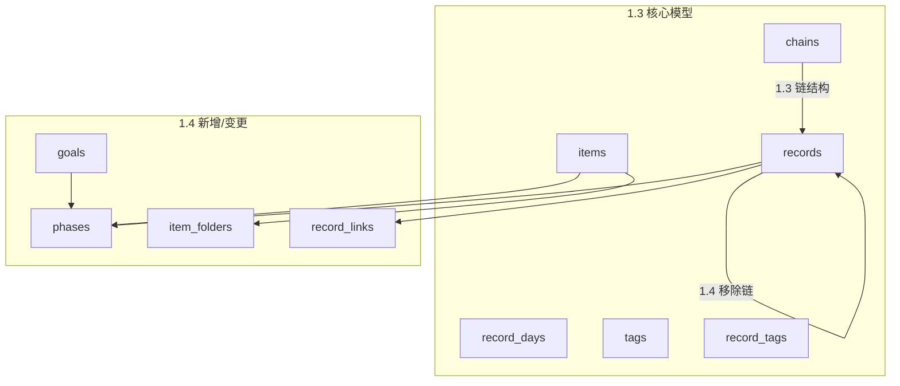
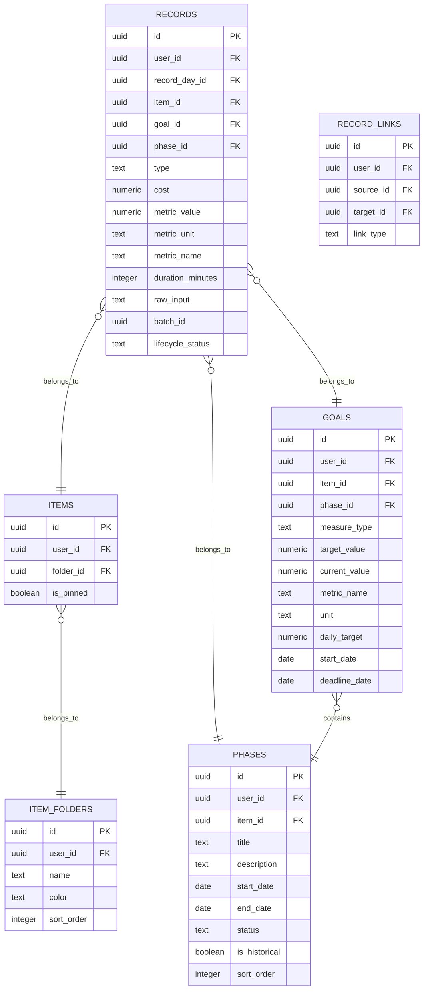
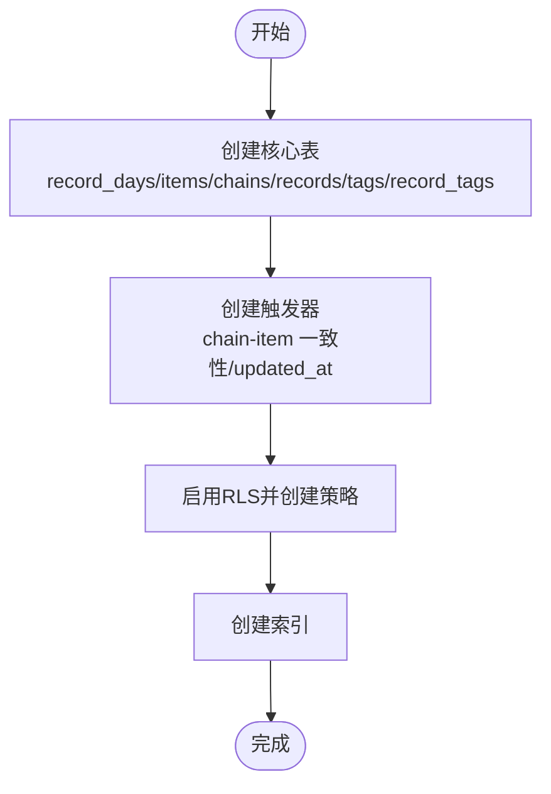
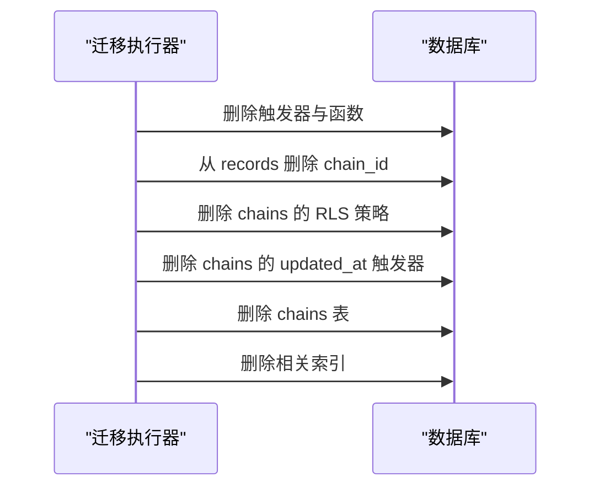
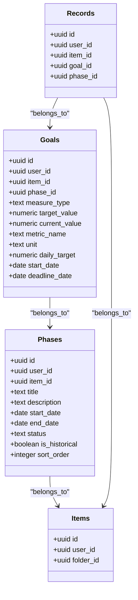
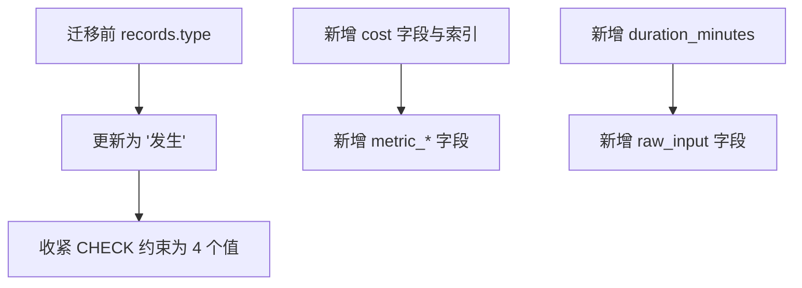
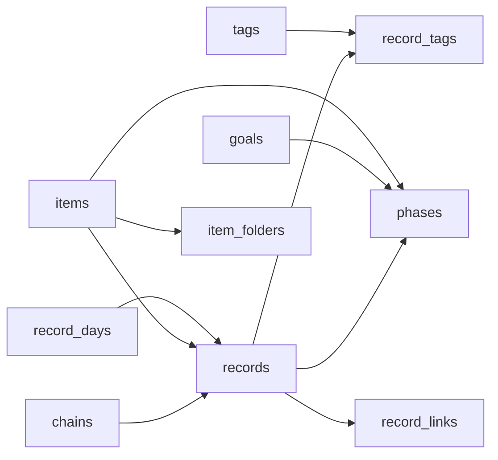

# 数据库迁移管理

<cite>
**本文引用的文件**
- [sql/001_teto_1_3_records_model.sql](file://sql/001_teto_1_3_records_model.sql)
- [sql/002_drop_chain_structure.sql](file://sql/002_drop_chain_structure.sql)
- [sql/003_teto_1_4_phases_and_goals.sql](file://sql/003_teto_1_4_phases_and_goals.sql)
- [sql/004_teto_1_4_record_type_convergence.sql](file://sql/004_teto_1_4_record_type_convergence.sql)
- [sql/005_teto_1_4_status_chinese_migration.sql](file://sql/005_teto_1_4_status_chinese_migration.sql)
- [sql/006_item_folders.sql](file://sql/006_item_folders.sql)
- [sql/007_record_metric_fields.sql](file://sql/007_record_metric_fields.sql)
- [sql/008_add_raw_input_to_records.sql](file://sql/008_add_raw_input_to_records.sql)
- [sql/008_record_links_and_batch.sql](file://sql/008_record_links_and_batch.sql)
- [sql/009_teto_1_4_topic_module_upgrade.sql](file://sql/009_teto_1_4_topic_module_upgrade.sql)
- [sql/010_goal_benchmark_fields.sql](file://sql/010_goal_benchmark_fields.sql)
- [docs/01-生效版本/TETO 1.4/TETO 1.4 开发规则.md](file://docs/01-生效版本/TETO 1.4/TETO 1.4 开发规则.md)
- [docs/01-生效版本/TETO 1.4/1.4 思路2.md](file://docs/01-生效版本/TETO 1.4/1.4 思路2.md)
- [README.md](file://README.md)
</cite>

## 目录
1. [简介](#简介)
2. [项目结构](#项目结构)
3. [核心组件](#核心组件)
4. [架构总览](#架构总览)
5. [详细组件分析](#详细组件分析)
6. [依赖分析](#依赖分析)
7. [性能考虑](#性能考虑)
8. [故障排查指南](#故障排查指南)
9. [结论](#结论)
10. [附录](#附录)

## 简介
本文件面向 TETO 从 1.3 版本到 1.4 版本的数据库迁移管理，系统性阐述版本化迁移策略、脚本组织结构、执行顺序与依赖关系。重点覆盖以下方面：
- 1.3 到 1.4 的重大架构变更：链结构移除、目标模块升级、阶段与目标模型引入、记录类型收敛与字段增强等
- 数据迁移最佳实践、回滚机制与风险控制
- 迁移执行指南、常见问题与性能优化建议
- 迁移前备份策略与迁移后验证步骤
- 增量迁移与批量数据处理的实现方式

## 项目结构
数据库迁移脚本位于 sql 目录，采用编号前缀的顺序化命名，确保幂等性与可追溯性。1.4 版本迁移脚本围绕“记录—事项—阶段—目标”的语义模型展开，同时兼容 1.3 的遗留结构（如链结构的清理）。



**图表来源**
- [sql/001_teto_1_3_records_model.sql:18-85](file://sql/001_teto_1_3_records_model.sql#L18-L85)
- [sql/002_drop_chain_structure.sql:16-49](file://sql/002_drop_chain_structure.sql#L16-L49)
- [sql/003_teto_1_4_phases_and_goals.sql:16-61](file://sql/003_teto_1_4_phases_and_goals.sql#L16-L61)
- [sql/006_item_folders.sql:8-19](file://sql/006_item_folders.sql#L8-L19)
- [sql/008_record_links_and_batch.sql:7-26](file://sql/008_record_links_and_batch.sql#L7-L26)

**章节来源**
- [README.md: 67-73:67-73](file://README.md#L67-L73)

## 核心组件
- 记录模型（1.3）：record_days、items、chains、records、tags、record_tags，包含触发器、RLS 策略与索引
- 链结构清理：移除 chain 表及其相关触发器、索引、RLS 策略
- 目标与阶段模型（1.4）：goals、phases，以及 items、records 的外键扩展
- 记录类型收敛与度量字段：type 收敛、cost、metric_*、duration_minutes、raw_input
- 历史导入支撑：record_links、batch_id、lifecycle_status
- 事项文件夹：item_folders、items.folder_id
- 目标基准字段：benchmark 配置字段，支持量化目标

**章节来源**
- [sql/001_teto_1_3_records_model.sql: 18-300:18-300](file://sql/001_teto_1_3_records_model.sql#L18-L300)
- [sql/002_drop_chain_structure.sql: 16-49:16-49](file://sql/002_drop_chain_structure.sql#L16-L49)
- [sql/003_teto_1_4_phases_and_goals.sql: 16-130:16-130](file://sql/003_teto_1_4_phases_and_goals.sql#L16-L130)
- [sql/004_teto_1_4_record_type_convergence.sql: 7-20:7-20](file://sql/004_teto_1_4_record_type_convergence.sql#L7-L20)
- [sql/005_teto_1_4_status_chinese_migration.sql: 12-38:12-38](file://sql/005_teto_1_4_status_chinese_migration.sql#L12-L38)
- [sql/006_item_folders.sql: 8-38:8-38](file://sql/006_item_folders.sql#L8-L38)
- [sql/007_record_metric_fields.sql: 8-20:8-20](file://sql/007_record_metric_fields.sql#L8-L20)
- [sql/008_add_raw_input_to_records.sql: 9-12:9-12](file://sql/008_add_raw_input_to_records.sql#L9-L12)
- [sql/008_record_links_and_batch.sql: 7-32:7-32](file://sql/008_record_links_and_batch.sql#L7-L32)
- [sql/009_teto_1_4_topic_module_upgrade.sql: 19-97:19-97](file://sql/009_teto_1_4_topic_module_upgrade.sql#L19-L97)
- [sql/010_goal_benchmark_fields.sql: 11-40:11-40](file://sql/010_goal_benchmark_fields.sql#L11-L40)

## 架构总览
1.4 版本在 1.3 的“记录—事项—洞察”骨架上，新增“阶段—目标”层级，强化长期连续性与历史导入能力。核心变更包括：
- 移除链结构（chains 表与相关约束/触发器/索引）
- 新增 goals、phases 表，并为 items、records 添加 goal_id 外键
- 记录类型收敛与度量字段增强，支持原始输入与批次/生命周期状态
- 事项文件夹与记录微关联，支撑历史导入与阶段视图



**图表来源**
- [sql/001_teto_1_3_records_model.sql:18-85](file://sql/001_teto_1_3_records_model.sql#L18-L85)
- [sql/003_teto_1_4_phases_and_goals.sql:16-61](file://sql/003_teto_1_4_phases_and_goals.sql#L16-L61)
- [sql/006_item_folders.sql:8-19](file://sql/006_item_folders.sql#L8-L19)
- [sql/008_record_links_and_batch.sql:7-26](file://sql/008_record_links_and_batch.sql#L7-L26)
- [sql/009_teto_1_4_topic_module_upgrade.sql:30-84](file://sql/009_teto_1_4_topic_module_upgrade.sql#L30-L84)
- [sql/010_goal_benchmark_fields.sql:11-30](file://sql/010_goal_benchmark_fields.sql#L11-L30)

## 详细组件分析

### 1.3 核心记录模型（幂等建表、触发器、RLS、索引）
- 建表顺序遵循外键依赖：record_days → items → chains → records；tags → record_tags
- 触发器保障数据一致性（如 chain/item 一致性）与 updated_at 自动更新
- RLS 策略限定每张表的访问范围
- 索引覆盖常用查询路径（按用户+日期、按用户+occurred_at 等）



**图表来源**
- [sql/001_teto_1_3_records_model.sql: 18-300:18-300](file://sql/001_teto_1_3_records_model.sql#L18-L300)

**章节来源**
- [sql/001_teto_1_3_records_model.sql: 18-300:18-300](file://sql/001_teto_1_3_records_model.sql#L18-L300)

### 2. 链结构移除（1.3 → 1.4 的关键清理）
- 删除 chain/item 一致性触发器与函数
- 从 records 删除 chain_id 外键字段
- 删除 chains 表的 RLS 策略与 updated_at 触发器
- 删除 chains 表与相关索引



**图表来源**
- [sql/002_drop_chain_structure.sql: 16-49:16-49](file://sql/002_drop_chain_structure.sql#L16-L49)

**章节来源**
- [sql/002_drop_chain_structure.sql: 16-49:16-49](file://sql/002_drop_chain_structure.sql#L16-L49)

### 3. 目标与阶段模型（Goals/Phases）
- 新增 goals 表（目标）与 phases 表（阶段）
- 为 items、records 添加 goal_id 外键
- 为 goals、phases 建立 updated_at 触发器、RLS 策略与索引
- 为 items、records 新增索引以支撑查询



**图表来源**
- [sql/003_teto_1_4_phases_and_goals.sql: 16-61:16-61](file://sql/003_teto_1_4_phases_and_goals.sql#L16-L61)
- [sql/009_teto_1_4_topic_module_upgrade.sql: 30-84:30-84](file://sql/009_teto_1_4_topic_module_upgrade.sql#L30-L84)

**章节来源**
- [sql/003_teto_1_4_phases_and_goals.sql: 16-130:16-130](file://sql/003_teto_1_4_phases_and_goals.sql#L16-L130)
- [sql/009_teto_1_4_topic_module_upgrade.sql: 29-84:29-84](file://sql/009_teto_1_4_topic_module_upgrade.sql#L29-L84)

### 4. 记录类型收敛与度量字段
- 新增 cost 字段与索引
- 将旧类型（情绪/花费/结果）收敛为“发生”，并收紧 CHECK 约束
- 新增 metric_value/unit/name、duration_minutes
- 新增 raw_input 字段并添加注释



**图表来源**
- [sql/004_teto_1_4_record_type_convergence.sql: 7-20:7-20](file://sql/004_teto_1_4_record_type_convergence.sql#L7-L20)
- [sql/007_record_metric_fields.sql: 8-20:8-20](file://sql/007_record_metric_fields.sql#L8-L20)
- [sql/008_add_raw_input_to_records.sql: 9-12:9-12](file://sql/008_add_raw_input_to_records.sql#L9-L12)

**章节来源**
- [sql/004_teto_1_4_record_type_convergence.sql: 7-20:7-20](file://sql/004_teto_1_4_record_type_convergence.sql#L7-L20)
- [sql/007_record_metric_fields.sql: 8-20:8-20](file://sql/007_record_metric_fields.sql#L8-L20)
- [sql/008_add_raw_input_to_records.sql: 9-12:9-12](file://sql/008_add_raw_input_to_records.sql#L9-L12)

### 5. 状态中文化迁移
- 将 goals、phases 的 status 从英文映射到中文
- 更新 CHECK 约束与默认值

**章节来源**
- [sql/005_teto_1_4_status_chinese_migration.sql: 12-38:12-38](file://sql/005_teto_1_4_status_chinese_migration.sql#L12-L38)

### 6. 事项文件夹与记录微关联
- 新增 item_folders 表与 items.folder_id
- 新增 record_links 关联表与记录生命周期字段（batch_id、lifecycle_status）

```mermaid
sequenceDiagram
participant User as "用户"
participant Items as "items"
participant Folders as "item_folders"
participant Records as "records"
participant Links as "record_links"
User->>Folders : 创建/选择文件夹
Folders-->>Items : 设置 folder_id
User->>Records : 创建记录可选 batch_id
Records-->>Links : 建立 source/target 关联
Records-->>Records : 设置 lifecycle_status
```

**图表来源**
- [sql/006_item_folders.sql: 8-38:8-38](file://sql/006_item_folders.sql#L8-L38)
- [sql/008_record_links_and_batch.sql: 7-32:7-32](file://sql/008_record_links_and_batch.sql#L7-L32)

**章节来源**
- [sql/006_item_folders.sql: 8-38:8-38](file://sql/006_item_folders.sql#L8-L38)
- [sql/008_record_links_and_batch.sql: 7-32:7-32](file://sql/008_record_links_and_batch.sql#L7-L32)

### 7. 事项模块升级与目标量化引擎字段
- items 新增 is_pinned 与索引
- goals 新增 item_id/phase_id、measure_type、target_value/current_value、benchmark 字段
- phases 清理 goal_id（先置空再删除），删除旧索引
- records 新增 phase_id 与索引

**章节来源**
- [sql/009_teto_1_4_topic_module_upgrade.sql: 19-97:19-97](file://sql/009_teto_1_4_topic_module_upgrade.sql#L19-L97)
- [sql/010_goal_benchmark_fields.sql: 11-40:11-40](file://sql/010_goal_benchmark_fields.sql#L11-L40)

## 依赖分析
- 外键依赖链：record_days → records；items → records、phases；chains → records（1.3）→ records（1.4 已移除）
- RLS 与索引：每张表均有对应策略与索引，确保安全性与查询性能
- 幂等性：大量 IF NOT EXISTS/IF EXISTS 与 DO $$ ... $$ 保证重复执行安全



**图表来源**
- [sql/001_teto_1_3_records_model.sql:18-109](file://sql/001_teto_1_3_records_model.sql#L18-L109)
- [sql/002_drop_chain_structure.sql:24-42](file://sql/002_drop_chain_structure.sql#L24-L42)
- [sql/003_teto_1_4_phases_and_goals.sql:54-61](file://sql/003_teto_1_4_phases_and_goals.sql#L54-L61)
- [sql/006_item_folders.sql:19-37](file://sql/006_item_folders.sql#L19-L37)
- [sql/008_record_links_and_batch.sql:25-31](file://sql/008_record_links_and_batch.sql#L25-L31)
- [sql/009_teto_1_4_topic_module_upgrade.sql:84-87](file://sql/009_teto_1_4_topic_module_upgrade.sql#L84-L87)

**章节来源**
- [sql/001_teto_1_3_records_model.sql: 18-109:18-109](file://sql/001_teto_1_3_records_model.sql#L18-L109)
- [sql/002_drop_chain_structure.sql: 24-42:24-42](file://sql/002_drop_chain_structure.sql#L24-L42)
- [sql/003_teto_1_4_phases_and_goals.sql: 54-61:54-61](file://sql/003_teto_1_4_phases_and_goals.sql#L54-L61)
- [sql/006_item_folders.sql: 19-37:19-37](file://sql/006_item_folders.sql#L19-L37)
- [sql/008_record_links_and_batch.sql: 25-31:25-31](file://sql/008_record_links_and_batch.sql#L25-L31)
- [sql/009_teto_1_4_topic_module_upgrade.sql: 84-87:84-87](file://sql/009_teto_1_4_topic_module_upgrade.sql#L84-L87)

## 性能考虑
- 索引策略：按用户维度与常用过滤字段建立索引，减少扫描范围
- 触发器开销：updated_at 触发器为常规操作，chain-item 一致性触发器在 1.4 已移除，降低写入成本
- 查询路径：记录类型收敛与度量字段分离，便于按需查询与统计
- 批量处理：通过 batch_id 与生命周期状态，支持批量导入与状态流转

[本节为通用性能指导，无需特定文件引用]

## 故障排查指南
- 幂等性失败：检查 IF NOT EXISTS/IF EXISTS 使用是否正确，确认重复执行的安全性
- 外键约束错误：核对 items/goals/phases 的外键设置与索引是否存在
- RLS 策略异常：确认 auth.uid() 与 user_id 的匹配关系
- 数据迁移不一致：核对状态中文化与记录类型收敛的更新语句
- 链结构残留：确认 triggers、functions、columns、indexes 是否全部清理

**章节来源**
- [sql/002_drop_chain_structure.sql: 16-49:16-49](file://sql/002_drop_chain_structure.sql#L16-L49)
- [sql/005_teto_1_4_status_chinese_migration.sql: 12-38:12-38](file://sql/005_teto_1_4_status_chinese_migration.sql#L12-L38)
- [sql/004_teto_1_4_record_type_convergence.sql: 14-20:14-20](file://sql/004_teto_1_4_record_type_convergence.sql#L14-L20)

## 结论
TETO 1.4 的数据库迁移以“记录—事项—阶段—目标”为核心语义，通过链结构移除、目标与阶段建模、记录类型收敛与度量增强、历史导入支撑等手段，实现了从“现实入口”到“连续人生现实”的系统升级。迁移脚本遵循幂等性与顺序化执行原则，配合 RLS 与索引策略，兼顾安全性与性能。建议在生产环境执行前进行充分备份与验证，并结合本文提供的执行指南与排障建议，确保迁移顺利落地。

[本节为总结性内容，无需特定文件引用]

## 附录

### A. 迁移执行指南（1.3 → 1.4）
- 准备阶段
  - 备份数据库（逻辑/物理均可）
  - 停止写入或切换到只读窗口
- 执行顺序
  1) 链结构清理：[sql/002_drop_chain_structure.sql:16-49](file://sql/002_drop_chain_structure.sql#L16-L49)
  2) 目标与阶段模型：[sql/003_teto_1_4_phases_and_goals.sql:16-130](file://sql/003_teto_1_4_phases_and_goals.sql#L16-L130)
  3) 记录类型收敛与度量字段：[sql/004_teto_1_4_record_type_convergence.sql:7-20](file://sql/004_teto_1_4_record_type_convergence.sql#L7-L20)、[sql/007_record_metric_fields.sql:8-20](file://sql/007_record_metric_fields.sql#L8-L20)
  4) 状态中文化：[sql/005_teto_1_4_status_chinese_migration.sql:12-38](file://sql/005_teto_1_4_status_chinese_migration.sql#L12-L38)
  5) 事项文件夹与记录微关联：[sql/006_item_folders.sql:8-38](file://sql/006_item_folders.sql#L8-L38)、[sql/008_record_links_and_batch.sql:7-32](file://sql/008_record_links_and_batch.sql#L7-L32)
  6) 事项模块升级与目标量化字段：[sql/009_teto_1_4_topic_module_upgrade.sql:19-97](file://sql/009_teto_1_4_topic_module_upgrade.sql#L19-L97)、[sql/010_goal_benchmark_fields.sql:11-40](file://sql/010_goal_benchmark_fields.sql#L11-L40)
- 验证步骤
  - 核查表结构与索引存在性
  - 核查 RLS 策略生效
  - 核查数据迁移（状态映射、类型收敛）
  - 核查外键关系与约束
  - 核查历史导入与阶段视图可用性

**章节来源**
- [sql/002_drop_chain_structure.sql: 16-49:16-49](file://sql/002_drop_chain_structure.sql#L16-L49)
- [sql/003_teto_1_4_phases_and_goals.sql: 16-130:16-130](file://sql/003_teto_1_4_phases_and_goals.sql#L16-L130)
- [sql/004_teto_1_4_record_type_convergence.sql: 7-20:7-20](file://sql/004_teto_1_4_record_type_convergence.sql#L7-L20)
- [sql/005_teto_1_4_status_chinese_migration.sql: 12-38:12-38](file://sql/005_teto_1_4_status_chinese_migration.sql#L12-L38)
- [sql/006_item_folders.sql: 8-38:8-38](file://sql/006_item_folders.sql#L8-L38)
- [sql/007_record_metric_fields.sql: 8-20:8-20](file://sql/007_record_metric_fields.sql#L8-L20)
- [sql/008_record_links_and_batch.sql: 7-32:7-32](file://sql/008_record_links_and_batch.sql#L7-L32)
- [sql/009_teto_1_4_topic_module_upgrade.sql: 19-97:19-97](file://sql/009_teto_1_4_topic_module_upgrade.sql#L19-L97)
- [sql/010_goal_benchmark_fields.sql: 11-40:11-40](file://sql/010_goal_benchmark_fields.sql#L11-L40)

### B. 数据迁移最佳实践
- 幂等性：使用 IF NOT EXISTS/IF EXISTS 与条件删除
- 事务包裹：将相关 DDL/DML 放入事务，失败回滚
- 分批处理：大批量数据迁移时分批执行，避免锁表时间过长
- 备份优先：迁移前全量备份，迁移后校验一致性

[本节为通用实践建议，无需特定文件引用]

### C. 回滚机制与风险控制
- 回滚策略：针对可逆变更（字段添加/索引/RLS）可直接撤销；对于数据迁移（状态映射）需准备反向映射
- 风险控制：灰度发布、只读窗口、监控与告警、快速回滚预案

[本节为通用风险控制建议，无需特定文件引用]

### D. 增量迁移与批量处理
- 增量迁移：通过 batch_id 与 lifecycle_status 实现批次拆分与状态流转
- 批量处理：利用索引与分区（如按日期）提升导入性能

**章节来源**
- [sql/008_record_links_and_batch.sql: 24-32:24-32](file://sql/008_record_links_and_batch.sql#L24-L32)

### E. 迁移前备份与迁移后验证
- 备份策略：逻辑备份（pg_dump）+ 物理备份（根据环境选择）
- 验证清单：表结构、索引、RLS、外键、数据完整性、历史导入与阶段视图

**章节来源**
- [README.md: 67-73:67-73](file://README.md#L67-L73)