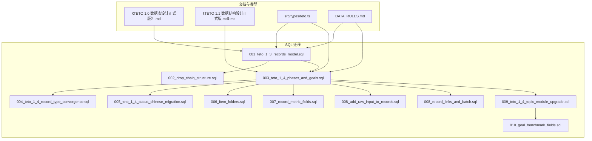
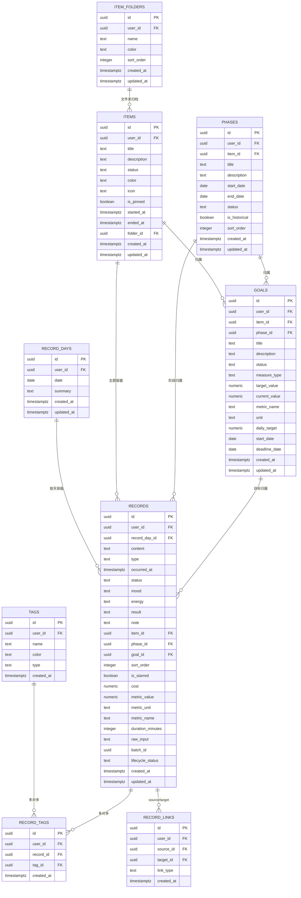
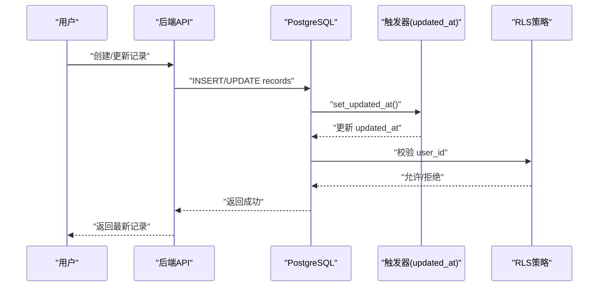
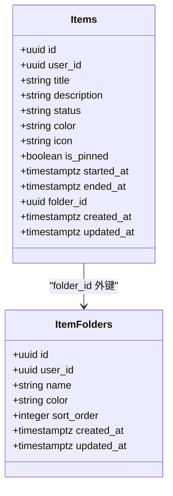
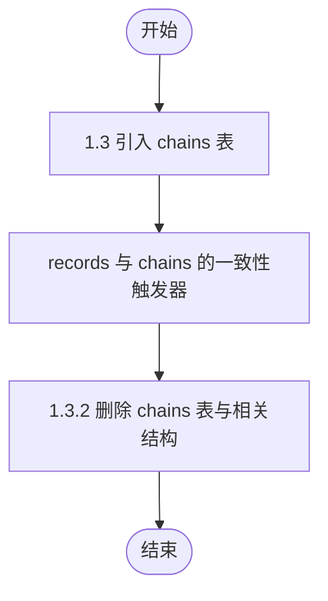
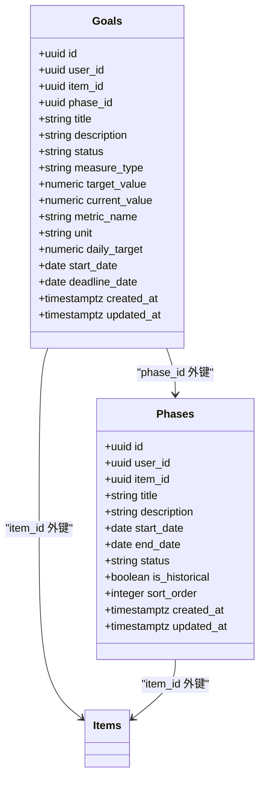
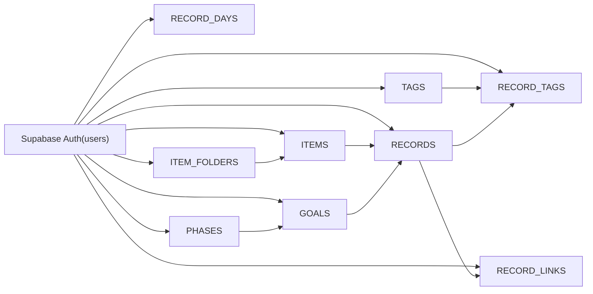

# 数据模型设计

<cite>
**本文引用的文件**
- [《TETO 1.0 数据表设计（正式版）》.md](file://docs/10-版本归档/TETO 1.0.0/《TETO 1.0 数据表设计（正式版）》.md)
- [《TETO 1.1 数据结构设计正式版.md》.md](file://docs/10-版本归档/TETO 1.1.0/TETO 1.1 数据结构设计正式版.md)
- [001_teto_1_3_records_model.sql](file://sql/001_teto_1_3_records_model.sql)
- [002_drop_chain_structure.sql](file://sql/002_drop_chain_structure.sql)
- [003_teto_1_4_phases_and_goals.sql](file://sql/003_teto_1_4_phases_and_goals.sql)
- [004_teto_1_4_record_type_convergence.sql](file://sql/004_teto_1_4_record_type_convergence.sql)
- [005_teto_1_4_status_chinese_migration.sql](file://sql/005_teto_1_4_status_chinese_migration.sql)
- [006_item_folders.sql](file://sql/006_item_folders.sql)
- [007_record_metric_fields.sql](file://sql/007_record_metric_fields.sql)
- [008_add_raw_input_to_records.sql](file://sql/008_add_raw_input_to_records.sql)
- [008_record_links_and_batch.sql](file://sql/008_record_links_and_batch.sql)
- [009_teto_1_4_topic_module_upgrade.sql](file://sql/009_teto_1_4_topic_module_upgrade.sql)
- [010_goal_benchmark_fields.sql](file://sql/010_goal_benchmark_fields.sql)
- [DATA_RULES.md](file://DATA_RULES.md)
- [teto.ts](file://src/types/teto.ts)
- [README.md](file://README.md)
</cite>

## 目录
1. [简介](#简介)
2. [项目结构](#项目结构)
3. [核心组件](#核心组件)
4. [架构总览](#架构总览)
5. [详细组件分析](#详细组件分析)
6. [依赖分析](#依赖分析)
7. [性能考量](#性能考量)
8. [故障排查指南](#故障排查指南)
9. [结论](#结论)
10. [附录](#附录)

## 简介
本文件面向 TETO 数据模型设计，系统梳理从 1.0 到 1.4 的演进历程，聚焦 RECORDS、ITEMS、CHAINS（已移除）、TAGS、GOALS、PHASES、ITEM_FOLDERS、RECORD_LINKS 等核心实体，阐明其业务含义、字段设计、约束与验证规则、主外键关系、索引策略与性能优化，并给出版本兼容性说明与数据完整性保障机制。文档同时结合 SQL 脚本与前端类型定义，提供可追溯的来源标注与可视化图示。

## 项目结构
- 文档与版本归档：位于 docs/10-版本归档 下，涵盖 TETO 1.0.0、1.1.0 的数据设计文档。
- SQL 迁移脚本：位于 sql/，按版本与功能模块组织，覆盖建表、约束、触发器、RLS、索引与字段演进。
- 类型定义：位于 src/types/teto.ts，定义前端与后端交互的实体接口与枚举，确保数据契约一致。
- 数据规则：DATA_RULES.md 明确“真源”与统计口径，指导业务规则落地。

**图示来源**
- [001_teto_1_3_records_model.sql:1-300](file://sql/001_teto_1_3_records_model.sql#L1-L300)
- [002_drop_chain_structure.sql:1-49](file://sql/002_drop_chain_structure.sql#L1-L49)
- [003_teto_1_4_phases_and_goals.sql:1-130](file://sql/003_teto_1_4_phases_and_goals.sql#L1-L130)
- [004_teto_1_4_record_type_convergence.sql:1-20](file://sql/004_teto_1_4_record_type_convergence.sql#L1-L20)
- [005_teto_1_4_status_chinese_migration.sql:1-38](file://sql/005_teto_1_4_status_chinese_migration.sql#L1-L38)
- [006_item_folders.sql:1-38](file://sql/006_item_folders.sql#L1-L38)
- [007_record_metric_fields.sql:1-20](file://sql/007_record_metric_fields.sql#L1-L20)
- [008_add_raw_input_to_records.sql:1-12](file://sql/008_add_raw_input_to_records.sql#L1-L12)
- [008_record_links_and_batch.sql:1-32](file://sql/008_record_links_and_batch.sql#L1-L32)
- [009_teto_1_4_topic_module_upgrade.sql:1-97](file://sql/009_teto_1_4_topic_module_upgrade.sql#L1-L97)
- [010_goal_benchmark_fields.sql:1-40](file://sql/010_goal_benchmark_fields.sql#L1-L40)
- [teto.ts:1-516](file://src/types/teto.ts#L1-L516)
- [DATA_RULES.md:1-174](file://DATA_RULES.md#L1-L174)

**章节来源**
- [README.md:1-126](file://README.md#L1-L126)

## 核心组件
本节聚焦 TETO 1.3/1.4 的核心实体及其职责与字段设计要点：

- RECORDS（记录项）
  - 业务含义：最小事实单元，承载“发生/计划/想法/总结”等类型的记录，支持成本、度量、时长、原始输入、微关联与生命周期状态。
  - 关键字段：content、type、occurred_at、cost、metric_value/unit/name、duration_minutes、raw_input、phase_id、goal_id、batch_id、lifecycle_status、linked_record_id 等。
  - 约束与验证：type 收敛为“发生/计划/想法/总结”，cost/duration_minutes 为数值型，lifecycle_status 枚举校验。
  - 关系：属于 record_days；可选归属 items/phase/goals；支持 record_links 微关联；支持 tags 多对多。

- ITEMS（事项）
  - 业务含义：主题容器，代表“学习、工作、生活”等维度的事项，支持状态、图标、颜色、置顶、文件夹归档。
  - 关键字段：title/description/status/color/icon/is_pinned/folder_id 等。
  - 约束与验证：status 枚举，is_pinned 布尔默认 false。
  - 关系：可挂载 goals；可包含 records；可归档至 item_folders。

- CHAINS（事件链）
  - 业务含义：TETO 1.3 引入的“事项内部事件链”，用于串联阶段性进展；1.3 三页重构后在 1.3.2 被移除。
  - 关系：records 与 items 的一致性约束曾依赖 chains；移除后不再存在。

- TAGS（标签）
  - 业务含义：记录的标签，支持 name、color、type。
  - 关系：与 records 通过 record_tags 多对多关联。

- RECORD_TAGS（记录-标签）
  - 业务含义：记录与标签的多对多中间表，保证唯一性。
  - 关系：分别引用 records/tags。

- GOALS（目标）
  - 业务含义：方向层对象，支持 measure_type（boolean/numeric）、target_value/current_value、benchmark 字段（metric_name/unit/daily_target/start_date/deadline_date）。
  - 关系：可归属 items/phase；与 records 通过 goal_id 关联。

- PHASES（阶段）
  - 业务含义：事项在某段时间的持续现实概括，支持 start_date/end_date/status/is_historical/sort_order。
  - 关系：归属 items；可挂载 goals；与 records 通过 phase_id 关联。

- ITEM_FOLDERS（事项文件夹）
  - 业务含义：对 items 进行逻辑分组与排序。
  - 关系：items.folder_id 外键。

- RECORD_LINKS（记录微关联）
  - 业务含义：记录间的关系（完成、衍生、推迟、相关），支持 source/target 双向。
  - 关系：records 与 records 的多对多，带 link_type 枚举与唯一约束。

**章节来源**
- [001_teto_1_3_records_model.sql:11-300](file://sql/001_teto_1_3_records_model.sql#L11-L300)
- [002_drop_chain_structure.sql:1-49](file://sql/002_drop_chain_structure.sql#L1-L49)
- [003_teto_1_4_phases_and_goals.sql:1-130](file://sql/003_teto_1_4_phases_and_goals.sql#L1-L130)
- [004_teto_1_4_record_type_convergence.sql:1-20](file://sql/004_teto_1_4_record_type_convergence.sql#L1-L20)
- [005_teto_1_4_status_chinese_migration.sql:1-38](file://sql/005_teto_1_4_status_chinese_migration.sql#L1-L38)
- [006_item_folders.sql:1-38](file://sql/006_item_folders.sql#L1-L38)
- [007_record_metric_fields.sql:1-20](file://sql/007_record_metric_fields.sql#L1-L20)
- [008_add_raw_input_to_records.sql:1-12](file://sql/008_add_raw_input_to_records.sql#L1-L12)
- [008_record_links_and_batch.sql:1-32](file://sql/008_record_links_and_batch.sql#L1-L32)
- [009_teto_1_4_topic_module_upgrade.sql:1-97](file://sql/009_teto_1_4_topic_module_upgrade.sql#L1-L97)
- [010_goal_benchmark_fields.sql:1-40](file://sql/010_goal_benchmark_fields.sql#L1-L40)
- [teto.ts:1-516](file://src/types/teto.ts#L1-L516)

## 架构总览
下图展示 TETO 1.3/1.4 的核心实体关系与演进路径，突出 RECORDS 与 ITEMS 的主从关系、GOALS/PHASES 的挂载关系、TAGS 的多对多、RECORD_LINKS 的微关联，以及 CHAINS 的历史存在与移除。

**图示来源**
- [001_teto_1_3_records_model.sql:11-300](file://sql/001_teto_1_3_records_model.sql#L11-L300)
- [003_teto_1_4_phases_and_goals.sql:1-130](file://sql/003_teto_1_4_phases_and_goals.sql#L1-L130)
- [006_item_folders.sql:1-38](file://sql/006_item_folders.sql#L1-L38)
- [008_record_links_and_batch.sql:1-32](file://sql/008_record_links_and_batch.sql#L1-L32)
- [009_teto_1_4_topic_module_upgrade.sql:1-97](file://sql/009_teto_1_4_topic_module_upgrade.sql#L1-L97)
- [teto.ts:1-516](file://src/types/teto.ts#L1-L516)

## 详细组件分析

### RECORDS（记录项）分析
- 设计理念
  - 最小事实单元，承载“发生/计划/想法/总结”四种类型，统一时间锚点 occurred_at，支持成本、度量、时长、原始输入与生命周期状态。
  - 通过 batch_id 支持一次输入拆分出的多条记录；通过 lifecycle_status 支持 Todo 流程状态管理。
- 字段与约束
  - type 收敛为“发生/计划/想法/总结”，并提供 CHECK 约束。
  - cost/duration_minutes/metric_value 为数值型，metric_unit/name 提供结构化统计能力。
  - lifecycle_status 枚举校验，避免与 records.status 冲突。
- 关系与完整性
  - record_day_id 外键保证按天聚合；item_id/phase_id/goal_id 可选挂载，形成“主题-阶段-目标-记录”的完整链路。
  - 通过 record_tags 与 tags 建立多对多；通过 record_links 建立微关联。
- 性能与索引
  - idx_records_user_day、idx_records_user_occurred、idx_records_item、idx_records_chain（移除前）、idx_records_goal、idx_records_cost、idx_records_batch_id 等索引支撑高频查询。

**图示来源**
- [001_teto_1_3_records_model.sql:112-190](file://sql/001_teto_1_3_records_model.sql#L112-L190)
- [004_teto_1_4_record_type_convergence.sql:1-20](file://sql/004_teto_1_4_record_type_convergence.sql#L1-L20)
- [007_record_metric_fields.sql:1-20](file://sql/007_record_metric_fields.sql#L1-L20)
- [008_add_raw_input_to_records.sql:1-12](file://sql/008_add_raw_input_to_records.sql#L1-L12)
- [008_record_links_and_batch.sql:1-32](file://sql/008_record_links_and_batch.sql#L1-L32)
- [009_teto_1_4_topic_module_upgrade.sql:80-97](file://sql/009_teto_1_4_topic_module_upgrade.sql#L80-L97)

**章节来源**
- [001_teto_1_3_records_model.sql:66-85](file://sql/001_teto_1_3_records_model.sql#L66-L85)
- [004_teto_1_4_record_type_convergence.sql:1-20](file://sql/004_teto_1_4_record_type_convergence.sql#L1-L20)
- [007_record_metric_fields.sql:1-20](file://sql/007_record_metric_fields.sql#L1-L20)
- [008_add_raw_input_to_records.sql:1-12](file://sql/008_add_raw_input_to_records.sql#L1-L12)
- [008_record_links_and_batch.sql:1-32](file://sql/008_record_links_and_batch.sql#L1-L32)
- [009_teto_1_4_topic_module_upgrade.sql:80-97](file://sql/009_teto_1_4_topic_module_upgrade.sql#L80-L97)
- [teto.ts:37-74](file://src/types/teto.ts#L37-L74)

### ITEMS（事项）分析
- 设计理念
  - 作为主题容器，承载状态、图标、颜色、置顶与文件夹归档，支持与目标、记录、阶段的多维关联。
- 字段与约束
  - status 枚举，is_pinned 默认 false；folder_id 外键指向 item_folders。
- 关系与完整性
  - 与 goals/records/record_links/record_tags 形成多对多或一对多关系；与 item_folders 建立一对多。

**图示来源**
- [006_item_folders.sql:1-38](file://sql/006_item_folders.sql#L1-L38)
- [teto.ts:76-94](file://src/types/teto.ts#L76-L94)

**章节来源**
- [006_item_folders.sql:1-38](file://sql/006_item_folders.sql#L1-L38)
- [teto.ts:76-94](file://src/types/teto.ts#L76-L94)

### CHAINS（事件链）分析（已移除）
- 历史背景
  - TETO 1.3 引入，用于串联事项内部阶段性进展；1.3.2 正式删除。
- 影响
  - 删除触发器、外键字段、索引与 RLS 策略；records 与 items 的一致性校验不再依赖 chains。

**图示来源**
- [001_teto_1_3_records_model.sql:115-150](file://sql/001_teto_1_3_records_model.sql#L115-L150)
- [002_drop_chain_structure.sql:1-49](file://sql/002_drop_chain_structure.sql#L1-L49)

**章节来源**
- [001_teto_1_3_records_model.sql:115-150](file://sql/001_teto_1_3_records_model.sql#L115-L150)
- [002_drop_chain_structure.sql:1-49](file://sql/002_drop_chain_structure.sql#L1-L49)

### TAGS 与 RECORD_TAGS 分析
- 设计理念
  - 通过 RECORD_TAGS 实现 RECORDS 与 TAGS 的多对多关系，保证唯一性与可检索性。
- 索引策略
  - idx_record_tags_record、idx_record_tags_tag 支撑高频查询。

**章节来源**
- [001_teto_1_3_records_model.sql:88-110](file://sql/001_teto_1_3_records_model.sql#L88-L110)
- [001_teto_1_3_records_model.sql:297-300](file://sql/001_teto_1_3_records_model.sql#L297-L300)

### GOALS 与 PHASES 分析
- 设计理念
  - GOALS 作为方向层对象，支持 measure_type（boolean/numeric）与 benchmark 字段（metric_name/unit/daily_target/start_date/deadline_date）。
  - PHASES 作为阶段层对象，承载时间范围与状态，支持与 GOALS 的挂载关系。
- 关系与约束
  - GOALS 可归属 ITEMS/PHASES；PHASES 不再持有 goal_id（1.4 中 Goal 挂 Phase，非反向）。
  - idx_goals_user_status、idx_goals_item、idx_goals_phase、idx_phases_user_item、idx_phases_item、idx_phases_goal 等索引。

**图示来源**
- [003_teto_1_4_phases_and_goals.sql:14-61](file://sql/003_teto_1_4_phases_and_goals.sql#L14-L61)
- [009_teto_1_4_topic_module_upgrade.sql:58-97](file://sql/009_teto_1_4_topic_module_upgrade.sql#L58-L97)
- [010_goal_benchmark_fields.sql:1-40](file://sql/010_goal_benchmark_fields.sql#L1-L40)

**章节来源**
- [003_teto_1_4_phases_and_goals.sql:1-130](file://sql/003_teto_1_4_phases_and_goals.sql#L1-L130)
- [009_teto_1_4_topic_module_upgrade.sql:1-97](file://sql/009_teto_1_4_topic_module_upgrade.sql#L1-L97)
- [010_goal_benchmark_fields.sql:1-40](file://sql/010_goal_benchmark_fields.sql#L1-L40)

### RECORD_LINKS（记录微关联）分析
- 设计理念
  - 支持“完成/衍生/推迟/相关”四种 link_type，实现记录间的微关联，提升溯源与推理能力。
- 约束与索引
  - 唯一约束 (source_id, target_id, link_type)；索引 idx_record_links_source、idx_record_links_target。

**章节来源**
- [008_record_links_and_batch.sql:1-32](file://sql/008_record_links_and_batch.sql#L1-L32)

### 数据类型选择与字段约束
- 时间与时长
  - occurred_at 使用 timestamptz；duration_minutes 使用整型分钟；cost 使用 numeric(12,2)。
- 百分比与数值
  - numeric(12,2) 保证小数精度，避免浮点误差。
- 枚举与校验
  - type/status/measure_type/lifecycle_status 等通过 CHECK 约束与前端枚举共同保证取值域一致性。
- 唯一性
  - user_id+date（RECORD_DAYS）、user_id+task_id+record_date（任务模型）、record_id+tag_id（RECORD_TAGS）等唯一约束。

**章节来源**
- [001_teto_1_3_records_model.sql:18-85](file://sql/001_teto_1_3_records_model.sql#L18-L85)
- [004_teto_1_4_record_type_convergence.sql:1-20](file://sql/004_teto_1_4_record_type_convergence.sql#L1-L20)
- [005_teto_1_4_status_chinese_migration.sql:1-38](file://sql/005_teto_1_4_status_chinese_migration.sql#L1-L38)
- [007_record_metric_fields.sql:1-20](file://sql/007_record_metric_fields.sql#L1-L20)
- [008_add_raw_input_to_records.sql:1-12](file://sql/008_add_raw_input_to_records.sql#L1-L12)
- [008_record_links_and_batch.sql:1-32](file://sql/008_record_links_and_batch.sql#L1-L32)
- [009_teto_1_4_topic_module_upgrade.sql:1-97](file://sql/009_teto_1_4_topic_module_upgrade.sql#L1-L97)
- [010_goal_benchmark_fields.sql:1-40](file://sql/010_goal_benchmark_fields.sql#L1-L40)
- [teto.ts:1-516](file://src/types/teto.ts#L1-L516)

## 依赖分析
- 实体耦合与内聚
  - RECORDS 与 ITEMS/PHASES/GOALS 的可选挂载体现了高内聚、低耦合的层次化设计。
  - TAGS 与 RECORD_TAGS 通过中间表实现解耦。
- 外部依赖
  - 所有表均通过 user_id 与 Supabase Auth 用户关联，RLS 策略确保单用户数据隔离。
- 循环依赖规避
  - GOALS/PHASES/ITEMS/RECORDS 呈现清晰的单向依赖链，未见循环依赖。

**图示来源**
- [001_teto_1_3_records_model.sql:18-110](file://sql/001_teto_1_3_records_model.sql#L18-L110)
- [003_teto_1_4_phases_and_goals.sql:16-61](file://sql/003_teto_1_4_phases_and_goals.sql#L16-L61)
- [006_item_folders.sql:8-19](file://sql/006_item_folders.sql#L8-L19)
- [008_record_links_and_batch.sql:7-22](file://sql/008_record_links_and_batch.sql#L7-L22)

**章节来源**
- [001_teto_1_3_records_model.sql:191-277](file://sql/001_teto_1_3_records_model.sql#L191-L277)
- [003_teto_1_4_phases_and_goals.sql:82-112](file://sql/003_teto_1_4_phases_and_goals.sql#L82-L112)
- [006_item_folders.sql:28-38](file://sql/006_item_folders.sql#L28-L38)
- [008_record_links_and_batch.sql:28-32](file://sql/008_record_links_and_batch.sql#L28-L32)

## 性能考量
- 索引策略
  - RECORDS：按 user_id+record_day_id、user_id+occurred_at、item_id、goal_id、cost、batch_id 建立索引，覆盖常见查询路径。
  - ITEMS：按 user_id+status、pinned=true 的部分索引，加速置顶与状态筛选。
  - PHASES/GOALS：按 user_id+status、item_id、phase_id 建立索引，支撑目标与阶段查询。
  - TAGS/RECORD_TAGS：按 record_id/tag_id 建立索引，支撑标签过滤。
- 触发器与更新时间
  - set_updated_at 触发器统一更新 updated_at，减少应用层负担。
- RLS 与并发
  - RLS 通过 auth.uid() 校验，配合索引可降低跨用户扫描风险，提升查询性能与安全性。

**章节来源**
- [001_teto_1_3_records_model.sql:279-300](file://sql/001_teto_1_3_records_model.sql#L279-L300)
- [003_teto_1_4_phases_and_goals.sql:114-129](file://sql/003_teto_1_4_phases_and_goals.sql#L114-L129)
- [006_item_folders.sql:35-38](file://sql/006_item_folders.sql#L35-L38)
- [009_teto_1_4_topic_module_upgrade.sql:22-23](file://sql/009_teto_1_4_topic_module_upgrade.sql#L22-L23)

## 故障排查指南
- 常见错误与定位
  - 记录类型不合法：type 收敛为“发生/计划/想法/总结”，CHECK 约束会拒绝非法值。
  - 目标状态不合法：GOALS/PHASES 的 status 通过 CHECK 约束与迁移脚本保证中文值一致性。
  - 记录微关联冲突：RECORD_LINKS 的唯一约束 (source_id, target_id, link_type) 防止重复关联。
  - 数据隔离问题：RLS 策略要求 user_id 与 auth.uid() 一致，否则查询/写入被拒绝。
- 诊断步骤
  - 核对枚举值与 CHECK 约束；检查唯一性索引；确认 RLS 策略启用；验证外键引用是否存在。
- 兼容性与回滚
  - 字段演进使用 IF NOT EXISTS 幂等脚本，避免重复执行导致错误；删除字段前先置空并 DROP COLUMN，保证零数据丢失。

**章节来源**
- [004_teto_1_4_record_type_convergence.sql:17-20](file://sql/004_teto_1_4_record_type_convergence.sql#L17-L20)
- [005_teto_1_4_status_chinese_migration.sql:17-38](file://sql/005_teto_1_4_status_chinese_migration.sql#L17-L38)
- [008_record_links_and_batch.sql:12-20](file://sql/008_record_links_and_batch.sql#L12-L20)
- [009_teto_1_4_topic_module_upgrade.sql:64-78](file://sql/009_teto_1_4_topic_module_upgrade.sql#L64-L78)
- [001_teto_1_3_records_model.sql:191-277](file://sql/001_teto_1_3_records_model.sql#L191-L277)

## 结论
TETO 数据模型从 1.0 的“每日记录+项目”起步，逐步演进为 1.3 的“三页重构”（今日/事项/复盘）与 1.4 的“目标-阶段-量化引擎”体系。核心实体 RECORDS、ITEMS、GOALS、PHASES、TAGS、RECORD_TAGS、ITEM_FOLDERS、RECORD_LINKS 构成清晰的层次化关系，配合完善的约束、触发器、RLS 与索引策略，在保证数据完整性的同时兼顾查询性能与可维护性。字段演进遵循幂等与向后兼容原则，确保版本平滑过渡。

## 附录
- 版本兼容性说明
  - 1.3 → 1.4：移除 CHAINS，新增 GOALS/PHASES 的 benchmark 字段，记录类型收敛，新增 lifecycle_status/batch_id/raw_input 等字段，强化结构化统计与微关联能力。
  - 1.1 → 1.3：引入 RECORD_DAYS、ITEMS、TAGS、RECORD_TAGS、RECORD_LINKS，建立“主题-记录-标签-关联”的基础框架。
- 业务规则与数据真源
  - 依据 DATA_RULES.md，任务管理为“配置真源”，今日记录为“原始事实真源”，统计分析为“聚合计算结果”，不单独维护第二套数据。

**章节来源**
- [DATA_RULES.md:1-174](file://DATA_RULES.md#L1-L174)
- [README.md:1-126](file://README.md#L1-L126)