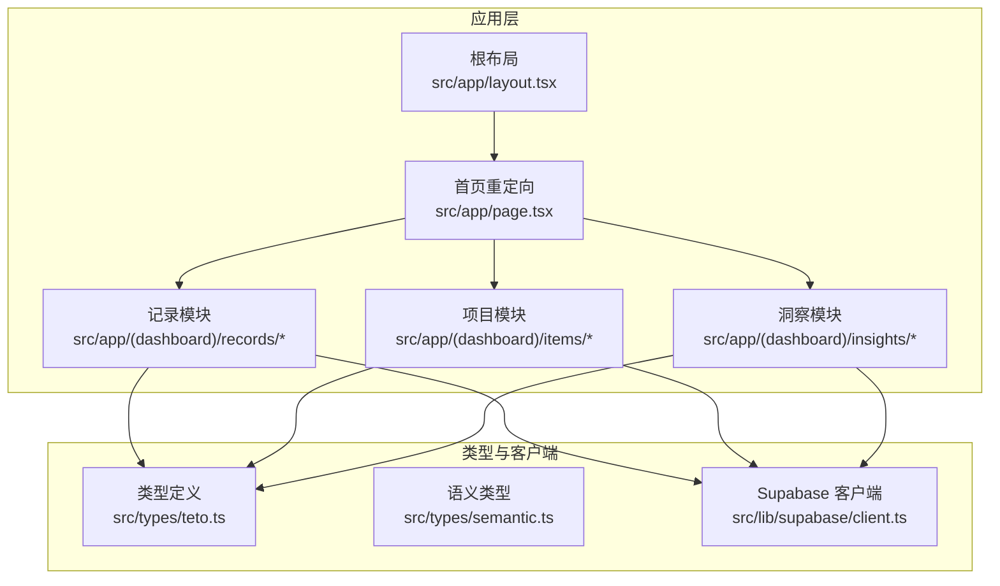
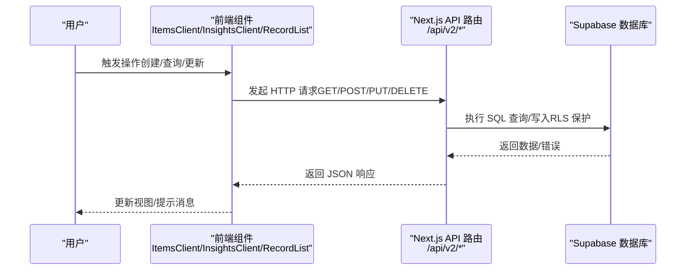
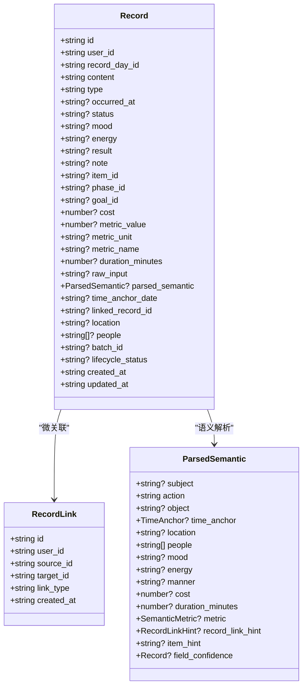
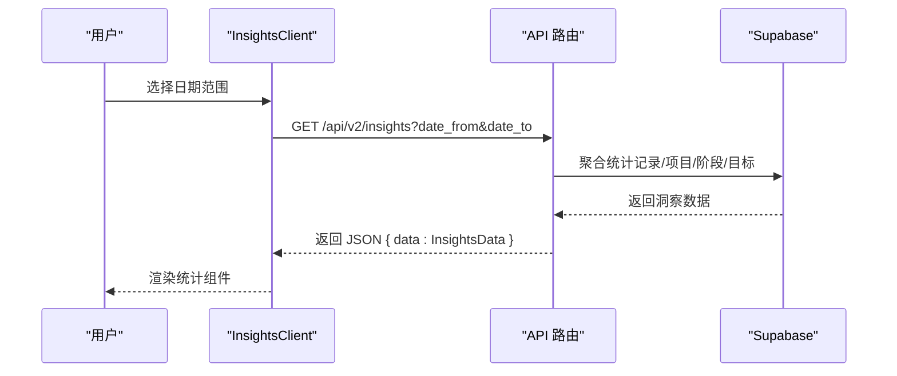
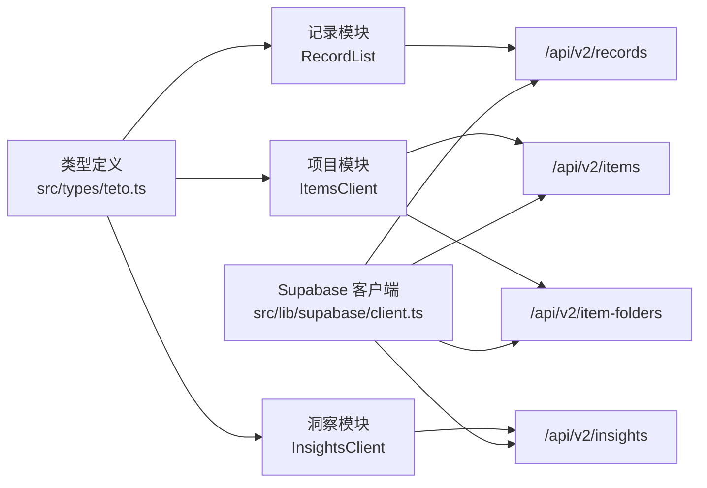

# 核心功能模块

<cite>
**本文引用的文件**
- [README.md](file://README.md)
- [src/app/layout.tsx](file://src/app/layout.tsx)
- [src/app/page.tsx](file://src/app/page.tsx)
- [src/types/teto.ts](file://src/types/teto.ts)
- [src/types/semantic.ts](file://src/types/semantic.ts)
- [src/lib/supabase/client.ts](file://src/lib/supabase/client.ts)
- [src/app/(dashboard)/records/components/RecordList.tsx](file://src/app/(dashboard)/records/components/RecordList.tsx)
- [src/app/(dashboard)/items/ItemsClient.tsx](file://src/app/(dashboard)/items/ItemsClient.tsx)
- [src/app/(dashboard)/insights/InsightsClient.tsx](file://src/app/(dashboard)/insights/InsightsClient.tsx)
</cite>

## 目录
1. [简介](#简介)
2. [项目结构](#项目结构)
3. [核心组件](#核心组件)
4. [架构总览](#架构总览)
5. [详细组件分析](#详细组件分析)
6. [依赖分析](#依赖分析)
7. [性能考虑](#性能考虑)
8. [故障排查指南](#故障排查指南)
9. [结论](#结论)
10. [附录](#附录)

## 简介
本文件面向 TETO v1.x 的核心功能模块，围绕“记录管理系统”“项目跟踪系统”“洞察分析系统”“用户界面系统”四大模块展开，系统性阐述设计理念、实现原理、用户交互流程与数据处理逻辑，并提供最佳实践、常见问题与配置说明。文档兼顾初学者与高级开发者的需求，既给出高层架构图，也提供代码级关系与调用序列图。

## 项目结构
TETO 基于 Next.js App Router，采用前后端同构架构：前端使用 TypeScript + Tailwind CSS，后端通过 Supabase 提供认证与数据库；API 采用 App Router 下的路由模块化组织，类型定义集中在统一的类型文件中，便于前后端契约一致。

**图表来源**
- [src/app/layout.tsx:1-13](file://src/app/layout.tsx#L1-L13)
- [src/app/page.tsx:1-5](file://src/app/page.tsx#L1-L5)
- [src/app/(dashboard)/records/components/RecordList.tsx:1-87](file://src/app/(dashboard)/records/components/RecordList.tsx#L1-L87)
- [src/app/(dashboard)/items/ItemsClient.tsx:1-678](file://src/app/(dashboard)/items/ItemsClient.tsx#L1-L678)
- [src/app/(dashboard)/insights/InsightsClient.tsx:1-149](file://src/app/(dashboard)/insights/InsightsClient.tsx#L1-L149)
- [src/types/teto.ts:1-516](file://src/types/teto.ts#L1-L516)
- [src/types/semantic.ts:1-66](file://src/types/semantic.ts#L1-L66)
- [src/lib/supabase/client.ts:1-9](file://src/lib/supabase/client.ts#L1-L9)

**章节来源**
- [README.md:1-126](file://README.md#L1-L126)
- [src/app/layout.tsx:1-13](file://src/app/layout.tsx#L1-L13)
- [src/app/page.tsx:1-5](file://src/app/page.tsx#L1-L5)

## 核心组件
- 记录管理系统：负责记录的增删改查、快速输入、星标、批量操作、生命周期状态管理、语义解析与链接建议等。
- 项目跟踪系统：负责事项（Item）的创建、分组（文件夹）、置顶、尺寸切换、阶段（Phase）与目标（Goal）关联、聚合统计展示。
- 洞察分析系统：负责按日期范围聚合统计，输出记录概览、事项概览、阶段洞察、目标洞察等多维指标。
- 用户界面系统：提供统一布局、导航、主题样式、拖拽排序、悬浮操作、Toast 通知等交互体验。

**章节来源**
- [src/app/(dashboard)/records/components/RecordList.tsx:1-87](file://src/app/(dashboard)/records/components/RecordList.tsx#L1-L87)
- [src/app/(dashboard)/items/ItemsClient.tsx:1-678](file://src/app/(dashboard)/items/ItemsClient.tsx#L1-L678)
- [src/app/(dashboard)/insights/InsightsClient.tsx:1-149](file://src/app/(dashboard)/insights/InsightsClient.tsx#L1-L149)
- [src/types/teto.ts:1-516](file://src/types/teto.ts#L1-L516)

## 架构总览
TETO 的数据流遵循“UI 组件 -> API 路由 -> Supabase 数据库”的链路。类型定义集中于 types/teto.ts，确保前后端契约一致；语义解析类型位于 semantic.ts，支撑记录的自然语言解析能力。

**图表来源**
- [src/app/(dashboard)/items/ItemsClient.tsx:140-174](file://src/app/(dashboard)/items/ItemsClient.tsx#L140-L174)
- [src/app/(dashboard)/insights/InsightsClient.tsx:55-80](file://src/app/(dashboard)/insights/InsightsClient.tsx#L55-L80)
- [src/app/(dashboard)/records/components/RecordList.tsx:31-87](file://src/app/(dashboard)/records/components/RecordList.tsx#L31-L87)
- [src/lib/supabase/client.ts:1-9](file://src/lib/supabase/client.ts#L1-L9)

## 详细组件分析

### 记录管理系统
- 设计理念
  - 以“记录”为中心，支持多种记录类型（发生/计划/想法/总结），并具备生命周期状态、星级标记、度量指标（成本、时长、量化指标）、时间锚点、人员与地点等上下文信息。
  - 支持记录之间的微关联（完成/衍生/推迟/相关），并提供 AI 语义解析建议，辅助自动关联与结构化输入。
- 实现原理
  - 前端组件 RecordList 负责渲染记录列表，支持点击、星标切换、多选、完成/推迟等操作回调。
  - 类型定义集中在 teto.ts，涵盖 Record、RecordLink、ParsedSemantic 等核心结构。
- 用户交互流程
  - 快速输入 -> 生成记录 -> 显示时间线卡片 -> 可选星标/多选/完成/推迟。
- 数据处理逻辑
  - 记录创建/更新通过 /api/v2/records 路由；记录链接通过 /api/v2/record-links；批量删除通过 /api/v2/records/batch-delete。
  - 语义解析结果通过 parsed_semantic 字段返回，供前端展示与二次处理。
- 功能特性
  - 快速输入、时间线展示、星标收藏、批量操作、生命周期状态切换、记录链接、AI 语义建议。
- 使用场景
  - 日常行为记录、计划执行追踪、想法沉淀、复盘总结、跨记录关联。
- 最佳实践
  - 使用 occurred_at 或 time_anchor_date 明确时间；合理设置 metric_name/metric_unit 保证统计一致性；利用链接类型建立记录间因果/派生关系。
- 常见问题
  - 未设置时间导致排序异常；度量单位不一致造成聚合偏差；未启用 RLS 导致数据越权。

**图表来源**
- [src/types/teto.ts:37-121](file://src/types/teto.ts#L37-L121)
- [src/types/semantic.ts:18-66](file://src/types/semantic.ts#L18-L66)

**章节来源**
- [src/app/(dashboard)/records/components/RecordList.tsx:1-87](file://src/app/(dashboard)/records/components/RecordList.tsx#L1-L87)
- [src/types/teto.ts:1-516](file://src/types/teto.ts#L1-L516)
- [src/types/semantic.ts:1-66](file://src/types/semantic.ts#L1-L66)

### 项目跟踪系统
- 设计理念
  - 以“事项（Item）”为核心实体，支持状态管理、图标/颜色、置顶、文件夹分组、阶段（Phase）与目标（Goal）关联，以及桌面化卡片展示与拖拽排序。
- 实现原理
  - ItemsClient 负责加载事项与文件夹、搜索过滤、置顶/尺寸切换、拖拽排序持久化、文件夹重命名/删除/移动等。
  - 通过 /api/v2/items 与 /api/v2/item-folders 等路由与后端交互。
- 用户交互流程
  - 桌面加载 -> 搜索过滤 -> 拖拽排序 -> 置顶/尺寸切换 -> 文件夹分组 -> 查看详情。
- 数据处理逻辑
  - 事项聚合统计（记录数、阶段数、最近活跃时间）由服务端聚合后返回，避免 N+1 查询。
  - 本地存储 ORDER_KEY 与 SIZE_KEY 分别持久化排序与尺寸偏好。
- 功能特性
  - 事项创建/更新/归档、文件夹分组、置顶、尺寸切换（1x1/2x1/2x2）、拖拽排序、最近活跃时间显示。
- 使用场景
  - 长期项目管理、阶段性里程碑追踪、目标量化监控、桌面化可视化。
- 最佳实践
  - 为事项设置明确状态与图标；合理使用文件夹分组；利用活跃阶段与记录数辅助决策。
- 常见问题
  - 排序未持久化；尺寸偏好丢失；归档状态误判。

```mermaid
sequenceDiagram
participant U as "用户"
participant IC as "ItemsClient"
participant API as "API 路由"
participant DB as "Supabase"
U->>IC : 打开项目桌面
IC->>API : GET /api/v2/items
API->>DB : 查询聚合后的事项
DB-->>API : 返回事项列表
API-->>IC : 返回数据
U->>IC : 拖拽排序/置顶/尺寸切换
IC->>API : PUT /api/v2/items/ : id
IC->>API : PUT /api/v2/item-folders/ : id
IC->>API : POST /api/v2/item-folders
IC->>API : DELETE /api/v2/item-folders/ : id
IC-->>U : 更新桌面与提示
```

**图表来源**
- [src/app/(dashboard)/items/ItemsClient.tsx:140-174](file://src/app/(dashboard)/items/ItemsClient.tsx#L140-L174)
- [src/app/(dashboard)/items/ItemsClient.tsx:222-229](file://src/app/(dashboard)/items/ItemsClient.tsx#L222-L229)
- [src/app/(dashboard)/items/ItemsClient.tsx:281-286](file://src/app/(dashboard)/items/ItemsClient.tsx#L281-L286)
- [src/app/(dashboard)/items/ItemsClient.tsx:254-278](file://src/app/(dashboard)/items/ItemsClient.tsx#L254-L278)

**章节来源**
- [src/app/(dashboard)/items/ItemsClient.tsx:1-678](file://src/app/(dashboard)/items/ItemsClient.tsx#L1-L678)
- [src/types/teto.ts:316-452](file://src/types/teto.ts#L316-L452)

### 洞察分析系统
- 设计理念
  - 提供可选的时间窗口（7天/30天/当月/自定义），聚合记录与项目数据，输出多维度洞察，帮助用户回顾与规划。
- 实现原理
  - InsightsClient 负责日期范围选择、发起 /api/v2/insights 请求、展示各组件（记录统计、事项统计、阶段洞察、目标洞察）。
  - 返回数据结构由 teto.ts 的 InsightsData 定义，包含 record_overview、item_overview、phaseInsights、goalInsights 等字段。
- 用户交互流程
  - 选择日期范围 -> 加载洞察 -> 展示统计图表与摘要 -> 错误重试。
- 数据处理逻辑
  - 服务端根据 date_from/date_to 聚合记录数量、类型分布、标签分布、活跃事项、阶段状态等。
- 功能特性
  - 日期范围选择器、加载状态、错误提示、重新加载、多组件组合展示。
- 使用场景
  - 周/月回顾、趋势分析、瓶颈识别、目标达成评估。
- 最佳实践
  - 使用 7/30 天窗口观察短期趋势，使用当月窗口观察周期性变化。
- 常见问题
  - 日期范围无效导致请求失败；网络波动导致加载超时。

**图表来源**
- [src/app/(dashboard)/insights/InsightsClient.tsx:39-80](file://src/app/(dashboard)/insights/InsightsClient.tsx#L39-L80)
- [src/types/teto.ts:276-299](file://src/types/teto.ts#L276-L299)

**章节来源**
- [src/app/(dashboard)/insights/InsightsClient.tsx:1-149](file://src/app/(dashboard)/insights/InsightsClient.tsx#L1-L149)
- [src/types/teto.ts:253-299](file://src/types/teto.ts#L253-L299)

### 用户界面系统
- 设计理念
  - 提供统一的根布局、全局样式、移动端顶部栏、侧边栏、Toast 通知等基础 UI 能力，支撑三大业务模块的交互体验。
- 实现原理
  - layout.tsx 定义根 HTML 结构与全局样式；page.tsx 将首页重定向至记录页面；ItemsClient/InsightsClient/RecordList 等组件内集成交互与状态管理。
- 用户交互流程
  - 加载根布局 -> 进入默认页面 -> 进入具体模块 -> 操作反馈（Toast）。
- 数据处理逻辑
  - 通过 Supabase 客户端封装访问凭据，保障浏览器端安全访问。
- 功能特性
  - 全局样式、导航、移动端适配、拖拽排序、悬浮操作、Toast 提示。
- 使用场景
  - 作为所有业务模块的基础承载层，确保一致的视觉与交互体验。
- 最佳实践
  - 合理使用 Glass/Shadow 等样式类提升可读性；保持交互反馈及时可见。
- 常见问题
  - 样式冲突；移动端布局异常；拖拽触发距离过小导致误触。

**章节来源**
- [src/app/layout.tsx:1-13](file://src/app/layout.tsx#L1-L13)
- [src/app/page.tsx:1-5](file://src/app/page.tsx#L1-L5)
- [src/lib/supabase/client.ts:1-9](file://src/lib/supabase/client.ts#L1-L9)

## 依赖分析
- 类型依赖
  - 所有业务模块共享 src/types/teto.ts 与 src/types/semantic.ts 的类型定义，确保前后端契约一致。
- 组件耦合
  - 记录模块与项目模块相对独立，洞察模块依赖两者数据；UI 模块为通用层，被三大业务模块复用。
- 外部依赖
  - Supabase 提供认证与数据库；Tailwind CSS 提供样式；Lucide 图标库提供 UI 图标；@dnd-kit 提供拖拽排序能力。
- 配置与环境
  - 通过 NEXT_PUBLIC_SUPABASE_URL 与 NEXT_PUBLIC_SUPABASE_ANON_KEY 访问 Supabase；可选 NEXT_PUBLIC_DEV_MODE 与 NEXT_PUBLIC_DEV_USER_ID 用于开发调试。

**图表来源**
- [src/types/teto.ts:1-516](file://src/types/teto.ts#L1-L516)
- [src/app/(dashboard)/records/components/RecordList.tsx:1-87](file://src/app/(dashboard)/records/components/RecordList.tsx#L1-L87)
- [src/app/(dashboard)/items/ItemsClient.tsx:1-678](file://src/app/(dashboard)/items/ItemsClient.tsx#L1-L678)
- [src/app/(dashboard)/insights/InsightsClient.tsx:1-149](file://src/app/(dashboard)/insights/InsightsClient.tsx#L1-L149)
- [src/lib/supabase/client.ts:1-9](file://src/lib/supabase/client.ts#L1-L9)

**章节来源**
- [src/types/teto.ts:1-516](file://src/types/teto.ts#L1-L516)
- [src/lib/supabase/client.ts:1-9](file://src/lib/supabase/client.ts#L1-L9)

## 性能考虑
- 前端
  - 使用 useMemo 与 useCallback 缓存计算结果，减少不必要的重渲染；本地存储 ORDER_KEY 与 SIZE_KEY 降低每次加载的计算与网络请求。
  - 桌面网格采用 CSS Grid，配合 @dnd-kit 的排序策略，保证拖拽流畅性。
- 后端
  - 服务端聚合统计（如 /api/v2/items 返回的聚合字段）避免 N+1 查询，提升响应速度。
- 数据库
  - 启用 RLS（行级安全策略）保障数据隔离，同时注意索引与查询条件优化，避免全表扫描。
- 网络
  - 对错误与加载状态进行合理处理，避免频繁重复请求；对批量操作（如批量删除）提供确认与进度反馈。

## 故障排查指南
- 登录与认证
  - 确认 Supabase URL 与匿名密钥配置正确；验证站点 URL 与回调地址已在控制台配置；启用 Magic Link 登录方式。
- 数据访问
  - 若出现“无数据”或“权限不足”，检查当前用户是否已登录且 RLS 已启用；确认请求头携带正确的认证信息。
- 网络与缓存
  - 若桌面加载缓慢，检查本地存储是否损坏（ORDER_KEY/SIZE_KEY）；清理后重试；确认网络稳定。
- 拖拽与排序
  - 若拖拽无效，检查 dnd-kit 传感器配置与激活距离；确认容器滚动区域与事件冒泡未被拦截。
- 洞察数据
  - 若洞察为空或报错，检查日期范围是否有效；确认服务端聚合逻辑是否覆盖该时间区间。

**章节来源**
- [README.md:54-90](file://README.md#L54-L90)
- [src/app/(dashboard)/insights/InsightsClient.tsx:67-73](file://src/app/(dashboard)/insights/InsightsClient.tsx#L67-L73)
- [src/app/(dashboard)/items/ItemsClient.tsx:140-174](file://src/app/(dashboard)/items/ItemsClient.tsx#L140-L174)

## 结论
TETO 的核心模块以清晰的类型契约与模块化路由为基础，结合 Supabase 的认证与数据库能力，实现了从记录到项目的全链路追踪与洞察。通过桌面化卡片、拖拽排序、语义解析与多维统计，既满足初学者的易用性，也为进阶用户提供深度定制与扩展空间。建议在生产环境中持续关注 RLS 配置、索引优化与前端缓存策略，以获得更佳的稳定性与性能。

## 附录
- 环境变量
  - NEXT_PUBLIC_SUPABASE_URL：Supabase 项目 URL
  - NEXT_PUBLIC_SUPABASE_ANON_KEY：Supabase 匿名密钥
  - NEXT_PUBLIC_DEV_MODE：开发模式开关（可选）
  - NEXT_PUBLIC_DEV_USER_ID：开发模式指定用户 ID（可选）

- 数据库初始化
  - 初始化核心表与启用 RLS 的 SQL 文件位于 sql/ 目录，需按顺序执行。

- API 路由概览
  - 记录：/api/v2/records、/api/v2/record-links、/api/v2/records/batch-delete
  - 项目：/api/v2/items、/api/v2/item-folders
  - 洞察：/api/v2/insights
  - 语义解析：/api/v2/parse

**章节来源**
- [README.md:54-90](file://README.md#L54-L90)
- [src/app/(dashboard)/records/components/RecordList.tsx:31-87](file://src/app/(dashboard)/records/components/RecordList.tsx#L31-L87)
- [src/app/(dashboard)/items/ItemsClient.tsx:140-174](file://src/app/(dashboard)/items/ItemsClient.tsx#L140-L174)
- [src/app/(dashboard)/insights/InsightsClient.tsx:55-80](file://src/app/(dashboard)/insights/InsightsClient.tsx#L55-L80)