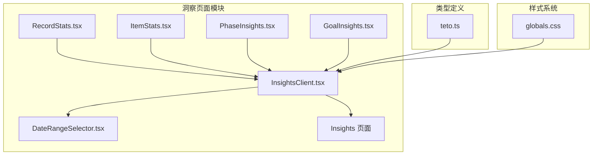
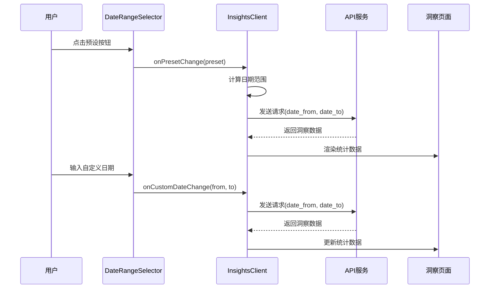
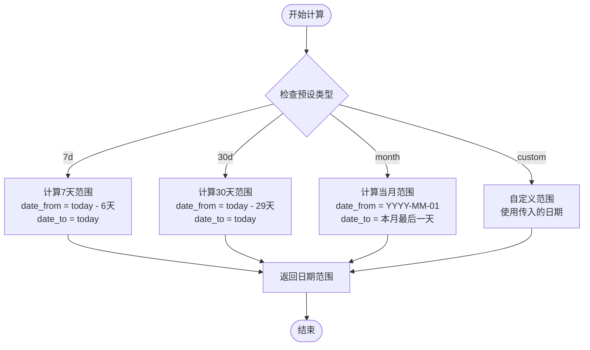
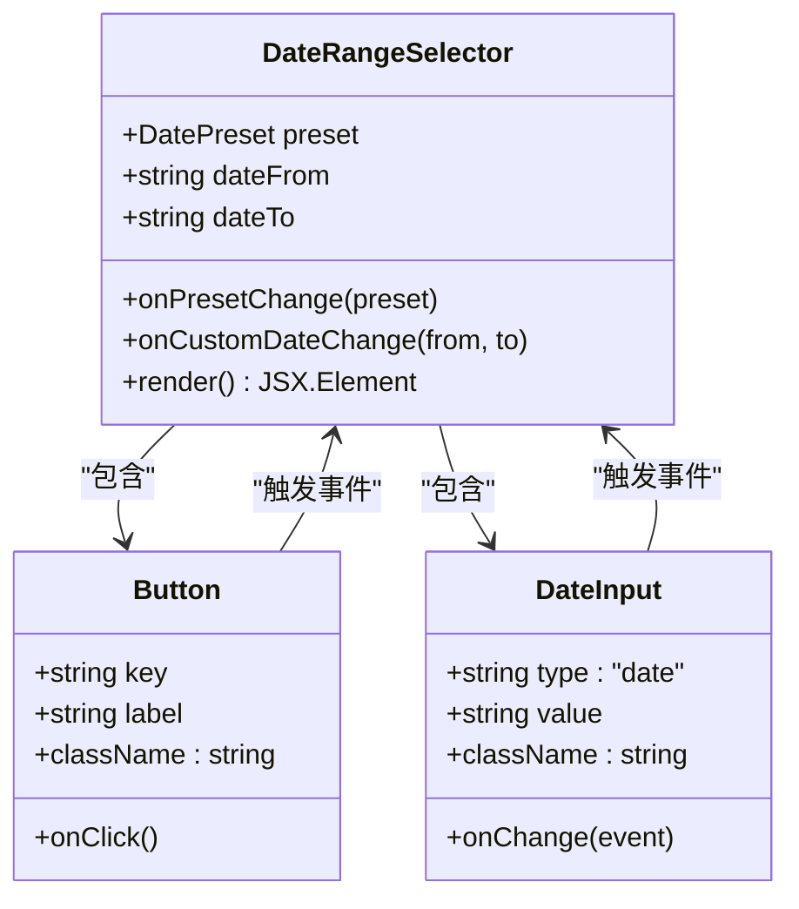
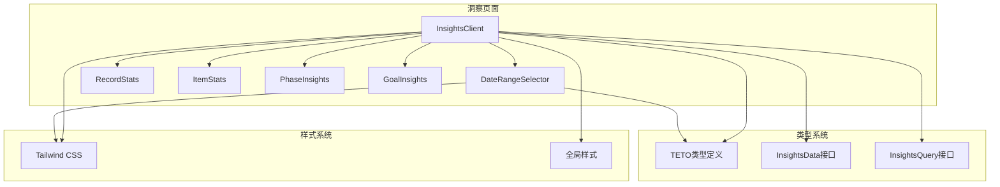

# 时间范围选择器

<cite>
**本文档引用的文件**
- [DateRangeSelector.tsx](file://src/app/(dashboard)/insights/components/DateRangeSelector.tsx)
- [InsightsClient.tsx](file://src/app/(dashboard)/insights/InsightsClient.tsx)
- [page.tsx](file://src/app/(dashboard)/insights/page.tsx)
- [teto.ts](file://src/types/teto.ts)
- [RecordStats.tsx](file://src/app/(dashboard)/insights/components/RecordStats.tsx)
- [ItemStats.tsx](file://src/app/(dashboard)/insights/components/ItemStats.tsx)
- [PhaseInsights.tsx](file://src/app/(dashboard)/insights/components/PhaseInsights.tsx)
- [GoalInsights.tsx](file://src/app/(dashboard)/insights/components/GoalInsights.tsx)
- [globals.css](file://src/app/globals.css)
</cite>

## 目录
1. [简介](#简介)
2. [项目结构](#项目结构)
3. [核心组件](#核心组件)
4. [架构概览](#架构概览)
5. [详细组件分析](#详细组件分析)
6. [依赖关系分析](#依赖关系分析)
7. [性能考量](#性能考量)
8. [故障排除指南](#故障排除指南)
9. [结论](#结论)

## 简介

TETO项目中的时间范围选择器是一个专门为洞察页面设计的日期选择组件，允许用户快速选择预设的时间范围或自定义日期范围。该组件实现了直观的用户界面，支持七天、三十天和当月等常用预设选项，同时提供灵活的自定义日期输入功能。

## 项目结构

时间范围选择器功能主要分布在以下文件中：



**图表来源**
- [InsightsClient.tsx:1-149](file://src/app/(dashboard)/insights/InsightsClient.tsx#L1-L149)
- [DateRangeSelector.tsx:1-65](file://src/app/(dashboard)/insights/components/DateRangeSelector.tsx#L1-L65)

**章节来源**
- [InsightsClient.tsx:1-149](file://src/app/(dashboard)/insights/InsightsClient.tsx#L1-L149)
- [DateRangeSelector.tsx:1-65](file://src/app/(dashboard)/insights/components/DateRangeSelector.tsx#L1-L65)

## 核心组件

### DateRangeSelector 组件

DateRangeSelector 是一个轻量级的React客户端组件，负责提供用户友好的日期选择界面。该组件采用函数式组件设计，使用受控组件模式来管理日期状态。

**主要特性：**
- 预设时间范围按钮（7天、30天、当月）
- 自定义日期输入框（起始日期和结束日期）
- 响应式布局设计
- 状态指示器（当前选中的预设）

**组件属性：**
- `preset`: 当前选中的预设类型
- `dateFrom`: 起始日期字符串
- `dateTo`: 结束日期字符串
- `onPresetChange`: 预设变更回调函数
- `onCustomDateChange`: 自定义日期变更回调函数

**章节来源**
- [DateRangeSelector.tsx:3-11](file://src/app/(dashboard)/insights/components/DateRangeSelector.tsx#L3-L11)
- [DateRangeSelector.tsx:19-64](file://src/app/(dashboard)/insights/components/DateRangeSelector.tsx#L19-L64)

## 架构概览

时间范围选择器在整个应用架构中扮演着关键的数据过滤器角色：



**图表来源**
- [InsightsClient.tsx:82-95](file://src/app/(dashboard)/insights/InsightsClient.tsx#L82-L95)
- [DateRangeSelector.tsx:30-43](file://src/app/(dashboard)/insights/components/DateRangeSelector.tsx#L30-L43)

## 详细组件分析

### 时间范围计算逻辑

InsightsClient 实现了智能的时间范围计算算法，支持多种预设选项：



**图表来源**
- [InsightsClient.tsx:16-37](file://src/app/(dashboard)/insights/InsightsClient.tsx#L16-L37)

**实现细节：**
- 使用本地时间计算，确保与用户设备时区一致
- 日期格式严格遵循YYYY-MM-DD标准
- 月末边界情况自动处理（使用Date对象的内置月份计算）

**章节来源**
- [InsightsClient.tsx:16-37](file://src/app/(dashboard)/insights/InsightsClient.tsx#L16-L37)

### 用户交互设计

组件采用了现代化的用户界面设计原则：



**图表来源**
- [DateRangeSelector.tsx:19-64](file://src/app/(dashboard)/insights/components/DateRangeSelector.tsx#L19-L64)

**设计特点：**
- 预设按钮采用蓝色填充表示当前选中状态
- 自定义输入框具有焦点状态的蓝色边框高亮
- 响应式设计支持移动端和桌面端
- 清晰的视觉层次和状态反馈

**章节来源**
- [DateRangeSelector.tsx:29-61](file://src/app/(dashboard)/insights/components/DateRangeSelector.tsx#L29-L61)

### 数据流处理

组件间的数据传递遵循单向数据流原则：

```mermaid
graph LR
subgraph "外部状态"
A[preset: '7d' | '30d' | 'month' | 'custom']
B[dateFrom: string]
C[dateTo: string]
end
subgraph "组件通信"
D[onPresetChange: (preset) => void]
E[onCustomDateChange: (from, to) => void]
end
subgraph "内部状态"
F[setPreset]
G[setDateFrom]
H[setDateTo]
end
A --> F
B --> G
C --> H
D --> F
E --> G
E --> H
```

**图表来源**
- [DateRangeSelector.tsx:5-11](file://src/app/(dashboard)/insights/components/DateRangeSelector.tsx#L5-L11)

**章节来源**
- [DateRangeSelector.tsx:19-25](file://src/app/(dashboard)/insights/components/DateRangeSelector.tsx#L19-L25)

## 依赖关系分析

### 组件依赖图



**图表来源**
- [InsightsClient.tsx:10-12](file://src/app/(dashboard)/insights/InsightsClient.tsx#L10-L12)
- [teto.ts:253-299](file://src/types/teto.ts#L253-L299)

### 外部依赖

- **Lucide React图标库**: 提供统一的图标系统
- **Recharts**: 用于数据可视化图表渲染
- **Tailwind CSS**: 实现原子化样式系统

**章节来源**
- [InsightsClient.tsx:3-12](file://src/app/(dashboard)/insights/InsightsClient.tsx#L3-L12)

## 性能考量

### 优化策略

1. **受控组件模式**: 避免不必要的重渲染，只在状态变更时更新
2. **回调函数缓存**: 使用useCallback优化函数引用稳定性
3. **条件渲染**: 错误状态和加载状态的条件显示减少DOM操作
4. **响应式设计**: 移动端友好的布局减少布局抖动

### 性能监控建议

- 监控API请求响应时间
- 跟踪图表渲染性能
- 监测内存使用情况
- 优化大数据集的渲染

## 故障排除指南

### 常见问题及解决方案

**问题1: 日期格式错误**
- 症状: API请求返回400错误
- 解决方案: 确保日期格式为YYYY-MM-DD，检查时区设置

**问题2: 预设按钮状态不更新**
- 症状: 点击预设按钮后UI未更新
- 解决方案: 检查onPresetChange回调函数是否正确传递

**问题3: 自定义日期输入无效**
- 症状: 输入自定义日期后没有触发API请求
- 解决方案: 验证onCustomDateChange函数的实现和参数传递

**问题4: 图表渲染异常**
- 症状: Recharts图表显示空白或报错
- 解决方案: 检查数据格式和数据完整性

**章节来源**
- [InsightsClient.tsx:55-73](file://src/app/(dashboard)/insights/InsightsClient.tsx#L55-L73)

## 结论

TETO项目的时间范围选择器是一个设计精良的组件，它成功地将复杂的日期选择逻辑简化为直观的用户界面。该组件具有以下优势：

1. **用户友好**: 直观的预设按钮和清晰的视觉反馈
2. **功能完整**: 支持预设和自定义两种选择方式
3. **性能优化**: 采用受控组件和条件渲染策略
4. **可扩展性**: 良好的架构设计便于功能扩展

该组件为整个洞察页面提供了强大的数据过滤能力，是TETO项目中用户体验设计的优秀范例。