# 洞察分析系统

<cite>
**本文引用的文件**
- [InsightsClient.tsx](file://src/app/(dashboard)/insights/InsightsClient.tsx)
- [RecordStats.tsx](file://src/app/(dashboard)/insights/components/RecordStats.tsx)
- [ItemStats.tsx](file://src/app/(dashboard)/insights/components/ItemStats.tsx)
- [ItemPortrait.tsx](file://src/app/(dashboard)/insights/components/ItemPortrait.tsx)
- [PhaseInsights.tsx](file://src/app/(dashboard)/insights/components/PhaseInsights.tsx)
- [GoalInsights.tsx](file://src/app/(dashboard)/insights/components/GoalInsights.tsx)
- [DateRangeSelector.tsx](file://src/app/(dashboard)/insights/components/DateRangeSelector.tsx)
- [CrossItemComparison.tsx](file://src/app/(dashboard)/insights/components/CrossItemComparison.tsx)
- [FactSummary.tsx](file://src/app/(dashboard)/insights/components/FactSummary.tsx)
- [FourAxesInsight.tsx](file://src/app/(dashboard)/insights/components/FourAxesInsight.tsx)
- [MetricsByItem.tsx](file://src/app/(dashboard)/insights/components/MetricsByItem.tsx)
- [PeriodComparison.tsx](file://src/app/(dashboard)/insights/components/PeriodComparison.tsx)
- [TimeDistribution.tsx](file://src/app/(dashboard)/insights/components/TimeDistribution.tsx)
- [UnassignedStats.tsx](file://src/app/(dashboard)/insights/components/UnassignedStats.tsx)
- [RulePanel.tsx](file://src/app/(dashboard)/insights/components/RulePanel.tsx)
- [page.tsx](file://src/app/(dashboard)/insights/page.tsx)
- [insights.ts](file://src/lib/db/insights.ts)
- [route.ts](file://src/app/api/v2/insights/route.ts)
- [teto.ts](file://src/types/teto.ts)
</cite>

## 更新摘要
**变更内容**
- 新增大量洞察分析组件：交叉事项比较、事实摘要、四轴洞察、按项目统计、周期比较、时间分布、未分配统计、规则面板等
- 扩展数据库聚合函数，支持8类新增指标的并行计算
- 增强API路由，支持更丰富的洞察数据结构
- 完善类型定义，新增多个洞察数据接口

## 目录
1. [简介](#简介)
2. [项目结构](#项目结构)
3. [核心组件](#核心组件)
4. [架构总览](#架构总览)
5. [组件详解](#组件详解)
6. [依赖关系分析](#依赖关系分析)
7. [性能考量](#性能考量)
8. [故障排查指南](#故障排查指南)
9. [结论](#结论)
10. [附录](#附录)

## 简介
洞察分析系统为用户提供统一的数据洞察面板，涵盖记录维度统计、事项维度统计、阶段洞察与目标洞察四大板块，并支持时间范围选择与图表化展示。系统通过客户端组件组合与服务端 API 协作，完成数据聚合、趋势分析与可视化呈现，帮助用户快速掌握个人成长与执行过程的关键指标。

**更新** 系统现已扩展为包含12个核心分析组件的完整洞察体系，提供从基础统计到高级分析的全方位数据洞察能力，包括交叉对比、事实总结、四轴分析、周期对比等专业分析功能。

## 项目结构
洞察分析模块采用"页面容器 + 客户端组件 + 图表组件 + API 路由 + 数据库聚合"的分层组织方式：
- 页面入口负责渲染客户端容器
- 客户端容器负责时间范围管理、数据拉取与错误处理
- 统计组件负责具体指标与图表展示
- API 路由负责鉴权与参数校验
- 数据库模块负责复杂聚合逻辑

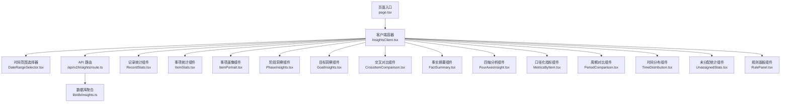

**图示来源**
- [page.tsx](file://src/app/(dashboard)/insights/page.tsx#L1-L6)
- [InsightsClient.tsx](file://src/app/(dashboard)/insights/InsightsClient.tsx#L1-L197)
- [DateRangeSelector.tsx](file://src/app/(dashboard)/insights/components/DateRangeSelector.tsx#L1-L65)
- [route.ts:1-32](file://src/app/api/v2/insights/route.ts#L1-L32)
- [insights.ts:1-949](file://src/lib/db/insights.ts#L1-L949)
- [CrossItemComparison.tsx](file://src/app/(dashboard)/insights/components/CrossItemComparison.tsx#L1-L107)
- [FactSummary.tsx](file://src/app/(dashboard)/insights/components/FactSummary.tsx#L1-L314)
- [FourAxesInsight.tsx](file://src/app/(dashboard)/insights/components/FourAxesInsight.tsx#L1-L176)
- [MetricsByItem.tsx](file://src/app/(dashboard)/insights/components/MetricsByItem.tsx#L1-L102)
- [PeriodComparison.tsx](file://src/app/(dashboard)/insights/components/PeriodComparison.tsx#L1-L123)
- [TimeDistribution.tsx](file://src/app/(dashboard)/insights/components/TimeDistribution.tsx#L1-L110)
- [UnassignedStats.tsx](file://src/app/(dashboard)/insights/components/UnassignedStats.tsx#L1-L62)
- [RulePanel.tsx](file://src/app/(dashboard)/insights/components/RulePanel.tsx#L1-L171)

**章节来源**
- [page.tsx](file://src/app/(dashboard)/insights/page.tsx#L1-L6)
- [InsightsClient.tsx](file://src/app/(dashboard)/insights/InsightsClient.tsx#L1-L197)

## 核心组件
- 客户端容器 InsightsClient：负责时间范围初始化、数据拉取、错误处理与布局渲染
- 时间范围选择器 DateRangeSelector：提供预设快捷键与自定义日期输入
- 基础统计组件：
  - RecordStats：记录维度的累计数、类型分布、标签分布与每日趋势
  - ItemStats：活跃事项、Top 事项与停滞事项
  - ItemPortrait：事项活动画像、完成率分析与沉寂事项识别
  - PhaseInsights：阶段状态分布、最近阶段与近期阶段变化活跃事项
  - GoalInsights：目标总数、目标状态分布与目标关联统计
- 高级分析组件：
  - CrossItemComparison：跨事项时长对比分析
  - FactSummary：基于规则的事实总结与AI润色
  - FourAxesInsight：四轴分析框架（行动vs目标、时间vs计划、投入vs效果、近期时间分布）
  - MetricsByItem：口径化指标（活跃度、投入、停滞、计划达成、效果）
  - PeriodComparison：周期对比（周对比、月对比）
  - TimeDistribution：时间段分布分析
  - UnassignedStats：未分配统计（非事项区分析）
  - RulePanel：学习规则管理面板
- API 路由与数据库聚合：鉴权校验、参数校验与多指标聚合

**更新** 新增8个高级分析组件，扩展为12个核心组件的完整洞察体系，提供从基础统计到高级分析的全方位数据洞察能力。

**章节来源**
- [InsightsClient.tsx](file://src/app/(dashboard)/insights/InsightsClient.tsx#L1-L197)
- [DateRangeSelector.tsx](file://src/app/(dashboard)/insights/components/DateRangeSelector.tsx#L1-L65)
- [CrossItemComparison.tsx](file://src/app/(dashboard)/insights/components/CrossItemComparison.tsx#L1-L107)
- [FactSummary.tsx](file://src/app/(dashboard)/insights/components/FactSummary.tsx#L1-L314)
- [FourAxesInsight.tsx](file://src/app/(dashboard)/insights/components/FourAxesInsight.tsx#L1-L176)
- [MetricsByItem.tsx](file://src/app/(dashboard)/insights/components/MetricsByItem.tsx#L1-L102)
- [PeriodComparison.tsx](file://src/app/(dashboard)/insights/components/PeriodComparison.tsx#L1-L123)
- [TimeDistribution.tsx](file://src/app/(dashboard)/insights/components/TimeDistribution.tsx#L1-L110)
- [UnassignedStats.tsx](file://src/app/(dashboard)/insights/components/UnassignedStats.tsx#L1-L62)
- [RulePanel.tsx](file://src/app/(dashboard)/insights/components/RulePanel.tsx#L1-L171)
- [route.ts:1-32](file://src/app/api/v2/insights/route.ts#L1-L32)
- [insights.ts:1-949](file://src/lib/db/insights.ts#L1-L949)

## 架构总览
洞察分析系统采用前后端分离的调用链：前端客户端发起请求，后端路由进行鉴权与参数校验，随后调用数据库聚合模块生成固定结构的洞察数据，最终返回给前端进行可视化渲染。

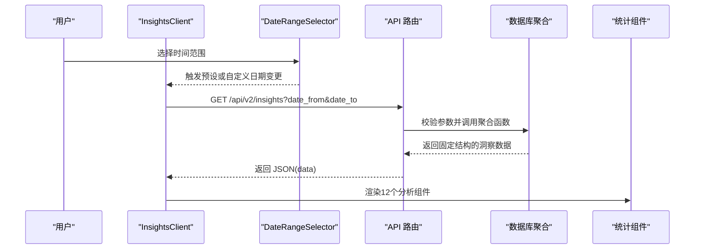

**图示来源**
- [InsightsClient.tsx](file://src/app/(dashboard)/insights/InsightsClient.tsx#L63-L81)
- [DateRangeSelector.tsx](file://src/app/(dashboard)/insights/components/DateRangeSelector.tsx#L19-L64)
- [route.ts:6-31](file://src/app/api/v2/insights/route.ts#L6-L31)
- [insights.ts:410-461](file://src/lib/db/insights.ts#L410-L461)

## 组件详解

### InsightsClient 组件
- 时间范围管理：内置"近7天""近30天""本月"预设；自定义日期模式下切换为"custom"
- 数据拉取：根据日期范围调用 /api/v2/insights，设置 loading/error 状态，成功后注入洞察数据
- 错误处理：捕获网络与业务异常，使用 toast 提示并允许重试
- 布局渲染：依次渲染12个分析组件，包括基础统计和高级分析功能

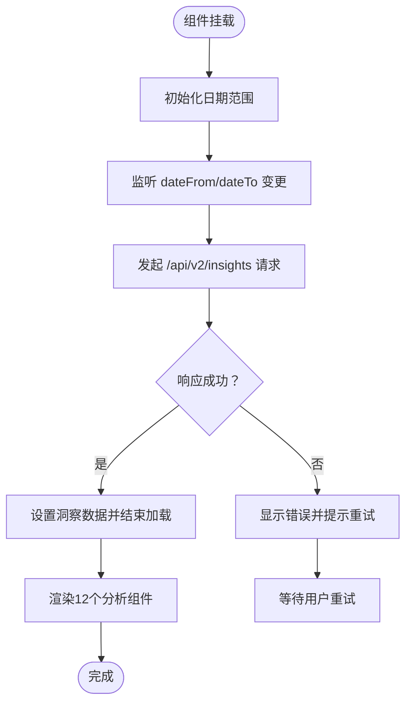

**图示来源**
- [InsightsClient.tsx](file://src/app/(dashboard)/insights/InsightsClient.tsx#L47-L88)

**章节来源**
- [InsightsClient.tsx](file://src/app/(dashboard)/insights/InsightsClient.tsx#L1-L197)

### CrossItemComparison 组件
- 跨事项时长对比：基于事项的总时长进行排名对比
- 可视化展示：水平条形图显示各事项的时长分布
- 详细列表：显示排名、名称、时长和占比信息
- 数据格式：支持分钟到小时的时间单位转换

**更新** 新增跨事项时长对比功能，提供事项间时间投入的直观对比分析。

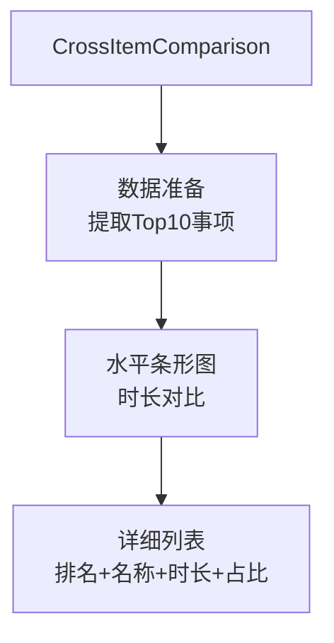

**图示来源**
- [CrossItemComparison.tsx](file://src/app/(dashboard)/insights/components/CrossItemComparison.tsx#L22-L106)

**章节来源**
- [CrossItemComparison.tsx](file://src/app/(dashboard)/insights/components/CrossItemComparison.tsx#L1-L107)

### FactSummary 组件
- 规则驱动的事实生成：基于预定义规则生成结构化事实
- 四轴分析整合：结合行动vs目标、时间vs计划、投入vs效果、近期时间分布
- AI润色功能：通过API接口提供事实总结的AI润色服务
- 追溯信息：显示事实的时间范围、数据来源和关联事项

**更新** 新增基于规则的事实总结功能，提供自动化洞察生成和AI润色能力。

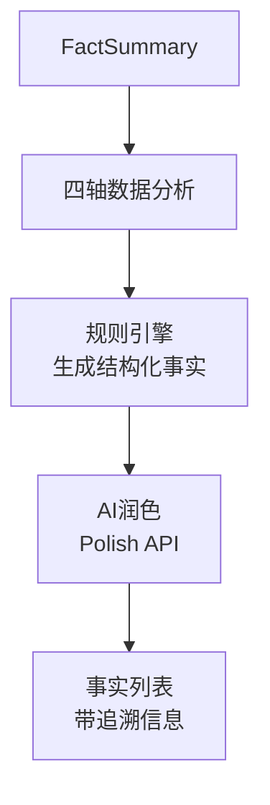

**图示来源**
- [FactSummary.tsx](file://src/app/(dashboard)/insights/components/FactSummary.tsx#L220-L313)

**章节来源**
- [FactSummary.tsx](file://src/app/(dashboard)/insights/components/FactSummary.tsx#L1-L314)

### FourAxesInsight 组件
- 四轴分析框架：行动vs目标、时间vs计划、投入vs效果、近期时间分布
- 行动vs目标：显示各事项的记录数、时长和目标完成进度
- 时间vs计划：计划完成率、完成数量和逾期情况
- 投入vs效果：总投入时长和有结果记录的比例
- 近期时间分布：近7天、近30天和周环比分析

**更新** 新增完整的四轴分析框架，提供多维度的综合洞察分析。

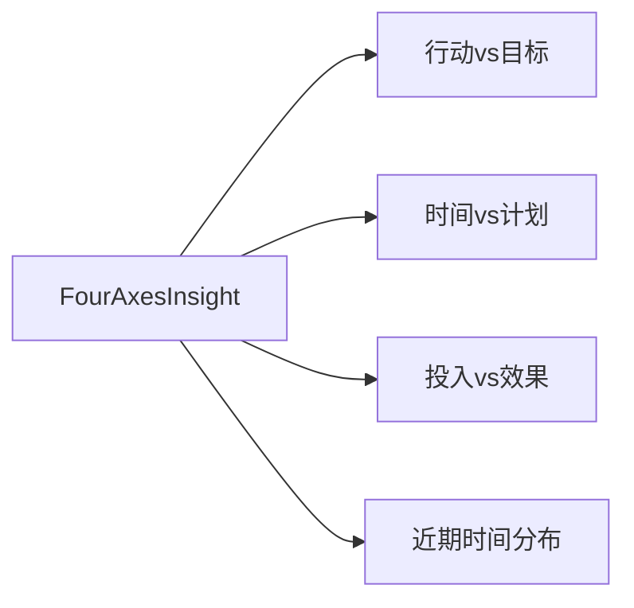

**图示来源**
- [FourAxesInsight.tsx](file://src/app/(dashboard)/insights/components/FourAxesInsight.tsx#L38-L175)

**章节来源**
- [FourAxesInsight.tsx](file://src/app/(dashboard)/insights/components/FourAxesInsight.tsx#L1-L176)

### MetricsByItem 组件
- 口径化指标计算：统一标准计算五大核心指标
- 指标体系：活跃度、投入、停滞、计划达成、效果
- 可视化展示：每个指标使用进度条进行直观展示
- 停滞状态标识：根据天数自动分级（轻度、中度、重度停滞）

**更新** 新增口径化指标功能，提供标准化的事项评估体系。

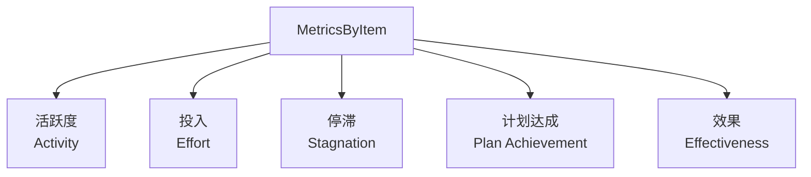

**图示来源**
- [MetricsByItem.tsx](file://src/app/(dashboard)/insights/components/MetricsByItem.tsx#L39-L101)

**章节来源**
- [MetricsByItem.tsx](file://src/app/(dashboard)/insights/components/MetricsByItem.tsx#L1-L102)

### PeriodComparison 组件
- 周期对比分析：本周vs上周、本月vs上月的多维度对比
- 对比指标：记录数、时长（小时）、花费（金额）
- 变化趋势：百分比变化、新增、持平、下降标识
- 可视化展示：网格布局显示对比结果

**更新** 新增周期对比功能，提供时间维度的动态分析能力。

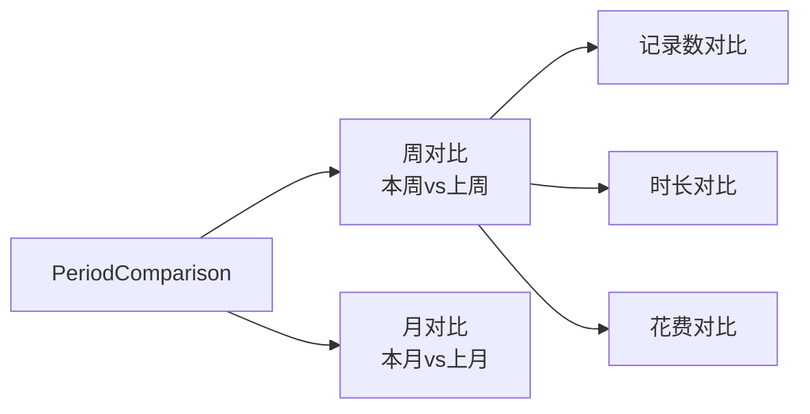

**图示来源**
- [PeriodComparison.tsx](file://src/app/(dashboard)/insights/components/PeriodComparison.tsx#L42-L122)

**章节来源**
- [PeriodComparison.tsx](file://src/app/(dashboard)/insights/components/PeriodComparison.tsx#L1-L123)

### TimeDistribution 组件
- 时间段分布分析：按上午、下午、傍晚、夜间四个时段统计
- 可视化展示：饼图显示各时段占比，右侧显示详细列表
- 数据格式：支持时间段标签和图标展示
- 百分比计算：自动计算各时段的占比情况

**更新** 新增时间段分布分析功能，提供时间使用习惯的洞察。

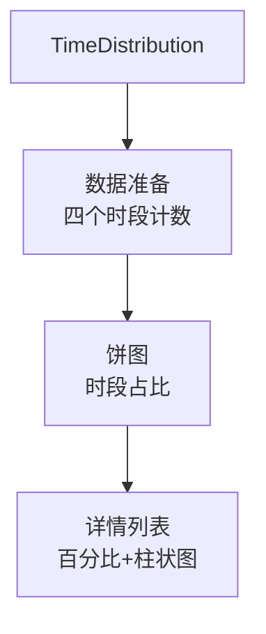

**图示来源**
- [TimeDistribution.tsx](file://src/app/(dashboard)/insights/components/TimeDistribution.tsx#L19-L109)

**章节来源**
- [TimeDistribution.tsx](file://src/app/(dashboard)/insights/components/TimeDistribution.tsx#L1-L110)

### UnassignedStats 组件
- 非事项区统计：分析未关联事项的记录情况
- 统计指标：未关联记录数、总时长、总花费、占比
- 可视化展示：卡片式布局显示关键指标
- 用户指引：提供手动关联的使用建议

**更新** 新增未分配统计功能，帮助用户识别和管理未关联的记录。

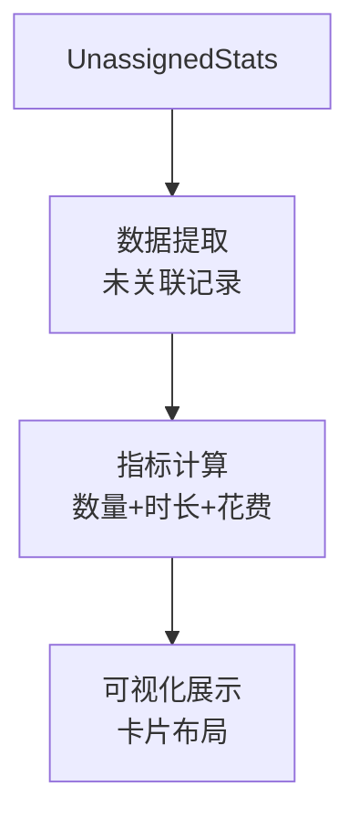

**图示来源**
- [UnassignedStats.tsx](file://src/app/(dashboard)/insights/components/UnassignedStats.tsx#L16-L61)

**章节来源**
- [UnassignedStats.tsx](file://src/app/(dashboard)/insights/components/UnassignedStats.tsx#L1-L62)

### RulePanel 组件
- 学习规则管理：AI学习、手动设置、系统默认三种规则源
- 规则类型：事项映射、子项映射、类型路由、模糊解析
- 规则质量：高、中、低三个置信度级别
- 操作功能：删除单条规则、批量重置、类型筛选

**更新** 新增规则面板功能，提供学习规则的可视化管理和操作界面。

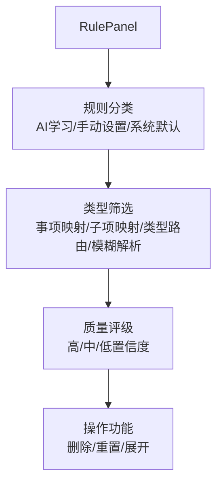

**图示来源**
- [RulePanel.tsx](file://src/app/(dashboard)/insights/components/RulePanel.tsx#L37-L170)

**章节来源**
- [RulePanel.tsx](file://src/app/(dashboard)/insights/components/RulePanel.tsx#L1-L171)

### DateRangeSelector 组件
- 预设按钮：近7天、近30天、本月
- 自定义日期：起始与结束日期输入框
- 回调通知：向父组件传递预设变更或自定义日期变更

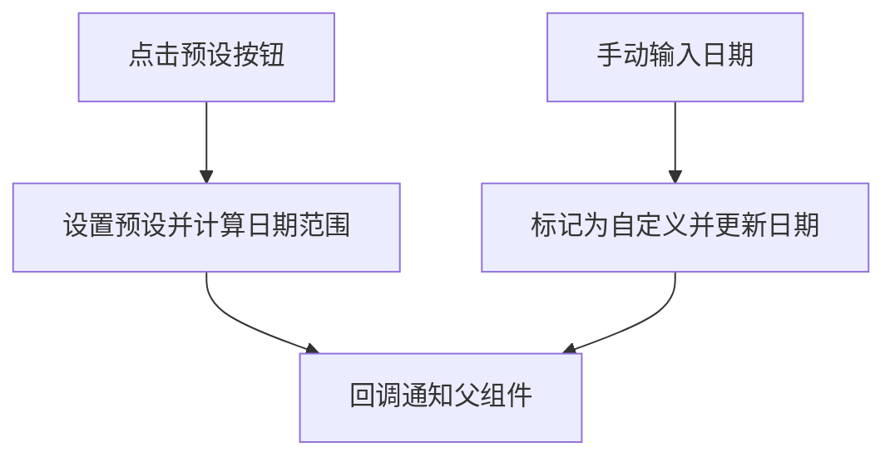

**图示来源**
- [DateRangeSelector.tsx](file://src/app/(dashboard)/insights/components/DateRangeSelector.tsx#L19-L64)

**章节来源**
- [DateRangeSelector.tsx](file://src/app/(dashboard)/insights/components/DateRangeSelector.tsx#L1-L65)

### API 路由与数据库聚合
- API 路由：校验 date_from 与 date_to 参数，鉴权后调用数据库聚合函数
- 数据库聚合：并行计算8类指标，包括时间分布、事项时长排名、未分配统计、四轴分析、周期对比、口径化指标等
- 性能优化：使用Promise.all并行执行多个聚合函数

**更新** 数据库聚合函数已扩展为并行计算8类指标，显著提升数据处理效率。

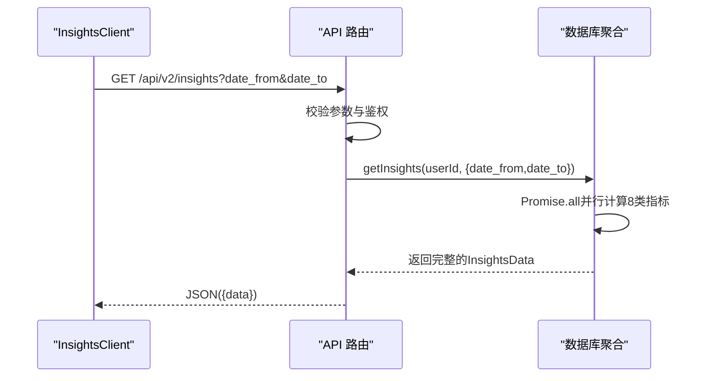

**图示来源**
- [route.ts:6-31](file://src/app/api/v2/insights/route.ts#L6-L31)
- [insights.ts:410-461](file://src/lib/db/insights.ts#L410-L461)

**章节来源**
- [route.ts:1-32](file://src/app/api/v2/insights/route.ts#L1-L32)
- [insights.ts:1-949](file://src/lib/db/insights.ts#L1-L949)

## 依赖关系分析
- 组件耦合
  - InsightsClient 依赖12个分析组件与toast工具
  - 分析组件彼此独立，仅消费传入的data结构
- 外部依赖
  - 图表库：Recharts（饼图、柱状图、折线图、条形图）
  - 图标库：lucide-react
  - 数据库：Supabase ORM
- 接口契约
  - API 输入：date_from、date_to（InsightsQuery）
  - API 输出：完整的InsightsData（12类指标）

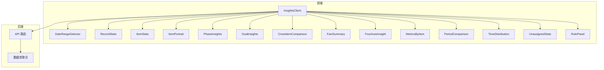

**图示来源**
- [InsightsClient.tsx](file://src/app/(dashboard)/insights/InsightsClient.tsx#L1-L197)
- [DateRangeSelector.tsx](file://src/app/(dashboard)/insights/components/DateRangeSelector.tsx#L1-L65)
- [CrossItemComparison.tsx](file://src/app/(dashboard)/insights/components/CrossItemComparison.tsx#L1-L107)
- [FactSummary.tsx](file://src/app/(dashboard)/insights/components/FactSummary.tsx#L1-L314)
- [FourAxesInsight.tsx](file://src/app/(dashboard)/insights/components/FourAxesInsight.tsx#L1-L176)
- [MetricsByItem.tsx](file://src/app/(dashboard)/insights/components/MetricsByItem.tsx#L1-L102)
- [PeriodComparison.tsx](file://src/app/(dashboard)/insights/components/PeriodComparison.tsx#L1-L123)
- [TimeDistribution.tsx](file://src/app/(dashboard)/insights/components/TimeDistribution.tsx#L1-L110)
- [UnassignedStats.tsx](file://src/app/(dashboard)/insights/components/UnassignedStats.tsx#L1-L62)
- [RulePanel.tsx](file://src/app/(dashboard)/insights/components/RulePanel.tsx#L1-L171)
- [route.ts:1-32](file://src/app/api/v2/insights/route.ts#L1-L32)
- [insights.ts:1-949](file://src/lib/db/insights.ts#L1-L949)

**章节来源**
- [teto.ts:253-449](file://src/types/teto.ts#L253-L449)

## 性能考量
- 请求节流与去抖
  - 在时间范围变更时触发请求，建议在日期输入框上增加防抖以避免频繁请求
- 缓存策略
  - 对相同日期范围的请求结果进行内存缓存，命中则直接渲染，未命中再发起网络请求
- 并行计算优化
  - 数据库聚合使用Promise.all并行执行8个独立的统计函数
  - 四轴分析中的多个查询使用Promise.all并行获取
- 图表渲染优化
  - 使用 Recharts 的 ResponsiveContainer 与按需渲染，减少不必要的重绘
  - 水平条形图根据项目数量动态调整高度
- 数据聚合优化
  - 合理使用 in 查询与 count 聚合，避免全表扫描
  - 批量查询替代多次小查询（如批量统计目标关联数）
  - 使用Map数据结构进行中间结果缓存
- 分页与截断
  - 列表类展示（如Top10、最近阶段）采用limit限制，避免超大数据集渲染

**更新** 新增并行计算优化策略，数据库聚合函数使用Promise.all同时执行8个独立统计任务，显著提升数据处理效率。

## 故障排查指南
- 常见错误
  - 缺少日期参数：后端返回 400 并提示 date_from 与 date_to 为必填
  - 未登录或鉴权失败：返回 401，提示请先登录
  - 服务器内部错误：返回 500，提示服务器错误
- 用户体验
  - 加载态：显示旋转图标与"加载中"提示
  - 错误态：展示错误信息与"重新加载"按钮
  - 重试机制：点击按钮后重新发起请求
- 组件特定问题
  - 图表组件：检查数据格式和空值处理
  - AI润色：检查API接口连通性和权限
  - 规则面板：确认用户规则API可用性

**章节来源**
- [route.ts:14-30](file://src/app/api/v2/insights/route.ts#L14-L30)
- [InsightsClient.tsx](file://src/app/(dashboard)/insights/InsightsClient.tsx#L143-L154)

## 结论
洞察分析系统通过12个核心分析组件和完善的API接口，实现了从基础统计到高级分析的完整数据洞察闭环。InsightsClient 作为控制中心协调时间范围与数据流，12个分析组件分别聚焦不同维度，配合图表库实现直观展示。新增的交叉对比、事实摘要、四轴分析、周期对比等功能进一步完善了系统的分析能力，为用户提供更全面的项目管理和目标追踪支持。建议在现有基础上引入缓存与防抖策略，进一步提升交互流畅度与性能表现。

## 附录
- 如何使用组件
  - 记录统计：传入 record_overview 数据
  - 事项统计：传入 item_overview 数据
  - 事项画像：传入 item_overview.portraits 数据
  - 阶段洞察：传入 phaseInsights 数据
  - 目标洞察：传入 goalInsights 数据
  - 交叉对比：传入 item_time_ranking 数据
  - 事实摘要：传入 four_axes 和 period_comparison 数据
  - 四轴分析：传入 four_axes 数据
  - 口径化指标：传入 metrics_by_item 数据
  - 周期对比：传入 period_comparison 数据
  - 时间分布：传入 time_distribution 数据
  - 未分配统计：传入 unassigned_stats 数据
  - 规则面板：无需传入数据，自动加载用户规则
- 数据模型参考
  - 洞察数据结构：InsightsData（包含12类指标）
  - 查询参数：InsightsQuery
  - 阶段/目标状态枚举：PhaseStatus、GoalStatus
  - 事项画像数据结构：Portrait（包含完成率、欠债量等字段）
  - 四轴分析数据结构：FourAxesData（包含4个主轴的详细数据）
  - 周期对比数据结构：PeriodComparisonData（包含周和月对比指标）

**更新** 新增8个高级分析组件的数据结构定义，包括四轴分析、周期对比、口径化指标等完整的数据接口规范。

**章节来源**
- [teto.ts:253-449](file://src/types/teto.ts#L253-L449)
- [CrossItemComparison.tsx](file://src/app/(dashboard)/insights/components/CrossItemComparison.tsx#L18-L20)
- [FactSummary.tsx](file://src/app/(dashboard)/insights/components/FactSummary.tsx#L6-L37)
- [FourAxesInsight.tsx](file://src/app/(dashboard)/insights/components/FourAxesInsight.tsx#L5-L36)
- [MetricsByItem.tsx](file://src/app/(dashboard)/insights/components/MetricsByItem.tsx#L5-L13)
- [PeriodComparison.tsx](file://src/app/(dashboard)/insights/components/PeriodComparison.tsx#L5-L16)
- [TimeDistribution.tsx](file://src/app/(dashboard)/insights/components/TimeDistribution.tsx#L15-L17)
- [UnassignedStats.tsx](file://src/app/(dashboard)/insights/components/UnassignedStats.tsx#L5-L14)
- [RulePanel.tsx](file://src/app/(dashboard)/insights/components/RulePanel.tsx#L6-L16)