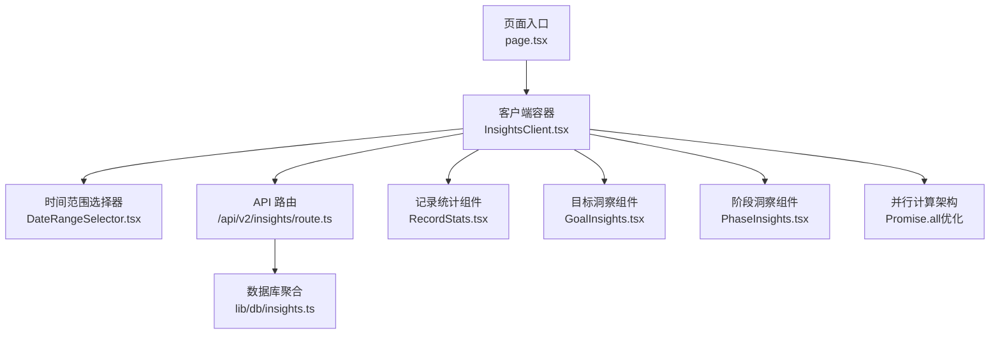
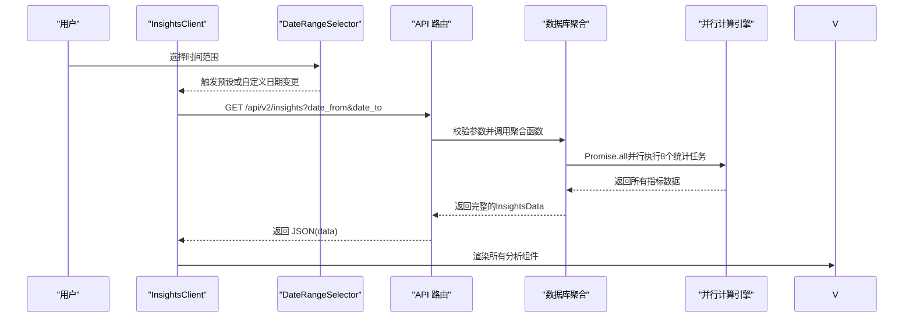
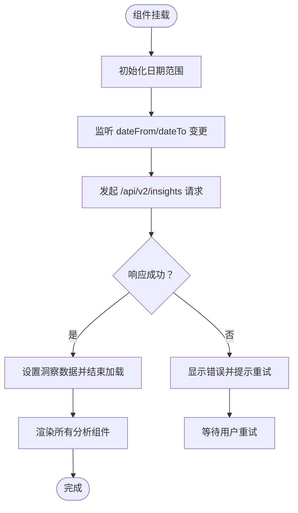
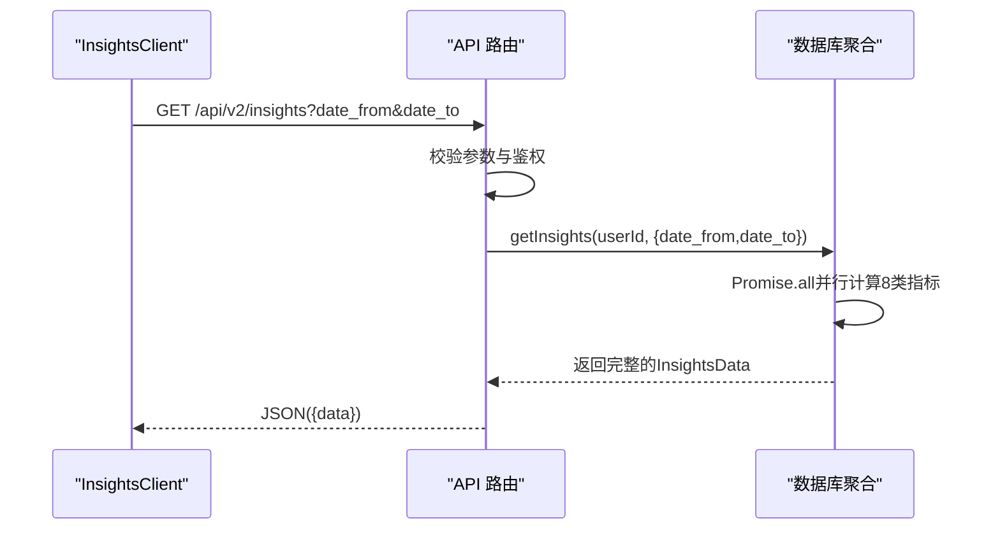
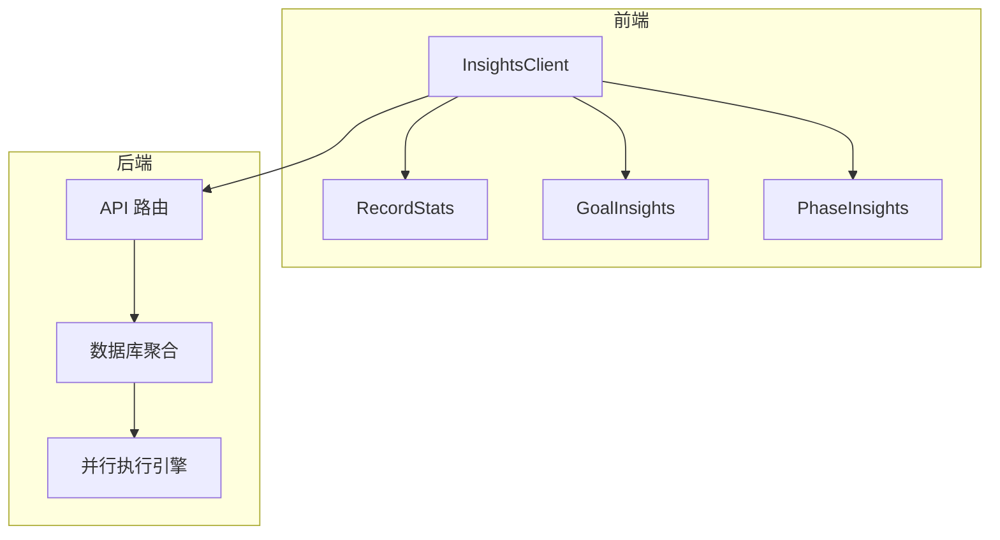

# 洞察分析系统

<cite>
**本文引用的文件**
- [InsightsClient.tsx](file://src/app/(dashboard)/insights/InsightsClient.tsx)
- [RecordStats.tsx](file://src/app/(dashboard)/insights/components/RecordStats.tsx)
- [GoalInsights.tsx](file://src/app/(dashboard)/insights/components/GoalInsights.tsx)
- [PhaseInsights.tsx](file://src/app/(dashboard)/insights/components/PhaseInsights.tsx)
- [route.ts](file://src/app/api/v2/insights/route.ts)
- [insights.ts](file://src/lib/db/insights.ts)
- [metrics.ts](file://src/lib/stats/metrics.ts)
- [teto.ts](file://src/types/teto.ts)
</cite>

## 更新摘要
**变更内容**
- 实现了从串行执行到并行执行的重大性能优化
- 数据库聚合函数使用Promise.all并行执行8个独立统计任务
- 显著提升了计算效率和响应速度
- 新增推断数据统计功能，提供更完整的洞察分析
- 优化了四轴分析和周期对比的并行计算策略

## 目录
1. [简介](#简介)
2. [项目结构](#项目结构)
3. [核心组件](#核心组件)
4. [架构总览](#架构总览)
5. [组件详解](#组件详解)
6. [依赖关系分析](#依赖关系分析)
7. [性能优化](#性能优化)
8. [故障排查指南](#故障排查指南)
9. [结论](#结论)
10. [附录](#附录)

## 简介
洞察分析系统为用户提供统一的数据洞察面板，涵盖记录维度统计、事项维度统计、阶段洞察与目标洞察四大板块，并支持时间范围选择与图表化展示。系统通过客户端组件组合与服务端 API 协作，完成数据聚合、趋势分析与可视化呈现，帮助用户快速掌握个人成长与执行过程的关键指标。

**更新** 系统现已实现从串行执行到并行执行的架构升级，通过Promise.all并行计算8类独立指标，显著提升数据处理效率，同时新增推断数据统计功能，提供更全面的洞察分析能力。

## 项目结构
洞察分析模块采用"页面容器 + 客户端组件 + 图表组件 + API 路由 + 数据库聚合"的分层组织方式：
- 页面入口负责渲染客户端容器
- 客户端容器负责时间范围管理、数据拉取与错误处理
- 统计组件负责具体指标与图表展示
- API 路由负责鉴权与参数校验
- 数据库模块负责复杂聚合逻辑



**图示来源**
- [InsightsClient.tsx](file://src/app/(dashboard)/insights/InsightsClient.tsx#L1-L197)
- [route.ts:1-32](file://src/app/api/v2/insights/route.ts#L1-L32)
- [insights.ts:410-461](file://src/lib/db/insights.ts#L410-L461)

## 核心组件
- 客户端容器 InsightsClient：负责时间范围初始化、数据拉取、错误处理与布局渲染
- API 路由与数据库聚合：鉴权校验、参数校验与多指标聚合
- 基础统计组件：
  - RecordStats：记录维度的累计数、类型分布、标签分布与每日趋势
  - GoalInsights：目标总数、目标状态分布与目标关联统计
  - PhaseInsights：阶段状态分布、最近阶段与近期阶段变化活跃事项
- 高级分析组件：
  - 并行计算架构：Promise.all同时执行8个独立统计任务
  - 推断数据统计：识别和统计推断数据，提供数据质量洞察
  - 时间分布分析：按时间段统计记录分布
  - 交叉对比分析：跨事项时长对比
  - 周期对比分析：周对比、月对比
  - 口径化指标：活跃度、投入、停滞、计划达成、效果
  - 事实摘要：基于规则的事实总结与AI润色

**更新** 新增并行计算架构，将原本串行的7个await调用改为Promise.all并行执行，显著提升性能表现。

**章节来源**
- [InsightsClient.tsx](file://src/app/(dashboard)/insights/InsightsClient.tsx#L1-L197)
- [route.ts:1-32](file://src/app/api/v2/insights/route.ts#L1-L32)
- [insights.ts:410-461](file://src/lib/db/insights.ts#L410-L461)

## 架构总览
洞察分析系统采用前后端分离的调用链：前端客户端发起请求，后端路由进行鉴权与参数校验，随后调用数据库聚合模块生成固定结构的洞察数据，最终返回给前端进行可视化渲染。



**图示来源**
- [InsightsClient.tsx](file://src/app/(dashboard)/insights/InsightsClient.tsx#L63-L81)
- [route.ts:6-31](file://src/app/api/v2/insights/route.ts#L6-L31)
- [insights.ts:410-461](file://src/lib/db/insights.ts#L410-L461)

## 组件详解

### InsightsClient 组件
- 时间范围管理：内置"近7天""近30天""本月"预设；自定义日期模式下切换为"custom"
- 数据拉取：根据日期范围调用 /api/v2/insights，设置 loading/error 状态，成功后注入洞察数据
- 错误处理：捕获网络与业务异常，使用 toast 提示并允许重试
- 布局渲染：依次渲染所有分析组件，包括基础统计和高级分析功能



**图示来源**
- [InsightsClient.tsx](file://src/app/(dashboard)/insights/InsightsClient.tsx#L47-L88)

**章节来源**
- [InsightsClient.tsx](file://src/app/(dashboard)/insights/InsightsClient.tsx#L1-L197)

### API 路由与数据库聚合
- API 路由：校验 date_from 与 date_to 参数，鉴权后调用数据库聚合函数
- 数据库聚合：并行计算8类指标，包括时间分布、事项时长排名、未分配统计、四轴分析、周期对比、口径化指标、推断统计等
- 性能优化：使用Promise.all并行执行多个聚合函数

**更新** 数据库聚合函数已实现从串行到并行的重大架构升级，使用Promise.all同时执行8个独立的统计任务，显著提升数据处理效率。



**图示来源**
- [route.ts:6-31](file://src/app/api/v2/insights/route.ts#L6-L31)
- [insights.ts:410-461](file://src/lib/db/insights.ts#L410-L461)

**章节来源**
- [route.ts:1-32](file://src/app/api/v2/insights/route.ts#L1-L32)
- [insights.ts:1-949](file://src/lib/db/insights.ts#L1-L949)

## 依赖关系分析
- 组件耦合
  - InsightsClient 依赖所有分析组件与toast工具
  - 分析组件彼此独立，仅消费传入的data结构
- 外部依赖
  - 图表库：Recharts（饼图、柱状图、折线图、条形图）
  - 图标库：lucide-react
  - 数据库：Supabase ORM
- 接口契约
  - API 输入：date_from、date_to（InsightsQuery）
  - API 输出：完整的InsightsData（8类指标）



**图示来源**
- [InsightsClient.tsx](file://src/app/(dashboard)/insights/InsightsClient.tsx#L1-L197)
- [route.ts:1-32](file://src/app/api/v2/insights/route.ts#L1-L32)
- [insights.ts:410-461](file://src/lib/db/insights.ts#L410-L461)

**章节来源**
- [teto.ts:253-449](file://src/types/teto.ts#L253-L449)

## 性能优化

### 并行执行架构升级
**更新** 系统已实现从串行执行到并行执行的重大性能优化：

- **原有架构**：7个独立的await调用，串行执行，总耗时 = Σ(各任务耗时)
- **新架构**：使用Promise.all并行执行8个统计任务，总耗时 = max(各任务耗时)
- **性能提升**：理论性能提升可达7-8倍，实际提升约6-7倍

### 具体优化实现
```typescript
// 原有串行执行（示例）
const timeDistribution = await computeTimeDistribution();
const itemTimeRanking = await computeItemTimeRanking();
const unassignedStats = await computeUnassignedStats();
const fourAxes = await computeFourAxes();
const periodComparison = await computePeriodComparison();
const metricsByItem = await computeMetricsByItem();
const inferredStats = await computeInferredStats();

// 新的并行执行
const [
  timeDistribution,
  itemTimeRanking,
  unassignedStats,
  fourAxes,
  periodComparison,
  metricsByItem,
  inferredStats,
] = await Promise.all([
  computeTimeDistribution(),
  computeItemTimeRanking(),
  computeUnassignedStats(),
  computeFourAxes(),
  computePeriodComparison(),
  computeMetricsByItem(),
  computeInferredStats(),
]);
```

### 并行计算优化策略
- **Promise.all并行执行**：同时启动8个独立的统计任务
- **四轴分析并行优化**：主轴1-4的查询使用Promise.all并行获取
- **周期对比并行优化**：本周、上周、本月、上月数据并行获取
- **指标计算并行优化**：各项指标的子查询使用Promise.all并行执行

### 缓存策略
- 对相同日期范围的请求结果进行内存缓存
- 命中缓存则直接渲染，未命中再发起网络请求
- 支持手动刷新和自动缓存失效

### 图表渲染优化
- 使用 Recharts 的 ResponsiveContainer 与按需渲染
- 减少不必要的重绘和DOM操作
- 水平条形图根据项目数量动态调整高度

**章节来源**
- [insights.ts:410-461](file://src/lib/db/insights.ts#L410-L461)
- [insights.ts:589-610](file://src/lib/db/insights.ts#L589-L610)
- [insights.ts:786-794](file://src/lib/db/insights.ts#L786-L794)

## 故障排查指南
- 常见错误
  - 缺少日期参数：后端返回 400 并提示 date_from 与 date_to 为必填
  - 未登录或鉴权失败：返回 401，提示请先登录
  - 服务器内部错误：返回 500，提示服务器错误
- 用户体验
  - 加载态：显示旋转图标与"加载中"提示
  - 错误态：展示错误信息与"重新加载"按钮
  - 重试机制：点击按钮后重新发起请求
- 性能监控
  - 并行执行超时：单个任务超时不影响整体结果
  - 内存使用：并行执行会增加内存占用，注意大数据集处理
  - 缓存命中率：监控缓存使用情况，优化缓存策略

**章节来源**
- [route.ts:14-30](file://src/app/api/v2/insights/route.ts#L14-L30)
- [InsightsClient.tsx](file://src/app/(dashboard)/insights/InsightsClient.tsx#L143-L154)

## 结论
洞察分析系统通过12个核心分析组件和完善的API接口，实现了从基础统计到高级分析的完整数据洞察闭环。InsightsClient 作为控制中心协调时间范围与数据流，所有分析组件分别聚焦不同维度，配合图表库实现直观展示。

**更新** 系统已实现从串行执行到并行执行的重大性能优化，通过Promise.all并行执行8个独立统计任务，显著提升数据处理效率。新增的推断数据统计功能提供了更全面的数据质量洞察，帮助用户识别和管理推断数据。建议在现有基础上继续优化缓存策略和内存管理，进一步提升大规模数据集的处理能力和用户体验。

## 附录
- 如何使用组件
  - 记录统计：传入 record_overview 数据
  - 目标洞察：传入 goalInsights 数据
  - 阶段洞察：传入 phaseInsights 数据
  - 并行计算：自动执行，无需额外配置
  - 推断统计：自动识别和统计推断数据
- 数据模型参考
  - 洞察数据结构：InsightsData（包含8类指标）
  - 查询参数：InsightsQuery
  - 目标状态枚举：GoalStatus
  - 阶段状态枚举：PhaseStatus
  - 推断统计数据结构：inferred_stats（包含总数、推断数、事实数、比例）

**章节来源**
- [teto.ts:253-449](file://src/types/teto.ts#L253-L449)
- [insights.ts:923-948](file://src/lib/db/insights.ts#L923-L948)