# 洞察分析系统

<cite>
**本文引用的文件**
- [InsightsClient.tsx](file://src/app/(dashboard)/insights/InsightsClient.tsx)
- [RecordStats.tsx](file://src/app/(dashboard)/insights/components/RecordStats.tsx)
- [ItemStats.tsx](file://src/app/(dashboard)/insights/components/ItemStats.tsx)
- [ItemPortrait.tsx](file://src/app/(dashboard)/insights/components/ItemPortrait.tsx)
- [PhaseInsights.tsx](file://src/app/(dashboard)/insights/components/PhaseInsights.tsx)
- [GoalInsights.tsx](file://src/app/(dashboard)/insights/components/GoalInsights.tsx)
- [DateRangeSelector.tsx](file://src/app/(dashboard)/insights/components/DateRangeSelector.tsx)
- [page.tsx](file://src/app/(dashboard)/insights/page.tsx)
- [insights.ts](file://src/lib/db/insights.ts)
- [route.ts](file://src/app/api/v2/insights/route.ts)
- [teto.ts](file://src/types/teto.ts)
</cite>

## 更新摘要
**变更内容**
- 新增ItemPortrait可视化组件，提供事项活动的直观展示和完成率分析
- 数据库聚合逻辑增强，支持生成详细的事项画像数据
- 类型定义扩展，新增item_overview.portraits字段
- InsightsClient组件更新，集成新的ItemPortrait组件

## 目录
1. [简介](#简介)
2. [项目结构](#项目结构)
3. [核心组件](#核心组件)
4. [架构总览](#架构总览)
5. [组件详解](#组件详解)
6. [依赖关系分析](#依赖关系分析)
7. [性能考量](#性能考量)
8. [故障排查指南](#故障排查指南)
9. [结论](#结论)
10. [附录](#附录)

## 简介
洞察分析系统为用户提供统一的数据洞察面板，涵盖记录维度统计、事项维度统计、阶段洞察与目标洞察四大板块，并支持时间范围选择与图表化展示。系统通过客户端组件组合与服务端 API 协作，完成数据聚合、趋势分析与可视化呈现，帮助用户快速掌握个人成长与执行过程的关键指标。

**更新** 系统现已增强对新目标和阶段数据的支持，包括完整的阶段洞察分析、目标洞察分析和新增的事项画像分析功能，为用户提供更全面的项目管理和目标追踪能力。

## 项目结构
洞察分析模块采用"页面容器 + 客户端组件 + 图表组件 + API 路由 + 数据库聚合"的分层组织方式：
- 页面入口负责渲染客户端容器
- 客户端容器负责时间范围管理、数据拉取与错误处理
- 统计组件负责具体指标与图表展示
- API 路由负责鉴权与参数校验
- 数据库模块负责复杂聚合逻辑

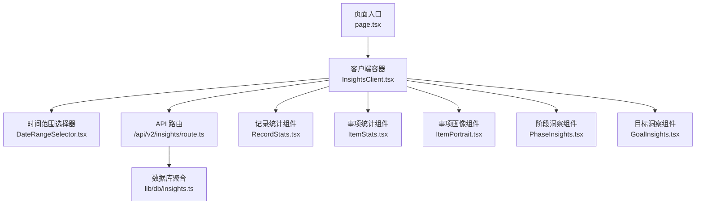

**图示来源**
- [page.tsx](file://src/app/(dashboard)/insights/page.tsx#L1-L6)
- [InsightsClient.tsx](file://src/app/(dashboard)/insights/InsightsClient.tsx#L1-L149)
- [DateRangeSelector.tsx](file://src/app/(dashboard)/insights/components/DateRangeSelector.tsx#L1-L65)
- [route.ts:1-32](file://src/app/api/v2/insights/route.ts#L1-L32)
- [insights.ts:1-437](file://src/lib/db/insights.ts#L1-L437)
- [RecordStats.tsx](file://src/app/(dashboard)/insights/components/RecordStats.tsx#L1-L125)
- [ItemStats.tsx](file://src/app/(dashboard)/insights/components/ItemStats.tsx#L1-L111)
- [ItemPortrait.tsx](file://src/app/(dashboard)/insights/components/ItemPortrait.tsx#L1-L122)
- [PhaseInsights.tsx](file://src/app/(dashboard)/insights/components/PhaseInsights.tsx#L1-L139)
- [GoalInsights.tsx](file://src/app/(dashboard)/insights/components/GoalInsights.tsx#L1-L143)

**章节来源**
- [page.tsx](file://src/app/(dashboard)/insights/page.tsx#L1-L6)
- [InsightsClient.tsx](file://src/app/(dashboard)/insights/InsightsClient.tsx#L1-L149)

## 核心组件
- 客户端容器 InsightsClient：负责时间范围初始化、数据拉取、错误处理与布局渲染
- 时间范围选择器 DateRangeSelector：提供预设快捷键与自定义日期输入
- 统计组件：
  - RecordStats：记录维度的累计数、类型分布、标签分布与每日趋势
  - ItemStats：活跃事项、Top 事项与停滞事项
  - ItemPortrait：事项活动画像、完成率分析与沉寂事项识别
  - PhaseInsights：阶段状态分布、最近阶段与近期阶段变化活跃事项
  - GoalInsights：目标总数、目标状态分布与目标关联统计
- API 路由与数据库聚合：鉴权校验、参数校验与多指标聚合

**更新** 新增了阶段洞察、目标洞察和事项画像三大核心分析组件，提供完整的项目管理和目标追踪功能。

**章节来源**
- [InsightsClient.tsx](file://src/app/(dashboard)/insights/InsightsClient.tsx#L1-L149)
- [DateRangeSelector.tsx](file://src/app/(dashboard)/insights/components/DateRangeSelector.tsx#L1-L65)
- [RecordStats.tsx](file://src/app/(dashboard)/insights/components/RecordStats.tsx#L1-L125)
- [ItemStats.tsx](file://src/app/(dashboard)/insights/components/ItemStats.tsx#L1-L111)
- [ItemPortrait.tsx](file://src/app/(dashboard)/insights/components/ItemPortrait.tsx#L1-L122)
- [PhaseInsights.tsx](file://src/app/(dashboard)/insights/components/PhaseInsights.tsx#L1-L139)
- [GoalInsights.tsx](file://src/app/(dashboard)/insights/components/GoalInsights.tsx#L1-L143)
- [route.ts:1-32](file://src/app/api/v2/insights/route.ts#L1-L32)
- [insights.ts:1-437](file://src/lib/db/insights.ts#L1-L437)

## 架构总览
洞察分析系统采用前后端分离的调用链：前端客户端发起请求，后端路由进行鉴权与参数校验，随后调用数据库聚合模块生成固定结构的洞察数据，最终返回给前端进行可视化渲染。

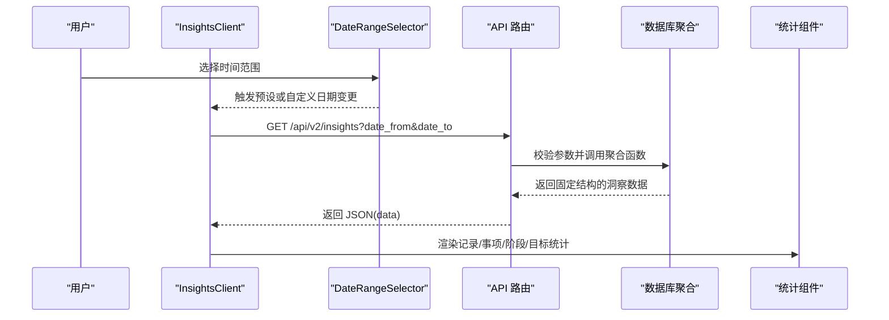

**图示来源**
- [InsightsClient.tsx](file://src/app/(dashboard)/insights/InsightsClient.tsx#L55-L80)
- [DateRangeSelector.tsx](file://src/app/(dashboard)/insights/components/DateRangeSelector.tsx#L19-L64)
- [route.ts:6-31](file://src/app/api/v2/insights/route.ts#L6-L31)
- [insights.ts:14-437](file://src/lib/db/insights.ts#L14-L437)

## 组件详解

### InsightsClient 组件
- 时间范围管理：内置"近7天""近30天""本月"预设；自定义日期模式下切换为"custom"
- 数据拉取：根据日期范围调用 /api/v2/insights，设置 loading/error 状态，成功后注入洞察数据
- 错误处理：捕获网络与业务异常，使用 toast 提示并允许重试
- 布局渲染：依次渲染记录统计、事项统计、事项画像、阶段洞察与目标洞察四个板块

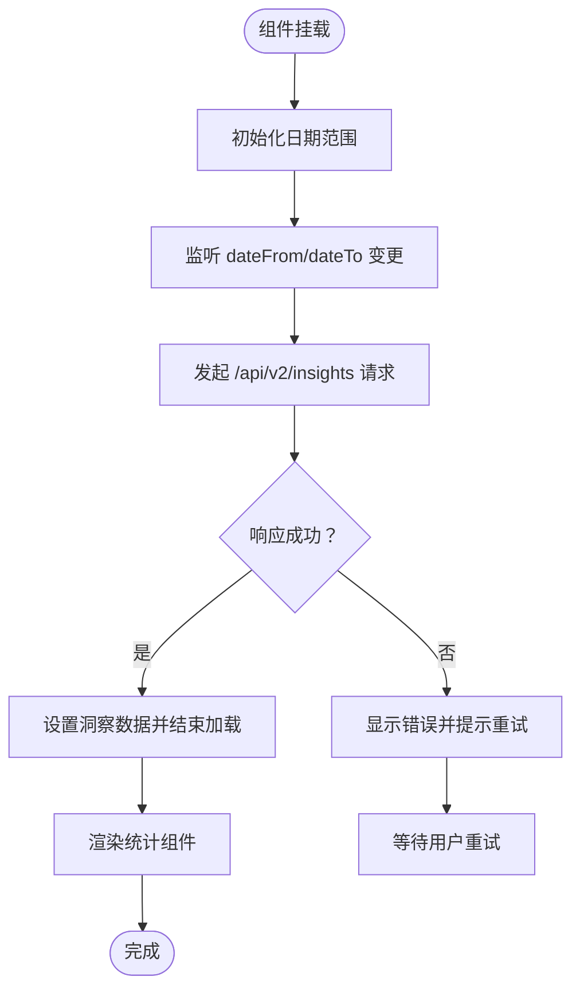

**图示来源**
- [InsightsClient.tsx](file://src/app/(dashboard)/insights/InsightsClient.tsx#L39-L95)

**章节来源**
- [InsightsClient.tsx](file://src/app/(dashboard)/insights/InsightsClient.tsx#L1-L149)

### RecordStats 组件
- 指标卡片：展示近7天与近30天记录总数
- 每日趋势：基于 record_days 的每日计数折线图
- 类型分布：按记录类型绘制饼图
- 标签分布：按标签绘制横向柱状图

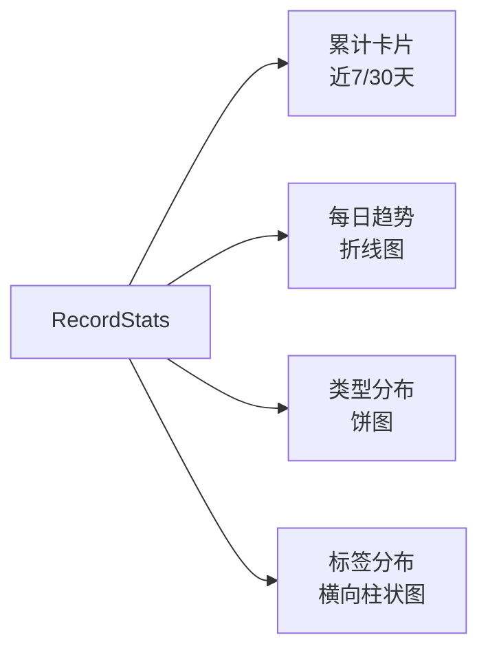

**图示来源**
- [RecordStats.tsx](file://src/app/(dashboard)/insights/components/RecordStats.tsx#L39-L124)

**章节来源**
- [RecordStats.tsx](file://src/app/(dashboard)/insights/components/RecordStats.tsx#L1-L125)

### ItemStats 组件
- 活跃事项：当前处于"活跃/推进中"的事项数
- Top 事项：在时间范围内记录数最多的前5个事项
- 停滞事项：超过7天未产生记录的活跃事项列表

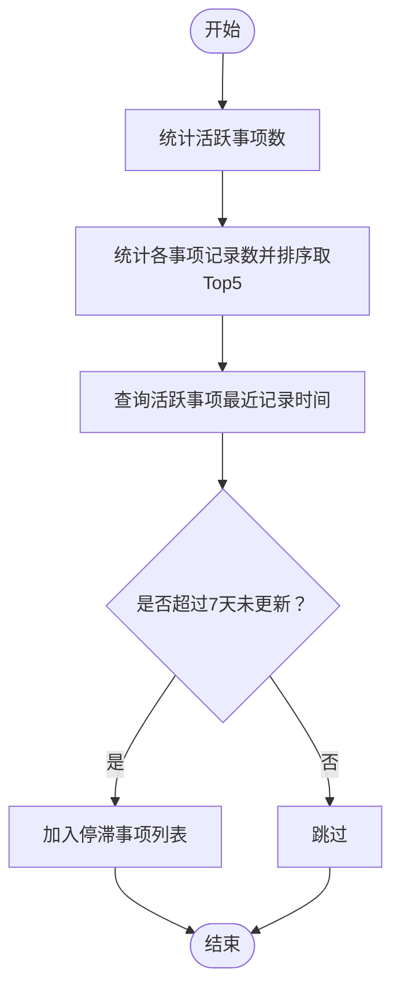

**图示来源**
- [ItemStats.tsx](file://src/app/(dashboard)/insights/components/ItemStats.tsx#L40-L109)

**章节来源**
- [ItemStats.tsx](file://src/app/(dashboard)/insights/components/ItemStats.tsx#L1-L111)

### ItemPortrait 组件
- 事项画像：基于活动事项的记录数、完成率和欠债情况进行综合分析
- 活跃事项展示：显示在指定时间范围内有记录的事项，按记录数降序排列
- 完成率分析：计算量化目标的完成率，提供状态标识（欠债严重/基本达标/状态良好）
- 沉寂事项识别：显示超过14天未产生记录的活跃事项
- 可视化展示：使用进度条显示记录数，状态徽章标识完成率等级

**更新** 新增完整的事项画像分析功能，提供基于量化目标的完成率计算和状态评估。

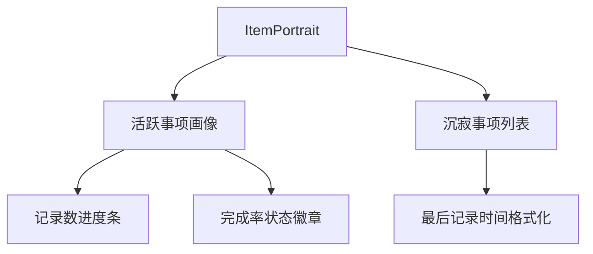

**图示来源**
- [ItemPortrait.tsx](file://src/app/(dashboard)/insights/components/ItemPortrait.tsx#L69-L121)

**章节来源**
- [ItemPortrait.tsx](file://src/app/(dashboard)/insights/components/ItemPortrait.tsx#L1-L122)

### PhaseInsights 组件
- 阶段状态分布：按"进行中/已结束/停滞"绘制饼图
- 最近创建阶段：按创建时间倒序展示最近5个阶段
- 近期阶段变化活跃事项：统计最近30天内新增阶段数最多的前5个事项

**更新** 新增完整的阶段洞察分析功能，提供阶段生命周期管理的可视化分析。

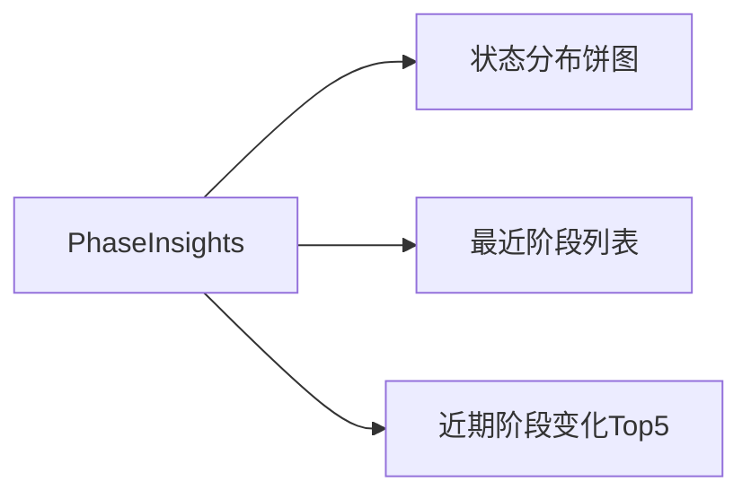

**图示来源**
- [PhaseInsights.tsx](file://src/app/(dashboard)/insights/components/PhaseInsights.tsx#L32-L138)

**章节来源**
- [PhaseInsights.tsx](file://src/app/(dashboard)/insights/components/PhaseInsights.tsx#L1-L139)

### GoalInsights 组件
- 目标总数与"有关联"的目标：统计目标总数与关联了事项/记录的目标数
- 目标状态分布：按"进行中/已达成/已放弃/已暂停"绘制饼图
- 目标关联统计：展示每个目标关联的事项数与记录数

**更新** 新增完整的目标洞察分析功能，提供目标管理的多维度统计分析。

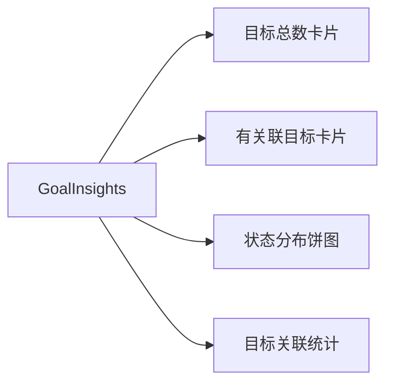

**图示来源**
- [GoalInsights.tsx](file://src/app/(dashboard)/insights/components/GoalInsights.tsx#L29-L142)

**章节来源**
- [GoalInsights.tsx](file://src/app/(dashboard)/insights/components/GoalInsights.tsx#L1-L143)

### DateRangeSelector 组件
- 预设按钮：近7天、近30天、本月
- 自定义日期：起始与结束日期输入框
- 回调通知：向父组件传递预设变更或自定义日期变更

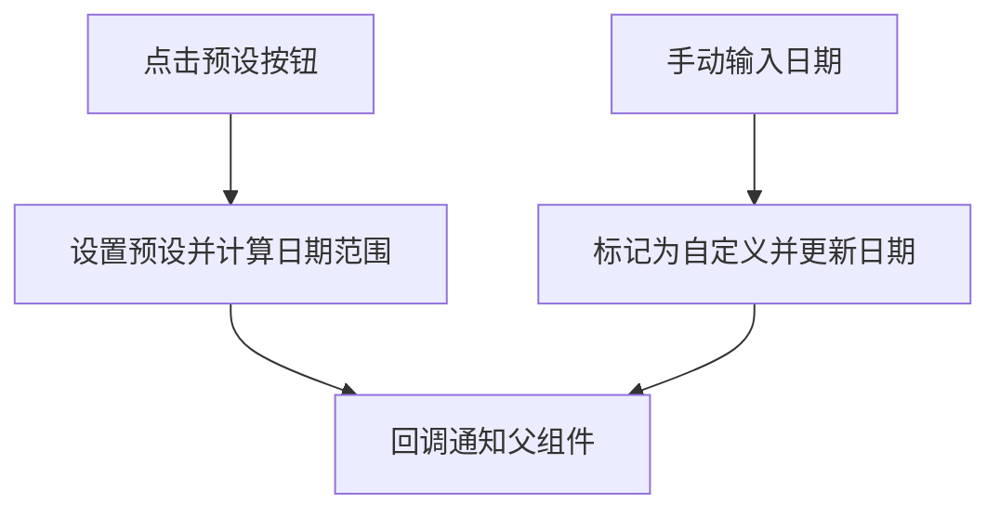

**图示来源**
- [DateRangeSelector.tsx](file://src/app/(dashboard)/insights/components/DateRangeSelector.tsx#L19-L64)

**章节来源**
- [DateRangeSelector.tsx](file://src/app/(dashboard)/insights/components/DateRangeSelector.tsx#L1-L65)

### API 路由与数据库聚合
- API 路由：校验 date_from 与 date_to 参数，鉴权后调用数据库聚合函数
- 数据库聚合：按固定8类指标进行统计与聚合，返回统一结构的洞察数据

**更新** 数据库聚合函数已扩展为8类指标，新增阶段洞察、目标洞察和事项画像的完整统计逻辑。

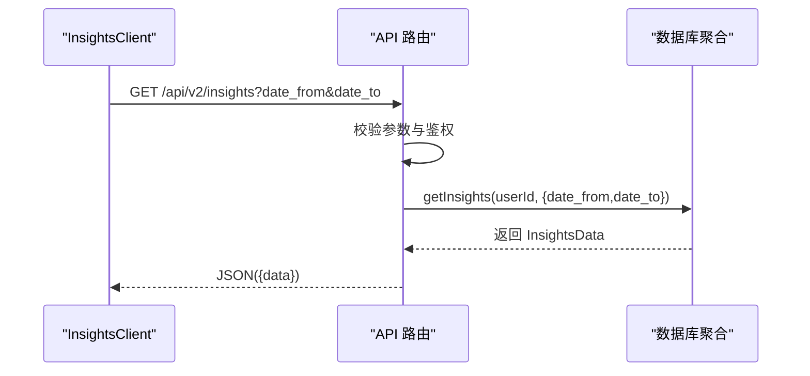

**图示来源**
- [route.ts:6-31](file://src/app/api/v2/insights/route.ts#L6-L31)
- [insights.ts:14-437](file://src/lib/db/insights.ts#L14-L437)

**章节来源**
- [route.ts:1-32](file://src/app/api/v2/insights/route.ts#L1-L32)
- [insights.ts:1-437](file://src/lib/db/insights.ts#L1-L437)

## 依赖关系分析
- 组件耦合
  - InsightsClient 依赖 DateRangeSelector、五个统计组件与 toast 工具
  - 统计组件彼此独立，仅消费传入的 data 结构
- 外部依赖
  - 图表库：Recharts（饼图、柱状图、折线图）
  - 图标库：lucide-react
  - 数据库：Supabase ORM
- 接口契约
  - API 输入：date_from、date_to（InsightsQuery）
  - API 输出：InsightsData（固定结构）

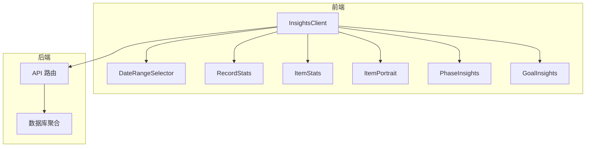

**图示来源**
- [InsightsClient.tsx](file://src/app/(dashboard)/insights/InsightsClient.tsx#L1-L149)
- [DateRangeSelector.tsx](file://src/app/(dashboard)/insights/components/DateRangeSelector.tsx#L1-L65)
- [RecordStats.tsx](file://src/app/(dashboard)/insights/components/RecordStats.tsx#L1-L125)
- [ItemStats.tsx](file://src/app/(dashboard)/insights/components/ItemStats.tsx#L1-L111)
- [ItemPortrait.tsx](file://src/app/(dashboard)/insights/components/ItemPortrait.tsx#L1-L122)
- [PhaseInsights.tsx](file://src/app/(dashboard)/insights/components/PhaseInsights.tsx#L1-L139)
- [GoalInsights.tsx](file://src/app/(dashboard)/insights/components/GoalInsights.tsx#L1-L143)
- [route.ts:1-32](file://src/app/api/v2/insights/route.ts#L1-L32)
- [insights.ts:1-437](file://src/lib/db/insights.ts#L1-L437)

**章节来源**
- [teto.ts:253-449](file://src/types/teto.ts#L253-L449)

## 性能考量
- 请求节流与去抖
  - 在时间范围变更时触发请求，建议在日期输入框上增加防抖以避免频繁请求
- 缓存策略
  - 对相同日期范围的请求结果进行内存缓存，命中则直接渲染，未命中再发起网络请求
- 图表渲染优化
  - 使用 Recharts 的 ResponsiveContainer 与按需渲染，减少不必要的重绘
- 数据聚合优化
  - 合理使用 in 查询与 count 聚合，避免全表扫描
  - 将多次小查询合并为批量查询（例如批量统计目标关联数）
  - 事项画像查询中使用分步聚合策略，先统计记录数再查询目标数据
- 分页与截断
  - 列表类展示（如 Top 5、最近阶段）采用 limit 限制，避免超大数据集渲染

**更新** 新增的事项画像功能已考虑性能优化，包括分步聚合策略和批量查询优化。

## 故障排查指南
- 常见错误
  - 缺少日期参数：后端返回 400 并提示 date_from 与 date_to 为必填
  - 未登录或鉴权失败：返回 401，提示请先登录
  - 服务器内部错误：返回 500，提示服务器错误
- 用户体验
  - 加载态：显示旋转图标与"加载中"提示
  - 错误态：展示错误信息与"重新加载"按钮
  - 重试机制：点击按钮后重新发起请求

**章节来源**
- [route.ts:14-30](file://src/app/api/v2/insights/route.ts#L14-L30)
- [InsightsClient.tsx](file://src/app/(dashboard)/insights/InsightsClient.tsx#L116-L134)

## 结论
洞察分析系统通过清晰的组件划分与稳定的 API 接口，实现了从数据采集、聚合到可视化的完整闭环。InsightsClient 作为控制中心协调时间范围与数据流，五个统计组件分别聚焦不同维度，配合图表库实现直观展示。新增的阶段洞察、目标洞察和事项画像功能进一步完善了系统的分析能力，为用户提供更全面的项目管理和目标追踪支持。建议在现有基础上引入缓存与防抖策略，进一步提升交互流畅度与性能表现。

## 附录
- 如何使用组件
  - 记录统计：传入 record_overview 数据
  - 事项统计：传入 item_overview 数据
  - 事项画像：传入 item_overview.portraits 数据
  - 阶段洞察：传入 phaseInsights 数据
  - 目标洞察：传入 goalInsights 数据
- 数据模型参考
  - 洞察数据结构：InsightsData
  - 查询参数：InsightsQuery
  - 阶段/目标状态枚举：PhaseStatus、GoalStatus
  - 事项画像数据结构：Portrait（包含完成率、欠债量等字段）

**更新** 新增了事项画像的数据结构定义，包括完成率计算逻辑和状态评估标准。

**章节来源**
- [teto.ts:253-449](file://src/types/teto.ts#L253-L449)
- [RecordStats.tsx](file://src/app/(dashboard)/insights/components/RecordStats.tsx#L19-L21)
- [ItemStats.tsx](file://src/app/(dashboard)/insights/components/ItemStats.tsx#L6-L8)
- [ItemPortrait.tsx](file://src/app/(dashboard)/insights/components/ItemPortrait.tsx#L6-L7)
- [PhaseInsights.tsx](file://src/app/(dashboard)/insights/components/PhaseInsights.tsx#L23-L25)
- [GoalInsights.tsx](file://src/app/(dashboard)/insights/components/GoalInsights.tsx#L25-L27)