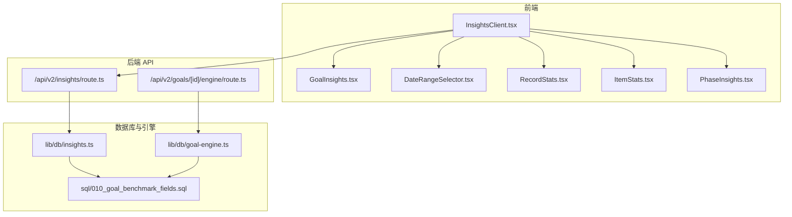
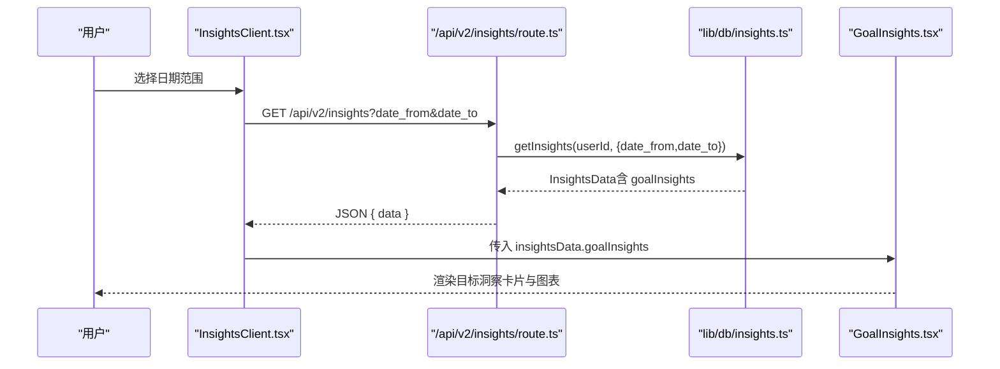
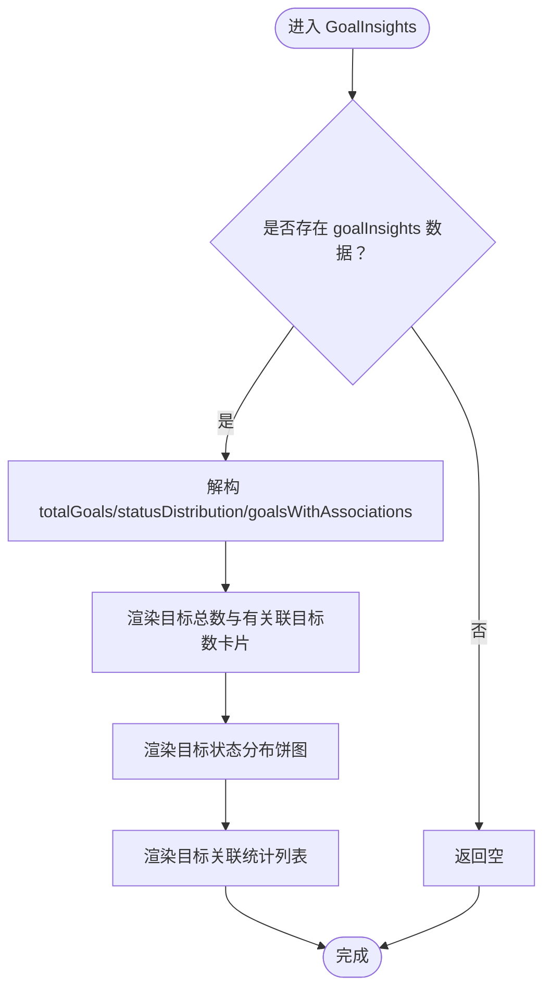
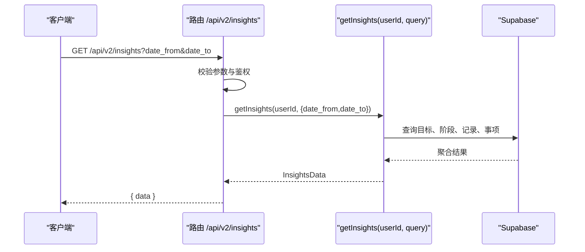
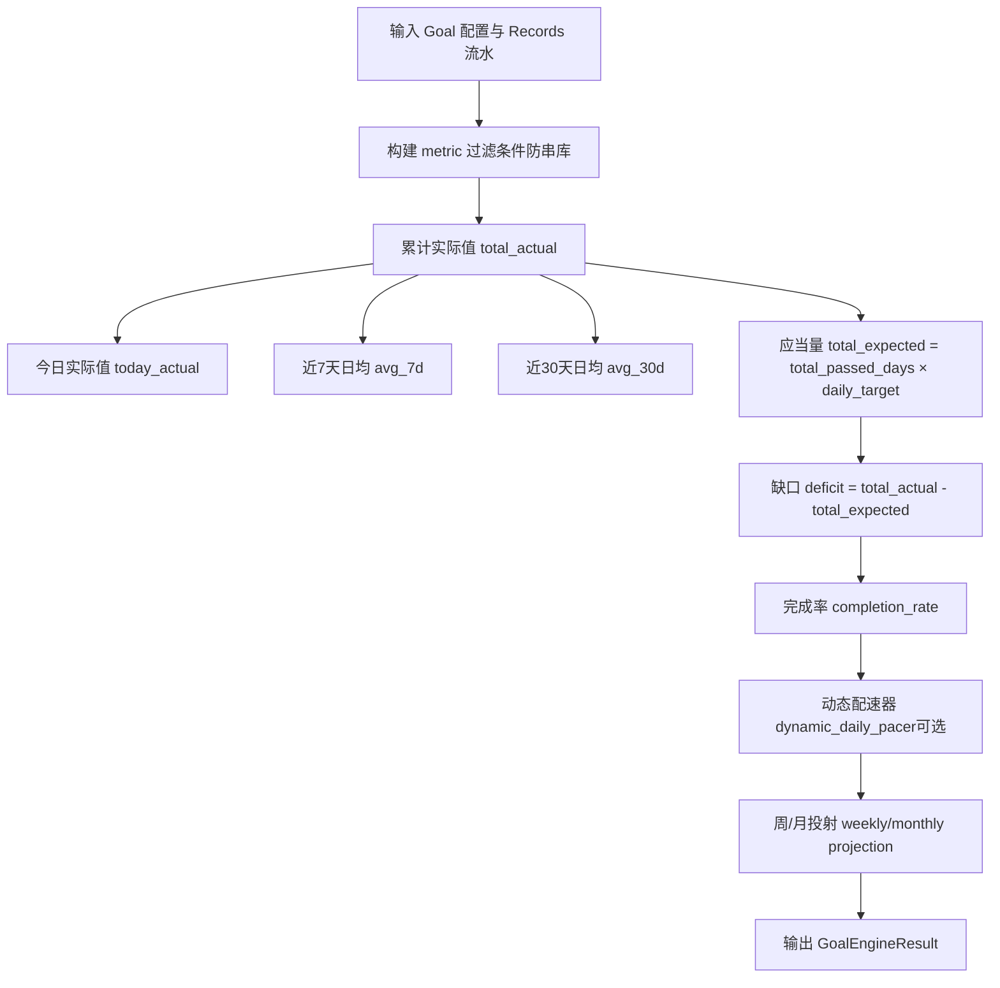
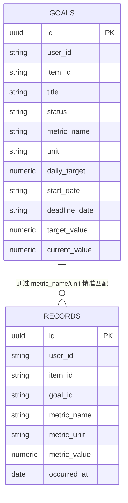
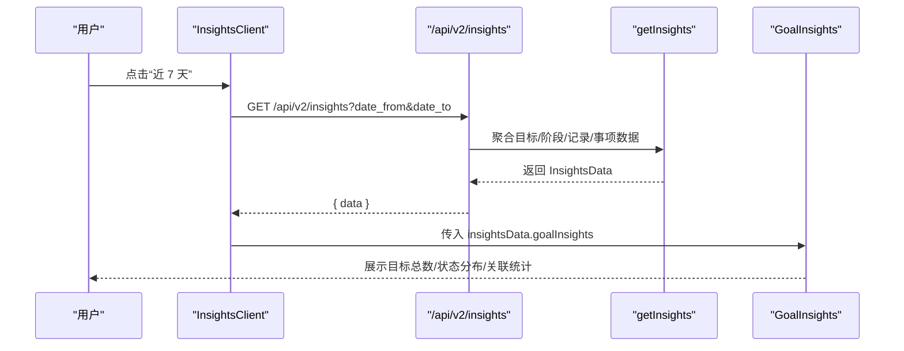
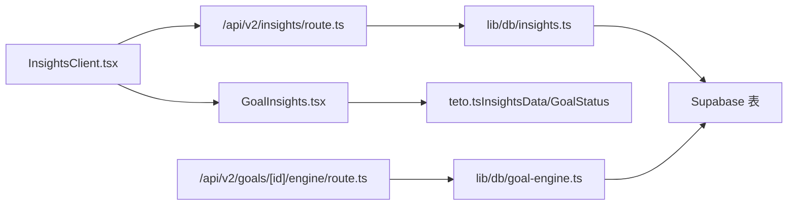

# 目标洞察分析

<cite>
**本文引用的文件**
- [GoalInsights.tsx](file://src/app/(dashboard)/insights/components/GoalInsights.tsx)
- [InsightsClient.tsx](file://src/app/(dashboard)/insights/InsightsClient.tsx)
- [route.ts（洞察 API）](file://src/app/api/v2/insights/route.ts)
- [insights.ts（数据库实现）](file://src/lib/db/insights.ts)
- [teto.ts（类型定义）](file://src/types/teto.ts)
- [DateRangeSelector.tsx](file://src/app/(dashboard)/insights/components/DateRangeSelector.tsx)
- [RecordStats.tsx](file://src/app/(dashboard)/insights/components/RecordStats.tsx)
- [ItemStats.tsx](file://src/app/(dashboard)/insights/components/ItemStats.tsx)
- [PhaseInsights.tsx](file://src/app/(dashboard)/insights/components/PhaseInsights.tsx)
- [route.ts（目标引擎 API）](file://src/app/api/v2/goals/[id]/engine/route.ts)
- [goal-engine.ts](file://src/lib/db/goal-engine.ts)
- [010_goal_benchmark_fields.sql](file://sql/010_goal_benchmark_fields.sql)
</cite>

## 目录
1. [简介](#简介)
2. [项目结构](#项目结构)
3. [核心组件](#核心组件)
4. [架构总览](#架构总览)
5. [详细组件分析](#详细组件分析)
6. [依赖分析](#依赖分析)
7. [性能考虑](#性能考虑)
8. [故障排查指南](#故障排查指南)
9. [结论](#结论)
10. [附录](#附录)

## 简介
本文件围绕 TETO 的目标洞察分析功能，系统化阐述 GoalInsights 组件的能力边界与实现方式，覆盖目标完成度统计、目标价值评估、目标优先级分析、目标达成趋势、目标关联性分析、目标调整影响评估、目标健康度指标、预期 vs 实际对比、目标实现路径优化等主题。文档同时给出数据建模、智能推荐算法思路与可视化展示方案，并提供可操作的实现示例与最佳实践。

## 项目结构
目标洞察分析由前端组件与后端 API/数据库层协同完成：
- 前端：InsightsClient 负责日期选择与数据拉取；GoalInsights 渲染目标洞察卡片与图表。
- 后端：/api/v2/insights 提供统一洞察入口；数据库层 getInsights 聚合目标、阶段、记录与事项维度数据。
- 目标量化引擎：独立的 /api/v2/goals/{id}/engine 与 lib/db/goal-engine.ts 提供目标健康度与预期对比能力。

**图示来源**
- [InsightsClient.tsx:1-149](file://src/app/(dashboard)/insights/InsightsClient.tsx#L1-L149)
- [GoalInsights.tsx:1-143](file://src/app/(dashboard)/insights/components/GoalInsights.tsx#L1-L143)
- [route.ts（洞察 API）:1-32](file://src/app/api/v2/insights/route.ts#L1-L32)
- [insights.ts:1-346](file://src/lib/db/insights.ts#L1-L346)
- [route.ts（目标引擎 API）:1-34](file://src/app/api/v2/goals/[id]/engine/route.ts#L1-L34)
- [goal-engine.ts:1-207](file://src/lib/db/goal-engine.ts#L1-L207)
- [010_goal_benchmark_fields.sql:1-25](file://sql/010_goal_benchmark_fields.sql#L1-L25)

**章节来源**
- [InsightsClient.tsx:1-149](file://src/app/(dashboard)/insights/InsightsClient.tsx#L1-L149)
- [GoalInsights.tsx:1-143](file://src/app/(dashboard)/insights/components/GoalInsights.tsx#L1-L143)
- [route.ts（洞察 API）:1-32](file://src/app/api/v2/insights/route.ts#L1-L32)
- [insights.ts:1-346](file://src/lib/db/insights.ts#L1-L346)
- [route.ts（目标引擎 API）:1-34](file://src/app/api/v2/goals/[id]/engine/route.ts#L1-L34)
- [goal-engine.ts:1-207](file://src/lib/db/goal-engine.ts#L1-L207)
- [010_goal_benchmark_fields.sql:1-25](file://sql/010_goal_benchmark_fields.sql#L1-L25)

## 核心组件
- GoalInsights：渲染目标总数、有关联的目标数量、目标状态分布饼图、目标关联统计列表。
- InsightsClient：负责日期范围选择、调用 /api/v2/insights 获取洞察数据并在页面中组合渲染各维度组件。
- 洞察 API：接收 date_from/date_to 参数，鉴权后调用 getInsights 返回统一结构数据。
- 数据库实现 getInsights：聚合目标总数、状态分布、目标关联统计等。
- 目标引擎 API 与引擎：提供单目标健康度与预期对比，支持目标实现路径优化建议。

**章节来源**
- [GoalInsights.tsx:25-143](file://src/app/(dashboard)/insights/components/GoalInsights.tsx#L25-L143)
- [InsightsClient.tsx:39-148](file://src/app/(dashboard)/insights/InsightsClient.tsx#L39-L148)
- [route.ts（洞察 API）:6-31](file://src/app/api/v2/insights/route.ts#L6-L31)
- [insights.ts:14-345](file://src/lib/db/insights.ts#L14-L345)
- [route.ts（目标引擎 API）:9-33](file://src/app/api/v2/goals/[id]/engine/route.ts#L9-L33)
- [goal-engine.ts:113-202](file://src/lib/db/goal-engine.ts#L113-L202)

## 架构总览
GoalInsights 所在的“洞察”页面采用客户端组件 + 服务端 API 的模式：
- 客户端组件负责交互与展示，通过 fetch 调用 /api/v2/insights。
- 服务端路由解析日期参数，调用 getInsights 聚合多维度数据。
- GoalInsights 接收 goalInsights 字段，渲染目标维度的统计与可视化。

**图示来源**
- [InsightsClient.tsx:55-80](file://src/app/(dashboard)/insights/InsightsClient.tsx#L55-L80)
- [route.ts（洞察 API）:6-31](file://src/app/api/v2/insights/route.ts#L6-L31)
- [insights.ts:14-345](file://src/lib/db/insights.ts#L14-L345)
- [GoalInsights.tsx:29-142](file://src/app/(dashboard)/insights/components/GoalInsights.tsx#L29-L142)

## 详细组件分析

### GoalInsights 组件能力与实现
- 目标总数与有关联的目标数量：通过 totalGoals 与 goalsWithAssociations.length 渲染卡片。
- 目标状态分布饼图：基于 statusDistribution 渲染，中文标签与配色映射。
- 目标关联统计列表：展示每个目标关联的事项数与记录数，便于定位“高价值目标”。

**图示来源**
- [GoalInsights.tsx:29-142](file://src/app/(dashboard)/insights/components/GoalInsights.tsx#L29-L142)

**章节来源**
- [GoalInsights.tsx:25-143](file://src/app/(dashboard)/insights/components/GoalInsights.tsx#L25-L143)

### 洞察 API 与数据聚合
- API 路由：校验 date_from/date_to，鉴权后调用 getInsights 并返回 { data }。
- getInsights：聚合目标总数、状态分布、目标关联统计等，形成统一的 InsightsData 结构。

**图示来源**
- [route.ts（洞察 API）:6-31](file://src/app/api/v2/insights/route.ts#L6-L31)
- [insights.ts:14-345](file://src/lib/db/insights.ts#L14-L345)

**章节来源**
- [route.ts（洞察 API）:1-32](file://src/app/api/v2/insights/route.ts#L1-L32)
- [insights.ts:1-346](file://src/lib/db/insights.ts#L1-L346)

### 目标健康度与预期对比（目标引擎）
- 单目标健康度：通过 /api/v2/goals/{id}/engine 返回 GoalEngineResult，包含 total_expected、total_actual、completion_rate、deficit、daily_average、avg_7d/avg_30d、weekly/monthly 投射等。
- 动态配速器：当存在 deadline_date 与 total_target 时，计算 remaining_days 与 dynamic_daily_pacer，辅助目标调整影响评估与路径优化。

**图示来源**
- [goal-engine.ts:113-202](file://src/lib/db/goal-engine.ts#L113-L202)
- [route.ts（目标引擎 API）:9-33](file://src/app/api/v2/goals/[id]/engine/route.ts#L9-L33)

**章节来源**
- [goal-engine.ts:1-207](file://src/lib/db/goal-engine.ts#L1-L207)
- [route.ts（目标引擎 API）:1-34](file://src/app/api/v2/goals/[id]/engine/route.ts#L1-L34)

### 目标数据建模与基准字段
- 目标表新增 benchmark 字段：metric_name、unit、daily_target、start_date，支持“金融账本式”差额计算与防串库匹配。
- 量化目标引擎据此对 records.metric_name 与 records.metric_unit 进行精确匹配，确保不同维度数据隔离。

**图示来源**
- [010_goal_benchmark_fields.sql:10-25](file://sql/010_goal_benchmark_fields.sql#L10-L25)
- [goal-engine.ts:204-207](file://src/lib/db/goal-engine.ts#L204-L207)

**章节来源**
- [010_goal_benchmark_fields.sql:1-25](file://sql/010_goal_benchmark_fields.sql#L1-L25)
- [goal-engine.ts:1-207](file://src/lib/db/goal-engine.ts#L1-L207)

### 目标洞察 API 使用示例
- 前端通过 InsightsClient 设置日期范围并发起请求，成功后将 insightsData 传递给 GoalInsights 渲染。
- 示例流程：选择“近 7 天” -> 触发 fetch -> 成功返回 { data: insightsData } -> 渲染目标洞察。

**图示来源**
- [InsightsClient.tsx:55-80](file://src/app/(dashboard)/insights/InsightsClient.tsx#L55-L80)
- [route.ts（洞察 API）:6-31](file://src/app/api/v2/insights/route.ts#L6-L31)
- [insights.ts:262-345](file://src/lib/db/insights.ts#L262-L345)
- [GoalInsights.tsx:29-142](file://src/app/(dashboard)/insights/components/GoalInsights.tsx#L29-L142)

**章节来源**
- [InsightsClient.tsx:39-148](file://src/app/(dashboard)/insights/InsightsClient.tsx#L39-L148)
- [GoalInsights.tsx:25-143](file://src/app/(dashboard)/insights/components/GoalInsights.tsx#L25-L143)

## 依赖分析
- 组件耦合：GoalInsights 仅依赖 InsightsData 的 goalInsights 字段，保持高内聚低耦合。
- 数据流：InsightsClient 作为容器组件，负责数据获取与传递；GoalInsights 专注渲染。
- 外部依赖：recharts 用于图表渲染；lucide-react 图标；Supabase 数据访问。

**图示来源**
- [InsightsClient.tsx:9-148](file://src/app/(dashboard)/insights/InsightsClient.tsx#L9-L148)
- [GoalInsights.tsx:5-143](file://src/app/(dashboard)/insights/components/GoalInsights.tsx#L5-L143)
- [route.ts（洞察 API）:3-32](file://src/app/api/v2/insights/route.ts#L3-L32)
- [insights.ts:1-346](file://src/lib/db/insights.ts#L1-L346)
- [route.ts（目标引擎 API）:3-34](file://src/app/api/v2/goals/[id]/engine/route.ts#L3-L34)
- [goal-engine.ts:1-207](file://src/lib/db/goal-engine.ts#L1-L207)
- [teto.ts:275-300](file://src/types/teto.ts#L275-L300)

**章节来源**
- [teto.ts:275-300](file://src/types/teto.ts#L275-L300)

## 性能考虑
- 减少查询次数：getInsights 已在单次调用中聚合目标、阶段、记录、事项数据，避免多次往返。
- 批量统计：目标关联统计通过一次 items/records 查询并聚合，降低 N+1 风险。
- 图表渲染：recharts 在客户端渲染，建议控制数据规模与重绘频率，避免大数据集导致卡顿。
- 缓存策略：可在网关或边缘缓存短期洞察数据（如 5 分钟），减少重复请求压力。

## 故障排查指南
- 日期参数缺失：洞察 API 会返回错误，检查前端是否正确传递 date_from/date_to。
- 鉴权失败：若未登录或用户信息获取失败，API 返回 401，需检查认证流程。
- 网络异常：InsightsClient 捕获错误并显示“加载失败”，提供“重新加载”按钮。
- 目标引擎不可用：当目标非量化或缺少 daily_target/start_date 时，目标引擎返回 404，需完善目标配置。

**章节来源**
- [route.ts（洞察 API）:14-30](file://src/app/api/v2/insights/route.ts#L14-L30)
- [InsightsClient.tsx:67-73](file://src/app/(dashboard)/insights/InsightsClient.tsx#L67-L73)
- [route.ts（目标引擎 API）:19-24](file://src/app/api/v2/goals/[id]/engine/route.ts#L19-L24)

## 结论
GoalInsights 组件与后端洞察 API/数据库实现共同构成了 TETO 的目标洞察体系：前端聚焦可视化与交互，后端提供稳定的数据聚合与目标健康度计算。通过基准字段与防串库机制，系统能够准确评估目标完成度、识别高价值目标、分析目标关联性，并为路径优化与调整影响评估提供数据支撑。

## 附录

### 目标洞察关键指标与含义
- 目标总数：全局目标数量，反映目标覆盖面。
- 有关联的目标：目标绑定的事项/记录数量大于 0，体现目标落地程度。
- 目标状态分布：进行中/已达成/已放弃/已暂停占比，辅助优先级与资源分配决策。
- 目标健康度：来自目标引擎的 completion_rate、deficit、daily_average、avg_7d/avg_30d、weekly/monthly 投射。
- 预期 vs 实际：total_expected 与 total_actual 对比，结合 deficit 评估滞后风险。
- 目标调整影响评估：通过 dynamic_daily_pacer 与 remaining_days，预估调整 daily_target 或 deadline_date 的影响。

### 可视化展示建议
- 目标状态分布：使用饼图，中文标签与状态色一致，突出关键状态。
- 目标关联统计：使用列表卡片，右侧标注事项/记录数量，便于快速筛选高价值目标。
- 健康度趋势：结合 RecordStats 的每日趋势与目标引擎的 avg_7d/avg_30d，绘制双轴图展示目标进展与波动。

### 智能推荐算法思路（概念性）
- 优先级排序：综合 completion_rate、deficit、关联强度（事项/记录数）、最近活跃度。
- 路径优化：基于 avg_7d/avg_30d 与 weekly/monthly 投射，建议 daily_target 的微调幅度。
- 风险预警：当 deficit 持续扩大或 avg_7d 下降明显时触发提醒。
- 自适应配速：根据 remaining_days 与 dynamic_daily_pacer，动态给出“安全/加速/减速”建议。