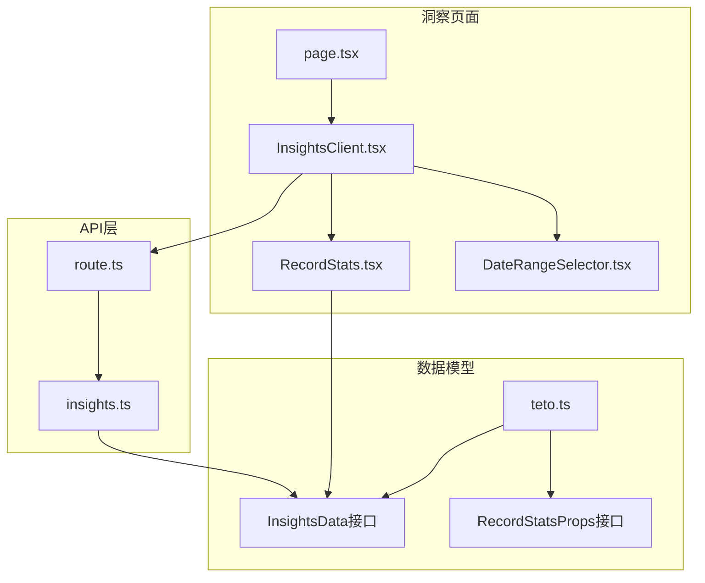
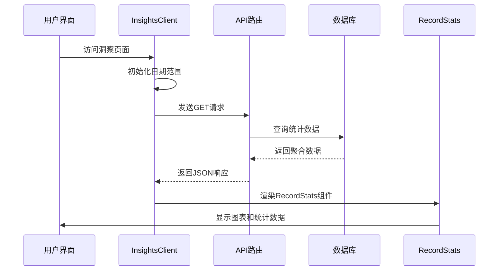
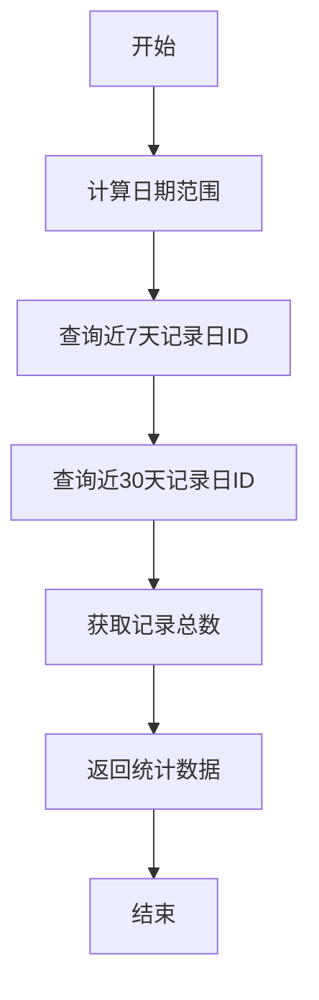
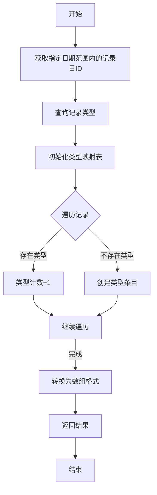
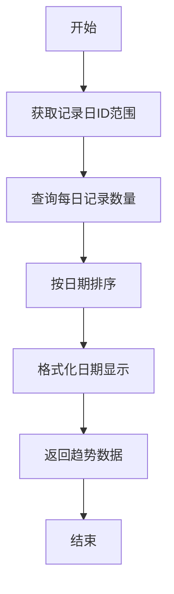
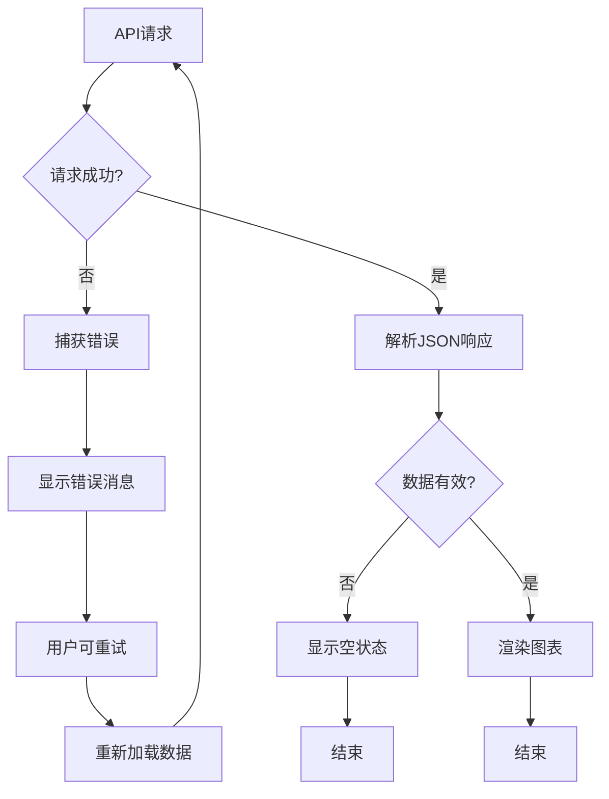
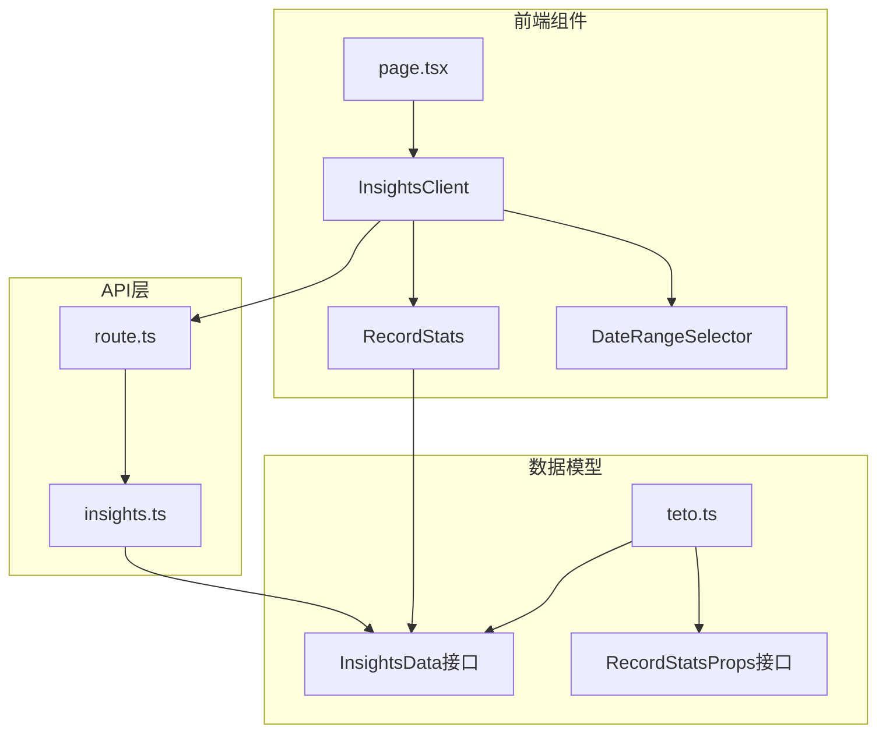

# 记录统计分析

<cite>
**本文档引用的文件**
- [RecordStats.tsx](file://src/app/(dashboard)/insights/components/RecordStats.tsx)
- [InsightsClient.tsx](file://src/app/(dashboard)/insights/InsightsClient.tsx)
- [route.ts](file://src/app/api/v2/insights/route.ts)
- [insights.ts](file://src/lib/db/insights.ts)
- [teto.ts](file://src/types/teto.ts)
- [DateRangeSelector.tsx](file://src/app/(dashboard)/insights/components/DateRangeSelector.tsx)
- [page.tsx](file://src/app/(dashboard)/insights/page.tsx)
</cite>

## 目录
1. [简介](#简介)
2. [项目结构](#项目结构)
3. [核心组件](#核心组件)
4. [架构概览](#架构概览)
5. [详细组件分析](#详细组件分析)
6. [依赖分析](#依赖分析)
7. [性能考虑](#性能考虑)
8. [故障排除指南](#故障排除指南)
9. [结论](#结论)

## 简介

TETO的记录统计分析功能是一个完整的数据分析系统，专注于为用户提供全面的记录活动洞察。该系统通过RecordStats组件提供直观的数据可视化，涵盖记录类型分布统计、时间趋势分析、记录质量评估指标等多个维度。

系统采用前后端分离架构，前端负责数据展示和用户交互，后端提供数据聚合和统计计算服务。通过RESTful API接口，前端可以灵活地获取不同时间范围内的统计数据，并实时更新可视化图表。

## 项目结构

记录统计分析功能主要分布在以下目录结构中：



**图表来源**
- [InsightsClient.tsx:1-149](file://src/app/(dashboard)/insights/InsightsClient.tsx#L1-L149)
- [RecordStats.tsx:1-125](file://src/app/(dashboard)/insights/components/RecordStats.tsx#L1-L125)
- [route.ts:1-32](file://src/app/api/v2/insights/route.ts#L1-L32)

**章节来源**
- [InsightsClient.tsx:1-149](file://src/app/(dashboard)/insights/InsightsClient.tsx#L1-L149)
- [RecordStats.tsx:1-125](file://src/app/(dashboard)/insights/components/RecordStats.tsx#L1-L125)
- [route.ts:1-32](file://src/app/api/v2/insights/route.ts#L1-L32)

## 核心组件

### RecordStats组件

RecordStats是记录统计分析的核心展示组件，负责将后端返回的统计数据转换为直观的可视化图表。

#### 主要功能特性

1. **数字卡片展示**：显示近7天和近30天的记录总数
2. **时间趋势图表**：展示每日记录数量的柱状图
3. **分类分布图表**：
   - 记录类型分布的饼图
   - 标签分布的水平柱状图

#### 数据结构

组件接收InsightsData接口中的record_overview部分作为输入，包含以下关键字段：
- `total_7d`: 近7天记录总数
- `total_30d`: 近30天记录总数
- `type_distribution`: 记录类型分布数组
- `tag_distribution`: 标签分布数组
- `daily_counts`: 每日记录数量数组

**章节来源**
- [RecordStats.tsx:19-40](file://src/app/(dashboard)/insights/components/RecordStats.tsx#L19-L40)
- [teto.ts:276-283](file://src/types/teto.ts#L276-L283)

### InsightsClient组件

InsightsClient是洞察页面的主控制器，负责管理数据获取、状态管理和用户交互。

#### 核心功能

1. **日期范围管理**：支持7天、30天、当月和自定义日期范围
2. **数据获取**：通过API调用获取统计数据
3. **错误处理**：提供友好的错误提示和重试机制
4. **加载状态**：显示加载指示器提升用户体验

**章节来源**
- [InsightsClient.tsx:39-149](file://src/app/(dashboard)/insights/InsightsClient.tsx#L39-L149)

## 架构概览

系统采用分层架构设计，确保了良好的可维护性和扩展性：



**图表来源**
- [InsightsClient.tsx:55-80](file://src/app/(dashboard)/insights/InsightsClient.tsx#L55-L80)
- [route.ts:6-23](file://src/app/api/v2/insights/route.ts#L6-L23)
- [insights.ts:14-345](file://src/lib/db/insights.ts#L14-L345)

## 详细组件分析

### 数据聚合算法

#### 1. 近期记录统计

系统通过两次独立查询计算近7天和近30天的记录总数：



**图表来源**
- [insights.ts:25-64](file://src/lib/db/insights.ts#L25-L64)

#### 2. 记录类型分布统计

类型分布统计采用哈希映射算法进行数据聚合：



**图表来源**
- [insights.ts:78-92](file://src/lib/db/insights.ts#L78-L92)

#### 3. 标签分布统计

标签统计通过多表关联查询实现：

```mermaid
flowchart TD
A[开始] --> B[获取记录日ID]
B --> C[获取记录ID]
C --> D[查询记录标签关联]
D --> E[连接标签表获取名称]
E --> F[初始化标签计数映射]
F --> G{遍历记录标签}
G --> H[F[标签计数+1]
H --> I[继续遍历]
I --> |完成| J[转换为数组格式]
J --> K[返回结果]
K --> L[结束]
```

**图表来源**
- [insights.ts:97-121](file://src/lib/db/insights.ts#L97-L121)

#### 4. 每日趋势分析

每日趋势统计通过记录日表的聚合查询实现：



**图表来源**
- [insights.ts:126-141](file://src/lib/db/insights.ts#L126-L141)

### 图表展示逻辑

#### Recharts集成

RecordStats组件集成了Recharts库，提供丰富的可视化选项：

1. **响应式容器**：自动适配不同屏幕尺寸
2. **交互式工具提示**：提供详细的数值信息
3. **颜色管理系统**：统一的色彩方案
4. **数据格式化**：智能的日期和数值格式化

#### 图表配置

每个图表都有特定的配置参数：

- **BarChart**：用于每日记录数趋势
- **PieChart**：用于记录类型分布
- **Horizontal Bar Chart**：用于标签分布

**章节来源**
- [RecordStats.tsx:65-121](file://src/app/(dashboard)/insights/components/RecordStats.tsx#L65-L121)

### 异常值检测机制

系统实现了多层次的异常值检测和处理机制：

#### 数据完整性检查

1. **空数据处理**：当统计数据为空时显示"暂无数据"提示
2. **边界条件处理**：处理日期范围重叠等边界情况
3. **类型验证**：确保数据类型符合预期

#### 错误处理流程



**图表来源**
- [InsightsClient.tsx:55-73](file://src/app/(dashboard)/insights/InsightsClient.tsx#L55-L73)

**章节来源**
- [InsightsClient.tsx:123-134](file://src/app/(dashboard)/insights/InsightsClient.tsx#L123-L134)

## 依赖分析

### 组件间依赖关系



**图表来源**
- [InsightsClient.tsx:6-12](file://src/app/(dashboard)/insights/InsightsClient.tsx#L6-L12)
- [route.ts:3](file://src/app/api/v2/insights/route.ts#L3)

### 外部依赖

系统依赖的关键外部库：

1. **Recharts**：数据可视化库
2. **Lucide React**：图标库
3. **Next.js**：React框架
4. **Supabase**：数据库访问层

**章节来源**
- [RecordStats.tsx:3-13](file://src/app/(dashboard)/insights/components/RecordStats.tsx#L3-L13)

## 性能考虑

### 缓存策略

系统采用了多级缓存机制来优化性能：

1. **客户端缓存**：InsightsClient组件维护数据状态，避免重复请求
2. **数据库查询优化**：使用索引和适当的WHERE条件
3. **批量查询**：减少数据库往返次数

### 性能优化建议

1. **虚拟滚动**：对于大量数据的场景，考虑实现虚拟滚动
2. **数据分页**：实现分页加载减少单次请求数据量
3. **图表懒加载**：延迟加载复杂的图表组件
4. **CDN加速**：静态资源使用CDN加速

### 用户体验设计

1. **加载状态**：提供明确的加载指示器
2. **错误恢复**：友好的错误提示和重试机制
3. **响应式设计**：适配不同设备屏幕
4. **交互反馈**：即时的用户操作反馈

## 故障排除指南

### 常见问题及解决方案

#### 1. 数据加载失败

**症状**：页面显示错误消息且无法加载数据

**解决方案**：
- 检查网络连接状态
- 验证API端点可用性
- 查看浏览器开发者工具中的错误信息

#### 2. 图表显示异常

**症状**：图表无法正常显示或显示空白

**解决方案**：
- 确认数据格式正确
- 检查Recharts库版本兼容性
- 验证容器尺寸设置

#### 3. 日期范围选择问题

**症状**：日期选择器行为异常

**解决方案**：
- 检查DateRangeSelector组件状态管理
- 验证日期格式转换逻辑
- 确认时区处理正确

**章节来源**
- [InsightsClient.tsx:123-134](file://src/app/(dashboard)/insights/InsightsClient.tsx#L123-L134)

## 结论

TETO的记录统计分析功能通过精心设计的架构和实现，为用户提供了全面而直观的数据洞察。RecordStats组件不仅展示了优秀的数据可视化能力，还体现了良好的用户体验设计原则。

系统的成功之处在于：

1. **模块化设计**：清晰的组件分离和职责划分
2. **数据驱动**：基于实际业务数据的统计分析
3. **用户体验**：直观的界面设计和流畅的交互体验
4. **可扩展性**：为未来功能扩展预留了良好的基础

通过持续的优化和改进，这个统计分析系统将成为TETO平台的重要组成部分，帮助用户更好地理解和改善他们的记录习惯。