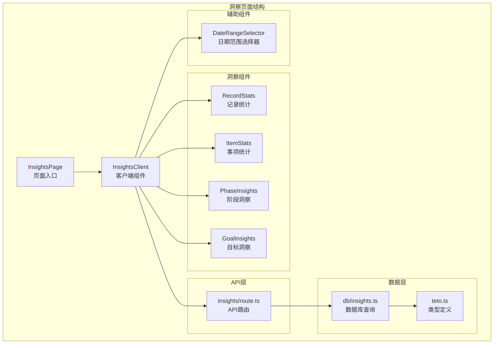
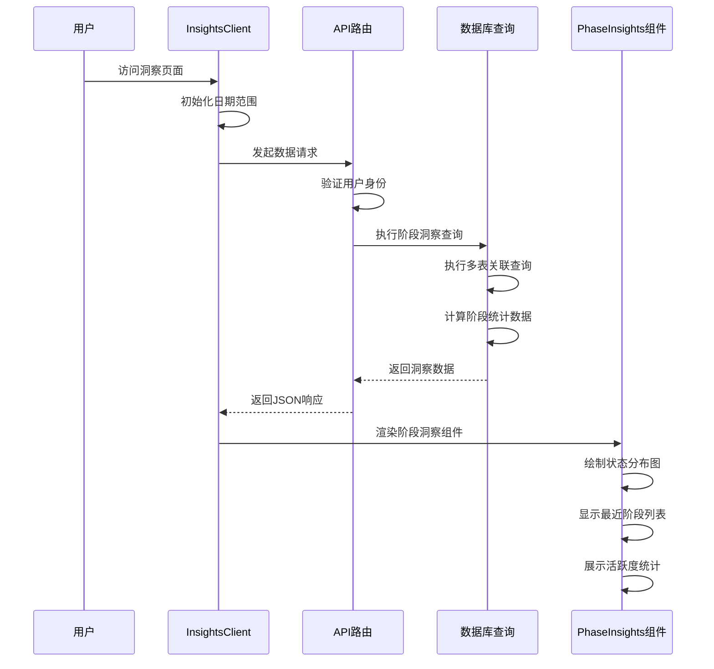
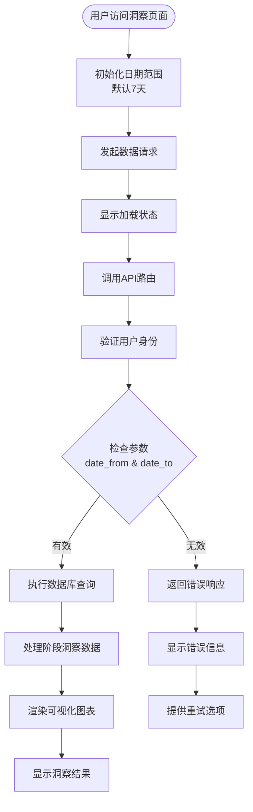
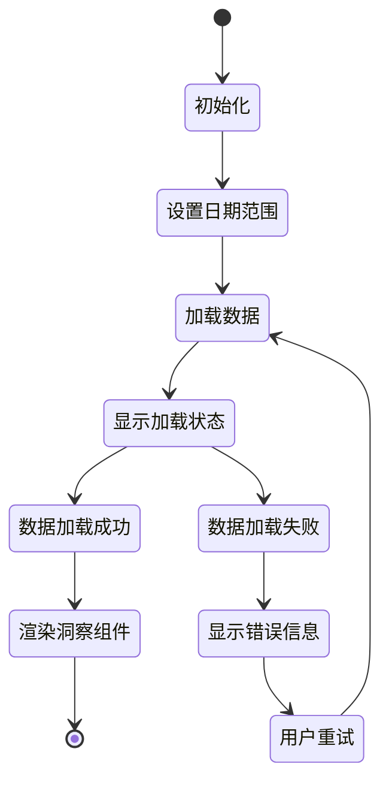
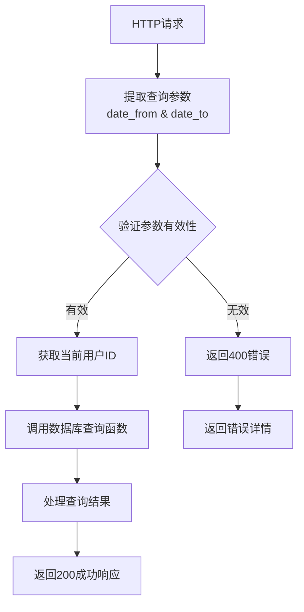
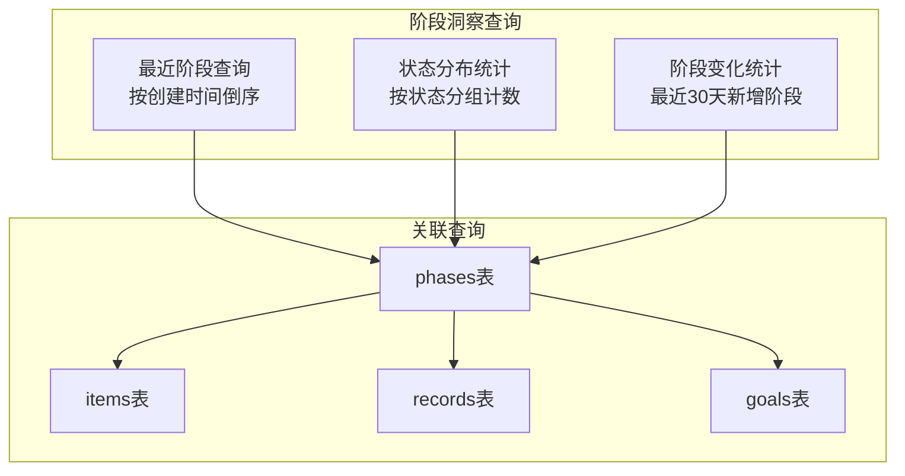
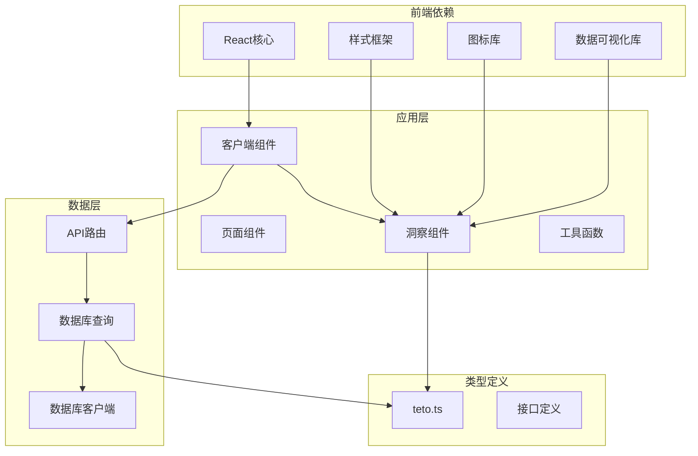

# 阶段洞察分析

<cite>
**本文引用的文件**
- [src/app/(dashboard)/insights/components/PhaseInsights.tsx](file://src/app/(dashboard)/insights/components/PhaseInsights.tsx)
- [src/app/(dashboard)/insights/InsightsClient.tsx](file://src/app/(dashboard)/insights/InsightsClient.tsx)
- [src/app/api/v2/insights/route.ts](file://src/app/api/v2/insights/route.ts)
- [src/lib/db/insights.ts](file://src/lib/db/insights.ts)
- [src/types/teto.ts](file://src/types/teto.ts)
- [src/app/(dashboard)/insights/components/DateRangeSelector.tsx](file://src/app/(dashboard)/insights/components/DateRangeSelector.tsx)
- [src/app/(dashboard)/insights/components/GoalInsights.tsx](file://src/app/(dashboard)/insights/components/GoalInsights.tsx)
- [src/app/(dashboard)/insights/components/ItemStats.tsx](file://src/app/(dashboard)/insights/components/ItemStats.tsx)
- [src/app/(dashboard)/insights/components/RecordStats.tsx](file://src/app/(dashboard)/insights/components/RecordStats.tsx)
</cite>

## 目录
1. [简介](#简介)
2. [项目结构](#项目结构)
3. [核心组件](#核心组件)
4. [架构概览](#架构概览)
5. [详细组件分析](#详细组件分析)
6. [依赖分析](#依赖分析)
7. [性能考虑](#性能考虑)
8. [故障排除指南](#故障排除指南)
9. [结论](#结论)
10. [附录](#附录)

## 简介

TETO项目的阶段洞察分析功能是一个综合性的数据分析模块，专注于帮助用户理解和优化项目管理过程中的阶段转换和执行效率。该功能通过可视化的方式展示阶段状态分布、近期创建的阶段、以及阶段变化活跃度等关键指标，为用户提供全面的阶段健康度评估和优化建议。

本功能基于React客户端组件构建，采用现代化的数据可视化技术，结合后端API服务和数据库查询逻辑，实现了实时的阶段洞察分析能力。系统支持灵活的时间范围选择，能够动态更新阶段统计数据，并提供直观的图表展示。

## 项目结构

阶段洞察分析功能位于应用的仪表板区域，采用模块化的设计模式：



**图表来源**
- [src/app/(dashboard)/insights/page.tsx:1-6](file://src/app/(dashboard)/insights/page.tsx#L1-L6)
- [src/app/(dashboard)/insights/InsightsClient.tsx:1-149](file://src/app/(dashboard)/insights/InsightsClient.tsx#L1-L149)
- [src/app/api/v2/insights/route.ts:1-32](file://src/app/api/v2/insights/route.ts#L1-L32)

**章节来源**
- [src/app/(dashboard)/insights/page.tsx:1-6](file://src/app/(dashboard)/insights/page.tsx#L1-L6)
- [src/app/(dashboard)/insights/InsightsClient.tsx:1-149](file://src/app/(dashboard)/insights/InsightsClient.tsx#L1-L149)

## 核心组件

阶段洞察分析功能由多个专门的组件构成，每个组件负责特定的分析维度：

### 主要组件职责

1. **PhaseInsights组件** - 阶段状态分析的核心组件
   - 展示阶段状态分布饼图
   - 显示最近创建的阶段列表
   - 提供阶段变化活跃度统计

2. **InsightsClient组件** - 客户端控制中心
   - 管理日期范围选择
   - 处理数据加载和错误状态
   - 协调各个洞察组件的数据流

3. **API路由** - 后端数据接口
   - 验证用户身份
   - 处理日期范围查询参数
   - 调用数据库查询逻辑

4. **数据库查询** - 数据处理核心
   - 执行复杂的多表关联查询
   - 计算阶段状态分布
   - 统计阶段变化活跃度

**章节来源**
- [src/app/(dashboard)/insights/components/PhaseInsights.tsx:1-139](file://src/app/(dashboard)/insights/components/PhaseInsights.tsx#L1-L139)
- [src/app/(dashboard)/insights/InsightsClient.tsx:1-149](file://src/app/(dashboard)/insights/InsightsClient.tsx#L1-L149)
- [src/app/api/v2/insights/route.ts:1-32](file://src/app/api/v2/insights/route.ts#L1-L32)
- [src/lib/db/insights.ts:1-346](file://src/lib/db/insights.ts#L1-L346)

## 架构概览

阶段洞察分析功能采用分层架构设计，确保了良好的可维护性和扩展性：



**图表来源**
- [src/app/(dashboard)/insights/InsightsClient.tsx:55-80](file://src/app/(dashboard)/insights/InsightsClient.tsx#L55-L80)
- [src/app/api/v2/insights/route.ts:6-23](file://src/app/api/v2/insights/route.ts#L6-L23)
- [src/lib/db/insights.ts:214-260](file://src/lib/db/insights.ts#L214-L260)

### 数据流架构

系统采用异步数据流设计，确保了良好的用户体验：



**图表来源**
- [src/app/(dashboard)/insights/InsightsClient.tsx:39-80](file://src/app/(dashboard)/insights/InsightsClient.tsx#L39-L80)
- [src/app/api/v2/insights/route.ts:6-31](file://src/app/api/v2/insights/route.ts#L6-L31)

## 详细组件分析

### PhaseInsights组件深度分析

PhaseInsights组件是阶段洞察分析的核心，提供了三个主要的分析维度：

#### 组件结构分析

```mermaid
classDiagram
class PhaseInsights {
+data : InsightsData['phaseInsights']
+formatDate(dateStr) string
+render() JSX.Element
}
class PhaseInsightsProps {
+data : InsightsData['phaseInsights']
}
class PhaseStatus {
<<enumeration>>
"进行中"
"已结束"
"停滞"
}
class Phase {
+id : string
+title : string
+status : PhaseStatus
+created_at : string
}
PhaseInsights --> PhaseInsightsProps : 接收
PhaseInsightsProps --> Phase : 包含
Phase --> PhaseStatus : 使用
```

**图表来源**
- [src/app/(dashboard)/insights/components/PhaseInsights.tsx:23-25](file://src/app/(dashboard)/insights/components/PhaseInsights.tsx#L23-L25)
- [src/types/teto.ts:308-309](file://src/types/teto.ts#L308-L309)

#### 阶段状态分布分析

组件使用饼图展示阶段状态的分布情况，支持三种核心状态：
- **进行中**: 当前活跃的阶段
- **已结束**: 已完成的阶段  
- **停滞**: 处于停滞状态的阶段

每个状态都有对应的颜色标识和中文标签，便于用户理解。

#### 最近阶段列表

组件显示最近创建的阶段，采用简洁的列表形式：
- 圆点指示阶段状态（颜色编码）
- 阶段标题（支持截断显示）
- 创建日期格式化显示

#### 阶段变化活跃度统计

组件统计近期（最近30天）新增阶段最多的事项：
- 按阶段数量排序
- 显示事项标题
- 展示新增阶段数量

**章节来源**
- [src/app/(dashboard)/insights/components/PhaseInsights.tsx:1-139](file://src/app/(dashboard)/insights/components/PhaseInsights.tsx#L1-L139)

### InsightsClient组件分析

InsightsClient组件作为客户端控制中心，负责整个洞察页面的状态管理和数据协调：

#### 状态管理机制



**图表来源**
- [src/app/(dashboard)/insights/InsightsClient.tsx:39-80](file://src/app/(dashboard)/insights/InsightsClient.tsx#L39-L80)

#### 日期范围管理

组件支持多种预设的时间范围：
- **7天**: 最近7天的数据
- **30天**: 最近30天的数据  
- **本月**: 当前月份的数据
- **自定义**: 用户指定的具体日期范围

#### 错误处理机制

组件实现了完善的错误处理：
- 网络请求失败处理
- 数据格式错误处理
- 用户友好的错误提示
- 自动重试功能

**章节来源**
- [src/app/(dashboard)/insights/InsightsClient.tsx:1-149](file://src/app/(dashboard)/insights/InsightsClient.tsx#L1-L149)

### API路由设计

API路由层负责处理前端请求并返回标准化的数据格式：

#### 请求处理流程



**图表来源**
- [src/app/api/v2/insights/route.ts:6-31](file://src/app/api/v2/insights/route.ts#L6-L31)

#### 错误处理策略

API路由实现了分层的错误处理：
- 参数验证错误（400状态码）
- 身份验证失败（401状态码）
- 服务器内部错误（500状态码）

**章节来源**
- [src/app/api/v2/insights/route.ts:1-32](file://src/app/api/v2/insights/route.ts#L1-L32)

### 数据库查询逻辑

数据库查询模块是整个洞察功能的核心，负责从多个表中提取和计算阶段相关的统计数据：

#### 查询架构设计



**图表来源**
- [src/lib/db/insights.ts:214-260](file://src/lib/db/insights.ts#L214-L260)

#### 关键查询策略

1. **最近阶段查询**: 限制返回5个最近创建的阶段
2. **状态分布统计**: 对所有阶段按状态进行分组计数
3. **活跃度统计**: 统计最近30天内新增阶段最多的事项

#### 性能优化措施

- 使用索引优化常用查询条件
- 实施分页和限制返回数量
- 缓存常用的统计数据
- 优化复杂关联查询

**章节来源**
- [src/lib/db/insights.ts:1-346](file://src/lib/db/insights.ts#L1-L346)

## 依赖分析

阶段洞察分析功能的依赖关系清晰明确，遵循了模块化设计原则：



**图表来源**
- [src/app/(dashboard)/insights/components/PhaseInsights.tsx:3-5](file://src/app/(dashboard)/insights/components/PhaseInsights.tsx#L3-L5)
- [src/app/(dashboard)/insights/InsightsClient.tsx:3-12](file://src/app/(dashboard)/insights/InsightsClient.tsx#L3-L12)

### 组件间耦合关系

- **低耦合高内聚**: 每个洞察组件独立负责特定功能
- **单向数据流**: 父组件向子组件传递数据，子组件不直接修改父组件状态
- **类型安全**: 全面使用TypeScript类型定义确保类型安全

### 外部依赖管理

- **数据可视化**: 使用Recharts库提供丰富的图表功能
- **UI组件**: 基于TailwindCSS的原子化样式系统
- **图标系统**: Lucide React图标库提供一致的视觉语言
- **状态管理**: React内置的useState和useEffect钩子

**章节来源**
- [src/types/teto.ts:275-299](file://src/types/teto.ts#L275-L299)

## 性能考虑

阶段洞察分析功能在设计时充分考虑了性能优化：

### 数据加载优化

1. **懒加载策略**: 组件按需加载，避免不必要的资源消耗
2. **缓存机制**: 支持浏览器缓存和应用级缓存
3. **分页处理**: 限制单次查询返回的数据量
4. **并发优化**: 合理安排API请求的并发执行

### 图表渲染优化

1. **响应式容器**: 使用ResponsiveContainer确保图表自适应
2. **虚拟滚动**: 对长列表采用虚拟滚动技术
3. **增量更新**: 只更新发生变化的数据部分
4. **内存管理**: 及时清理不再使用的图表实例

### 网络请求优化

1. **请求去重**: 避免重复发送相同的请求
2. **超时控制**: 设置合理的请求超时时间
3. **错误重试**: 实现智能的错误重试机制
4. **连接复用**: 复用HTTP连接减少开销

## 故障排除指南

### 常见问题及解决方案

#### 数据加载失败

**症状**: 页面显示"加载失败"错误信息

**可能原因**:
- 网络连接问题
- API服务不可用
- 用户身份验证失败

**解决步骤**:
1. 检查网络连接状态
2. 刷新页面重试
3. 确认用户登录状态
4. 查看浏览器开发者工具中的错误信息

#### 图表显示异常

**症状**: 图表无法正常显示或显示空白

**可能原因**:
- 数据格式不符合预期
- 图表容器尺寸问题
- 浏览器兼容性问题

**解决步骤**:
1. 检查数据结构是否完整
2. 确认图表容器具有明确的尺寸
3. 尝试在不同浏览器中打开
4. 检查是否有JavaScript错误

#### 日期范围选择问题

**症状**: 日期范围选择器无法正常工作

**可能原因**:
- 日期格式不正确
- 日期范围逻辑错误
- 浏览器日期本地化问题

**解决步骤**:
1. 确认日期格式符合YYYY-MM-DD
2. 检查开始日期不能晚于结束日期
3. 验证浏览器日期本地化设置
4. 清除浏览器缓存后重试

**章节来源**
- [src/app/(dashboard)/insights/InsightsClient.tsx:123-134](file://src/app/(dashboard)/insights/InsightsClient.tsx#L123-L134)

## 结论

TETO项目的阶段洞察分析功能通过精心设计的架构和实现，为用户提供了全面的阶段管理分析能力。该功能具有以下优势：

### 技术优势

1. **模块化设计**: 组件职责清晰，易于维护和扩展
2. **类型安全**: 全面的TypeScript类型定义确保代码质量
3. **性能优化**: 合理的查询策略和缓存机制保证响应速度
4. **用户体验**: 直观的可视化界面和流畅的交互体验

### 功能特色

1. **多维度分析**: 同时提供阶段状态、活跃度、趋势等多角度分析
2. **实时更新**: 支持灵活的日期范围选择和动态数据刷新
3. **智能提醒**: 通过颜色编码和图标直观展示状态信息
4. **扩展性强**: 模块化的架构便于添加新的分析维度

### 应用价值

该功能不仅帮助用户更好地理解项目进展状况，还为制定优化策略提供了数据支撑。通过阶段洞察分析，用户可以：
- 及时发现项目执行中的问题
- 识别高价值的改进机会
- 制定更有效的项目管理策略
- 提升整体工作效率

## 附录

### 使用示例

#### 基本使用方法

要在项目中使用PhaseInsights组件，可以按照以下步骤操作：

1. **导入组件**:
   ```typescript
   import PhaseInsights from '@/app/(dashboard)/insights/components/PhaseInsights'
   ```

2. **准备数据**:
   ```typescript
   const phaseInsightsData = {
     recentPhases: [...],
     statusDistribution: [...],
     itemsWithPhaseChanges: [...]
   }
   ```

3. **渲染组件**:
   ```typescript
   <PhaseInsights data={phaseInsightsData} />
   ```

#### 高级配置选项

组件支持以下配置选项：
- **自定义颜色主题**: 通过CSS变量调整图表颜色
- **尺寸适配**: 支持响应式布局自动调整
- **交互功能**: 支持鼠标悬停和点击事件
- **国际化支持**: 支持多语言文本显示

### 最佳实践

1. **数据完整性**: 确保传入的数据包含所有必需字段
2. **错误处理**: 实现适当的错误边界和降级策略
3. **性能监控**: 监控组件的渲染性能和内存使用
4. **用户体验**: 提供清晰的加载状态和错误提示

### 扩展建议

1. **增加更多分析维度**: 如阶段转换效率、瓶颈识别等
2. **增强可视化效果**: 添加更多图表类型和交互功能
3. **集成AI分析**: 利用机器学习算法提供智能建议
4. **移动端优化**: 改进移动设备上的显示效果