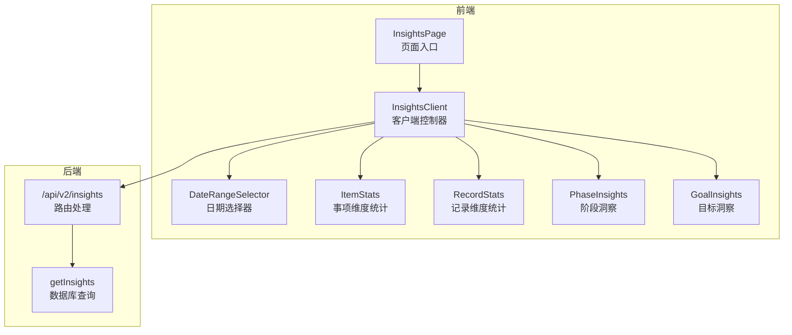
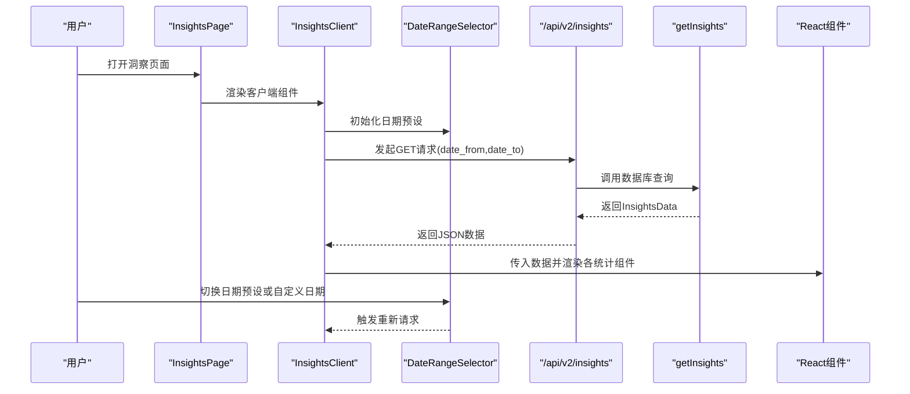
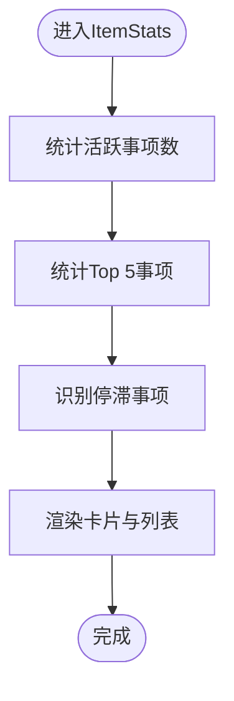
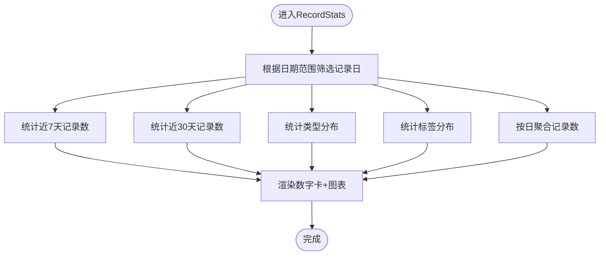
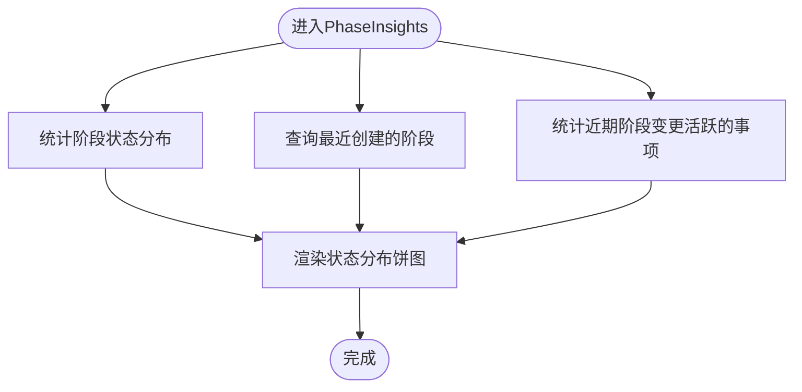
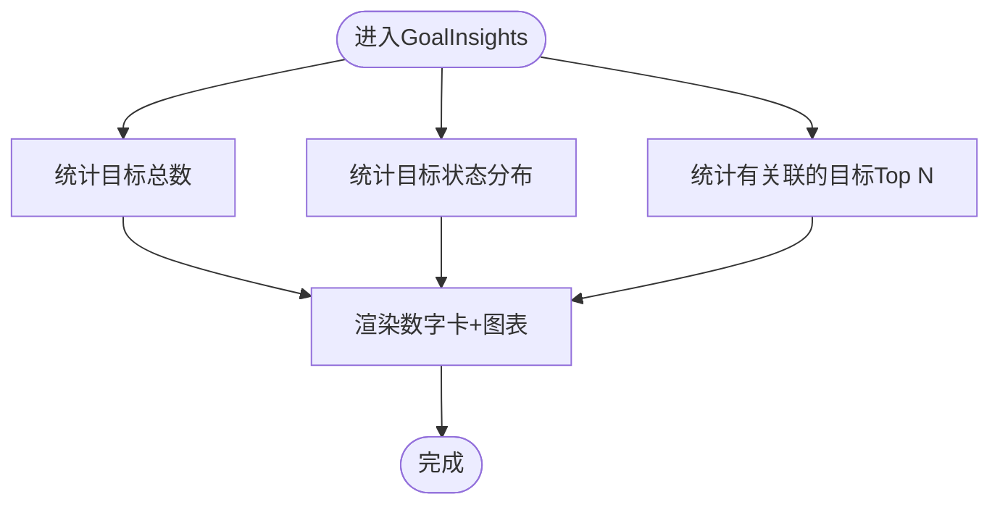
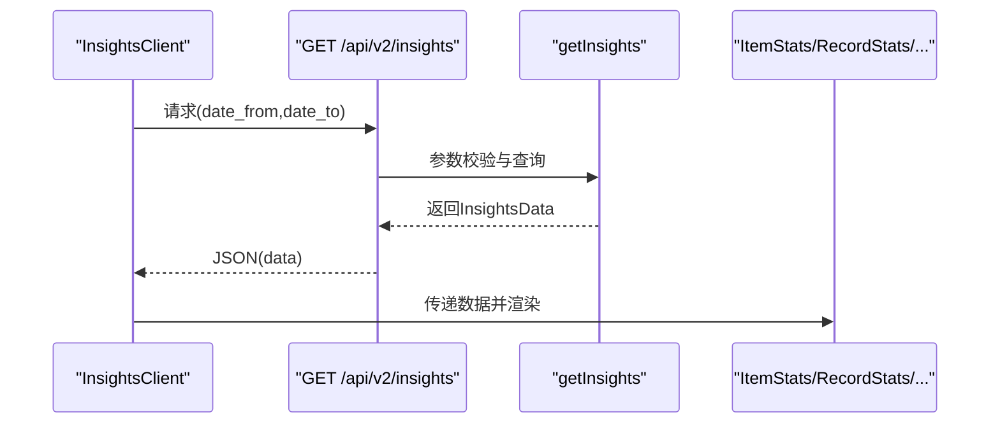
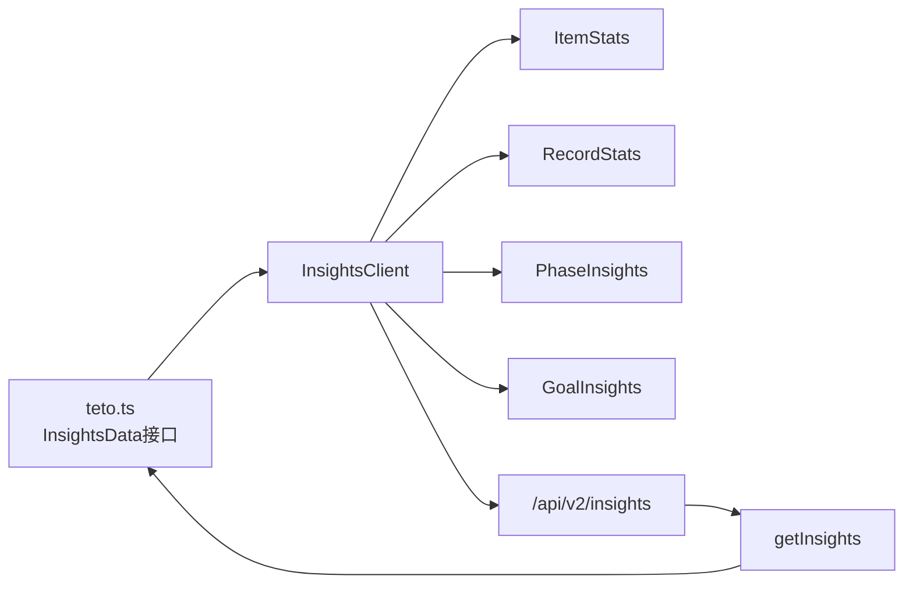

# 项目统计分析

<cite>
**本文引用的文件**
- [ItemStats.tsx](file://src/app/(dashboard)/insights/components/ItemStats.tsx)
- [InsightsClient.tsx](file://src/app/(dashboard)/insights/InsightsClient.tsx)
- [route.ts](file://src/app/api/v2/insights/route.ts)
- [insights.ts](file://src/lib/db/insights.ts)
- [RecordStats.tsx](file://src/app/(dashboard)/insights/components/RecordStats.tsx)
- [GoalInsights.tsx](file://src/app/(dashboard)/insights/components/GoalInsights.tsx)
- [PhaseInsights.tsx](file://src/app/(dashboard)/insights/components/PhaseInsights.tsx)
- [teto.ts](file://src/types/teto.ts)
- [DateRangeSelector.tsx](file://src/app/(dashboard)/insights/components/DateRangeSelector.tsx)
- [page.tsx](file://src/app/(dashboard)/insights/page.tsx)
</cite>

## 目录
1. [简介](#简介)
2. [项目结构](#项目结构)
3. [核心组件](#核心组件)
4. [架构总览](#架构总览)
5. [详细组件分析](#详细组件分析)
6. [依赖分析](#依赖分析)
7. [性能考虑](#性能考虑)
8. [故障排查指南](#故障排查指南)
9. [结论](#结论)
10. [附录](#附录)

## 简介
本文件面向TETO项目的“统计分析”功能，聚焦于ItemStats组件及其周边洞察模块，系统性阐述以下能力与实现：
- 项目完成情况统计：活跃事项数、Top事项、停滞事项识别
- 目标达成率分析：目标状态分布、目标关联统计
- 项目生命周期追踪：阶段状态分布、近期阶段、阶段变更活跃度
- 时间轴分析算法：近7/30天记录趋势、每日记录数折线图
- 项目健康度评估与风险预警：基于“最近记录时间”的停滞风险识别
- 数据聚合策略、图表交互设计与性能优化建议

## 项目结构
洞察页面由客户端组件驱动，通过API路由调用后端数据库查询，最终渲染多维度统计卡片与图表。

**图表来源**
- [page.tsx](file://src/app/(dashboard)/insights/page.tsx#L1-L6)
- [InsightsClient.tsx](file://src/app/(dashboard)/insights/InsightsClient.tsx#L1-L149)
- [DateRangeSelector.tsx](file://src/app/(dashboard)/insights/components/DateRangeSelector.tsx#L1-L65)
- [ItemStats.tsx](file://src/app/(dashboard)/insights/components/ItemStats.tsx#L1-L111)
- [RecordStats.tsx](file://src/app/(dashboard)/insights/components/RecordStats.tsx#L1-L125)
- [PhaseInsights.tsx](file://src/app/(dashboard)/insights/components/PhaseInsights.tsx#L1-L139)
- [GoalInsights.tsx](file://src/app/(dashboard)/insights/components/GoalInsights.tsx#L1-L143)
- [route.ts:1-32](file://src/app/api/v2/insights/route.ts#L1-L32)
- [insights.ts:1-346](file://src/lib/db/insights.ts#L1-L346)

**章节来源**
- [page.tsx](file://src/app/(dashboard)/insights/page.tsx#L1-L6)
- [InsightsClient.tsx](file://src/app/(dashboard)/insights/InsightsClient.tsx#L1-L149)
- [route.ts:1-32](file://src/app/api/v2/insights/route.ts#L1-L32)
- [insights.ts:1-346](file://src/lib/db/insights.ts#L1-L346)

## 核心组件
- ItemStats：展示“当前活跃事项数”“Top 5事项”“停滞事项”三大指标，支持按日期范围切换。
- RecordStats：展示“近7/30天记录数”“每日记录趋势”“类型分布饼图”“标签分布柱状图”。
- PhaseInsights：展示“阶段状态分布”“最近创建的阶段”“近期阶段变更活跃的事项”。
- GoalInsights：展示“目标总数”“目标状态分布”“有关联的前N目标”。

这些组件共同构成“洞察”页面的统计视图，数据来源于统一的getInsights查询。

**章节来源**
- [ItemStats.tsx](file://src/app/(dashboard)/insights/components/ItemStats.tsx#L1-L111)
- [RecordStats.tsx](file://src/app/(dashboard)/insights/components/RecordStats.tsx#L1-L125)
- [PhaseInsights.tsx](file://src/app/(dashboard)/insights/components/PhaseInsights.tsx#L1-L139)
- [GoalInsights.tsx](file://src/app/(dashboard)/insights/components/GoalInsights.tsx#L1-L143)

## 架构总览
下图展示了从页面到API再到数据库查询的整体流程，以及数据在前端的渲染路径。

**图表来源**
- [page.tsx](file://src/app/(dashboard)/insights/page.tsx#L1-L6)
- [InsightsClient.tsx](file://src/app/(dashboard)/insights/InsightsClient.tsx#L1-L149)
- [DateRangeSelector.tsx](file://src/app/(dashboard)/insights/components/DateRangeSelector.tsx#L1-L65)
- [route.ts:1-32](file://src/app/api/v2/insights/route.ts#L1-L32)
- [insights.ts:1-346](file://src/lib/db/insights.ts#L1-L346)

## 详细组件分析

### ItemStats组件分析
ItemStats负责“事项维度统计”，包含三个核心指标：
- 当前活跃事项数：筛选状态为“活跃/推进中”的事项计数
- Top 5事项：统计指定日期范围内，绑定到事项的记录数，取前5
- 停滞事项：对“活跃/推进中”的事项，若最近记录时间早于阈值，则标记为停滞

**图表来源**
- [ItemStats.tsx](file://src/app/(dashboard)/insights/components/ItemStats.tsx#L1-L111)
- [insights.ts:146-211](file://src/lib/db/insights.ts#L146-L211)

**章节来源**
- [ItemStats.tsx](file://src/app/(dashboard)/insights/components/ItemStats.tsx#L1-L111)
- [insights.ts:146-211](file://src/lib/db/insights.ts#L146-L211)

### RecordStats组件分析
RecordStats负责“记录维度统计”，包含：
- 近7/30天记录数：通过记录日表过滤日期范围并计数
- 每日记录数趋势：按日期聚合记录数，生成折线图数据
- 类型分布饼图：统计记录类型占比
- 标签分布柱状图：统计标签出现频次

**图表来源**
- [RecordStats.tsx](file://src/app/(dashboard)/insights/components/RecordStats.tsx#L1-L125)
- [insights.ts:34-141](file://src/lib/db/insights.ts#L34-L141)

**章节来源**
- [RecordStats.tsx](file://src/app/(dashboard)/insights/components/RecordStats.tsx#L1-L125)
- [insights.ts:34-141](file://src/lib/db/insights.ts#L34-L141)

### PhaseInsights组件分析
PhaseInsights负责“阶段洞察”，包含：
- 阶段状态分布：统计“进行中/已结束/停滞”的数量与占比
- 最近创建的阶段：按创建时间倒序取前若干
- 近期阶段变更活跃的事项：统计最近30天内新增阶段次数最多的事项Top N

**图表来源**
- [PhaseInsights.tsx](file://src/app/(dashboard)/insights/components/PhaseInsights.tsx#L1-L139)
- [insights.ts:217-259](file://src/lib/db/insights.ts#L217-L259)

**章节来源**
- [PhaseInsights.tsx](file://src/app/(dashboard)/insights/components/PhaseInsights.tsx#L1-L139)
- [insights.ts:217-259](file://src/lib/db/insights.ts#L217-L259)

### GoalInsights组件分析
GoalInsights负责“目标洞察”，包含：
- 目标总数：统计用户目标数量
- 目标状态分布：统计“进行中/已达成/已放弃/已暂停”的数量与占比
- 有关联的目标：统计与“事项/记录”存在关联的目标，并展示Top N

**图表来源**
- [GoalInsights.tsx](file://src/app/(dashboard)/insights/components/GoalInsights.tsx#L1-L143)
- [insights.ts:265-319](file://src/lib/db/insights.ts#L265-L319)

**章节来源**
- [GoalInsights.tsx](file://src/app/(dashboard)/insights/components/GoalInsights.tsx#L1-L143)
- [insights.ts:265-319](file://src/lib/db/insights.ts#L265-L319)

### API与数据流
- 客户端通过InsightsClient发起请求，携带date_from与date_to
- 路由层校验参数并调用getInsights
- getInsights执行多处SQL聚合，返回统一的InsightsData结构
- 前端组件接收数据并渲染

**图表来源**
- [InsightsClient.tsx](file://src/app/(dashboard)/insights/InsightsClient.tsx#L55-L80)
- [route.ts:6-31](file://src/app/api/v2/insights/route.ts#L6-L31)
- [insights.ts:14-345](file://src/lib/db/insights.ts#L14-L345)

**章节来源**
- [InsightsClient.tsx](file://src/app/(dashboard)/insights/InsightsClient.tsx#L1-L149)
- [route.ts:1-32](file://src/app/api/v2/insights/route.ts#L1-L32)
- [insights.ts:1-346](file://src/lib/db/insights.ts#L1-L346)

## 依赖分析
- 组件间依赖：InsightsClient作为容器，组合多个统计组件；DateRangeSelector提供日期输入与预设切换。
- 类型依赖：InsightsData接口定义了所有统计模块的数据契约，确保前后端一致。
- 数据依赖：getInsights是唯一数据源，被API路由与客户端共享。

**图表来源**
- [teto.ts:275-299](file://src/types/teto.ts#L275-L299)
- [InsightsClient.tsx](file://src/app/(dashboard)/insights/InsightsClient.tsx#L1-L149)
- [ItemStats.tsx](file://src/app/(dashboard)/insights/components/ItemStats.tsx#L1-L111)
- [RecordStats.tsx](file://src/app/(dashboard)/insights/components/RecordStats.tsx#L1-L125)
- [PhaseInsights.tsx](file://src/app/(dashboard)/insights/components/PhaseInsights.tsx#L1-L139)
- [GoalInsights.tsx](file://src/app/(dashboard)/insights/components/GoalInsights.tsx#L1-L143)
- [route.ts:1-32](file://src/app/api/v2/insights/route.ts#L1-L32)
- [insights.ts:1-346](file://src/lib/db/insights.ts#L1-L346)

**章节来源**
- [teto.ts:275-299](file://src/types/teto.ts#L275-L299)
- [InsightsClient.tsx](file://src/app/(dashboard)/insights/InsightsClient.tsx#L1-L149)
- [insights.ts:1-346](file://src/lib/db/insights.ts#L1-L346)

## 性能考虑
- 查询优化
  - 使用“记录日表”作为时间范围过滤的锚点，减少全量记录扫描
  - 对活跃事项的最近记录查询采用单次排序+去重策略，避免多次往返
  - 类型/标签/阶段/目标的聚合使用Map计数，时间复杂度O(n)
- 前端优化
  - 使用useCallback缓存fetch函数，避免不必要的重渲染
  - 日期选择器仅在必要时触发请求，减少网络请求频率
- 图表优化
  - 使用ResponsiveContainer适配不同屏幕尺寸，避免强制重排
  - 饼图/柱状图仅在有数据时渲染，空状态显示占位文本
- 缓存与分页
  - 当前实现未引入客户端缓存；可在相同日期范围内复用上次结果以降低请求成本

[本节为通用性能建议，不直接分析具体文件，故无“章节来源”]

## 故障排查指南
- 请求失败
  - 检查date_from与date_to是否为空；确认路由参数解析
  - 查看服务端返回的错误信息，区分认证失败与服务器错误
- 数据异常
  - 核对getInsights中的日期边界与状态过滤条件
  - 确认活跃/停滞判定阈值与最近记录时间的比较逻辑
- 图表空白
  - 检查对应数据字段是否存在（如type_distribution/tag_distribution/daily_counts）
  - 确认组件在空数据时的占位渲染逻辑

**章节来源**
- [route.ts:14-31](file://src/app/api/v2/insights/route.ts#L14-L31)
- [insights.ts:178-211](file://src/lib/db/insights.ts#L178-L211)
- [RecordStats.tsx](file://src/app/(dashboard)/insights/components/RecordStats.tsx#L80-L120)
- [GoalInsights.tsx](file://src/app/(dashboard)/insights/components/GoalInsights.tsx#L73-L103)
- [PhaseInsights.tsx](file://src/app/(dashboard)/insights/components/PhaseInsights.tsx#L48-L78)

## 结论
ItemStats与周边组件共同构建了TETO项目的统计分析体系，覆盖记录趋势、事项活跃度、阶段与目标状态等关键维度。通过统一的InsightsData接口与getInsights查询，实现了高内聚、低耦合的数据层设计。建议在现有基础上进一步引入客户端缓存与更细粒度的指标（如里程碑达成率、健康度评分），以增强长期使用体验与决策支持能力。

[本节为总结性内容，不直接分析具体文件，故无“章节来源”]

## 附录

### 数据聚合策略摘要
- 近7/30天记录数：以记录日表为时间锚，按日期范围计数
- 类型/标签分布：对记录进行聚合统计，使用Map计数
- 每日趋势：按日聚合记录数，保证连续日期序列
- 活跃事项与Top事项：对活跃状态事项进行计数与排序
- 停滞事项：以最近记录时间为阈值判断
- 阶段洞察：状态分布、最近创建、近期变更活跃度
- 目标洞察：状态分布、目标总数、有关联的目标

**章节来源**
- [insights.ts:24-211](file://src/lib/db/insights.ts#L24-L211)
- [insights.ts:217-319](file://src/lib/db/insights.ts#L217-L319)

### 图表交互设计要点
- 数字卡片：简洁展示关键指标，便于快速浏览
- 饼图/柱状图：提供比例与数量的直观对比
- 列表：展示Top N与停滞事项，支持快速定位
- 占位文案：空数据时提供友好提示，避免空白

**章节来源**
- [RecordStats.tsx](file://src/app/(dashboard)/insights/components/RecordStats.tsx#L1-L125)
- [GoalInsights.tsx](file://src/app/(dashboard)/insights/components/GoalInsights.tsx#L1-L143)
- [PhaseInsights.tsx](file://src/app/(dashboard)/insights/components/PhaseInsights.tsx#L1-L139)
- [ItemStats.tsx](file://src/app/(dashboard)/insights/components/ItemStats.tsx#L1-L111)