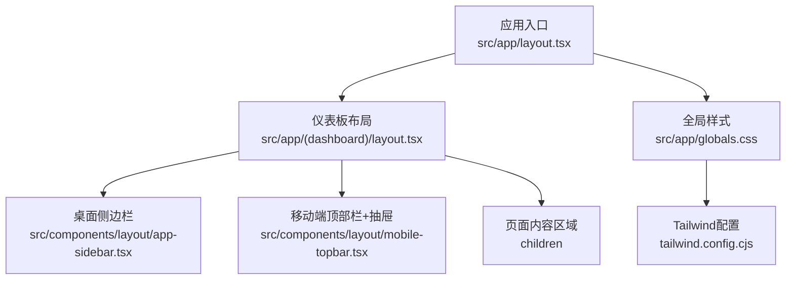
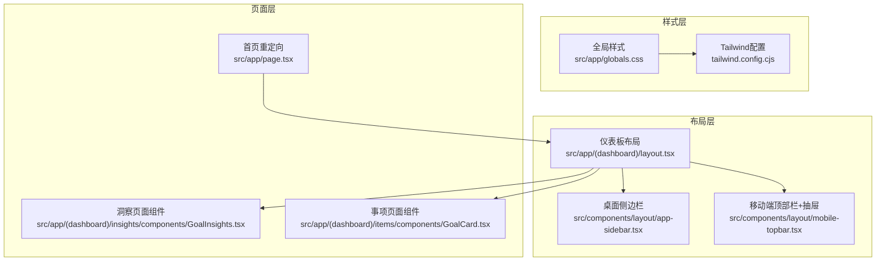
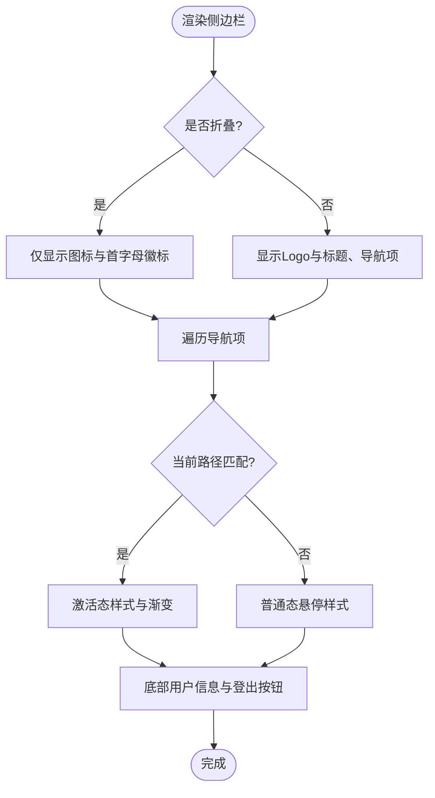
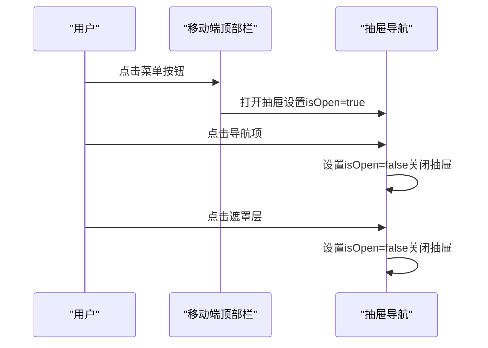
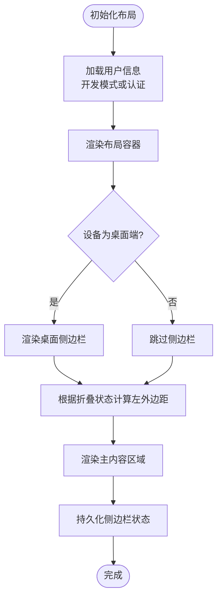
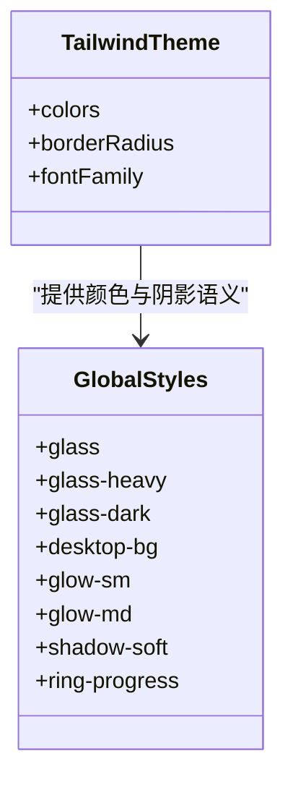
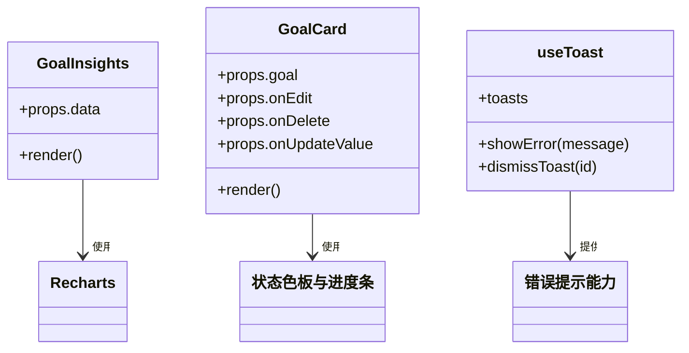
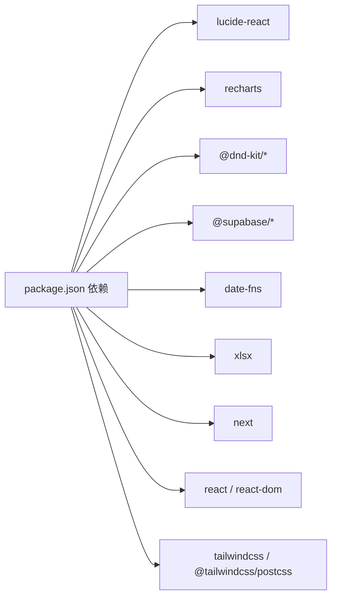

# 用户界面系统

<cite>
**本文引用的文件**
- [src/components/layout/app-sidebar.tsx](file://src/components/layout/app-sidebar.tsx)
- [src/components/layout/mobile-topbar.tsx](file://src/components/layout/mobile-topbar.tsx)
- [src/app/(dashboard)/layout.tsx](file://src/app/(dashboard)/layout.tsx)
- [src/app/layout.tsx](file://src/app/layout.tsx)
- [src/app/globals.css](file://src/app/globals.css)
- [tailwind.config.cjs](file://tailwind.config.cjs)
- [src/components/ui/use-toast.tsx](file://src/components/ui/use-toast.tsx)
- [src/app/page.tsx](file://src/app/page.tsx)
- [src/app/(dashboard)/insights/components/GoalInsights.tsx](file://src/app/(dashboard)/insights/components/GoalInsights.tsx)
- [src/app/(dashboard)/items/components/GoalCard.tsx](file://src/app/(dashboard)/items/components/GoalCard.tsx)
- [package.json](file://package.json)
</cite>

## 目录
1. [简介](#简介)
2. [项目结构](#项目结构)
3. [核心组件](#核心组件)
4. [架构总览](#架构总览)
5. [详细组件分析](#详细组件分析)
6. [依赖关系分析](#依赖关系分析)
7. [性能考量](#性能考量)
8. [故障排查指南](#故障排查指南)
9. [结论](#结论)
10. [附录](#附录)

## 简介
本文件面向TETO用户界面系统，聚焦于响应式布局设计、侧边栏导航、移动端适配、组件化UI架构与主题系统。文档将深入解析主布局容器结构、app-sidebar的导航逻辑、mobile-topbar的移动端交互，并总结UI组件的设计模式、样式系统、响应式断点与用户体验优化策略。同时提供可访问性支持、性能优化与跨浏览器兼容性建议。

## 项目结构
TETO采用Next.js App Router组织页面与布局，UI组件位于src/components目录，全局样式与Tailwind配置位于src/app与根目录配置文件中。核心布局由仪表板布局容器负责，内嵌桌面端侧边栏与移动端顶部导航抽屉。

**图表来源**
- [src/app/layout.tsx:1-13](file://src/app/layout.tsx#L1-L13)
- [src/app/(dashboard)/layout.tsx:1-90](file://src/app/(dashboard)/layout.tsx#L1-L90)
- [src/components/layout/app-sidebar.tsx:1-147](file://src/components/layout/app-sidebar.tsx#L1-L147)
- [src/components/layout/mobile-topbar.tsx:1-137](file://src/components/layout/mobile-topbar.tsx#L1-L137)
- [src/app/globals.css:1-88](file://src/app/globals.css#L1-L88)
- [tailwind.config.cjs:1-61](file://tailwind.config.cjs#L1-L61)

**章节来源**
- [src/app/layout.tsx:1-13](file://src/app/layout.tsx#L1-L13)
- [src/app/(dashboard)/layout.tsx:1-90](file://src/app/(dashboard)/layout.tsx#L1-L90)
- [src/app/globals.css:1-88](file://src/app/globals.css#L1-L88)
- [tailwind.config.cjs:1-61](file://tailwind.config.cjs#L1-L61)

## 核心组件
- 桌面侧边栏导航：负责主功能入口、当前路径高亮、折叠/展开状态持久化与登出流程。
- 移动端顶部栏与抽屉：提供移动端菜单开关、抽屉式导航与底部信息展示。
- 仪表板布局容器：协调侧边栏与移动端导航，控制主内容区域的边距与滚动。
- 全局样式与主题：通过Tailwind扩展颜色空间与圆角、字体族，提供毛玻璃、阴影等视觉层。
- 错误提示Toast：统一错误提示容器与hook，提升用户反馈一致性。

**章节来源**
- [src/components/layout/app-sidebar.tsx:1-147](file://src/components/layout/app-sidebar.tsx#L1-L147)
- [src/components/layout/mobile-topbar.tsx:1-137](file://src/components/layout/mobile-topbar.tsx#L1-L137)
- [src/app/(dashboard)/layout.tsx:1-90](file://src/app/(dashboard)/layout.tsx#L1-L90)
- [src/app/globals.css:1-88](file://src/app/globals.css#L1-L88)
- [tailwind.config.cjs:1-61](file://tailwind.config.cjs#L1-L61)
- [src/components/ui/use-toast.tsx:1-69](file://src/components/ui/use-toast.tsx#L1-L69)

## 架构总览
TETO采用“布局容器 + 功能页面”的分层架构。仪表板布局容器负责全局导航与状态管理；桌面端侧边栏与移动端抽屉分别处理不同设备的导航需求；全局样式与Tailwind配置提供一致的主题与视觉语言。

**图表来源**
- [src/app/(dashboard)/layout.tsx:1-90](file://src/app/(dashboard)/layout.tsx#L1-L90)
- [src/components/layout/app-sidebar.tsx:1-147](file://src/components/layout/app-sidebar.tsx#L1-L147)
- [src/components/layout/mobile-topbar.tsx:1-137](file://src/components/layout/mobile-topbar.tsx#L1-L137)
- [src/app/globals.css:1-88](file://src/app/globals.css#L1-L88)
- [tailwind.config.cjs:1-61](file://tailwind.config.cjs#L1-L61)
- [src/app/page.tsx:1-5](file://src/app/page.tsx#L1-L5)
- [src/app/(dashboard)/insights/components/GoalInsights.tsx:1-143](file://src/app/(dashboard)/insights/components/GoalInsights.tsx#L1-L143)
- [src/app/(dashboard)/items/components/GoalCard.tsx:1-114](file://src/app/(dashboard)/items/components/GoalCard.tsx#L1-L114)

## 详细组件分析

### 桌面侧边栏导航（app-sidebar）
- 职责与行为
  - 主导航项：记录、事项、洞察，基于路径判断当前激活状态。
  - 折叠/展开：支持宽度切换与过渡动画，状态持久化至localStorage。
  - 用户信息与登出：显示用户标识（开发模式或邮箱），触发登出后跳转登录页。
- 设计要点
  - 使用图标与文本组合，激活态采用渐变背景与阴影强调。
  - 在折叠状态下仅显示图标与首字母徽标，保证信息密度与可用性。
- 可访问性
  - 提供折叠/展开按钮的aria-label，确保屏幕阅读器可读。
- 性能与优化
  - 通过props传入用户对象与回调，避免在组件内部重复计算。
  - 折叠状态切换为纯前端操作，减少网络请求。

**图表来源**
- [src/components/layout/app-sidebar.tsx:16-24](file://src/components/layout/app-sidebar.tsx#L16-L24)
- [src/components/layout/app-sidebar.tsx:35-39](file://src/components/layout/app-sidebar.tsx#L35-L39)

**章节来源**
- [src/components/layout/app-sidebar.tsx:1-147](file://src/components/layout/app-sidebar.tsx#L1-L147)

### 移动端顶部栏与抽屉（mobile-topbar）
- 职责与行为
  - 顶部栏：在移动端显示品牌标识与菜单按钮，点击切换抽屉状态。
  - 抽屉导航：遮罩层与抽屉面板，包含主导航项、用户信息与版本信息。
  - 路径高亮：抽屉内导航项同样基于路径判断激活态。
- 设计要点
  - 使用z-index层级控制遮罩与抽屉的覆盖关系。
  - 抽屉宽度固定，内容区域滚动以适应长列表。
- 可访问性
  - 菜单按钮提供aria-label，抽屉关闭按钮提供明确标签。
- 性能与优化
  - 抽屉状态通过本地状态管理，避免全局状态污染。
  - 抽屉关闭时移除遮罩层，减少DOM节点数量。

**图表来源**
- [src/components/layout/mobile-topbar.tsx:25-31](file://src/components/layout/mobile-topbar.tsx#L25-L31)
- [src/components/layout/mobile-topbar.tsx:56-59](file://src/components/layout/mobile-topbar.tsx#L56-L59)

**章节来源**
- [src/components/layout/mobile-topbar.tsx:1-137](file://src/components/layout/mobile-topbar.tsx#L1-L137)

### 仪表板布局容器（dashboard layout）
- 职责与行为
  - 负责桌面端侧边栏与移动端导航的条件渲染与布局。
  - 主内容区域根据侧边栏折叠状态动态调整左侧边距。
  - 用户认证与开发模式处理，加载状态与重定向逻辑。
  - 侧边栏状态持久化至localStorage，保证刷新后状态一致。
- 设计要点
  - 使用CSS类名拼接实现响应式边距切换。
  - 通过条件渲染隐藏/显示侧边栏，避免不必要的DOM。
- 可访问性
  - 保持焦点管理与键盘导航的连贯性。
- 性能与优化
  - 仅在浏览器环境读写localStorage，避免SSR异常。
  - 依赖数组优化effect执行次数。

**图表来源**
- [src/app/(dashboard)/layout.tsx:12-27](file://src/app/(dashboard)/layout.tsx#L12-L27)
- [src/app/(dashboard)/layout.tsx:52-57](file://src/app/(dashboard)/layout.tsx#L52-L57)
- [src/app/(dashboard)/layout.tsx:78-81](file://src/app/(dashboard)/layout.tsx#L78-L81)

**章节来源**
- [src/app/(dashboard)/layout.tsx:1-90](file://src/app/(dashboard)/layout.tsx#L1-L90)

### 全局样式与主题系统
- Tailwind配置
  - 扩展颜色空间：使用oklch定义background、foreground、card、popover、primary、secondary、muted、accent、destructive、border、input、ring及chart、sidebar系列色板。
  - 圆角与字体：统一圆角尺寸与字体族变量，确保组件风格一致。
- 全局样式
  - 毛玻璃卡片：glass、glass-heavy、glass-dark三类，适用于不同透明度与模糊强度。
  - 桌面背景网格：desktop-bg用于背景装饰。
  - 微光晕与柔和阴影：glow-sm/md/xl与shadow-soft系列，增强层次感。
  - 环形进度条：ring-progress自定义属性驱动的进度环。
- 主题系统实践
  - 通过Tailwind扩展色板与组件类名组合，实现深色主题下的高对比度与可读性。
  - 使用CSS变量与自定义属性，便于在组件中动态控制尺寸与进度。

**图表来源**
- [tailwind.config.cjs:8-58](file://tailwind.config.cjs#L8-L58)
- [src/app/globals.css:17-88](file://src/app/globals.css#L17-L88)

**章节来源**
- [tailwind.config.cjs:1-61](file://tailwind.config.cjs#L1-L61)
- [src/app/globals.css:1-88](file://src/app/globals.css#L1-L88)

### UI组件设计模式与示例
- 图表组件（洞察模块）
  - 使用Recharts进行数据可视化，包含柱状图、饼图与响应式容器。
  - 通过颜色映射与工具提示增强可读性。
- 事项组件（目标卡片）
  - 展示目标状态、描述与度量进度，支持数值输入与保存。
  - 使用状态色板与进度条呈现目标达成情况。
- 错误提示Toast
  - useToast提供统一错误提示hook，ToastContainer负责渲染与手动关闭。
  - 自动3秒消失，支持固定定位与动画入场。

**图表来源**
- [src/app/(dashboard)/insights/components/GoalInsights.tsx:1-143](file://src/app/(dashboard)/insights/components/GoalInsights.tsx#L1-L143)
- [src/app/(dashboard)/items/components/GoalCard.tsx:1-114](file://src/app/(dashboard)/items/components/GoalCard.tsx#L1-L114)
- [src/components/ui/use-toast.tsx:18-34](file://src/components/ui/use-toast.tsx#L18-L34)

**章节来源**
- [src/app/(dashboard)/insights/components/GoalInsights.tsx:1-143](file://src/app/(dashboard)/insights/components/GoalInsights.tsx#L1-L143)
- [src/app/(dashboard)/items/components/GoalCard.tsx:1-114](file://src/app/(dashboard)/items/components/GoalCard.tsx#L1-L114)
- [src/components/ui/use-toast.tsx:1-69](file://src/components/ui/use-toast.tsx#L1-L69)

## 依赖关系分析
- 组件依赖
  - 仪表板布局依赖侧边栏与移动端顶部栏。
  - 页面组件依赖布局容器提供的上下文与导航。
- 外部库
  - UI图标：lucide-react。
  - 图表：recharts。
  - 拖拽：@dnd-kit/core、@dnd-kit/sortable、@dnd-kit/utilities。
  - Supabase：@supabase/ssr、@supabase/supabase-js。
  - 时间处理：date-fns。
  - 表格导出：xlsx。
- 样式与构建
  - Tailwind v4、PostCSS插件、autoprefixer。
  - TypeScript类型定义。

**图表来源**
- [package.json:15-32](file://package.json#L15-L32)

**章节来源**
- [package.json:1-44](file://package.json#L1-L44)

## 性能考量
- 响应式与布局
  - 使用Tailwind的lg断点控制侧边栏显示/隐藏，减少移动端布局复杂度。
  - 主内容区域使用flex与overflow控制滚动，避免重排抖动。
- 状态持久化
  - 侧边栏折叠状态存储于localStorage，减少服务器请求与初始化成本。
- 组件渲染
  - 通过条件渲染隐藏非必要元素，降低DOM树深度。
  - 图表组件使用ResponsiveContainer按需渲染，避免固定尺寸导致的重绘。
- 样式与主题
  - Tailwind扩展色板集中管理，减少重复定义与构建体积。
  - 毛玻璃与阴影等效果通过CSS类名组合，避免内联样式的频繁变更。

[本节为通用性能建议，不直接分析具体文件，故无“章节来源”]

## 故障排查指南
- 登录与认证
  - 若出现认证失败或重定向循环，检查仪表板布局中的认证逻辑与路由重定向。
- 侧边栏状态异常
  - 检查localStorage键值是否存在以及序列化格式是否正确。
- 移动端抽屉无法关闭
  - 确认遮罩层点击事件与抽屉关闭逻辑是否绑定。
- 错误提示不显示
  - 检查useToast返回的toasts数组与ToastContainer的渲染条件。
- 样式不生效
  - 确认Tailwind配置content路径包含对应组件与页面目录，重新构建样式。

**章节来源**
- [src/app/(dashboard)/layout.tsx:29-50](file://src/app/(dashboard)/layout.tsx#L29-L50)
- [src/app/(dashboard)/layout.tsx:52-57](file://src/app/(dashboard)/layout.tsx#L52-L57)
- [src/components/layout/mobile-topbar.tsx:56-59](file://src/components/layout/mobile-topbar.tsx#L56-L59)
- [src/components/ui/use-toast.tsx:40-68](file://src/components/ui/use-toast.tsx#L40-L68)
- [tailwind.config.cjs:3-7](file://tailwind.config.cjs#L3-L7)

## 结论
TETO用户界面系统通过清晰的布局容器与组件化设计，实现了桌面端与移动端的一致体验。侧边栏与移动端抽屉分别承担不同设备的导航职责，结合Tailwind主题系统与全局样式，形成统一的视觉语言。通过状态持久化与条件渲染优化，系统在可访问性与性能方面均具备良好表现。后续可在无障碍细节完善、图表交互增强与主题切换扩展等方面持续迭代。

[本节为总结性内容，不直接分析具体文件，故无“章节来源”]

## 附录
- 快速开始
  - 启动开发服务器：npm run dev
  - 构建生产包：npm run build
  - 运行生产服务：npm run start
- 常用命令
  - 代码检查：npm run lint
- 代码示例路径
  - 侧边栏导航：[src/components/layout/app-sidebar.tsx:1-147](file://src/components/layout/app-sidebar.tsx#L1-L147)
  - 移动端抽屉：[src/components/layout/mobile-topbar.tsx:1-137](file://src/components/layout/mobile-topbar.tsx#L1-L137)
  - 布局容器：[src/app/(dashboard)/layout.tsx](file://src/app/(dashboard)/layout.tsx#L1-L90)
  - 全局样式：[src/app/globals.css:1-88](file://src/app/globals.css#L1-L88)
  - Tailwind配置：[tailwind.config.cjs:1-61](file://tailwind.config.cjs#L1-L61)
  - 错误提示：[src/components/ui/use-toast.tsx:1-69](file://src/components/ui/use-toast.tsx#L1-L69)
  - 首页重定向：[src/app/page.tsx:1-5](file://src/app/page.tsx#L1-L5)
  - 洞察图表组件：[src/app/(dashboard)/insights/components/GoalInsights.tsx](file://src/app/(dashboard)/insights/components/GoalInsights.tsx#L1-L143)
  - 事项目标卡片：[src/app/(dashboard)/items/components/GoalCard.tsx](file://src/app/(dashboard)/items/components/GoalCard.tsx#L1-L114)

[本节为附录信息，不直接分析具体文件，故无“章节来源”]