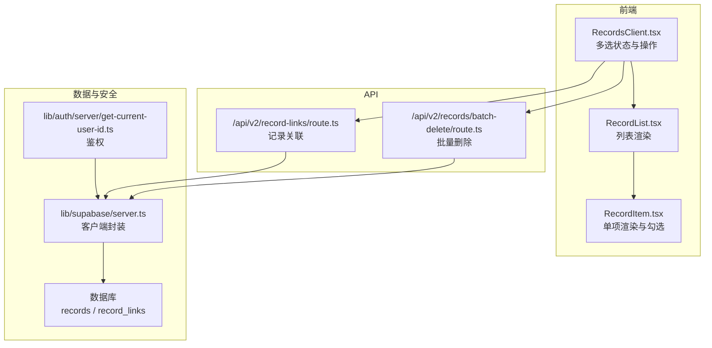
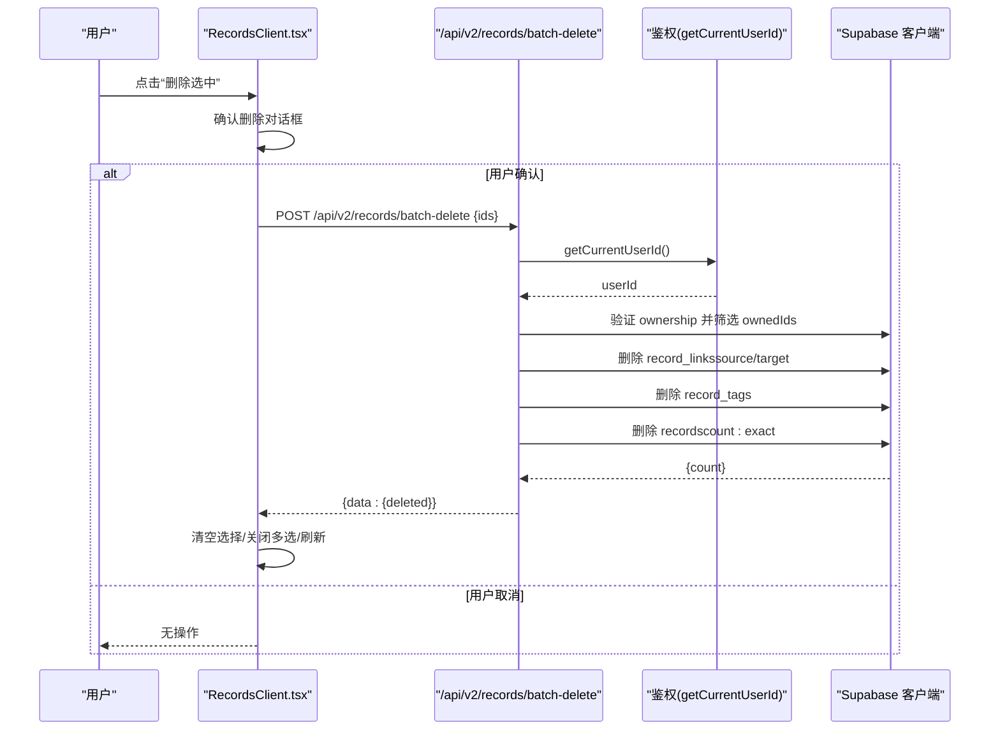
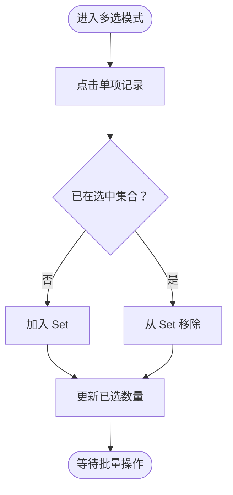
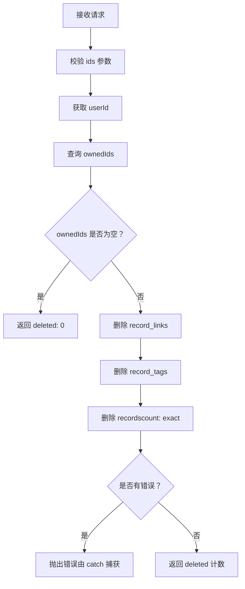
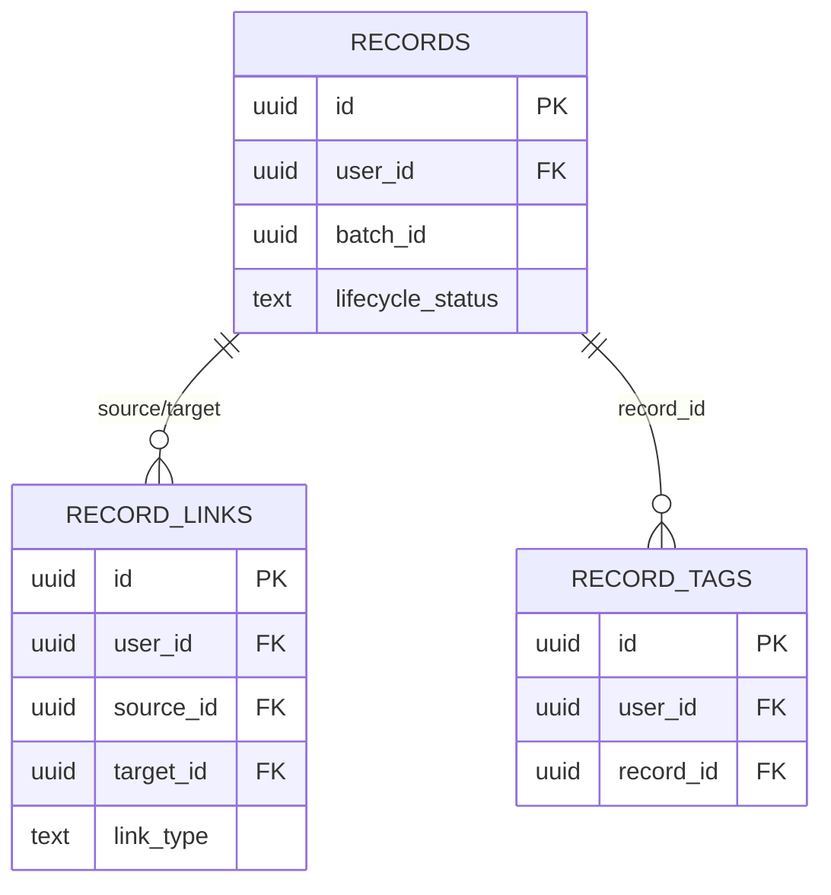
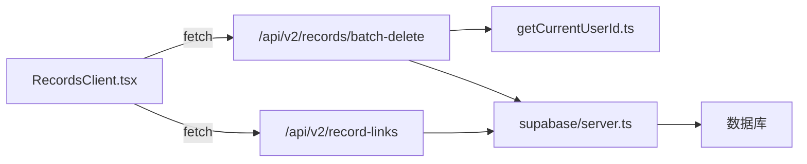

# 批量操作功能

<cite>
**本文引用的文件**
- [src/app/api/v2/records/batch-delete/route.ts](file://src/app/api/v2/records/batch-delete/route.ts)
- [src/app/(dashboard)/records/RecordsClient.tsx](file://src/app/(dashboard)/records/RecordsClient.tsx)
- [src/app/(dashboard)/records/components/RecordList.tsx](file://src/app/(dashboard)/records/components/RecordList.tsx)
- [src/app/(dashboard)/records/components/RecordItem.tsx](file://src/app/(dashboard)/records/components/RecordItem.tsx)
- [src/lib/auth/server/get-current-user-id.ts](file://src/lib/auth/server/get-current-user-id.ts)
- [src/lib/supabase/server.ts](file://src/lib/supabase/server.ts)
- [src/types/teto.ts](file://src/types/teto.ts)
- [sql/008_record_links_and_batch.sql](file://sql/008_record_links_and_batch.sql)
- [src/app/api/v2/record-links/route.ts](file://src/app/api/v2/record-links/route.ts)
- [src/lib/db/record-links.ts](file://src/lib/db/record-links.ts)
</cite>

## 目录
1. [简介](#简介)
2. [项目结构](#项目结构)
3. [核心组件](#核心组件)
4. [架构总览](#架构总览)
5. [详细组件分析](#详细组件分析)
6. [依赖分析](#依赖分析)
7. [性能考量](#性能考量)
8. [故障排查指南](#故障排查指南)
9. [结论](#结论)
10. [附录](#附录)

## 简介
本文件系统性阐述 TETO 的“批量操作”能力，重点覆盖多选模式的实现原理（选择状态管理、全选逻辑）、批量删除的 API 设计与事务处理、错误回滚与状态同步、用户体验设计（操作队列、进度反馈）、性能优化建议，以及安全性设计（权限验证、审计思路）。文档以代码为依据，配合可视化图表帮助读者理解端到端流程。

## 项目结构
批量操作涉及三层协作：
- 前端界面层：RecordsClient.tsx 提供多选 UI 与交互；RecordList.tsx/RecordItem.tsx 渲染列表项与勾选框。
- API 层：/api/v2/records/batch-delete 负责批量删除；/api/v2/record-links 提供记录关联能力（与批量操作协同）。
- 数据层：Supabase 客户端封装与行级安全策略（RLS）保障数据隔离；数据库迁移脚本定义 records 与 record_links 结构。

**图表来源**
- [src/app/(dashboard)/records/RecordsClient.tsx](file://src/app/(dashboard)/records/RecordsClient.tsx#L373-L422)
- [src/app/(dashboard)/records/components/RecordList.tsx](file://src/app/(dashboard)/records/components/RecordList.tsx#L31-L86)
- [src/app/(dashboard)/records/components/RecordItem.tsx](file://src/app/(dashboard)/records/components/RecordItem.tsx#L90-L107)
- [src/app/api/v2/records/batch-delete/route.ts:10-68](file://src/app/api/v2/records/batch-delete/route.ts#L10-L68)
- [src/app/api/v2/record-links/route.ts:1-99](file://src/app/api/v2/record-links/route.ts#L1-L99)
- [src/lib/supabase/server.ts:6-35](file://src/lib/supabase/server.ts#L6-L35)
- [src/lib/auth/server/get-current-user-id.ts:12-37](file://src/lib/auth/server/get-current-user-id.ts#L12-L37)

**章节来源**
- [src/app/(dashboard)/records/RecordsClient.tsx](file://src/app/(dashboard)/records/RecordsClient.tsx#L373-L422)
- [src/app/api/v2/records/batch-delete/route.ts:10-68](file://src/app/api/v2/records/batch-delete/route.ts#L10-L68)

## 核心组件
- 多选状态管理
  - selectionMode：控制是否进入多选模式
  - selectedIds：Set<string> 维护当前选中记录 ID
  - batchDeleting：标记批量删除进行中，用于禁用按钮与反馈
- 交互行为
  - 切换多选：handleToggleSelectionMode
  - 单项勾选：handleToggleSelect
  - 全选当前：handleSelectAll
  - 批量删除：handleBatchDelete（调用 /api/v2/records/batch-delete）

- API 设计要点
  - 输入：ids[]（最多 200 条）
  - 输出：deleted 计数
  - 安全校验：仅删除当前用户拥有的记录
  - 关联清理：先删除 record_links 与 record_tags，再删除 records

**章节来源**
- [src/app/(dashboard)/records/RecordsClient.tsx](file://src/app/(dashboard)/records/RecordsClient.tsx#L75-L78)
- [src/app/(dashboard)/records/RecordsClient.tsx](file://src/app/(dashboard)/records/RecordsClient.tsx#L373-L422)
- [src/app/api/v2/records/batch-delete/route.ts:15-21](file://src/app/api/v2/records/batch-delete/route.ts#L15-L21)
- [src/app/api/v2/records/batch-delete/route.ts:25-54](file://src/app/api/v2/records/batch-delete/route.ts#L25-L54)

## 架构总览
批量删除的端到端流程如下：

**图表来源**
- [src/app/(dashboard)/records/RecordsClient.tsx](file://src/app/(dashboard)/records/RecordsClient.tsx#L397-L422)
- [src/app/api/v2/records/batch-delete/route.ts:10-68](file://src/app/api/v2/records/batch-delete/route.ts#L10-L68)
- [src/lib/auth/server/get-current-user-id.ts:12-37](file://src/lib/auth/server/get-current-user-id.ts#L12-L37)
- [src/lib/supabase/server.ts:6-35](file://src/lib/supabase/server.ts#L6-L35)

## 详细组件分析

### 多选模式与状态管理
- 状态字段
  - selectionMode：是否处于多选模式
  - selectedIds：Set<string>，支持去重与 O(1) 查找
  - batchDeleting：用于 UI 禁用与加载态
- 交互逻辑
  - 切换多选：清空已选或进入多选
  - 单项勾选：基于 Set 的 add/delete
  - 全选当前：从当前页 records 提取 id 构造 Set
- UI 呈现
  - 顶部工具栏显示“已选数量”，提供“全选当前”“删除选中”按钮
  - 列表项在 selectionMode 下显示勾选框与选中态样式

**图表来源**
- [src/app/(dashboard)/records/RecordsClient.tsx](file://src/app/(dashboard)/records/RecordsClient.tsx#L383-L395)
- [src/app/(dashboard)/records/components/RecordItem.tsx](file://src/app/(dashboard)/records/components/RecordItem.tsx#L98-L107)

**章节来源**
- [src/app/(dashboard)/records/RecordsClient.tsx](file://src/app/(dashboard)/records/RecordsClient.tsx#L75-L78)
- [src/app/(dashboard)/records/RecordsClient.tsx](file://src/app/(dashboard)/records/RecordsClient.tsx#L373-L422)
- [src/app/(dashboard)/records/components/RecordList.tsx](file://src/app/(dashboard)/records/components/RecordList.tsx#L19-L29)
- [src/app/(dashboard)/records/components/RecordItem.tsx](file://src/app/(dashboard)/records/components/RecordItem.tsx#L98-L107)

### 批量删除 API 设计与事务处理
- 请求与校验
  - 校验 ids 是否为非空数组，长度上限 200
  - 使用 getCurrentUserId 获取当前用户
- 数据一致性
  - 先验证 ownership，仅对当前用户记录执行删除
  - 严格顺序：先删除 record_links（避免 RLS 阻止 CASCADE），再删除 record_tags，最后删除 records
- 错误处理
  - 对鉴权失败返回 401
  - 其他错误返回 500，包含错误消息
- 返回值
  - 返回 deleted 计数，便于前端刷新与提示

**图表来源**
- [src/app/api/v2/records/batch-delete/route.ts:10-68](file://src/app/api/v2/records/batch-delete/route.ts#L10-L68)

**章节来源**
- [src/app/api/v2/records/batch-delete/route.ts:15-21](file://src/app/api/v2/records/batch-delete/route.ts#L15-L21)
- [src/app/api/v2/records/batch-delete/route.ts:25-54](file://src/app/api/v2/records/batch-delete/route.ts#L25-L54)
- [src/app/api/v2/records/batch-delete/route.ts:61-67](file://src/app/api/v2/records/batch-delete/route.ts#L61-L67)

### 数据模型与关联清理
- record_links 表
  - 独立表，包含 user_id、source_id、target_id、link_type、created_at
  - 约束：source/target 引用 records，ON DELETE CASCADE
- records 表
  - 新增 batch_id（用于同源拆分批次）
  - 新增 lifecycle_status（生命周期状态）
- 关联清理策略
  - 批量删除前，按 ownedIds 删除 record_links（source 或 target 任一匹配即删除）
  - 删除 record_tags（按 record_id in ownedIds）

**图表来源**
- [sql/008_record_links_and_batch.sql:6-31](file://sql/008_record_links_and_batch.sql#L6-L31)
- [src/app/api/v2/records/batch-delete/route.ts:37-47](file://src/app/api/v2/records/batch-delete/route.ts#L37-L47)

**章节来源**
- [sql/008_record_links_and_batch.sql:6-31](file://sql/008_record_links_and_batch.sql#L6-L31)
- [src/app/api/v2/records/batch-delete/route.ts:37-47](file://src/app/api/v2/records/batch-delete/route.ts#L37-L47)

### 用户体验设计与进度反馈
- 操作队列与进度
  - 通过 batchDeleting 禁用按钮与显示“删除中...”，避免重复提交
  - 删除成功后清空选择集、关闭多选模式并刷新数据
- 确认机制
  - 删除前弹窗确认，显示选中条数，提示不可撤销
- 刷新与状态同步
  - 成功后增加 refreshKey，驱动列表重新拉取数据
  - toast 错误提示，失败时保持多选状态以便用户重试

**章节来源**
- [src/app/(dashboard)/records/RecordsClient.tsx](file://src/app/(dashboard)/records/RecordsClient.tsx#L397-L422)
- [src/app/(dashboard)/records/RecordsClient.tsx](file://src/app/(dashboard)/records/RecordsClient.tsx#L561-L580)

### 安全性设计与权限验证
- 鉴权
  - getCurrentUserId 在开发模式与生产模式分别使用不同密钥
  - 若未登录或获取用户失败，返回 401
- 数据隔离
  - Supabase 客户端封装在开发模式下可使用服务端密钥，生产模式使用匿名密钥
  - RLS 策略确保 records、tags、items 等表仅允许用户访问自己的数据
- API 安全校验
  - 批量删除仅删除 ownedIds，防止越权删除他人记录
  - 关联表删除前置，规避 RLS 阻止 CASCADE 导致的删除失败

**章节来源**
- [src/lib/auth/server/get-current-user-id.ts:12-37](file://src/lib/auth/server/get-current-user-id.ts#L12-L37)
- [src/lib/supabase/server.ts:6-35](file://src/lib/supabase/server.ts#L6-L35)
- [src/app/api/v2/records/batch-delete/route.ts:25-35](file://src/app/api/v2/records/batch-delete/route.ts#L25-L35)

## 依赖分析
- 前端依赖
  - RecordsClient.tsx 依赖 useToast 提示、本地存储持久化多日模式
  - RecordList/RecordItem 依赖 selectionMode 与 selectedIds 控制渲染
- API 依赖
  - 批量删除依赖鉴权模块与 Supabase 客户端
  - 记录关联 API 与数据库层 record-links 实现微关联
- 数据库依赖
  - record_links 与 records 的外键关系与索引
  - RLS 策略保障数据隔离

**图表来源**
- [src/app/(dashboard)/records/RecordsClient.tsx](file://src/app/(dashboard)/records/RecordsClient.tsx#L397-L422)
- [src/app/api/v2/records/batch-delete/route.ts:10-68](file://src/app/api/v2/records/batch-delete/route.ts#L10-L68)
- [src/app/api/v2/record-links/route.ts:1-99](file://src/app/api/v2/record-links/route.ts#L1-L99)
- [src/lib/auth/server/get-current-user-id.ts:12-37](file://src/lib/auth/server/get-current-user-id.ts#L12-L37)
- [src/lib/supabase/server.ts:6-35](file://src/lib/supabase/server.ts#L6-L35)

**章节来源**
- [src/app/(dashboard)/records/RecordsClient.tsx](file://src/app/(dashboard)/records/RecordsClient.tsx#L373-L422)
- [src/app/api/v2/records/batch-delete/route.ts:10-68](file://src/app/api/v2/records/batch-delete/route.ts#L10-L68)
- [src/app/api/v2/record-links/route.ts:1-99](file://src/app/api/v2/record-links/route.ts#L1-L99)

## 性能考量
- 限制批量大小
  - 单次最多删除 200 条，避免大事务阻塞与超时
- 查询与删除顺序
  - 先验证 ownership 再删除，减少无效写入
  - 关联表删除前置，避免 RLS 导致的级联失败
- 前端优化
  - 使用 Set 管理选中集合，O(1) 添加/删除
  - 批量删除期间禁用按钮，避免重复请求
- 数据库索引
  - record_links 的 source/target 索引与 records.batch_id 索引提升查询效率

**章节来源**
- [src/app/api/v2/records/batch-delete/route.ts:19-21](file://src/app/api/v2/records/batch-delete/route.ts#L19-L21)
- [src/app/api/v2/records/batch-delete/route.ts:37-47](file://src/app/api/v2/records/batch-delete/route.ts#L37-L47)
- [sql/008_record_links_and_batch.sql:21-26](file://sql/008_record_links_and_batch.sql#L21-L26)

## 故障排查指南
- 常见问题
  - 400：ids 参数缺失或为空、超过上限
  - 401：未登录或鉴权失败
  - 500：数据库错误或内部异常
- 排查步骤
  - 检查前端 selectedIds 是否为空或超出上限
  - 确认 getCurrentUserId 是否返回有效 userId
  - 查看 Supabase 客户端密钥配置（开发/生产模式）
  - 核对 RLS 策略是否生效
- 建议
  - 前端增加 toast 提示与重试按钮
  - 后端记录关键错误日志（不泄露敏感信息）

**章节来源**
- [src/app/api/v2/records/batch-delete/route.ts:15-21](file://src/app/api/v2/records/batch-delete/route.ts#L15-L21)
- [src/app/api/v2/records/batch-delete/route.ts:61-67](file://src/app/api/v2/records/batch-delete/route.ts#L61-L67)
- [src/lib/auth/server/get-current-user-id.ts:30-36](file://src/lib/auth/server/get-current-user-id.ts#L30-L36)
- [src/lib/supabase/server.ts:13-15](file://src/lib/supabase/server.ts#L13-L15)

## 结论
TETO 的批量操作以“多选状态管理 + 安全校验 + 关联先行清理 + 严格顺序删除”为核心设计，结合前端禁用与进度反馈，提供了稳定、可预期的用户体验。通过限制批量规模、利用索引与 RLS 策略，系统在性能与安全性之间取得平衡。未来可在审计日志与更细粒度的并发控制方面进一步增强。

## 附录
- 如何启用多选模式
  - 在记录列表顶部点击“多选”按钮，进入 selectionMode
  - 点击列表项勾选或使用“全选当前”
- 如何处理批量删除
  - 点击“删除选中”，确认弹窗后提交请求
  - 删除完成后自动刷新并清空选择
- 性能优化建议
  - 合理设置批量上限（当前为 200）
  - 前端使用 Set 管理选中集合
  - 后端确保索引与 RLS 策略配置正确