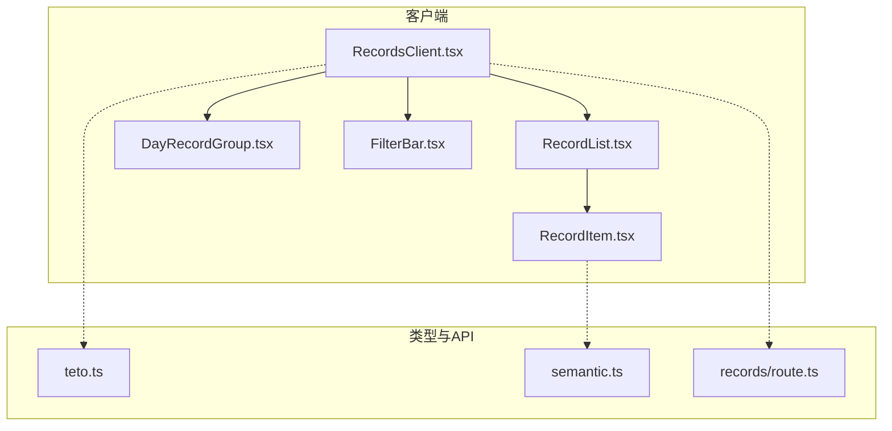
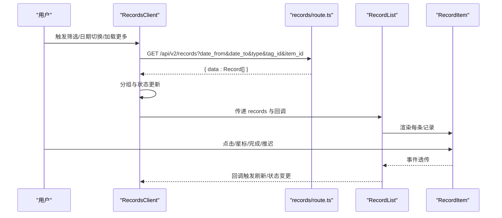
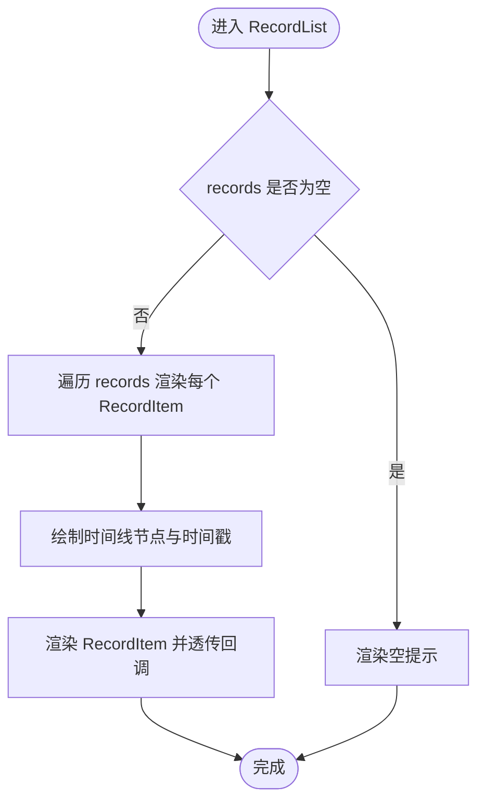
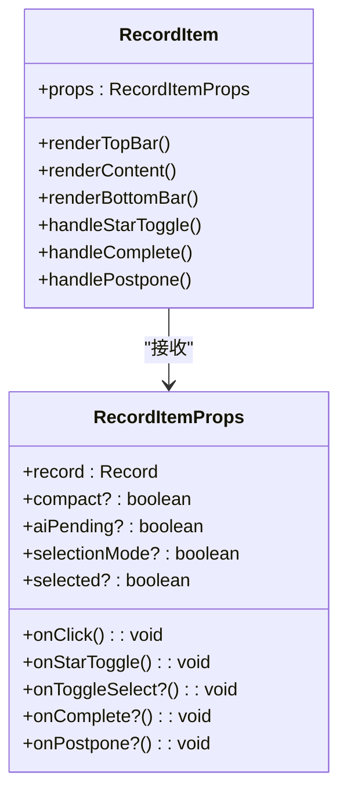
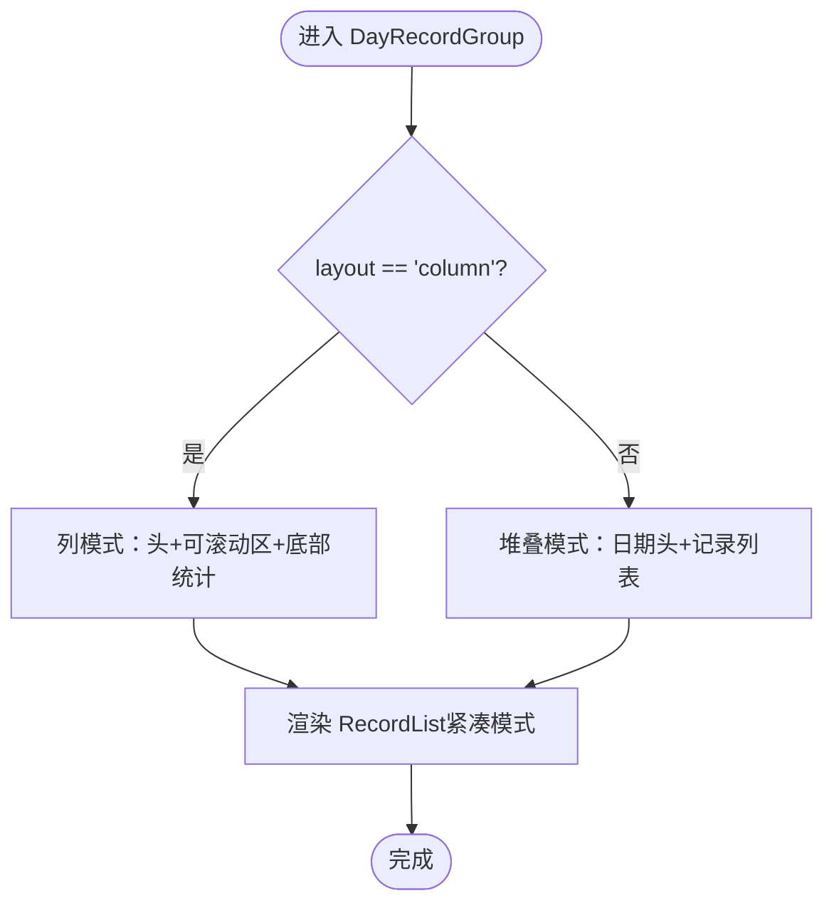
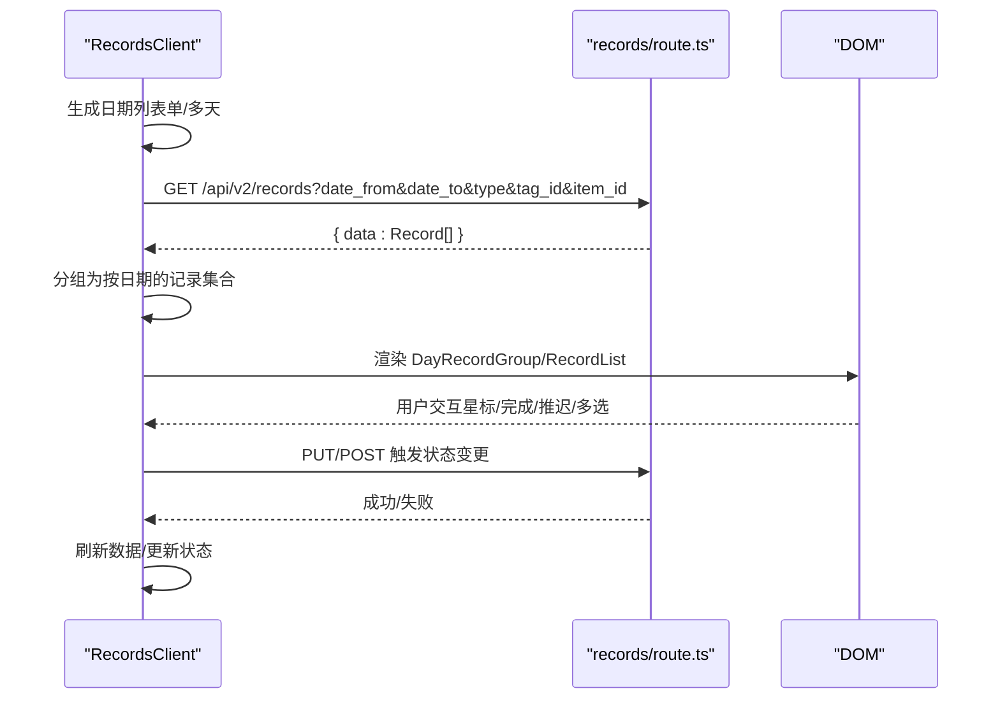
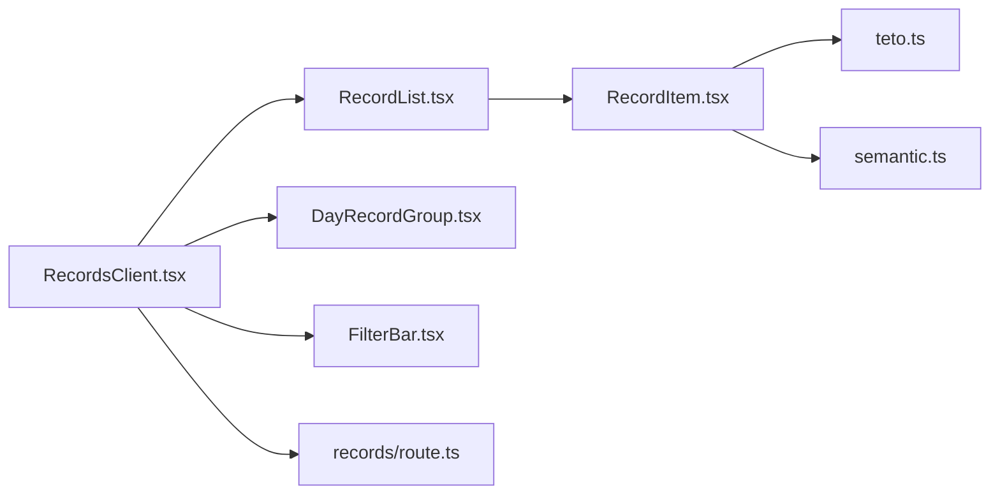

# 记录列表展示

<cite>
**本文引用的文件**
- [RecordList.tsx](file://src/app/(dashboard)/records/components/RecordList.tsx)
- [RecordItem.tsx](file://src/app/(dashboard)/records/components/RecordItem.tsx)
- [DayRecordGroup.tsx](file://src/app/(dashboard)/records/components/DayRecordGroup.tsx)
- [FilterBar.tsx](file://src/app/(dashboard)/records/components/FilterBar.tsx)
- [RecordsClient.tsx](file://src/app/(dashboard)/records/RecordsClient.tsx)
- [teto.ts](file://src/types/teto.ts)
- [semantic.ts](file://src/types/semantic.ts)
- [route.ts](file://src/app/api/v2/records/route.ts)
- [globals.css](file://src/app/globals.css)
</cite>

## 目录
1. [简介](#简介)
2. [项目结构](#项目结构)
3. [核心组件](#核心组件)
4. [架构总览](#架构总览)
5. [详细组件分析](#详细组件分析)
6. [依赖分析](#依赖分析)
7. [性能考虑](#性能考虑)
8. [故障排查指南](#故障排查指南)
9. [结论](#结论)
10. [附录](#附录)

## 简介
本文件面向TETO记录列表展示功能，系统性阐述RecordList与RecordItem两大核心组件的实现原理，覆盖虚拟滚动优化、响应式布局、交互状态管理与性能优化策略；详解记录分组逻辑、时间轴展示、星标标记与AI处理状态的视觉呈现；说明滚动行为、懒加载机制、缓存策略与内存管理；并提供移动端适配、无障碍访问与用户体验优化的技术细节与实践路径。

## 项目结构
记录列表相关模块位于仪表盘页面records子路由下，采用“客户端组件 + 服务端API”的分层设计：
- 客户端容器 RecordsClient 负责状态管理、数据加载、分组与交互编排
- 展示组件 RecordList/RecordItem/DayRecordGroup/FilterBar 负责UI渲染与用户交互
- 类型定义 teto.ts/semantic.ts 提供Record、语义解析等强类型支撑
- API路由 route.ts 提供记录查询与创建等后端接口

图表来源
- [RecordsClient.tsx:56-696](file://src/app/(dashboard)/records/RecordsClient.tsx#L56-L696)
- [RecordList.tsx:31-87](file://src/app/(dashboard)/records/components/RecordList.tsx#L31-L87)
- [RecordItem.tsx:62-261](file://src/app/(dashboard)/records/components/RecordItem.tsx#L62-L261)
- [DayRecordGroup.tsx:40-133](file://src/app/(dashboard)/records/components/DayRecordGroup.tsx#L40-L133)
- [FilterBar.tsx:18-106](file://src/app/(dashboard)/records/components/FilterBar.tsx#L18-L106)
- [teto.ts:37-74](file://src/types/teto.ts#L37-L74)
- [semantic.ts:18-43](file://src/types/semantic.ts#L18-L43)
- [route.ts:7-42](file://src/app/api/v2/records/route.ts#L7-L42)

章节来源
- [RecordsClient.tsx:56-696](file://src/app/(dashboard)/records/RecordsClient.tsx#L56-L696)
- [RecordList.tsx:31-87](file://src/app/(dashboard)/records/components/RecordList.tsx#L31-L87)
- [RecordItem.tsx:62-261](file://src/app/(dashboard)/records/components/RecordItem.tsx#L62-L261)
- [DayRecordGroup.tsx:40-133](file://src/app/(dashboard)/records/components/DayRecordGroup.tsx#L40-L133)
- [FilterBar.tsx:18-106](file://src/app/(dashboard)/records/components/FilterBar.tsx#L18-L106)
- [teto.ts:37-74](file://src/types/teto.ts#L37-L74)
- [semantic.ts:18-43](file://src/types/semantic.ts#L18-L43)
- [route.ts:7-42](file://src/app/api/v2/records/route.ts#L7-L42)

## 核心组件
- RecordList：负责记录列表的时间轴渲染、节点绘制与交互透传，支持紧凑模式与AI处理状态高亮。
- RecordItem：记录卡片的三层结构（元数据TopBar、正文Content、语义胶囊BottomBar），支持多选、星标、计划生命周期操作与语义置信度可视化。
- DayRecordGroup：按日期分组渲染，支持堆叠与列两种布局，列模式下内置可滚动区域与头部插槽。
- FilterBar：记录筛选工具条，支持类型、标签、事项筛选与一键清空。
- RecordsClient：客户端容器，负责多天/单日模式切换、日期生成、懒加载、筛选、星标切换、计划完成/推迟、多选与批量删除、AI处理状态管理等。

章节来源
- [RecordList.tsx:31-87](file://src/app/(dashboard)/records/components/RecordList.tsx#L31-L87)
- [RecordItem.tsx:62-261](file://src/app/(dashboard)/records/components/RecordItem.tsx#L62-L261)
- [DayRecordGroup.tsx:40-133](file://src/app/(dashboard)/records/components/DayRecordGroup.tsx#L40-L133)
- [FilterBar.tsx:18-106](file://src/app/(dashboard)/records/components/FilterBar.tsx#L18-L106)
- [RecordsClient.tsx:56-696](file://src/app/(dashboard)/records/RecordsClient.tsx#L56-L696)

## 架构总览
记录列表采用“容器-展示”分层：
- 容器层（RecordsClient）：集中管理状态、数据流、滚动与交互编排
- 展示层（RecordList/RecordItem/DayRecordGroup/FilterBar）：专注UI渲染与事件透传
- 数据层（API路由）：提供记录查询与创建接口

图表来源
- [RecordsClient.tsx:198-230](file://src/app/(dashboard)/records/RecordsClient.tsx#L198-L230)
- [route.ts:7-42](file://src/app/api/v2/records/route.ts#L7-L42)
- [RecordList.tsx:31-87](file://src/app/(dashboard)/records/components/RecordList.tsx#L31-L87)
- [RecordItem.tsx:62-261](file://src/app/(dashboard)/records/components/RecordItem.tsx#L62-L261)

## 详细组件分析

### RecordList 组件
职责与特性
- 时间轴渲染：左侧竖线与节点，右侧卡片内容
- 事件透传：点击、星标、多选、完成/推迟回调
- 紧凑模式：减少内边距，适合列模式
- AI处理状态：根据aiPendingIds集合高亮“AI处理中”

关键实现要点
- 时间显示优先使用occurred_at，否则回退created_at
- 使用相对定位与z-index确保节点在时间线上方
- 将RecordItem作为子组件，统一透传交互回调

图表来源
- [RecordList.tsx:31-87](file://src/app/(dashboard)/records/components/RecordList.tsx#L31-L87)

章节来源
- [RecordList.tsx:31-87](file://src/app/(dashboard)/records/components/RecordList.tsx#L31-L87)

### RecordItem 组件
职责与特性
- 三层结构：TopBar（元数据）、Content（正文）、BottomBar（语义胶囊）
- 类型色板：不同记录类型对应不同颜色
- 语义胶囊：费用、人物、地点、心情、能量、时长、指标、标签、AI处理中
- 置信度可视化：语义字段的guess标记
- 计划生命周期：active状态下提供完成/推迟按钮
- 投影效果：计划类型且time_anchor_date与date不一致时半透明
- 多选模式：勾选框与“点击选择”提示
- 星标：支持点击切换并透传回调

图表来源
- [RecordItem.tsx:35-51](file://src/app/(dashboard)/records/components/RecordItem.tsx#L35-L51)
- [RecordItem.tsx:62-261](file://src/app/(dashboard)/records/components/RecordItem.tsx#L62-L261)

章节来源
- [RecordItem.tsx:62-261](file://src/app/(dashboard)/records/components/RecordItem.tsx#L62-L261)

### DayRecordGroup 组件
职责与特性
- 日期分组：堆叠模式与列模式
- 列模式：固定头部、可滚动记录区、底部统计
- 顶部插槽：QuickInput等组件注入
- 日期格式化：支持“今天”标识与周几显示

图表来源
- [DayRecordGroup.tsx:40-133](file://src/app/(dashboard)/records/components/DayRecordGroup.tsx#L40-L133)

章节来源
- [DayRecordGroup.tsx:40-133](file://src/app/(dashboard)/records/components/DayRecordGroup.tsx#L40-L133)

### FilterBar 组件
职责与特性
- 类型筛选：全选与各类型按钮
- 标签与事项筛选：下拉选择
- 清除筛选：一键清空

章节来源
- [FilterBar.tsx:18-106](file://src/app/(dashboard)/records/components/FilterBar.tsx#L18-L106)

### RecordsClient 容器
职责与特性
- 多天/单日模式：本地存储持久化、日期列表生成、滚动位置补偿
- 懒加载：左右追加日期列，列宽与间距固定，滚动补偿
- 数据加载：按日期范围查询记录，支持筛选参数
- 交互编排：星标切换、计划完成/推迟、多选与批量删除
- AI处理状态：开始/完成时加入/移除pending集合
- 无障碍：按钮提供aria-label与title

图表来源
- [RecordsClient.tsx:198-230](file://src/app/(dashboard)/records/RecordsClient.tsx#L198-L230)
- [route.ts:7-42](file://src/app/api/v2/records/route.ts#L7-L42)

章节来源
- [RecordsClient.tsx:56-696](file://src/app/(dashboard)/records/RecordsClient.tsx#L56-L696)

## 依赖分析
- RecordList 依赖 RecordItem
- RecordItem 依赖 Record 类型与语义解析类型
- DayRecordGroup 依赖 RecordList
- RecordsClient 依赖 FilterBar、DayRecordGroup、RecordList，并调用API路由
- 类型定义来自 teto.ts 与 semantic.ts

图表来源
- [RecordsClient.tsx:56-696](file://src/app/(dashboard)/records/RecordsClient.tsx#L56-L696)
- [RecordList.tsx:31-87](file://src/app/(dashboard)/records/components/RecordList.tsx#L31-L87)
- [RecordItem.tsx:62-261](file://src/app/(dashboard)/records/components/RecordItem.tsx#L62-L261)
- [DayRecordGroup.tsx:40-133](file://src/app/(dashboard)/records/components/DayRecordGroup.tsx#L40-L133)
- [FilterBar.tsx:18-106](file://src/app/(dashboard)/records/components/FilterBar.tsx#L18-L106)
- [teto.ts:37-74](file://src/types/teto.ts#L37-L74)
- [semantic.ts:18-43](file://src/types/semantic.ts#L18-L43)
- [route.ts:7-42](file://src/app/api/v2/records/route.ts#L7-L42)

章节来源
- [RecordsClient.tsx:56-696](file://src/app/(dashboard)/records/RecordsClient.tsx#L56-L696)
- [RecordList.tsx:31-87](file://src/app/(dashboard)/records/components/RecordList.tsx#L31-L87)
- [RecordItem.tsx:62-261](file://src/app/(dashboard)/records/components/RecordItem.tsx#L62-L261)
- [DayRecordGroup.tsx:40-133](file://src/app/(dashboard)/records/components/DayRecordGroup.tsx#L40-L133)
- [FilterBar.tsx:18-106](file://src/app/(dashboard)/records/components/FilterBar.tsx#L18-L106)
- [teto.ts:37-74](file://src/types/teto.ts#L37-L74)
- [semantic.ts:18-43](file://src/types/semantic.ts#L18-L43)
- [route.ts:7-42](file://src/app/api/v2/records/route.ts#L7-L42)

## 性能考虑
- 渲染优化
  - 使用紧凑模式（compact）减少内边距，降低DOM层级与重绘成本
  - 语义胶囊按需渲染：只有存在任一字段时才渲染底部胶囊区
  - 计划投影半透明与选中态使用CSS类控制，避免额外JS计算
- 滚动与懒加载
  - 多天模式列宽固定（约380px）+ 间距（12px），加载更早时补偿scrollLeft，保证滚动位置稳定
  - 使用useLayoutEffect在帧末同步滚动偏移，避免闪烁
  - 单日模式使用垂直滚动，多日模式使用水平滚动，避免长列表整体重排
- 状态与记忆化
  - 使用useMemo对分组结果与日期计算进行缓存
  - 使用useCallback对回调函数进行稳定化，减少子组件重渲染
  - 本地存储持久化多天模式开关，避免每次刷新重新计算
- 缓存与内存
  - 通过refreshKey驱动重新请求，避免重复请求
  - aiPendingIds使用Set结构，便于快速增删
  - 多选selectedIds使用Set，支持O(1)查找与切换
- 虚拟滚动
  - 当前实现为全量渲染，未采用虚拟滚动。若未来记录量增长，建议引入虚拟滚动方案（如react-window或react-virtualized）以降低DOM节点数量与内存占用

章节来源
- [RecordList.tsx:31-87](file://src/app/(dashboard)/records/components/RecordList.tsx#L31-L87)
- [RecordItem.tsx:62-261](file://src/app/(dashboard)/records/components/RecordItem.tsx#L62-L261)
- [RecordsClient.tsx:159-176](file://src/app/(dashboard)/records/RecordsClient.tsx#L159-L176)
- [RecordsClient.tsx:150-156](file://src/app/(dashboard)/records/RecordsClient.tsx#L150-L156)
- [RecordsClient.tsx:289-294](file://src/app/(dashboard)/records/RecordsClient.tsx#L289-L294)
- [RecordsClient.tsx:316-326](file://src/app/(dashboard)/records/RecordsClient.tsx#L316-L326)

## 故障排查指南
- 加载失败
  - 现象：加载动画持续或提示失败
  - 排查：检查网络请求与API返回；确认筛选条件是否导致空集；查看控制台错误
  - 相关实现：RecordsClient在fetchRecords中捕获异常并调用toast提示
- 星标切换失败
  - 现象：点击星标无变化
  - 排查：确认后端PUT请求成功；检查用户权限
  - 相关实现：handleStarToggle发起PUT请求并刷新
- 计划完成/推迟失败
  - 现象：弹窗确认后无反应
  - 排查：确认API返回状态码与错误信息；检查日期输入合法性
  - 相关实现：handleComplete/handlePostpone发起POST请求并刷新
- 多选与批量删除
  - 现象：多选无效或批量删除无响应
  - 排查：确认selectionMode开启；selectedIds非空；后端返回状态
  - 相关实现：handleToggleSelectionMode、handleToggleSelect、handleBatchDelete

章节来源
- [RecordsClient.tsx:204-226](file://src/app/(dashboard)/records/RecordsClient.tsx#L204-L226)
- [RecordsClient.tsx:302-314](file://src/app/(dashboard)/records/RecordsClient.tsx#L302-L314)
- [RecordsClient.tsx:331-371](file://src/app/(dashboard)/records/RecordsClient.tsx#L331-L371)
- [RecordsClient.tsx:374-422](file://src/app/(dashboard)/records/RecordsClient.tsx#L374-L422)

## 结论
记录列表展示功能通过清晰的容器-展示分层与完善的交互编排，实现了高效、可扩展的记录浏览体验。当前实现注重渲染简洁与滚动稳定性，未来可在记录量增长场景下引入虚拟滚动以进一步提升性能。同时，语义解析与AI处理状态的可视化为用户提供更强的信息密度与决策支持。

## 附录

### 数据模型与类型
- Record：记录实体，包含类型、时间、成本、指标、标签、语义解析等字段
- ParsedSemantic：语义解析结果，包含置信度字段confident用于guess标记

章节来源
- [teto.ts:37-74](file://src/types/teto.ts#L37-L74)
- [semantic.ts:18-43](file://src/types/semantic.ts#L18-L43)

### API接口
- GET /api/v2/records：支持按日期、类型、标签、事项、星标、搜索与限制数量查询
- POST /api/v2/records：创建记录，校验必填字段与事项归属

章节来源
- [route.ts:7-42](file://src/app/api/v2/records/route.ts#L7-L42)
- [route.ts:44-86](file://src/app/api/v2/records/route.ts#L44-L86)

### 移动端适配与无障碍
- 响应式布局：列模式下使用sm断点适配屏幕宽度
- 无障碍：按钮提供aria-label与title，星标切换与计划操作具备明确语义
- 滚动体验：多日模式使用水平滚动，单日模式垂直滚动，避免长列表重排

章节来源
- [DayRecordGroup.tsx:56-99](file://src/app/(dashboard)/records/components/DayRecordGroup.tsx#L56-L99)
- [RecordItem.tsx:135-162](file://src/app/(dashboard)/records/components/RecordItem.tsx#L135-L162)
- [globals.css:9-13](file://src/app/globals.css#L9-L13)