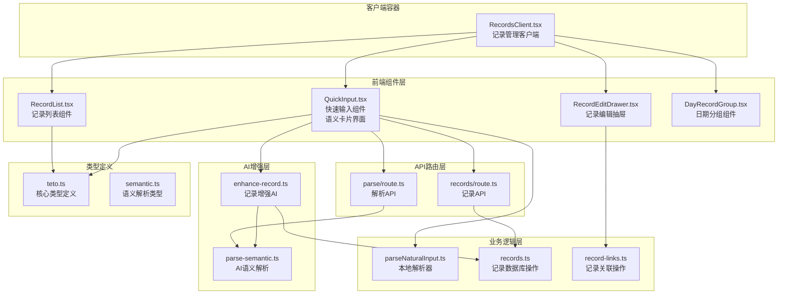
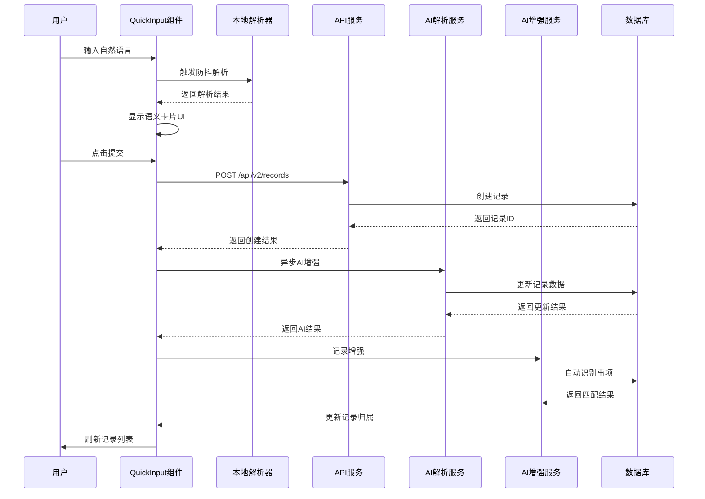
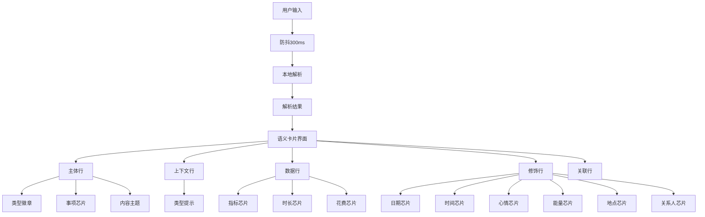
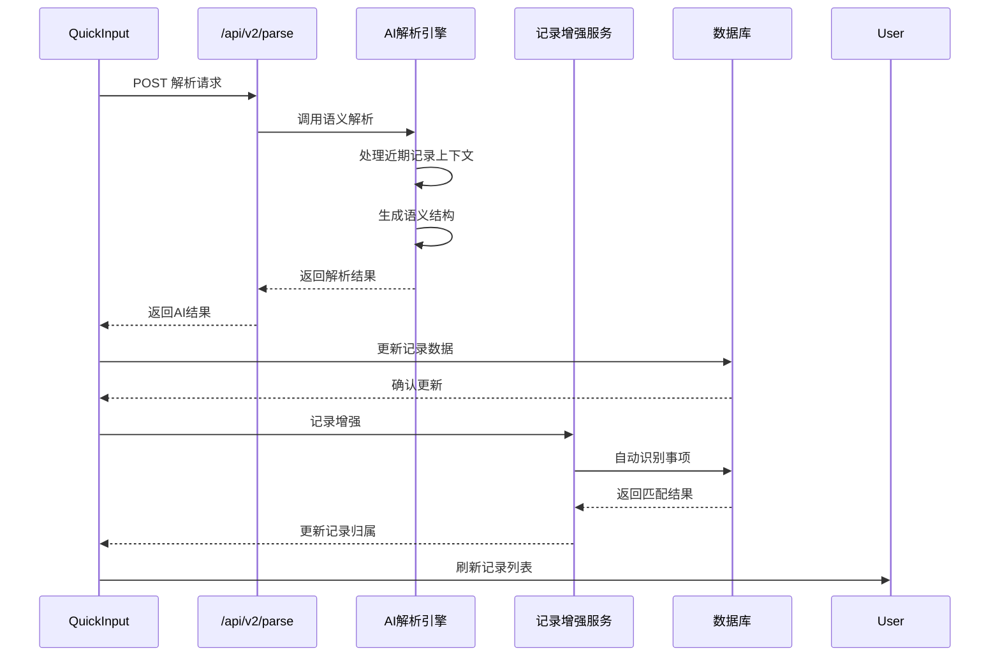
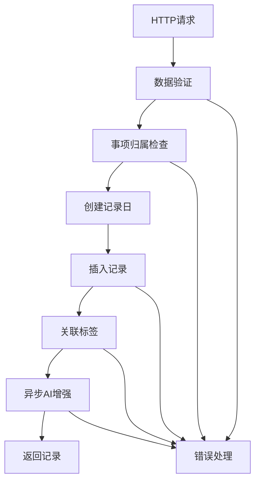
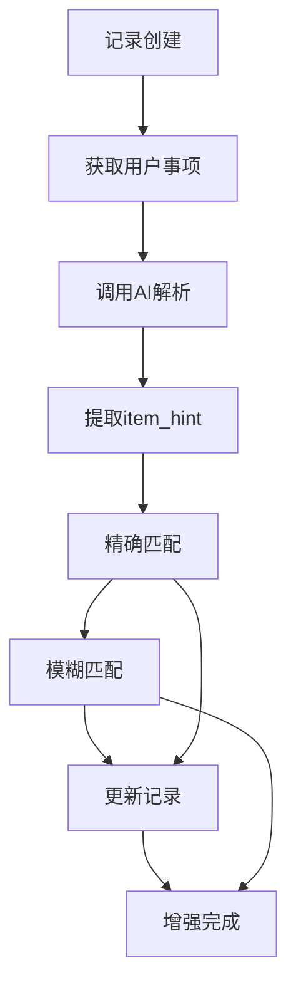
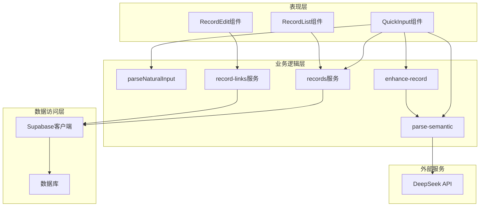

# 记录录入功能

<cite>
**本文档引用的文件**
- [QuickInput.tsx](file://src/app/(dashboard)/records/components/QuickInput.tsx)
- [RecordsClient.tsx](file://src/app/(dashboard)/records/RecordsClient.tsx)
- [RecordList.tsx](file://src/app/(dashboard)/records/components/RecordList.tsx)
- [RecordEditDrawer.tsx](file://src/app/(dashboard)/records/components/RecordEditDrawer.tsx)
- [DayRecordGroup.tsx](file://src/app/(dashboard)/records/components/DayRecordGroup.tsx)
- [records/route.ts](file://src/app/api/v2/records/route.ts)
- [parse/route.ts](file://src/app/api/v2/parse/route.ts)
- [enhance-record.ts](file://src/lib/ai/enhance-record.ts)
- [parseNaturalInput.ts](file://src/lib/utils/parseNaturalInput.ts)
- [parse-semantic.ts](file://src/lib/ai/parse-semantic.ts)
- [records.ts](file://src/lib/db/records.ts)
- [record-links.ts](file://src/lib/db/record-links.ts)
- [teto.ts](file://src/types/teto.ts)
- [semantic.ts](file://src/types/semantic.ts)
</cite>

## 更新摘要
**变更内容**
- QuickInput组件重大升级：从简单文本输入转变为语义卡片界面，支持实时复合句预览、AI建议匹配、智能澄清提示等
- 新增语义卡片系统，提供直观的芯片式数据可视化和编辑功能
- 增强AI歧义检测和澄清机制，支持多种风险级别的智能处理
- 完善复合句拆分预览和批量处理功能
- 新增降级模式提示和基础解析能力

## 目录
1. [简介](#简介)
2. [项目结构](#项目结构)
3. [核心组件](#核心组件)
4. [架构概览](#架构概览)
5. [详细组件分析](#详细组件分析)
6. [依赖关系分析](#依赖关系分析)
7. [性能考虑](#性能考虑)
8. [故障排除指南](#故障排除指南)
9. [结论](#结论)

## 简介

TETO记录录入功能是一个集成了AI辅助的智能输入系统，旨在为用户提供高效、准确的记录创建体验。该系统通过QuickInput组件实现了从简单文本输入到语义卡片界面的重大升级，提供了完整的快速输入、智能解析、自动保存和AI增强等功能，支持自然语言输入、结构化数据提取、批量处理和模板功能。

系统采用前后端分离架构，前端使用React构建用户界面，后端基于Next.js API路由提供RESTful服务。核心特性包括：

- **语义卡片界面**：全新的芯片式界面，直观展示解析结果和可编辑字段
- **智能自然语言解析**：支持中文自然语言输入，自动识别时间、地点、人物、情感等语义信息
- **实时预览和编辑**：通过语义卡片实时展示解析结果，支持用户编辑和修正
- **AI辅助增强**：集成DeepSeek LLM进行语义解析，提供智能关联和数据补全
- **异步AI处理**：记录创建后自动进行AI增强，不阻塞用户操作
- **复合句拆分**：支持复杂句子的自动拆分和批量创建
- **智能澄清机制**：针对模糊输入和歧义情况提供智能处理建议
- **双向数据互补**：AI解析的记录与现有记录进行智能数据补充
- **批量处理能力**：支持复合句拆分，自动生成多条独立记录
- **离线支持**：本地解析器确保基本功能在无网络环境下可用

## 项目结构

记录录入功能主要分布在以下目录结构中：

**图表来源**
- [QuickInput.tsx:1-1915](file://src/app/(dashboard)/records/components/QuickInput.tsx#L1-L1915)
- [RecordsClient.tsx:1-696](file://src/app/(dashboard)/records/RecordsClient.tsx#L1-L696)
- [enhance-record.ts:1-493](file://src/lib/ai/enhance-record.ts#L1-L493)

**章节来源**
- [QuickInput.tsx:1-1915](file://src/app/(dashboard)/records/components/QuickInput.tsx#L1-L1915)
- [RecordsClient.tsx:1-696](file://src/app/(dashboard)/records/RecordsClient.tsx#L1-L696)

## 核心组件

### QuickInput组件

QuickInput是记录录入系统的核心组件，经过重大升级后实现了从简单文本输入到语义卡片界面的转变。其主要功能包括：

- **语义卡片界面**：全新的芯片式界面，直观展示解析结果和可编辑字段
- **实时自然语言解析**：使用防抖机制（300ms延迟）进行本地解析
- **智能芯片展示**：将解析结果以交互式芯片形式展示，支持用户编辑和修正
- **自动保存功能**：即时创建记录，不等待AI处理
- **异步AI增强处理**：后台异步调用AI进行深度解析和数据补全
- **复合句批量处理**：识别复合句并拆分为多条独立记录
- **智能澄清机制**：针对模糊输入和歧义情况提供智能处理建议
- **双向数据互补**：AI解析的记录与现有记录进行智能数据补充

### 记录列表组件

RecordList负责展示和管理记录列表，提供以下功能：

- **时间线布局**：美观的时间轴展示记录
- **多选模式**：支持批量操作和删除
- **AI状态指示**：显示AI处理中的记录
- **紧凑模式**：在多天视图中使用紧凑布局

### 记录编辑抽屉

RecordEditDrawer提供详细的记录编辑功能：

- **结构化详情编辑**：支持花费、时长、地点、关系人等字段
- **标签管理**：支持多标签关联
- **关联记录管理**：支持记录间的双向关联
- **批量操作**：支持多条记录的批量删除

### AI增强服务

enhance-record.ts提供了记录创建后的异步AI增强功能：

- **自动事项识别**：基于内容自动识别关联事项
- **模糊匹配算法**：精确匹配优先，模糊匹配次之
- **智能归属处理**：仅在用户未手动设置时自动填充
- **静默处理机制**：AI失败不影响主流程
- **歧义检测**：支持多种风险级别的智能处理

**章节来源**
- [QuickInput.tsx:37-1915](file://src/app/(dashboard)/records/components/QuickInput.tsx#L37-L1915)
- [RecordList.tsx:31-86](file://src/app/(dashboard)/records/components/RecordList.tsx#L31-L86)
- [RecordEditDrawer.tsx:57-558](file://src/app/(dashboard)/records/components/RecordEditDrawer.tsx#L57-L558)
- [enhance-record.ts:28-493](file://src/lib/ai/enhance-record.ts#L28-L493)

## 架构概览

记录录入系统采用分层架构设计，确保功能模块的清晰分离和良好的可维护性：

**图表来源**
- [QuickInput.tsx:1037-1163](file://src/app/(dashboard)/records/components/QuickInput.tsx#L1037-L1163)
- [records/route.ts:111-153](file://src/app/api/v2/records/route.ts#L111-L153)
- [parse/route.ts:13-61](file://src/app/api/v2/parse/route.ts#L13-L61)
- [enhance-record.ts:28-493](file://src/lib/ai/enhance-record.ts#L28-L493)

系统架构的关键特点：

1. **双层解析机制**：本地解析器提供即时反馈，AI解析器提供深度语义理解
2. **异步处理模式**：用户操作不被AI处理阻塞，提升响应速度
3. **智能澄清机制**：针对模糊输入和歧义情况提供智能处理建议
4. **自动增强机制**：记录创建后自动进行AI增强，无需用户干预
5. **数据一致性保障**：通过事务和验证确保数据完整性
6. **扩展性设计**：模块化组件便于功能扩展和维护

## 详细组件分析

### QuickInput组件详细分析

QuickInput组件是整个记录录入系统的核心，经过重大升级后实现了语义卡片界面的完整功能：

#### 语义卡片系统设计

语义卡片系统提供了直观的数据可视化和编辑功能，采用分层展示结构：

**图表来源**
- [QuickInput.tsx:138-181](file://src/app/(dashboard)/records/components/QuickInput.tsx#L138-L181)
- [QuickInput.tsx:1620-1718](file://src/app/(dashboard)/records/components/QuickInput.tsx#L1620-L1718)

#### 智能澄清机制

系统支持多种风险级别的智能处理，针对不同的模糊输入情况提供相应的处理策略：

| 澄清类型 | 风险等级 | 处理策略 | 用户交互 |
|---------|----------|----------|----------|
| 共享时长 | 中等 | 时长分配输入 | 数字输入框 |
| 子项归属 | 中等 | 子项选择器 | 单选按钮 |
| 事项归属 | 低 | 事项选择器 | 单选按钮 |
| 低置信度 | 低 | 确认/忽略选项 | 单选按钮 |
| 高风险 | 高 | 确认/取消选项 | 单选按钮 |
| 模糊输入A类 | 高 | 修改原文/取消 | 修改按钮 |
| 模糊输入B类 | 中 | 确认/修改原文 | 单选按钮 |
| 模糊输入C类 | 中 | 修改原文/取消 | 修改按钮 |

#### 复合句处理机制

系统支持复合句的自动拆分和批量处理：

1. **复合句检测**：识别包含多个独立事件的输入
2. **智能拆分**：根据连接词（然后、接着、而且等）拆分句子
3. **类型推断**：为每个子句推断适当的记录类型
4. **批量创建**：创建独立的记录并建立关联关系
5. **双向数据互补**：AI解析的记录与现有记录进行智能数据补充

#### AI增强处理流程

AI增强功能提供了深度的数据解析和补全：

**图表来源**
- [QuickInput.tsx:529-909](file://src/app/(dashboard)/records/components/QuickInput.tsx#L529-L909)
- [parse/route.ts:13-61](file://src/app/api/v2/parse/route.ts#L13-L61)
- [enhance-record.ts:28-493](file://src/lib/ai/enhance-record.ts#L28-L493)

#### 降级模式机制

系统支持降级模式，在AI服务不可用时提供基础解析能力：

1. **降级检测**：自动检测AI服务状态
2. **基础解析**：使用本地规则进行基础解析
3. **提示显示**：向用户显示降级模式提示
4. **功能限制**：降级模式下禁用部分AI功能

**章节来源**
- [QuickInput.tsx:37-1915](file://src/app/(dashboard)/records/components/QuickInput.tsx#L37-L1915)
- [parseNaturalInput.ts:72-629](file://src/lib/utils/parseNaturalInput.ts#L72-L629)

### 记录API服务分析

记录API服务提供了完整的CRUD操作和高级功能：

#### 创建记录流程

**图表来源**
- [records/route.ts:111-153](file://src/app/api/v2/records/route.ts#L111-L153)
- [records.ts:176-300](file://src/lib/db/records.ts#L176-L300)

#### 查询记录功能

记录API支持灵活的查询条件和排序：

| 查询参数 | 类型 | 说明 |
|---------|------|------|
| date | string | 指定日期 |
| date_from | string | 日期范围开始 |
| date_to | string | 日期范围结束 |
| item_id | string | 事项ID |
| sub_item_id | string | 子项ID |
| type | enum | 记录类型 |
| tag_id | string | 标签ID |
| is_starred | boolean | 星标状态 |
| search | string | 搜索关键词 |
| limit | number | 限制数量 |

#### 批量操作支持

系统提供专门的批量删除API，支持多条记录的原子性操作。

**章节来源**
- [records/route.ts:72-153](file://src/app/api/v2/records/route.ts#L72-L153)
- [records.ts:176-300](file://src/lib/db/records.ts#L176-L300)

### AI解析引擎分析

AI解析引擎基于DeepSeek LLM提供强大的语义理解能力：

#### 解析能力矩阵

| 语义字段 | 解析能力 | 置信度级别 |
|---------|----------|------------|
| 主语 | ❌ | 不解析 |
| 动作 | ✅ | 高置信度 |
| 宾语 | ❌ | 不解析 |
| 时间锚点 | ✅ | 高置信度 |
| 地点 | ✅ | 中等置信度 |
| 人物 | ✅ | 中等置信度 |
| 情绪 | ✅ | 低置信度 |
| 能量 | ✅ | 低置信度 |
| 方式状语 | ❌ | 不解析 |
| 金额 | ✅ | 高置信度 |
| 时长 | ✅ | 高置信度 |
| 量化指标 | ✅ | 高置信度 |
| 记录关联 | ✅ | 中等置信度 |
| 事项关联 | ✅ | 中等置信度 |

#### 复合句处理

AI引擎能够识别和处理复杂的复合句结构：

1. **顺序连接**：使用"然后"、"接着"、"之后"等连接词
2. **并列连接**：使用"而且"、"并且"、"同时"等连接词  
3. **因果关系**：识别"因为...所以..."等因果结构
4. **对比关系**：识别"但是"、"然而"等对比结构

#### 置信度分级机制

AI解析结果包含置信度分级，采用红绿灯机制：

- **绿色（certain）**：有明确词汇证据
- **黄色（guess）**：通过语境、语气推测得出
- **红色（low）**：置信度低于阈值时提示用户确认

#### 风险等级评估

AI解析结果包含风险等级评估：

- **低风险（low）**：信息明确、归类无歧义
- **中风险（medium）**：有一定模糊性但不严重
- **高风险（high）**：错误代价大、涉及历史概括/批量推断

#### 模糊输入分类

系统支持三种模糊输入类型的智能处理：

- **A类无法理解（unintelligible）**：表达太碎、缺主语缺动作
- **B类信息不足（insufficient_info）**：可理解但缺关键信息
- **C类不合理（unreasonable）**：内容太多/时间冲突/计划结果混杂

**章节来源**
- [parse-semantic.ts:13-598](file://src/lib/ai/parse-semantic.ts#L13-L598)
- [semantic.ts:17-126](file://src/types/semantic.ts#L17-L126)

### 记录增强服务分析

记录增强服务提供了创建后的AI增强功能：

#### 自动事项识别流程

**图表来源**
- [enhance-record.ts:28-493](file://src/lib/ai/enhance-record.ts#L28-L493)

#### 匹配算法优化

1. **精确匹配优先**：完全匹配优先于模糊匹配
2. **反向包含匹配**：输入包含事项名称的匹配
3. **事项包含输入**：事项名称包含输入的匹配
4. **动作兜底匹配**：基于动作关键词的匹配

#### 数据互补机制

AI解析的记录与现有记录进行智能数据补充：

- **字段互补**：成本、地点、人员、情绪、能量等字段互补
- **双向更新**：当前记录和关联记录互相补全
- **智能过滤**：避免量化数据的相互继承

#### 澄清问题检测

系统支持多种澄清问题的自动检测：

1. **共享时长问题**：时长无法确定如何分配
2. **子项归属问题**：指标名称匹配到多个子项
3. **事项归属问题**：未匹配到事项
4. **模糊输入问题**：A/B/C类模糊输入
5. **高风险问题**：内容涉及历史概括/批量推断
6. **低置信度问题**：部分信息AI不太确定

**章节来源**
- [enhance-record.ts:28-493](file://src/lib/ai/enhance-record.ts#L28-L493)

## 依赖关系分析

记录录入功能的依赖关系体现了清晰的分层架构：

**图表来源**
- [QuickInput.tsx:3-8](file://src/app/(dashboard)/records/components/QuickInput.tsx#L3-L8)
- [enhance-record.ts:9-12](file://src/lib/ai/enhance-record.ts#L9-L12)
- [parse-semantic.ts:7](file://src/lib/ai/parse-semantic.ts#L7)

### 核心依赖关系

1. **类型定义依赖**：所有组件都依赖teto.ts和semantic.ts中的类型定义
2. **解析器依赖**：QuickInput依赖本地解析器和AI解析器
3. **数据库依赖**：所有API路由依赖数据库操作服务
4. **外部服务依赖**：AI功能依赖DeepSeek API服务
5. **增强服务依赖**：记录增强依赖AI解析引擎

### 循环依赖避免

系统通过以下方式避免循环依赖：

- **单向数据流**：从组件到服务再到数据库
- **接口抽象**：使用接口定义而非具体实现
- **模块边界**：清晰划分表现层、业务层和数据层

**章节来源**
- [teto.ts:1-516](file://src/types/teto.ts#L1-L516)
- [semantic.ts:1-126](file://src/types/semantic.ts#L1-L126)

## 性能考虑

记录录入系统在多个层面进行了性能优化：

### 前端性能优化

#### 防抖机制
- **延迟时间**：300ms防抖延迟，平衡响应性和性能
- **内存管理**：组件卸载时清理定时器，防止内存泄漏
- **状态优化**：使用useCallback和useMemo避免不必要的重渲染

#### 虚拟化列表
- **RecordList**：使用虚拟化技术处理大量记录
- **DayRecordGroup**：在多天视图中优化渲染性能

#### 缓存策略
- **近期记录缓存**：AI解析时缓存最近3天的记录
- **解析结果缓存**：避免重复解析相同输入
- **事项列表缓存**：缓存用户事项列表减少API调用

### 后端性能优化

#### 数据库优化
- **索引优化**：为常用查询字段建立索引
- **批量操作**：支持批量插入和更新
- **连接池管理**：合理配置数据库连接池

#### API优化
- **请求合并**：合并相关的API请求
- **响应缓存**：缓存静态数据响应
- **分页处理**：默认限制查询结果数量

### AI性能考虑

#### 上下文优化
- **最近记录限制**：最多30条近期记录参与上下文
- **令牌控制**：严格控制提示词长度
- **并发限制**：限制同时进行的AI解析数量

#### 错误处理
- **降级策略**：AI失败时使用本地解析
- **超时处理**：设置合理的API调用超时
- **重试机制**：网络错误时自动重试
- **静默处理**：AI增强失败不影响主流程

### 异步处理优化

#### fire-and-forget模式
- **非阻塞处理**：AI增强不阻塞用户操作
- **错误隔离**：单个记录增强失败不影响其他记录
- **资源控制**：限制并发AI处理数量

#### 批量处理优化
- **复合句拆分**：减少重复解析开销
- **数据去重**：避免重复的记录创建
- **关联优化**：批量建立记录关联关系

## 故障排除指南

### 常见问题及解决方案

#### 输入解析失败

**问题现象**：输入后没有出现语义卡片
**可能原因**：
- 输入内容过短（少于2个字符）
- 语法不符合预期模式
- 本地解析器未正确初始化

**解决步骤**：
1. 检查输入内容长度
2. 查看浏览器控制台错误信息
3. 确认本地解析器依赖已正确加载

#### AI解析错误

**问题现象**：点击提交后AI处理长时间无响应
**可能原因**：
- DeepSeek API服务不可用
- 网络连接异常
- API密钥配置错误

**解决步骤**：
1. 检查DEEPSEEK_API_KEY环境变量
2. 验证网络连接状态
3. 查看API响应状态码

#### 记录保存失败

**问题现象**：提交后记录未创建或创建失败
**可能原因**：
- 必填字段验证失败
- 事项归属验证失败
- 数据库连接异常

**解决步骤**：
1. 检查必填字段是否完整
2. 验证事项ID的有效性
3. 查看数据库错误日志

#### AI增强失败

**问题现象**：记录创建后AI增强未生效
**可能原因**：
- 事项列表为空或无效
- AI解析失败
- 数据库更新失败

**解决步骤**：
1. 检查用户是否有有效的事项
2. 验证AI解析服务状态
3. 查看数据库更新日志

#### 澄清机制异常

**问题现象**：智能澄清框不出现或显示异常
**可能原因**：
- AI解析结果格式错误
- 澄清问题检测逻辑异常
- 用户交互状态异常

**解决步骤**：
1. 检查AI解析返回的澄清问题数组
2. 验证澄清机制的状态管理
3. 查看用户交互事件处理

#### 复合句拆分异常

**问题现象**：复合句拆分后记录数量不正确
**可能原因**：
- AI解析结果格式错误
- 拆分逻辑异常
- 关联创建失败

**解决步骤**：
1. 检查AI解析返回的units数组
2. 验证batch_id生成逻辑
3. 查看关联创建API响应

#### 性能问题

**问题现象**：页面响应缓慢或卡顿
**可能原因**：
- 记录数量过多
- 组件重渲染频繁
- API调用过于频繁

**解决步骤**：
1. 实施虚拟化列表
2. 优化状态更新逻辑
3. 调整防抖延迟参数

### 调试工具和技巧

#### 浏览器开发者工具
- **Network面板**：监控API调用和响应
- **Console面板**：查看JavaScript错误和警告
- **Performance面板**：分析性能瓶颈

#### 日志记录
- **前端日志**：记录用户操作和组件状态变化
- **后端日志**：记录API请求和数据库操作
- **AI日志**：记录语义解析过程和结果

#### 错误监控
- **异常捕获**：全局异常处理和上报
- **性能监控**：关键操作的性能指标收集
- **用户行为追踪**：分析用户使用模式

**章节来源**
- [QuickInput.tsx:147-151](file://src/app/(dashboard)/records/components/QuickInput.tsx#L147-L151)
- [records/route.ts:13-70](file://src/app/api/v2/records/route.ts#L13-L70)

## 结论

TETO记录录入功能通过从简单文本输入到语义卡片界面的重大升级，为用户提供了更加智能和直观的记录创建体验。系统的主要优势包括：

### 技术优势

1. **语义卡片界面**：全新的芯片式界面，直观展示解析结果和可编辑字段
2. **智能解析**：结合本地规则解析和AI语义理解，提供准确的数据提取
3. **实时反馈**：防抖机制确保用户获得即时的输入反馈
4. **智能澄清机制**：针对模糊输入和歧义情况提供智能处理建议
5. **异步处理**：AI增强不阻塞用户操作，提升整体响应速度
6. **自动增强**：记录创建后自动进行AI增强，无需用户干预
7. **数据完整性**：严格的验证和错误处理确保数据质量
8. **扩展性**：模块化设计便于功能扩展和维护
9. **智能互补**：AI解析的记录与现有记录进行智能数据补充

### 用户体验优势

1. **直观界面**：语义卡片系统直观展示解析结果
2. **高效便捷**：支持自然语言输入，减少手动操作
3. **智能辅助**：AI自动补全和关联建议
4. **灵活编辑**：支持随时修改和修正解析结果
5. **批量处理**：支持复杂场景的批量记录创建
6. **静默增强**：AI增强过程对用户透明
7. **降级支持**：AI服务不可用时提供基础解析能力

### 发展前景

系统为未来的功能扩展奠定了良好基础：

1. **AI能力增强**：持续优化语义解析准确性和响应速度
2. **个性化定制**：支持用户自定义解析规则和模板
3. **多平台支持**：扩展到移动端和其他平台
4. **数据分析**：集成更丰富的统计和洞察功能
5. **协作功能**：支持团队协作和共享记录
6. **智能推荐**：基于历史记录提供智能内容推荐

通过不断的技术创新和用户体验优化，TETO记录录入功能将继续为用户提供高效、智能的记录管理解决方案。