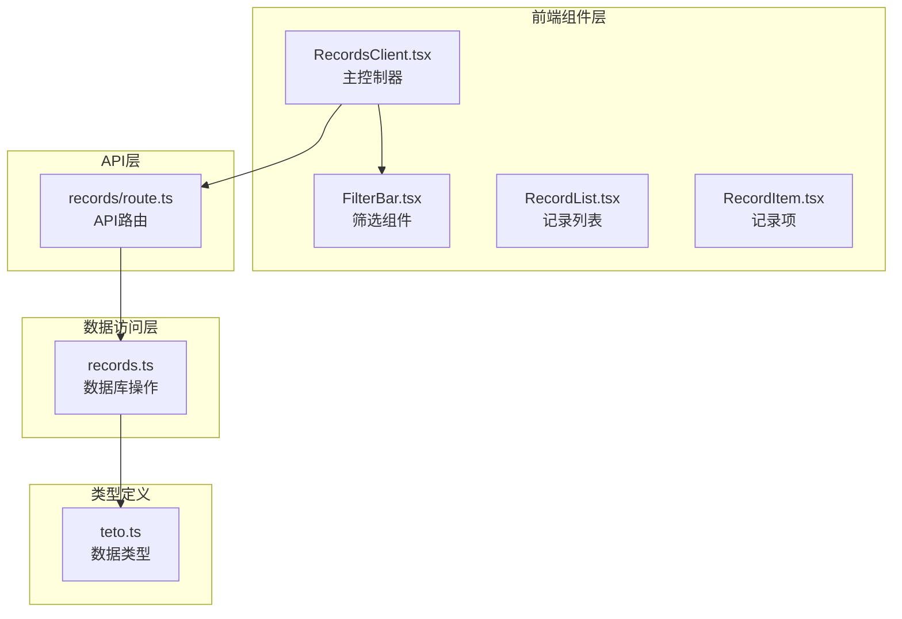
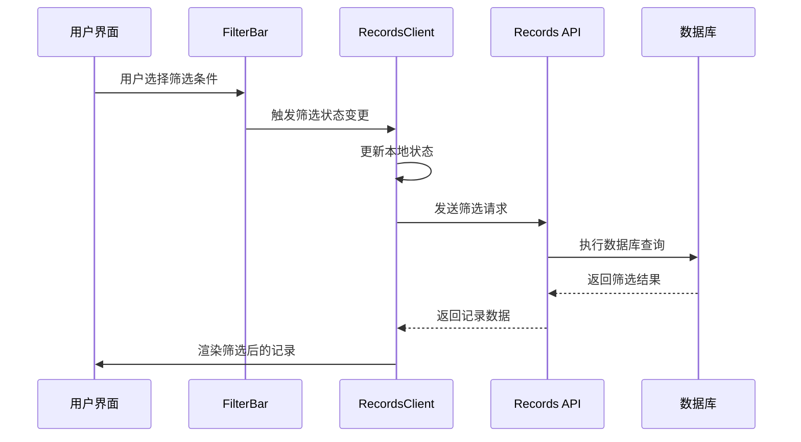
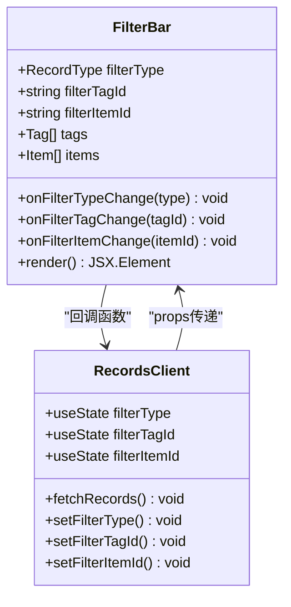
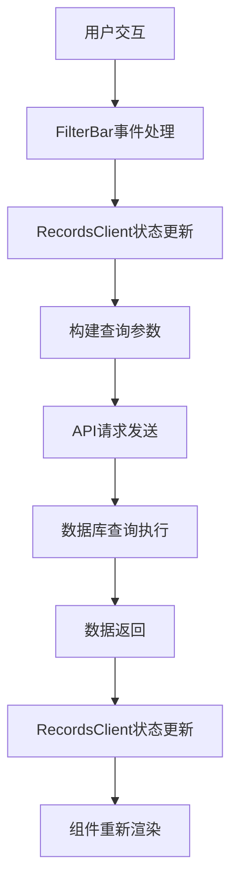
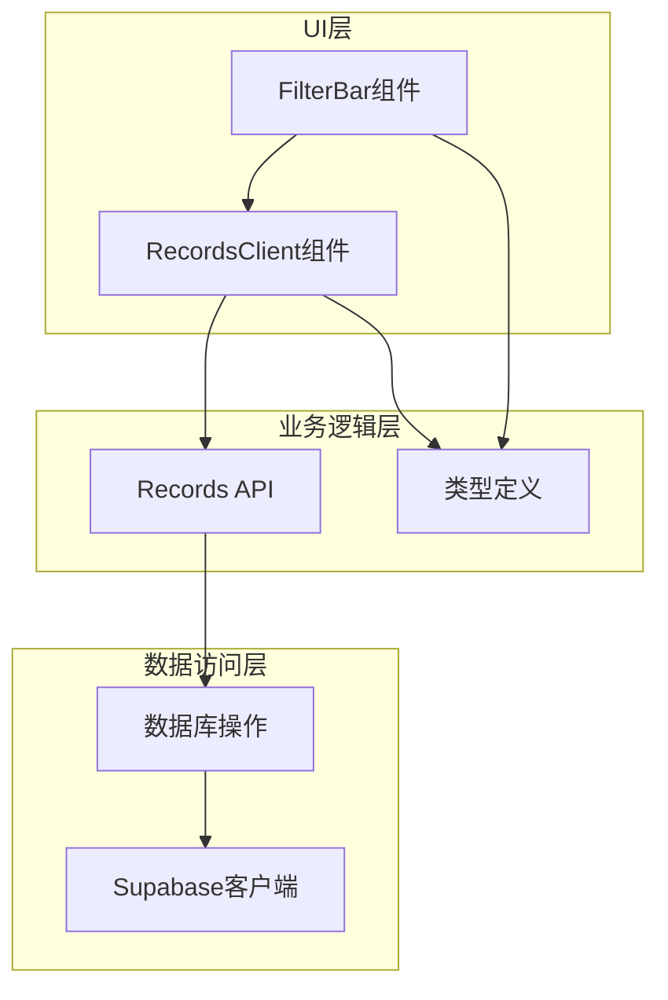

# 记录筛选系统

<cite>
**本文档引用的文件**
- [FilterBar.tsx](file://src/app/(dashboard)/records/components/FilterBar.tsx)
- [RecordsClient.tsx](file://src/app/(dashboard)/records/RecordsClient.tsx)
- [records/route.ts](file://src/app/api/v2/records/route.ts)
- [records.ts](file://src/lib/db/records.ts)
- [teto.ts](file://src/types/teto.ts)
- [page.tsx](file://src/app/(dashboard)/records/page.tsx)
</cite>

## 目录
1. [简介](#简介)
2. [项目结构](#项目结构)
3. [核心组件](#核心组件)
4. [架构概览](#架构概览)
5. [详细组件分析](#详细组件分析)
6. [依赖关系分析](#依赖关系分析)
7. [性能考虑](#性能考虑)
8. [故障排除指南](#故障排除指南)
9. [结论](#结论)

## 简介

TETO记录筛选系统是一个基于React和Next.js构建的现代化记录管理系统，专注于提供高效、直观的记录筛选和查询功能。该系统实现了完整的筛选功能，包括类型筛选、标签筛选、事项筛选、日期范围筛选和实时搜索功能。

系统采用客户端组件架构，通过URL参数同步筛选状态，支持单日和多日视图模式，并集成了批量操作功能。整个系统的设计注重用户体验和性能优化，提供了流畅的交互体验。

## 项目结构

记录筛选系统主要分布在以下目录结构中：

**图表来源**
- [RecordsClient.tsx:56-696](file://src/app/(dashboard)/records/RecordsClient.tsx#L56-L696)
- [FilterBar.tsx:18-106](file://src/app/(dashboard)/records/components/FilterBar.tsx#L18-L106)
- [records/route.ts:1-86](file://src/app/api/v2/records/route.ts#L1-L86)

**章节来源**
- [RecordsClient.tsx:1-696](file://src/app/(dashboard)/records/RecordsClient.tsx#L1-L696)
- [FilterBar.tsx:1-106](file://src/app/(dashboard)/records/components/FilterBar.tsx#L1-L106)
- [records/route.ts:1-86](file://src/app/api/v2/records/route.ts#L1-L86)

## 核心组件

### FilterBar组件

FilterBar是筛选系统的核心UI组件，负责提供用户友好的筛选界面。该组件支持三种主要筛选类型：

1. **记录类型筛选**：支持"发生"、"计划"、"想法"、"总结"四种类型
2. **标签筛选**：基于用户创建的标签进行筛选
3. **事项筛选**：基于用户管理的事项进行筛选

组件特性：
- 实时筛选状态显示
- 清除所有筛选功能
- 响应式设计适配不同屏幕尺寸
- 与RecordsClient状态完全同步

**章节来源**
- [FilterBar.tsx:7-106](file://src/app/(dashboard)/records/components/FilterBar.tsx#L7-L106)

### RecordsClient组件

RecordsClient是筛选系统的主控制器，负责：
- 管理筛选状态（类型、标签、事项）
- 构建查询参数并调用API
- 处理数据加载和错误处理
- 支持单日和多日视图模式
- 集成批量操作功能

**章节来源**
- [RecordsClient.tsx:56-696](file://src/app/(dashboard)/records/RecordsClient.tsx#L56-L696)

## 架构概览

系统采用分层架构设计，确保关注点分离和代码可维护性：

**图表来源**
- [FilterBar.tsx:36-46](file://src/app/(dashboard)/records/components/FilterBar.tsx#L36-L46)
- [RecordsClient.tsx:204-226](file://src/app/(dashboard)/records/RecordsClient.tsx#L204-L226)
- [records/route.ts:7-42](file://src/app/api/v2/records/route.ts#L7-L42)

## 详细组件分析

### FilterBar组件详细分析

FilterBar组件实现了完整的筛选UI交互：

**图表来源**
- [FilterBar.tsx:7-27](file://src/app/(dashboard)/records/components/FilterBar.tsx#L7-L27)
- [RecordsClient.tsx:68-70](file://src/app/(dashboard)/records/RecordsClient.tsx#L68-L70)

#### 筛选条件组合机制

系统支持多种筛选条件的组合使用：

1. **类型筛选**：支持单一类型选择，点击切换状态
2. **标签筛选**：通过下拉菜单选择特定标签
3. **事项筛选**：通过下拉菜单选择特定事项
4. **清除功能**：一键清除所有筛选条件

#### 实时搜索功能

虽然当前版本主要实现基础筛选功能，但系统架构已经为实时搜索预留了扩展空间：

- `search`查询参数已在类型定义中定义
- 数据库层支持内容模糊搜索
- API层已预留搜索参数处理

**章节来源**
- [FilterBar.tsx:18-106](file://src/app/(dashboard)/records/components/FilterBar.tsx#L18-L106)
- [RecordsClient.tsx:204-226](file://src/app/(dashboard)/records/RecordsClient.tsx#L204-L226)

### 数据流处理

系统采用单向数据流设计，确保状态管理的一致性和可预测性：

**图表来源**
- [RecordsClient.tsx:204-226](file://src/app/(dashboard)/records/RecordsClient.tsx#L204-L226)
- [records/route.ts:12-31](file://src/app/api/v2/records/route.ts#L12-L31)

### 高级筛选功能

系统支持复杂的筛选组合：

1. **日期范围筛选**：支持多日模式下的日期范围查询
2. **计划投影筛选**：自动包含计划记录的投影效果
3. **标签关联筛选**：通过中间表实现标签与记录的关联筛选
4. **排序和限制**：支持结果排序和数量限制

**章节来源**
- [records.ts:176-300](file://src/lib/db/records.ts#L176-L300)
- [teto.ts:235-245](file://src/types/teto.ts#L235-L245)

## 依赖关系分析

系统各组件之间的依赖关系清晰明确：

**图表来源**
- [FilterBar.tsx:3-5](file://src/app/(dashboard)/records/components/FilterBar.tsx#L3-L5)
- [RecordsClient.tsx:3-12](file://src/app/(dashboard)/records/RecordsClient.tsx#L3-L12)
- [records/route.ts:1-5](file://src/app/api/v2/records/route.ts#L1-L5)

### 状态管理

系统采用React Hooks进行状态管理：

1. **筛选状态**：`filterType`、`filterTagId`、`filterItemId`
2. **视图状态**：`isMultiDay`、`singleDayOffset`
3. **数据状态**：`records`、`tags`、`items`
4. **操作状态**：`loading`、`selectionMode`、`selectedIds`

**章节来源**
- [RecordsClient.tsx:68-78](file://src/app/(dashboard)/records/RecordsClient.tsx#L68-L78)

## 性能考虑

### 查询优化策略

系统采用了多项性能优化措施：

1. **批量数据加载**：使用`Promise.all`并发加载标签和事项数据
2. **条件查询构建**：根据筛选条件动态构建查询参数
3. **N+1查询避免**：批量预加载关联的事项数据
4. **内存优化**：使用`useMemo`缓存计算结果

### 缓存和存储

1. **本地存储**：使用localStorage持久化视图模式选择
2. **状态缓存**：避免不必要的重新渲染
3. **滚动位置保持**：多日模式下保持滚动位置

### 错误处理和降级

系统实现了完善的错误处理机制：
- 网络请求失败的优雅降级
- 用户友好的错误提示
- 自动重试机制

**章节来源**
- [RecordsClient.tsx:178-195](file://src/app/(dashboard)/records/RecordsClient.tsx#L178-L195)
- [RecordsClient.tsx:204-226](file://src/app/(dashboard)/records/RecordsClient.tsx#L204-L226)

## 故障排除指南

### 常见问题及解决方案

1. **筛选不生效**
   - 检查筛选状态是否正确更新
   - 确认API请求参数构建正确
   - 验证数据库查询条件

2. **数据加载缓慢**
   - 检查网络连接状态
   - 查看是否有过多并发请求
   - 考虑增加查询限制

3. **样式显示异常**
   - 确认Tailwind CSS配置正确
   - 检查组件className拼写
   - 验证响应式断点设置

### 调试技巧

1. **浏览器开发者工具**：监控网络请求和响应
2. **React DevTools**：检查组件状态和props
3. **控制台日志**：添加关键路径的日志输出

**章节来源**
- [RecordsClient.tsx:220-225](file://src/app/(dashboard)/records/RecordsClient.tsx#L220-L225)

## 结论

TETO记录筛选系统是一个设计精良、功能完整的筛选解决方案。系统的主要优势包括：

1. **模块化设计**：清晰的组件分离和职责划分
2. **性能优化**：多项技术手段确保系统响应速度
3. **用户体验**：直观的界面设计和流畅的交互体验
4. **可扩展性**：为未来功能扩展预留了良好的架构基础

系统成功实现了基础筛选功能，包括类型、标签、事项的组合筛选，并为实时搜索等功能提供了扩展框架。通过合理的状态管理和错误处理机制，确保了系统的稳定性和可靠性。

未来可以考虑的功能增强包括：
- 实时搜索功能的完整实现
- 高级筛选条件的扩展
- 筛选历史记录功能
- 自定义筛选模板
- 批量操作的进一步优化