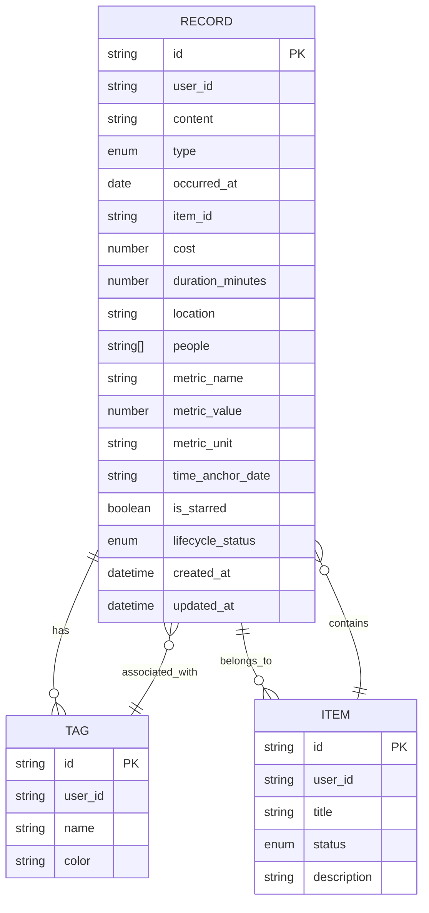
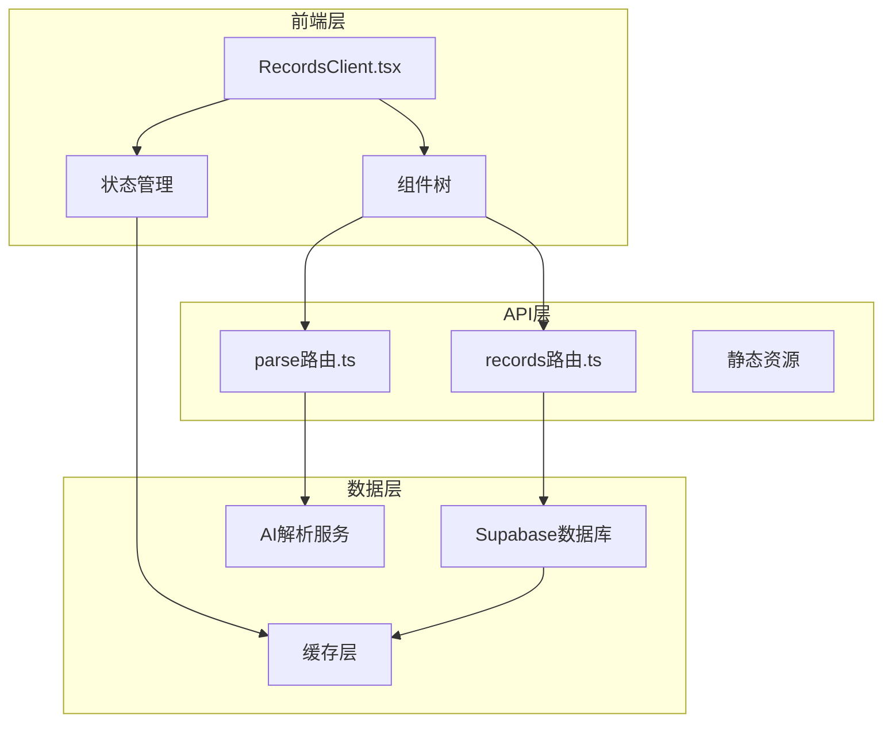
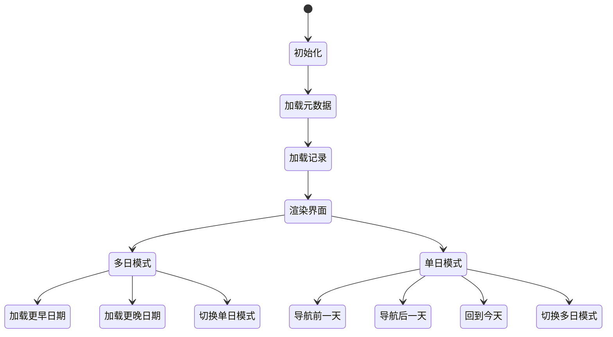
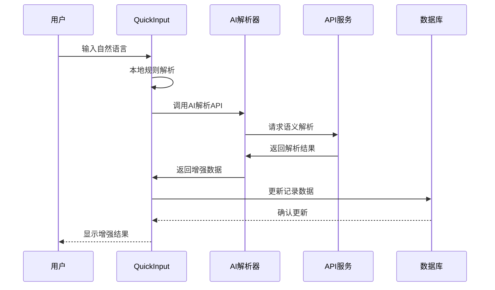
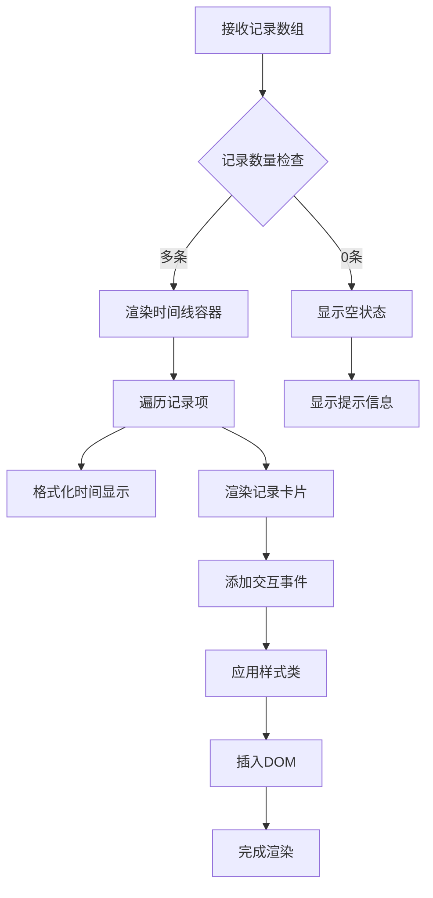
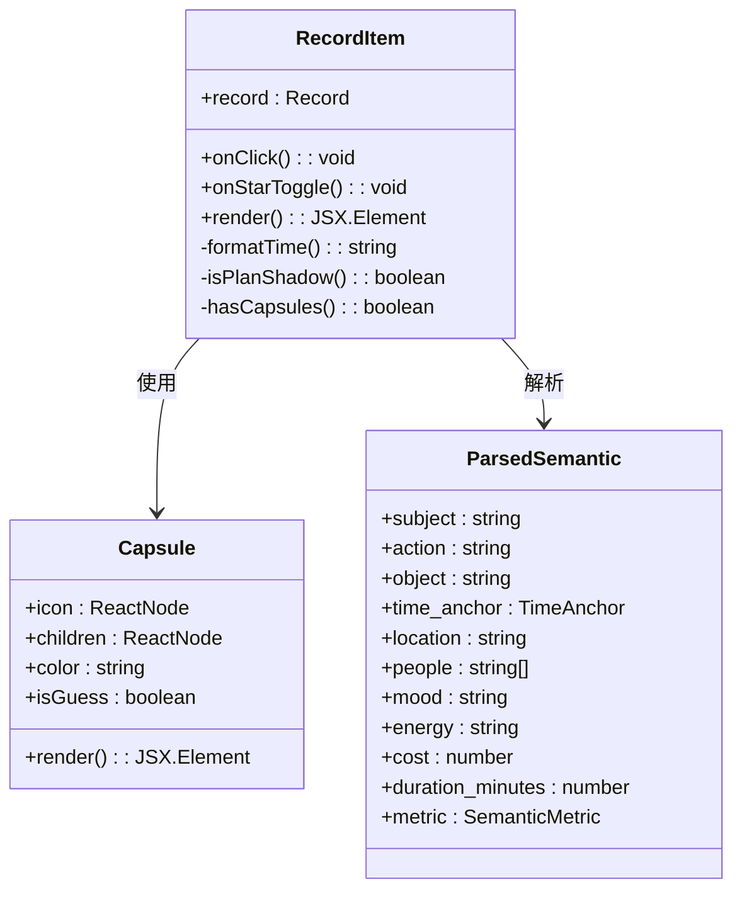
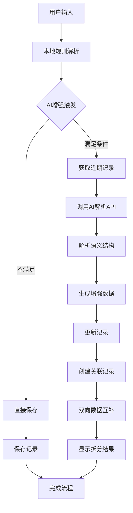
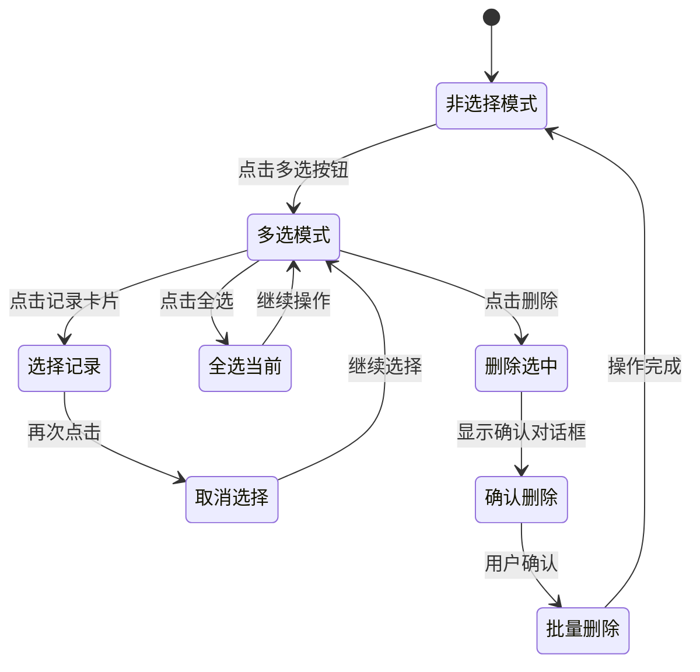
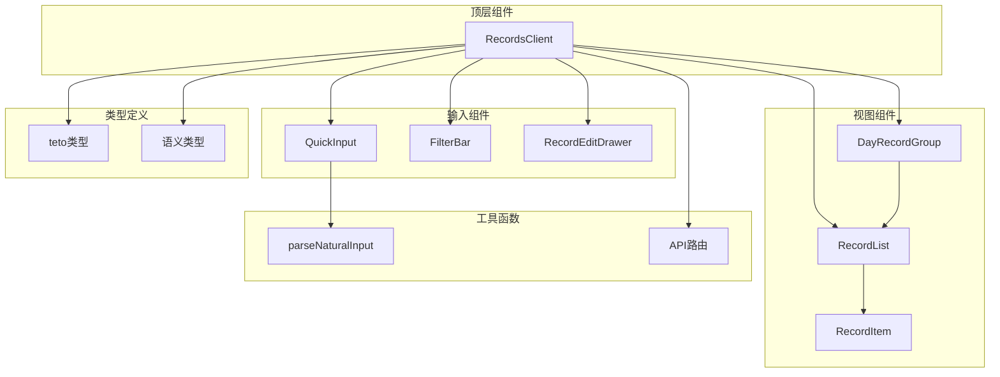
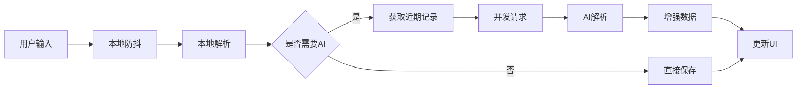

# 记录管理系统

<cite>
**本文档引用的文件**
- [RecordsClient.tsx](file://src/app/(dashboard)/records/RecordsClient.tsx)
- [RecordList.tsx](file://src/app/(dashboard)/records/components/RecordList.tsx)
- [RecordItem.tsx](file://src/app/(dashboard)/records/components/RecordItem.tsx)
- [QuickInput.tsx](file://src/app/(dashboard)/records/components/QuickInput.tsx)
- [FilterBar.tsx](file://src/app/(dashboard)/records/components/FilterBar.tsx)
- [RecordEditDrawer.tsx](file://src/app/(dashboard)/records/components/RecordEditDrawer.tsx)
- [DayRecordGroup.tsx](file://src/app/(dashboard)/records/components/DayRecordGroup.tsx)
- [records路由.ts](file://src/app/api/v2/records/route.ts)
- [parse路由.ts](file://src/app/api/v2/parse/route.ts)
- [teto类型定义.ts](file://src/types/teto.ts)
- [语义解析类型.ts](file://src/types/semantic.ts)
- [parseNaturalInput.ts](file://src/lib/utils/parseNaturalInput.ts)
- [records页面.tsx](file://src/app/(dashboard)/records/page.tsx)
</cite>

## 更新摘要
**变更内容**
- 修复了记录日期显示bug（getRecordDisplayDate函数），改进了"计划"类型记录的时间锚点处理逻辑
- 优化了记录列表渲染逻辑，提升了多天模式下的记录分组和显示效率
- 增强了记录分组算法，确保计划类记录正确显示在目标日期而非创建日期

## 目录
1. [简介](#简介)
2. [项目结构](#项目结构)
3. [核心组件](#核心组件)
4. [架构概览](#架构概览)
5. [详细组件分析](#详细组件分析)
6. [依赖分析](#依赖分析)
7. [性能考虑](#性能考虑)
8. [故障排除指南](#故障排除指南)
9. [结论](#结论)

## 简介

TETO记录管理系统是一个基于React和Next.js构建的现代化个人记录管理平台，专注于帮助用户高效记录和管理日常生活中的各种活动。系统采用"记录类型系统"为核心设计理念，支持四种主要记录类型：发生、计划、想法、总结，为用户提供完整的个人成长追踪解决方案。

该系统的核心特色包括：
- **智能记录类型识别**：通过自然语言解析自动识别记录类型
- **多模式视图**：支持单日模式和多天模式的灵活切换
- **AI辅助增强**：集成深度学习模型提供语义解析和记录增强
- **批量操作支持**：高效的多选和批量删除功能
- **实时筛选系统**：基于标签、事项和类型的智能筛选
- **精确的日期显示**：修复了计划类记录的日期显示bug，确保记录正确显示在目标日期

## 项目结构

项目采用模块化的目录结构，按照功能域进行组织：

```mermaid
graph TB
subgraph "应用层"
A[src/app/(dashboard)/records/]
B[src/app/api/v2/]
C[src/app/(dashboard)/insights/]
end
subgraph "组件层"
D[RecordsClient.tsx]
E[RecordList.tsx]
F[RecordItem.tsx]
G[QuickInput.tsx]
H[FilterBar.tsx]
I[RecordEditDrawer.tsx]
J[DayRecordGroup.tsx]
end
subgraph "类型定义"
K[teto类型定义.ts]
L[语义解析类型.ts]
end
subgraph "工具层"
M[parseNaturalInput.ts]
N[AI解析工具]
end
A --> D
D --> E
D --> F
D --> G
D --> H
D --> I
D --> J
A --> K
A --> L
A --> M
B --> O[records路由.ts]
B --> P[parse路由.ts]
```

**图表来源**
- [RecordsClient.tsx:1-696](file://src/app/(dashboard)/records/RecordsClient.tsx#L1-L696)
- [records路由.ts:1-86](file://src/app/api/v2/records/route.ts#L1-L86)

**章节来源**
- [records页面.tsx:1-6](file://src/app/(dashboard)/records/page.tsx#L1-L6)

## 核心组件

### 记录类型系统

系统实现了完整的记录类型分类体系，每种类型都有其特定的用途和视觉标识：

| 记录类型 | 颜色标识 | 用途 | 视觉特征 |
|---------|---------|------|----------|
| 发生 | 绿色 | 记录已完成的活动 | 实心圆点 |
| 计划 | 蓝色 | 记录待完成的任务 | 蓝色圆点 |
| 想法 | 橙色 | 记录灵感和思考 | 橙色圆点 |
| 总结 | 灰色 | 记录反思和总结 | 灰色圆点 |

### 数据模型架构

系统采用标准化的数据模型设计，确保数据的一致性和可扩展性：



**图表来源**
- [teto类型定义.ts:37-74](file://src/types/teto.ts#L37-L74)
- [teto类型定义.ts:96-103](file://src/types/teto.ts#L96-L103)
- [teto类型定义.ts:76-94](file://src/types/teto.ts#L76-L94)

**章节来源**
- [teto类型定义.ts:12-19](file://src/types/teto.ts#L12-L19)
- [teto类型定义.ts:37-74](file://src/types/teto.ts#L37-L74)

## 架构概览

系统采用前后端分离的架构设计，前端使用React Hooks和Next.js进行状态管理，后端通过RESTful API提供数据服务。



**图表来源**
- [RecordsClient.tsx:56-229](file://src/app/(dashboard)/records/RecordsClient.tsx#L56-L229)
- [records路由.ts:7-42](file://src/app/api/v2/records/route.ts#L7-L42)
- [parse路由.ts:12-42](file://src/app/api/v2/parse/route.ts#L12-L42)

## 详细组件分析

### RecordsClient组件详解

RecordsClient是整个记录管理系统的中枢组件，负责协调所有子组件的工作流。

#### 核心功能特性

1. **多模式视图切换**：支持单日模式和多天模式的无缝切换
2. **智能日期导航**：提供直观的日期导航和快速跳转功能
3. **实时状态同步**：通过状态提升实现组件间的高效通信
4. **批处理操作**：支持多选和批量删除功能
5. **精确的记录分组**：修复了记录日期显示bug，确保计划类记录正确分组

#### 修复的日期显示逻辑

**更新** 修复了getRecordDisplayDate函数中的日期显示bug，改进了"计划"类型记录的时间锚点处理逻辑：

```typescript
function getRecordDisplayDate(r: Record): string {
  // 修复：确保计划类记录显示在time_anchor_date而非创建日期
  if (r.type === '计划' && r.time_anchor_date && r.time_anchor_date !== r.date) {
    return r.time_anchor_date;
  }
  return r.date ?? '';
}
```

这个修复确保了：
- 计划类记录会显示在目标日期（time_anchor_date）而不是创建日期
- 避免了计划类记录出现在错误日期的问题
- 提升了多天模式下的记录分组准确性

#### 状态管理机制



**图表来源**
- [RecordsClient.tsx:115-286](file://src/app/(dashboard)/records/RecordsClient.tsx#L115-L286)

#### AI辅助功能实现

系统集成了强大的AI解析功能，通过以下流程实现智能增强：



**图表来源**
- [QuickInput.tsx:306-557](file://src/app/(dashboard)/records/components/QuickInput.tsx#L306-L557)

**章节来源**
- [RecordsClient.tsx:56-696](file://src/app/(dashboard)/records/RecordsClient.tsx#L56-L696)

### RecordList组件分析

RecordList负责渲染记录列表，提供时间轴式的视觉展示。

#### 设计特点

1. **时间线布局**：使用垂直时间线连接各个记录项
2. **紧凑模式**：支持紧凑模式减少空间占用
3. **交互反馈**：提供丰富的用户交互反馈
4. **响应式设计**：适配不同屏幕尺寸
5. **优化的渲染逻辑**：改进了记录分组和显示效率

#### 渲染流程



**图表来源**
- [RecordList.tsx:31-87](file://src/app/(dashboard)/records/components/RecordList.tsx#L31-L87)

**章节来源**
- [RecordList.tsx:1-87](file://src/app/(dashboard)/records/components/RecordList.tsx#L1-L87)

### RecordItem组件详解

RecordItem是记录项的核心展示组件，实现了复杂的UI逻辑和交互功能。

#### 视觉设计系统

组件采用统一的颜色方案和视觉层次：

| 元素 | 颜色方案 | 用途 |
|------|---------|------|
| 类型徽章 | 基于记录类型 | 标识记录性质 |
| 时间节点 | 对应类型颜色 | 时间线连接点 |
| 星标按钮 | 金黄色 | 重要记录标记 |
| 多选框 | 蓝色主题 | 批量操作入口 |

#### 语义胶囊系统

RecordItem实现了智能的语义信息展示系统：



**图表来源**
- [RecordItem.tsx:62-261](file://src/app/(dashboard)/records/components/RecordItem.tsx#L62-L261)

**章节来源**
- [RecordItem.tsx:1-261](file://src/app/(dashboard)/records/components/RecordItem.tsx#L1-L261)

### QuickInput组件深度分析

QuickInput是系统的核心输入组件，提供了强大的自然语言处理和AI增强功能。

#### 本地解析引擎

组件内置了完整的本地解析器，支持多种语言模式：

| 解析类别 | 支持模式 | 示例 |
|---------|---------|------|
| 金额识别 | ¥符号、元单位 | "花了50元" → 50 |
| 时长识别 | 分钟、小时、中文数字 | "跑了1小时" → 60分钟 |
| 统计识别 | 距离、数量、页数 | "读了30页" → 30页 |
| 时间识别 | 精确时间、时段描述 | "下午3点" → 15:00 |
| 地点识别 | "在XX"模式 | "在公司" → 公司 |
| 关系人识别 | "和XX"模式 | "和朋友" → 朋友 |

#### AI增强工作流程



**图表来源**
- [QuickInput.tsx:306-557](file://src/app/(dashboard)/records/components/QuickInput.tsx#L306-L557)

**章节来源**
- [QuickInput.tsx:1-997](file://src/app/(dashboard)/records/components/QuickInput.tsx#L1-L997)

### 批量操作系统

系统提供了完整的批量操作功能，支持高效的记录管理。

#### 多选模式实现



**图表来源**
- [RecordsClient.tsx:372-421](file://src/app/(dashboard)/records/RecordsClient.tsx#L372-L421)

**章节来源**
- [RecordsClient.tsx:372-421](file://src/app/(dashboard)/records/RecordsClient.tsx#L372-L421)

## 依赖分析

### 组件依赖关系

系统采用清晰的组件层次结构，确保模块间的松耦合：



**图表来源**
- [RecordsClient.tsx:56-696](file://src/app/(dashboard)/records/RecordsClient.tsx#L56-L696)
- [RecordList.tsx:31-87](file://src/app/(dashboard)/records/components/RecordList.tsx#L31-L87)
- [QuickInput.tsx:101-109](file://src/app/(dashboard)/records/components/QuickInput.tsx#L101-L109)

### API集成分析

系统通过标准化的API接口与后端服务通信：

| API端点 | 方法 | 功能 | 参数 |
|---------|------|------|------|
| /api/v2/records | GET | 获取记录列表 | date/date_from/date_to/type/tag_id/search |
| /api/v2/records | POST | 创建记录 | CreateRecordPayload |
| /api/v2/records/{id} | PUT | 更新记录 | UpdateRecordPayload |
| /api/v2/records/{id} | DELETE | 删除记录 | 无 |
| /api/v2/parse | POST | 语义解析 | input, date, recent_records, items |

**章节来源**
- [records路由.ts:7-86](file://src/app/api/v2/records/route.ts#L7-L86)
- [parse路由.ts:12-42](file://src/app/api/v2/parse/route.ts#L12-L42)

## 性能考虑

### 优化策略

1. **虚拟化渲染**：对于大量记录的场景，考虑实现虚拟化列表
2. **懒加载机制**：多天模式下实现按需加载
3. **缓存策略**：利用localStorage缓存用户偏好设置
4. **防抖优化**：输入解析采用防抖机制减少计算开销
5. **改进的分组算法**：优化了记录分组逻辑，减少不必要的计算

### 内存管理

系统采用了有效的内存管理策略：
- 使用useMemo和useCallback避免不必要的重渲染
- 通过ref引用避免DOM操作的重复计算
- 及时清理定时器和订阅者

### 网络优化



**图表来源**
- [QuickInput.tsx:127-145](file://src/app/(dashboard)/records/components/QuickInput.tsx#L127-L145)

## 故障排除指南

### 常见问题及解决方案

#### 记录加载失败

**症状**：记录列表显示空白或加载指示器持续显示
**原因**：网络请求失败或API响应异常
**解决方法**：
1. 检查网络连接状态
2. 验证API服务可用性
3. 查看浏览器开发者工具的网络面板
4. 重新加载页面或刷新数据

#### AI解析错误

**症状**：AI增强功能无法正常工作
**原因**：AI服务不可用或解析失败
**解决方法**：
1. 检查AI服务状态
2. 验证API密钥配置
3. 查看控制台错误日志
4. 降级到本地解析模式

#### 批量操作异常

**症状**：多选或批量删除功能失效
**原因**：状态管理问题或权限验证失败
**解决方法**：
1. 检查用户认证状态
2. 验证记录所有权
3. 重新初始化选择状态
4. 查看权限配置

#### 记录日期显示错误

**症状**：计划类记录显示在错误的日期
**原因**：getRecordDisplayDate函数逻辑问题
**解决方法**：
1. 检查记录的time_anchor_date字段
2. 验证记录类型是否为"计划"
3. 确认time_anchor_date与date字段的差异
4. 重新加载页面以应用修复

**章节来源**
- [RecordsClient.tsx:177-195](file://src/app/(dashboard)/records/RecordsClient.tsx#L177-L195)
- [QuickInput.tsx:551-557](file://src/app/(dashboard)/records/components/QuickInput.tsx#L551-L557)

## 结论

TETO记录管理系统通过精心设计的架构和丰富的功能特性，为用户提供了完整的个人记录管理解决方案。系统的核心优势包括：

1. **智能化的记录类型识别**：通过自然语言处理技术自动识别记录类型
2. **灵活的视图模式**：支持单日和多天模式的无缝切换
3. **强大的AI辅助功能**：提供语义解析和记录增强能力
4. **高效的批量操作**：支持多选和批量删除功能
5. **完善的错误处理**：提供友好的错误提示和恢复机制
6. **精确的日期显示**：修复了记录日期显示bug，确保计划类记录正确显示在目标日期

系统采用模块化的设计理念，确保了良好的可维护性和扩展性。通过标准化的API接口和类型定义，为未来功能扩展奠定了坚实的基础。

**最新改进**：
- 修复了getRecordDisplayDate函数中的日期显示bug
- 优化了记录列表渲染逻辑，提升了多天模式下的性能
- 改进了记录分组算法，确保计划类记录的正确显示
- 增强了系统的稳定性和用户体验

这些改进使得系统能够更准确地处理计划类记录的时间锚点，避免了记录出现在错误日期的问题，为用户提供了更加可靠和准确的记录管理体验。