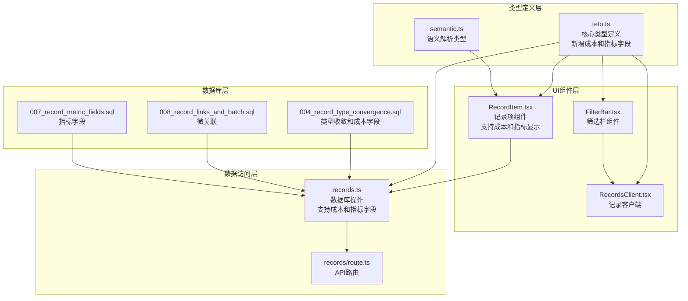
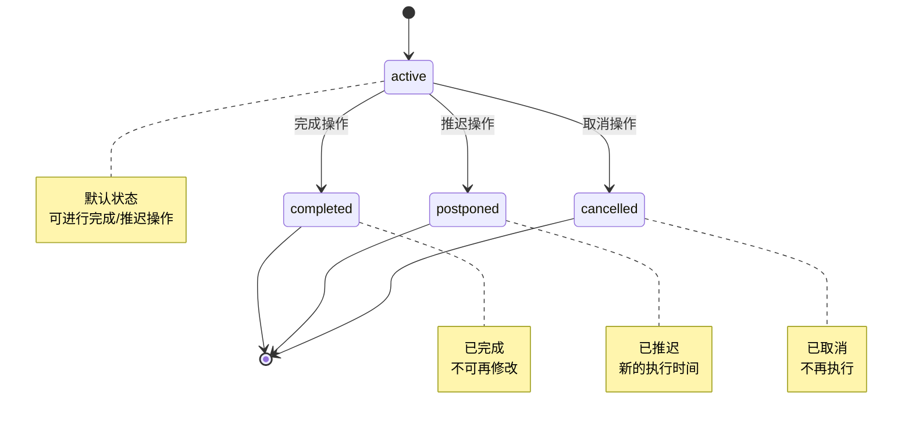
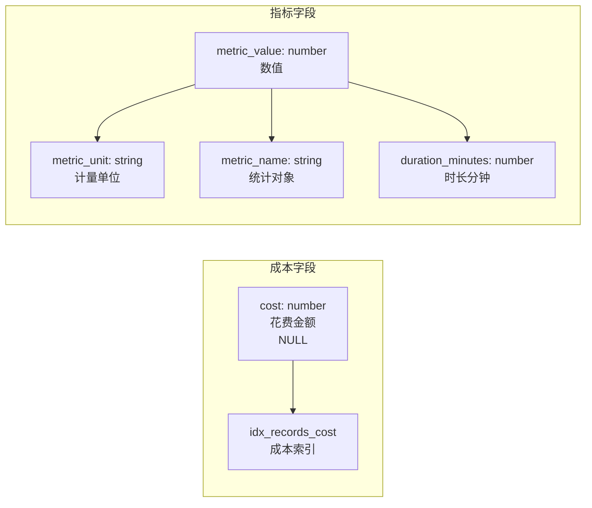
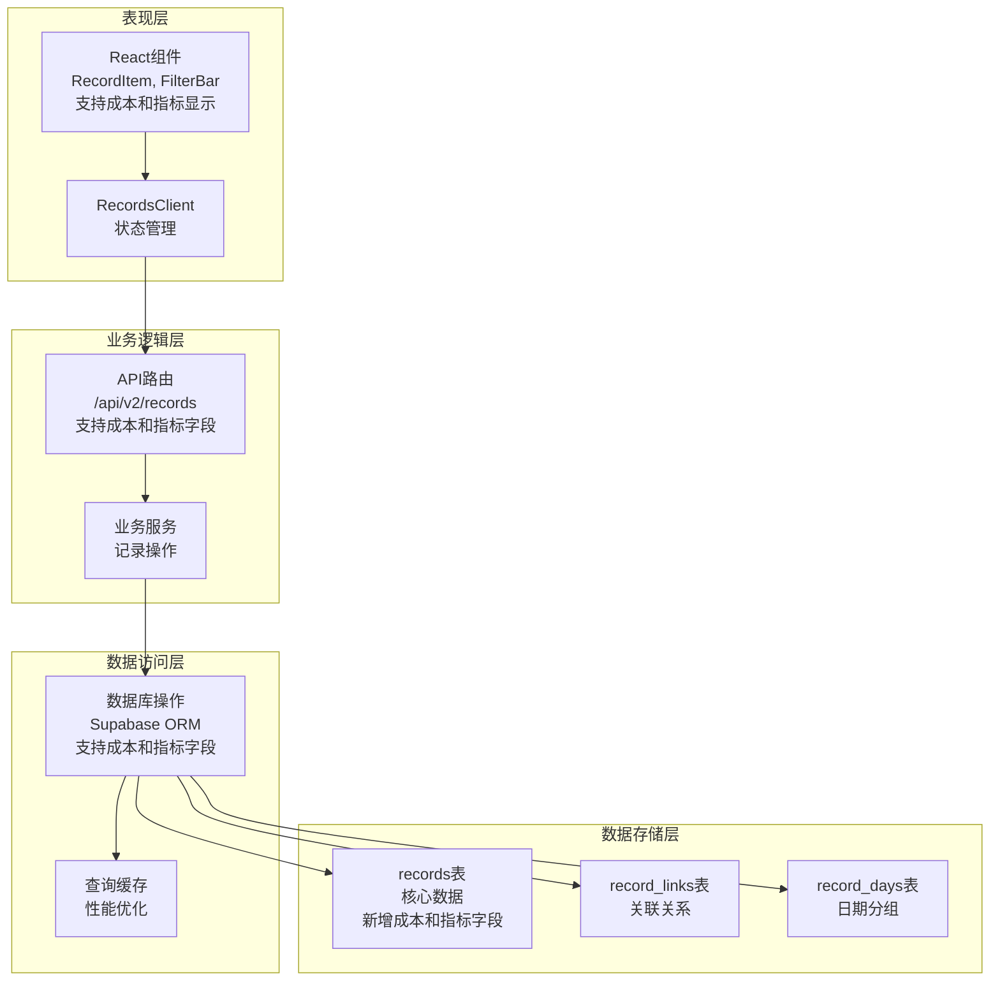
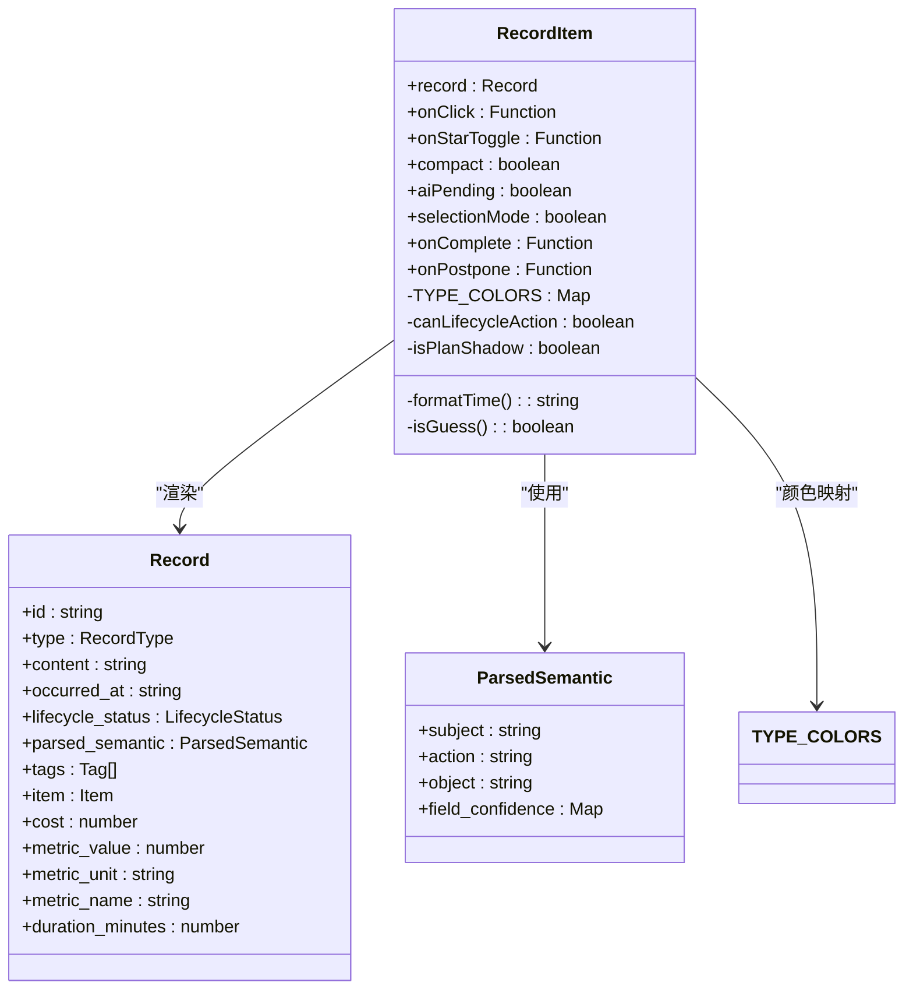
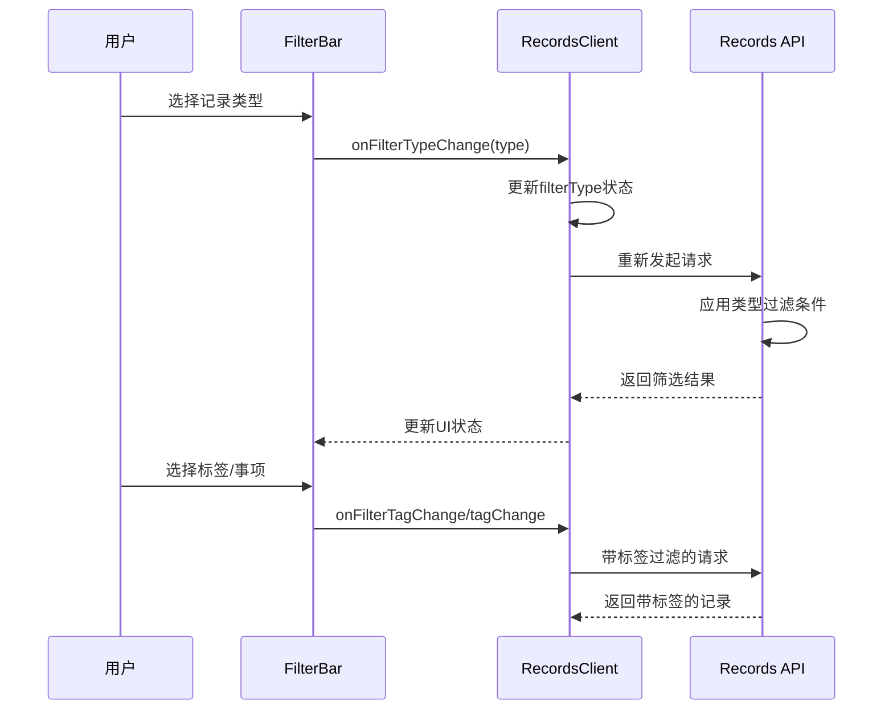
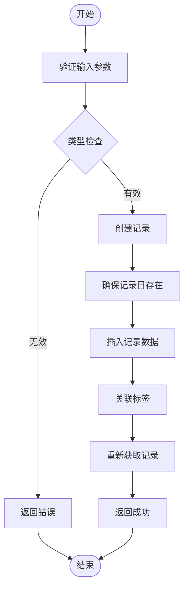
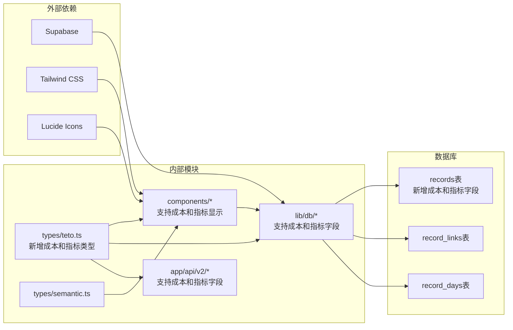

# 记录类型系统

<cite>
**本文档引用的文件**
- [teto.ts](file://src/types/teto.ts)
- [semantic.ts](file://src/types/semantic.ts)
- [RecordItem.tsx](file://src/app/(dashboard)/records/components/RecordItem.tsx)
- [FilterBar.tsx](file://src/app/(dashboard)/records/components/FilterBar.tsx)
- [RecordsClient.tsx](file://src/app/(dashboard)/records/RecordsClient.tsx)
- [records.ts](file://src/lib/db/records.ts)
- [records/route.ts](file://src/app/api/v2/records/route.ts)
- [complete/route.ts](file://src/app/api/v2/records/[id]/complete/route.ts)
- [postpone/route.ts](file://src/app/api/v2/records/[id]/postpone/route.ts)
- [004_teto_1_4_record_type_convergence.sql](file://sql/004_teto_1_4_record_type_convergence.sql)
- [008_record_links_and_batch.sql](file://sql/008_record_links_and_batch.sql)
- [007_record_metric_fields.sql](file://sql/007_record_metric_fields.sql)
- [QuickInput.tsx](file://src/app/(dashboard)/records/components/QuickInput.tsx)
</cite>

## 更新摘要
**变更内容**
- 记录类型系统标准化为4种标准类型：发生、计划、想法、总结
- 新增成本字段（cost）支持，用于记录花费金额
- 新增指标字段支持，包括 metric_value、metric_unit、metric_name、duration_minutes
- 改进了记录类型约束，限制type字段只能为4个标准值之一
- 增强了记录的量化统计能力

## 目录
1. [简介](#简介)
2. [项目结构](#项目结构)
3. [核心组件](#核心组件)
4. [架构概览](#架构概览)
5. [详细组件分析](#详细组件分析)
6. [依赖分析](#依赖分析)
7. [性能考虑](#性能考虑)
8. [故障排除指南](#故障排除指南)
9. [结论](#结论)

## 简介

TETO记录类型系统是个人效率追踪平台的核心数据模型，定义了四种标准化的记录类型来覆盖个人成长的各个维度。该系统通过统一的类型体系实现了行为追踪、任务管理和思维沉淀的有机结合。

系统采用"发生-计划-想法-总结"四类型架构，每种类型都有明确的定义边界、数据结构和业务逻辑。通过生命周期状态管理和微关联机制，实现了记录间的智能连接和流转。

**更新** 系统现已标准化为4种核心记录类型，并新增了成本和指标字段支持，增强了量化统计能力。

## 项目结构

记录类型系统主要分布在以下层次：

**图表来源**
- [teto.ts:12-19](file://src/types/teto.ts#L12-L19)
- [RecordItem.tsx](file://src/app/(dashboard)/records/components/RecordItem.tsx#L10-L15)
- [records.ts:1-50](file://src/lib/db/records.ts#L1-L50)

**章节来源**
- [teto.ts:1-516](file://src/types/teto.ts#L1-L516)
- [RecordItem.tsx](file://src/app/(dashboard)/records/components/RecordItem.tsx#L1-L261)
- [records.ts:1-328](file://src/lib/db/records.ts#L1-L328)

## 核心组件

### 记录类型枚举

系统定义了四个核心记录类型，每个类型都有特定的用途和特征：

| 类型 | 颜色编码 | 用途 | 关键特征 | 新增字段支持 |
|------|----------|------|----------|-------------|
| 发生 | 绿色 | 已完成的行为记录 | 实际发生的事件，有具体的时间戳 | ✅ 成本字段 ✅ 指标字段 |
| 计划 | 蓝色 | 待执行的任务计划 | 未来将要执行的活动，支持生命周期管理 | ✅ 成本字段 ✅ 指标字段 |
| 想法 | 橙色 | 思维记录和灵感 | 创造性思维产物，可作为后续行动的起点 | ✅ 成本字段 ✅ 指标字段 |
| 总结 | 灰色 | 反思和学习成果 | 对过往经验的整理和提炼 | ✅ 成本字段 ✅ 指标字段 |

### 生命周期状态管理

记录类型系统引入了独立的生命周期状态，专门用于计划类记录的状态流转：

**图表来源**
- [teto.ts:18-19](file://src/types/teto.ts#L18-L19)
- [008_record_links_and_batch.sql:30-31](file://sql/008_record_links_and_batch.sql#L30-L31)

### 微关联机制

记录间建立了四种类型的关联关系，支持复杂的知识网络构建：

| 关联类型 | 描述 | 使用场景 |
|----------|------|----------|
| completes | 完成关系 | 计划→发生，表示任务完成 |
| derived_from | 演生关系 | 同源拆分，内容衍生 |
| postponed_from | 推迟关系 | 计划推迟，时间变更 |
| related_to | 通用关系 | 任意记录间的关联 |

### 成本和指标字段系统

**更新** 新增的成本和指标字段系统，为记录提供了强大的量化统计能力：

**图表来源**
- [004_teto_1_4_record_type_convergence.sql:7-11](file://sql/004_teto_1_4_record_type_convergence.sql#L7-L11)
- [007_record_metric_fields.sql:8-19](file://sql/007_record_metric_fields.sql#L8-L19)

**章节来源**
- [teto.ts:15-16](file://src/types/teto.ts#L15-L16)
- [008_record_links_and_batch.sql:12-16](file://sql/008_record_links_and_batch.sql#L12-L16)

## 架构概览

记录类型系统采用分层架构设计，确保了良好的可扩展性和维护性：

**图表来源**
- [RecordItem.tsx](file://src/app/(dashboard)/records/components/RecordItem.tsx#L62-L95)
- [records.ts:176-300](file://src/lib/db/records.ts#L176-L300)
- [records/route.ts:7-42](file://src/app/api/v2/records/route.ts#L7-L42)

## 详细组件分析

### 记录项组件（RecordItem）

RecordItem组件负责展示单条记录的完整信息，实现了类型驱动的视觉呈现：

**图表来源**
- [RecordItem.tsx](file://src/app/(dashboard)/records/components/RecordItem.tsx#L35-L51)
- [teto.ts:37-74](file://src/types/teto.ts#L37-L74)
- [semantic.ts:18-43](file://src/types/semantic.ts#L18-L43)

#### 视觉设计规范

组件实现了严格的视觉层次和交互设计：

**颜色编码系统**：
- 发生：绿色主题，表示已完成
- 计划：蓝色主题，表示待执行
- 想法：橙色主题，表示创意内容
- 总结：灰色主题，表示反思成果

**交互状态**：
- 悬停效果：阴影增强
- 选中状态：蓝色边框
- 投影状态：半透明背景（未来计划）
- 多选模式：勾选框显示

**新增字段显示**：
- 成本字段：💰 符号显示花费金额
- 指标字段：📊 显示统计数值和单位
- 时长字段：⏱ 显示活动持续时间
- 人物字段：👥 显示参与人员
- 地点字段：📍 显示活动地点

**章节来源**
- [RecordItem.tsx](file://src/app/(dashboard)/records/components/RecordItem.tsx#L10-L95)

### 筛选栏组件（FilterBar）

FilterBar提供了直观的记录筛选界面，支持多维度过滤：

**图表来源**
- [FilterBar.tsx](file://src/app/(dashboard)/records/components/FilterBar.tsx#L18-L27)
- [RecordsClient.tsx](file://src/app/(dashboard)/records/RecordsClient.tsx#L68-L70)

#### 筛选机制

组件支持三种主要筛选维度：

1. **类型筛选**：全类型按钮 + 四种具体类型
2. **标签筛选**：动态加载的标签下拉框
3. **事项筛选**：关联项目的快速选择

**章节来源**
- [FilterBar.tsx](file://src/app/(dashboard)/records/components/FilterBar.tsx#L49-L102)

### 数据库操作层

数据库层实现了完整的记录生命周期管理：

**图表来源**
- [records.ts:11-46](file://src/lib/db/records.ts#L11-L46)
- [records/route.ts:44-85](file://src/app/api/v2/records/route.ts#L44-L85)

#### 记录创建流程

数据库操作遵循严格的创建流程：

1. **记录日管理**：自动创建或获取对应日期的记录日
2. **默认值设置**：type默认为"发生"，sort_order为0，is_starred为false
3. **标签关联**：可选的标签批量关联
4. **数据完整性**：重新获取完整记录信息

**更新** 新增对成本和指标字段的支持，所有字段均可选地写入数据库。

**章节来源**
- [records.ts:11-46](file://src/lib/db/records.ts#L11-L46)
- [records.ts:176-300](file://src/lib/db/records.ts#L176-L300)

### API路由层

API层提供了RESTful接口，支持完整的CRUD操作：

| 端点 | 方法 | 功能 | 参数 |
|------|------|------|------|
| `/api/v2/records` | GET | 获取记录列表 | date/date_from/date_to/type/tag_id/is_starred/search/limit |
| `/api/v2/records` | POST | 创建记录 | CreateRecordPayload **新增：cost、metric_value、metric_unit、metric_name、duration_minutes** |
| `/api/v2/records/:id` | PUT | 更新记录 | UpdateRecordPayload **新增：cost、metric_value、metric_unit、metric_name、duration_minutes** |
| `/api/v2/records/:id` | DELETE | 删除记录 | - |
| `/api/v2/records/:id/complete` | POST | 完成计划 | - |
| `/api/v2/records/:id/postpone` | POST | 推迟计划 | new_date |

**更新** API接口现已支持成本和指标字段的创建和更新。

**章节来源**
- [records/route.ts:7-42](file://src/app/api/v2/records/route.ts#L7-L42)
- [complete/route.ts:15-35](file://src/app/api/v2/records/[id]/complete/route.ts#L15-L35)

## 依赖分析

记录类型系统展现了清晰的依赖关系和模块化设计：

**图表来源**
- [teto.ts:1-10](file://src/types/teto.ts#L1-L10)
- [RecordItem.tsx](file://src/app/(dashboard)/records/components/RecordItem.tsx#L3-L5)

### 核心依赖关系

1. **类型定义依赖**：所有组件都依赖类型定义文件，**更新** 现在包含成本和指标字段类型
2. **UI组件依赖**：组件层依赖类型定义和样式库
3. **数据访问依赖**：数据库操作依赖Supabase客户端
4. **API依赖**：前端组件依赖后端API接口

**章节来源**
- [teto.ts:1-26](file://src/types/teto.ts#L1-L26)
- [RecordItem.tsx](file://src/app/(dashboard)/records/components/RecordItem.tsx#L1-L10)

## 性能考虑

记录类型系统在设计时充分考虑了性能优化：

### 查询优化策略

1. **索引设计**：为常用查询字段建立索引
   - `records.type`：类型过滤
   - `records.date`：日期范围查询
   - `records.item_id`：项目关联查询
   - **新增** `records.cost`：花费字段查询索引

2. **批量操作**：支持批量删除和标签关联
3. **延迟加载**：关联数据按需加载
4. **缓存策略**：合理利用浏览器缓存

### 内存管理

1. **虚拟滚动**：大量记录时使用虚拟滚动
2. **状态管理**：合理的状态分割和更新
3. **组件卸载**：及时清理事件监听器

**更新** 新增成本字段索引优化，提升花费相关查询性能。

## 故障排除指南

### 常见问题及解决方案

**记录类型不显示**
- 检查类型枚举定义是否正确
- 验证数据库约束是否生效
- 确认前端颜色映射配置

**筛选功能失效**
- 检查API参数传递
- 验证数据库查询条件
- 确认权限验证逻辑

**生命周期状态异常**
- 检查状态转换逻辑
- 验证API调用流程
- 确认数据库状态字段

**成本和指标字段显示异常**
- 检查字段类型定义
- 验证数据库字段是否存在
- 确认前端渲染逻辑

**更新** 新增成本和指标字段相关的故障排除指导。

**章节来源**
- [complete/route.ts:29-35](file://src/app/api/v2/records/[id]/complete/route.ts#L29-L35)
- [records.ts:176-300](file://src/lib/db/records.ts#L176-L300)

## 结论

TETO记录类型系统通过标准化的四类型架构，为个人效率追踪提供了完整的数据模型支撑。系统不仅实现了基础的记录管理功能，更重要的是建立了智能化的知识关联网络。

### 系统优势

1. **概念清晰**：四种类型覆盖个人成长的主要场景
2. **扩展性强**：微关联机制支持复杂的关系网络
3. **用户体验佳**：直观的颜色编码和交互设计
4. **性能优化**：合理的数据库设计和查询策略
5. **量化能力强**：新增成本和指标字段支持精细化统计

### 未来发展

系统具备良好的扩展基础，可以支持：
- 更多记录类型的扩展
- 自定义字段和标签系统
- 智能推荐和关联建议
- 高级分析和洞察功能
- **新增** 成本和指标的深度分析功能

通过持续优化和迭代，TETO记录类型系统将成为个人知识管理的重要基础设施。