# 记录编辑功能

<cite>
**本文引用的文件**
- [RecordEditDrawer.tsx](file://src/app/(dashboard)/records/components/RecordEditDrawer.tsx)
- [teto.ts](file://src/types/teto.ts)
- [record-links.ts](file://src/lib/db/record-links.ts)
- [records_[id]_route.ts](file://src/app/api/v2/records/[id]/route.ts)
- [records_route.ts](file://src/app/api/v2/records/route.ts)
- [record-links_route.ts](file://src/app/api/v2/record-links/route.ts)
</cite>

## 目录
1. [简介](#简介)
2. [项目结构](#项目结构)
3. [核心组件](#核心组件)
4. [架构概览](#架构概览)
5. [详细组件分析](#详细组件分析)
6. [依赖分析](#依赖分析)
7. [性能考虑](#性能考虑)
8. [故障排除指南](#故障排除指南)
9. [结论](#结论)
10. [附录](#附录)

## 简介

RecordEditDrawer 是 TETO 应用中的抽屉式记录编辑器，提供了完整的记录编辑、验证、保存和删除功能。该组件实现了现代化的用户体验设计，支持多种记录类型、结构化数据字段、标签管理、关联记录以及实时预览功能。

本功能的核心特性包括：
- 实时表单渲染和数据绑定
- 多种记录类型的智能切换
- 结构化详情字段的紧凑输入
- 关联记录的搜索和管理
- 标签系统的可视化选择
- 完整的错误处理和状态反馈

## 项目结构

RecordEditDrawer 组件位于应用的记录管理模块中，采用模块化的文件组织方式：

```mermaid
graph TB
subgraph "记录编辑模块"
A[RecordEditDrawer.tsx] --> B[RecordEditDrawer 主组件]
A --> C[CompactInput 紧凑输入组件]
subgraph "类型定义"
D[teto.ts] --> E[Record 接口]
D --> F[RecordType 枚举]
D --> G[UpdateRecordPayload]
end
subgraph "API 层"
H[records/[id]/route.ts] --> I[PUT 更新记录]
H --> J[DELETE 删除记录]
K[records/route.ts] --> L[GET 查询记录]
K --> M[POST 创建记录]
N[record-links/route.ts] --> O[关联记录 API]
end
subgraph "数据库层"
P[record-links.ts] --> Q[创建关联]
P --> R[查询关联]
P --> S[删除关联]
end
end
```

**图表来源**
- [RecordEditDrawer.tsx:1-561](file://src/app/(dashboard)/records/components/RecordEditDrawer.tsx#L1-L561)
- [teto.ts:37-192](file://src/types/teto.ts#L37-L192)
- [records_[id]_route.ts:30-67](file://src/app/api/v2/records/[id]/route.ts#L30-L67)

**章节来源**
- [RecordEditDrawer.tsx:1-561](file://src/app/(dashboard)/records/components/RecordEditDrawer.tsx#L1-L561)
- [teto.ts:1-516](file://src/types/teto.ts#L1-L516)

## 核心组件

### RecordEditDrawer 主组件

RecordEditDrawer 是一个功能完整的抽屉式编辑器，支持以下核心功能：

#### 状态管理架构

组件使用 React Hooks 实现状态管理，包括：

```mermaid
flowchart TD
A[初始状态] --> B[基础字段状态]
B --> C[结构化字段状态]
C --> D[关联记录状态]
D --> E[保存状态]
E --> F[删除状态]
B --> G[content: string]
B --> H[type: RecordType]
B --> I[selectedTagIds: string[]]
B --> J[selectedItemId: string]
B --> K[occurredAt: string]
C --> L[mood: string]
C --> M[energy: string]
C --> N[status: string]
C --> O[note: string]
C --> P[location: string]
C --> Q[peopleStr: string]
C --> R[cost: string]
C --> S[metricFields]
D --> T[linkedRecords: RecordLinkWithPeer[]]
D --> U[linkSearch: string]
D --> V[linkSearchResults: SearchResult[]]
```

**图表来源**
- [RecordEditDrawer.tsx:66-111](file://src/app/(dashboard)/records/components/RecordEditDrawer.tsx#L66-L111)

#### 编辑模式切换机制

组件支持四种记录类型（发生、计划、想法、总结）的智能切换：

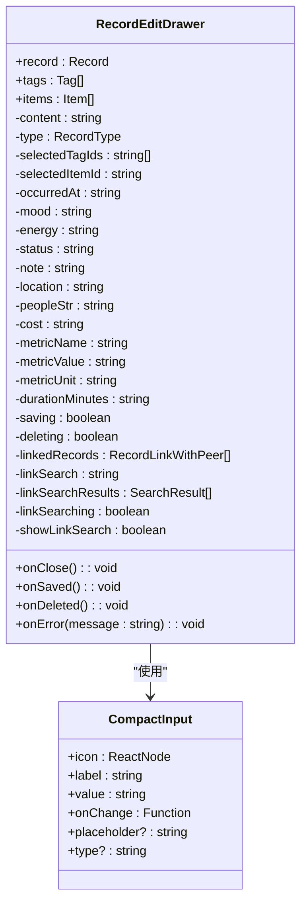

**图表来源**
- [RecordEditDrawer.tsx:47-65](file://src/app/(dashboard)/records/components/RecordEditDrawer.tsx#L47-L65)
- [RecordEditDrawer.tsx:12-42](file://src/app/(dashboard)/records/components/RecordEditDrawer.tsx#L12-L42)

**章节来源**
- [RecordEditDrawer.tsx:47-111](file://src/app/(dashboard)/records/components/RecordEditDrawer.tsx#L47-L111)

## 架构概览

RecordEditDrawer 采用了清晰的分层架构设计，确保了良好的可维护性和扩展性：

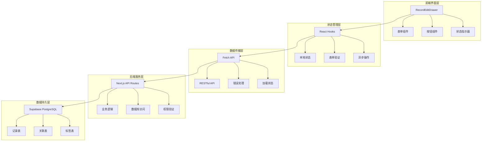

**图表来源**
- [RecordEditDrawer.tsx:174-249](file://src/app/(dashboard)/records/components/RecordEditDrawer.tsx#L174-L249)
- [records_[id]_route.ts:30-67](file://src/app/api/v2/records/[id]/route.ts#L30-L67)

## 详细组件分析

### 表单渲染与数据绑定

RecordEditDrawer 实现了完整的表单渲染系统，支持多种输入类型和数据绑定机制：

#### 核心内容区域

内容编辑区域采用大文本框设计，支持多行输入和自动调整高度：

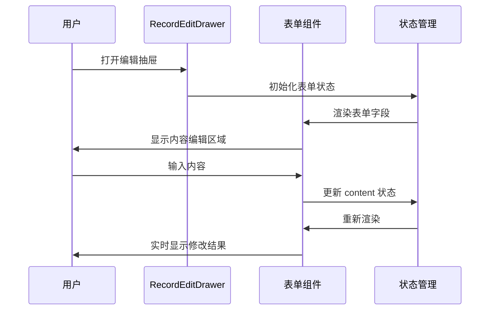

**图表来源**
- [RecordEditDrawer.tsx:291-300](file://src/app/(dashboard)/records/components/RecordEditDrawer.tsx#L291-L300)

#### 基础属性区域

基础属性区域包含记录类型、时间和关联事项的选择功能：

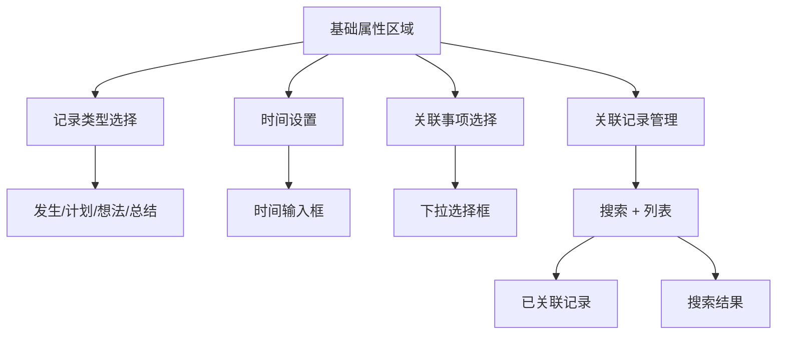

**图表来源**
- [RecordEditDrawer.tsx:305-427](file://src/app/(dashboard)/records/components/RecordEditDrawer.tsx#L305-L427)

#### 结构化详情区域

结构化详情区域提供了紧凑的输入组件，支持多种度量字段：

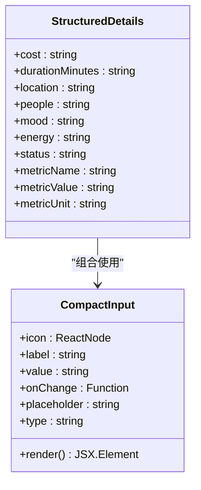

**图表来源**
- [RecordEditDrawer.tsx:434-504](file://src/app/(dashboard)/records/components/RecordEditDrawer.tsx#L434-L504)

**章节来源**
- [RecordEditDrawer.tsx:291-504](file://src/app/(dashboard)/records/components/RecordEditDrawer.tsx#L291-L504)

### 关联记录管理系统

RecordEditDrawer 实现了完整的关联记录管理功能，支持搜索、添加和删除操作：

#### 关联记录 API 流程

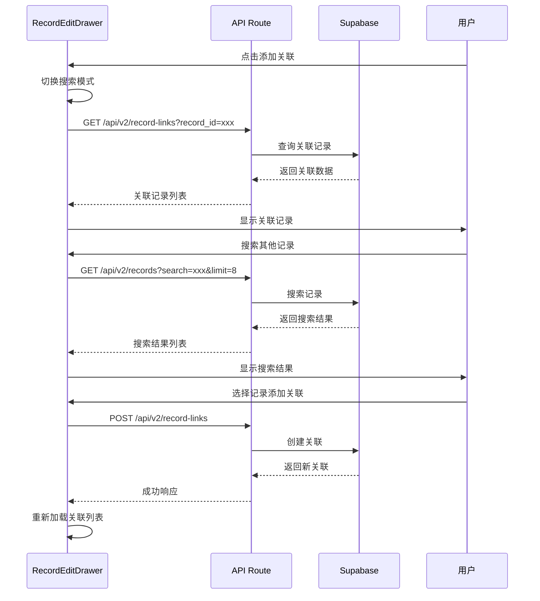

**图表来源**
- [RecordEditDrawer.tsx:101-165](file://src/app/(dashboard)/records/components/RecordEditDrawer.tsx#L101-L165)
- [record-links_route.ts:55-74](file://src/app/api/v2/record-links/route.ts#L55-L74)

#### 关联记录数据模型

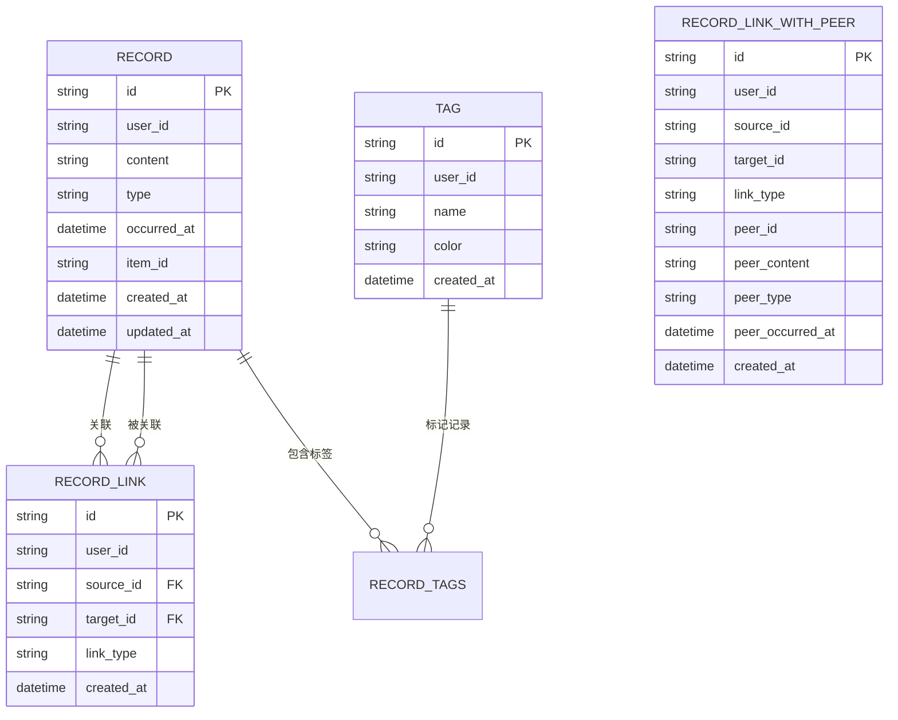

**图表来源**
- [teto.ts:37-121](file://src/types/teto.ts#L37-L121)
- [record-links.ts:32-37](file://src/lib/db/record-links.ts#L32-L37)

**章节来源**
- [RecordEditDrawer.tsx:93-165](file://src/app/(dashboard)/records/components/RecordEditDrawer.tsx#L93-L165)
- [record-links.ts:43-80](file://src/lib/db/record-links.ts#L43-L80)

### 数据绑定与验证机制

RecordEditDrawer 实现了完整的数据绑定和验证机制，确保数据的完整性和一致性：

#### 字段级更新机制

```mermaid
flowchart TD
A[用户输入] --> B[onChange 处理]
B --> C[状态更新]
C --> D[数据转换]
D --> E[格式验证]
E --> F[条件处理]
F --> G[准备保存]
B --> H[peopleStr 处理]
H --> I[分割字符串]
I --> J[去除空白]
J --> K[过滤空值]
B --> L[cost 处理]
L --> M[parseFloat 转换]
M --> N[null 处理]
B --> O[occurredAt 处理]
O --> P[时间格式化]
P --> Q[时区转换]
```

**图表来源**
- [RecordEditDrawer.tsx:178-208](file://src/app/(dashboard)/records/components/RecordEditDrawer.tsx#L178-L208)

#### 保存流程

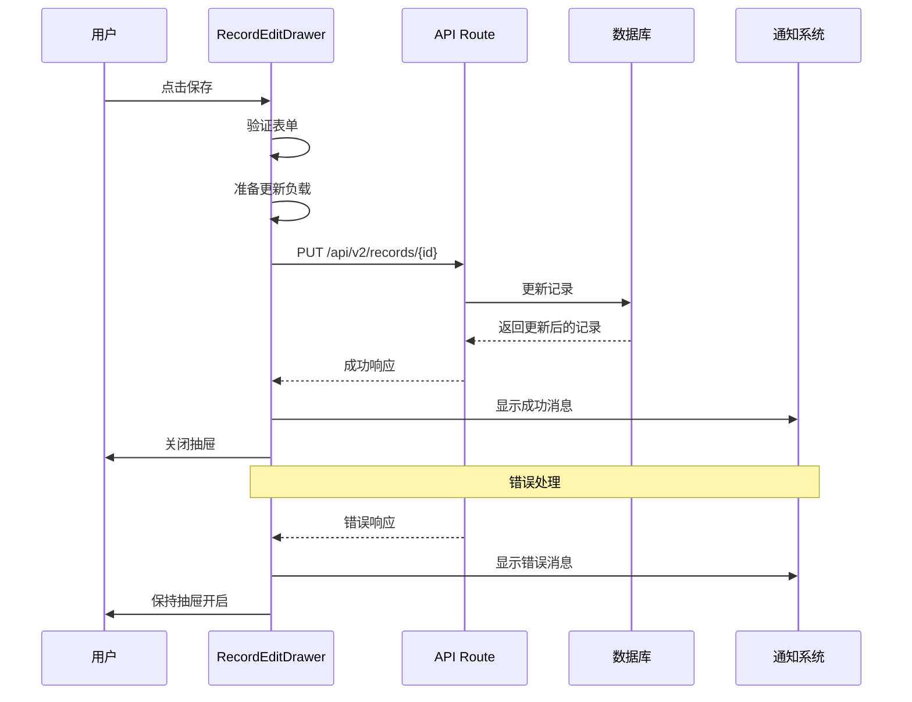

**图表来源**
- [RecordEditDrawer.tsx:174-229](file://src/app/(dashboard)/records/components/RecordEditDrawer.tsx#L174-L229)
- [records_[id]_route.ts:30-67](file://src/app/api/v2/records/[id]/route.ts#L30-L67)

**章节来源**
- [RecordEditDrawer.tsx:174-229](file://src/app/(dashboard)/records/components/RecordEditDrawer.tsx#L174-L229)
- [records_[id]_route.ts:30-67](file://src/app/api/v2/records/[id]/route.ts#L30-L67)

### 版本控制与冲突处理

虽然当前实现没有显式的版本控制机制，但组件设计考虑了并发编辑的潜在冲突：

#### 冲突检测策略

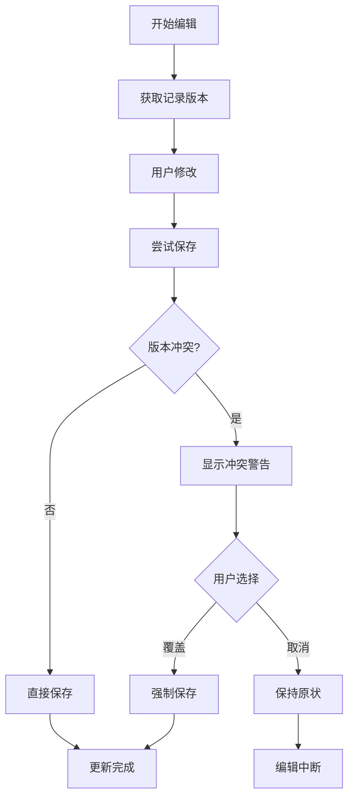

**图表来源**
- [records_[id]_route.ts:58-59](file://src/app/api/v2/records/[id]/route.ts#L58-L59)

## 依赖分析

RecordEditDrawer 组件的依赖关系展现了清晰的模块化设计：

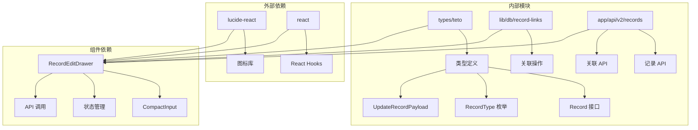

**图表来源**
- [RecordEditDrawer.tsx:3-8](file://src/app/(dashboard)/records/components/RecordEditDrawer.tsx#L3-L8)
- [teto.ts:12-192](file://src/types/teto.ts#L12-L192)

**章节来源**
- [RecordEditDrawer.tsx:3-8](file://src/app/(dashboard)/records/components/RecordEditDrawer.tsx#L3-L8)
- [teto.ts:12-192](file://src/types/teto.ts#L12-L192)

## 性能考虑

RecordEditDrawer 在设计时充分考虑了性能优化，采用了多种策略来提升用户体验：

### 渲染优化

- **局部状态管理**：使用 React Hooks 将状态集中在组件内部，避免不必要的全局状态更新
- **条件渲染**：根据数据存在性动态渲染区块，减少 DOM 元素数量
- **懒加载**：关联记录在需要时才加载，避免初始渲染负担

### 网络优化

- **防抖搜索**：关联记录搜索实现防抖机制，减少 API 调用频率
- **缓存策略**：利用浏览器缓存和 React 状态缓存减少重复请求
- **批量操作**：支持批量删除和更新操作，提高效率

### 内存管理

- **及时清理**：组件卸载时清理定时器和事件监听器
- **状态重置**：关闭抽屉时重置所有表单状态，释放内存

## 故障排除指南

### 常见问题及解决方案

#### 保存失败

**症状**：点击保存按钮后出现错误提示

**可能原因**：
1. 网络连接问题
2. 权限不足
3. 数据验证失败
4. 服务器错误

**解决步骤**：
1. 检查网络连接状态
2. 确认用户已登录且具有相应权限
3. 验证必填字段是否填写完整
4. 查看浏览器开发者工具中的错误信息

#### 关联记录加载失败

**症状**：关联记录区域显示加载中或空白

**解决方法**：
1. 检查 API 端点 `/api/v2/record-links` 是否正常工作
2. 验证记录 ID 是否有效
3. 确认用户对相关记录的访问权限

#### 表单验证错误

**症状**：某些字段无法保存或显示验证错误

**检查要点**：
1. 确认数据类型正确（数字字段使用数值类型）
2. 检查字符串长度限制
3. 验证必填字段完整性

**章节来源**
- [RecordEditDrawer.tsx:220-228](file://src/app/(dashboard)/records/components/RecordEditDrawer.tsx#L220-L228)
- [records_[id]_route.ts:60-66](file://src/app/api/v2/records/[id]/route.ts#L60-L66)

## 结论

RecordEditDrawer 抽屉式编辑器是一个功能完整、设计精良的记录编辑组件。它成功地将复杂的编辑功能封装在一个直观易用的界面中，为用户提供了流畅的编辑体验。

### 主要优势

1. **用户体验优秀**：抽屉式设计充分利用移动端屏幕空间，提供沉浸式编辑体验
2. **功能完整**：支持所有记录相关的编辑操作，包括基础字段、结构化数据、标签和关联管理
3. **性能优化**：采用多种优化策略确保快速响应和流畅交互
4. **错误处理完善**：提供友好的错误提示和恢复机制

### 改进建议

1. **版本控制**：考虑实现基于时间戳或版本号的冲突检测机制
2. **撤销重做**：添加撤销重做功能提升编辑灵活性
3. **快捷操作**：增加键盘快捷键支持提高编辑效率
4. **实时预览**：增强内容预览功能帮助用户更好地编辑

## 附录

### API 使用示例

#### 打开编辑抽屉

```typescript
// 在父组件中调用
const openEditDrawer = (record: Record) => {
  // 设置抽屉状态为 true
  // 传递 record 数据
  // 触发渲染
};
```

#### 处理编辑事件

```typescript
// 保存事件处理
const handleSave = async () => {
  // 验证表单
  // 准备更新负载
  // 调用 API
  // 处理响应
};

// 删除事件处理
const handleDelete = async () => {
  // 确认删除
  // 调用删除 API
  // 处理响应
};
```

#### 保存更改

```typescript
// 字段更新处理
const handleFieldChange = (field: string, value: any) => {
  // 更新对应状态
  // 触发重新渲染
};
```

### 最佳实践

1. **状态管理**：使用受控组件模式确保状态一致性
2. **错误处理**：提供清晰的错误提示和恢复选项
3. **性能优化**：合理使用 useMemo 和 useCallback 优化渲染
4. **用户体验**：提供即时反馈和加载状态指示
5. **数据验证**：在客户端和服务端都进行数据验证
6. **安全考虑**：确保所有操作都有适当的权限检查