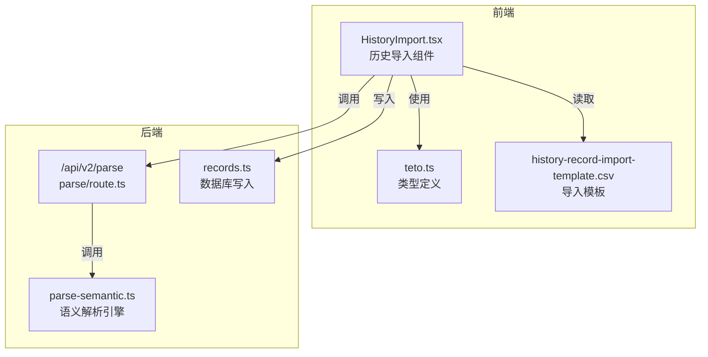
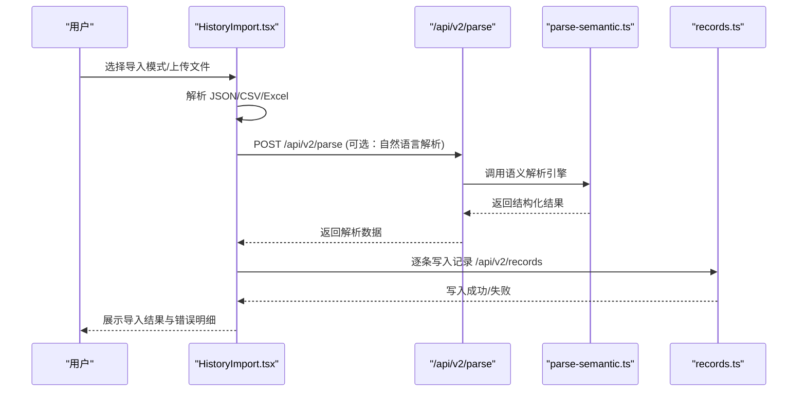
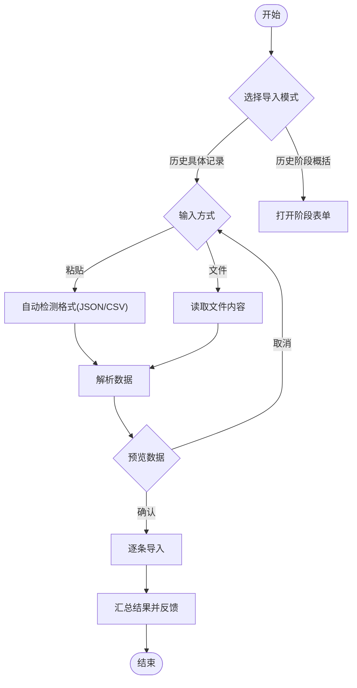
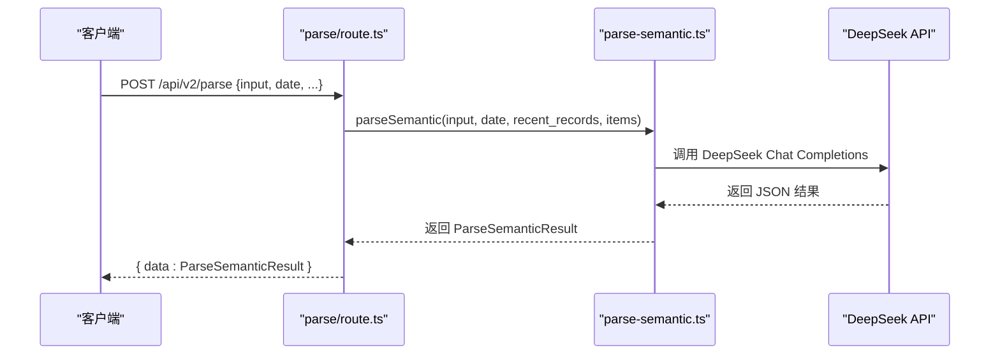
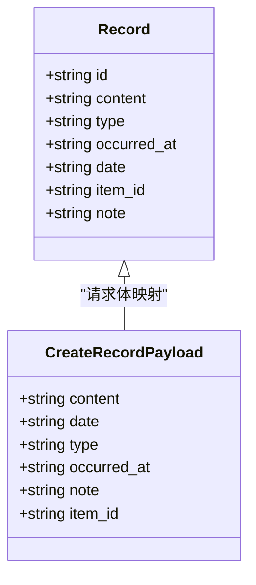
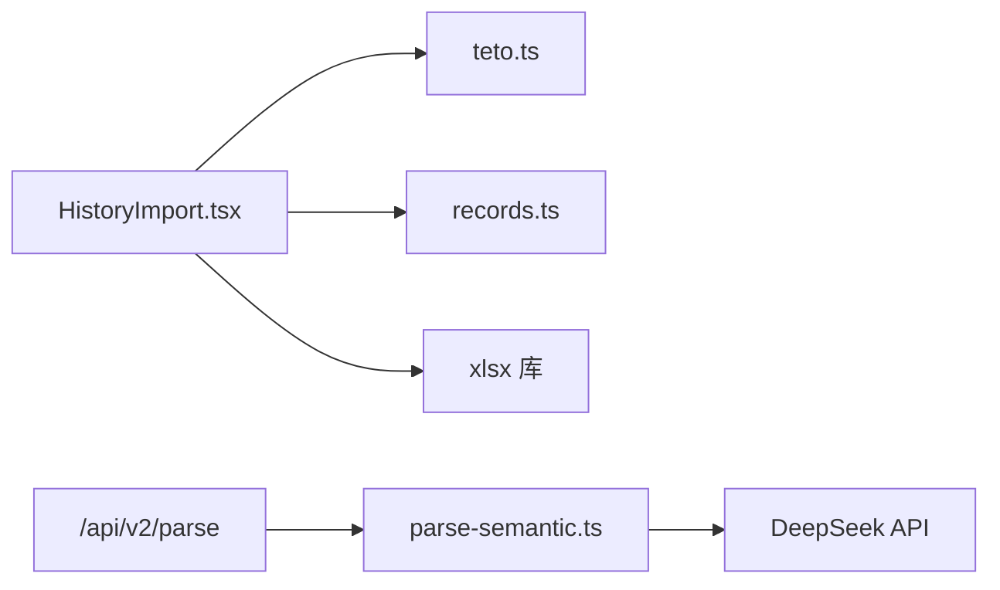

# 历史导入

<cite>
**本文引用的文件**
- [HistoryImport.tsx](file://src/app/(dashboard)/items/components/HistoryImport.tsx)
- [route.ts](file://src/app/api/v2/parse/route.ts)
- [parse-semantic.ts](file://src/lib/ai/parse-semantic.ts)
- [teto.ts](file://src/types/teto.ts)
- [records.ts](file://src/lib/db/records.ts)
- [history-record-import-template.csv](file://public/templates/history-record-import-template.csv)
- [DATA_RULES.md](file://DATA_RULES.md)
- [README.md](file://README.md)
</cite>

## 目录
1. [简介](#简介)
2. [项目结构](#项目结构)
3. [核心组件](#核心组件)
4. [架构总览](#架构总览)
5. [详细组件分析](#详细组件分析)
6. [依赖分析](#依赖分析)
7. [性能考虑](#性能考虑)
8. [故障排查指南](#故障排查指南)
9. [结论](#结论)
10. [附录](#附录)

## 简介
本文件面向 TETO 历史导入系统，聚焦历史数据的批量导入与解析流程。文档围绕 HistoryImport 组件展开，覆盖 CSV/JSON/Excel 文件上传、数据格式验证、解析引擎调用、逐条导入与进度反馈等环节，并给出文件格式规范、数据映射规则与性能优化策略。同时提供使用解析 API 的示例路径，帮助开发者快速集成与扩展。

## 项目结构
历史导入功能主要由前端组件与后端 API 共同实现：
- 前端组件：HistoryImport.tsx 负责用户交互、数据解析与导入控制
- 后端 API：/api/v2/parse 调用语义解析引擎，将自然语言转为结构化数据
- 类型定义：teto.ts 提供 Record、CreateRecordPayload 等核心类型
- 数据库层：records.ts 实现记录写入与标签关联
- 模板文件：CSV 模板用于指导用户填写

**图表来源**
- [HistoryImport.tsx](file://src/app/(dashboard)/items/components/HistoryImport.tsx#L1-L783)
- [route.ts:1-43](file://src/app/api/v2/parse/route.ts#L1-L43)
- [parse-semantic.ts:1-282](file://src/lib/ai/parse-semantic.ts#L1-L282)
- [records.ts:1-73](file://src/lib/db/records.ts#L1-L73)
- [history-record-import-template.csv:1-3](file://public/templates/history-record-import-template.csv#L1-L3)
- [teto.ts:1-516](file://src/types/teto.ts#L1-L516)

**章节来源**
- [HistoryImport.tsx](file://src/app/(dashboard)/items/components/HistoryImport.tsx#L1-L783)
- [route.ts:1-43](file://src/app/api/v2/parse/route.ts#L1-L43)
- [parse-semantic.ts:1-282](file://src/lib/ai/parse-semantic.ts#L1-L282)
- [records.ts:1-73](file://src/lib/db/records.ts#L1-L73)
- [history-record-import-template.csv:1-3](file://public/templates/history-record-import-template.csv#L1-L3)
- [teto.ts:1-516](file://src/types/teto.ts#L1-L516)

## 核心组件
- HistoryImport 组件：提供“历史具体记录”和“历史阶段概括”两种导入模式，支持 JSON/CSV/Excel 三种输入方式，内置解析与错误提示，并逐条调用后端记录写入接口。
- 解析 API：/api/v2/parse 接收自然语言输入，调用 parse-semantic.ts 引擎，返回结构化解析结果。
- 类型系统：teto.ts 定义 Record、CreateRecordPayload 等类型，确保前后端数据契约一致。
- 数据库层：records.ts 实现记录创建、记录日自动维护与标签关联。

**章节来源**
- [HistoryImport.tsx](file://src/app/(dashboard)/items/components/HistoryImport.tsx#L42-L783)
- [route.ts:12-42](file://src/app/api/v2/parse/route.ts#L12-L42)
- [parse-semantic.ts:209-281](file://src/lib/ai/parse-semantic.ts#L209-L281)
- [teto.ts:133-162](file://src/types/teto.ts#L133-L162)
- [records.ts:11-46](file://src/lib/db/records.ts#L11-L46)

## 架构总览
历史导入的端到端流程如下：

**图表来源**
- [HistoryImport.tsx](file://src/app/(dashboard)/items/components/HistoryImport.tsx#L296-L361)
- [route.ts:12-42](file://src/app/api/v2/parse/route.ts#L12-L42)
- [parse-semantic.ts:209-281](file://src/lib/ai/parse-semantic.ts#L209-L281)
- [records.ts:11-46](file://src/lib/db/records.ts#L11-L46)

## 详细组件分析

### HistoryImport 组件实现原理
- 模式与状态
  - 模式：select/records/phase 三态切换，分别对应“模式选择”“历史具体记录导入”“历史阶段概括导入”
  - 输入方式：paste/file 两态切换，支持 JSON/CSV 粘贴与文件上传
  - 解析状态：isParsing、parseError 控制解析过程与错误提示
  - 导入状态：importing、importResult 控制导入进度与结果汇总
- 数据解析
  - JSON：要求数组格式，每项需包含 content 字段，其余字段可选
  - CSV：自动检测表头，要求包含 content 列，可选 type、occurred_at 等
  - Excel：读取首张工作表，列名不区分大小写，要求包含 content 列
- 记录类型收敛
  - 支持的记录类型收敛为“发生/计划/想法/总结”，并提供常见变体映射
- 日期与时间
  - 优先使用 date 字段作为记录日期；若无，则尝试从 occurred_at 解析；若仍无，则默认当天
  - occurred_at 默认填充为 date 对应日期的 00:00:00 或当前时间
- 导入流程
  - 逐条构造 CreateRecordPayload，调用 /api/v2/records 写入
  - 统计 total/success/failed/errors 并反馈给用户
- 阶段导入
  - 通过 PhaseForm 组件完成历史阶段的创建与保存

**图表来源**
- [HistoryImport.tsx](file://src/app/(dashboard)/items/components/HistoryImport.tsx#L205-L361)

**章节来源**
- [HistoryImport.tsx](file://src/app/(dashboard)/items/components/HistoryImport.tsx#L10-L783)

### 解析 API 与语义引擎
- /api/v2/parse
  - 要求登录态，接收 input、date、recent_records、items 等参数
  - 调用 parseSemantic 执行语义解析，返回结构化结果
  - 对未登录、DeepSeek API 错误等进行分类处理
- parse-semantic.ts
  - 使用 DeepSeek API（兼容 OpenAI 格式）解析自然语言
  - 输出包含 units、relations、confidence 等字段
  - 对返回内容进行校验与修正，确保字段类型与结构合法

**图表来源**
- [route.ts:12-42](file://src/app/api/v2/parse/route.ts#L12-L42)
- [parse-semantic.ts:209-281](file://src/lib/ai/parse-semantic.ts#L209-L281)

**章节来源**
- [route.ts:12-42](file://src/app/api/v2/parse/route.ts#L12-L42)
- [parse-semantic.ts:110-142](file://src/lib/ai/parse-semantic.ts#L110-L142)

### 数据模型与导入映射
- Record 类型
  - 核心字段：content、type、occurred_at、date、item_id、note 等
  - 类型收敛：RECORD_TYPES = ["发生","计划","想法","总结"]
- CreateRecordPayload
  - 用于创建记录的请求体，包含上述字段及可选扩展字段
- 导入映射规则
  - JSON/CSV/Excel 的 content 字段映射到 Record.content
  - type 字段映射到 Record.type（经过类型收敛）
  - occurred_at 与 date 字段共同决定记录时间
  - note 字段映射到 Record.note

**图表来源**
- [teto.ts:37-74](file://src/types/teto.ts#L37-L74)
- [teto.ts:133-162](file://src/types/teto.ts#L133-L162)

**章节来源**
- [teto.ts:12-162](file://src/types/teto.ts#L12-L162)

### 数据库写入与标签关联
- records.ts
  - 自动维护记录日（record_day），确保按日期分桶
  - 支持创建后附加标签（attachTagsToRecord）
  - 返回带关联数据的完整 Record

**章节来源**
- [records.ts:11-46](file://src/lib/db/records.ts#L11-L46)

### 文件格式规范与模板
- CSV 模板字段
  - content、date、type、note
  - 示例见 public/templates/history-record-import-template.csv
- Excel 支持
  - 读取首张工作表，列名不区分大小写
  - content 为必填，其余字段可选
- JSON/CSV 自动识别
  - 通过首字符与逗号分隔判断格式
  - JSON 要求数组格式且每项含 content

**章节来源**
- [history-record-import-template.csv:1-3](file://public/templates/history-record-import-template.csv#L1-L3)
- [HistoryImport.tsx](file://src/app/(dashboard)/items/components/HistoryImport.tsx#L106-L182)

## 依赖分析
- 组件耦合
  - HistoryImport 依赖 teto.ts 的类型定义与 RECORD_TYPES
  - 导入流程依赖 records.ts 的写入能力
- 外部依赖
  - parse-semantic.ts 依赖 DeepSeek API（DEEPSEEK_API_KEY）
  - xlsx 库用于 Excel 解析
- 可能的循环依赖
  - 当前结构清晰，无明显循环依赖风险

**图表来源**
- [HistoryImport.tsx](file://src/app/(dashboard)/items/components/HistoryImport.tsx#L1-L783)
- [records.ts:1-73](file://src/lib/db/records.ts#L1-L73)
- [parse-semantic.ts:110-142](file://src/lib/ai/parse-semantic.ts#L110-L142)

**章节来源**
- [HistoryImport.tsx](file://src/app/(dashboard)/items/components/HistoryImport.tsx#L1-L783)
- [records.ts:1-73](file://src/lib/db/records.ts#L1-L73)
- [parse-semantic.ts:110-142](file://src/lib/ai/parse-semantic.ts#L110-L142)

## 性能考虑
- 导入批处理
  - 当前实现逐条导入，适合中小规模数据；大规模导入建议采用后端批处理接口（如后续扩展）
- 前端解析优化
  - CSV 行解析采用单次扫描，时间复杂度 O(n)；建议对超大文件采用分片读取与进度条
- 网络与并发
  - 逐条写入 /api/v2/records 会触发多次网络请求；可考虑合并请求或服务端批处理
- LLM 调用
  - /api/v2/parse 为一次性调用，建议在前端缓存近期解析结果，减少重复调用

[本节为通用建议，无需特定文件引用]

## 故障排查指南
- 常见错误与定位
  - JSON/CSV 解析失败：检查 content 字段是否缺失、格式是否符合预期
  - Excel 无工作表/无数据：确认文件包含至少一张工作表且有数据行
  - 未登录或鉴权失败：/api/v2/parse 返回 401，检查登录态与环境变量
  - DeepSeek API 错误：/api/v2/parse 返回 502，检查 DEEPSEEK_API_KEY 配置
  - 导入失败：逐条错误列表中包含失败索引与原因，核对对应行数据
- 建议排查步骤
  - 使用模板文件先行验证格式
  - 将数据拆分为小批次导入，定位具体失败行
  - 检查 occurred_at/date 字段的日期格式与合法性

**章节来源**
- [HistoryImport.tsx](file://src/app/(dashboard)/items/components/HistoryImport.tsx#L205-L361)
- [route.ts:31-41](file://src/app/api/v2/parse/route.ts#L31-L41)

## 结论
HistoryImport 组件提供了完整的“历史具体记录”导入能力，涵盖多种输入格式、类型收敛、日期处理与逐条导入反馈。结合 /api/v2/parse 的语义解析能力，可进一步扩展自然语言导入场景。建议在后续版本中引入批处理与错误行提示，以提升大规模数据导入的稳定性与可观测性。

[本节为总结性内容，无需特定文件引用]

## 附录

### 使用解析 API 的示例路径
- 调用地址：POST /api/v2/parse
- 请求体字段
  - input: 必填，待解析的自然语言
  - date: 可选，解析上下文日期
  - recent_records: 可选，近期记录数组，用于语义关联判断
  - items: 可选，事项列表，用于 item_hint 推断
- 返回结构
  - data: ParseSemanticResult，包含 parsed（units、relations、confidence）与 type_hints

**章节来源**
- [route.ts:12-42](file://src/app/api/v2/parse/route.ts#L12-L42)
- [parse-semantic.ts:209-281](file://src/lib/ai/parse-semantic.ts#L209-L281)

### 数据规则与约束参考
- 任务类型与统计口径：参见 DATA_RULES.md
- 项目范围与限制：参见 README.md

**章节来源**
- [DATA_RULES.md:1-174](file://DATA_RULES.md#L1-L174)
- [README.md:115-126](file://README.md#L115-L126)