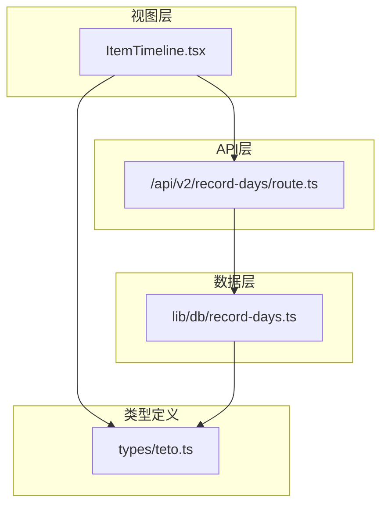
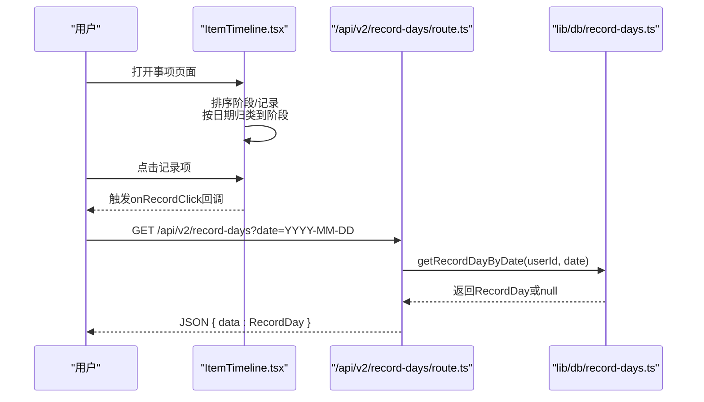
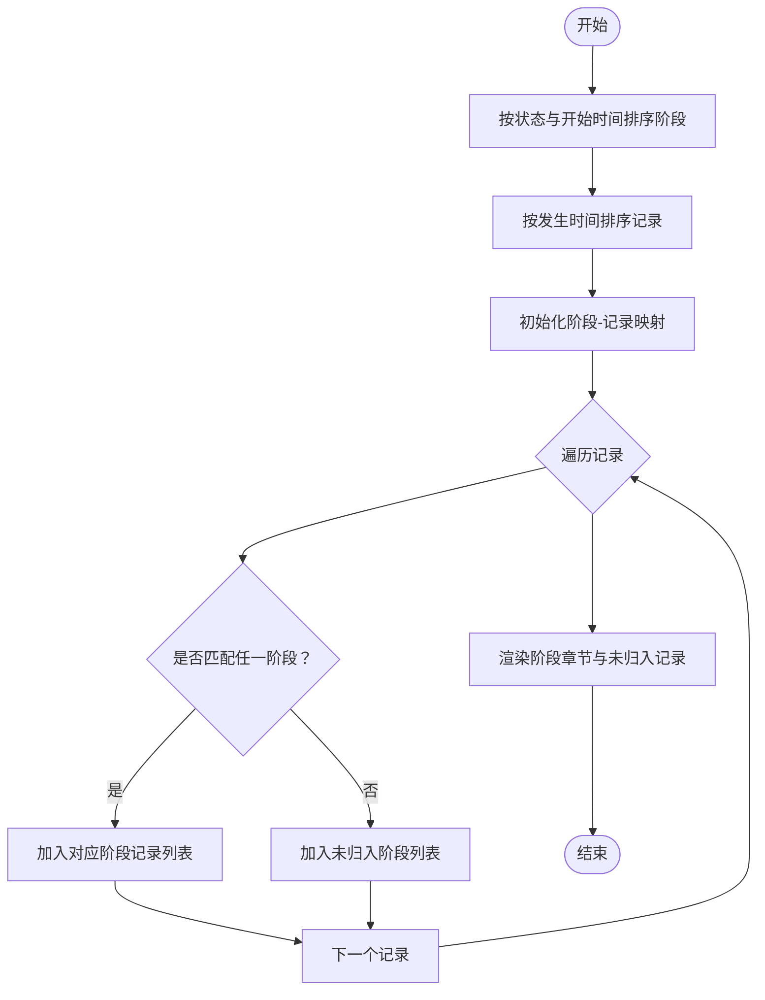
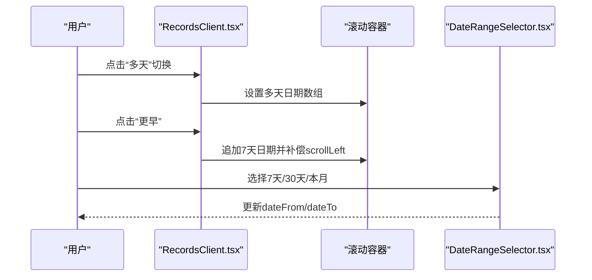
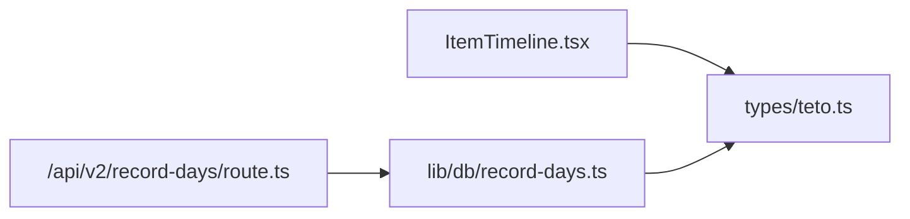
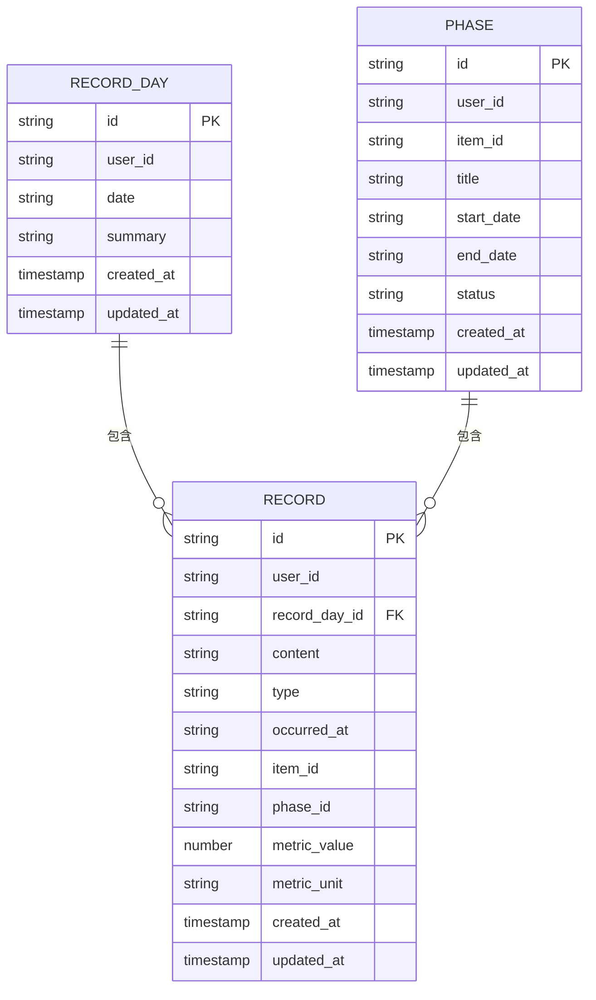

# 时间轴视图

<cite>
**本文引用的文件**
- [ItemTimeline.tsx](file://src/app/(dashboard)/items/components/ItemTimeline.tsx)
- [route.ts](file://src/app/api/v2/record-days/route.ts)
- [record-days.ts](file://src/lib/db/record-days.ts)
- [teto.ts](file://src/types/teto.ts)
- [RecordsClient.tsx](file://src/app/(dashboard)/records/RecordsClient.tsx)
- [DateRangeSelector.tsx](file://src/app/(dashboard)/insights/components/DateRangeSelector.tsx)
- [InsightsClient.tsx](file://src/app/(dashboard)/insights/InsightsClient.tsx)
</cite>

## 目录
1. [简介](#简介)
2. [项目结构](#项目结构)
3. [核心组件](#核心组件)
4. [架构概览](#架构概览)
5. [详细组件分析](#详细组件分析)
6. [依赖分析](#依赖分析)
7. [性能考虑](#性能考虑)
8. [故障排查指南](#故障排查指南)
9. [结论](#结论)
10. [附录](#附录)

## 简介
本文件面向TETO时间轴视图系统，聚焦于“事项”页面中的时间轴展示与交互。内容涵盖：
- ItemTimeline组件的实现原理：时间轴数据获取、时间刻度计算、事件标记渲染、时间范围选择
- 时间轴的滚动交互、缩放功能与事件详情展示机制
- 使用记录天API接口获取时间轴数据的具体方法
- 时间轴布局算法、事件冲突检测与性能优化策略

## 项目结构
时间轴视图主要分布在以下模块：
- 视图层：事项页面的ItemTimeline组件负责阶段与记录的组织与渲染
- API层：记录天接口提供按日期查询/创建/更新记录日的能力
- 数据层：Supabase封装的记录日数据库操作
- 类型定义：统一的数据结构与枚举，确保前后端契约一致

图表来源
- [ItemTimeline.tsx:147-212](file://src/app/(dashboard)/items/components/ItemTimeline.tsx#L147-L212)
- [route.ts:6-37](file://src/app/api/v2/record-days/route.ts#L6-L37)
- [record-days.ts:7-72](file://src/lib/db/record-days.ts#L7-L72)
- [teto.ts:28-74](file://src/types/teto.ts#L28-L74)

章节来源
- [ItemTimeline.tsx:147-212](file://src/app/(dashboard)/items/components/ItemTimeline.tsx#L147-L212)
- [route.ts:6-37](file://src/app/api/v2/record-days/route.ts#L6-L37)
- [record-days.ts:7-72](file://src/lib/db/record-days.ts#L7-L72)
- [teto.ts:28-74](file://src/types/teto.ts#L28-L74)

## 核心组件
- ItemTimeline：按阶段组织记录，支持展开/折叠、当前阶段高亮、未归入阶段汇总、记录点击回调
- 记录天API：提供按日期查询记录日、列出记录日、创建/更新记录日摘要
- 类型系统：统一的Record、Phase、RecordDay等接口，确保数据一致性

章节来源
- [ItemTimeline.tsx:7-13](file://src/app/(dashboard)/items/components/ItemTimeline.tsx#L7-L13)
- [route.ts:6-37](file://src/app/api/v2/record-days/route.ts#L6-L37)
- [teto.ts:37-74](file://src/types/teto.ts#L37-L74)

## 架构概览
时间轴视图的端到端流程：
- 视图层接收阶段与记录数据，按阶段与日期进行归类与排序
- 用户可通过时间范围选择器切换时间窗口
- 记录天API提供按日期维度的数据支撑，支持创建/更新记录日摘要

图表来源
- [ItemTimeline.tsx:147-212](file://src/app/(dashboard)/items/components/ItemTimeline.tsx#L147-L212)
- [route.ts:6-37](file://src/app/api/v2/record-days/route.ts#L6-L37)
- [record-days.ts:29-47](file://src/lib/db/record-days.ts#L29-L47)

## 详细组件分析

### ItemTimeline组件实现原理
- 输入参数：phases（阶段）、records（记录）、goalMap（目标映射）、onRecordClick、onEditPhase
- 核心逻辑：
  - 阶段排序：当前阶段优先，按开始时间降序
  - 记录排序：按发生时间降序
  - 归类：遍历记录，使用日期判断函数确定所属阶段；未归属记录放入“未归入阶段”
  - 渲染：每个阶段作为章节，支持展开/折叠；记录以行形式展示，含日期、内容、度量值等

图表来源
- [ItemTimeline.tsx:154-179](file://src/app/(dashboard)/items/components/ItemTimeline.tsx#L154-L179)
- [ItemTimeline.tsx:195-209](file://src/app/(dashboard)/items/components/ItemTimeline.tsx#L195-L209)

章节来源
- [ItemTimeline.tsx:147-212](file://src/app/(dashboard)/items/components/ItemTimeline.tsx#L147-L212)
- [ItemTimeline.tsx:154-179](file://src/app/(dashboard)/items/components/ItemTimeline.tsx#L154-L179)

### 时间刻度计算与事件标记渲染
- 日期格式化：提供日期与日期时间格式化工具函数，用于显示记录日期与时间
- 事件标记：记录行包含日期文本、内容摘要、度量值（若存在），点击触发上层回调
- 阶段装饰：当前阶段高亮、竖线装饰、范围显示、记录数量与度量统计

章节来源
- [ItemTimeline.tsx:23-33](file://src/app/(dashboard)/items/components/ItemTimeline.tsx#L23-L33)
- [ItemTimeline.tsx:47-65](file://src/app/(dashboard)/items/components/ItemTimeline.tsx#L47-L65)
- [ItemTimeline.tsx:67-145](file://src/app/(dashboard)/items/components/ItemTimeline.tsx#L67-L145)

### 时间范围选择机制
- 多日视图滚动：RecordsClient中提供多天模式，支持“更早/更晚”翻页与回到今天
- 滚动交互：使用scrollLeft补偿与requestAnimationFrame滚动到今日列
- 时间范围选择器：InsightsClient中的DateRangeSelector支持7天/30天/本月/自定义范围

图表来源
- [RecordsClient.tsx:159-168](file://src/app/(dashboard)/records/RecordsClient.tsx#L159-L168)
- [RecordsClient.tsx:137-148](file://src/app/(dashboard)/records/RecordsClient.tsx#L137-L148)
- [DateRangeSelector.tsx:19-64](file://src/app/(dashboard)/insights/components/DateRangeSelector.tsx#L19-L64)

章节来源
- [RecordsClient.tsx:159-168](file://src/app/(dashboard)/records/RecordsClient.tsx#L159-L168)
- [RecordsClient.tsx:137-148](file://src/app/(dashboard)/records/RecordsClient.tsx#L137-L148)
- [DateRangeSelector.tsx:19-64](file://src/app/(dashboard)/insights/components/DateRangeSelector.tsx#L19-L64)

### 事件详情展示机制
- 记录点击：ItemTimeline通过onRecordClick回调传递记录对象，供上层抽屉/弹窗展示详情
- 阶段编辑：支持对当前阶段进行编辑操作

章节来源
- [ItemTimeline.tsx:12-13](file://src/app/(dashboard)/items/components/ItemTimeline.tsx#L12-L13)
- [ItemTimeline.tsx:122-128](file://src/app/(dashboard)/items/components/ItemTimeline.tsx#L122-L128)

### 记录天API使用示例
- 按日期查询记录日：GET /api/v2/record-days?date=YYYY-MM-DD
- 列出所有记录日：GET /api/v2/record-days
- 创建/更新记录日摘要：POST /api/v2/record-days

章节来源
- [route.ts:6-37](file://src/app/api/v2/record-days/route.ts#L6-L37)
- [route.ts:39-62](file://src/app/api/v2/record-days/route.ts#L39-L62)

## 依赖分析
- ItemTimeline依赖类型定义中的Record与Phase
- API路由依赖数据库封装的记录日操作
- 数据库封装依赖Supabase客户端

图表来源
- [ItemTimeline.tsx:5](file://src/app/(dashboard)/items/components/ItemTimeline.tsx#L5)
- [route.ts:3](file://src/app/api/v2/record-days/route.ts#L3)
- [record-days.ts:2](file://src/lib/db/record-days.ts#L2)

章节来源
- [ItemTimeline.tsx:5](file://src/app/(dashboard)/items/components/ItemTimeline.tsx#L5)
- [route.ts:3](file://src/app/api/v2/record-days/route.ts#L3)
- [record-days.ts:2](file://src/lib/db/record-days.ts#L2)

## 性能考虑
- 渲染优化
  - 阶段与记录排序在组件内完成，避免重复计算
  - 使用Map进行阶段-记录归类，降低查找成本
- 滚动与缩放
  - 多日视图采用批量加载（每次7天），减少DOM节点数量
  - 滚动位置补偿与requestAnimationFrame滚动，保证平滑体验
- 数据获取
  - 记录天API支持按日期精确查询，避免全量扫描
  - 列表查询按日期倒序，便于前端快速定位最新数据

章节来源
- [ItemTimeline.tsx:154-179](file://src/app/(dashboard)/items/components/ItemTimeline.tsx#L154-L179)
- [RecordsClient.tsx:159-168](file://src/app/(dashboard)/records/RecordsClient.tsx#L159-L168)
- [route.ts:18-29](file://src/app/api/v2/record-days/route.ts#L18-L29)

## 故障排查指南
- 401未授权
  - 现象：返回错误信息“请先登录”或“获取用户信息失败”
  - 处理：检查鉴权中间件与登录状态
- 500服务器错误
  - 现象：数据库查询异常或网络问题导致
  - 处理：查看服务端日志，确认Supabase连接与权限配置
- 数据为空
  - 现象：阶段或记录列表为空
  - 处理：确认筛选条件与时间范围；检查RecordDay是否存在

章节来源
- [route.ts:30-36](file://src/app/api/v2/record-days/route.ts#L30-L36)

## 结论
ItemTimeline通过清晰的阶段-记录归类与交互设计，提供了直观的时间轴视图。结合记录天API与多日滚动机制，系统实现了高效的时间范围浏览与事件详情展示。建议在大规模数据场景下进一步引入虚拟滚动与缓存策略，以提升性能与用户体验。

## 附录
- 数据模型关系（简化）
  - RecordDay：记录日摘要
  - Record：记录条目，可关联到阶段与事项
  - Phase：阶段，承载时间段内的记录集合

图表来源
- [teto.ts:28-74](file://src/types/teto.ts#L28-L74)
- [teto.ts:338-354](file://src/types/teto.ts#L338-L354)