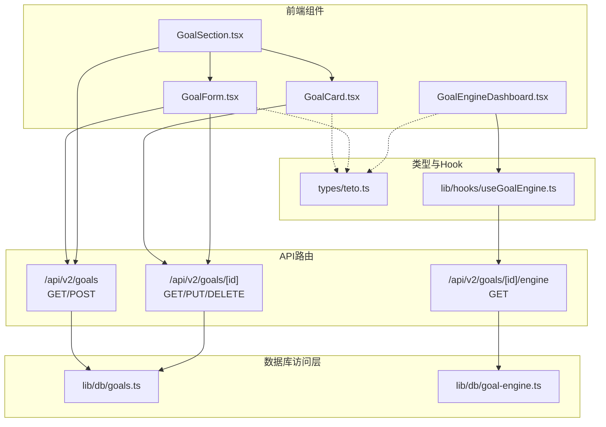
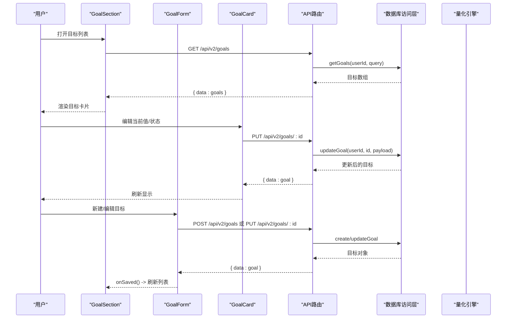
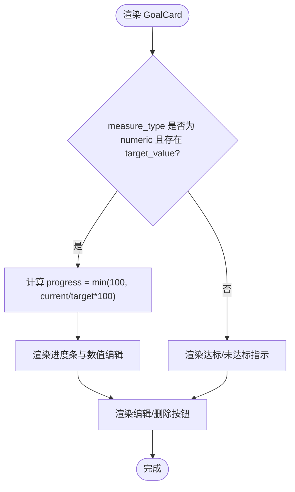
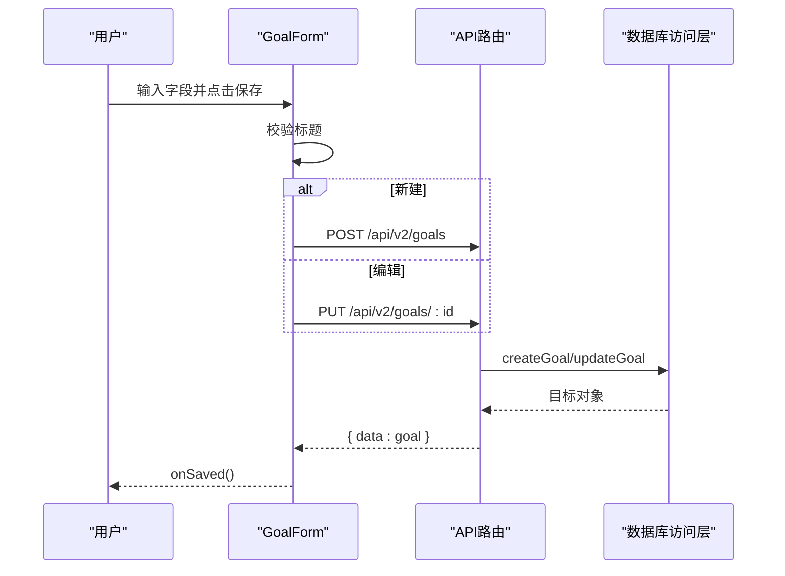
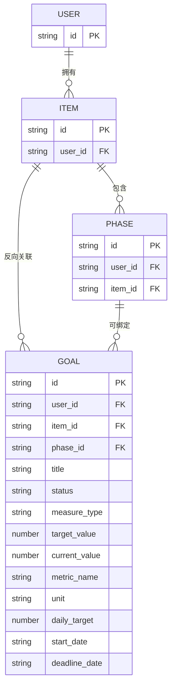
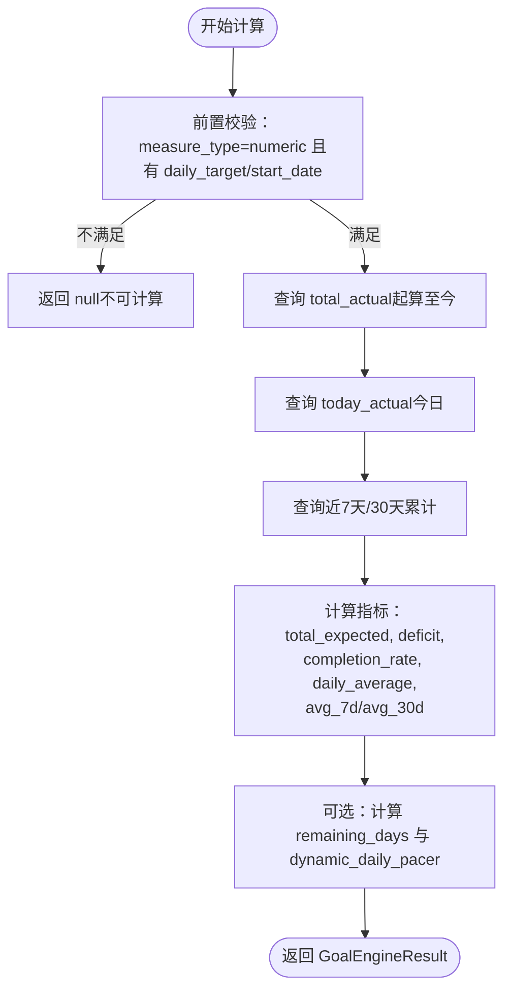
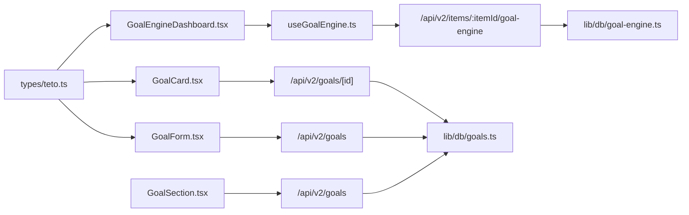

# 目标跟踪

<cite>
**本文引用的文件**
- [GoalCard.tsx](file://src/app/(dashboard)/items/components/GoalCard.tsx)
- [GoalForm.tsx](file://src/app/(dashboard)/items/components/GoalForm.tsx)
- [GoalSection.tsx](file://src/app/(dashboard)/items/components/GoalSection.tsx)
- [GoalEngineDashboard.tsx](file://src/app/(dashboard)/items/components/GoalEngineDashboard.tsx)
- [route.ts（目标列表与创建）](file://src/app/api/v2/goals/route.ts)
- [route.ts（目标CRUD）](file://src/app/api/v2/goals/[id]/route.ts)
- [route.ts（目标引擎）](file://src/app/api/v2/goals/[id]/engine/route.ts)
- [goals.ts（数据库访问层）](file://src/lib/db/goals.ts)
- [goal-engine.ts（量化引擎）](file://src/lib/db/goal-engine.ts)
- [teto.ts（类型定义）](file://src/types/teto.ts)
- [useGoalEngine.ts（引擎Hook）](file://src/lib/hooks/useGoalEngine.ts)
- [ItemsClient.tsx](file://src/app/(dashboard)/items/ItemsClient.tsx)
</cite>

## 目录
1. [简介](#简介)
2. [项目结构](#项目结构)
3. [核心组件](#核心组件)
4. [架构总览](#架构总览)
5. [详细组件分析](#详细组件分析)
6. [依赖关系分析](#依赖关系分析)
7. [性能考量](#性能考量)
8. [故障排查指南](#故障排查指南)
9. [结论](#结论)
10. [附录](#附录)

## 简介
本文件面向TETO目标跟踪系统，围绕目标的创建、编辑、删除与状态管理进行系统化说明，并深入解析GoalCard与GoalForm两大前端组件的实现原理，涵盖目标显示逻辑、进度计算算法、状态指示器与操作按钮；同时提供目标API接口的使用示例，解释目标层级结构、进度预测算法与完成条件判断。

## 项目结构
目标相关功能主要分布在以下区域：
- 前端组件：位于 items 页面的组件目录，负责目标卡片展示、表单编辑与引擎仪表盘
- API路由：位于 api/v2/goals 下，提供目标的增删改查与引擎计算接口
- 数据访问层：位于 lib/db，封装 Supabase 查询与更新
- 类型定义：位于 types/teto.ts，统一目标、阶段、记录等数据结构
- Hook：位于 lib/hooks，提供量化引擎数据获取的客户端Hook

图表来源
- [GoalSection.tsx](file://src/app/(dashboard)/items/components/GoalSection.tsx#L18-L92)
- [GoalCard.tsx](file://src/app/(dashboard)/items/components/GoalCard.tsx#L21-L114)
- [GoalForm.tsx](file://src/app/(dashboard)/items/components/GoalForm.tsx#L28-L377)
- [GoalEngineDashboard.tsx](file://src/app/(dashboard)/items/components/GoalEngineDashboard.tsx#L11-L191)
- [route.ts（目标列表与创建）:6-49](file://src/app/api/v2/goals/route.ts#L6-L49)
- [route.ts（目标CRUD）:6-67](file://src/app/api/v2/goals/[id]/route.ts#L6-L67)
- [route.ts（目标引擎）:9-35](file://src/app/api/v2/goals/[id]/engine/route.ts#L9-L35)
- [goals.ts（数据库访问层）:10-171](file://src/lib/db/goals.ts#L10-L171)
- [goal-engine.ts（量化引擎）:49-202](file://src/lib/db/goal-engine.ts#L49-L202)
- [teto.ts（类型定义）:316-390](file://src/types/teto.ts#L316-L390)
- [useGoalEngine.ts（引擎Hook）:10-41](file://src/lib/hooks/useGoalEngine.ts#L10-L41)

章节来源
- [GoalSection.tsx](file://src/app/(dashboard)/items/components/GoalSection.tsx#L18-L92)
- [GoalCard.tsx](file://src/app/(dashboard)/items/components/GoalCard.tsx#L21-L114)
- [GoalForm.tsx](file://src/app/(dashboard)/items/components/GoalForm.tsx#L28-L377)
- [GoalEngineDashboard.tsx](file://src/app/(dashboard)/items/components/GoalEngineDashboard.tsx#L11-L191)
- [route.ts（目标列表与创建）:6-49](file://src/app/api/v2/goals/route.ts#L6-L49)
- [route.ts（目标CRUD）:6-67](file://src/app/api/v2/goals/[id]/route.ts#L6-L67)
- [route.ts（目标引擎）:9-35](file://src/app/api/v2/goals/[id]/engine/route.ts#L9-L35)
- [goals.ts（数据库访问层）:10-171](file://src/lib/db/goals.ts#L10-L171)
- [goal-engine.ts（量化引擎）:49-202](file://src/lib/db/goal-engine.ts#L49-L202)
- [teto.ts（类型定义）:316-390](file://src/types/teto.ts#L316-L390)
- [useGoalEngine.ts（引擎Hook）:10-41](file://src/lib/hooks/useGoalEngine.ts#L10-L41)

## 核心组件
- GoalCard：展示单个目标的标题、描述、状态、进度条与数值输入框，支持直接编辑当前值并触发更新回调
- GoalForm：目标创建/编辑表单，包含标题、描述、度量类型、量化配置（指标名、单位、日均期望、起算/截止日期）、归属阶段与状态选择
- GoalSection：目标列表容器，负责加载目标、筛选、打开表单、删除目标与保存后刷新
- GoalEngineDashboard：量化目标引擎仪表盘，展示差额、完成率、日均、配速器等指标

章节来源
- [GoalCard.tsx](file://src/app/(dashboard)/items/components/GoalCard.tsx#L21-L114)
- [GoalForm.tsx](file://src/app/(dashboard)/items/components/GoalForm.tsx#L28-L377)
- [GoalSection.tsx](file://src/app/(dashboard)/items/components/GoalSection.tsx#L18-L92)
- [GoalEngineDashboard.tsx](file://src/app/(dashboard)/items/components/GoalEngineDashboard.tsx#L11-L191)

## 架构总览
目标管理采用前后端分离的API模式：
- 前端组件通过HTTP请求调用后端路由，路由层再委托数据库访问层执行查询/更新
- 量化引擎通过独立路由与数据库访问层计算目标的进度、预测与配速器
- 类型定义集中于 types/teto.ts，确保前后端数据契约一致

图表来源
- [GoalSection.tsx](file://src/app/(dashboard)/items/components/GoalSection.tsx#L26-L83)
- [GoalCard.tsx](file://src/app/(dashboard)/items/components/GoalCard.tsx#L21-L114)
- [GoalForm.tsx](file://src/app/(dashboard)/items/components/GoalForm.tsx#L75-L145)
- [route.ts（目标列表与创建）:6-49](file://src/app/api/v2/goals/route.ts#L6-L49)
- [route.ts（目标CRUD）:29-47](file://src/app/api/v2/goals/[id]/route.ts#L29-L47)
- [goals.ts（数据库访问层）:74-152](file://src/lib/db/goals.ts#L74-L152)

## 详细组件分析

### GoalCard 组件
- 显示逻辑
  - 标题与描述：从 props.goal 渲染
  - 状态标签：根据状态映射颜色类名
  - 度量展示：当 measure_type 为 numeric 且存在 target_value 时，计算百分比并在进度条上体现；否则显示达标/未达标状态
  - 当前值编辑：点击数值进入内联编辑模式，支持回车保存
- 进度计算算法
  - 百分比 = min(100, current_value / target_value * 100)，避免超100%
  - 进度条颜色：达到或超过100%时使用绿色，否则蓝色
- 状态指示器
  - 使用预定义颜色映射，不同状态对应不同背景/文字颜色
- 操作按钮
  - 编辑：触发 onEdit 回调
  - 删除：触发 onDelete 回调
  - 当前值编辑：触发 onUpdateValue 回调并传入目标ID与新值（null表示清空）

图表来源
- [GoalCard.tsx](file://src/app/(dashboard)/items/components/GoalCard.tsx#L32-L93)

章节来源
- [GoalCard.tsx](file://src/app/(dashboard)/items/components/GoalCard.tsx#L21-L114)

### GoalForm 组件
- 表单验证
  - 标题必填：提交前检查 title 是否为空
  - 保存状态：防止重复提交
- 目标字段配置
  - 基础：标题、描述、状态
  - 度量类型：boolean/numeric 二选一
  - 量化配置（numeric时显示）：总目标值、当前值、关联指标名、计量单位、每日期望、起算日期、截止日期
  - 归属：可选阶段下拉（若提供 phases）
- 提交处理机制
  - 新建：POST /api/v2/goals，成功后 onSaved
  - 编辑：PUT /api/v2/goals/:id，成功后 onSaved
  - 错误处理：捕获网络异常与后端错误，调用 onError

图表来源
- [GoalForm.tsx](file://src/app/(dashboard)/items/components/GoalForm.tsx#L75-L145)
- [route.ts（目标列表与创建）:30-49](file://src/app/api/v2/goals/route.ts#L30-L49)
- [route.ts（目标CRUD）:29-47](file://src/app/api/v2/goals/[id]/route.ts#L29-L47)
- [goals.ts（数据库访问层）:74-152](file://src/lib/db/goals.ts#L74-L152)

章节来源
- [GoalForm.tsx](file://src/app/(dashboard)/items/components/GoalForm.tsx#L28-L377)

### 目标API接口使用示例
- 获取目标列表
  - 方法：GET /api/v2/goals
  - 查询参数：status、item_id、phase_id
  - 返回：包含 data: Goal[]
- 创建目标
  - 方法：POST /api/v2/goals
  - 请求体：CreateGoalPayload（至少包含 title）
  - 返回：包含 data: Goal
- 获取单个目标
  - 方法：GET /api/v2/goals/:id
  - 返回：包含 data: Goal
- 更新目标
  - 方法：PUT /api/v2/goals/:id
  - 请求体：UpdateGoalPayload（可部分字段）
  - 返回：包含 data: Goal
- 删除目标
  - 方法：DELETE /api/v2/goals/:id
  - 返回：包含 data: { id }
- 获取单个目标的量化引擎结果
  - 方法：GET /api/v2/goals/:id/engine
  - 返回：包含 data: GoalEngineResult 或 404（目标不存在/非量化型/缺配置）

章节来源
- [route.ts（目标列表与创建）:6-49](file://src/app/api/v2/goals/route.ts#L6-L49)
- [route.ts（目标CRUD）:6-67](file://src/app/api/v2/goals/[id]/route.ts#L6-L67)
- [route.ts（目标引擎）:9-35](file://src/app/api/v2/goals/[id]/engine/route.ts#L9-L35)

### 目标层级结构
- 顶层：用户（由鉴权中间件保证）
- 事项（Item）：目标通常反向关联到事项（goals.item_id）
- 阶段（Phase）：目标可选择性绑定到阶段（goals.phase_id）
- 目标（Goal）：承载标题、描述、状态、度量类型与量化引擎配置

图表来源
- [teto.ts（类型定义）:316-354](file://src/types/teto.ts#L316-L354)

章节来源
- [teto.ts（类型定义）:316-354](file://src/types/teto.ts#L316-L354)

### 进度预测算法与完成条件判断
- 量化引擎计算流程
  - 前置校验：目标必须为 numeric，且具备 daily_target 与 start_date
  - 数据来源：基于目标所属事项（item_id）与指标匹配（metric_name/unit）统计 records.metric_value
  - 时间窗口：按起算日累计、今日、近7天、近30天分别求和
  - 指标计算：
    - total_expected = total_passed_days × daily_target
    - deficit = total_actual − total_expected
    - completion_rate = total_actual / total_expected
    - daily_average = total_actual / total_passed_days
    - avg_7d/avg_30d：近7/30天日均
    - weekly_projection/monthly_projection：基于日均推算周/月
    - dynamic_daily_pacer：若存在 deadline_date 与 total_target，则为剩余天数内的动态配速
- 完成条件判断
  - 当 measure_type 为 boolean 时，完成条件由业务状态驱动（例如“已达成”）
  - 当 measure_type 为 numeric 时，完成条件可结合 total_actual 与 total_target 的比较，或 remaining_days 与 dynamic_daily_pacer 的趋势综合判断

图表来源
- [goal-engine.ts（量化引擎）:113-202](file://src/lib/db/goal-engine.ts#L113-L202)
- [route.ts（目标引擎）:9-35](file://src/app/api/v2/goals/[id]/engine/route.ts#L9-L35)

章节来源
- [goal-engine.ts（量化引擎）:49-202](file://src/lib/db/goal-engine.ts#L49-L202)
- [GoalEngineDashboard.tsx](file://src/app/(dashboard)/items/components/GoalEngineDashboard.tsx#L64-L153)

## 依赖关系分析
- 组件间依赖
  - GoalSection 依赖 GoalCard 与 GoalForm，负责列表加载、筛选与保存刷新
  - GoalEngineDashboard 依赖 useGoalEngine Hook，后者调用 /api/v2/items/:itemId/goal-engine
- API与数据库
  - 目标CRUD路由委托 lib/db/goals.ts 执行查询/插入/更新/删除
  - 量化引擎路由委托 lib/db/goal-engine.ts 执行计算
- 类型一致性
  - types/teto.ts 定义 Goal、CreateGoalPayload、UpdateGoalPayload、GoalEngineResult 等，确保前后端契约一致

图表来源
- [GoalSection.tsx](file://src/app/(dashboard)/items/components/GoalSection.tsx#L26-L83)
- [GoalCard.tsx](file://src/app/(dashboard)/items/components/GoalCard.tsx#L21-L114)
- [GoalForm.tsx](file://src/app/(dashboard)/items/components/GoalForm.tsx#L75-L145)
- [GoalEngineDashboard.tsx](file://src/app/(dashboard)/items/components/GoalEngineDashboard.tsx#L11-L191)
- [useGoalEngine.ts（引擎Hook）:10-41](file://src/lib/hooks/useGoalEngine.ts#L10-L41)
- [route.ts（目标列表与创建）:6-49](file://src/app/api/v2/goals/route.ts#L6-L49)
- [route.ts（目标CRUD）:6-67](file://src/app/api/v2/goals/[id]/route.ts#L6-L67)
- [route.ts（目标引擎）:9-35](file://src/app/api/v2/goals/[id]/engine/route.ts#L9-L35)
- [goals.ts（数据库访问层）:10-171](file://src/lib/db/goals.ts#L10-L171)
- [goal-engine.ts（量化引擎）:49-202](file://src/lib/db/goal-engine.ts#L49-L202)
- [teto.ts（类型定义）:316-390](file://src/types/teto.ts#L316-L390)

章节来源
- [GoalSection.tsx](file://src/app/(dashboard)/items/components/GoalSection.tsx#L18-L92)
- [GoalCard.tsx](file://src/app/(dashboard)/items/components/GoalCard.tsx#L21-L114)
- [GoalForm.tsx](file://src/app/(dashboard)/items/components/GoalForm.tsx#L28-L377)
- [GoalEngineDashboard.tsx](file://src/app/(dashboard)/items/components/GoalEngineDashboard.tsx#L11-L191)
- [useGoalEngine.ts（引擎Hook）:10-41](file://src/lib/hooks/useGoalEngine.ts#L10-L41)
- [route.ts（目标列表与创建）:6-49](file://src/app/api/v2/goals/route.ts#L6-L49)
- [route.ts（目标CRUD）:6-67](file://src/app/api/v2/goals/[id]/route.ts#L6-L67)
- [route.ts（目标引擎）:9-35](file://src/app/api/v2/goals/[id]/engine/route.ts#L9-L35)
- [goals.ts（数据库访问层）:10-171](file://src/lib/db/goals.ts#L10-L171)
- [goal-engine.ts（量化引擎）:49-202](file://src/lib/db/goal-engine.ts#L49-L202)
- [teto.ts（类型定义）:316-390](file://src/types/teto.ts#L316-L390)

## 性能考量
- 前端
  - GoalCard 的进度计算为纯前端逻辑，复杂度低，对大列表影响有限
  - GoalForm 在提交时设置 saving 状态，避免重复提交
- 后端
  - 目标列表查询支持按 status/item_id/phase_id 过滤，减少不必要的数据传输
  - 量化引擎查询按日期区间与指标匹配过滤，避免全表扫描
- 数据库
  - 量化引擎使用记录流水的 metric_value 求和，通过 item_id 与指标字段精确匹配，避免跨目标数据串扰

## 故障排查指南
- 目标列表加载失败
  - 检查鉴权：401 错误通常表示未登录或用户信息获取失败
  - 检查网络：确认 /api/v2/goals 可达
- 目标创建/更新失败
  - 标题为空会导致 400 错误（title 为必填）
  - 捕获后端错误消息并提示用户
- 删除目标失败
  - 确认目标是否存在且属于当前用户
- 量化引擎无数据
  - 目标必须为 numeric 且配置了 daily_target 与 start_date
  - 指标匹配（metric_name/unit）需与记录一致

章节来源
- [route.ts（目标列表与创建）:21-27](file://src/app/api/v2/goals/route.ts#L21-L27)
- [route.ts（目标CRUD）:14-26](file://src/app/api/v2/goals/[id]/route.ts#L14-L26)
- [route.ts（目标引擎）:19-24](file://src/app/api/v2/goals/[id]/engine/route.ts#L19-L24)

## 结论
TETO目标跟踪系统通过清晰的组件划分与API设计，实现了目标的全生命周期管理。GoalCard与GoalForm提供了直观的交互体验，量化引擎则为用户提供科学的进度预测与配速参考。类型定义与数据库访问层确保了数据一致性与可扩展性。

## 附录
- 事项页面入口：ItemsClient.tsx 负责渲染桌面与导航至事项详情
- 量化引擎Hook：useGoalEngine 提供便捷的数据获取与重试能力

章节来源
- [ItemsClient.tsx](file://src/app/(dashboard)/items/ItemsClient.tsx#L114-L174)
- [useGoalEngine.ts（引擎Hook）:10-41](file://src/lib/hooks/useGoalEngine.ts#L10-L41)