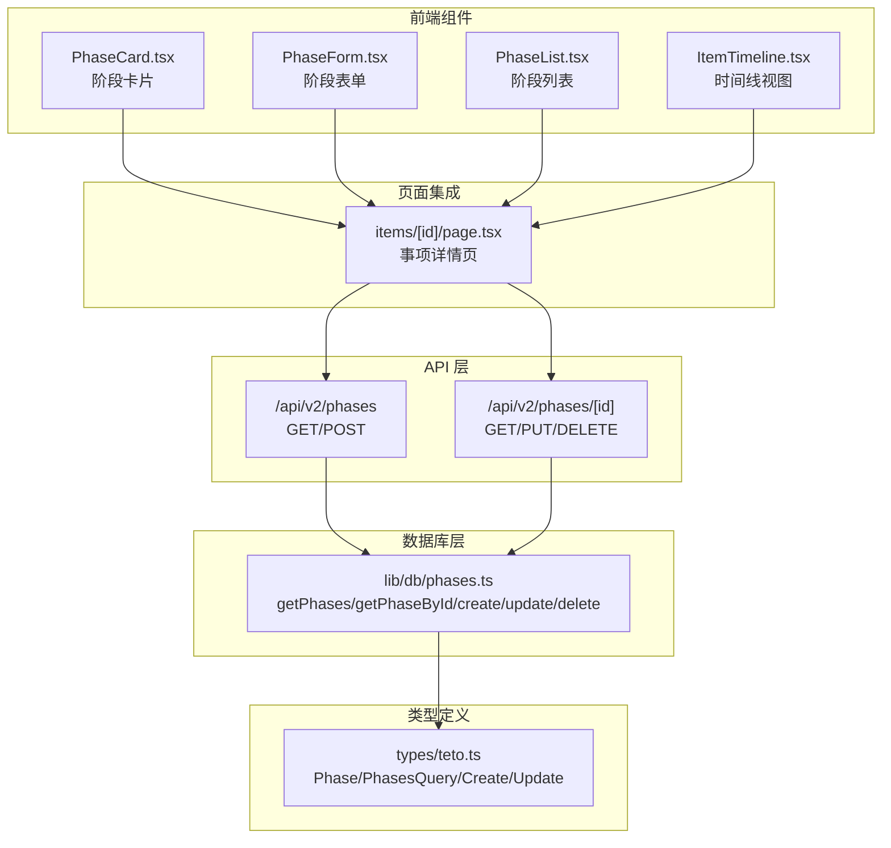
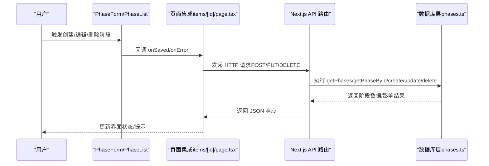
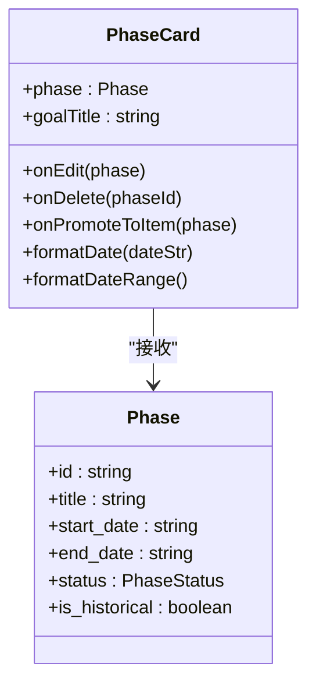
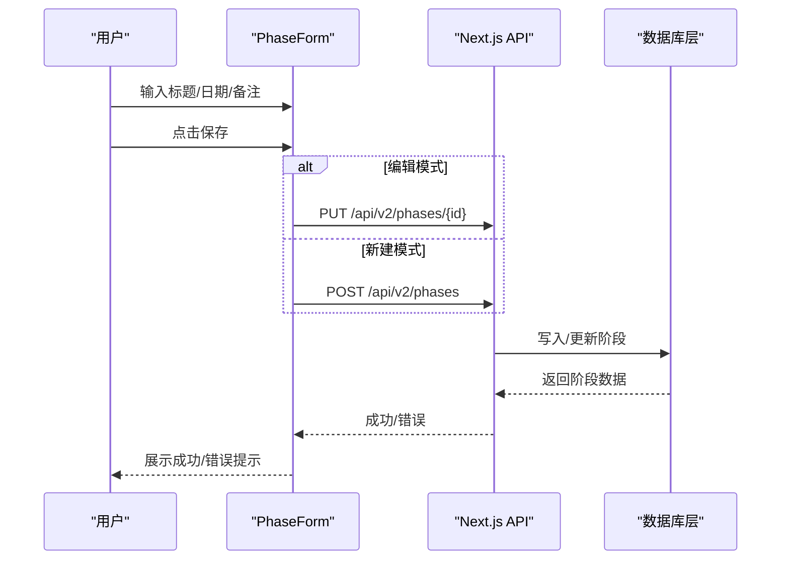
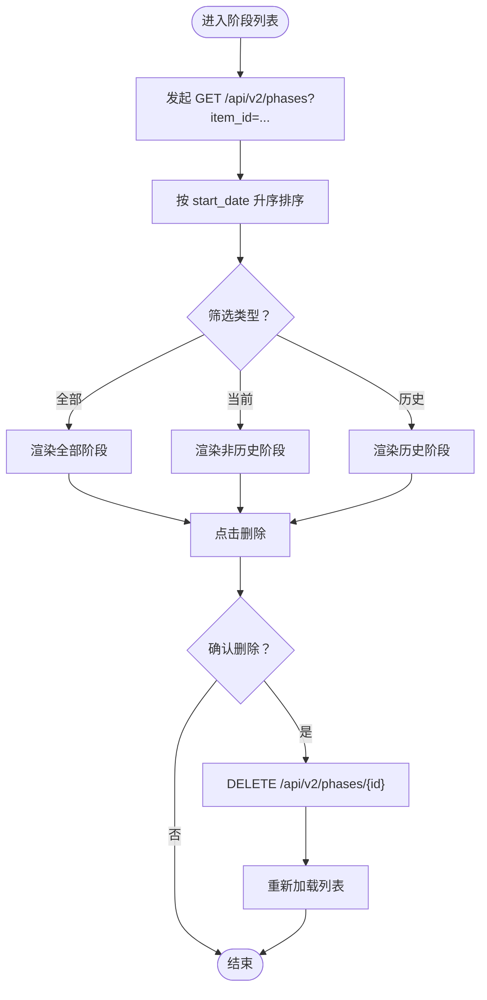
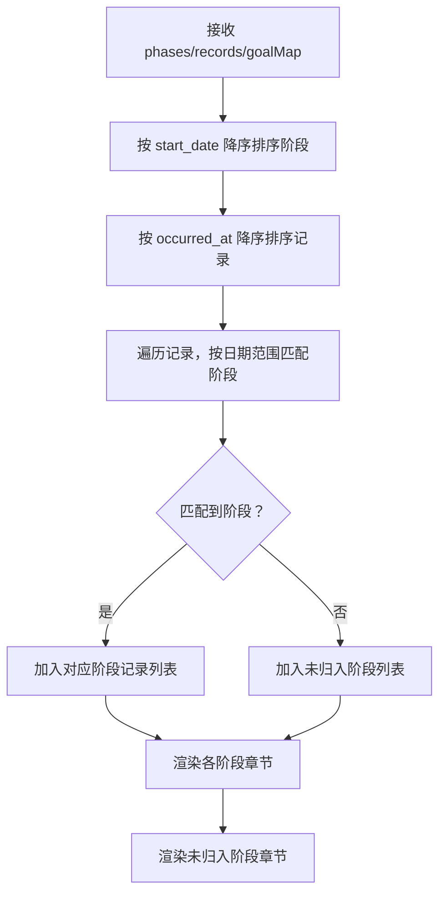
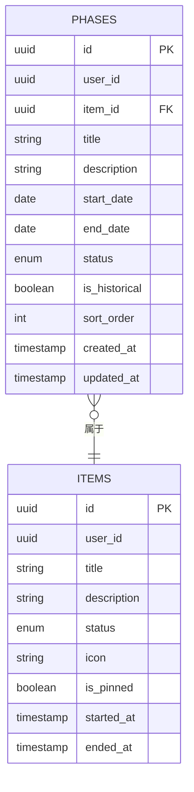
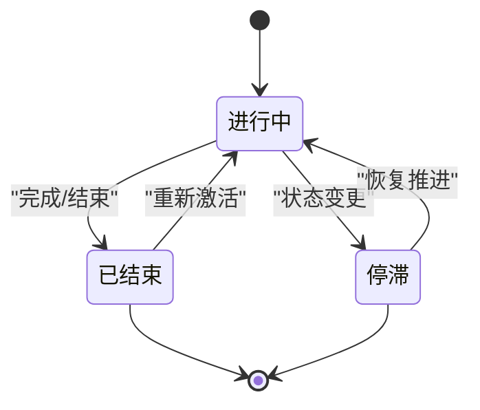
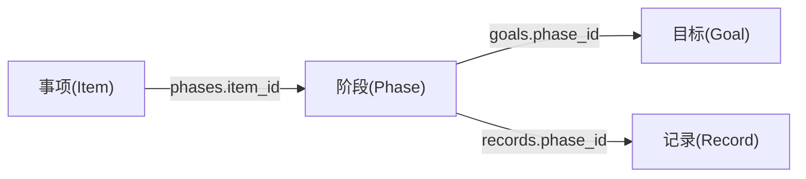
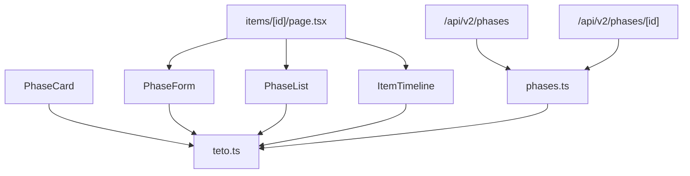

# 阶段管理

<cite>
**本文引用的文件**
- [PhaseCard.tsx](file://src/app/(dashboard)/items/components/PhaseCard.tsx)
- [PhaseForm.tsx](file://src/app/(dashboard)/items/components/PhaseForm.tsx)
- [PhaseList.tsx](file://src/app/(dashboard)/items/components/PhaseList.tsx)
- [ItemTimeline.tsx](file://src/app/(dashboard)/items/components/ItemTimeline.tsx)
- [route.ts（阶段列表/创建）](file://src/app/api/v2/phases/route.ts)
- [route.ts（阶段详情/更新/删除）](file://src/app/api/v2/phases/[id]/route.ts)
- [phases.ts（数据库层）](file://src/lib/db/phases.ts)
- [teto.ts（类型定义）](file://src/types/teto.ts)
- [page.tsx（事项详情页）](file://src/app/(dashboard)/items/[id]/page.tsx)
- [005_teto_1_4_status_chinese_migration.sql（状态迁移）](file://sql/005_teto_1_4_status_chinese_migration.sql)
</cite>

## 目录
1. [简介](#简介)
2. [项目结构](#项目结构)
3. [核心组件](#核心组件)
4. [架构概览](#架构概览)
5. [详细组件分析](#详细组件分析)
6. [依赖分析](#依赖分析)
7. [性能考虑](#性能考虑)
8. [故障排除指南](#故障排除指南)
9. [结论](#结论)
10. [附录](#附录)

## 简介
本文件面向 TETO 阶段管理系统，围绕“阶段的创建、编辑、删除与进度管理”展开，重点覆盖以下能力：
- 阶段卡片展示：状态徽章、时间范围、历史标记与操作菜单
- 阶段表单：标题校验、日期配置、提交与删除流程
- 阶段列表：筛选（全部/当前/历史）、排序与批量操作
- 时间线视图：按阶段分章组织记录、当前阶段高亮
- API 接口：GET/POST/PUT/DELETE 阶段资源，含鉴权与权限校验
- 生命周期与状态：进行中/已结束/停滞，历史标记与状态迁移
- 关联逻辑：阶段与事项、阶段与记录、阶段与目标的关联关系

## 项目结构
阶段管理相关代码主要分布在前端组件、API 层与数据库层，并通过类型定义统一数据契约。

**图表来源**
- [PhaseCard.tsx](file://src/app/(dashboard)/items/components/PhaseCard.tsx#L1-L125)
- [PhaseForm.tsx](file://src/app/(dashboard)/items/components/PhaseForm.tsx#L1-L145)
- [PhaseList.tsx](file://src/app/(dashboard)/items/components/PhaseList.tsx#L1-L179)
- [ItemTimeline.tsx](file://src/app/(dashboard)/items/components/ItemTimeline.tsx#L1-L242)
- [route.ts（阶段列表/创建）:1-72](file://src/app/api/v2/phases/route.ts#L1-L72)
- [route.ts（阶段详情/更新/删除）:1-67](file://src/app/api/v2/phases/[id]/route.ts#L1-L67)
- [phases.ts（数据库层）:1-185](file://src/lib/db/phases.ts#L1-L185)
- [teto.ts（类型定义）:337-426](file://src/types/teto.ts#L337-L426)
- [page.tsx（事项详情页）](file://src/app/(dashboard)/items/[id]/page.tsx#L1-L497)

**章节来源**
- [PhaseCard.tsx](file://src/app/(dashboard)/items/components/PhaseCard.tsx#L1-L125)
- [PhaseForm.tsx](file://src/app/(dashboard)/items/components/PhaseForm.tsx#L1-L145)
- [PhaseList.tsx](file://src/app/(dashboard)/items/components/PhaseList.tsx#L1-L179)
- [ItemTimeline.tsx](file://src/app/(dashboard)/items/components/ItemTimeline.tsx#L1-L242)
- [route.ts（阶段列表/创建）:1-72](file://src/app/api/v2/phases/route.ts#L1-L72)
- [route.ts（阶段详情/更新/删除）:1-67](file://src/app/api/v2/phases/[id]/route.ts#L1-L67)
- [phases.ts（数据库层）:1-185](file://src/lib/db/phases.ts#L1-L185)
- [teto.ts（类型定义）:337-426](file://src/types/teto.ts#L337-L426)
- [page.tsx（事项详情页）](file://src/app/(dashboard)/items/[id]/page.tsx#L1-L497)

## 核心组件
- 阶段卡片（PhaseCard）：展示阶段标题、时间范围、状态徽章、历史标记与操作按钮（编辑、删除、升级为事项）
- 阶段表单（PhaseForm）：标题必填校验、日期输入、保存/删除流程与错误提示
- 阶段列表（PhaseList）：按 start_date 升序排序、筛选当前/历史/全部、删除确认
- 时间线（ItemTimeline）：按阶段分章展示记录、当前阶段高亮、未归入阶段的记录汇总

**章节来源**
- [PhaseCard.tsx](file://src/app/(dashboard)/items/components/PhaseCard.tsx#L28-L125)
- [PhaseForm.tsx](file://src/app/(dashboard)/items/components/PhaseForm.tsx#L15-L145)
- [PhaseList.tsx](file://src/app/(dashboard)/items/components/PhaseList.tsx#L19-L179)
- [ItemTimeline.tsx](file://src/app/(dashboard)/items/components/ItemTimeline.tsx#L147-L242)

## 架构概览
阶段管理采用前后端分离模式：
- 前端组件负责 UI 交互与本地状态管理
- API 层负责鉴权、参数校验与业务路由
- 数据库层封装 Supabase 查询与写入
- 类型定义统一前后端数据契约

**图表来源**
- [page.tsx（事项详情页）](file://src/app/(dashboard)/items/[id]/page.tsx#L142-L206)
- [route.ts（阶段列表/创建）:32-71](file://src/app/api/v2/phases/route.ts#L32-L71)
- [route.ts（阶段详情/更新/删除）:29-66](file://src/app/api/v2/phases/[id]/route.ts#L29-L66)
- [phases.ts（数据库层）:10-185](file://src/lib/db/phases.ts#L10-L185)

## 详细组件分析

### 阶段卡片（PhaseCard）
- 展示要素
  - 时间范围：支持仅开始/仅结束/起止范围格式化
  - 标题与历史标记：历史阶段显示“历史”徽章
  - 状态徽章：根据状态映射不同样式
  - 关联目标占位：预留目标标题展示位置
  - 操作按钮：编辑、删除、升级为事项（可选）
- 设计要点
  - 历史阶段使用暖色系边框与背景
  - 状态徽章使用状态颜色映射
  - 描述支持两行截断显示

**图表来源**
- [PhaseCard.tsx](file://src/app/(dashboard)/items/components/PhaseCard.tsx#L6-L12)
- [teto.ts（类型定义）:337-354](file://src/types/teto.ts#L337-L354)

**章节来源**
- [PhaseCard.tsx](file://src/app/(dashboard)/items/components/PhaseCard.tsx#L14-L125)
- [teto.ts（类型定义）:337-354](file://src/types/teto.ts#L337-L354)

### 阶段表单（PhaseForm）
- 表单字段
  - 标题：必填校验
  - 开始/结束日期：可选日期输入
  - 备注：可选文本域
- 提交流程
  - 编辑模式：PUT /api/v2/phases/{id}
  - 新建模式：POST /api/v2/phases
  - 删除：DELETE /api/v2/phases/{id}
- 错误处理
  - 标题为空时提示“请输入阶段标题”
  - 服务器错误时展示 error 或“保存/删除失败，请重试”

**图表来源**
- [PhaseForm.tsx](file://src/app/(dashboard)/items/components/PhaseForm.tsx#L38-L84)
- [route.ts（阶段列表/创建）:32-71](file://src/app/api/v2/phases/route.ts#L32-L71)
- [route.ts（阶段详情/更新/删除）:29-46](file://src/app/api/v2/phases/[id]/route.ts#L29-L46)
- [phases.ts（数据库层）:137-166](file://src/lib/db/phases.ts#L137-L166)

**章节来源**
- [PhaseForm.tsx](file://src/app/(dashboard)/items/components/PhaseForm.tsx#L15-L145)
- [route.ts（阶段列表/创建）:32-71](file://src/app/api/v2/phases/route.ts#L32-L71)
- [route.ts（阶段详情/更新/删除）:29-46](file://src/app/api/v2/phases/[id]/route.ts#L29-L46)
- [phases.ts（数据库层）:137-166](file://src/lib/db/phases.ts#L137-L166)

### 阶段列表（PhaseList）
- 加载与排序
  - GET /api/v2/phases?item_id={itemId}
  - 按 start_date 升序排序（无 start_date 者按 created_at 排序）
- 筛选
  - 全部/当前/历史三种筛选
- 删除
  - 删除前二次确认
  - 删除后刷新列表

**图表来源**
- [PhaseList.tsx](file://src/app/(dashboard)/items/components/PhaseList.tsx#L25-L82)
- [route.ts（阶段列表/创建）:7-30](file://src/app/api/v2/phases/route.ts#L7-L30)

**章节来源**
- [PhaseList.tsx](file://src/app/(dashboard)/items/components/PhaseList.tsx#L19-L179)
- [route.ts（阶段列表/创建）:7-30](file://src/app/api/v2/phases/route.ts#L7-L30)

### 时间线视图（ItemTimeline）
- 分章逻辑
  - 当前阶段优先（status='进行中'），再按 start_date 降序
  - 记录按 occurred_at 降序排列
  - 使用日期范围判断记录归属阶段
- 展示内容
  - 每个阶段章节：标题、时间范围、指标合计、记录数量、编辑按钮
  - 未归入阶段的记录单独章节
  - 当前阶段高亮与展开默认行为

**图表来源**
- [ItemTimeline.tsx](file://src/app/(dashboard)/items/components/ItemTimeline.tsx#L147-L212)

**章节来源**
- [ItemTimeline.tsx](file://src/app/(dashboard)/items/components/ItemTimeline.tsx#L1-L242)

### API 接口与数据流
- GET /api/v2/phases
  - 查询参数：item_id、status、is_historical
  - 返回：阶段数组（按 sort_order 升序，created_at 降序）
- POST /api/v2/phases
  - 校验：item_id、title 必填
  - 权限：校验事项归属（user_id）
  - 返回：新建阶段
- GET /api/v2/phases/{id}
  - 返回：指定阶段
- PUT /api/v2/phases/{id}
  - 支持更新字段：title/description/start_date/end_date/status/is_historical/sort_order
- DELETE /api/v2/phases/{id}
  - 删除阶段

**图表来源**
- [teto.ts（类型定义）:337-354](file://src/types/teto.ts#L337-L354)
- [route.ts（阶段列表/创建）:12-22](file://src/app/api/v2/phases/route.ts#L12-L22)
- [route.ts（阶段详情/更新/删除）:6-19](file://src/app/api/v2/phases/[id]/route.ts#L6-L19)

**章节来源**
- [route.ts（阶段列表/创建）:7-71](file://src/app/api/v2/phases/route.ts#L7-L71)
- [route.ts（阶段详情/更新/删除）:6-66](file://src/app/api/v2/phases/[id]/route.ts#L6-L66)
- [phases.ts（数据库层）:10-40](file://src/lib/db/phases.ts#L10-L40)

### 生命周期与状态管理
- 状态枚举（中文）：进行中、已结束、停滞
- 状态迁移（历史数据）：将英文状态映射为中文并设置 CHECK 约束与默认值
- 历史标记：is_historical 控制是否显示为历史阶段

**图表来源**
- [teto.ts（类型定义）:307-309](file://src/types/teto.ts#L307-L309)
- [005_teto_1_4_status_chinese_migration.sql:28-35](file://sql/005_teto_1_4_status_chinese_migration.sql#L28-L35)

**章节来源**
- [teto.ts（类型定义）:307-309](file://src/types/teto.ts#L307-L309)
- [005_teto_1_4_status_chinese_migration.sql:28-35](file://sql/005_teto_1_4_status_chinese_migration.sql#L28-L35)

### 阶段关联逻辑
- 阶段与事项：phases.item_id 外键关联 items.id
- 阶段与记录：records.phase_id 反向关联（记录层面可指向阶段）
- 阶段与目标：goals.phase_id 反向关联（目标层面可绑定阶段）

**图表来源**
- [teto.ts（类型定义）:76-94](file://src/types/teto.ts#L76-L94)
- [teto.ts（类型定义）:337-354](file://src/types/teto.ts#L337-L354)
- [teto.ts（类型定义）:316-335](file://src/types/teto.ts#L316-L335)

**章节来源**
- [teto.ts（类型定义）:76-94](file://src/types/teto.ts#L76-L94)
- [teto.ts（类型定义）:316-354](file://src/types/teto.ts#L316-L354)

## 依赖分析
- 组件间依赖
  - PhaseList 依赖 PhaseCard 渲染阶段项
  - ItemTimeline 依赖 Phase 与 Record 数据结构
  - 事项详情页集成 PhaseForm、ItemTimeline、PhaseList
- API 依赖
  - 前端组件通过 fetch 调用 /api/v2/phases 与 /api/v2/phases/{id}
- 数据库依赖
  - 数据库层封装 getPhases/getPhaseById/create/update/delete
- 类型依赖
  - teto.ts 定义 Phase/PhasesQuery/Create/Update 类型，确保前后端一致

**图表来源**
- [teto.ts（类型定义）:337-426](file://src/types/teto.ts#L337-L426)
- [page.tsx（事项详情页）](file://src/app/(dashboard)/items/[id]/page.tsx#L1-L497)
- [route.ts（阶段列表/创建）:1-72](file://src/app/api/v2/phases/route.ts#L1-L72)
- [route.ts（阶段详情/更新/删除）:1-67](file://src/app/api/v2/phases/[id]/route.ts#L1-L67)
- [phases.ts（数据库层）:1-185](file://src/lib/db/phases.ts#L1-L185)

**章节来源**
- [teto.ts（类型定义）:337-426](file://src/types/teto.ts#L337-L426)
- [page.tsx（事项详情页）](file://src/app/(dashboard)/items/[id]/page.tsx#L1-L497)
- [route.ts（阶段列表/创建）:1-72](file://src/app/api/v2/phases/route.ts#L1-L72)
- [route.ts（阶段详情/更新/删除）:1-67](file://src/app/api/v2/phases/[id]/route.ts#L1-L67)
- [phases.ts（数据库层）:1-185](file://src/lib/db/phases.ts#L1-L185)

## 性能考虑
- 列表排序：前端按 start_date 升序排序，避免重复排序开销
- 查询优化：API 层对 sort_order 与 created_at 进行多字段排序，减少前端二次排序
- 网络请求：阶段列表与时间线分别独立加载，避免不必要的数据传输
- 本地状态：表单与列表使用 useState/useState 控制加载与错误状态，提升交互体验

## 故障排除指南
- 常见错误
  - 未登录或用户信息获取失败：API 返回 401，前端展示“请先登录/获取用户信息失败”
  - 服务器内部错误：API 返回 500，前端展示“服务器错误”
  - 事项不存在或不属于当前用户：阶段详情/更新/删除返回相应错误
- 建议排查步骤
  - 检查网络面板中的 /api/v2/phases* 请求状态码与响应体
  - 确认当前用户是否与目标阶段所属用户一致
  - 在 PhaseForm 中检查标题必填与日期格式
  - 在 PhaseList 中确认筛选条件与 item_id 是否正确

**章节来源**
- [route.ts（阶段列表/创建）:23-29](file://src/app/api/v2/phases/route.ts#L23-L29)
- [route.ts（阶段详情/更新/删除）:20-26](file://src/app/api/v2/phases/[id]/route.ts#L20-L26)
- [PhaseForm.tsx](file://src/app/(dashboard)/items/components/PhaseForm.tsx#L38-L84)
- [PhaseList.tsx](file://src/app/(dashboard)/items/components/PhaseList.tsx#L68-L82)

## 结论
阶段管理模块通过清晰的组件职责划分与严格的 API/数据库契约，实现了从 UI 到数据层的完整闭环。前端组件专注于用户体验与交互，API 层承担鉴权与参数校验，数据库层提供稳定的数据访问。配合明确的状态模型与生命周期策略，系统能够有效支撑阶段的创建、编辑、删除与进度管理需求。

## 附录

### 阶段 API 使用示例（路径指引）
- 获取阶段列表
  - 方法与路径：GET /api/v2/phases?item_id={itemId}&status={status}&is_historical={true|false}
  - 示例路径参考：[route.ts（阶段列表/创建）:7-30](file://src/app/api/v2/phases/route.ts#L7-L30)
- 创建阶段
  - 方法与路径：POST /api/v2/phases
  - 请求体字段：item_id、title、description、start_date、end_date、status、is_historical、sort_order
  - 示例路径参考：[route.ts（阶段列表/创建）:32-71](file://src/app/api/v2/phases/route.ts#L32-L71)，[phases.ts（数据库层）:108-128](file://src/lib/db/phases.ts#L108-L128)
- 获取阶段详情
  - 方法与路径：GET /api/v2/phases/{id}
  - 示例路径参考：[route.ts（阶段详情/更新/删除）:6-26](file://src/app/api/v2/phases/[id]/route.ts#L6-L26)
- 更新阶段
  - 方法与路径：PUT /api/v2/phases/{id}
  - 请求体字段：title、description、start_date、end_date、status、is_historical、sort_order
  - 示例路径参考：[route.ts（阶段详情/更新/删除）:29-46](file://src/app/api/v2/phases/[id]/route.ts#L29-L46)，[phases.ts（数据库层）:137-166](file://src/lib/db/phases.ts#L137-L166)
- 删除阶段
  - 方法与路径：DELETE /api/v2/phases/{id}
  - 示例路径参考：[route.ts（阶段详情/更新/删除）:49-66](file://src/app/api/v2/phases/[id]/route.ts#L49-L66)，[phases.ts（数据库层）:173-185](file://src/lib/db/phases.ts#L173-L185)

### 阶段生命周期与完成条件
- 生命周期状态：进行中、已结束、停滞
- 完成条件（示意）
  - 已结束：通常表示阶段目标达成或时间窗口结束
  - 停滞：阶段推进受阻，需人工干预恢复
  - 进行中：阶段处于活跃推进状态
- 历史标记：is_historical 为 true 时，阶段以历史样式展示，便于回顾与归档

**章节来源**
- [teto.ts（类型定义）:307-309](file://src/types/teto.ts#L307-L309)
- [005_teto_1_4_status_chinese_migration.sql:28-35](file://sql/005_teto_1_4_status_chinese_migration.sql#L28-L35)
- [PhaseCard.tsx](file://src/app/(dashboard)/items/components/PhaseCard.tsx#L50-L55)