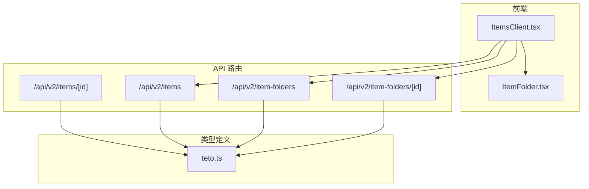
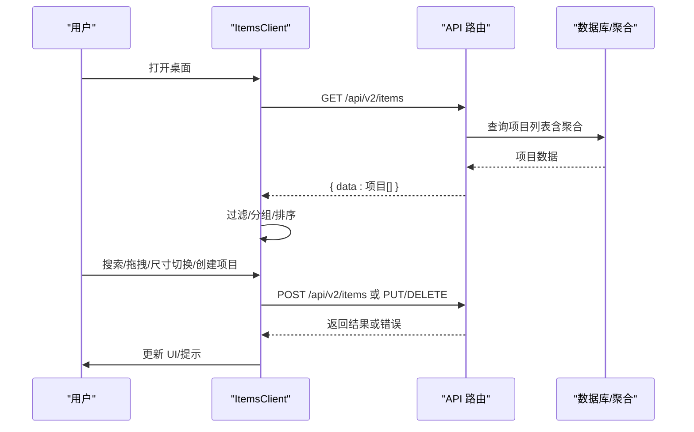
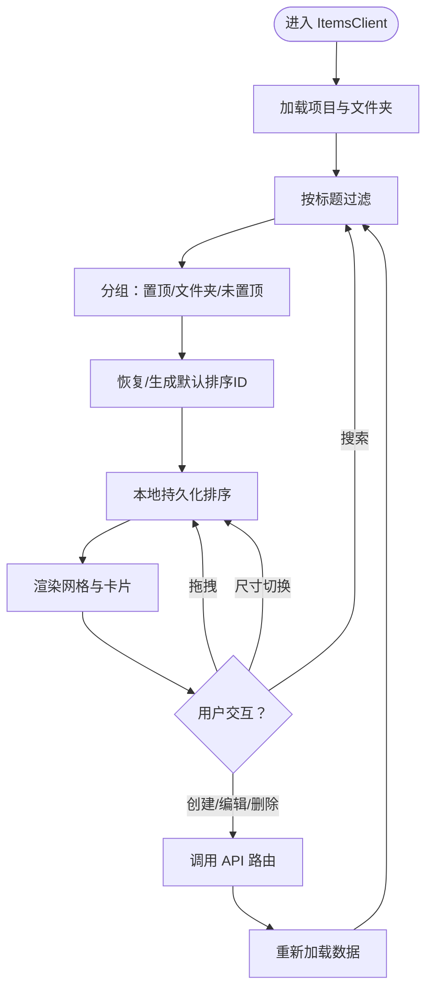
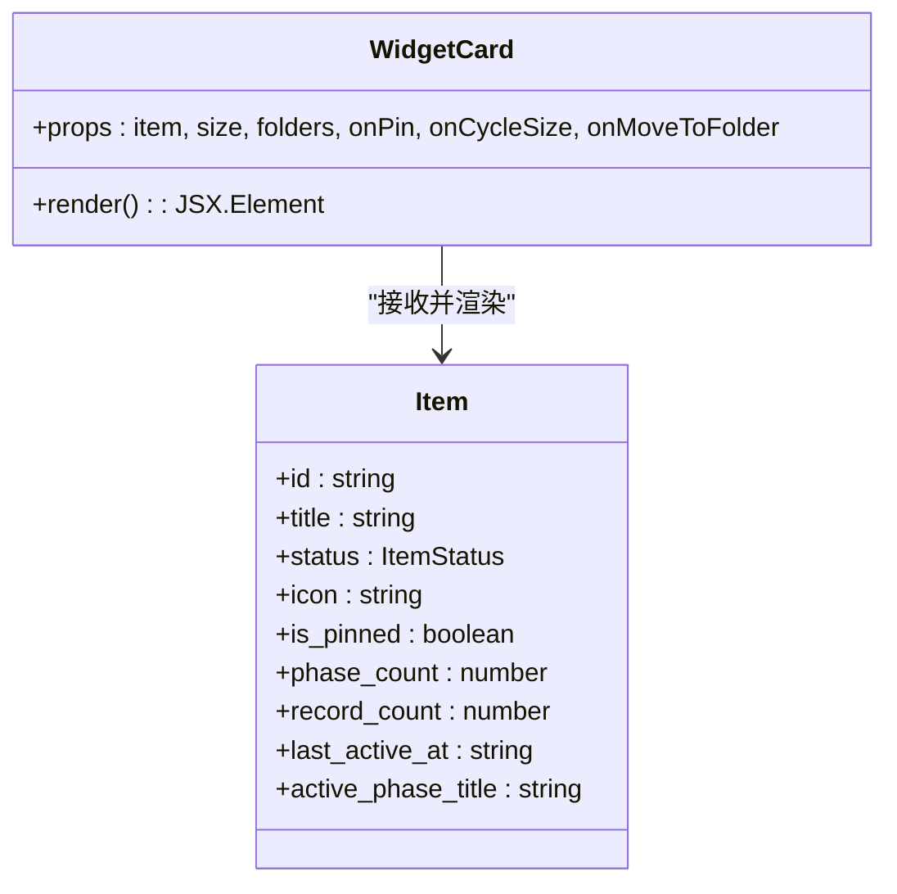
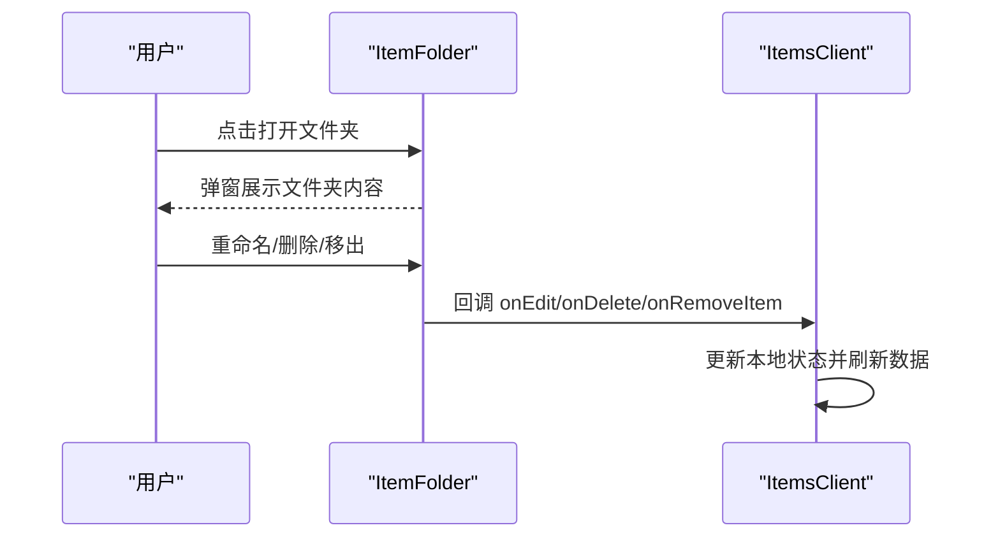
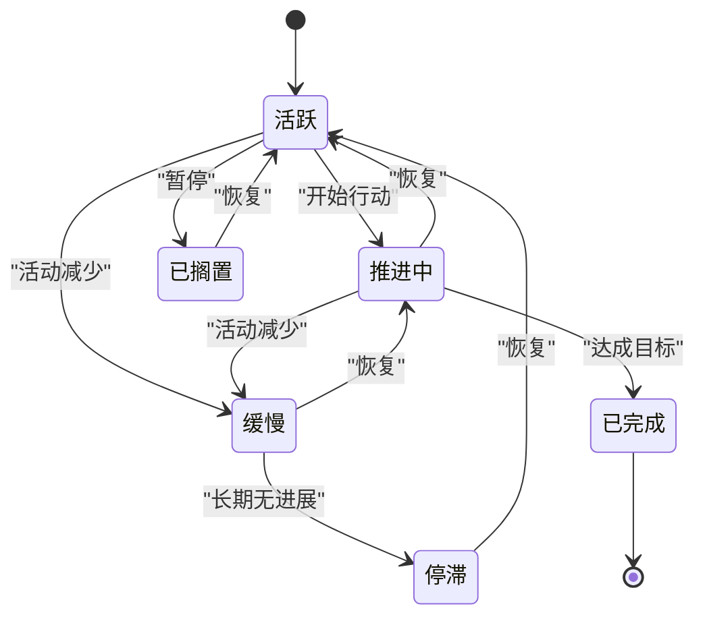
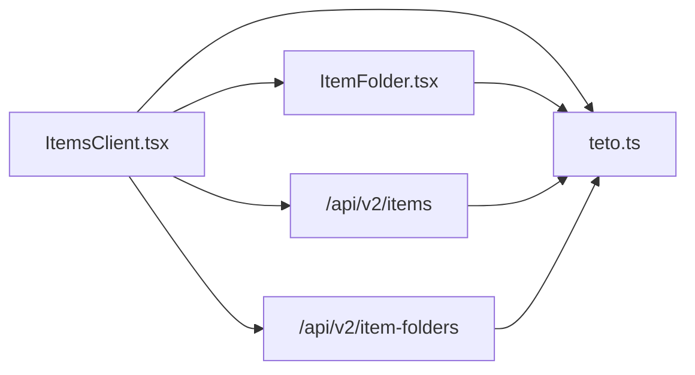

# 项目管理

<cite>
**本文引用的文件**
- [ItemsClient.tsx](file://src/app/(dashboard)/items/ItemsClient.tsx)
- [ItemFolder.tsx](file://src/app/(dashboard)/items/components/ItemFolder.tsx)
- [items 路由（v2）](file://src/app/api/v2/items/route.ts)
- [items/[id] 路由（v2）](file://src/app/api/v2/items/[id]/route.ts)
- [item-folders 路由（v2）](file://src/app/api/v2/item-folders/route.ts)
- [item-folders/[id] 路由（v2）](file://src/app/api/v2/item-folders/[id]/route.ts)
- [类型定义（teto.ts）](file://src/types/teto.ts)
</cite>

## 目录
1. [简介](#简介)
2. [项目结构](#项目结构)
3. [核心组件](#核心组件)
4. [架构总览](#架构总览)
5. [详细组件分析](#详细组件分析)
6. [依赖分析](#依赖分析)
7. [性能考量](#性能考量)
8. [故障排查指南](#故障排查指南)
9. [结论](#结论)
10. [附录](#附录)

## 简介
本文件面向 TETO 项目管理系统中的“项目（事项）”模块，系统性阐述以下内容：
- 项目创建、编辑、删除与状态管理的端到端流程
- ItemsClient 组件的实现原理：项目列表展示、项目卡片渲染、状态颜色映射、搜索与过滤、拖拽布局与尺寸切换
- 项目数据模型字段、状态枚举、图标选择算法与相对时间格式化
- 使用项目 API 接口进行 CRUD 操作的具体示例路径
- 项目生命周期管理、状态转换规则与用户体验优化策略

## 项目结构
项目采用 Next.js App Router 结构，前端页面位于 src/app 下，API 路由位于 src/app/api/v2，类型定义集中在 src/types/teto.ts。项目管理相关的关键文件如下：
- ItemsClient.tsx：桌面视图主组件，负责数据拉取、搜索过滤、拖拽排序、尺寸切换、文件夹集成等
- ItemFolder.tsx：文件夹组件，支持弹窗式展开、子项展示与移出操作
- API 路由：
  - /api/v2/items：列出与创建项目
  - /api/v2/items/[id]：获取、更新、删除单个项目及聚合数据
  - /api/v2/item-folders：列出与创建文件夹
  - /api/v2/item-folders/[id]：获取、更新、删除文件夹
- 类型定义：集中定义了 Item、ItemStatus、CreateItemPayload、UpdateItemPayload、ItemFolder 等核心类型

**图表来源**
- [ItemsClient.tsx](file://src/app/(dashboard)/items/ItemsClient.tsx#L114-L484)
- [ItemFolder.tsx](file://src/app/(dashboard)/items/components/ItemFolder.tsx#L44-L207)
- [items 路由（v2）:6-46](file://src/app/api/v2/items/route.ts#L6-L46)
- [items/[id] 路由（v2）](file://src/app/api/v2/items/[id]/route.ts#L9-L97)
- [item-folders 路由（v2）:6-38](file://src/app/api/v2/item-folders/route.ts#L6-L38)
- [item-folders/[id] 路由（v2）](file://src/app/api/v2/item-folders/[id]/route.ts#L6-L64)
- [类型定义（teto.ts）:76-94](file://src/types/teto.ts#L76-L94)

**章节来源**
- [ItemsClient.tsx](file://src/app/(dashboard)/items/ItemsClient.tsx#L114-L484)
- [ItemFolder.tsx](file://src/app/(dashboard)/items/components/ItemFolder.tsx#L44-L207)
- [items 路由（v2）:6-46](file://src/app/api/v2/items/route.ts#L6-L46)
- [items/[id] 路由（v2）](file://src/app/api/v2/items/[id]/route.ts#L9-L97)
- [item-folders 路由（v2）:6-38](file://src/app/api/v2/item-folders/route.ts#L6-L38)
- [item-folders/[id] 路由（v2）](file://src/app/api/v2/item-folders/[id]/route.ts#L6-L64)
- [类型定义（teto.ts）:76-94](file://src/types/teto.ts#L76-L94)

## 核心组件
- ItemsClient：负责项目列表加载、搜索过滤、分组（置顶/文件夹/未置顶）、拖拽排序、尺寸切换、创建/删除/重命名文件夹、移动项目到文件夹、历史库弹窗等
- WidgetCard：根据尺寸（1x1/2x1/2x2）渲染不同密度的项目卡片，展示标题、状态、图标、阶段/记录统计、最近活跃时间等
- ItemFolder：文件夹组件，支持四宫格预览、展开弹窗、重命名、删除、从文件夹移出子项
- API 路由：提供项目与文件夹的 CRUD 与聚合查询能力

**章节来源**
- [ItemsClient.tsx](file://src/app/(dashboard)/items/ItemsClient.tsx#L114-L484)
- [ItemFolder.tsx](file://src/app/(dashboard)/items/components/ItemFolder.tsx#L44-L207)
- [items 路由（v2）:6-46](file://src/app/api/v2/items/route.ts#L6-L46)
- [item-folders 路由（v2）:6-38](file://src/app/api/v2/item-folders/route.ts#L6-L38)

## 架构总览
前端通过 ItemsClient 发起 API 请求，后端路由处理业务逻辑并返回标准化数据；ItemsClient 再基于返回数据进行本地状态管理与 UI 渲染。

**图表来源**
- [ItemsClient.tsx](file://src/app/(dashboard)/items/ItemsClient.tsx#L140-L170)
- [items 路由（v2）:6-46](file://src/app/api/v2/items/route.ts#L6-L46)

**章节来源**
- [ItemsClient.tsx](file://src/app/(dashboard)/items/ItemsClient.tsx#L140-L170)
- [items 路由（v2）:6-46](file://src/app/api/v2/items/route.ts#L6-L46)

## 详细组件分析

### ItemsClient 组件分析
- 数据加载与聚合
  - 通过 /api/v2/items 获取项目列表，并注入默认统计字段（阶段数、记录数、最后活跃时间等）
  - 并行加载项目与文件夹数据，减少首屏等待
- 搜索与过滤
  - 支持按标题关键字过滤
  - 归档状态（已完成/已搁置）单独展示于历史库弹窗
- 分组与排序
  - 置顶项目优先
  - 文件夹占位，随后为活跃未置顶项目
  - 本地持久化排序顺序（localStorage）
- 拖拽与尺寸
  - 使用 @dnd-kit 实现拖拽排序
  - 支持 1x1/2x1/2x2 三种尺寸循环切换，本地持久化
- 文件夹集成
  - 创建/删除/重命名文件夹
  - 将项目移入/移出文件夹
- 历史库弹窗
  - 展示归档项目列表，点击跳转详情页

**图表来源**
- [ItemsClient.tsx](file://src/app/(dashboard)/items/ItemsClient.tsx#L176-L229)

**章节来源**
- [ItemsClient.tsx](file://src/app/(dashboard)/items/ItemsClient.tsx#L114-L484)

### WidgetCard 组件分析
- 尺寸策略
  - 1x1：仅显示图标、标题与状态徽标
  - 2x1：显示图标、标题、状态、阶段/记录统计、最近活跃时间
  - 2x2：显示更丰富信息，含活跃阶段高亮、目标追踪提示、统计与时间
- 图标与颜色
  - 若项目未设置 icon，则按标题首字符哈希选择 Lucide 图标
  - 状态到渐变色、徽标色的映射用于视觉区分
- 悬浮操作
  - 支持置顶/取消、切换尺寸、移入文件夹菜单

**图表来源**
- [ItemsClient.tsx](file://src/app/(dashboard)/items/ItemsClient.tsx#L489-L600)
- [类型定义（teto.ts）:76-94](file://src/types/teto.ts#L76-L94)

**章节来源**
- [ItemsClient.tsx](file://src/app/(dashboard)/items/ItemsClient.tsx#L489-L600)
- [类型定义（teto.ts）:76-94](file://src/types/teto.ts#L76-L94)

### ItemFolder 组件分析
- iOS 风格四宫格预览，直观展示文件夹内项目状态
- 弹窗式全屏展开，展示文件夹内全部项目，支持重命名、删除、移出子项
- 使用 createPortal 避免与网格布局 transform 穿透

**图表来源**
- [ItemFolder.tsx](file://src/app/(dashboard)/items/components/ItemFolder.tsx#L112-L204)
- [ItemsClient.tsx](file://src/app/(dashboard)/items/ItemsClient.tsx#L300-L327)

**章节来源**
- [ItemFolder.tsx](file://src/app/(dashboard)/items/components/ItemFolder.tsx#L44-L207)
- [ItemsClient.tsx](file://src/app/(dashboard)/items/ItemsClient.tsx#L300-L327)

### API 接口与数据模型

#### 项目数据模型与状态枚举
- Item 字段概览（关键字段）
  - id、user_id、title、description、status、color、icon、is_pinned、started_at、ended_at、goal_id、folder_id、created_at、updated_at
  - 关联数据：recent_records（查询时可能附带）
- 状态枚举（ItemStatus）
  - 活跃、推进中、放缓、停滞、已完成、已搁置
- 图标选择算法
  - pickIcon(title)：以标题首字符编码对图标池长度取模，稳定地为每个标题分配一个 Lucide 图标
- 相对时间格式化
  - formatRelativeTime(dateStr)：根据当前时间与记录时间差，输出“刚刚/XX分钟前/XX小时前/XX天前/XX周前/具体日期”等本地化文案

**章节来源**
- [类型定义（teto.ts）:76-94](file://src/types/teto.ts#L76-L94)
- [类型定义（teto.ts）:21-22](file://src/types/teto.ts#L21-L22)
- [ItemsClient.tsx](file://src/app/(dashboard)/items/ItemsClient.tsx#L55-L59)
- [ItemsClient.tsx](file://src/app/(dashboard)/items/ItemsClient.tsx#L666-L677)

#### 项目 CRUD API 使用示例（路径）
- 列出项目
  - 方法与路径：GET /api/v2/items
  - 查询参数：status（可选）、is_pinned（可选，'true'/'false'）
  - 成功响应：{ data: Item[] }
  - 示例路径：[items 路由（v2）:6-26](file://src/app/api/v2/items/route.ts#L6-L26)
- 创建项目
  - 方法与路径：POST /api/v2/items
  - 请求体：CreateItemPayload（至少包含 title）
  - 成功响应：{ data: Item }，状态码 201
  - 示例路径：[items 路由（v2）:28-46](file://src/app/api/v2/items/route.ts#L28-L46)
- 获取单个项目详情
  - 方法与路径：GET /api/v2/items/[id]
  - 响应：包含 item、phases（含阶段聚合与阶段目标）、goal（兼容旧模型）、goals（新模型）、aggregation（事项级聚合）
  - 示例路径：[items/[id] 路由（v2）](file://src/app/api/v2/items/[id]/route.ts#L9-L58)
- 更新项目
  - 方法与路径：PUT /api/v2/items/[id]
  - 请求体：UpdateItemPayload（可部分字段）
  - 成功响应：{ data: Item }
  - 示例路径：[items/[id] 路由（v2）](file://src/app/api/v2/items/[id]/route.ts#L60-L78)
- 删除项目
  - 方法与路径：DELETE /api/v2/items/[id]
  - 成功响应：{ data: { id } }
  - 示例路径：[items/[id] 路由（v2）](file://src/app/api/v2/items/[id]/route.ts#L80-L97)

#### 文件夹 CRUD API 使用示例（路径）
- 列出文件夹
  - 方法与路径：GET /api/v2/item-folders
  - 成功响应：{ data: ItemFolder[] }
  - 示例路径：[item-folders 路由（v2）:6-18](file://src/app/api/v2/item-folders/route.ts#L6-L18)
- 创建文件夹
  - 方法与路径：POST /api/v2/item-folders
  - 请求体：CreateItemFolderPayload（至少包含 name）
  - 成功响应：{ data: ItemFolder }，状态码 201
  - 示例路径：[item-folders 路由（v2）:20-38](file://src/app/api/v2/item-folders/route.ts#L20-L38)
- 获取单个文件夹
  - 方法与路径：GET /api/v2/item-folders/[id]
  - 成功响应：{ data: ItemFolder }
  - 示例路径：[item-folders/[id] 路由（v2）](file://src/app/api/v2/item-folders/[id]/route.ts#L6-L27)
- 更新文件夹
  - 方法与路径：PUT /api/v2/item-folders/[id]
  - 请求体：UpdateItemFolderPayload（可部分字段）
  - 成功响应：{ data: ItemFolder }
  - 示例路径：[item-folders/[id] 路由（v2）](file://src/app/api/v2/item-folders/[id]/route.ts#L29-L46)
- 删除文件夹
  - 方法与路径：DELETE /api/v2/item-folders/[id]
  - 成功响应：{ data: { success: true } }
  - 示例路径：[item-folders/[id] 路由（v2）](file://src/app/api/v2/item-folders/[id]/route.ts#L48-L64)

**章节来源**
- [items 路由（v2）:6-46](file://src/app/api/v2/items/route.ts#L6-L46)
- [items/[id] 路由（v2）](file://src/app/api/v2/items/[id]/route.ts#L9-L97)
- [item-folders 路由（v2）:6-38](file://src/app/api/v2/item-folders/route.ts#L6-L38)
- [item-folders/[id] 路由（v2）](file://src/app/api/v2/item-folders/[id]/route.ts#L6-L64)

### 项目生命周期管理与状态转换
- 状态枚举（ItemStatus）：活跃、推进中、放缓、停滞、已完成、已搁置
- 生命周期建议流程（概念性说明）
  - 新建项目：初始状态通常为“活跃”
  - 推进中：开始执行阶段/记录活动
  - 缓慢/停滞：活动减少或暂停
  - 已完成：达到目标或里程碑
  - 已搁置：暂时停止，未来可能恢复
- 归档策略
  - “已完成/已搁置”的项目进入历史库，不再出现在主桌面
- 用户体验优化
  - 置顶：将重要项目置顶，便于快速访问
  - 文件夹：将相关项目归类，提升桌面整洁度
  - 尺寸：根据信息密度需求切换卡片尺寸
  - 拖拽：自由调整项目排列顺序，形成个人化工作流

[本图为概念性状态图，不直接对应具体源码文件，故不附“图表来源”]

## 依赖分析
- 组件耦合
  - ItemsClient 依赖 ItemFolder 组件进行文件夹渲染与交互
  - 两者均依赖类型定义 teto.ts 中的 Item、ItemFolder、ItemStatus 等
- 外部依赖
  - @dnd-kit：实现拖拽排序
  - lucide-react：提供图标
  - use-toast：全局提示
- API 依赖
  - 项目与文件夹的 CRUD 依赖对应的 API 路由
  - 项目详情接口同时返回阶段、目标与聚合数据，减少前端二次请求

**图表来源**
- [ItemsClient.tsx](file://src/app/(dashboard)/items/ItemsClient.tsx#L23-L23)
- [ItemFolder.tsx](file://src/app/(dashboard)/items/components/ItemFolder.tsx#L7-L7)
- [items 路由（v2）:3-4](file://src/app/api/v2/items/route.ts#L3-L4)
- [item-folders 路由（v2）:3-4](file://src/app/api/v2/item-folders/route.ts#L3-L4)
- [类型定义（teto.ts）:76-94](file://src/types/teto.ts#L76-L94)

**章节来源**
- [ItemsClient.tsx](file://src/app/(dashboard)/items/ItemsClient.tsx#L23-L23)
- [ItemFolder.tsx](file://src/app/(dashboard)/items/components/ItemFolder.tsx#L7-L7)
- [items 路由（v2）:3-4](file://src/app/api/v2/items/route.ts#L3-L4)
- [item-folders 路由（v2）:3-4](file://src/app/api/v2/item-folders/route.ts#L3-L4)
- [类型定义（teto.ts）:76-94](file://src/types/teto.ts#L76-L94)

## 性能考量
- 减少 N+1 查询
  - 项目列表接口已聚合阶段数、记录数、最后活跃时间等统计，避免客户端二次请求
- 并行加载
  - 项目与文件夹数据并行获取，缩短首屏时间
- 本地持久化
  - 排序与尺寸通过 localStorage 缓存，避免每次刷新重算
- 拖拽性能
  - 使用 @dnd-kit 的指针传感器与碰撞检测，保证流畅体验

[本节为通用性能建议，不直接分析具体文件，故不附“章节来源”]

## 故障排查指南
- 加载失败
  - 现象：加载动画持续或提示“加载事项失败，请刷新重试”
  - 排查：检查网络与认证状态；确认 API 路由是否返回 2xx；查看浏览器控制台错误
- 创建失败
  - 现象：创建按钮禁用或提示“创建事项失败”
  - 排查：确认请求体包含 title；检查后端返回的错误消息
- 拖拽无效
  - 现象：拖拽无反应
  - 排查：确保 DndContext 与 SortableContext 正确包裹；检查 item id 是否存在于排序列表
- 归档显示异常
  - 现象：历史库为空或状态不正确
  - 排查：确认项目状态为“已完成/已搁置”；检查过滤逻辑

**章节来源**
- [ItemsClient.tsx](file://src/app/(dashboard)/items/ItemsClient.tsx#L154-L157)
- [ItemsClient.tsx](file://src/app/(dashboard)/items/ItemsClient.tsx#L232-L242)
- [ItemsClient.tsx](file://src/app/(dashboard)/items/ItemsClient.tsx#L222-L229)

## 结论
TETO 的项目管理模块通过 ItemsClient 提供了高度可定制的桌面视图：支持项目创建、编辑、删除、置顶、尺寸切换、拖拽排序、文件夹分组与历史归档；配合清晰的数据模型与稳定的 API 接口，实现了良好的用户体验与可扩展性。建议在实际使用中充分利用置顶、文件夹与尺寸切换功能，结合状态流转与归档策略，构建高效的工作流。

## 附录

### 项目数据模型（简表）
- Item
  - 关键字段：id、title、status、is_pinned、folder_id、phase_count（聚合）、record_count（聚合）、last_active_at（聚合）
  - 关联：phases、goals、aggregation
- ItemFolder
  - 关键字段：id、name、sort_order
- API 类型
  - CreateItemPayload、UpdateItemPayload、ItemsQuery、ItemAggregation、PhaseAggregation、Goal

**章节来源**
- [类型定义（teto.ts）:76-94](file://src/types/teto.ts#L76-L94)
- [类型定义（teto.ts）:429-437](file://src/types/teto.ts#L429-L437)
- [类型定义（teto.ts）:194-217](file://src/types/teto.ts#L194-L217)
- [类型定义（teto.ts）:247-251](file://src/types/teto.ts#L247-L251)
- [类型定义（teto.ts）:454-463](file://src/types/teto.ts#L454-L463)
- [类型定义（teto.ts）:506-515](file://src/types/teto.ts#L506-L515)