# 项目管理

<cite>
**本文引用的文件**
- [ItemsClient.tsx](file://src/app/(dashboard)/items/ItemsClient.tsx)
- [ItemFolder.tsx](file://src/app/(dashboard)/items/components/ItemFolder.tsx)
- [SubItemForm.tsx](file://src/app/(dashboard)/items/components/SubItemForm.tsx)
- [SubItemPromoteDialog.tsx](file://src/app/(dashboard)/items/components/SubItemPromoteDialog.tsx)
- [SubItemTabBar.tsx](file://src/app/(dashboard)/items/components/SubItemTabBar.tsx)
- [RepeatGoalCard.tsx](file://src/app/(dashboard)/items/components/RepeatGoalCard.tsx)
- [PhaseSuggest.tsx](file://src/app/(dashboard)/items/components/PhaseSuggest.tsx)
- [sub-items 路由（v2）](file://src/app/api/v2/sub-items/route.ts)
- [sub-items/[id] 路由（v2）](file://src/app/api/v2/sub-items/[id]/route.ts)
- [sub-items/[id]/promote 路由（v2）](file://src/app/api/v2/sub-items/[id]/promote/route.ts)
- [phases/suggest 路由（v2）](file://src/app/api/v2/phases/suggest/route.ts)
- [sub-items.ts](file://src/lib/db/sub-items.ts)
- [items 路由（v2）](file://src/app/api/v2/items/route.ts)
- [items/[id] 路由（v2）](file://src/app/api/v2/items/[id]/route.ts)
- [item-folders 路由（v2）](file://src/app/api/v2/item-folders/route.ts)
- [item-folders/[id] 路由（v2）](file://src/app/api/v2/item-folders/[id]/route.ts)
- [类型定义（teto.ts）](file://src/types/teto.ts)
</cite>

## 更新摘要
**所做更改**
- 新增子项目管理功能章节，涵盖子项目表单、推广对话框、标签栏等组件
- 新增重复目标卡片组件说明，展示重复型目标的进度跟踪
- 新增阶段建议功能，提供AI驱动的阶段创建建议
- 更新项目数据模型，添加子项目相关类型定义
- 新增子项目API接口文档，包括CRUD操作和升格功能
- 更新项目生命周期管理，支持子项目升格为独立事项

## 目录
1. [简介](#简介)
2. [项目结构](#项目结构)
3. [核心组件](#核心组件)
4. [架构总览](#架构总览)
5. [详细组件分析](#详细组件分析)
6. [子项目管理功能](#子项目管理功能)
7. [重复目标跟踪](#重复目标跟踪)
8. [阶段智能建议](#阶段智能建议)
9. [依赖分析](#依赖分析)
10. [性能考量](#性能考量)
11. [故障排查指南](#故障排查指南)
12. [结论](#结论)
13. [附录](#附录)

## 简介
本文件面向 TETO 项目管理系统中的"项目（事项）"模块，系统性阐述以下内容：
- 项目创建、编辑、删除与状态管理的端到端流程
- ItemsClient 组件的实现原理：项目列表展示、项目卡片渲染、状态颜色映射、搜索与过滤、拖拽布局与尺寸切换
- 项目数据模型字段、状态枚举、图标选择算法与相对时间格式化
- **新增** 子项目管理功能：子项目表单、推广对话框、标签栏、升格为独立事项
- **新增** 重复目标跟踪：重复型目标的进度监控与统计
- **新增** 阶段智能建议：基于记录分析的阶段创建建议
- 使用项目 API 接口进行 CRUD 操作的具体示例路径
- 项目生命周期管理、状态转换规则与用户体验优化策略

## 项目结构
项目采用 Next.js App Router 结构，前端页面位于 src/app 下，API 路由位于 src/app/api/v2，类型定义集中在 src/types/teto.ts。项目管理相关的关键文件如下：
- ItemsClient.tsx：桌面视图主组件，负责数据拉取、搜索过滤、拖拽排序、尺寸切换、文件夹集成等
- ItemFolder.tsx：文件夹组件，支持弹窗式展开、子项展示与移出操作
- **新增** SubItemForm.tsx：子项目表单组件，支持创建和编辑子项目
- **新增** SubItemPromoteDialog.tsx：子项目升格确认对话框
- **新增** SubItemTabBar.tsx：子项目标签栏，支持子项目切换和操作
- **新增** RepeatGoalCard.tsx：重复目标进度卡片
- **新增** PhaseSuggest.tsx：阶段智能建议组件
- API 路由：
  - /api/v2/items：列出与创建项目
  - /api/v2/items/[id]：获取、更新、删除单个项目及聚合数据
  - /api/v2/item-folders：列出与创建文件夹
  - /api/v2/item-folders/[id]：获取、更新、删除文件夹
  - **新增** /api/v2/sub-items：子项目CRUD操作
  - **新增** /api/v2/phases/suggest：阶段智能建议
- 类型定义：集中定义了 Item、ItemStatus、CreateItemPayload、UpdateItemPayload、ItemFolder、SubItem 等核心类型

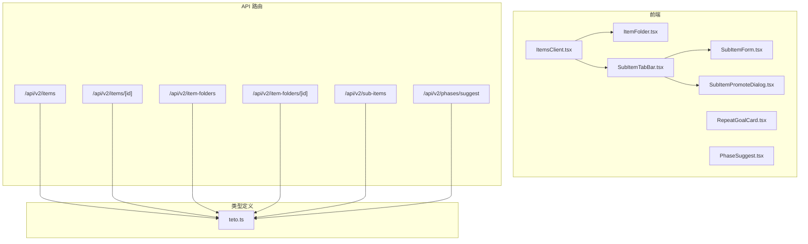

**图表来源**
- [ItemsClient.tsx](file://src/app/(dashboard)/items/ItemsClient.tsx#L114-L484)
- [ItemFolder.tsx](file://src/app/(dashboard)/items/components/ItemFolder.tsx#L44-L207)
- [SubItemForm.tsx](file://src/app/(dashboard)/items/components/SubItemForm.tsx#L1-L123)
- [SubItemPromoteDialog.tsx](file://src/app/(dashboard)/items/components/SubItemPromoteDialog.tsx#L1-L126)
- [SubItemTabBar.tsx](file://src/app/(dashboard)/items/components/SubItemTabBar.tsx#L1-L83)
- [RepeatGoalCard.tsx](file://src/app/(dashboard)/items/components/RepeatGoalCard.tsx#L1-L114)
- [PhaseSuggest.tsx](file://src/app/(dashboard)/items/components/PhaseSuggest.tsx#L1-L234)
- [sub-items 路由（v2）:1-54](file://src/app/api/v2/sub-items/route.ts#L1-L54)
- [phases/suggest 路由（v2）:1-302](file://src/app/api/v2/phases/suggest/route.ts#L1-L302)

**章节来源**
- [ItemsClient.tsx](file://src/app/(dashboard)/items/ItemsClient.tsx#L114-L484)
- [ItemFolder.tsx](file://src/app/(dashboard)/items/components/ItemFolder.tsx#L44-L207)
- [SubItemForm.tsx](file://src/app/(dashboard)/items/components/SubItemForm.tsx#L1-L123)
- [SubItemPromoteDialog.tsx](file://src/app/(dashboard)/items/components/SubItemPromoteDialog.tsx#L1-L126)
- [SubItemTabBar.tsx](file://src/app/(dashboard)/items/components/SubItemTabBar.tsx#L1-L83)
- [RepeatGoalCard.tsx](file://src/app/(dashboard)/items/components/RepeatGoalCard.tsx#L1-L114)
- [PhaseSuggest.tsx](file://src/app/(dashboard)/items/components/PhaseSuggest.tsx#L1-L234)
- [sub-items 路由（v2）:1-54](file://src/app/api/v2/sub-items/route.ts#L1-L54)
- [phases/suggest 路由（v2）:1-302](file://src/app/api/v2/phases/suggest/route.ts#L1-L302)

## 核心组件
- ItemsClient：负责项目列表加载、搜索过滤、分组（置顶/文件夹/未置顶）、拖拽排序、尺寸切换、创建/删除/重命名文件夹、移动项目到文件夹、历史库弹窗等
- WidgetCard：根据尺寸（1x1/2x1/2x2）渲染不同密度的项目卡片，展示标题、状态、图标、阶段/记录统计、最近活跃时间等
- ItemFolder：文件夹组件，支持四宫格预览、展开弹窗、重命名、删除、从文件夹移出子项
- **新增** SubItemForm：子项目表单，支持创建和编辑子项目，包含验证和错误处理
- **新增** SubItemPromoteDialog：子项目升格对话框，提供升格为独立事项的确认界面
- **新增** SubItemTabBar：子项目标签栏，支持子项目切换、编辑和升格操作
- **新增** RepeatGoalCard：重复目标进度卡片，展示重复型目标的完成情况
- **新增** PhaseSuggest：阶段智能建议组件，基于记录分析提供阶段创建建议
- API 路由：提供项目与文件夹的 CRUD 与聚合查询能力，以及子项目管理功能

**章节来源**
- [ItemsClient.tsx](file://src/app/(dashboard)/items/ItemsClient.tsx#L114-L484)
- [ItemFolder.tsx](file://src/app/(dashboard)/items/components/ItemFolder.tsx#L44-L207)
- [SubItemForm.tsx](file://src/app/(dashboard)/items/components/SubItemForm.tsx#L1-L123)
- [SubItemPromoteDialog.tsx](file://src/app/(dashboard)/items/components/SubItemPromoteDialog.tsx#L1-L126)
- [SubItemTabBar.tsx](file://src/app/(dashboard)/items/components/SubItemTabBar.tsx#L1-L83)
- [RepeatGoalCard.tsx](file://src/app/(dashboard)/items/components/RepeatGoalCard.tsx#L1-L114)
- [PhaseSuggest.tsx](file://src/app/(dashboard)/items/components/PhaseSuggest.tsx#L1-L234)
- [sub-items 路由（v2）:1-54](file://src/app/api/v2/sub-items/route.ts#L1-L54)
- [phases/suggest 路由（v2）:1-302](file://src/app/api/v2/phases/suggest/route.ts#L1-L302)

## 架构总览
前端通过 ItemsClient 发起 API 请求，后端路由处理业务逻辑并返回标准化数据；ItemsClient 再基于返回数据进行本地状态管理与 UI 渲染。新增的子项目管理功能通过专门的 API 路由和数据库层实现完整的 CRUD 操作。

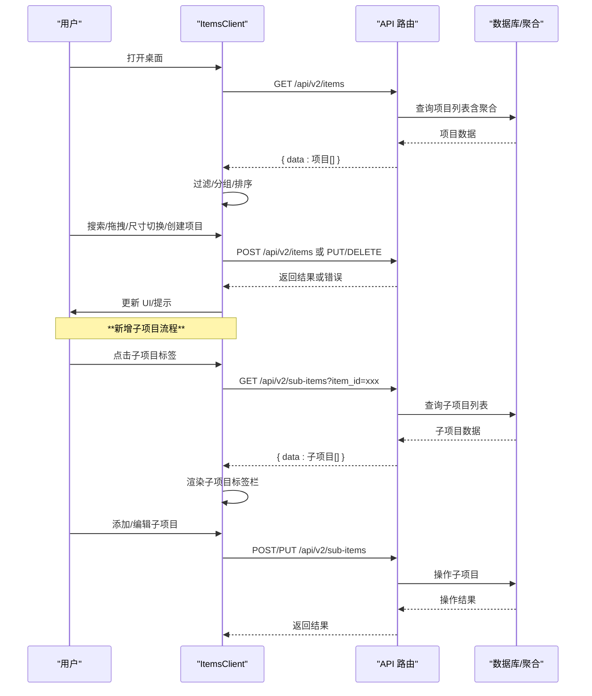

**图表来源**
- [ItemsClient.tsx](file://src/app/(dashboard)/items/ItemsClient.tsx#L140-L170)
- [sub-items 路由（v2）:1-54](file://src/app/api/v2/sub-items/route.ts#L1-L54)
- [sub-items.ts:1-199](file://src/lib/db/sub-items.ts#L1-L199)

**章节来源**
- [ItemsClient.tsx](file://src/app/(dashboard)/items/ItemsClient.tsx#L140-L170)
- [sub-items 路由（v2）:1-54](file://src/app/api/v2/sub-items/route.ts#L1-L54)
- [sub-items.ts:1-199](file://src/lib/db/sub-items.ts#L1-L199)

## 详细组件分析

### ItemsClient 组件分析
- 数据加载与聚合
  - 通过 /api/v2/items 获取项目列表，并注入默认统计字段（阶段数、记录数、最后活跃时间等）
  - 并行加载项目与文件夹数据，减少首屏等待
  - **新增** 支持子项目数据的加载和显示
- 搜索与过滤
  - 支持按标题关键字过滤
  - 归档状态（已完成/已搁置）单独展示于历史库弹窗
- 分组与排序
  - 置顶项目优先
  - 文件夹占位，随后为活跃未置顶项目
  - 本地持久化排序顺序（localStorage）
- 拖拽与尺寸
  - 使用 @dnd-kit 实现拖拽排序
  - 支持 1x1/2x1/2x2 三种尺寸循环切换，本地持久化
- 文件夹集成
  - 创建/删除/重命名文件夹
  - 将项目移入/移出文件夹
- 历史库弹窗
  - 展示归档项目列表，点击跳转详情页

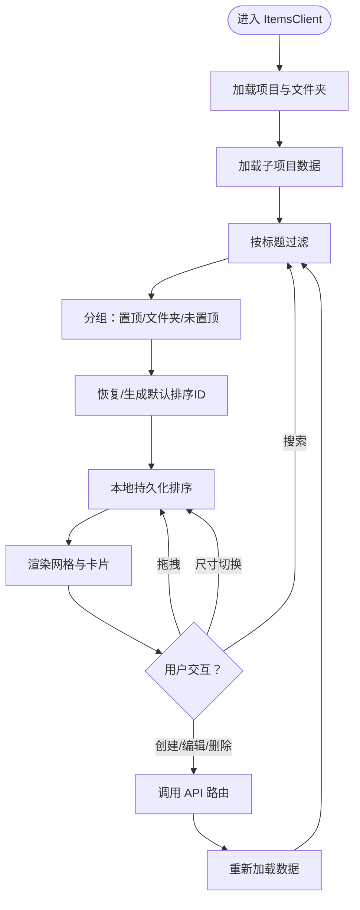

**图表来源**
- [ItemsClient.tsx](file://src/app/(dashboard)/items/ItemsClient.tsx#L176-L229)

**章节来源**
- [ItemsClient.tsx](file://src/app/(dashboard)/items/ItemsClient.tsx#L114-L484)

### WidgetCard 组件分析
- 尺寸策略
  - 1x1：仅显示图标、标题与状态徽标
  - 2x1：显示图标、标题、状态、阶段/记录统计、最近活跃时间
  - 2x2：显示更丰富信息，含活跃阶段高亮、目标追踪提示、统计与时间
- 图标与颜色
  - 若项目未设置 icon，则按标题首字符哈希选择 Lucide 图标
  - 状态到渐变色、徽标色的映射用于视觉区分
- 悬浮操作
  - 支持置顶/取消、切换尺寸、移入文件夹菜单

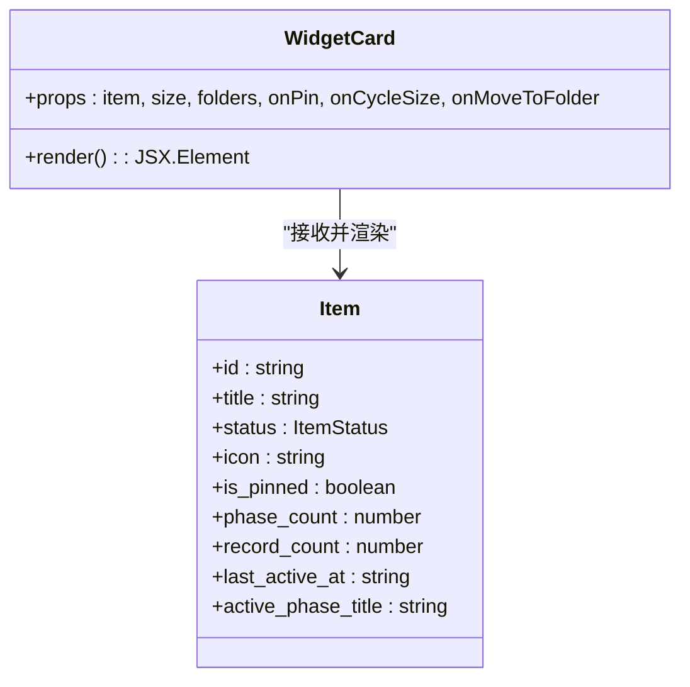

**图表来源**
- [ItemsClient.tsx](file://src/app/(dashboard)/items/ItemsClient.tsx#L489-L600)
- [类型定义（teto.ts）:76-94](file://src/types/teto.ts#L76-L94)

**章节来源**
- [ItemsClient.tsx](file://src/app/(dashboard)/items/ItemsClient.tsx#L489-L600)
- [类型定义（teto.ts）:76-94](file://src/types/teto.ts#L76-L94)

### ItemFolder 组件分析
- iOS 风格四宫格预览，直观展示文件夹内项目状态
- 弹窗式全屏展开，展示文件夹内全部项目，支持重命名、删除、移出子项
- 使用 createPortal 避免与网格布局 transform 穿透

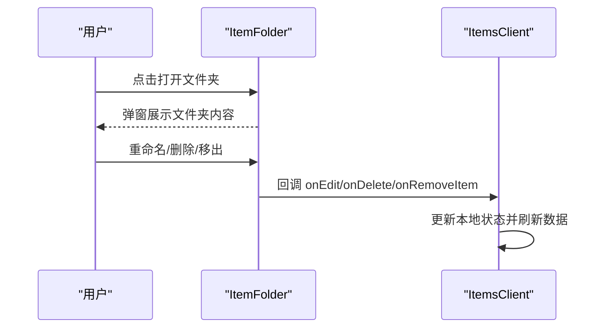

**图表来源**
- [ItemFolder.tsx](file://src/app/(dashboard)/items/components/ItemFolder.tsx#L112-L204)
- [ItemsClient.tsx](file://src/app/(dashboard)/items/ItemsClient.tsx#L300-L327)

**章节来源**
- [ItemFolder.tsx](file://src/app/(dashboard)/items/components/ItemFolder.tsx#L44-L207)
- [ItemsClient.tsx](file://src/app/(dashboard)/items/ItemsClient.tsx#L300-L327)

### API 接口与数据模型

#### 项目数据模型与状态枚举
- Item 字段概览（关键字段）
  - id、user_id、title、description、status、color、icon、is_pinned、started_at、ended_at、goal_id、folder_id、created_at、updated_at
  - 关联数据：recent_records（查询时可能附带）
- **新增** SubItem 字段概览
  - id、user_id、item_id、title、description、sort_order、created_at、updated_at
- 状态枚举（ItemStatus）
  - 活跃、推进中、放缓、停滞、已完成、已搁置
- 图标选择算法
  - pickIcon(title)：以标题首字符编码对图标池长度取模，稳定地为每个标题分配一个 Lucide 图标
- 相对时间格式化
  - formatRelativeTime(dateStr)：根据当前时间与记录时间差，输出"刚刚/XX分钟前/XX小时前/XX天前/XX周前/具体日期"等本地化文案

**章节来源**
- [类型定义（teto.ts）:76-94](file://src/types/teto.ts#L76-L94)
- [类型定义（teto.ts）:21-22](file://src/types/teto.ts#L21-L22)
- [类型定义（teto.ts）:520-530](file://src/types/teto.ts#L520-L530)
- [ItemsClient.tsx](file://src/app/(dashboard)/items/ItemsClient.tsx#L55-L59)
- [ItemsClient.tsx](file://src/app/(dashboard)/items/ItemsClient.tsx#L666-L677)

#### 项目 CRUD API 使用示例（路径）
- 列出项目
  - 方法与路径：GET /api/v2/items
  - 查询参数：status（可选）、is_pinned（可选，'true'/'false'）
  - 成功响应：{ data: Item[] }
  - 示例路径：[items 路由（v2）:6-26](file://src/app/api/v2/items/route.ts#L6-L26)
- 创建项目
  - 方法与路径：POST /api/v2/items
  - 请求体：CreateItemPayload（至少包含 title）
  - 成功响应：{ data: Item }，状态码 201
  - 示例路径：[items 路由（v2）:28-46](file://src/app/api/v2/items/route.ts#L28-L46)
- 获取单个项目详情
  - 方法与路径：GET /api/v2/items/[id]
  - 响应：包含 item、phases（含阶段聚合与阶段目标）、goal（兼容旧模型）、goals（新模型）、aggregation（事项级聚合）
  - 示例路径：[items/[id] 路由（v2）](file://src/app/api/v2/items/[id]/route.ts#L9-L58)
- 更新项目
  - 方法与路径：PUT /api/v2/items/[id]
  - 请求体：UpdateItemPayload（可部分字段）
  - 成功响应：{ data: Item }
  - 示例路径：[items/[id] 路由（v2）](file://src/app/api/v2/items/[id]/route.ts#L60-L78)
- 删除项目
  - 方法与路径：DELETE /api/v2/items/[id]
  - 成功响应：{ data: { id } }
  - 示例路径：[items/[id] 路由（v2）](file://src/app/api/v2/items/[id]/route.ts#L80-L97)

#### 文件夹 CRUD API 使用示例（路径）
- 列出文件夹
  - 方法与路径：GET /api/v2/item-folders
  - 成功响应：{ data: ItemFolder[] }
  - 示例路径：[item-folders 路由（v2）:6-18](file://src/app/api/v2/item-folders/route.ts#L6-L18)
- 创建文件夹
  - 方法与路径：POST /api/v2/item-folders
  - 请求体：CreateItemFolderPayload（至少包含 name）
  - 成功响应：{ data: ItemFolder }，状态码 201
  - 示例路径：[item-folders 路由（v2）:20-38](file://src/app/api/v2/item-folders/route.ts#L20-L38)
- 获取单个文件夹
  - 方法与路径：GET /api/v2/item-folders/[id]
  - 成功响应：{ data: ItemFolder }
  - 示例路径：[item-folders/[id] 路由（v2）](file://src/app/api/v2/item-folders/[id]/route.ts#L6-L27)
- 更新文件夹
  - 方法与路径：PUT /api/v2/item-folders/[id]
  - 请求体：UpdateItemFolderPayload（可部分字段）
  - 成功响应：{ data: ItemFolder }
  - 示例路径：[item-folders/[id] 路由（v2）](file://src/app/api/v2/item-folders/[id]/route.ts#L29-L46)
- 删除文件夹
  - 方法与路径：DELETE /api/v2/item-folders/[id]
  - 成功响应：{ data: { success: true } }
  - 示例路径：[item-folders/[id] 路由（v2）](file://src/app/api/v2/item-folders/[id]/route.ts#L48-L64)

**章节来源**
- [items 路由（v2）:6-46](file://src/app/api/v2/items/route.ts#L6-L46)
- [items/[id] 路由（v2）](file://src/app/api/v2/items/[id]/route.ts#L9-L97)
- [item-folders 路由（v2）:6-38](file://src/app/api/v2/item-folders/route.ts#L6-L38)
- [item-folders/[id] 路由（v2）](file://src/app/api/v2/item-folders/[id]/route.ts#L6-L64)

## 子项目管理功能

### SubItemForm 组件分析
- 功能特性
  - 支持创建新子项目和编辑现有子项目
  - 包含标题和描述输入字段
  - 实时验证和错误处理
  - 加载状态指示
- 表单验证
  - 标题不能为空
  - 自动去除首尾空格
  - 错误信息本地化显示
- API 集成
  - 创建：POST /api/v2/sub-items
  - 更新：PUT /api/v2/sub-items/{id}
  - 自动处理响应状态和错误

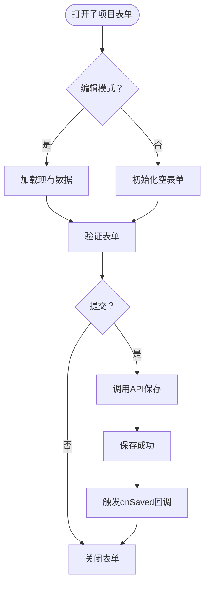

**图表来源**
- [SubItemForm.tsx](file://src/app/(dashboard)/items/components/SubItemForm.tsx#L20-L57)

**章节来源**
- [SubItemForm.tsx](file://src/app/(dashboard)/items/components/SubItemForm.tsx#L1-L123)

### SubItemPromoteDialog 组件分析
- 功能特性
  - 子项目升格为独立事项的确认对话框
  - 预览升格后的效果
  - 可选的历史记录迁移
  - 详细的使用说明和提示
- 升格流程
  - 验证子项目存在性
  - 可选迁移历史记录
  - 创建新的独立事项
  - 迁移关联目标
  - 保留子项目作为历史记录
- 安全措施
  - 确认对话框防止误操作
  - 详细的提示信息说明影响
  - 加载状态防止重复提交

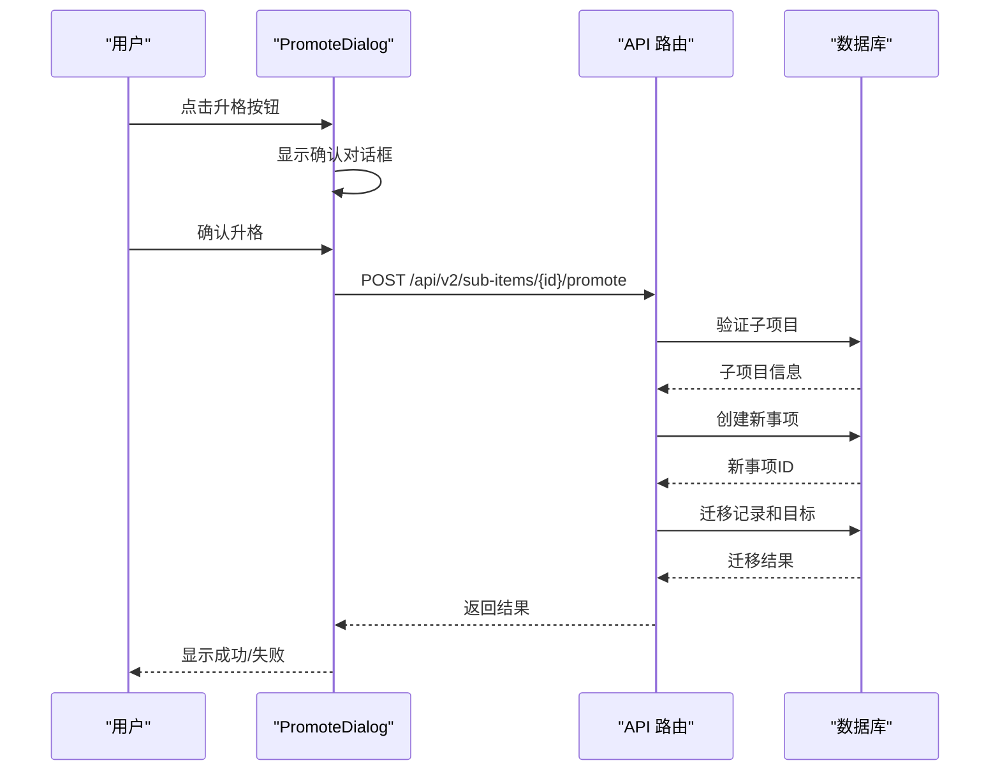

**图表来源**
- [SubItemPromoteDialog.tsx](file://src/app/(dashboard)/items/components/SubItemPromoteDialog.tsx#L21-L124)
- [sub-items/[id]/promote 路由（v2）](file://src/app/api/v2/sub-items/[id]/promote/route.ts#L12-L45)

**章节来源**
- [SubItemPromoteDialog.tsx](file://src/app/(dashboard)/items/components/SubItemPromoteDialog.tsx#L1-L126)
- [sub-items/[id]/promote 路由（v2）](file://src/app/api/v2/sub-items/[id]/promote/route.ts#L1-L46)

### SubItemTabBar 组件分析
- 功能特性
  - 子项目标签栏，支持多个子项目的切换
  - "全部"标签显示所有记录
  - 每个子项目显示对应的标签
  - 隐藏操作按钮（编辑、升格）
- 交互设计
  - 点击标签切换显示范围
  - 悬停显示操作按钮
  - 响应式布局适应不同屏幕尺寸
- 操作功能
  - 新建子项目按钮
  - 编辑子项目按钮
  - 升格为独立事项按钮

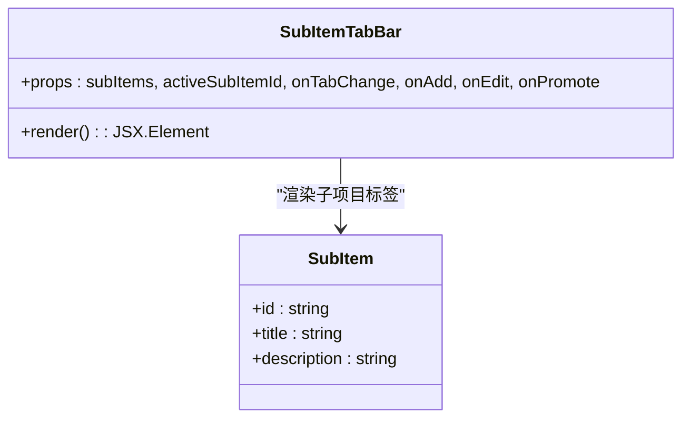

**图表来源**
- [SubItemTabBar.tsx](file://src/app/(dashboard)/items/components/SubItemTabBar.tsx#L16-L82)

**章节来源**
- [SubItemTabBar.tsx](file://src/app/(dashboard)/items/components/SubItemTabBar.tsx#L1-L83)

### 子项目 API 接口
- 获取子项目列表
  - 方法与路径：GET /api/v2/sub-items?item_id=xxx
  - 查询参数：item_id（必需）
  - 成功响应：{ data: SubItem[] }
  - 示例路径：[sub-items 路由（v2）:10-29](file://src/app/api/v2/sub-items/route.ts#L10-L29)
- 创建子项目
  - 方法与路径：POST /api/v2/sub-items
  - 请求体：CreateSubItemPayload（至少包含 item_id 和 title）
  - 成功响应：{ data: SubItem }，状态码 201
  - 示例路径：[sub-items 路由（v2）:35-53](file://src/app/api/v2/sub-items/route.ts#L35-L53)
- 获取单个子项目
  - 方法与路径：GET /api/v2/sub-items/{id}
  - 成功响应：{ data: SubItem }
  - 示例路径：[sub-items/[id] 路由（v2）:10-31](file://src/app/api/v2/sub-items/[id]/route.ts#L10-L31)
- 更新子项目
  - 方法与路径：PUT /api/v2/sub-items/{id}
  - 请求体：UpdateSubItemPayload（可部分字段）
  - 成功响应：{ data: SubItem }
  - 示例路径：[sub-items/[id] 路由（v2）:37-55](file://src/app/api/v2/sub-items/[id]/route.ts#L37-L55)
- 删除子项目
  - 方法与路径：DELETE /api/v2/sub-items/{id}
  - 成功响应：{ success: true }
  - 示例路径：[sub-items/[id] 路由（v2）:61-78](file://src/app/api/v2/sub-items/[id]/route.ts#L61-L78)
- 子项目升格
  - 方法与路径：POST /api/v2/sub-items/{id}/promote
  - 请求体：{ migrate_records: boolean }
  - 成功响应：{ data: { new_item_id: string, sub_item: SubItem, migrated_records: boolean } }
  - 示例路径：[sub-items/[id]/promote 路由（v2）:12-45](file://src/app/api/v2/sub-items/[id]/promote/route.ts#L12-L45)

**章节来源**
- [sub-items 路由（v2）:1-54](file://src/app/api/v2/sub-items/route.ts#L1-L54)
- [sub-items/[id] 路由（v2）](file://src/app/api/v2/sub-items/[id]/route.ts#L1-L79)
- [sub-items/[id]/promote 路由（v2）](file://src/app/api/v2/sub-items/[id]/promote/route.ts#L1-L46)

### 子项目数据库操作
- getSubItemsByItemId：按事项ID获取子项目列表，按排序和创建时间排序
- getSubItemById：按ID获取单个子项目
- createSubItem：创建新子项目
- updateSubItem：更新子项目信息
- deleteSubItem：删除子项目
- **新增** promoteSubItemToItem：子项目升格为独立事项的完整流程

**章节来源**
- [sub-items.ts:1-199](file://src/lib/db/sub-items.ts#L1-L199)

## 重复目标跟踪

### RepeatGoalCard 组件分析
- 功能特性
  - 展示重复型目标的当前周期进度
  - 显示7天和30天完成次数统计
  - 显示当前周期的起止日期
  - 基于完成度的颜色编码
- 进度计算
  - current_period_progress：当前周期完成进度（0-1）
  - color logic：根据完成度选择颜色（绿色完成/琥珀色进行中/红色待开始）
  - progressPercent：进度百分比显示
- 统计信息
  - count_7d：近7天完成次数
  - count_30d：近30天完成次数
  - current_period_actual：当前周期实际完成数
  - repeat_count：周期目标次数

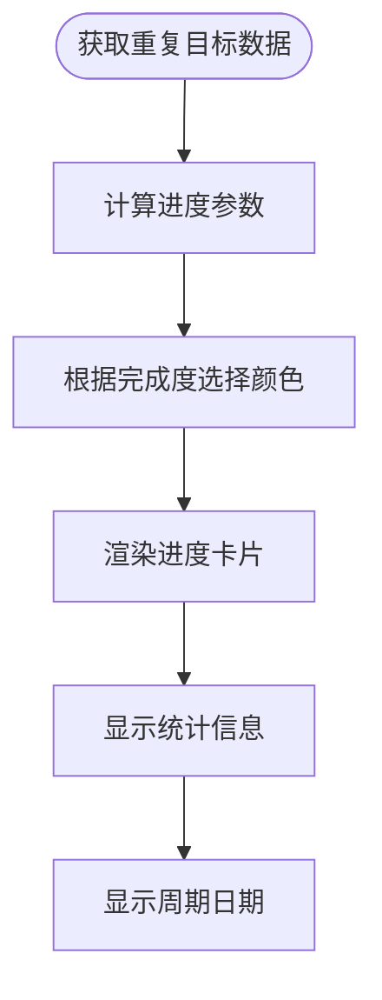

**图表来源**
- [RepeatGoalCard.tsx](file://src/app/(dashboard)/items/components/RepeatGoalCard.tsx#L16-L103)

**章节来源**
- [RepeatGoalCard.tsx](file://src/app/(dashboard)/items/components/RepeatGoalCard.tsx#L1-L114)

## 阶段智能建议

### PhaseSuggest 组件分析
- 功能特性
  - 基于记录分析生成阶段建议
  - 支持直接采纳或修改后创建
  - AI驱动的标题生成和质量过滤
  - 详细的理由说明和可视化展示
- 分析算法
  - 获取近90天的记录数据
  - 按周聚合记录密度
  - 检测密度变化点（连续高于均值1.3倍的周段）
  - 生成阶段标题和理由
- 质量过滤
  - 排除纯数字编号和纯时间范围的标题
  - 确保标题包含行为/状态描述词
  - 避免与现有阶段同名
  - 过滤与现有阶段重叠超过70%的建议

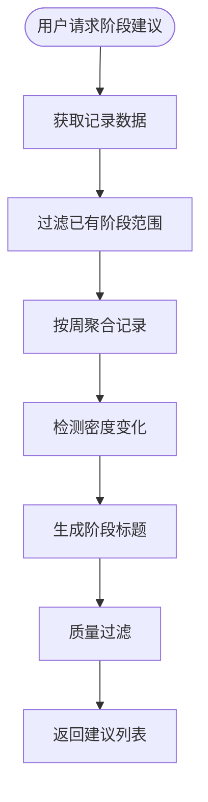

**图表来源**
- [PhaseSuggest.tsx](file://src/app/(dashboard)/items/components/PhaseSuggest.tsx#L26-L229)

**章节来源**
- [PhaseSuggest.tsx](file://src/app/(dashboard)/items/components/PhaseSuggest.tsx#L1-L234)

### 阶段建议 API 接口
- 获取阶段建议
  - 方法与路径：GET /api/v2/phases/suggest?item_id=xxx
  - 查询参数：item_id（必需）
  - 成功响应：{ data: PhaseSuggestion[] }
  - 建议数量：最多3个
  - 示例路径：[phases/suggest 路由（v2）:12-229](file://src/app/api/v2/phases/suggest/route.ts#L12-L229)

**章节来源**
- [phases/suggest 路由（v2）:1-302](file://src/app/api/v2/phases/suggest/route.ts#L1-L302)

## 依赖分析
- 组件耦合
  - ItemsClient 依赖 ItemFolder 组件进行文件夹渲染与交互
  - **新增** ItemsClient 依赖 SubItemTabBar 进行子项目标签管理
  - SubItemTabBar 依赖 SubItemForm 和 SubItemPromoteDialog 进行子项目操作
  - 两者均依赖类型定义 teto.ts 中的 Item、ItemFolder、ItemStatus、SubItem 等
- 外部依赖
  - @dnd-kit：实现拖拽排序
  - lucide-react：提供图标
  - use-toast：全局提示
- API 依赖
  - 项目与文件夹的 CRUD 依赖对应的 API 路由
  - **新增** 子项目管理依赖专门的 API 路由
  - **新增** 阶段建议依赖复杂的分析算法
  - 项目详情接口同时返回阶段、目标与聚合数据，减少前端二次请求

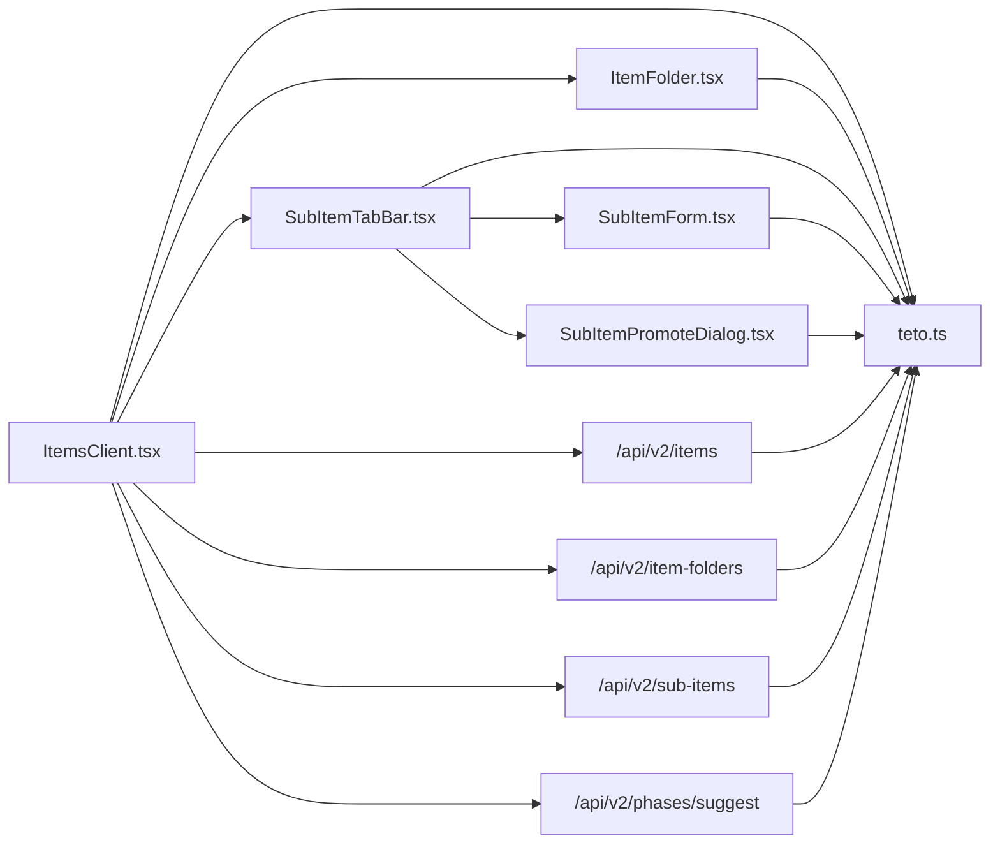

**图表来源**
- [ItemsClient.tsx](file://src/app/(dashboard)/items/ItemsClient.tsx#L23-L23)
- [ItemFolder.tsx](file://src/app/(dashboard)/items/components/ItemFolder.tsx#L7-L7)
- [SubItemTabBar.tsx](file://src/app/(dashboard)/items/components/SubItemTabBar.tsx#L4-L4)
- [SubItemForm.tsx](file://src/app/(dashboard)/items/components/SubItemForm.tsx#L4-L4)
- [SubItemPromoteDialog.tsx](file://src/app/(dashboard)/items/components/SubItemPromoteDialog.tsx#L4-L4)
- [sub-items 路由（v2）:3-4](file://src/app/api/v2/sub-items/route.ts#L3-L4)
- [phases/suggest 路由（v2）:3-4](file://src/app/api/v2/phases/suggest/route.ts#L3-L4)
- [类型定义（teto.ts）:76-94](file://src/types/teto.ts#L76-L94)

**章节来源**
- [ItemsClient.tsx](file://src/app/(dashboard)/items/ItemsClient.tsx#L23-L23)
- [ItemFolder.tsx](file://src/app/(dashboard)/items/components/ItemFolder.tsx#L7-L7)
- [SubItemTabBar.tsx](file://src/app/(dashboard)/items/components/SubItemTabBar.tsx#L4-L4)
- [SubItemForm.tsx](file://src/app/(dashboard)/items/components/SubItemForm.tsx#L4-L4)
- [SubItemPromoteDialog.tsx](file://src/app/(dashboard)/items/components/SubItemPromoteDialog.tsx#L4-L4)
- [sub-items 路由（v2）:3-4](file://src/app/api/v2/sub-items/route.ts#L3-L4)
- [phases/suggest 路由（v2）:3-4](file://src/app/api/v2/phases/suggest/route.ts#L3-L4)
- [类型定义（teto.ts）:76-94](file://src/types/teto.ts#L76-L94)

## 性能考量
- 减少 N+1 查询
  - 项目列表接口已聚合阶段数、记录数、最后活跃时间等统计，避免客户端二次请求
  - **新增** 子项目数据按事项ID批量获取，减少数据库查询次数
- 并行加载
  - 项目与文件夹数据并行获取，缩短首屏时间
  - **新增** 子项目和阶段建议数据支持并行加载
- 本地持久化
  - 排序与尺寸通过 localStorage 缓存，避免每次刷新重算
  - **新增** 子项目标签状态和切换状态本地缓存
- 拖拽性能
  - 使用 @dnd-kit 的指针传感器与碰撞检测，保证流畅体验
- **新增** AI分析性能
  - 阶段建议采用分步加载和缓存策略
  - 记录分析限制在90天范围内，避免大数据量影响性能

## 故障排查指南
- 加载失败
  - 现象：加载动画持续或提示"加载事项失败，请刷新重试"
  - 排查：检查网络与认证状态；确认 API 路由是否返回 2xx；查看浏览器控制台错误
- 创建失败
  - 现象：创建按钮禁用或提示"创建事项失败"
  - 排查：确认请求体包含 title；检查后端返回的错误消息
- 拖拽无效
  - 现象：拖拽无反应
  - 排查：确保 DndContext 与 SortableContext 正确包裹；检查 item id 是否存在于排序列表
- 归档显示异常
  - 现象：历史库为空或状态不正确
  - 排查：确认项目状态为"已完成/已搁置"；检查过滤逻辑
- **新增** 子项目操作失败
  - 现象：子项目创建/编辑/删除失败
  - 排查：检查 item_id 参数；确认子项目标题非空；查看API返回的错误信息
- **新增** 子项目升格失败
  - 现象：升格操作无响应或报错
  - 排查：确认子项目存在且属于当前用户；检查迁移选项设置；查看数据库操作日志
- **新增** 阶段建议无结果
  - 现象：阶段建议为空
  - 排查：确认事项有足够的记录数据；检查90天时间范围内的记录；查看分析算法日志

**章节来源**
- [ItemsClient.tsx](file://src/app/(dashboard)/items/ItemsClient.tsx#L154-L157)
- [ItemsClient.tsx](file://src/app/(dashboard)/items/ItemsClient.tsx#L232-L242)
- [ItemsClient.tsx](file://src/app/(dashboard)/items/ItemsClient.tsx#L222-L229)
- [SubItemForm.tsx](file://src/app/(dashboard)/items/components/SubItemForm.tsx#L45-L56)
- [SubItemPromoteDialog.tsx](file://src/app/(dashboard)/items/components/SubItemPromoteDialog.tsx#L21-L45)
- [PhaseSuggest.tsx](file://src/app/(dashboard)/items/components/PhaseSuggest.tsx#L34-L43)

## 结论
TETO 的项目管理模块通过 ItemsClient 提供了高度可定制的桌面视图：支持项目创建、编辑、删除、置顶、尺寸切换、拖拽排序、文件夹分组与历史归档；配合清晰的数据模型与稳定的 API 接口，实现了良好的用户体验与可扩展性。

**新增功能总结**
- **子项目管理**：提供了完整的子项目生命周期管理，包括创建、编辑、删除、升格为独立事项等功能
- **重复目标跟踪**：支持重复型目标的进度监控，提供详细的统计和可视化展示
- **阶段智能建议**：基于AI分析提供阶段创建建议，提升项目管理效率
- **增强的用户体验**：通过标签栏、推广对话框等组件优化用户操作流程

建议在实际使用中充分利用子项目功能进行更细粒度的项目分类，结合重复目标跟踪和阶段建议功能，构建更加完善的工作流管理体系。

## 附录

### 项目数据模型（简表）
- Item
  - 关键字段：id、title、status、is_pinned、folder_id、phase_count（聚合）、record_count（聚合）、last_active_at（聚合）
  - 关联：phases、goals、aggregation
- **新增** SubItem
  - 关键字段：id、item_id、title、description、sort_order
  - 关联：records、goals（通过子项目关联）
- ItemFolder
  - 关键字段：id、name、sort_order
- **新增** RepeatGoalEngineResult
  - 关键字段：goal_title、repeat_frequency、repeat_count、current_period_start、current_period_end、current_period_actual、current_period_progress、count_7d、count_30d
- API 类型
  - CreateItemPayload、UpdateItemPayload、ItemsQuery、ItemAggregation、PhaseAggregation、Goal
  - **新增** CreateSubItemPayload、UpdateSubItemPayload、SubItem、PhaseSuggestion

**章节来源**
- [类型定义（teto.ts）:76-94](file://src/types/teto.ts#L76-L94)
- [类型定义（teto.ts）:21-22](file://src/types/teto.ts#L21-L22)
- [类型定义（teto.ts）:520-530](file://src/types/teto.ts#L520-L530)
- [类型定义（teto.ts）:429-437](file://src/types/teto.ts#L429-L437)
- [类型定义（teto.ts）:194-217](file://src/types/teto.ts#L194-L217)
- [类型定义（teto.ts）:247-251](file://src/types/teto.ts#L247-L251)
- [类型定义（teto.ts）:454-463](file://src/types/teto.ts#L454-L463)
- [类型定义（teto.ts）:506-515](file://src/types/teto.ts#L506-L515)
- [类型定义（teto.ts）:532-540](file://src/types/teto.ts#L532-L540)