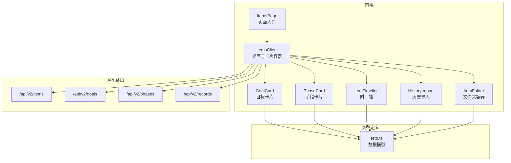
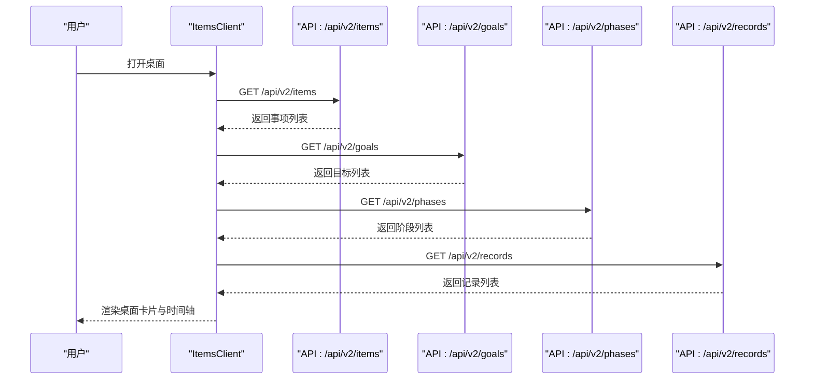
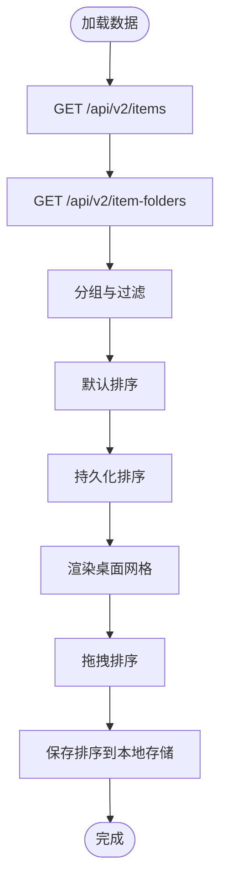
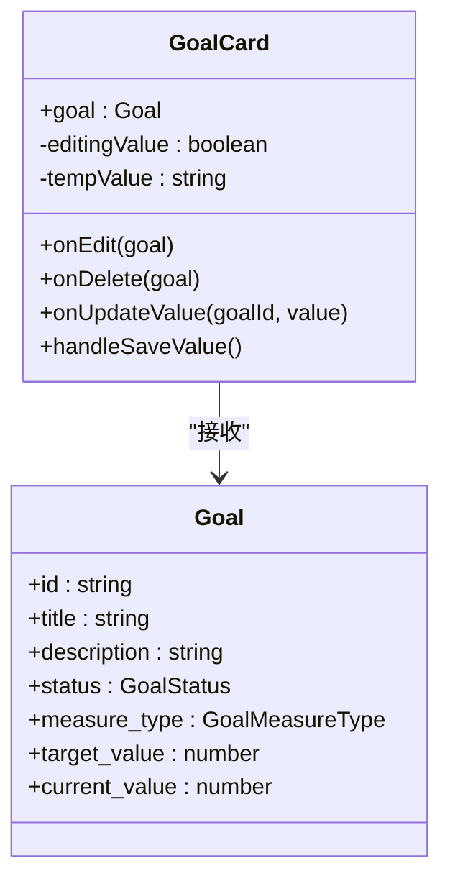
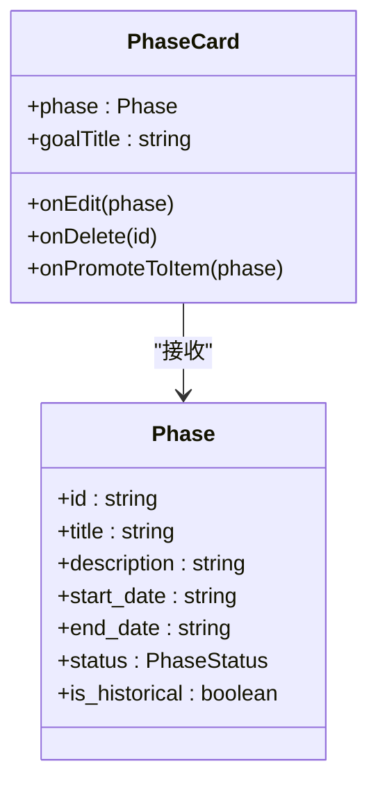
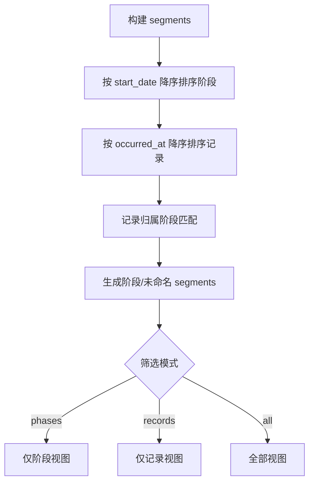
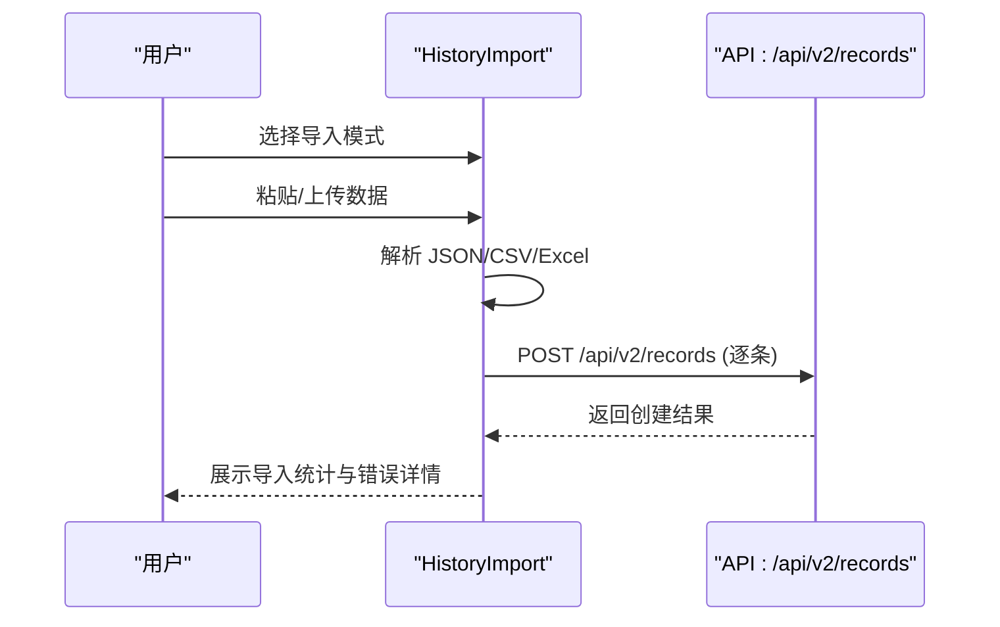
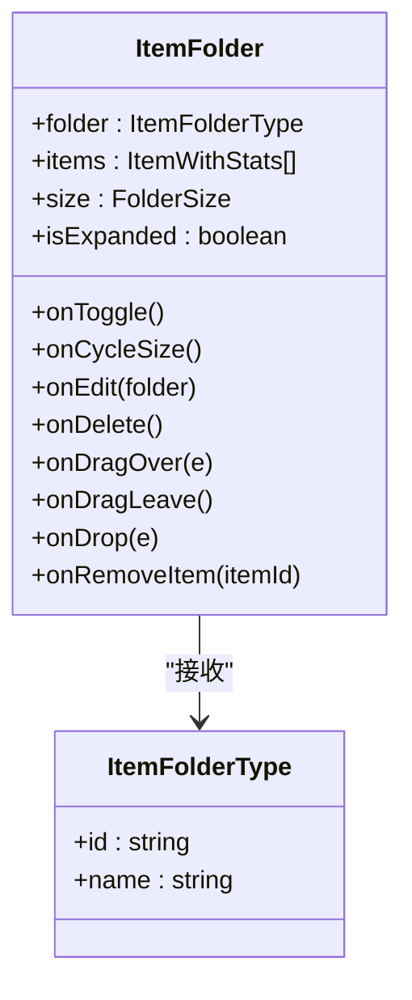
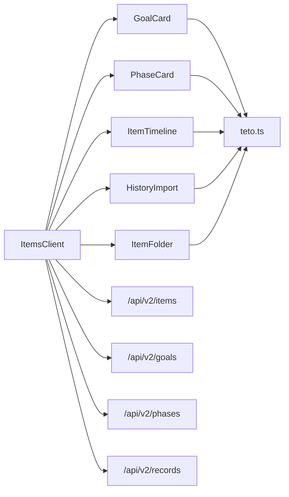
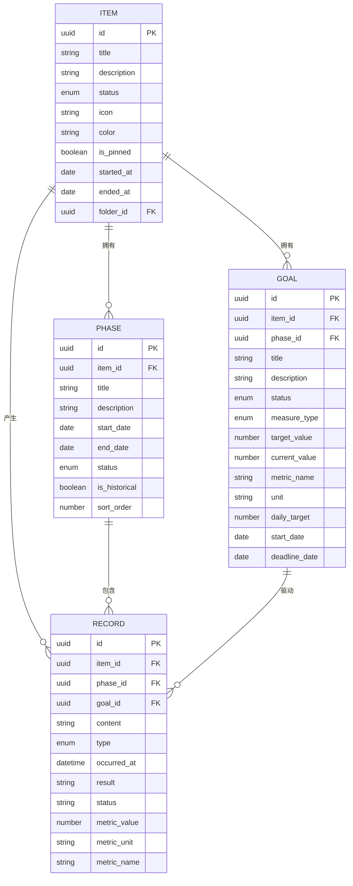

# 项目跟踪系统

<cite>
**本文档引用的文件**
- [ItemsClient.tsx](file://src/app/(dashboard)/items/ItemsClient.tsx)
- [GoalCard.tsx](file://src/app/(dashboard)/items/components/GoalCard.tsx)
- [PhaseCard.tsx](file://src/app/(dashboard)/items/components/PhaseCard.tsx)
- [ItemTimeline.tsx](file://src/app/(dashboard)/items/components/ItemTimeline.tsx)
- [HistoryImport.tsx](file://src/app/(dashboard)/items/components/HistoryImport.tsx)
- [ItemFolder.tsx](file://src/app/(dashboard)/items/components/ItemFolder.tsx)
- [teto.ts](file://src/types/teto.ts)
- [route.ts](file://src/app/api/v2/items/route.ts)
- [route.ts](file://src/app/api/v2/goals/route.ts)
- [route.ts](file://src/app/api/v2/phases/route.ts)
- [route.ts](file://src/app/api/v2/records/route.ts)
- [page.tsx](file://src/app/(dashboard)/items/page.tsx)
</cite>

## 目录
1. [简介](#简介)
2. [项目结构](#项目结构)
3. [核心组件](#核心组件)
4. [架构总览](#架构总览)
5. [详细组件分析](#详细组件分析)
6. [依赖分析](#依赖分析)
7. [性能考虑](#性能考虑)
8. [故障排除指南](#故障排除指南)
9. [结论](#结论)
10. [附录](#附录)

## 简介
本项目为 TETO 项目跟踪系统，围绕「事项」为核心实体，提供项目创建与管理、目标设定与跟踪、阶段划分与进度管理、时间轴展示以及历史导入功能。系统采用 Next.js App Router 架构，前端组件通过客户端组件与服务端 API 交互，数据模型遵循 TypeScript 类型定义，确保强类型约束与可维护性。

## 项目结构
- 前端页面与组件位于 `src/app/(dashboard)/items/`，包含桌面视图 ItemsClient、目标/阶段/时间轴组件以及历史导入组件。
- 类型定义集中在 `src/types/teto.ts`，涵盖事项、目标、阶段、记录等核心数据结构。
- API 路由位于 `src/app/api/v2/`，提供对 items、goals、phases、records 的增删改查接口。
- 页面入口为 `src/app/(dashboard)/items/page.tsx`，渲染 ItemsClient。

**图表来源**
- [page.tsx](file://src/app/(dashboard)/items/page.tsx#L1-L6)
- [ItemsClient.tsx](file://src/app/(dashboard)/items/ItemsClient.tsx#L1-L678)
- [GoalCard.tsx](file://src/app/(dashboard)/items/components/GoalCard.tsx#L1-L114)
- [PhaseCard.tsx](file://src/app/(dashboard)/items/components/PhaseCard.tsx#L1-L125)
- [ItemTimeline.tsx](file://src/app/(dashboard)/items/components/ItemTimeline.tsx#L1-L341)
- [HistoryImport.tsx](file://src/app/(dashboard)/items/components/HistoryImport.tsx#L1-L783)
- [ItemFolder.tsx](file://src/app/(dashboard)/items/components/ItemFolder.tsx#L1-L208)
- [route.ts:1-47](file://src/app/api/v2/items/route.ts#L1-L47)
- [route.ts:1-49](file://src/app/api/v2/goals/route.ts#L1-L49)
- [route.ts:1-72](file://src/app/api/v2/phases/route.ts#L1-L72)
- [route.ts:1-86](file://src/app/api/v2/records/route.ts#L1-L86)
- [teto.ts:1-516](file://src/types/teto.ts#L1-L516)

**章节来源**
- [page.tsx](file://src/app/(dashboard)/items/page.tsx#L1-L6)
- [ItemsClient.tsx](file://src/app/(dashboard)/items/ItemsClient.tsx#L1-L678)
- [teto.ts:1-516](file://src/types/teto.ts#L1-L516)

## 核心组件
- ItemsClient：桌面视图主控制器，负责加载事项与文件夹、分组与排序、拖拽与尺寸切换、历史库弹窗、创建与编辑交互。
- GoalCard：目标卡片组件，支持数值型/布尔型目标展示、进度条、状态徽章与数值编辑。
- PhaseCard：阶段卡片组件，展示阶段时间范围、状态与描述，并提供编辑/删除/升级为事项等操作。
- ItemTimeline：时间轴组件，支持按阶段与记录的组合视图，提供阶段竖条与记录卡片联动展示。
- HistoryImport：历史导入组件，支持 JSON/CSV/Excel 三种格式，自动解析并批量导入记录，或补录历史阶段。
- ItemFolder：文件夹容器组件，提供 iOS 风格四宫格预览与全屏弹窗，支持拖拽放入/移出事项。

**章节来源**
- [ItemsClient.tsx](file://src/app/(dashboard)/items/ItemsClient.tsx#L114-L484)
- [GoalCard.tsx](file://src/app/(dashboard)/items/components/GoalCard.tsx#L21-L114)
- [PhaseCard.tsx](file://src/app/(dashboard)/items/components/PhaseCard.tsx#L28-L125)
- [ItemTimeline.tsx](file://src/app/(dashboard)/items/components/ItemTimeline.tsx#L106-L290)
- [HistoryImport.tsx](file://src/app/(dashboard)/items/components/HistoryImport.tsx#L42-L783)
- [ItemFolder.tsx](file://src/app/(dashboard)/items/components/ItemFolder.tsx#L44-L208)

## 架构总览
系统采用「客户端组件 + 服务端 API」的前后端分离模式：
- 客户端组件通过 fetch 调用 `/api/v2/*` 接口，获取/创建/更新数据。
- 数据模型统一定义于 `teto.ts`，确保前后端一致的类型约束。
- 桌面采用 DndKit 实现拖拽排序，结合本地存储持久化布局。
- 时间轴组件根据阶段与记录的时间关系进行智能分段与展示。

**图表来源**
- [ItemsClient.tsx](file://src/app/(dashboard)/items/ItemsClient.tsx#L140-L170)
- [route.ts:6-26](file://src/app/api/v2/items/route.ts#L6-L26)
- [route.ts:6-27](file://src/app/api/v2/goals/route.ts#L6-L27)
- [route.ts:7-29](file://src/app/api/v2/phases/route.ts#L7-L29)
- [route.ts:7-42](file://src/app/api/v2/records/route.ts#L7-L42)

**章节来源**
- [ItemsClient.tsx](file://src/app/(dashboard)/items/ItemsClient.tsx#L114-L174)
- [route.ts:1-47](file://src/app/api/v2/items/route.ts#L1-L47)
- [route.ts:1-49](file://src/app/api/v2/goals/route.ts#L1-L49)
- [route.ts:1-72](file://src/app/api/v2/phases/route.ts#L1-L72)
- [route.ts:1-86](file://src/app/api/v2/records/route.ts#L1-L86)

## 详细组件分析

### ItemsClient 组件分析
- 数据加载与聚合：通过 `/api/v2/items` 获取事项列表，同时并发加载文件夹与目标/阶段/记录统计数据，避免 N+1 查询。
- 分组与过滤：支持搜索、置顶、文件夹分组、归档过滤；默认按置顶 → 文件夹 → 活跃顺序排列。
- 拖拽排序：基于 DndKit 的 SortableContext，使用本地存储持久化排序顺序。
- 尺寸管理：支持 1x1/2x1/2x2 三种卡片尺寸，用户可循环切换并持久化。
- 历史库弹窗：展示已完成/已搁置的归档事项，便于快速跳转。
- 文件夹操作：创建/重命名/删除文件夹，支持拖拽将事项移入/移出文件夹。

**图表来源**
- [ItemsClient.tsx](file://src/app/(dashboard)/items/ItemsClient.tsx#L140-L229)

**章节来源**
- [ItemsClient.tsx](file://src/app/(dashboard)/items/ItemsClient.tsx#L114-L484)

### GoalCard 组件分析
- 目标展示：标题、状态徽章、描述。
- 数值型目标：计算进度百分比，超过 100% 时进度条显示达成色；支持内联编辑当前值。
- 布尔型目标：根据状态显示「已达标/未达标」。
- 操作：编辑与删除按钮，回调父组件进行更新。

**图表来源**
- [GoalCard.tsx](file://src/app/(dashboard)/items/components/GoalCard.tsx#L21-L114)
- [teto.ts:316-335](file://src/types/teto.ts#L316-L335)

**章节来源**
- [GoalCard.tsx](file://src/app/(dashboard)/items/components/GoalCard.tsx#L1-L114)
- [teto.ts:303-335](file://src/types/teto.ts#L303-L335)

### PhaseCard 组件分析
- 阶段展示：时间范围、标题、状态徽章、描述。
- 历史阶段：特殊样式与「历史」标签。
- 操作：编辑、删除、升级为事项（可选）。

**图表来源**
- [PhaseCard.tsx](file://src/app/(dashboard)/items/components/PhaseCard.tsx#L28-L125)
- [teto.ts:338-354](file://src/types/teto.ts#L338-L354)

**章节来源**
- [PhaseCard.tsx](file://src/app/(dashboard)/items/components/PhaseCard.tsx#L1-L125)
- [teto.ts:307-354](file://src/types/teto.ts#L307-L354)

### ItemTimeline 组件分析
- 时间线构建：将记录按阶段归属分段，未归属记录单独作为「未命名」段。
- 展示模式：
  - 仅阶段：竖线+阶段卡片列表。
  - 仅记录：竖线+点状记录卡片。
  - 全部：左右布局，左侧记录卡片，右侧阶段竖条与悬停信息。
- 交互：点击阶段卡片或右侧竖条可编辑阶段；点击记录卡片可编辑记录。

**图表来源**
- [ItemTimeline.tsx](file://src/app/(dashboard)/items/components/ItemTimeline.tsx#L40-L104)

**章节来源**
- [ItemTimeline.tsx](file://src/app/(dashboard)/items/components/ItemTimeline.tsx#L1-L341)

### HistoryImport 组件分析
- 导入模式：「历史具体记录」与「历史阶段概括」两种路径。
- 数据解析：
  - JSON：数组对象，要求包含 content 字段。
  - CSV：自动识别 content/type/occurred_at 列。
  - Excel：读取首张工作表，校验列名。
- 导入流程：逐条校验并调用 `/api/v2/records` 创建记录，统计导入结果。
- 模板下载：支持 CSV/Excel 模板下载，便于用户快速填写。

**图表来源**
- [HistoryImport.tsx](file://src/app/(dashboard)/items/components/HistoryImport.tsx#L296-L361)
- [route.ts:44-85](file://src/app/api/v2/records/route.ts#L44-L85)

**章节来源**
- [HistoryImport.tsx](file://src/app/(dashboard)/items/components/HistoryImport.tsx#L1-L783)
- [route.ts:1-86](file://src/app/api/v2/records/route.ts#L1-L86)

### ItemFolder 组件分析
- iOS 风格四宫格预览：展示文件夹内事项的图标与状态色块。
- 全屏弹窗：点击预览打开，展示文件夹内所有事项卡片，支持移出事项。
- 拖拽交互：支持拖拽将事项放入文件夹，提供视觉反馈。

**图表来源**
- [ItemFolder.tsx](file://src/app/(dashboard)/items/components/ItemFolder.tsx#L44-L208)
- [teto.ts:429-437](file://src/types/teto.ts#L429-L437)

**章节来源**
- [ItemFolder.tsx](file://src/app/(dashboard)/items/components/ItemFolder.tsx#L1-L208)
- [teto.ts:429-437](file://src/types/teto.ts#L429-L437)

## 依赖分析
- 组件间依赖：
  - ItemsClient 依赖 GoalCard、PhaseCard、ItemTimeline、HistoryImport、ItemFolder。
  - GoalCard/PhaseCard/ItemTimeline/HistoryImport/ItemFolder 依赖 teto.ts 中的数据模型。
- API 依赖：
  - ItemsClient 依赖 /api/v2/items、/api/v2/goals、/api/v2/phases、/api/v2/records。
- 外部库：
  - DndKit：拖拽排序。
  - Lucide：图标库。
  - xlsx：Excel 解析。

**图表来源**
- [ItemsClient.tsx](file://src/app/(dashboard)/items/ItemsClient.tsx#L1-L678)
- [GoalCard.tsx](file://src/app/(dashboard)/items/components/GoalCard.tsx#L1-L114)
- [PhaseCard.tsx](file://src/app/(dashboard)/items/components/PhaseCard.tsx#L1-L125)
- [ItemTimeline.tsx](file://src/app/(dashboard)/items/components/ItemTimeline.tsx#L1-L341)
- [HistoryImport.tsx](file://src/app/(dashboard)/items/components/HistoryImport.tsx#L1-L783)
- [ItemFolder.tsx](file://src/app/(dashboard)/items/components/ItemFolder.tsx#L1-L208)
- [teto.ts:1-516](file://src/types/teto.ts#L1-L516)
- [route.ts:1-47](file://src/app/api/v2/items/route.ts#L1-L47)
- [route.ts:1-49](file://src/app/api/v2/goals/route.ts#L1-L49)
- [route.ts:1-72](file://src/app/api/v2/phases/route.ts#L1-L72)
- [route.ts:1-86](file://src/app/api/v2/records/route.ts#L1-L86)

**章节来源**
- [ItemsClient.tsx](file://src/app/(dashboard)/items/ItemsClient.tsx#L1-L678)
- [teto.ts:1-516](file://src/types/teto.ts#L1-L516)

## 性能考虑
- 并发加载：ItemsClient 使用 Promise.all 并发获取事项与文件夹数据，减少首屏等待。
- 本地存储：排序与尺寸偏好使用 localStorage 持久化，避免每次重载重新计算。
- 渲染优化：桌面网格使用 CSS Grid 与 DndKit，避免不必要的重渲染。
- 时间轴分段：按阶段与记录数量合理分段，避免超大列表一次性渲染。

## 故障排除指南
- 加载失败：ItemsClient 在加载失败时通过 toast 提示「加载事项失败，请刷新重试」，建议检查网络与认证状态。
- 创建失败：创建事项/文件夹/记录时，若后端返回错误，组件会显示友好提示并阻止重复提交。
- 导入异常：HistoryImport 对 JSON/CSV/Excel 解析失败会给出明确错误信息，建议检查模板与字段完整性。
- 权限问题：API 路由对未登录用户返回 401，确认登录状态与用户 ID 校验逻辑。

**章节来源**
- [ItemsClient.tsx](file://src/app/(dashboard)/items/ItemsClient.tsx#L140-L170)
- [HistoryImport.tsx](file://src/app/(dashboard)/items/components/HistoryImport.tsx#L296-L361)
- [route.ts:19-25](file://src/app/api/v2/items/route.ts#L19-L25)
- [route.ts:78-84](file://src/app/api/v2/records/route.ts#L78-L84)

## 结论
TETO 项目跟踪系统通过模块化的前端组件与清晰的 API 接口，实现了从项目创建、目标与阶段管理到时间轴可视化与历史导入的完整闭环。ItemsClient 作为桌面中枢，结合 GoalCard、PhaseCard、ItemTimeline、HistoryImport、ItemFolder 等组件，提供了高可用的项目管理体验。类型系统与并发加载策略保证了系统的可维护性与性能表现。

## 附录

### 数据模型与关系
- 事项（Item）：包含标题、描述、状态、图标、颜色、置顶标记、开始/结束时间、文件夹关联等。
- 目标（Goal）：与事项或阶段关联，支持数值型/布尔型度量，包含目标值、当前值、计量单位、起止日期等。
- 阶段（Phase）：包含标题、描述、起止日期、状态、历史标记等。
- 记录（Record）：包含内容、类型、发生时间、结果、状态、指标值等，可关联到事项/阶段/目标。

**图表来源**
- [teto.ts:76-94](file://src/types/teto.ts#L76-L94)
- [teto.ts:316-335](file://src/types/teto.ts#L316-L335)
- [teto.ts:338-354](file://src/types/teto.ts#L338-L354)
- [teto.ts:37-74](file://src/types/teto.ts#L37-L74)

**章节来源**
- [teto.ts:1-516](file://src/types/teto.ts#L1-L516)

### API 使用示例（路径指引）
- 获取事项列表：`/api/v2/items?status=活跃&is_pinned=true`
  - [route.ts:6-26](file://src/app/api/v2/items/route.ts#L6-L26)
- 创建事项：POST `/api/v2/items`
  - [route.ts:28-46](file://src/app/api/v2/items/route.ts#L28-L46)
- 获取目标列表：`/api/v2/goals?item_id=<itemId>`
  - [route.ts:6-27](file://src/app/api/v2/goals/route.ts#L6-L27)
- 创建目标：POST `/api/v2/goals`
  - [route.ts:30-47](file://src/app/api/v2/goals/route.ts#L30-L47)
- 获取阶段列表：`/api/v2/phases?item_id=<itemId>&status=进行中`
  - [route.ts:7-29](file://src/app/api/v2/phases/route.ts#L7-L29)
- 创建阶段：POST `/api/v2/phases`
  - [route.ts:32-71](file://src/app/api/v2/phases/route.ts#L32-L71)
- 获取记录列表：`/api/v2/records?item_id=<itemId>&date_from=2024-01-01`
  - [route.ts:7-42](file://src/app/api/v2/records/route.ts#L7-L42)
- 创建记录：POST `/api/v2/records`
  - [route.ts:44-85](file://src/app/api/v2/records/route.ts#L44-L85)