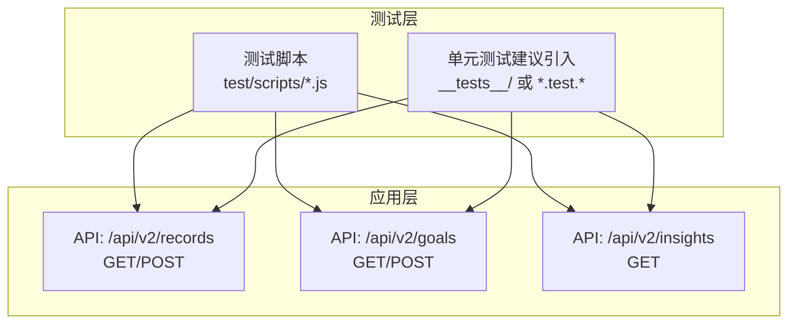
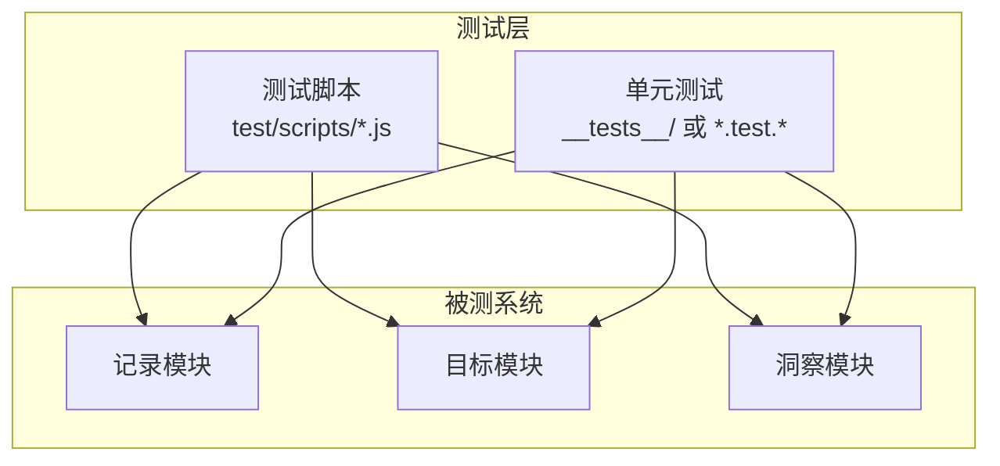
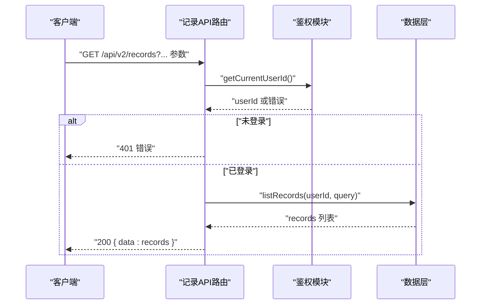
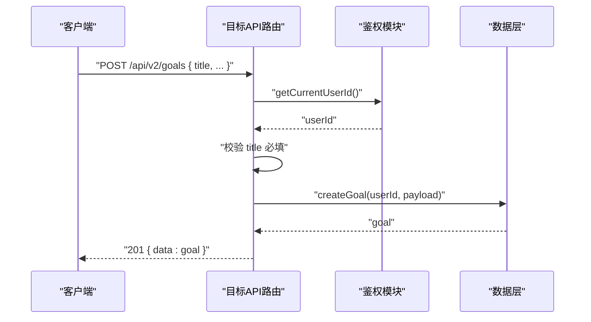
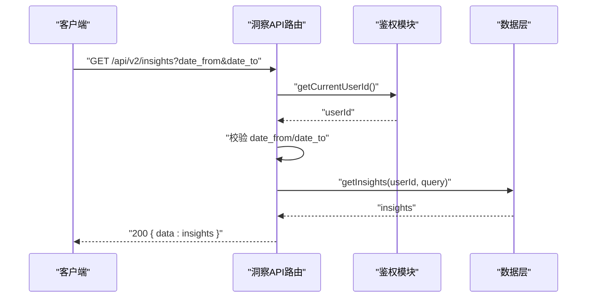
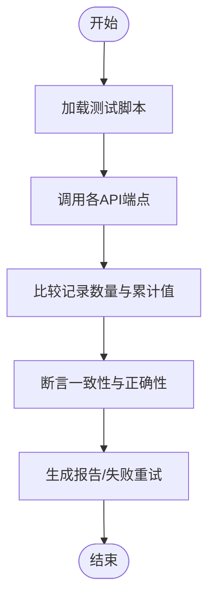
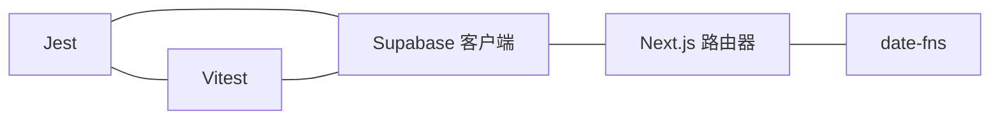

# 单元测试

<cite>
**本文引用的文件**
- [package.json](file://package.json)
- [README.md](file://README.md)
- [test-records.js](file://test/scripts/test-records.js)
- [test-accumulated-values.js](file://test/scripts/test-accumulated-values.js)
- [test-api-performance.js](file://test/scripts/test-api-performance.js)
- [records.route.ts](file://src/app/api/v2/records/route.ts)
- [goals.route.ts](file://src/app/api/v2/goals/route.ts)
- [insights.route.ts](file://src/app/api/v2/insights/route.ts)
</cite>

## 目录
1. [引言](#引言)
2. [项目结构](#项目结构)
3. [核心组件](#核心组件)
4. [架构总览](#架构总览)
5. [详细组件分析](#详细组件分析)
6. [依赖分析](#依赖分析)
7. [性能考虑](#性能考虑)
8. [故障排查指南](#故障排查指南)
9. [结论](#结论)
10. [附录](#附录)

## 引言
本文件面向 TETO 项目的单元测试工作，目标是建立可维护、可扩展且高覆盖率的测试体系。当前仓库尚未集成 Jest 或 Vitest 等主流前端/全栈单元测试框架；但已存在用于端到端与性能验证的 Node 脚本，可用于指导后续引入单元测试框架并迁移现有验证逻辑。

本指南将围绕以下主题展开：
- 单元测试框架选型与配置建议（Jest/Vitest）
- 针对核心业务逻辑的测试策略（记录计算、统计数据聚合、数据校验）
- 测试用例编写规范、断言方法与模拟对象使用
- 测试覆盖率要求、测试数据准备与测试环境配置
- 异步函数、错误处理与边界条件的测试方法
- 具体示例与最佳实践，确保核心功能稳定可靠

## 项目结构
从仓库结构可见，TETO 使用 Next.js App Router，核心业务接口位于 src/app/api/v2 下，测试相关脚本位于 test/scripts 目录。当前未发现标准的单元测试目录（如 __tests__/ 或 *.test.* 文件），但已有若干用于验证 API 行为与性能的脚本，可作为引入单元测试的参考与迁移目标。

**图示来源**
- [records.route.ts:1-86](file://src/app/api/v2/records/route.ts#L1-L86)
- [goals.route.ts:1-49](file://src/app/api/v2/goals/route.ts#L1-L49)
- [insights.route.ts:1-32](file://src/app/api/v2/insights/route.ts#L1-L32)
- [test-records.js:1-57](file://test/scripts/test-records.js#L1-L57)
- [test-accumulated-values.js:1-65](file://test/scripts/test-accumulated-values.js#L1-L65)
- [test-api-performance.js:1-82](file://test/scripts/test-api-performance.js#L1-L82)

**章节来源**
- [package.json:1-44](file://package.json#L1-L44)
- [README.md:1-126](file://README.md#L1-L126)

## 核心组件
- 记录 API（/api/v2/records）
  - 支持查询与创建记录，包含鉴权、参数解析、数据校验与错误处理。
  - 关键点：查询参数过滤、必填字段校验、事项归属校验、统一错误响应。
- 目标 API（/api/v2/goals）
  - 支持查询与创建目标，包含鉴权与标题必填校验。
  - 关键点：状态/事项/阶段过滤查询、标题必填校验、统一错误响应。
- 洞察 API（/api/v2/insights）
  - 支持按日期范围查询洞察，包含鉴权与必填参数校验。
  - 关键点：日期范围必填、统一错误响应。

这些接口构成了单元测试的重点覆盖对象，需分别针对其鉴权流程、参数解析、业务校验与错误分支进行断言。

**章节来源**
- [records.route.ts:1-86](file://src/app/api/v2/records/route.ts#L1-L86)
- [goals.route.ts:1-49](file://src/app/api/v2/goals/route.ts#L1-L49)
- [insights.route.ts:1-32](file://src/app/api/v2/insights/route.ts#L1-L32)

## 架构总览
下图展示了测试与被测系统的交互关系，强调“测试脚本”与“单元测试”的演进路径：先以现有脚本验证端到端行为，再逐步引入单元测试以提升稳定性与可维护性。

**图示来源**
- [test-records.js:1-57](file://test/scripts/test-records.js#L1-L57)
- [test-accumulated-values.js:1-65](file://test/scripts/test-accumulated-values.js#L1-L65)
- [test-api-performance.js:1-82](file://test/scripts/test-api-performance.js#L1-L82)
- [records.route.ts:1-86](file://src/app/api/v2/records/route.ts#L1-L86)
- [goals.route.ts:1-49](file://src/app/api/v2/goals/route.ts#L1-L49)
- [insights.route.ts:1-32](file://src/app/api/v2/insights/route.ts#L1-L32)

## 详细组件分析

### 记录 API（/api/v2/records）测试要点
- 鉴权与用户上下文
  - 断言未登录时返回 401，并携带明确错误信息。
  - 断言登录成功时能正确读取当前用户 ID。
- 查询参数解析与过滤
  - 断言 date/date_from/date_to/item_id/type/tag_id/is_starred/search/limit 等参数正确解析并传入数据层。
  - 边界条件：空字符串、非法格式、越界数值等。
- 数据校验
  - POST 请求中 content 与 date 为必填，缺失时报 400。
  - item_id 存在时需校验归属，非当前用户或不存在应返回 404。
- 错误处理
  - 数据库异常、网络异常等统一返回 500，并包含错误信息。
- 返回结构
  - GET 返回 { data: [...] }，POST 返回 { data: record }，状态码符合 REST 规范。

**图示来源**
- [records.route.ts:7-42](file://src/app/api/v2/records/route.ts#L7-L42)

**章节来源**
- [records.route.ts:1-86](file://src/app/api/v2/records/route.ts#L1-L86)

### 目标 API（/api/v2/goals）测试要点
- 鉴权与用户上下文
  - 断言未登录时返回 401。
- 查询参数解析
  - 断言 status/item_id/phase_id 过滤正确传递至数据层。
- 数据校验
  - POST 请求中 title 为必填，缺失时报 400。
- 错误处理
  - 统一 500 错误返回。
- 返回结构
  - GET 返回 { data: goals }，POST 返回 { data: goal }。

**图示来源**
- [goals.route.ts:30-48](file://src/app/api/v2/goals/route.ts#L30-L48)

**章节来源**
- [goals.route.ts:1-49](file://src/app/api/v2/goals/route.ts#L1-L49)

### 洞察 API（/api/v2/insights）测试要点
- 鉴权与用户上下文
  - 断言未登录时返回 401。
- 参数校验
  - 断言 date_from 与 date_to 为必填，缺失时报 400。
- 错误处理
  - 统一 500 错误返回。
- 返回结构
  - GET 返回 { data: insights }。

**图示来源**
- [insights.route.ts:6-31](file://src/app/api/v2/insights/route.ts#L6-L31)

**章节来源**
- [insights.route.ts:1-32](file://src/app/api/v2/insights/route.ts#L1-L32)

### 测试脚本与单元测试的衔接
现有脚本提供了端到端验证思路，可作为单元测试的输入与期望值来源：
- 记录一致性对比：比较不同端点返回的记录数量与累计值，用于断言数据聚合逻辑正确性。
- 累计值计算：对比统计页与今日记录页的累计值，用于断言计算逻辑与目标周期配置。
- 性能基准：为单元测试中的异步与并发场景提供性能基线。

**图示来源**
- [test-records.js:1-57](file://test/scripts/test-records.js#L1-L57)
- [test-accumulated-values.js:1-65](file://test/scripts/test-accumulated-values.js#L1-L65)
- [test-api-performance.js:1-82](file://test/scripts/test-api-performance.js#L1-L82)

**章节来源**
- [test-records.js:1-57](file://test/scripts/test-records.js#L1-L57)
- [test-accumulated-values.js:1-65](file://test/scripts/test-accumulated-values.js#L1-L65)
- [test-api-performance.js:1-82](file://test/scripts/test-api-performance.js#L1-L82)

## 依赖分析
- 测试框架选型建议
  - Jest：生态成熟、断言丰富、Mock 能力强，适合复杂异步与 DOM 场景。
  - Vitest：原生 ESM、TypeScript 友好、性能更优，适合 Next.js App Router 项目。
- 与现有脚本的关系
  - 现有脚本可作为“集成测试”的输入与期望值来源，单元测试可在此基础上拆分更细粒度的断言。
- 外部依赖
  - Supabase 客户端、Next.js 路由器、date-fns 等工具库，需在单元测试中进行 Mock。

**图示来源**
- [package.json:15-42](file://package.json#L15-L42)

**章节来源**
- [package.json:1-44](file://package.json#L1-L44)

## 性能考虑
- 单元测试中的异步与并发
  - 对于涉及数据库操作的函数，优先使用内存数据库或 Mock，避免真实 I/O。
  - 对于日期处理逻辑，使用可控的时间源（如 Mock Date 或第三方库）。
- 性能基线
  - 可参考现有性能测试脚本的平均耗时与最慢耗时，设定单元测试中的超时阈值与断言。
- 覆盖率与回归
  - 为关键分支与异常路径设置覆盖率阈值，确保新增功能不会降低整体质量。

## 故障排查指南
- 常见错误与定位
  - 401 未登录：检查鉴权中间件与 getCurrentUserId 的 Mock。
  - 400 参数错误：检查参数解析与校验逻辑，确保边界条件被覆盖。
  - 500 服务器错误：检查异常捕获与错误消息格式，确保统一返回结构。
- 日志与断言
  - 在单元测试中输出关键上下文（请求参数、响应状态、错误信息），便于快速定位问题。
- 回归测试
  - 将现有测试脚本中的断言迁移到单元测试中，形成稳定的回归用例集。

**章节来源**
- [records.route.ts:35-41](file://src/app/api/v2/records/route.ts#L35-L41)
- [goals.route.ts:21-27](file://src/app/api/v2/goals/route.ts#L21-L27)
- [insights.route.ts:14-19](file://src/app/api/v2/insights/route.ts#L14-L19)

## 结论
- 当前仓库缺少标准的单元测试框架与用例，但已有成熟的端到端验证脚本，可作为引入单元测试的重要参考。
- 建议优先引入 Vitest（或 Jest），结合 Mock 与断言，覆盖鉴权、参数解析、数据校验与错误处理等关键路径。
- 将现有脚本中的断言转化为单元测试，既能保证历史行为不退化，又能提升测试效率与可维护性。

## 附录

### 单元测试框架选型与配置建议
- Jest
  - 优点：生态完善、断言丰富、Mock 能力强。
  - 适用：复杂异步、DOM 场景较多的前端组件。
- Vitest
  - 优点：原生 ESM、TypeScript 友好、性能更优。
  - 适用：Next.js App Router、纯服务端逻辑与工具函数。
- 配置要点（通用）
  - 测试文件命名：*.test.* 或 __tests__/*。
  - 覆盖率：函数/行/分支/语句覆盖率不低于 80%。
  - Mock：Supabase 客户端、日期处理、网络请求等。
  - 并发与超时：合理设置超时与并发限制，避免测试抖动。

### 测试用例编写规范
- 命名规范
  - describe 描述模块/功能；it 描述具体场景与预期。
- 断言方法
  - 基础断言：toBe、toEqual、toBeTruthy、toBeFalsy。
  - 异常断言：toThrow、toThrowError。
  - 响应断言：status、headers、body 结构。
- 模拟对象
  - 使用 Mock 函数模拟鉴权、数据库与外部 API。
  - 使用 Fake Timer 控制时间相关逻辑。

### 测试数据准备与环境配置
- 测试数据
  - 使用最小化、可重复的数据集，覆盖正常、边界与异常场景。
- 环境变量
  - 为测试环境设置独立的 Supabase 凭据与数据库连接。
- 脚本迁移
  - 将现有脚本中的断言逻辑迁移为单元测试，确保回归稳定。

### 异步函数、错误处理与边界条件
- 异步函数
  - 使用 async/await 或 Promise 断言，确保等待所有副作用完成。
- 错误处理
  - 显式断言错误响应的状态码与错误信息格式。
- 边界条件
  - 空输入、越界参数、非法格式、缺失必填字段等。

### 具体示例与最佳实践
- 示例路径
  - 记录 API：鉴权失败、参数解析、必填校验、归属校验、统一错误处理。
  - 目标 API：鉴权失败、标题必填、统一错误处理。
  - 洞察 API：鉴权失败、日期必填、统一错误处理。
- 最佳实践
  - 每个模块至少覆盖正常路径与典型错误路径。
  - 使用快照测试记录响应结构，避免响应细节频繁变更导致测试漂移。
  - 将 Mock 与工厂函数抽象为可复用的测试工具，减少重复代码。