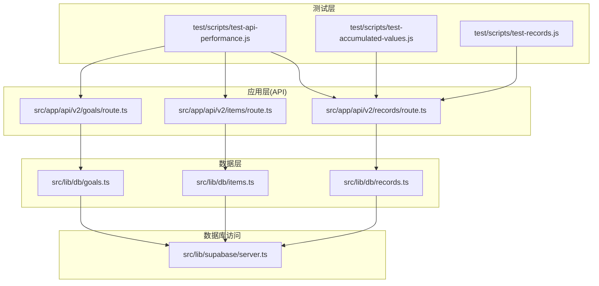
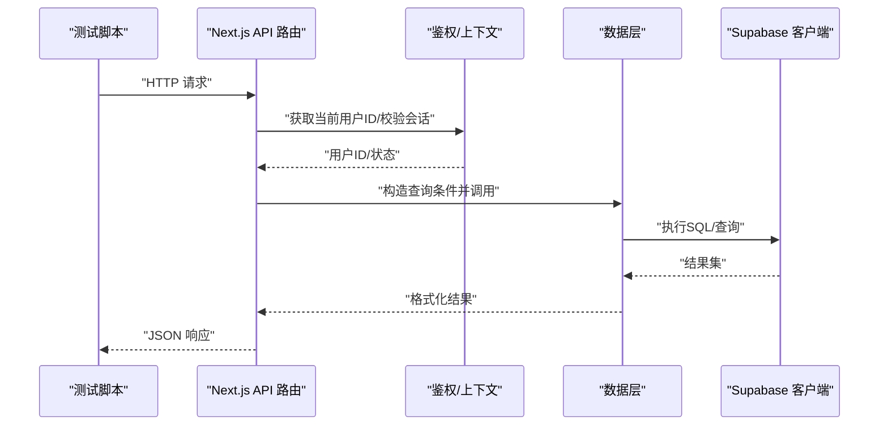
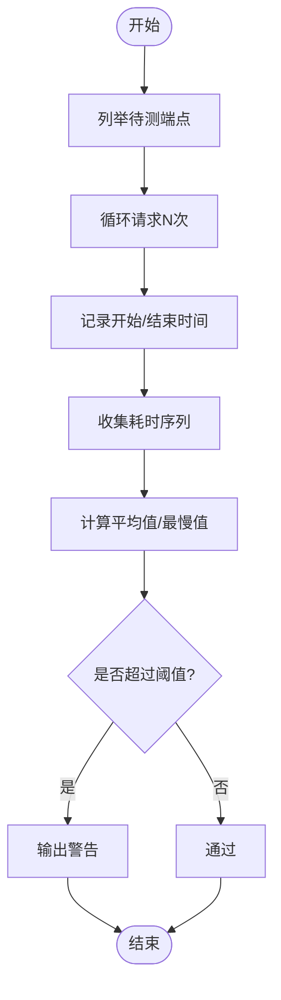
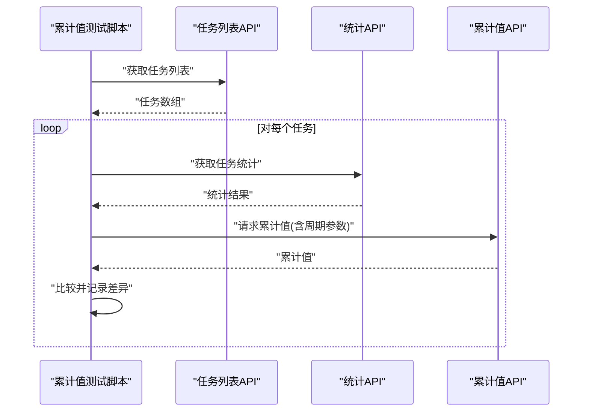
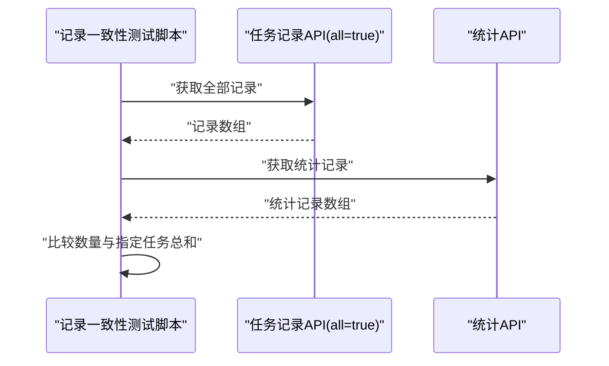
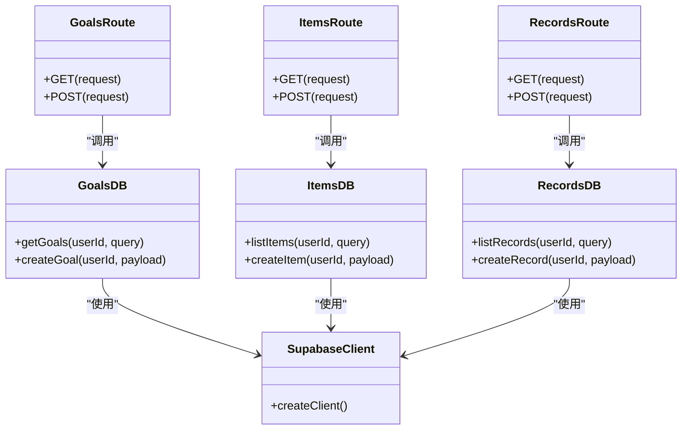
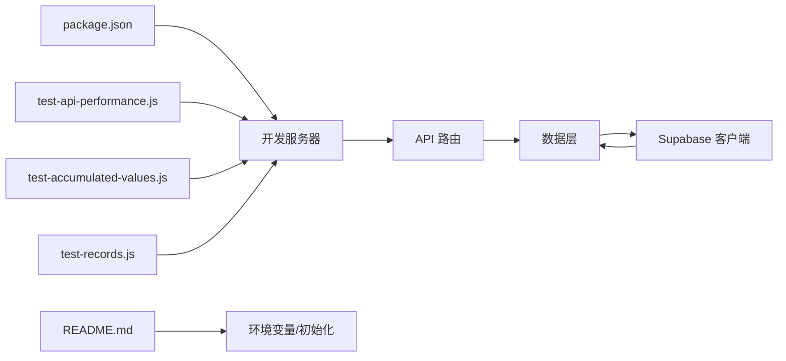

# 性能测试

<cite>
**本文引用的文件**
- [test-api-performance.js](file://test/scripts/test-api-performance.js)
- [test-accumulated-values.js](file://test/scripts/test-accumulated-values.js)
- [test-records.js](file://test/scripts/test-records.js)
- [package.json](file://package.json)
- [README.md](file://README.md)
- [goals/route.ts](file://src/app/api/v2/goals/route.ts)
- [items/route.ts](file://src/app/api/v2/items/route.ts)
- [records/route.ts](file://src/app/api/v2/records/route.ts)
- [goals.ts](file://src/lib/db/goals.ts)
- [items.ts](file://src/lib/db/items.ts)
- [records.ts](file://src/lib/db/records.ts)
- [server.ts](file://src/lib/supabase/server.ts)
</cite>

## 目录
1. [简介](#简介)
2. [项目结构](#项目结构)
3. [核心组件](#核心组件)
4. [架构总览](#架构总览)
5. [详细组件分析](#详细组件分析)
6. [依赖关系分析](#依赖关系分析)
7. [性能考量](#性能考量)
8. [故障排查指南](#故障排查指南)
9. [结论](#结论)
10. [附录](#附录)

## 简介
本文件面向TETO项目的性能测试工作，聚焦于三类性能评估：API响应时间测试、数据库查询性能测试与前端渲染性能测试。基于现有测试脚本与后端实现，给出可操作的测试流程、指标定义、基线设置、回归检测方法，并提供压力测试、负载测试与并发测试的实施方案。同时，结合数据库层实现细节，提出识别性能瓶颈、优化查询与提升API响应时间的方法，以及性能监控与报告生成建议。

## 项目结构
- 测试脚本位于 test/scripts 目录，包含API性能测试、累计值一致性校验与记录数据一致性校验等脚本。
- Next.js App Router 的API路由位于 src/app/api/v2 下，对应各业务模块的GET/POST端点。
- 数据访问层位于 src/lib/db，封装了Supabase查询逻辑。
- Supabase客户端封装位于 src/lib/supabase/server.ts，负责根据运行模式选择合适的密钥与Cookie会话。
- package.json 提供开发与构建脚本；README.md 提供本地开发与环境变量说明。

**图表来源**
- [test-api-performance.js:1-82](file://test/scripts/test-api-performance.js#L1-L82)
- [test-accumulated-values.js:1-65](file://test/scripts/test-accumulated-values.js#L1-L65)
- [test-records.js:1-57](file://test/scripts/test-records.js#L1-L57)
- [goals/route.ts:1-49](file://src/app/api/v2/goals/route.ts#L1-L49)
- [items/route.ts:1-47](file://src/app/api/v2/items/route.ts#L1-L47)
- [records/route.ts:1-86](file://src/app/api/v2/records/route.ts#L1-L86)
- [goals.ts:1-198](file://src/lib/db/goals.ts#L1-L198)
- [items.ts:1-191](file://src/lib/db/items.ts#L1-L191)
- [records.ts:1-328](file://src/lib/db/records.ts#L1-L328)
- [server.ts:1-36](file://src/lib/supabase/server.ts#L1-L36)

**章节来源**
- [package.json:1-44](file://package.json#L1-L44)
- [README.md:1-126](file://README.md#L1-L126)

## 核心组件
- API性能测试脚本：对关键API端点进行多次请求并统计平均耗时与最慢耗时，用于识别异常延迟。
- 累计值一致性测试脚本：对比不同端点返回的累计值，确保统计口径一致。
- 记录数据一致性测试脚本：对比不同端点返回的记录集合与聚合结果，确保数据一致性。
- API路由层：封装查询参数解析与鉴权，调用数据层执行查询。
- 数据层：封装Supabase查询，包含条件拼装、批量查询与N+1规避策略。
- Supabase客户端：根据开发/生产模式选择密钥与Cookie会话，保障RLS策略与会话一致性。

**章节来源**
- [test-api-performance.js:1-82](file://test/scripts/test-api-performance.js#L1-L82)
- [test-accumulated-values.js:1-65](file://test/scripts/test-accumulated-values.js#L1-L65)
- [test-records.js:1-57](file://test/scripts/test-records.js#L1-L57)
- [goals/route.ts:1-49](file://src/app/api/v2/goals/route.ts#L1-L49)
- [items/route.ts:1-47](file://src/app/api/v2/items/route.ts#L1-L47)
- [records/route.ts:1-86](file://src/app/api/v2/records/route.ts#L1-L86)
- [goals.ts:1-198](file://src/lib/db/goals.ts#L1-L198)
- [items.ts:1-191](file://src/lib/db/items.ts#L1-L191)
- [records.ts:1-328](file://src/lib/db/records.ts#L1-L328)
- [server.ts:1-36](file://src/lib/supabase/server.ts#L1-L36)

## 架构总览
下图展示从测试脚本到API路由、数据层与数据库的调用链路，以及关键的性能关注点（鉴权、查询条件、批量查询、N+1规避）。

**图表来源**
- [test-api-performance.js:1-82](file://test/scripts/test-api-performance.js#L1-L82)
- [goals/route.ts:1-49](file://src/app/api/v2/goals/route.ts#L1-L49)
- [items/route.ts:1-47](file://src/app/api/v2/items/route.ts#L1-L47)
- [records/route.ts:1-86](file://src/app/api/v2/records/route.ts#L1-L86)
- [server.ts:1-36](file://src/lib/supabase/server.ts#L1-L36)

## 详细组件分析

### API性能测试脚本分析
- 测试范围：覆盖今日记录、任务管理、项目管理、统计分析等页面的关键API端点。
- 测试方法：对每个端点重复请求若干次，记录每次耗时，输出平均值与最慢值，并对超阈值进行告警提示。
- 基线与阈值：脚本内置阈值用于快速识别异常（例如超过特定毫秒数的警告），可用于建立短期基线与回归检测。

**图表来源**
- [test-api-performance.js:1-82](file://test/scripts/test-api-performance.js#L1-L82)

**章节来源**
- [test-api-performance.js:1-82](file://test/scripts/test-api-performance.js#L1-L82)

### 累计值一致性测试脚本分析
- 目标：验证统计分析页面与今日记录页面的累计值计算一致性。
- 方法：拉取任务列表，针对每个任务调用统计端点与累计值端点，比较两者累计值是否一致，并输出差异。
- 应用场景：发现统计口径不一致、缓存失效或计算逻辑差异导致的数据偏差。

**图表来源**
- [test-accumulated-values.js:1-65](file://test/scripts/test-accumulated-values.js#L1-L65)

**章节来源**
- [test-accumulated-values.js:1-65](file://test/scripts/test-accumulated-values.js#L1-L65)

### 记录数据一致性测试脚本分析
- 目标：验证不同端点返回的记录集合与聚合结果是否一致。
- 方法：分别请求两个端点，比较返回数量与特定任务的数值总和，输出一致性判断。
- 应用场景：发现数据分页、过滤条件或聚合逻辑差异导致的不一致。

**图表来源**
- [test-records.js:1-57](file://test/scripts/test-records.js#L1-L57)

**章节来源**
- [test-records.js:1-57](file://test/scripts/test-records.js#L1-L57)

### API路由与数据层性能要点
- 鉴权与上下文：API路由统一通过鉴权模块获取当前用户ID，确保RLS生效与数据隔离。
- 查询参数解析：路由层将URL查询参数映射为数据层查询对象，减少无效查询。
- 数据层优化：
  - 批量查询：在列出事项时一次性查询关联计数与活动阶段标题，避免N+1。
  - 条件拼装：按需拼接查询条件，减少不必要的索引扫描。
  - 关联数据后处理：在内存中合并关联数据，降低数据库往返次数。
- Supabase客户端：根据运行模式选择密钥，开发模式可绕过RLS以便测试，生产模式依赖会话与RLS。

**图表来源**
- [goals/route.ts:1-49](file://src/app/api/v2/goals/route.ts#L1-L49)
- [items/route.ts:1-47](file://src/app/api/v2/items/route.ts#L1-L47)
- [records/route.ts:1-86](file://src/app/api/v2/records/route.ts#L1-L86)
- [goals.ts:1-198](file://src/lib/db/goals.ts#L1-L198)
- [items.ts:1-191](file://src/lib/db/items.ts#L1-L191)
- [records.ts:1-328](file://src/lib/db/records.ts#L1-L328)
- [server.ts:1-36](file://src/lib/supabase/server.ts#L1-L36)

**章节来源**
- [goals/route.ts:1-49](file://src/app/api/v2/goals/route.ts#L1-L49)
- [items/route.ts:1-47](file://src/app/api/v2/items/route.ts#L1-L47)
- [records/route.ts:1-86](file://src/app/api/v2/records/route.ts#L1-L86)
- [goals.ts:1-198](file://src/lib/db/goals.ts#L1-L198)
- [items.ts:1-191](file://src/lib/db/items.ts#L1-L191)
- [records.ts:1-328](file://src/lib/db/records.ts#L1-L328)
- [server.ts:1-36](file://src/lib/supabase/server.ts#L1-L36)

## 依赖关系分析
- 测试脚本依赖Next.js开发服务器（默认端口）与Supabase后端。
- API路由依赖鉴权模块与数据层；数据层依赖Supabase客户端。
- package.json 提供开发与构建脚本，README.md 提供环境变量与初始化说明。

**图表来源**
- [package.json:1-44](file://package.json#L1-L44)
- [README.md:1-126](file://README.md#L1-L126)
- [test-api-performance.js:1-82](file://test/scripts/test-api-performance.js#L1-L82)
- [test-accumulated-values.js:1-65](file://test/scripts/test-accumulated-values.js#L1-L65)
- [test-records.js:1-57](file://test/scripts/test-records.js#L1-L57)
- [server.ts:1-36](file://src/lib/supabase/server.ts#L1-L36)

**章节来源**
- [package.json:1-44](file://package.json#L1-L44)
- [README.md:1-126](file://README.md#L1-L126)

## 性能考量
- API响应时间测试
  - 指标：平均耗时、最慢耗时、成功率、错误率。
  - 基线：以稳定环境下的平均值作为短期基线，设定阈值触发告警。
  - 回归检测：对比历史基线，若最慢耗时显著上升或P95/P99异常，定位具体端点与路由。
- 数据库查询性能测试
  - 关注点：查询条件是否命中索引、是否存在N+1、是否进行不必要的关联查询。
  - 优化建议：复用数据层的批量查询与后处理策略，减少数据库往返；对高频查询建立合适索引。
- 前端渲染性能测试
  - 建议：使用浏览器性能面板记录首屏渲染、交互延迟与重绘开销；结合网络面板观察关键资源加载与API耗时。
- 压力/负载/并发测试实施方案
  - 压力测试：逐步增加并发用户数，观察系统在极限下的表现与错误率。
  - 负载测试：在稳定负载下持续运行，监测响应时间与吞吐量变化。
  - 并发测试：模拟多用户同时访问关键端点，识别锁竞争与队列积压。
- 性能监控与报告
  - 工具：浏览器开发者工具、Next.js Profiler、Supabase Dashboard、自定义日志与指标上报。
  - 报告：包含端点级别指标、数据库查询耗时分布、前端关键指标与回归对比。

[本节为通用指导，无需列出章节来源]

## 故障排查指南
- API鉴权失败
  - 现象：返回401或“请先登录”。
  - 排查：确认开发模式环境变量与会话状态；检查路由中的鉴权逻辑。
- 查询结果为空或不一致
  - 现象：累计值或记录总数不一致。
  - 排查：核对查询参数、过滤条件与数据层条件拼装；确认批量查询与后处理逻辑。
- 数据库性能异常
  - 现象：响应时间长、超时。
  - 排查：检查索引使用情况、查询计划；避免N+1；优化复杂条件与关联查询。
- 测试脚本异常
  - 现象：无法连接或请求失败。
  - 排查：确认开发服务器已启动、端口正确、环境变量配置完整。

**章节来源**
- [goals/route.ts:21-27](file://src/app/api/v2/goals/route.ts#L21-L27)
- [items/route.ts:19-25](file://src/app/api/v2/items/route.ts#L19-L25)
- [records/route.ts:35-41](file://src/app/api/v2/records/route.ts#L35-L41)
- [server.ts:13-15](file://src/lib/supabase/server.ts#L13-L15)

## 结论
通过现有测试脚本与后端实现，可以系统地开展API响应时间、数据一致性与数据库查询性能的评估。建议将测试纳入CI流程，建立基线与阈值，结合数据库优化与前端性能分析，持续改进系统整体性能与稳定性。

[本节为总结性内容，无需列出章节来源]

## 附录
- 使用现有脚本进行性能测试
  - API性能测试：运行测试脚本，观察端点平均耗时与最慢耗时，结合阈值进行告警与回归检测。
  - 累计值与记录一致性测试：运行相应脚本，比对不同端点的计算结果，定位不一致原因。
- 环境准备
  - 参考项目说明配置环境变量与数据库初始化，确保测试环境与生产一致。

**章节来源**
- [README.md:22-52](file://README.md#L22-L52)
- [test-api-performance.js:1-82](file://test/scripts/test-api-performance.js#L1-L82)
- [test-accumulated-values.js:1-65](file://test/scripts/test-accumulated-values.js#L1-L65)
- [test-records.js:1-57](file://test/scripts/test-records.js#L1-L57)