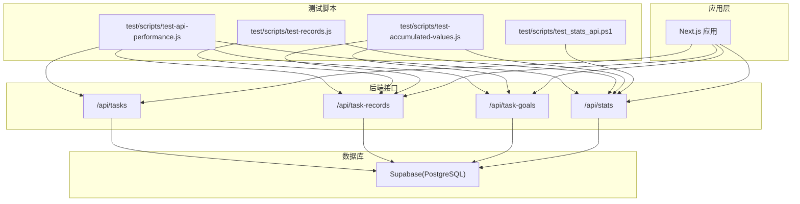
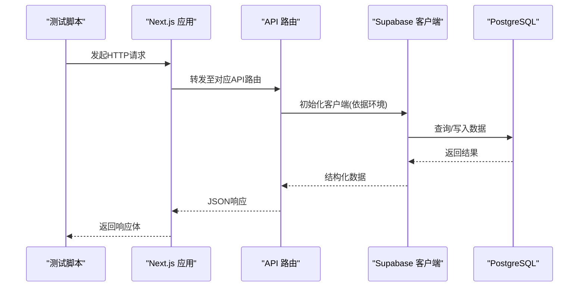
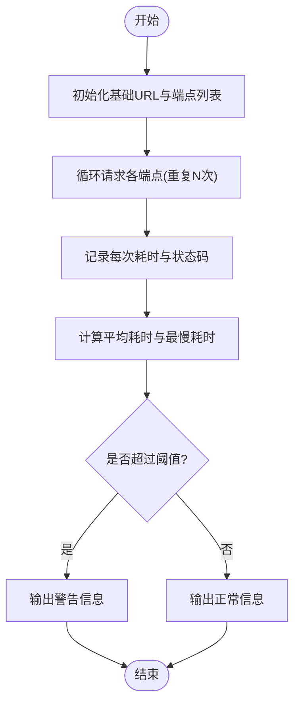
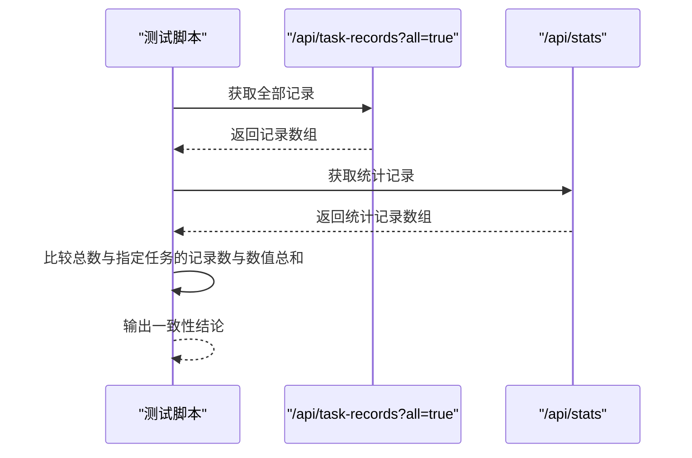
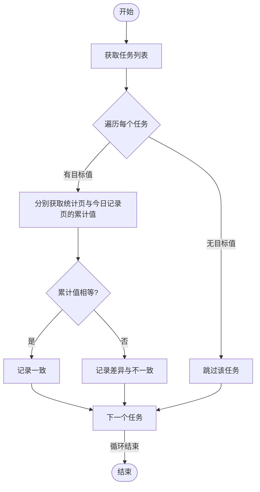
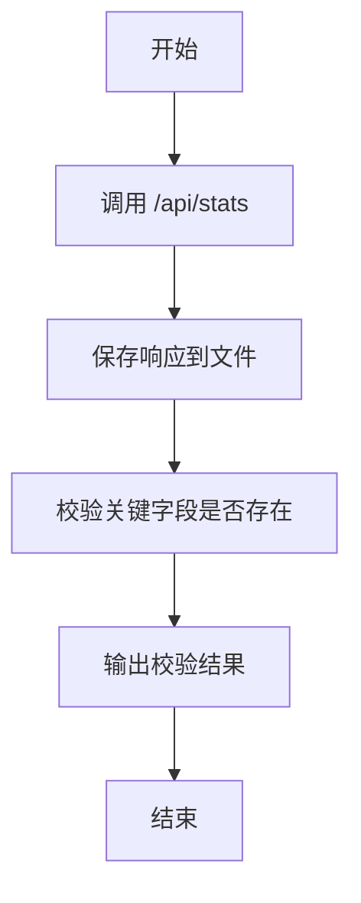
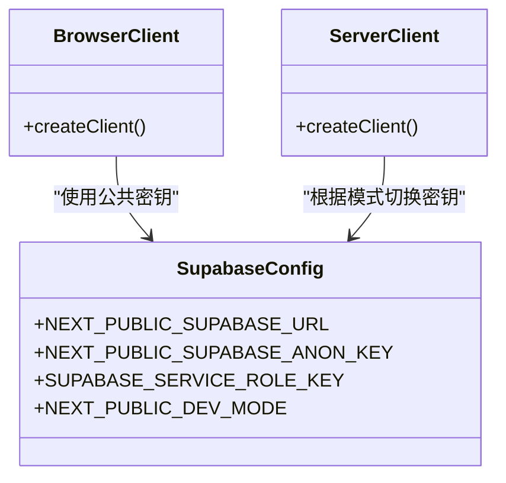
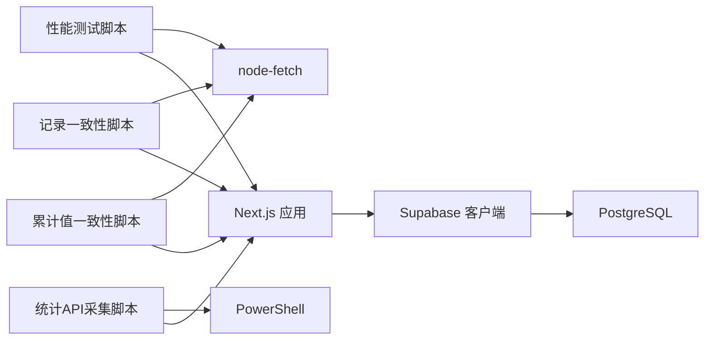

# 测试策略

<cite>
**本文引用的文件**
- [package.json](file://package.json)
- [README.md](file://README.md)
- [test/scripts/test-api-performance.js](file://test/scripts/test-api-performance.js)
- [test/scripts/test-records.js](file://test/scripts/test-records.js)
- [test/scripts/test-accumulated-values.js](file://test/scripts/test-accumulated-values.js)
- [test/scripts/test_stats_api.ps1](file://test/scripts/test_stats_api.ps1)
- [src/lib/supabase/client.ts](file://src/lib/supabase/client.ts)
- [src/lib/supabase/server.ts](file://src/lib/supabase/server.ts)
</cite>

## 目录
1. [引言](#引言)
2. [项目结构](#项目结构)
3. [核心组件](#核心组件)
4. [架构总览](#架构总览)
5. [详细组件分析](#详细组件分析)
6. [依赖分析](#依赖分析)
7. [性能考虑](#性能考虑)
8. [故障排查指南](#故障排查指南)
9. [结论](#结论)
10. [附录](#附录)

## 引言
本测试策略文档面向 TETO 1.0 项目，旨在建立覆盖单元测试、集成测试、API 测试与性能测试的完整测试体系。结合现有测试脚本与项目结构，明确测试环境搭建、测试数据准备、测试执行流程、覆盖率要求、持续集成配置与自动化测试流程，并给出测试驱动开发实践、重构测试策略与回归测试方法。同时提供性能基准测试、压力测试与负载测试的实施方案，以及测试报告生成、缺陷跟踪与质量度量指标建议，确保代码质量与系统稳定性。

## 项目结构
TETO 1.0 采用 Next.js App Router + TypeScript + Supabase 的前端架构。测试相关资源集中在 test 目录下的脚本中，当前主要包含三类测试脚本：
- API 性能测试脚本：用于评估关键页面 API 的响应时间与稳定性。
- 数据一致性测试脚本：用于对比不同 API 返回的数据是否一致。
- 统计 API 输出采集脚本：用于抓取并校验 /api/stats 的响应结构。

**图示来源**
- [test/scripts/test-api-performance.js:1-82](file://test/scripts/test-api-performance.js#L1-L82)
- [test/scripts/test-records.js:1-57](file://test/scripts/test-records.js#L1-L57)
- [test/scripts/test-accumulated-values.js:1-65](file://test/scripts/test-accumulated-values.js#L1-L65)
- [test/scripts/test_stats_api.ps1:1-16](file://test/scripts/test_stats_api.ps1#L1-L16)

**章节来源**
- [README.md:1-126](file://README.md#L1-L126)

## 核心组件
- 测试脚本集合
  - API 性能测试：对多个关键 API 进行多次请求并统计平均耗时与最慢耗时，识别潜在性能瓶颈。
  - 记录数据一致性测试：对比 /api/task-records 与 /api/stats 的返回数据，确保数据一致性。
  - 累计值一致性测试：对比统计页与今日记录页的累计值计算结果，确保算法一致性。
  - 统计 API 输出采集：抓取 /api/stats 响应并进行基本结构校验。
- Supabase 客户端封装
  - 浏览器端客户端：用于前端直接调用 Supabase。
  - 服务端客户端：根据开发/生产模式切换密钥，适配行级安全策略(RLS)。

**章节来源**
- [test/scripts/test-api-performance.js:1-82](file://test/scripts/test-api-performance.js#L1-L82)
- [test/scripts/test-records.js:1-57](file://test/scripts/test-records.js#L1-L57)
- [test/scripts/test-accumulated-values.js:1-65](file://test/scripts/test-accumulated-values.js#L1-L65)
- [test/scripts/test_stats_api.ps1:1-16](file://test/scripts/test_stats_api.ps1#L1-L16)
- [src/lib/supabase/client.ts:1-8](file://src/lib/supabase/client.ts#L1-L8)
- [src/lib/supabase/server.ts:1-35](file://src/lib/supabase/server.ts#L1-L35)

## 架构总览
测试策略围绕“测试脚本 -> 应用接口 -> Supabase 数据库”的链路展开。测试脚本通过 HTTP 请求调用 Next.js API 路由，路由层通过 Supabase 客户端访问数据库，最终返回结构化数据。测试关注点包括：
- 接口可用性与稳定性
- 数据一致性与完整性
- 性能阈值与异常处理
- 开发/生产模式下的鉴权与 RLS 行为差异

**图示来源**
- [src/lib/supabase/server.ts:1-35](file://src/lib/supabase/server.ts#L1-L35)
- [src/lib/supabase/client.ts:1-8](file://src/lib/supabase/client.ts#L1-L8)

## 详细组件分析

### 组件一：API 性能测试脚本
- 目标：评估关键页面 API 的响应时间，识别慢接口与异常。
- 覆盖范围：今日记录、任务管理、项目管理、统计分析等页面相关 API。
- 执行方式：循环多次请求，统计平均耗时与最慢耗时；对超阈值进行告警标记。
- 关键路径
  - [test/scripts/test-api-performance.js:1-82](file://test/scripts/test-api-performance.js#L1-L82)

**图示来源**
- [test/scripts/test-api-performance.js:1-82](file://test/scripts/test-api-performance.js#L1-L82)

**章节来源**
- [test/scripts/test-api-performance.js:1-82](file://test/scripts/test-api-performance.js#L1-L82)

### 组件二：记录数据一致性测试脚本
- 目标：验证 /api/task-records 与 /api/stats 的返回数据一致性。
- 方法：比较记录总数、特定任务的记录数与数值总和，定位不一致问题。
- 关键路径
  - [test/scripts/test-records.js:1-57](file://test/scripts/test-records.js#L1-L57)

**图示来源**
- [test/scripts/test-records.js:1-57](file://test/scripts/test-records.js#L1-L57)

**章节来源**
- [test/scripts/test-records.js:1-57](file://test/scripts/test-records.js#L1-L57)

### 组件三：累计值一致性测试脚本
- 目标：验证统计页与今日记录页的累计值计算结果一致。
- 方法：获取任务列表，针对有目标值的任务，分别从统计页与今日记录页计算累计值并比较。
- 关键路径
  - [test/scripts/test-accumulated-values.js:1-65](file://test/scripts/test-accumulated-values.js#L1-L65)

**图示来源**
- [test/scripts/test-accumulated-values.js:1-65](file://test/scripts/test-accumulated-values.js#L1-L65)

**章节来源**
- [test/scripts/test-accumulated-values.js:1-65](file://test/scripts/test-accumulated-values.js#L1-L65)

### 组件四：统计 API 输出采集脚本
- 目标：抓取 /api/stats 的响应内容并进行基础结构校验。
- 方法：使用 PowerShell 调用 API，保存响应到文件，并对关键字段进行简单匹配。
- 关键路径
  - [test/scripts/test_stats_api.ps1:1-16](file://test/scripts/test_stats_api.ps1#L1-L16)

**图示来源**
- [test/scripts/test_stats_api.ps1:1-16](file://test/scripts/test_stats_api.ps1#L1-L16)

**章节来源**
- [test/scripts/test_stats_api.ps1:1-16](file://test/scripts/test_stats_api.ps1#L1-L16)

### 组件五：Supabase 客户端封装
- 浏览器端客户端：用于前端直连 Supabase。
- 服务端客户端：根据开发/生产模式切换密钥，适配 RLS。
- 关键路径
  - [src/lib/supabase/client.ts:1-8](file://src/lib/supabase/client.ts#L1-L8)
  - [src/lib/supabase/server.ts:1-35](file://src/lib/supabase/server.ts#L1-L35)

**图示来源**
- [src/lib/supabase/client.ts:1-8](file://src/lib/supabase/client.ts#L1-L8)
- [src/lib/supabase/server.ts:1-35](file://src/lib/supabase/server.ts#L1-L35)

**章节来源**
- [src/lib/supabase/client.ts:1-8](file://src/lib/supabase/client.ts#L1-L8)
- [src/lib/supabase/server.ts:1-35](file://src/lib/supabase/server.ts#L1-L35)

## 依赖分析
- 测试脚本依赖
  - node-fetch：用于 HTTP 请求。
  - PowerShell：用于采集 /api/stats 响应。
- 应用层依赖
  - Next.js App Router：组织 API 路由。
  - Supabase 客户端：访问数据库与认证。
- 数据库依赖
  - Supabase(PostgreSQL)：存储用户与业务数据，启用 RLS 保障数据隔离。

**图示来源**
- [test/scripts/test-api-performance.js:1-82](file://test/scripts/test-api-performance.js#L1-L82)
- [test/scripts/test-records.js:1-57](file://test/scripts/test-records.js#L1-L57)
- [test/scripts/test-accumulated-values.js:1-65](file://test/scripts/test-accumulated-values.js#L1-L65)
- [test/scripts/test_stats_api.ps1:1-16](file://test/scripts/test_stats_api.ps1#L1-L16)
- [src/lib/supabase/server.ts:1-35](file://src/lib/supabase/server.ts#L1-L35)

**章节来源**
- [test/scripts/test-api-performance.js:1-82](file://test/scripts/test-api-performance.js#L1-L82)
- [test/scripts/test-records.js:1-57](file://test/scripts/test-records.js#L1-L57)
- [test/scripts/test-accumulated-values.js:1-65](file://test/scripts/test-accumulated-values.js#L1-L65)
- [test/scripts/test_stats_api.ps1:1-16](file://test/scripts/test_stats_api.ps1#L1-L16)
- [src/lib/supabase/server.ts:1-35](file://src/lib/supabase/server.ts#L1-L35)

## 性能考虑
- 基准测试
  - 使用现有性能测试脚本对关键 API 进行基准测量，记录平均耗时与最慢耗时，形成基线。
  - 建议在 CI 中定期运行，产出趋势报告。
- 压力测试
  - 使用并发请求工具模拟高并发场景，观察接口吞吐与错误率。
  - 关注数据库连接池与 Supabase 限流策略。
- 负载测试
  - 模拟真实用户行为，逐步增加负载，识别性能瓶颈与容量边界。
  - 结合日志与监控指标进行分析。

[本节为通用指导，无需列出章节来源]

## 故障排查指南
- 环境变量缺失
  - 缺少 Supabase 相关环境变量会导致客户端初始化失败。请参考项目说明配置必要环境变量。
- 开发/生产模式差异
  - 开发模式下使用服务端密钥可绕过 RLS，便于测试；生产模式需依赖认证会话。注意切换密钥的行为差异。
- API 响应异常
  - 使用统计 API 采集脚本抓取响应，检查关键字段是否存在，辅助定位接口异常。
- 性能异常
  - 使用性能测试脚本识别慢接口，结合数据库查询计划与网络延迟进行根因分析。

**章节来源**
- [README.md:54-90](file://README.md#L54-L90)
- [src/lib/supabase/server.ts:1-35](file://src/lib/supabase/server.ts#L1-L35)
- [test/scripts/test_stats_api.ps1:1-16](file://test/scripts/test_stats_api.ps1#L1-L16)
- [test/scripts/test-api-performance.js:1-82](file://test/scripts/test-api-performance.js#L1-L82)

## 结论
通过现有测试脚本与 Supabase 客户端封装，TETO 1.0 已具备基础的 API 测试与性能评估能力。建议在此基础上完善单元测试、集成测试与自动化流水线，明确覆盖率门槛与质量门禁，持续提升代码质量与系统稳定性。

[本节为总结性内容，无需列出章节来源]

## 附录

### A. 测试环境搭建
- 依赖安装
  - 使用包管理器安装项目依赖。
- 环境变量配置
  - 参考项目说明配置 Supabase 相关环境变量。
- 数据库初始化
  - 按顺序执行 SQL 初始化脚本，启用 RLS。
- 启动应用
  - 启动开发服务器，确保 API 可访问。

**章节来源**
- [README.md:22-52](file://README.md#L22-L52)

### B. 测试数据准备
- 使用 Supabase 控制台或 SQL 脚本准备测试数据，确保包含多任务、多记录与统计所需字段。
- 对于累计值测试，准备具有目标值的任务数据集。

**章节来源**
- [README.md:63-90](file://README.md#L63-L90)

### C. 测试执行流程
- 性能测试：运行性能测试脚本，收集各 API 的平均耗时与最慢耗时。
- 数据一致性测试：运行记录与累计值一致性脚本，输出比对结果。
- 统计 API 采集：运行 PowerShell 脚本，保存并校验 /api/stats 响应。

**章节来源**
- [test/scripts/test-api-performance.js:1-82](file://test/scripts/test-api-performance.js#L1-L82)
- [test/scripts/test-records.js:1-57](file://test/scripts/test-records.js#L1-L57)
- [test/scripts/test-accumulated-values.js:1-65](file://test/scripts/test-accumulated-values.js#L1-L65)
- [test/scripts/test_stats_api.ps1:1-16](file://test/scripts/test_stats_api.ps1#L1-L16)

### D. 覆盖率要求与质量度量
- 单元测试覆盖率：建议关键模块达到较高覆盖率，结合集成测试与端到端测试共同保障。
- 集成测试：覆盖核心业务流程与 API 路由。
- 性能指标：设定响应时间阈值，定期生成性能报告。
- 缺陷跟踪：使用项目内缺陷跟踪机制，结合测试报告进行闭环管理。

[本节为通用指导，无需列出章节来源]

### E. 持续集成与自动化
- CI 配置：在 CI 中集成依赖安装、构建检查、测试脚本执行与报告生成。
- 自动化触发：支持 PR/MR 触发与定时任务，确保回归测试与性能基线检查。
- 报告与门禁：将测试报告与覆盖率指标纳入质量门禁，阻断不达标合并。

[本节为通用指导，无需列出章节来源]

### F. 测试驱动开发与重构策略
- TDD 实践：先编写失败的测试用例，再实现最小可行代码，最后重构优化。
- 回归测试：每次变更后运行回归测试集，确保不引入回归。
- 重构策略：优先保证测试稳定，逐步替换实现细节，保持测试不变。

[本节为通用指导，无需列出章节来源]