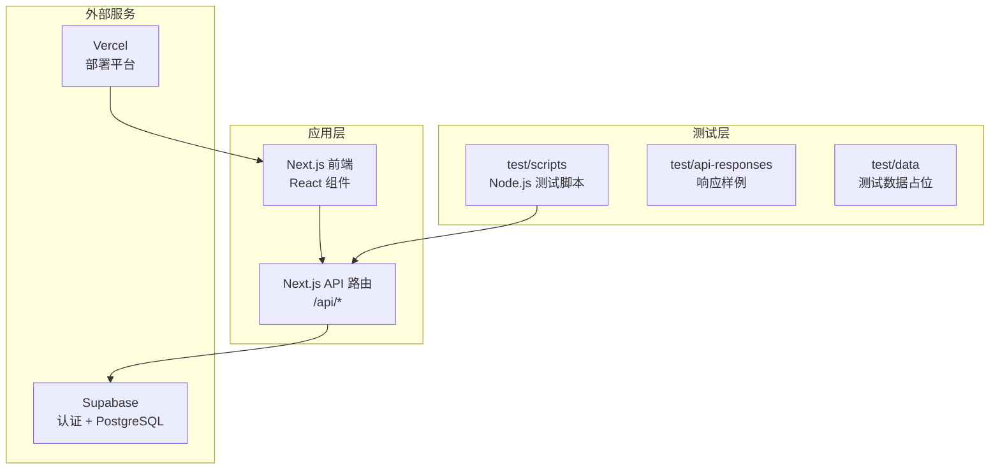
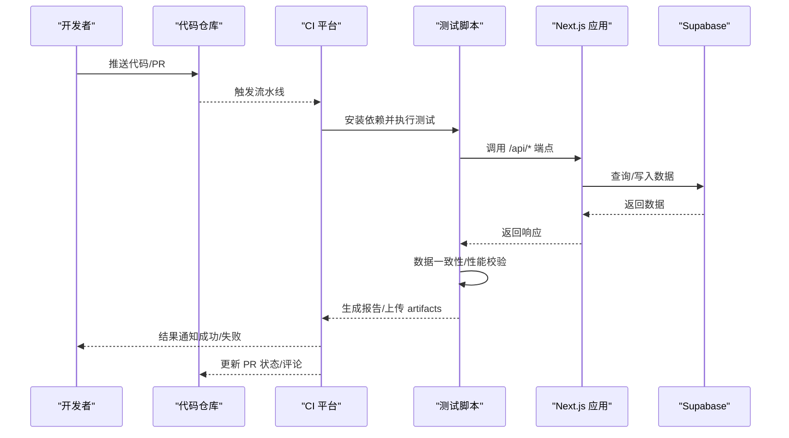
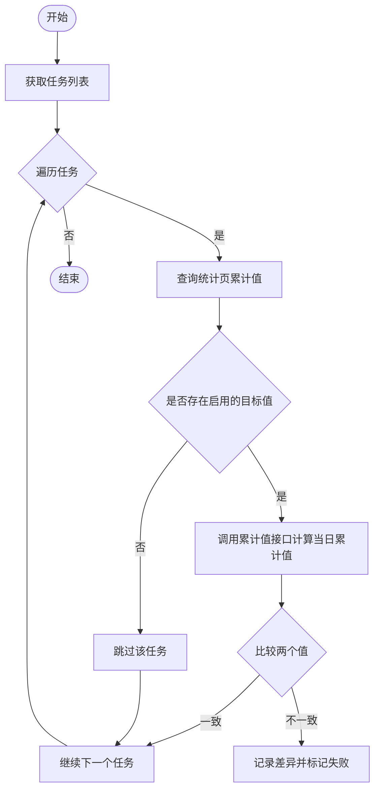
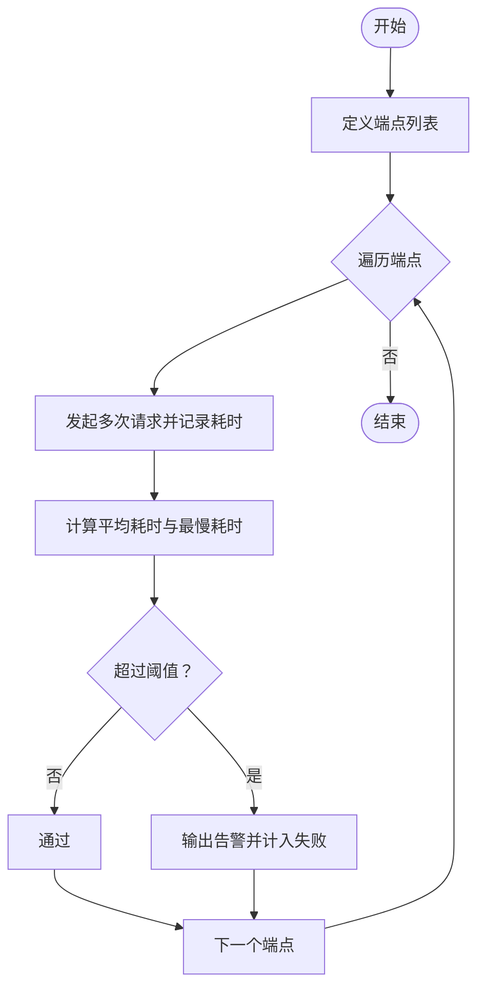
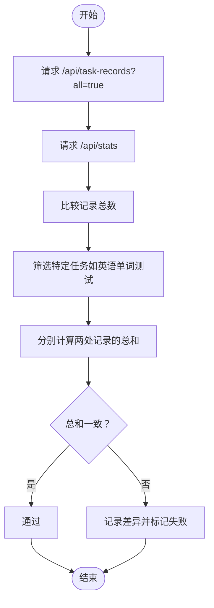
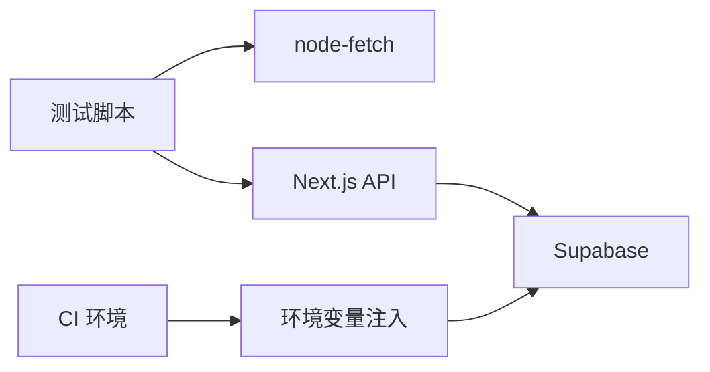

# 测试自动化

<cite>
**本文引用的文件**
- [package.json](file://package.json)
- [README.md](file://README.md)
- [test-accumulated-values.js](file://test/scripts/test-accumulated-values.js)
- [test-api-performance.js](file://test/scripts/test-api-performance.js)
- [test-records.js](file://test/scripts/test-records.js)
- [test_stats_api.ps1](file://test/scripts/test_stats_api.ps1)
- [api_response_raw.txt](file://test/api-responses/api_response_raw.txt)
- [task_stats_only.json](file://test/api-responses/task_stats_only.json)
</cite>

## 目录
1. [简介](#简介)
2. [项目结构](#项目结构)
3. [核心组件](#核心组件)
4. [架构总览](#架构总览)
5. [详细组件分析](#详细组件分析)
6. [依赖关系分析](#依赖关系分析)
7. [性能考量](#性能考量)
8. [故障排查指南](#故障排查指南)
9. [结论](#结论)
10. [附录](#附录)

## 简介
本文件面向 TETO 项目的测试自动化，系统性阐述如何在持续集成与持续部署（CI/CD）中落地自动化测试流程，覆盖测试套件执行、测试报告生成、测试结果通知与失败处理机制；同时涵盖测试数据管理、测试环境自动配置与测试资源清理策略，并给出测试隔离、并行执行与结果分析的最佳实践与协作流程建议。

## 项目结构
TETO 项目采用 Next.js App Router 架构，前端以 React 为基础，后端 API 通过 Next.js App Router 的路由模块暴露。测试相关资产集中在 test 目录，包含：
- test/scripts：自动化测试脚本（Node.js）
- test/api-responses：API 响应样例与对比数据
- test/data：预留数据目录（当前为空）

**图示来源**
- [README.md:13-21](file://README.md#L13-L21)
- [test-accumulated-values.js:1-65](file://test/scripts/test-accumulated-values.js#L1-L65)
- [test-api-performance.js:1-82](file://test/scripts/test-api-performance.js#L1-L82)
- [test-records.js:1-57](file://test/scripts/test-records.js#L1-L57)

**章节来源**
- [README.md:1-126](file://README.md#L1-L126)

## 核心组件
- 测试脚本集合
  - 累计值一致性校验：对比统计页与记录页的累计值，确保数据一致性。
  - 性能基准测试：对关键 API 进行多次请求取平均耗时，识别性能瓶颈。
  - 记录数据一致性校验：对比不同端点返回的记录数量与聚合值。
  - PowerShell 辅助脚本：抓取并校验 /api/stats 响应结构。
- API 响应样例
  - 提供任务统计与记录数据的样例文件，便于回归与对比测试。
- 环境与依赖
  - 项目使用 Node.js 与 Next.js，测试脚本基于 node-fetch 发起 HTTP 请求。
  - Supabase 作为认证与数据存储后端，需在 CI 环境中注入相应凭据。

**章节来源**
- [test-accumulated-values.js:1-65](file://test/scripts/test-accumulated-values.js#L1-L65)
- [test-api-performance.js:1-82](file://test/scripts/test-api-performance.js#L1-L82)
- [test-records.js:1-57](file://test/scripts/test-records.js#L1-L57)
- [test_stats_api.ps1:1-16](file://test/scripts/test_stats_api.ps1#L1-L16)
- [api_response_raw.txt:1-2](file://test/api-responses/api_response_raw.txt#L1-L2)
- [task_stats_only.json:1-268](file://test/api-responses/task_stats_only.json#L1-L268)
- [package.json:1-44](file://package.json#L1-L44)

## 架构总览
下图展示了从 CI 触发到测试执行、结果上报与失败处理的整体流程。

**图示来源**
- [test-accumulated-values.js:1-65](file://test/scripts/test-accumulated-values.js#L1-L65)
- [test-api-performance.js:1-82](file://test/scripts/test-api-performance.js#L1-L82)
- [test-records.js:1-57](file://test/scripts/test-records.js#L1-L57)
- [README.md:92-126](file://README.md#L92-L126)

## 详细组件分析

### 组件A：累计值一致性测试
- 目标：确保统计页面与记录页面的累计值一致。
- 关键流程：
  - 获取任务列表
  - 针对每个任务查询统计页累计值
  - 若存在目标值，调用累计值接口计算当日累计值
  - 比较两个数值，记录差异
- 失败处理：捕获异常并输出错误日志，便于定位具体任务或接口问题。

**图示来源**
- [test-accumulated-values.js:1-65](file://test/scripts/test-accumulated-values.js#L1-L65)

**章节来源**
- [test-accumulated-values.js:1-65](file://test/scripts/test-accumulated-values.js#L1-L65)

### 组件B：API 性能基准测试
- 目标：评估关键页面 API 的平均耗时与最慢耗时，识别性能风险。
- 关键流程：
  - 定义待测端点集合
  - 对每个端点重复请求 N 次取平均与最大值
  - 输出耗时阈值告警（如超过 1s/2s）
- 失败处理：超过阈值时输出警告并计入失败，便于回归监控。

**图示来源**
- [test-api-performance.js:1-82](file://test/scripts/test-api-performance.js#L1-L82)

**章节来源**
- [test-api-performance.js:1-82](file://test/scripts/test-api-performance.js#L1-L82)

### 组件C：记录数据一致性测试
- 目标：确保不同端点返回的记录数量与聚合值一致。
- 关键流程：
  - 分别请求两个端点获取记录集
  - 比较记录总数
  - 选取特定任务（如英语单词测试）进行分组求和对比
- 失败处理：输出差异详情，辅助快速定位数据源或聚合逻辑问题。

**图示来源**
- [test-records.js:1-57](file://test/scripts/test-records.js#L1-L57)

**章节来源**
- [test-records.js:1-57](file://test/scripts/test-records.js#L1-L57)

### 组件D：PowerShell API 响应校验
- 目标：抓取 /api/stats 响应并进行结构校验（如是否包含特定字段）。
- 关键流程：
  - 使用 Invoke-WebRequest 获取响应内容
  - 将响应写入文件用于后续分析
  - 检查响应中是否包含指定字段标识
- 失败处理：输出未包含字段的提示，便于快速发现接口变更。

**章节来源**
- [test_stats_api.ps1:1-16](file://test/scripts/test_stats_api.ps1#L1-L16)

## 依赖关系分析
- 测试脚本依赖
  - node-fetch：发起 HTTP 请求
  - Supabase：提供认证与数据存储
  - Next.js API：提供被测端点
- 环境变量
  - NEXT_PUBLIC_SUPABASE_URL、NEXT_PUBLIC_SUPABASE_ANON_KEY：Supabase 凭据
  - NEXT_PUBLIC_DEV_MODE、NEXT_PUBLIC_DEV_USER_ID：开发模式与测试用户（可选）

**图示来源**
- [package.json:15-32](file://package.json#L15-L32)
- [README.md:54-62](file://README.md#L54-L62)

**章节来源**
- [package.json:1-44](file://package.json#L1-L44)
- [README.md:54-62](file://README.md#L54-L62)

## 性能考量
- 测试脚本中的性能测试已内置多次请求取平均与阈值告警，建议在 CI 中：
  - 固定并发与请求次数，避免波动影响
  - 将关键端点纳入回归基线，建立历史趋势图
  - 对慢接口进行专项优化与隔离测试

[本节为通用指导，无需引用具体文件]

## 故障排查指南
- 常见问题
  - 端点不可达：检查应用是否成功构建与部署，确认 CI 中的环境变量是否正确注入。
  - 数据不一致：核对 Supabase 表结构与 RLS 策略，确保测试用户具备访问权限。
  - 性能异常：关注日志中的最慢耗时与平均耗时，结合数据库索引与查询计划分析。
- 建议流程
  - 在本地先运行测试脚本，确认环境与数据准备无误
  - 在 CI 中增加重试与超时控制，避免瞬时波动导致误判
  - 将失败的响应体与日志上传为 artifacts，便于离线分析

**章节来源**
- [test-accumulated-values.js:60-62](file://test/scripts/test-accumulated-values.js#L60-L62)
- [test-api-performance.js:71-76](file://test/scripts/test-api-performance.js#L71-L76)
- [README.md:92-126](file://README.md#L92-L126)

## 结论
通过现有测试脚本与响应样例，TETO 已具备自动化测试的基础能力。建议在 CI/CD 中：
- 将测试脚本纳入流水线，统一执行与报告
- 建立测试数据与环境的标准化配置与清理机制
- 引入并行执行与结果分析，持续优化测试覆盖率与稳定性

[本节为总结性内容，无需引用具体文件]

## 附录

### A. CI/CD 流水线建议（概念性）
- 触发条件：push/pr
- 步骤：
  - 安装依赖
  - 启动 Supabase 本地实例或连接 CI 专用数据库
  - 执行测试脚本（累计值、记录一致性、性能）
  - 生成报告与 artifacts
  - 失败通知与状态更新
- 并行策略：按端点或模块拆分，缩短整体耗时

[本节为概念性内容，无需引用具体文件]

### B. 测试数据管理与环境配置
- 测试数据
  - 使用 test/api-responses 中的样例文件进行对比与回归
  - 在 CI 中预置最小化测试数据集，确保可重复性
- 环境配置
  - 注入 Supabase 凭据与 Next.js 环境变量
  - 支持开发模式与测试用户 ID，便于自动化登录与隔离

**章节来源**
- [api_response_raw.txt:1-2](file://test/api-responses/api_response_raw.txt#L1-L2)
- [task_stats_only.json:1-268](file://test/api-responses/task_stats_only.json#L1-L268)
- [README.md:54-62](file://README.md#L54-L62)