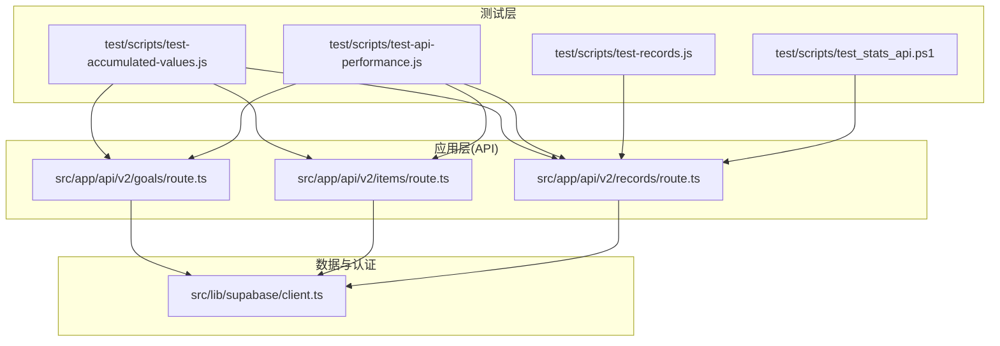
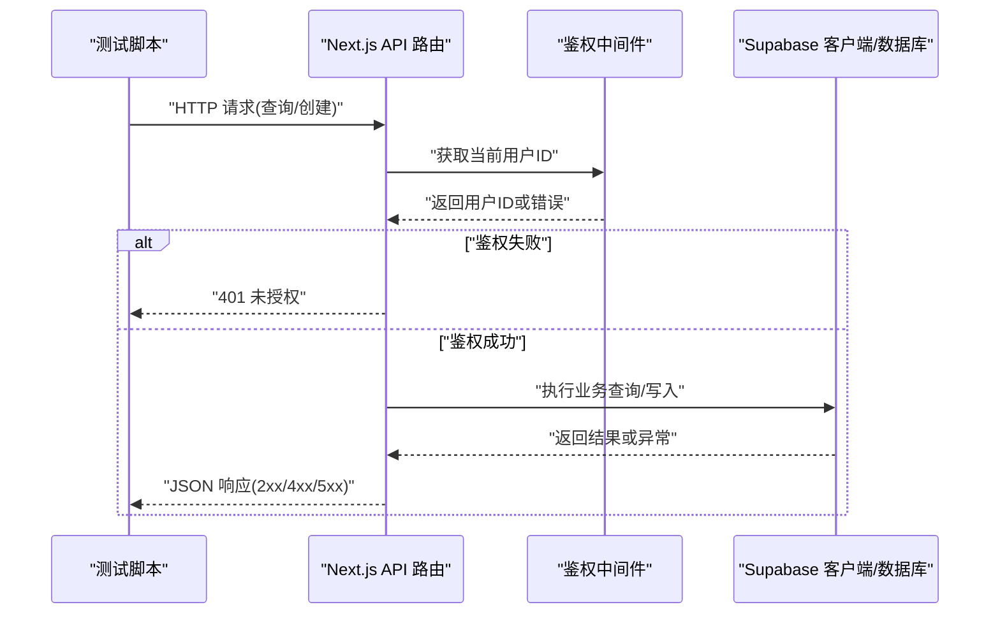
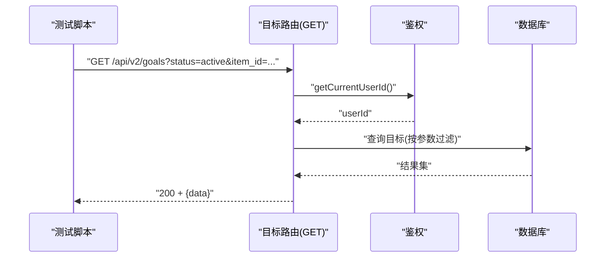
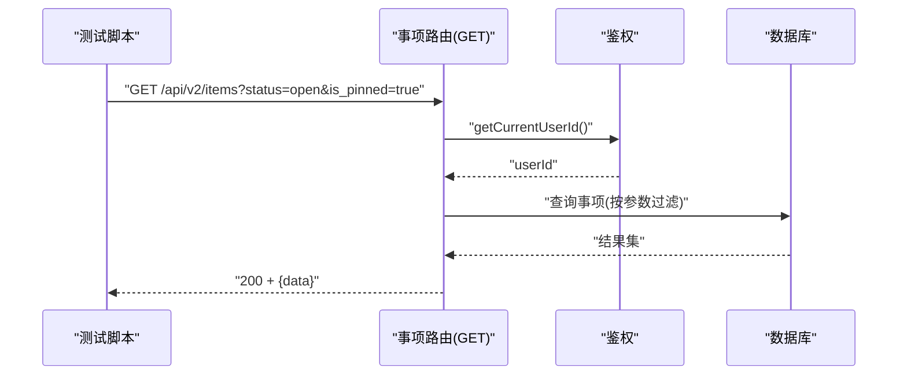
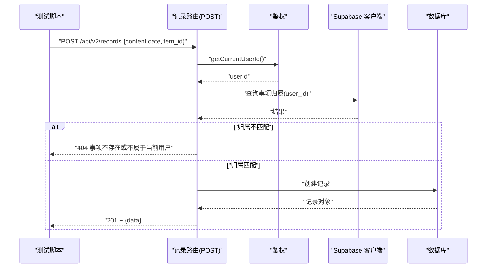
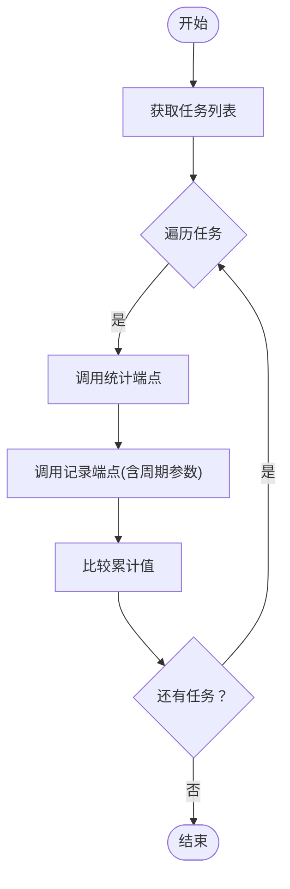
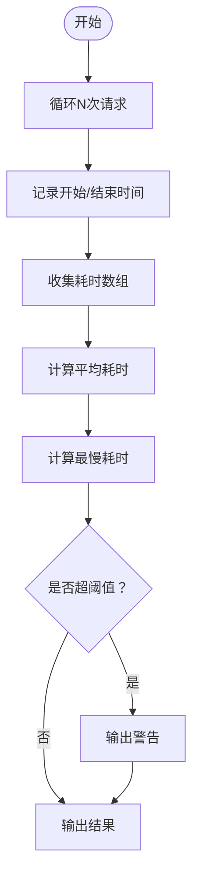
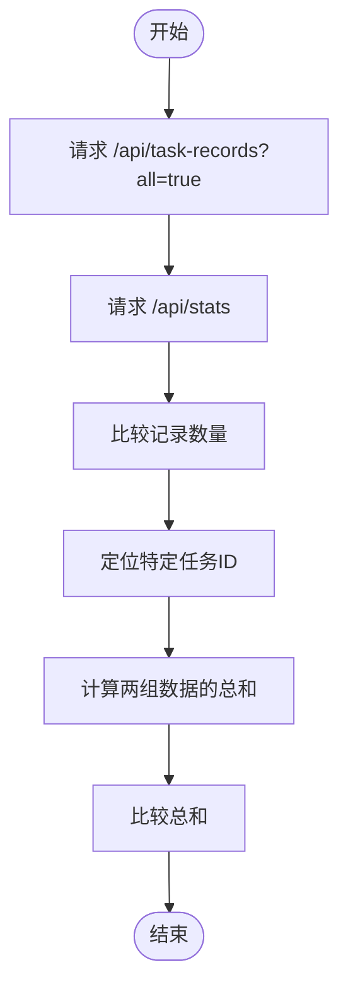
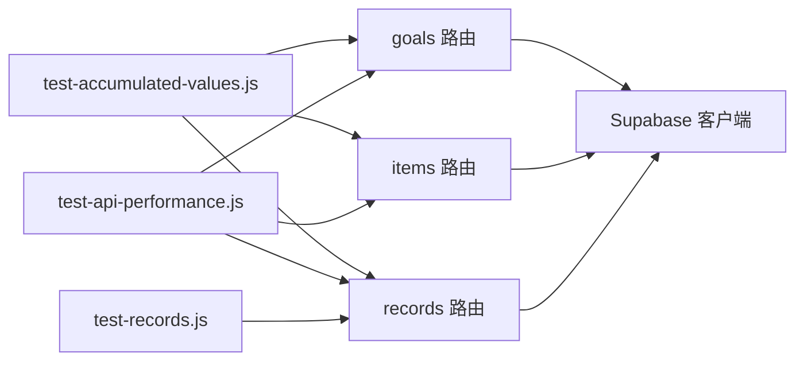

# 集成测试

<cite>
**本文引用的文件**
- [README.md](file://README.md)
- [package.json](file://package.json)
- [test-accumulated-values.js](file://test/scripts/test-accumulated-values.js)
- [test-api-performance.js](file://test/scripts/test-api-performance.js)
- [test-records.js](file://test/scripts/test-records.js)
- [test_stats_api.ps1](file://test/scripts/test_stats_api.ps1)
- [goals 路由](file://src/app/api/v2/goals/route.ts)
- [items 路由](file://src/app/api/v2/items/route.ts)
- [records 路由](file://src/app/api/v2/records/route.ts)
- [Supabase 客户端](file://src/lib/supabase/client.ts)
</cite>

## 目录
1. [简介](#简介)
2. [项目结构](#项目结构)
3. [核心组件](#核心组件)
4. [架构总览](#架构总览)
5. [详细组件分析](#详细组件分析)
6. [依赖关系分析](#依赖关系分析)
7. [性能考虑](#性能考虑)
8. [故障排查指南](#故障排查指南)
9. [结论](#结论)
10. [附录](#附录)

## 简介
本文件面向 TETO 1.0 项目，提供一套完整的集成测试方案与实施指南，覆盖端到端测试流程、数据库连接测试、API 接口完整工作流验证、测试数据准备与环境搭建、事务与一致性校验、外部服务与第三方 API 集成测试、异步操作处理以及性能/压力/负载测试实施方案。文档以现有测试脚本与 API 路由为依据，结合 Supabase 认证与数据库层实现，给出可落地的测试策略与步骤。

## 项目结构
- 测试相关资源位于 test 目录，包含：
  - 脚本：用于累计值一致性比对、API 性能测量、记录数据一致性比对、统计 API 响应抓取等。
  - 响应样例：存储典型 API 返回示例，便于回归与对比。
- API 层采用 Next.js App Router 的 API 路由，位于 src/app/api/v2 下，分别提供目标、事项、记录等核心资源的增删查改能力。
- Supabase 客户端封装位于 src/lib/supabase，负责与认证与数据库交互。

**图示来源**
- [test-accumulated-values.js:1-65](file://test/scripts/test-accumulated-values.js#L1-L65)
- [test-api-performance.js:1-82](file://test/scripts/test-api-performance.js#L1-L82)
- [test-records.js:1-57](file://test/scripts/test-records.js#L1-L57)
- [test_stats_api.ps1:1-16](file://test/scripts/test_stats_api.ps1#L1-L16)
- [goals 路由:1-49](file://src/app/api/v2/goals/route.ts#L1-L49)
- [items 路由:1-47](file://src/app/api/v2/items/route.ts#L1-L47)
- [records 路由:1-86](file://src/app/api/v2/records/route.ts#L1-L86)
- [Supabase 客户端:1-9](file://src/lib/supabase/client.ts#L1-L9)

**章节来源**
- [README.md: 13-47:13-47](file://README.md#L13-L47)
- [package.json: 1-44:1-44](file://package.json#L1-L44)

## 核心组件
- API 路由组件
  - 目标路由：提供目标列表查询与创建，内部进行用户鉴权与参数解析，并调用数据库层实现。
  - 事项路由：提供事项列表查询与创建，同样进行鉴权与参数解析。
  - 记录路由：提供记录列表查询与创建，包含对关联事项归属的校验，并调用数据库层实现。
- Supabase 客户端：封装浏览器端客户端创建逻辑，供路由层在需要时进行额外的数据库查询（如记录创建时对事项归属的校验）。
- 测试脚本组件
  - 累计值一致性脚本：拉取任务、统计与记录页面的累计值，进行数值一致性比对。
  - API 性能脚本：对多个关键 API 进行多次请求取平均耗时，识别潜在性能瓶颈。
  - 记录一致性脚本：对比不同端点返回的记录集合与聚合结果，核对数量与汇总值。
  - 统计 API 抓取脚本：使用 PowerShell 抓取统计接口响应并进行简单结构验证。

**章节来源**
- [goals 路由:1-49](file://src/app/api/v2/goals/route.ts#L1-L49)
- [items 路由:1-47](file://src/app/api/v2/items/route.ts#L1-L47)
- [records 路由:1-86](file://src/app/api/v2/records/route.ts#L1-L86)
- [Supabase 客户端:1-9](file://src/lib/supabase/client.ts#L1-L9)
- [test-accumulated-values.js:1-65](file://test/scripts/test-accumulated-values.js#L1-L65)
- [test-api-performance.js:1-82](file://test/scripts/test-api-performance.js#L1-L82)
- [test-records.js:1-57](file://test/scripts/test-records.js#L1-L57)
- [test_stats_api.ps1:1-16](file://test/scripts/test_stats_api.ps1#L1-L16)

## 架构总览
下图展示了从测试脚本到 API 路由再到 Supabase 的端到端调用链路，以及错误处理与鉴权流程的关键节点。

**图示来源**
- [goals 路由:6-28](file://src/app/api/v2/goals/route.ts#L6-L28)
- [items 路由:6-26](file://src/app/api/v2/items/route.ts#L6-L26)
- [records 路由:7-42](file://src/app/api/v2/records/route.ts#L7-L42)
- [Supabase 客户端:1-9](file://src/lib/supabase/client.ts#L1-L9)

## 详细组件分析

### 目标 API 集成测试
- 测试目标
  - 验证 GET 查询过滤参数（状态、所属事项、所属阶段）是否正确传递与解析。
  - 验证 POST 创建时必填字段校验与权限控制。
  - 验证鉴权失败时返回 401，其他错误返回 500。
- 端到端流程
  - 发送带查询参数的 GET 请求，断言返回数据符合筛选条件。
  - 发送缺失必填字段的 POST 请求，断言返回 400。
  - 使用无效会话发起请求，断言返回 401。
- 数据库连接测试
  - 通过 Supabase 客户端执行查询，验证行级安全策略生效（仅返回当前用户数据）。
- 外部服务与第三方 API
  - 若目标模块涉及外部同步（如计划平台），需在测试中注入假数据并断言回调/同步行为。
- 异步操作与一致性
  - 对于批量创建/更新，使用事务包装并在断言前等待异步写入完成。
- 性能与压力
  - 使用性能脚本对目标列表与创建接口进行多次请求，记录平均与最慢耗时。

**图示来源**
- [goals 路由:6-28](file://src/app/api/v2/goals/route.ts#L6-L28)

**章节来源**
- [goals 路由:1-49](file://src/app/api/v2/goals/route.ts#L1-L49)

### 事项 API 集成测试
- 测试目标
  - 验证 GET 支持状态与置顶筛选；POST 校验标题必填；鉴权失败返回 401。
- 端到端流程
  - 构造不同筛选组合，断言返回数据匹配。
  - 缺少标题的创建请求断言 400。
- 数据库连接测试
  - 断言返回数据仅包含当前用户事项，验证 RLS 生效。
- 外部服务与第三方 API
  - 如事项与外部看板集成，需断言事件触发与回写一致性。
- 异步与一致性
  - 批量排序/置顶变更需在事务内完成并校验最终状态。

**图示来源**
- [items 路由:6-26](file://src/app/api/v2/items/route.ts#L6-L26)

**章节来源**
- [items 路由:1-47](file://src/app/api/v2/items/route.ts#L1-L47)

### 记录 API 集成测试
- 测试目标
  - 验证 GET 支持日期区间、事项、类型、标签、收藏、搜索与分页限制。
  - 验证 POST 内容与日期必填；校验关联事项归属；鉴权失败返回 401。
- 端到端流程
  - 构造复杂筛选组合，断言返回数据与分页限制一致。
  - 创建记录时若 item_id 非当前用户拥有则断言 404。
- 数据库连接测试
  - 使用 Supabase 客户端在路由层进行二次校验，确保 RLS 与归属校验生效。
- 外部服务与第三方 API
  - 若记录创建触发外部通知或分析，需断言回调与状态一致性。
- 异步与一致性
  - 对于批量删除/链接等操作，需在事务中执行并断言最终一致性。

**图示来源**
- [records 路由:44-86](file://src/app/api/v2/records/route.ts#L44-L86)
- [Supabase 客户端:1-9](file://src/lib/supabase/client.ts#L1-L9)

**章节来源**
- [records 路由:1-86](file://src/app/api/v2/records/route.ts#L1-L86)

### 累计值一致性测试（跨端点比对）
- 测试目标
  - 比对统计页面与记录页面的累计值，确保计算一致性。
- 实施要点
  - 先获取任务列表，再针对每个任务调用统计与记录端点，提取累计值并比对。
  - 对于无目标的任务跳过比对。
- 数据准备
  - 准备若干任务与对应记录，确保存在可计算的累计值。
- 异常处理
  - 对网络错误与解析错误进行捕获与日志输出。

**图示来源**
- [test-accumulated-values.js:4-63](file://test/scripts/test-accumulated-values.js#L4-L63)

**章节来源**
- [test-accumulated-values.js:1-65](file://test/scripts/test-accumulated-values.js#L1-L65)

### API 性能测试（平均与最慢耗时）
- 测试目标
  - 对关键 API 进行多次请求取平均与最慢耗时，识别性能瓶颈。
- 实施要点
  - 针对任务、项目、统计等页面的代表性端点执行测试。
  - 输出每次请求耗时与平均/最慢值，并对超阈值发出告警。
- 结果解读
  - 将平均耗时与最慢耗时作为性能基线，持续监控回归。

**图示来源**
- [test-api-performance.js:47-79](file://test/scripts/test-api-performance.js#L47-L79)

**章节来源**
- [test-api-performance.js:1-82](file://test/scripts/test-api-performance.js#L1-L82)

### 记录数据一致性测试（数量与汇总）
- 测试目标
  - 比对不同端点返回的记录数量与汇总值，确保数据一致性。
- 实施要点
  - 分别请求记录端点与统计端点，提取记录集合与汇总字段。
  - 对特定任务（如英语单词测试）抽取子集，计算总和并比对。
- 数据准备
  - 准备包含多条记录的数据集，确保有明确的汇总字段。

**图示来源**
- [test-records.js:8-54](file://test/scripts/test-records.js#L8-L54)

**章节来源**
- [test-records.js:1-57](file://test/scripts/test-records.js#L1-L57)

### 统计 API 响应抓取与结构验证
- 测试目标
  - 抓取统计接口响应，保存为文件并进行基本结构验证。
- 实施要点
  - 使用 PowerShell 抓取响应内容并保存为 JSON 文件。
  - 检查响应中是否存在预期字段（如平均相关字段）。
- 结果解读
  - 作为回归测试的一部分，确保响应结构稳定。

**章节来源**
- [test_stats_api.ps1:1-16](file://test/scripts/test_stats_api.ps1#L1-L16)

## 依赖关系分析
- 组件耦合
  - API 路由依赖鉴权模块获取当前用户 ID，再调用数据库层实现。
  - 记录路由在创建时可能使用 Supabase 客户端进行二次校验，增强数据一致性。
- 外部依赖
  - Supabase 提供认证与数据库服务，测试需确保环境变量配置正确。
- 潜在环路
  - 当前结构为单向依赖（脚本 -> 路由 -> 认证/数据库），未见循环依赖。

**图示来源**
- [test-accumulated-values.js:1-65](file://test/scripts/test-accumulated-values.js#L1-L65)
- [test-api-performance.js:1-82](file://test/scripts/test-api-performance.js#L1-L82)
- [test-records.js:1-57](file://test/scripts/test-records.js#L1-L57)
- [goals 路由:1-49](file://src/app/api/v2/goals/route.ts#L1-L49)
- [items 路由:1-47](file://src/app/api/v2/items/route.ts#L1-L47)
- [records 路由:1-86](file://src/app/api/v2/records/route.ts#L1-L86)
- [Supabase 客户端:1-9](file://src/lib/supabase/client.ts#L1-L9)

**章节来源**
- [package.json: 15-32:15-32](file://package.json#L15-L32)

## 性能考虑
- 基准测试
  - 使用性能脚本对关键端点进行多次请求，记录平均与最慢耗时，建立性能基线。
- 压力与负载测试
  - 使用并发工具（如 Apache Bench 或 k6）对统计与记录端点施加压力，观察吞吐与延迟变化。
- 数据库优化
  - 对高频查询端点增加索引（如按日期、用户、状态等），并结合 EXPLAIN 分析慢查询。
- 缓存策略
  - 对静态或低频变更的数据引入缓存层，减少数据库压力。
- 异步处理
  - 对耗时操作（如批量导入、报表生成）采用队列与后台任务，避免阻塞主请求。

## 故障排查指南
- 鉴权失败
  - 现象：返回 401。
  - 排查：确认环境变量配置、会话有效性与用户 ID 获取逻辑。
- 参数校验失败
  - 现象：返回 400。
  - 排查：检查必填字段与参数格式，确保前端传参与路由校验一致。
- 数据归属校验失败
  - 现象：记录创建返回 404。
  - 排查：确认关联事项是否属于当前用户，Supabase 客户端查询是否正确。
- 响应结构异常
  - 现象：统计接口字段缺失或格式不符。
  - 排查：使用响应抓取脚本保存并比对结构，逐步定位上游数据源问题。

**章节来源**
- [goals 路由:35-47](file://src/app/api/v2/goals/route.ts#L35-L47)
- [items 路由:33-45](file://src/app/api/v2/items/route.ts#L33-L45)
- [records 路由:50-74](file://src/app/api/v2/records/route.ts#L50-L74)
- [test_stats_api.ps1:1-16](file://test/scripts/test_stats_api.ps1#L1-L16)

## 结论
本集成测试方案基于现有 API 路由与测试脚本，提供了从端到端请求到响应验证、数据库连接与一致性校验、性能与压力评估的完整路径。建议在 CI 中自动化执行这些测试，并结合缓存与索引优化持续提升系统稳定性与性能表现。

## 附录
- 环境变量与数据库初始化
  - 环境变量：Supabase URL 与匿名密钥，可选开发模式与测试用户 ID。
  - 数据库初始化：按顺序执行核心表创建与 RLS 启用脚本。
- 测试数据准备
  - 准备最小可用数据集（用户、事项、目标、记录），确保覆盖边界场景（空数据、超长输入、非法日期等）。
- 外部服务与第三方 API
  - 对涉及外部回调或同步的模块，建议在测试中注入假数据并断言回调触发与回写一致性。

**章节来源**
- [README.md: 54-90:54-90](file://README.md#L54-L90)
- [package.json: 6-11:6-11](file://package.json#L6-L11)