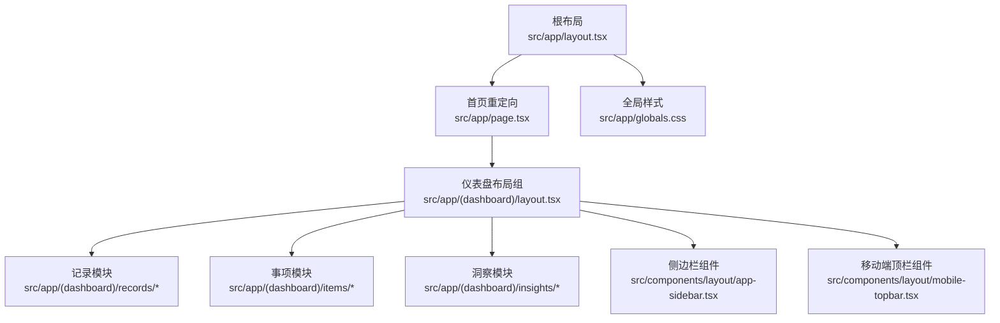
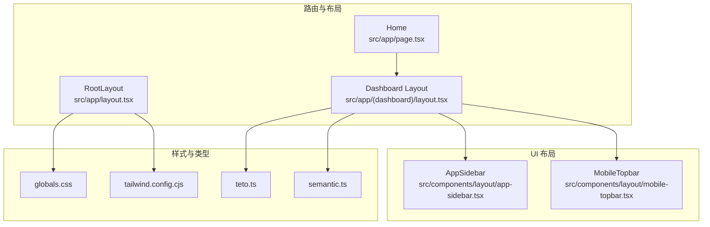
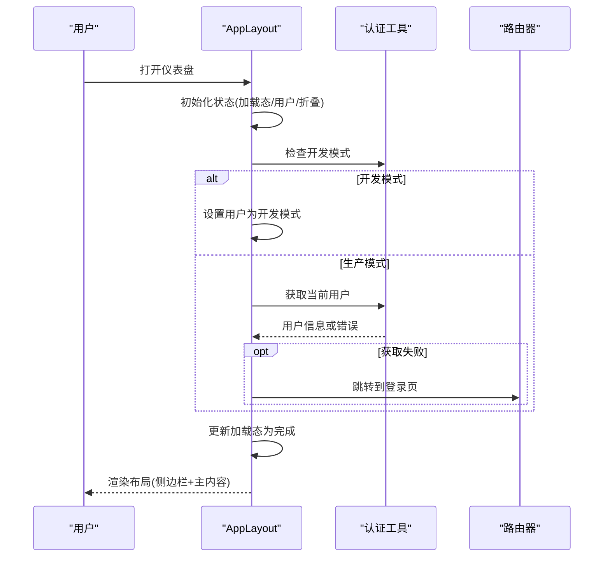
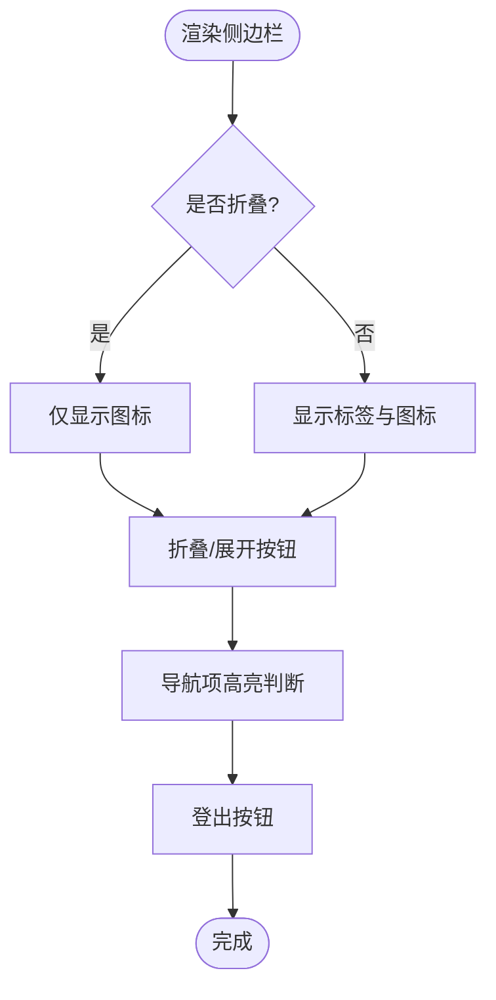
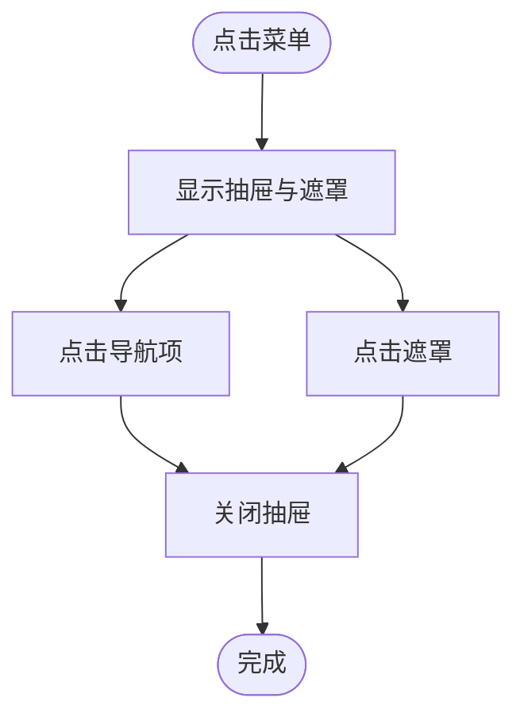
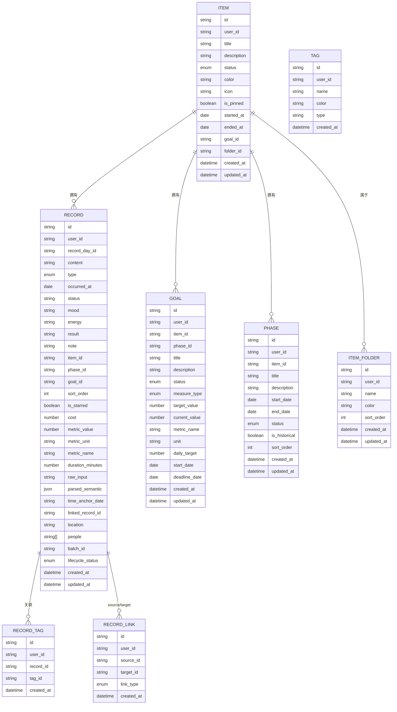
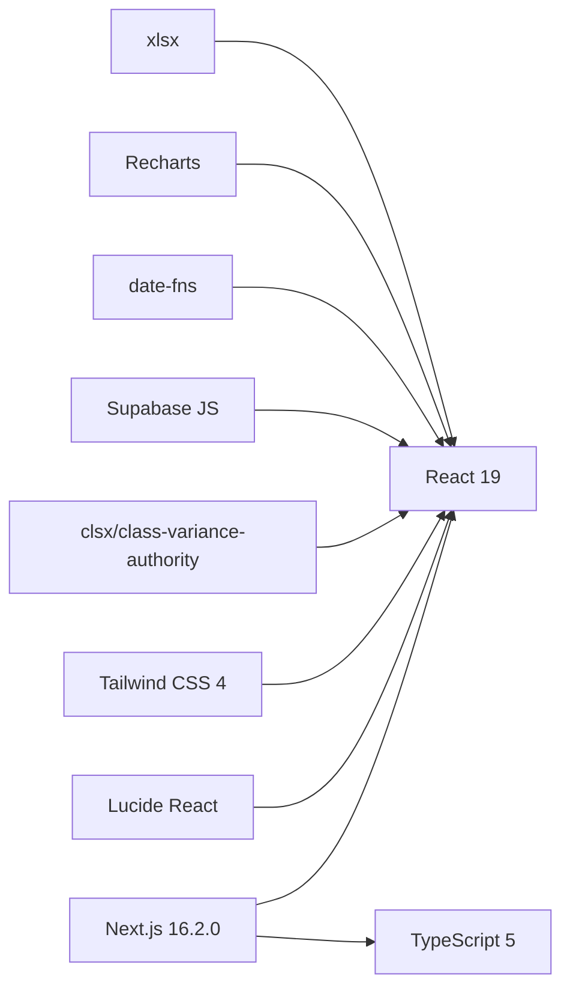

# 前端架构

<cite>
**本文引用的文件**
- [package.json](file://package.json)
- [next.config.js](file://next.config.js)
- [tsconfig.json](file://tsconfig.json)
- [tailwind.config.cjs](file://tailwind.config.cjs)
- [src/app/layout.tsx](file://src/app/layout.tsx)
- [src/app/page.tsx](file://src/app/page.tsx)
- [src/app/(dashboard)/layout.tsx](file://src/app/(dashboard)/layout.tsx)
- [src/components/layout/app-sidebar.tsx](file://src/components/layout/app-sidebar.tsx)
- [src/components/layout/mobile-topbar.tsx](file://src/components/layout/mobile-topbar.tsx)
- [src/types/teto.ts](file://src/types/teto.ts)
- [src/types/semantic.ts](file://src/types/semantic.ts)
</cite>

## 目录
1. [引言](#引言)
2. [项目结构](#项目结构)
3. [核心组件](#核心组件)
4. [架构总览](#架构总览)
5. [详细组件分析](#详细组件分析)
6. [依赖分析](#依赖分析)
7. [性能考虑](#性能考虑)
8. [故障排查指南](#故障排查指南)
9. [结论](#结论)
10. [附录](#附录)

## 引言
本文件面向 TETO 前端架构，围绕 Next.js 16.2.0 App Router 设计、React 组件体系与 TypeScript 类型系统进行深入解析。重点覆盖页面路由组织、布局组件设计、响应式布局实现、组件层次结构、状态管理模式、性能优化策略、CSS-in-JS 与 Tailwind CSS 集成、移动端适配方案、组件生命周期管理、错误边界处理、SEO 优化实践、构建配置、代码分割与缓存机制等。

## 项目结构
- 采用 Next.js App Router 的文件系统路由约定，页面与布局按目录组织，支持并行路由组与嵌套路由。
- 全局样式通过根布局引入，页面入口统一跳转至默认模块。
- 类型系统集中于 src/types，涵盖数据模型、API 请求/响应、语义解析等。
- UI 布局组件位于 src/components/layout，提供桌面端侧边栏与移动端顶部导航抽屉。

图表来源
- [src/app/layout.tsx:1-13](file://src/app/layout.tsx#L1-L13)
- [src/app/page.tsx:1-5](file://src/app/page.tsx#L1-L5)
- [src/app/(dashboard)/layout.tsx](file://src/app/(dashboard)/layout.tsx#L1-L90)
- [src/components/layout/app-sidebar.tsx:1-147](file://src/components/layout/app-sidebar.tsx#L1-L147)
- [src/components/layout/mobile-topbar.tsx:1-137](file://src/components/layout/mobile-topbar.tsx#L1-L137)

章节来源
- [src/app/layout.tsx:1-13](file://src/app/layout.tsx#L1-L13)
- [src/app/page.tsx:1-5](file://src/app/page.tsx#L1-L5)
- [src/app/(dashboard)/layout.tsx](file://src/app/(dashboard)/layout.tsx#L1-L90)

## 核心组件
- 根布局 RootLayout：注入全局样式，承载 html/body 结构。
- 首页 Home：使用服务端重定向至默认模块路径。
- 仪表盘 AppLayout：负责认证检查、侧边栏状态持久化、桌面端侧边栏与移动端顶栏的组合布局。
- 布局组件 AppSidebar、MobileTopbar：分别提供桌面端导航与移动端抽屉导航，支持登录态显示与登出操作。

章节来源
- [src/app/layout.tsx:1-13](file://src/app/layout.tsx#L1-L13)
- [src/app/page.tsx:1-5](file://src/app/page.tsx#L1-L5)
- [src/app/(dashboard)/layout.tsx](file://src/app/(dashboard)/layout.tsx#L1-L90)
- [src/components/layout/app-sidebar.tsx:1-147](file://src/components/layout/app-sidebar.tsx#L1-L147)
- [src/components/layout/mobile-topbar.tsx:1-137](file://src/components/layout/mobile-topbar.tsx#L1-L137)

## 架构总览
- 路由与布局：App Router 通过目录结构自动建立路由树；仪表盘组内嵌套多个功能模块页面。
- 状态与认证：仪表盘布局在客户端侧执行认证检查，开发模式与生产模式分支处理；侧边栏折叠状态通过本地存储持久化。
- 样式与主题：Tailwind CSS 配置集中管理颜色、圆角、字体族；全局样式在根布局引入。
- 类型系统：核心数据模型、API 请求/响应、语义解析类型集中定义，确保前后端契约一致。

图表来源
- [src/app/layout.tsx:1-13](file://src/app/layout.tsx#L1-L13)
- [src/app/page.tsx:1-5](file://src/app/page.tsx#L1-L5)
- [src/app/(dashboard)/layout.tsx](file://src/app/(dashboard)/layout.tsx#L1-L90)
- [src/components/layout/app-sidebar.tsx:1-147](file://src/components/layout/app-sidebar.tsx#L1-L147)
- [src/components/layout/mobile-topbar.tsx:1-137](file://src/components/layout/mobile-topbar.tsx#L1-L137)
- [tailwind.config.cjs:1-61](file://tailwind.config.cjs#L1-L61)
- [src/types/teto.ts:1-516](file://src/types/teto.ts#L1-L516)
- [src/types/semantic.ts:1-66](file://src/types/semantic.ts#L1-L66)

## 详细组件分析

### 仪表盘布局 AppLayout
- 认证流程：首次挂载时检查是否为开发模式，否则调用用户获取函数；失败则重定向至登录页。
- 状态管理：加载态、用户信息、侧边栏折叠状态；侧边栏状态写入本地存储并在组件卸载前保持。
- 响应式布局：桌面端显示侧边栏与主内容区，移动端使用顶栏抽屉导航；侧边栏折叠时动态调整主区左间距。
- 交互细节：提供切换侧边栏折叠的回调；加载中显示旋转指示器。

图表来源
- [src/app/(dashboard)/layout.tsx](file://src/app/(dashboard)/layout.tsx#L1-L90)

章节来源
- [src/app/(dashboard)/layout.tsx](file://src/app/(dashboard)/layout.tsx#L1-L90)

### 侧边栏 AppSidebar
- 导航项：记录、事项、洞察三个主要模块，图标与高亮逻辑基于当前路径。
- 交互行为：支持折叠/展开，折叠时仅显示图标；提供登出按钮，调用 Supabase 客户端登出并刷新页面。
- 样式：深色主题背景，激活项使用渐变强调，hover 效果提升可发现性。

图表来源
- [src/components/layout/app-sidebar.tsx:1-147](file://src/components/layout/app-sidebar.tsx#L1-L147)

章节来源
- [src/components/layout/app-sidebar.tsx:1-147](file://src/components/layout/app-sidebar.tsx#L1-L147)

### 移动端顶栏 MobileTopbar
- 抽屉导航：点击菜单按钮弹出抽屉，遮罩层点击可关闭；抽屉内包含导航项与用户信息展示。
- 路径高亮：导航项根据当前路径进行激活态切换。
- 交互细节：抽屉关闭时自动清除状态，减少内存占用。

图表来源
- [src/components/layout/mobile-topbar.tsx:1-137](file://src/components/layout/mobile-topbar.tsx#L1-L137)

章节来源
- [src/components/layout/mobile-topbar.tsx:1-137](file://src/components/layout/mobile-topbar.tsx#L1-L137)

### 类型系统与数据模型
- 数据模型：记录、事项、标签、记录-记录微关联、目标、阶段、文件夹等核心实体接口。
- API 类型：创建/更新请求体、查询参数、通用响应包装、洞察返回结构等。
- 语义解析：时间锚点、量化指标、解析结果、复合句关系等，支撑自然语言输入的结构化解析。
- 类型复用：语义解析类型从语义模块 re-export，便于跨模块共享。

图表来源
- [src/types/teto.ts:28-121](file://src/types/teto.ts#L28-L121)
- [src/types/teto.ts:194-217](file://src/types/teto.ts#L194-L217)
- [src/types/teto.ts:316-354](file://src/types/teto.ts#L316-L354)
- [src/types/teto.ts:429-451](file://src/types/teto.ts#L429-L451)

章节来源
- [src/types/teto.ts:1-516](file://src/types/teto.ts#L1-L516)
- [src/types/semantic.ts:1-66](file://src/types/semantic.ts#L1-L66)

## 依赖分析
- 框架与运行时：Next.js 16.2.0、React 19、TypeScript 5。
- UI 与样式：Lucide React 图标、Tailwind CSS v4、PostCSS、clsx、class-variance-authority、tailwind-merge。
- 数据与认证：Supabase SSR 与 JS 客户端、node-fetch。
- 可视化：Recharts。
- 工具链：date-fns、xlsx。

图表来源
- [package.json:15-32](file://package.json#L15-L32)

章节来源
- [package.json:1-44](file://package.json#L1-L44)

## 性能考虑
- 代码分割：App Router 基于文件系统的路由天然支持按需加载，模块级组件与页面组件可独立打包。
- 构建优化：TypeScript 严格模式与 bundler 分辨，减少运行时错误与冗余代码。
- 样式体积：Tailwind 按 content 范围扫描，避免未使用类名进入产物；主题扩展集中在配置文件，便于裁剪。
- 本地状态持久化：侧边栏折叠状态写入 localStorage，减少服务器往返。
- 路由与导航：使用 Next.js 内置导航，避免重复渲染与不必要重载。
- 图标与资源：Lucide React 使用按需导入，减小包体。

## 故障排查指南
- 认证失败重定向：仪表盘布局在认证失败时会跳转到登录页，检查认证工具与 Supabase 配置。
- 侧边栏状态异常：若折叠状态未生效，检查本地存储键值与浏览器隐私设置。
- 样式未生效：确认全局样式已在根布局引入，Tailwind 内容扫描路径包含对应组件目录。
- 类型不匹配：核对 API 请求/响应类型与后端契约，确保字段名称与枚举值一致。

章节来源
- [src/app/(dashboard)/layout.tsx](file://src/app/(dashboard)/layout.tsx#L29-L50)
- [src/components/layout/app-sidebar.tsx:35-39](file://src/components/layout/app-sidebar.tsx#L35-L39)
- [src/app/layout.tsx:1-13](file://src/app/layout.tsx#L1-L13)
- [tailwind.config.cjs:3-7](file://tailwind.config.cjs#L3-L7)

## 结论
TETO 前端以 Next.js App Router 为核心，结合严格的 TypeScript 类型系统与 Tailwind CSS 主题体系，实现了清晰的页面组织、可维护的布局组件与良好的移动端体验。通过本地状态持久化与按需加载策略，兼顾了用户体验与性能表现。未来可在错误边界、SEO 元信息与缓存策略上进一步完善。

## 附录
- 构建配置要点
  - Next.js 配置允许开发时指定来源，便于本地联调。
  - TypeScript 严格模式与 bundler 分辨，确保类型安全与打包效率。
  - Tailwind CSS 集中主题扩展，按内容扫描启用，支持自定义颜色、圆角与字体族。
- SEO 实践建议
  - 在页面组件中添加元信息与结构化数据，提升搜索引擎可见性。
  - 使用静态生成或预渲染策略，配合增量静态再生（ISR）优化更新频率。
- 缓存机制设计
  - 客户端缓存：利用本地存储与 React 状态缓存关键 UI 状态。
  - 服务端缓存：结合 API 层缓存策略与 HTTP 缓存头，降低后端压力。

章节来源
- [next.config.js:1-4](file://next.config.js#L1-L4)
- [tsconfig.json:1-42](file://tsconfig.json#L1-L42)
- [tailwind.config.cjs:1-61](file://tailwind.config.cjs#L1-L61)