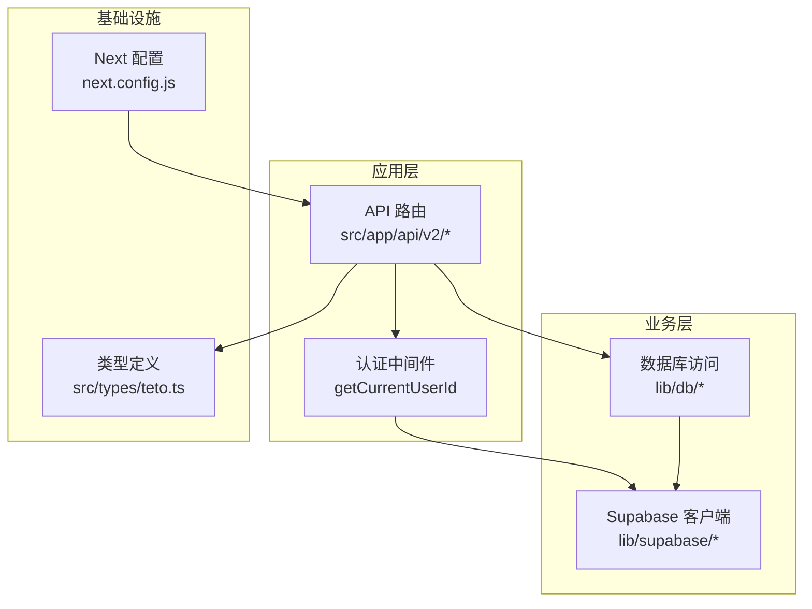
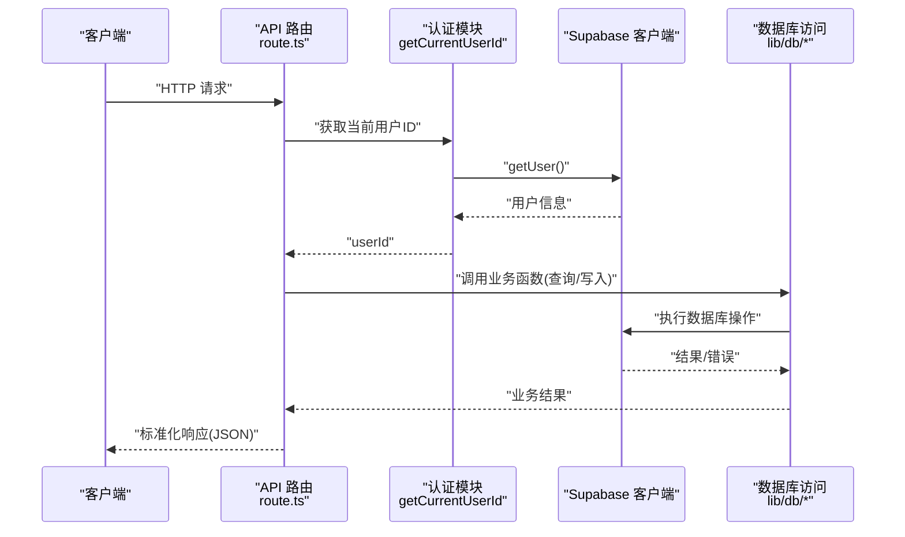
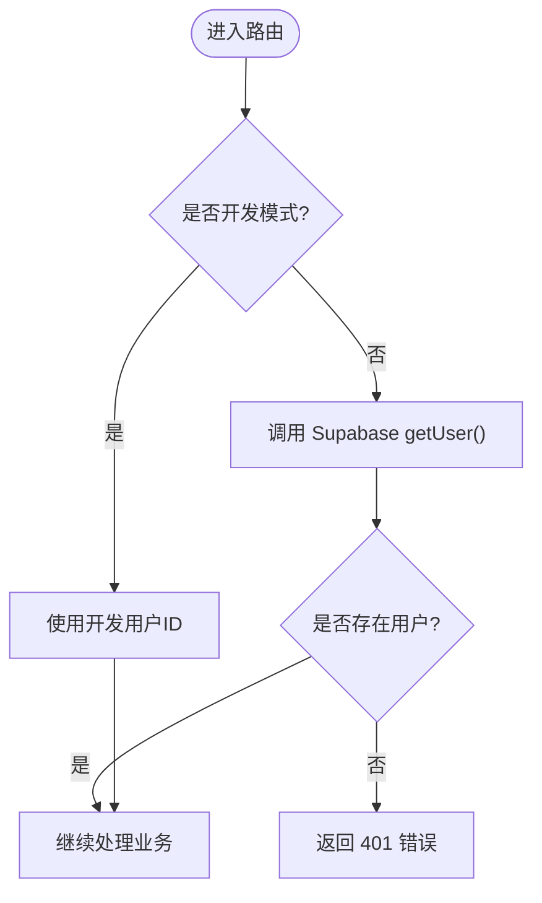
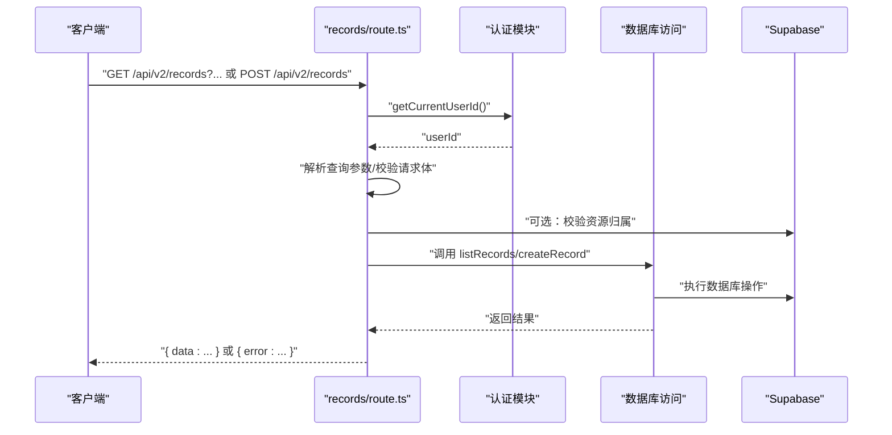
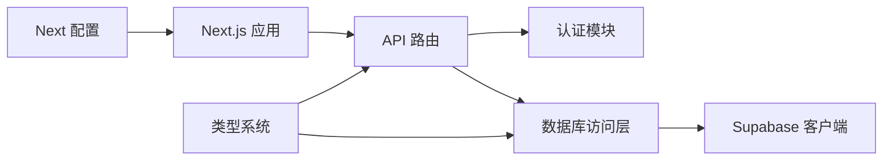

# 后端架构

<cite>
**本文引用的文件**
- [README.md](file://README.md)
- [package.json](file://package.json)
- [next.config.js](file://next.config.js)
- [src/app/api/v2/goals/route.ts](file://src/app/api/v2/goals/route.ts)
- [src/app/api/v2/records/route.ts](file://src/app/api/v2/records/route.ts)
- [src/app/api/v2/items/route.ts](file://src/app/api/v2/items/route.ts)
- [src/app/api/v2/insights/route.ts](file://src/app/api/v2/insights/route.ts)
- [src/app/api/v2/phases/route.ts](file://src/app/api/v2/phases/route.ts)
- [src/app/api/v2/record-days/route.ts](file://src/app/api/v2/record-days/route.ts)
- [src/lib/auth/server/get-current-user-id.ts](file://src/lib/auth/server/get-current-user-id.ts)
- [src/lib/supabase/client.ts](file://src/lib/supabase/client.ts)
- [src/types/teto.ts](file://src/types/teto.ts)
</cite>

## 目录
1. [简介](#简介)
2. [项目结构](#项目结构)
3. [核心组件](#核心组件)
4. [架构总览](#架构总览)
5. [详细组件分析](#详细组件分析)
6. [依赖分析](#依赖分析)
7. [性能考虑](#性能考虑)
8. [故障排查指南](#故障排查指南)
9. [结论](#结论)
10. [附录](#附录)

## 简介
本文件面向TETO后端架构，聚焦于基于Next.js App Router的v2 REST API设计与实现，涵盖路由组织、请求处理流程、数据访问层、业务逻辑封装、错误处理机制、API版本控制策略、请求验证规则、响应格式标准化、中间件与CORS、安全防护、性能优化与并发处理、事务管理实践、缓存策略、数据库连接池与资源管理等主题。本文同时结合现有代码与类型定义，给出可操作的架构说明与最佳实践建议。

## 项目结构
- 采用Next.js App Router目录结构，API路由位于 src/app/api/v2 下，按资源域划分（如 goals、items、records、phases、record-days、insights 等）。
- 认证与授权通过 Supabase 实现，服务端通过 Supabase SSR 客户端获取当前用户并校验权限。
- 类型系统集中于 src/types/teto.ts，统一定义请求/响应载荷、查询参数与核心领域模型，确保前后端契约一致。
- 开发配置位于 next.config.js，允许开发时指定受信来源；环境变量通过 .env.local 注入 Supabase 凭据。

图示来源
- [src/app/api/v2/goals/route.ts:1-49](file://src/app/api/v2/goals/route.ts#L1-L49)
- [src/app/api/v2/records/route.ts:1-86](file://src/app/api/v2/records/route.ts#L1-L86)
- [src/app/api/v2/items/route.ts:1-47](file://src/app/api/v2/items/route.ts#L1-L47)
- [src/app/api/v2/insights/route.ts:1-32](file://src/app/api/v2/insights/route.ts#L1-L32)
- [src/app/api/v2/phases/route.ts:1-72](file://src/app/api/v2/phases/route.ts#L1-L72)
- [src/app/api/v2/record-days/route.ts:1-63](file://src/app/api/v2/record-days/route.ts#L1-L63)
- [src/lib/auth/server/get-current-user-id.ts:1-85](file://src/lib/auth/server/get-current-user-id.ts#L1-L85)
- [src/lib/supabase/client.ts:1-9](file://src/lib/supabase/client.ts#L1-L9)
- [src/types/teto.ts:1-516](file://src/types/teto.ts#L1-L516)
- [next.config.js:1-4](file://next.config.js#L1-L4)

章节来源
- [README.md:1-126](file://README.md#L1-L126)
- [package.json:1-44](file://package.json#L1-L44)
- [next.config.js:1-4](file://next.config.js#L1-L4)

## 核心组件
- API 路由：每个资源域对应一个 route.ts，统一处理 GET/POST 等方法，解析查询参数或请求体，调用业务函数，并以标准响应结构返回。
- 认证模块：通过 getCurrentUserId 获取当前用户ID，支持开发模式与生产模式两种路径；对未登录或获取用户失败的情况返回401。
- 数据访问层：各资源域的数据库访问函数（如 getGoals、listRecords、listItems 等）在 lib/db 层实现，供路由调用。
- Supabase 客户端：提供浏览器端与SSR端客户端工厂，统一访问 Supabase 服务。
- 类型系统：集中定义请求/响应载荷、查询参数、领域模型与枚举，保证API契约一致性。

章节来源
- [src/app/api/v2/goals/route.ts:1-49](file://src/app/api/v2/goals/route.ts#L1-L49)
- [src/app/api/v2/records/route.ts:1-86](file://src/app/api/v2/records/route.ts#L1-L86)
- [src/app/api/v2/items/route.ts:1-47](file://src/app/api/v2/items/route.ts#L1-L47)
- [src/app/api/v2/insights/route.ts:1-32](file://src/app/api/v2/insights/route.ts#L1-L32)
- [src/app/api/v2/phases/route.ts:1-72](file://src/app/api/v2/phases/route.ts#L1-L72)
- [src/app/api/v2/record-days/route.ts:1-63](file://src/app/api/v2/record-days/route.ts#L1-L63)
- [src/lib/auth/server/get-current-user-id.ts:1-85](file://src/lib/auth/server/get-current-user-id.ts#L1-L85)
- [src/lib/supabase/client.ts:1-9](file://src/lib/supabase/client.ts#L1-L9)
- [src/types/teto.ts:1-516](file://src/types/teto.ts#L1-L516)

## 架构总览
下图展示API请求从路由到数据库访问的整体流程，以及认证与Supabase交互的关键节点。

图示来源
- [src/app/api/v2/records/route.ts:1-86](file://src/app/api/v2/records/route.ts#L1-L86)
- [src/lib/auth/server/get-current-user-id.ts:1-85](file://src/lib/auth/server/get-current-user-id.ts#L1-L85)
- [src/lib/supabase/client.ts:1-9](file://src/lib/supabase/client.ts#L1-L9)

## 详细组件分析

### 认证与授权（服务端）
- 开发模式：通过环境变量开启，直接返回固定用户ID，便于本地调试。
- 生产模式：通过 Supabase SSR 客户端 getUser() 获取当前用户；若无用户或获取失败，抛出明确错误，路由层捕获并返回401。
- 授权策略：所有API路由在处理前必须获取有效userId，且部分路由会进一步校验资源归属（如事项/阶段所属用户）。

图示来源
- [src/lib/auth/server/get-current-user-id.ts:1-85](file://src/lib/auth/server/get-current-user-id.ts#L1-L85)

章节来源
- [src/lib/auth/server/get-current-user-id.ts:1-85](file://src/lib/auth/server/get-current-user-id.ts#L1-L85)

### API 路由与请求处理（以 records 为例）
- 查询参数解析：从URL searchParams 提取过滤条件，构造查询对象传入业务函数。
- 请求体校验：对必填字段进行前置校验，不符合则返回400。
- 资源归属校验：对关联资源（如 item_id）进行归属校验，避免越权访问。
- 标准化响应：统一返回 { data: ... } 结构；错误时返回 { error: string }，并设置合适的状态码（400/401/404/500）。

图示来源
- [src/app/api/v2/records/route.ts:1-86](file://src/app/api/v2/records/route.ts#L1-L86)
- [src/lib/auth/server/get-current-user-id.ts:1-85](file://src/lib/auth/server/get-current-user-id.ts#L1-L85)

章节来源
- [src/app/api/v2/records/route.ts:1-86](file://src/app/api/v2/records/route.ts#L1-L86)

### 其他核心资源路由
- goals：支持按 status/item_id/phase_id 过滤，POST 校验 title。
- items：支持按 status/is_pinned 过滤，POST 校验 title。
- phases：GET 支持按 item_id/status/is_historical 过滤；POST 校验 item_id/title 并校验归属。
- record-days：支持按 date 查询或列出全部，POST 校验 date 并可选更新 summary。
- insights：要求 date_from/date_to 参数，返回结构化洞察数据。

章节来源
- [src/app/api/v2/goals/route.ts:1-49](file://src/app/api/v2/goals/route.ts#L1-L49)
- [src/app/api/v2/items/route.ts:1-47](file://src/app/api/v2/items/route.ts#L1-L47)
- [src/app/api/v2/phases/route.ts:1-72](file://src/app/api/v2/phases/route.ts#L1-L72)
- [src/app/api/v2/record-days/route.ts:1-63](file://src/app/api/v2/record-days/route.ts#L1-L63)
- [src/app/api/v2/insights/route.ts:1-32](file://src/app/api/v2/insights/route.ts#L1-L32)

### 类型系统与契约
- 统一定义了请求载荷（Create*/Update*）、查询参数（*Query）、响应结构（ApiResponse/ApiListResponse/ApiError）与领域模型（Record/Item/Goal/Phase 等）。
- 通过枚举与字面量类型约束字段取值，减少运行期错误。
- 洞察数据结构（InsightsData）作为固定返回结构，便于前端稳定消费。

章节来源
- [src/types/teto.ts:1-516](file://src/types/teto.ts#L1-L516)

### 数据访问层与Supabase集成
- Supabase 客户端：提供浏览器端与SSR端工厂，统一访问 Supabase 服务。
- 路由层通过 lib/supabase/server 客户端进行用户校验与资源归属校验；业务层通过 Supabase 进行数据库读写。
- 事务管理：当前路由未显式使用事务；对于需要强一致性的复合写入，可在业务层封装事务回调（例如使用 Supabase 事务能力）。

章节来源
- [src/lib/supabase/client.ts:1-9](file://src/lib/supabase/client.ts#L1-L9)
- [src/app/api/v2/records/route.ts:1-86](file://src/app/api/v2/records/route.ts#L1-L86)
- [src/app/api/v2/phases/route.ts:1-72](file://src/app/api/v2/phases/route.ts#L1-L72)

## 依赖分析
- 框架与运行时：Next.js 16、TypeScript、Node.js。
- 数据库与认证：Supabase（PostgreSQL + Auth）。
- 工具库：date-fns（日期处理）、recharts（图表）、xlsx（表格处理）等。
- 开发配置：next.config.js 中允许特定开发来源，便于本地联调。

图示来源
- [package.json:1-44](file://package.json#L1-L44)
- [next.config.js:1-4](file://next.config.js#L1-L4)
- [src/app/api/v2/records/route.ts:1-86](file://src/app/api/v2/records/route.ts#L1-L86)
- [src/lib/auth/server/get-current-user-id.ts:1-85](file://src/lib/auth/server/get-current-user-id.ts#L1-L85)
- [src/lib/supabase/client.ts:1-9](file://src/lib/supabase/client.ts#L1-L9)
- [src/types/teto.ts:1-516](file://src/types/teto.ts#L1-L516)

章节来源
- [package.json:1-44](file://package.json#L1-L44)
- [next.config.js:1-4](file://next.config.js#L1-L4)

## 性能考虑
- 并发处理：Next.js App Router 基于边缘与服务器端渲染，天然支持并发请求；建议在业务层避免不必要的串行调用。
- 缓存策略：
  - 短期热点数据：可引入内存缓存（如LRU）缓存轻量查询结果（如最近记录日列表）。
  - 响应缓存：对不频繁变更的只读数据（如静态枚举、配置）可利用浏览器/CDN缓存。
- 数据库连接池：Supabase 作为托管服务，无需手动配置连接池；建议合理使用索引与查询投影，减少IO。
- 资源管理：避免在请求处理中创建大对象或阻塞操作；使用流式处理与分页（如 limit/offset）降低内存占用。
- API优化：对高频查询使用合适的索引与覆盖索引；限制单次查询返回量（如 limit）；对复杂聚合查询考虑物化视图或预计算。

## 故障排查指南
- 认证失败（401）：确认 Supabase 会话有效；检查 getUser() 是否返回用户；开发模式下检查 NEXT_PUBLIC_DEV_MODE 与 NEXT_PUBLIC_DEV_USER_ID。
- 资源归属错误（404）：检查关联资源（如 item_id）是否属于当前用户；核对 Supabase RLS 策略。
- 请求体校验失败（400）：检查必填字段是否缺失；核对请求体结构与类型定义。
- 服务器内部错误（500）：查看路由层 catch 分支中的错误消息；关注 Supabase 查询错误与网络异常。

章节来源
- [src/app/api/v2/records/route.ts:1-86](file://src/app/api/v2/records/route.ts#L1-L86)
- [src/app/api/v2/phases/route.ts:1-72](file://src/app/api/v2/phases/route.ts#L1-L72)
- [src/lib/auth/server/get-current-user-id.ts:1-85](file://src/lib/auth/server/get-current-user-id.ts#L1-L85)

## 结论
TETO后端采用清晰的分层架构：API路由负责协议与契约、认证模块负责身份与授权、数据访问层负责数据库交互、类型系统统一契约。v2 API遵循REST风格，使用标准化响应结构与明确的状态码，配合严格的请求校验与资源归属校验，确保安全性与一致性。未来可在事务管理、缓存与数据库优化方面进一步增强，以支撑更高并发与更复杂的业务场景。

## 附录

### API 版本控制策略
- 当前API位于 src/app/api/v2，采用语义化版本路径（/api/v2/*），便于未来演进与向后兼容。
- 建议：新增/变更字段时保持向后兼容；对破坏性变更提供 v3 路径并标注弃用策略。

章节来源
- [src/app/api/v2/goals/route.ts:1-49](file://src/app/api/v2/goals/route.ts#L1-L49)
- [src/app/api/v2/records/route.ts:1-86](file://src/app/api/v2/records/route.ts#L1-L86)
- [src/app/api/v2/items/route.ts:1-47](file://src/app/api/v2/items/route.ts#L1-L47)
- [src/app/api/v2/insights/route.ts:1-32](file://src/app/api/v2/insights/route.ts#L1-L32)
- [src/app/api/v2/phases/route.ts:1-72](file://src/app/api/v2/phases/route.ts#L1-L72)
- [src/app/api/v2/record-days/route.ts:1-63](file://src/app/api/v2/record-days/route.ts#L1-L63)

### 请求验证规则与响应格式
- 请求验证：
  - 必填字段校验（如 records 的 content/date、goals/items 的 title、phases 的 item_id/title）。
  - 资源归属校验（如 records/items 的 item_id、phases 的 item_id）。
- 响应格式：
  - 成功：{ data: ... }
  - 错误：{ error: string, details?: string }
  - 状态码：400/401/404/500 明确区分客户端错误与服务端错误。

章节来源
- [src/app/api/v2/records/route.ts:1-86](file://src/app/api/v2/records/route.ts#L1-L86)
- [src/app/api/v2/phases/route.ts:1-72](file://src/app/api/v2/phases/route.ts#L1-L72)
- [src/app/api/v2/goals/route.ts:1-49](file://src/app/api/v2/goals/route.ts#L1-L49)
- [src/app/api/v2/items/route.ts:1-47](file://src/app/api/v2/items/route.ts#L1-L47)
- [src/types/teto.ts:262-273](file://src/types/teto.ts#L262-L273)

### 中间件与CORS
- Next.js 默认中间件：本项目未显式定义自定义中间件；默认行为满足基本跨域需求。
- CORS配置：可通过 next.config.js 的 allowedDevOrigins 管理开发环境来源；生产环境建议在 Supabase 控制台或反向代理层统一配置。

章节来源
- [next.config.js:1-4](file://next.config.js#L1-L4)

### 安全防护措施
- 行级安全策略（RLS）：数据库表已启用 RLS，确保用户只能访问自身数据。
- 认证与授权：统一通过 Supabase getUser() 获取用户上下文；开发模式下严格限定用户ID。
- 资源归属校验：对关键写操作进行归属校验，防止越权修改他人资源。

章节来源
- [README.md:63-91](file://README.md#L63-L91)
- [src/lib/auth/server/get-current-user-id.ts:1-85](file://src/lib/auth/server/get-current-user-id.ts#L1-L85)
- [src/app/api/v2/records/route.ts:1-86](file://src/app/api/v2/records/route.ts#L1-L86)
- [src/app/api/v2/phases/route.ts:1-72](file://src/app/api/v2/phases/route.ts#L1-L72)

### 事务管理实践
- 当前路由未显式使用事务；对于需要强一致性的复合写入（如创建记录并更新汇总），建议在业务层封装事务回调，确保原子性。
- 使用 Supabase 事务能力时，需注意错误回滚与幂等性设计。

章节来源
- [src/app/api/v2/records/route.ts:1-86](file://src/app/api/v2/records/route.ts#L1-L86)
- [src/app/api/v2/phases/route.ts:1-72](file://src/app/api/v2/phases/route.ts#L1-L72)

### 缓存策略与数据库连接池
- 缓存：对只读、低频变更数据进行短期缓存；对热点查询结果进行内存缓存；利用浏览器/CDN缓存静态资源。
- 连接池：Supabase 为托管服务，无需手动配置连接池；建议优化查询与索引，减少IO压力。

章节来源
- [src/lib/supabase/client.ts:1-9](file://src/lib/supabase/client.ts#L1-L9)