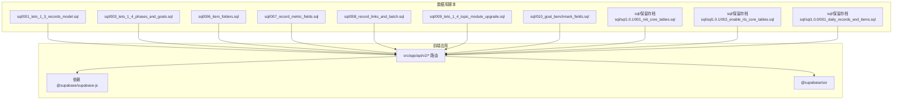
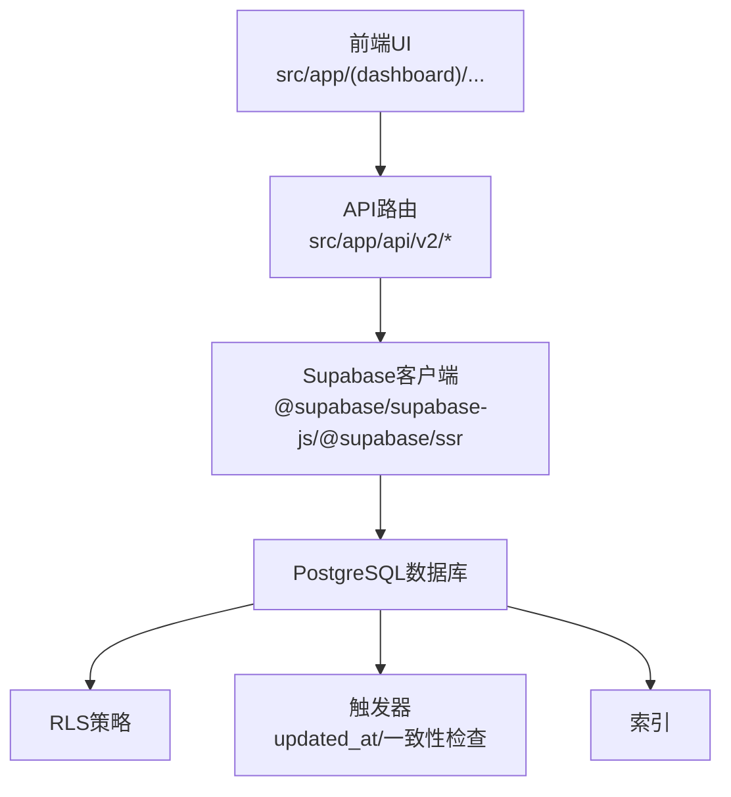
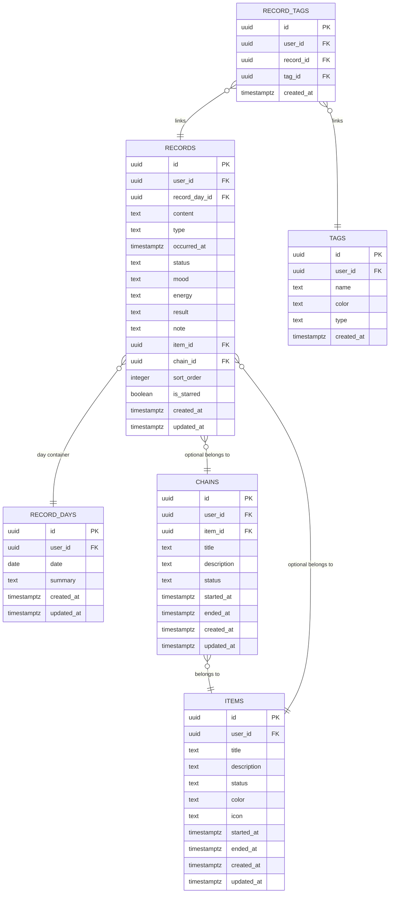
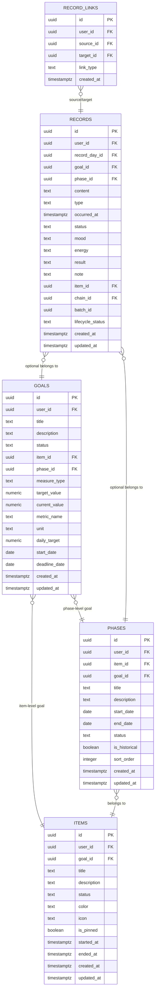
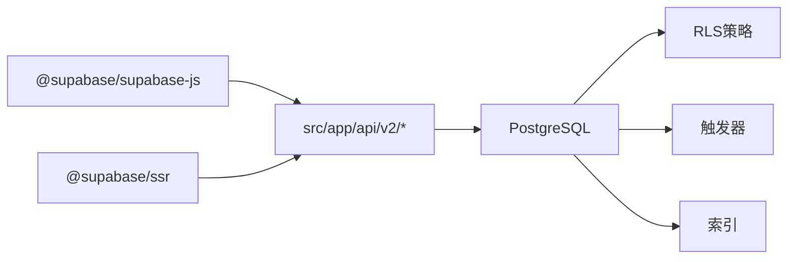

# 数据库架构

<cite>
**本文引用的文件**
- [001_teto_1_3_records_model.sql](file://sql/001_teto_1_3_records_model.sql)
- [003_teto_1_4_phases_and_goals.sql](file://sql/003_teto_1_4_phases_and_goals.sql)
- [006_item_folders.sql](file://sql/006_item_folders.sql)
- [007_record_metric_fields.sql](file://sql/007_record_metric_fields.sql)
- [008_record_links_and_batch.sql](file://sql/008_record_links_and_batch.sql)
- [009_teto_1_4_topic_module_upgrade.sql](file://sql/009_teto_1_4_topic_module_upgrade.sql)
- [010_goal_benchmark_fields.sql](file://sql/010_goal_benchmark_fields.sql)
- [001_init_core_tables.sql](file://sql/保留存档sql/sql1.0.1/001_init_core_tables.sql)
- [002_enable_rls_core_tables.sql](file://sql/保留存档sql/sql1.0.1/002_enable_rls_core_tables.sql)
- [001_daily_records_and_items.sql](file://sql/保留存档sql/sql1.0.0/001_daily_records_and_items.sql)
- [DATA_RULES.md](file://DATA_RULES.md)
- [package.json](file://package.json)
</cite>

## 更新摘要
**变更内容**
- 新增目标(Goals)和阶段(Phases)核心数据模型
- 扩展items和records表的外键关联系统
- 增加成本追踪和指标字段支持
- 新增记录链接和批次处理机制
- 引入事项文件夹模块
- 完善量化引擎基准字段

## 目录
1. [简介](#简介)
2. [项目结构](#项目结构)
3. [核心组件](#核心组件)
4. [架构总览](#架构总览)
5. [详细组件分析](#详细组件分析)
6. [依赖分析](#依赖分析)
7. [性能考虑](#性能考虑)
8. [故障排查指南](#故障排查指南)
9. [结论](#结论)
10. [附录](#附录)

## 简介
本文件面向TETO数据库架构，系统性梳理PostgreSQL数据库设计、Supabase集成方案、行级安全策略（RLS）实现、数据模型与表关系、字段约束规则、迁移与版本管理、索引与查询优化、性能监控、数据同步与事务并发控制、以及数据安全与审计思路。文档以仓库内SQL脚本与规则文档为依据，结合前端Next.js应用与Supabase客户端依赖，形成从底层数据到上层应用的完整视角。

**更新** 本次更新重点反映了TETO 1.4版本的重大架构升级，新增了目标导向的层级化数据模型，扩展了记录系统的关联能力，并引入了成本追踪和量化分析功能。

## 项目结构
- 数据库脚本集中于 sql 目录，按版本与功能分文件组织，便于迁移与回滚。
- 历史版本脚本保存在 sql/保留存档sql 下，覆盖1.0.0与1.0.1版本，便于对照演进。
- 前端应用通过 @supabase/supabase-js 与 @supabase/ssr 与后端API交互，API路由位于 src/app/api/v2 下。
- 数据规则文档 DATA_RULES.md 提供业务层面的数据真源、统计口径与规则，指导数据库设计与查询。

**图表来源**
- [001_teto_1_3_records_model.sql:1-300](file://sql/001_teto_1_3_records_model.sql#L1-L300)
- [003_teto_1_4_phases_and_goals.sql:1-130](file://sql/003_teto_1_4_phases_and_goals.sql#L1-L130)
- [006_item_folders.sql:1-38](file://sql/006_item_folders.sql#L1-L38)
- [007_record_metric_fields.sql:1-20](file://sql/007_record_metric_fields.sql#L1-L20)
- [008_record_links_and_batch.sql:1-32](file://sql/008_record_links_and_batch.sql#L1-L32)
- [009_teto_1_4_topic_module_upgrade.sql:1-97](file://sql/009_teto_1_4_topic_module_upgrade.sql#L1-L97)
- [010_goal_benchmark_fields.sql:1-40](file://sql/010_goal_benchmark_fields.sql#L1-L40)
- [001_init_core_tables.sql:1-185](file://sql/保留存档sql/sql1.0.1/001_init_core_tables.sql#L1-L185)
- [002_enable_rls_core_tables.sql:1-298](file://sql/保留存档sql/sql1.0.1/002_enable_rls_core_tables.sql#L1-L298)
- [001_daily_records_and_items.sql:1-59](file://sql/保留存档sql/sql1.0.0/001_daily_records_and_items.sql#L1-L59)
- [package.json:15-32](file://package.json#L15-L32)

**章节来源**
- [package.json:15-32](file://package.json#L15-L32)

## 核心组件
- 记录模型（1.3版本）：record_days、items、chains、records、tags、record_tags，配套触发器与RLS。
- 目标与阶段模型（1.4版本）：goals、phases，并扩展 items/records/records_links/batch_id/lifecycle_status 等。
- 事项文件夹模块：item_folders 与 items.folder_id。
- 记录度量字段：metric_value、metric_unit、metric_name、duration_minutes。
- 目标基准字段：metric_name、unit、daily_target、start_date、deadline_date。
- 历史版本脚本：profiles/daily_records/daily_record_items/diary_reviews/projects/project_logs 的初始化与RLS。

**更新** 新增了目标量化引擎支持，包括布尔型和数值型两种度量类型，以及完整的基准配置字段。

**章节来源**
- [001_teto_1_3_records_model.sql:18-109](file://sql/001_teto_1_3_records_model.sql#L18-L109)
- [003_teto_1_4_phases_and_goals.sql:16-61](file://sql/003_teto_1_4_phases_and_goals.sql#L16-L61)
- [006_item_folders.sql:8-19](file://sql/006_item_folders.sql#L8-L19)
- [007_record_metric_fields.sql:8-19](file://sql/007_record_metric_fields.sql#L8-L19)
- [008_record_links_and_batch.sql:7-31](file://sql/008_record_links_and_batch.sql#L7-L31)
- [009_teto_1_4_topic_module_upgrade.sql:19-87](file://sql/009_teto_1_4_topic_module_upgrade.sql#L19-L87)
- [010_goal_benchmark_fields.sql:11-30](file://sql/010_goal_benchmark_fields.sql#L11-L30)
- [001_init_core_tables.sql:9-184](file://sql/保留存档sql/sql1.0.1/001_init_core_tables.sql#L9-L184)
- [002_enable_rls_core_tables.sql:10-292](file://sql/保留存档sql/sql1.0.1/002_enable_rls_core_tables.sql#L10-L292)
- [001_daily_records_and_items.sql:1-59](file://sql/保留存档sql/sql1.0.0/001_daily_records_and_items.sql#L1-L59)

## 架构总览
TETO数据库采用PostgreSQL+Supabase模式，前端Next.js通过Supabase JS客户端调用后端API路由，API路由访问数据库。RLS策略确保用户数据隔离，触发器保障数据一致性与审计时间戳更新。迁移脚本按版本分层，历史版本脚本保留以便对照与回滚。

**更新** 架构现在支持目标导向的数据层级，从个人目标到阶段再到具体记录的完整追踪体系。

**图表来源**
- [package.json:19-21](file://package.json#L19-L21)
- [001_teto_1_3_records_model.sql:115-189](file://sql/001_teto_1_3_records_model.sql#L115-L189)
- [002_enable_rls_core_tables.sql:10-292](file://sql/保留存档sql/sql1.0.1/002_enable_rls_core_tables.sql#L10-L292)

## 详细组件分析

### 记录模型（1.3版本）
- 表关系
  - record_days：按天容器，records 通过 record_day_id 关联。
  - items：主题容器，chains 通过 item_id 关联。
  - records：最小记录单元，可关联 items/chains，支持标签多对多。
  - tags/record_tags：标签与记录的多对多。
- 约束与索引
  - 唯一性：record_days(user_id, date)、record_tags(record_id, tag_id)。
  - 外键：records.record_day_id、chains.item_id、records.item_id/chains.id、record_tags(record_id/tag_id)。
  - 索引：按用户+时间/上下文字段建立复合索引，提升查询效率。
- 触发器
  - updated_at：所有表统一设置 updated_at。
  - chain-item 一致性：records 的 chain_id 与 item_id 一致性校验，避免悬挂引用。
- RLS
  - 所有表启用RLS，策略为"仅限本人可见/修改/删除"。

**图表来源**
- [001_teto_1_3_records_model.sql:18-109](file://sql/001_teto_1_3_records_model.sql#L18-L109)

**章节来源**
- [001_teto_1_3_records_model.sql:18-300](file://sql/001_teto_1_3_records_model.sql#L18-L300)

### 目标与阶段模型（1.4版本）
- 新增表
  - goals：目标，支持 boolean/numeric 两种度量类型，新增 item_id/phase_id 归属与度量字段。
  - phases：阶段，承载目标的时间窗口与状态，支持 is_historical、sort_order。
- 对现有表的扩展
  - items：新增 goal_id，支持事项级目标。
  - records：新增 goal_id/phase_id，支持记录级目标与阶段归属。
  - 新增 record_links：记录间关系（完成/衍生/推迟/通用关联）。
  - 新增 batch_id：批量导入/拆分的批次标识。
  - 新增 lifecycle_status：记录生命周期状态（active/completed/postponed/cancelled）。
- RLS与索引
  - goals/phases 启用RLS与相应索引。
  - record_links 建立 source/target 索引，records 增加 batch_id/phase_id 索引。

**更新** 新增了目标量化引擎支持，包括measure_type字段支持布尔型和数值型两种度量方式，以及完整的基准配置字段。

**图表来源**
- [003_teto_1_4_phases_and_goals.sql:16-61](file://sql/003_teto_1_4_phases_and_goals.sql#L16-L61)
- [009_teto_1_4_topic_module_upgrade.sql:30-87](file://sql/009_teto_1_4_topic_module_upgrade.sql#L30-L87)
- [008_record_links_and_batch.sql:7-31](file://sql/008_record_links_and_batch.sql#L7-L31)

**章节来源**
- [003_teto_1_4_phases_and_goals.sql:1-130](file://sql/003_teto_1_4_phases_and_goals.sql#L1-L130)
- [009_teto_1_4_topic_module_upgrade.sql:1-97](file://sql/009_teto_1_4_topic_module_upgrade.sql#L1-L97)
- [008_record_links_and_batch.sql:1-32](file://sql/008_record_links_and_batch.sql#L1-L32)

### 事项文件夹模块
- 新增 item_folders 表，items 新增 folder_id 外键，支持事项归档与可视化分组。
- RLS 与索引：按 user_id 与 folder_id 建立索引，保障查询性能与数据隔离。

**章节来源**
- [006_item_folders.sql:1-38](file://sql/006_item_folders.sql#L1-L38)

### 记录度量字段
- 为 records 新增 metric_value、metric_unit、metric_name、duration_minutes，支持结构化统计与时长记录。
- 设计原则：先字段后索引，待查询路径明确后再补充索引。

**章节来源**
- [007_record_metric_fields.sql:1-20](file://sql/007_record_metric_fields.sql#L1-L20)

### 目标基准字段
- 为 goals 新增 metric_name、unit、daily_target、start_date、deadline_date，支撑"金融账本式"量化引擎。
- 设计原则：全部 nullable，向后兼容 boolean 目标；幂等脚本保证安全演进。

**更新** 新增了完整的量化引擎支持，包括指标名称、计量单位、日均目标、起始日期和截止日期等字段。

**章节来源**
- [010_goal_benchmark_fields.sql:1-40](file://sql/010_goal_benchmark_fields.sql#L1-L40)

### 历史版本脚本（1.0.0/1.0.1）
- 1.0.0：daily_records 与 daily_record_items 的早期模型，奠定"每日记录+项目项"的基础。
- 1.0.1：profiles、daily_records、daily_record_items、diary_reviews、projects、project_logs 的初始化与RLS策略，体现早期的用户扩展、复盘与项目追踪能力。

**章节来源**
- [001_daily_records_and_items.sql:1-59](file://sql/保留存档sql/sql1.0.0/001_daily_records_and_items.sql#L1-L59)
- [001_init_core_tables.sql:1-185](file://sql/保留存档sql/sql1.0.1/001_init_core_tables.sql#L1-L185)
- [002_enable_rls_core_tables.sql:1-298](file://sql/保留存档sql/sql1.0.1/002_enable_rls_core_tables.sql#L1-L298)

## 依赖分析
- 前端依赖
  - @supabase/supabase-js：提供数据库访问与认证能力。
  - @supabase/ssr：服务端渲染场景下的Supabase客户端封装。
- API路由
  - src/app/api/v2/* 路由作为数据库访问入口，配合Supabase客户端实现业务接口。
- 数据依赖
  - 记录模型与目标阶段模型构成核心数据域，历史版本脚本提供演进轨迹。

**图表来源**
- [package.json:19-21](file://package.json#L19-L21)

**章节来源**
- [package.json:15-32](file://package.json#L15-L32)

## 性能考虑
- 索引设计原则
  - 用户+时间/上下文：record_days(user_id,date)、records(user_id,record_day_id)、records(user_id,occurred_at)、items(user_id,status)、chains(user_id,item_id)、record_tags(record_id/tag_id)。
  - 新增字段索引：phases(item_id)、records(goal_id)、records(batch_id)、records(phase_id)、item_folders(user_id)、items(folder_id)。
  - 部分索引：items(is_pinned=true) 仅索引置顶事项，降低存储与写放大。
- 查询优化策略
  - 使用复合索引覆盖常见过滤条件（user_id+时间/状态）。
  - 避免SELECT *，按需投影字段。
  - 对高基数字段（如 metric_name/unit）在目标层与记录层分别建立索引，减少全表扫描。
- 性能监控
  - 结合Supabase Dashboard与Postgres EXPLAIN/ANALYZE，定期审查慢查询。
  - 监控RLS带来的额外开销，必要时对热点路径进行索引优化。

**更新** 新增了目标量化引擎相关的索引策略，包括measure_type字段的索引优化和批量查询性能提升。

**章节来源**
- [001_teto_1_3_records_model.sql:282-299](file://sql/001_teto_1_3_records_model.sql#L282-L299)
- [003_teto_1_4_phases_and_goals.sql:117-129](file://sql/003_teto_1_4_phases_and_goals.sql#L117-L129)
- [006_item_folders.sql:35-37](file://sql/006_item_folders.sql#L35-L37)
- [009_teto_1_4_topic_module_upgrade.sql:22-23](file://sql/009_teto_1_4_topic_module_upgrade.sql#L22-L23)

## 故障排查指南
- RLS导致权限问题
  - 确认用户会话与auth.uid()一致，检查策略是否正确启用（ENABLE ROW LEVEL SECURITY）。
  - 对历史版本表（profiles/daily_records等）核对RLS策略是否完整。
- 触发器异常
  - updated_at 触发器：确认set_updated_at函数存在且各表触发器已创建。
  - chain-item 一致性触发器：当更新records的chain_id时，确保item_id与之匹配，避免异常。
- 外键与唯一约束
  - record_days(user_id,date)、record_tags(record_id,tag_id)：插入失败多因重复或用户ID不匹配。
  - phases.goal_id 曾存在但已在1.4清理，若仍报错需确认迁移脚本是否执行。
- 索引缺失导致慢查询
  - 检查是否存在高频过滤字段未建索引（如 records.batch_id、records.phase_id）。
- 版本迁移问题
  - 使用保留存档脚本比对差异，确保幂等性（IF NOT EXISTS/IF EXISTS）。

**更新** 新增了目标量化引擎相关的故障排查指南，包括measure_type字段的约束检查和目标基准字段的验证。

**章节来源**
- [001_teto_1_3_records_model.sql:197-276](file://sql/001_teto_1_3_records_model.sql#L197-L276)
- [002_enable_rls_core_tables.sql:10-292](file://sql/保留存档sql/sql1.0.1/002_enable_rls_core_tables.sql#L10-L292)
- [009_teto_1_4_topic_module_upgrade.sql:64-74](file://sql/009_teto_1_4_topic_module_upgrade.sql#L64-L74)

## 结论
TETO数据库以清晰的版本化迁移脚本为基础，围绕"记录-事项-阶段-目标"的层级构建数据模型，辅以RLS保障数据安全、触发器确保一致性、索引优化查询性能。历史版本脚本与当前脚本共同构成了可追溯、可回滚、可扩展的数据库演进路径。**更新** 1.4版本的重大升级引入了目标导向的数据架构，支持量化引擎和成本追踪，为未来的数据分析和决策支持奠定了坚实基础。建议在后续版本中持续完善索引覆盖与查询路径，强化性能监控与审计日志，逐步引入数据同步与并发控制策略。

## 附录
- 数据规则与统计口径参考：DATA_RULES.md，明确"真源"与统计边界，指导数据库设计与查询实现。
- Supabase集成：前端通过 @supabase/supabase-js 与 @supabase/ssr 与后端API协作，API路由作为数据库访问的统一入口。

**章节来源**
- [DATA_RULES.md:1-174](file://DATA_RULES.md#L1-L174)