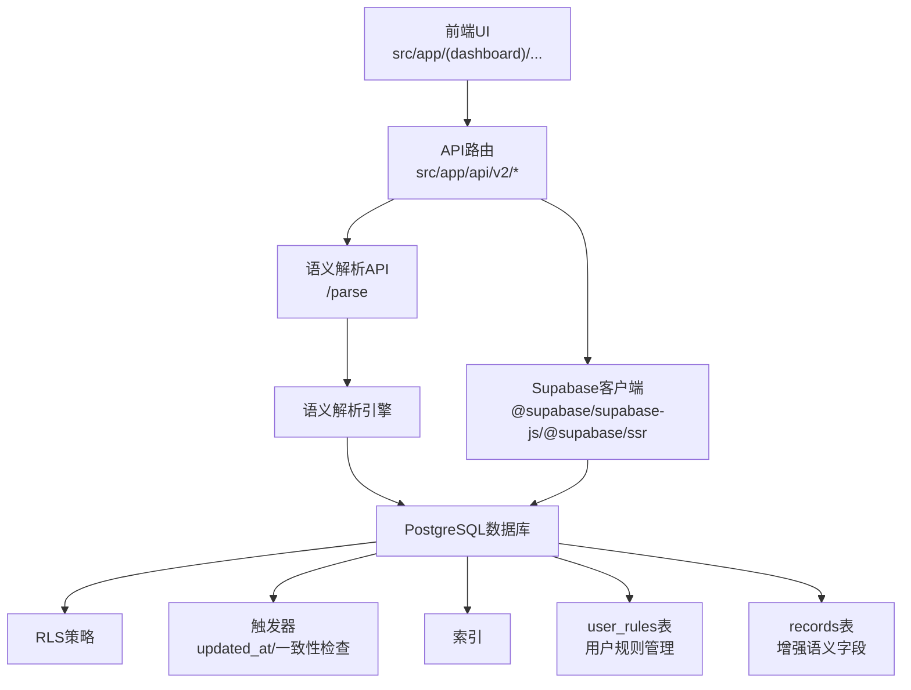
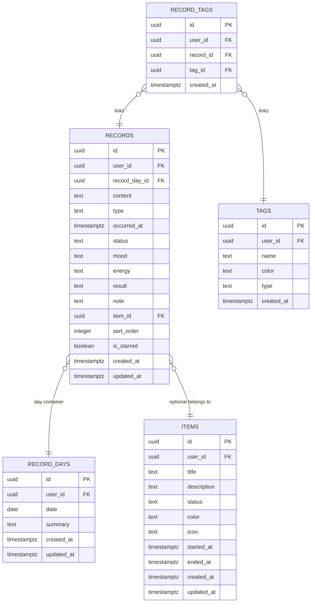
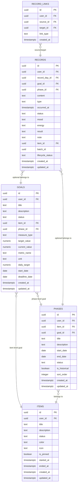
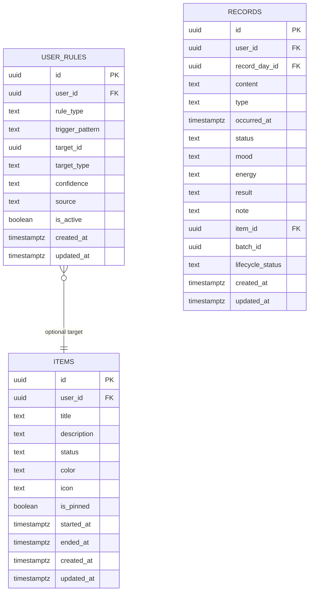
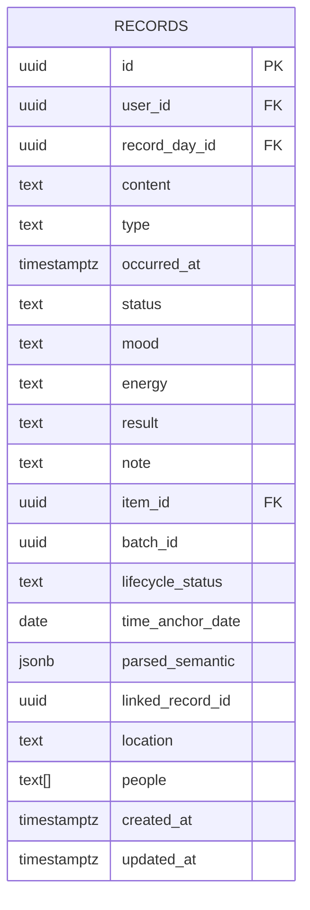
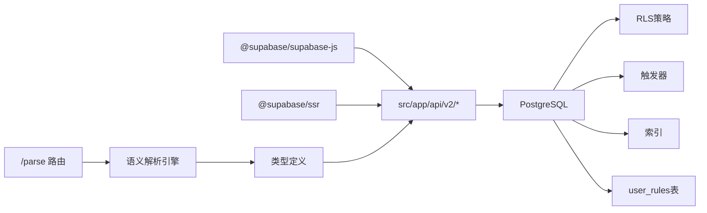

# 数据库架构

<cite>
**本文引用的文件**
- [001_teto_1_3_records_model.sql](file://sql/001_teto_1_3_records_model.sql)
- [003_teto_1_4_phases_and_goals.sql](file://sql/003_teto_1_4_phases_and_goals.sql)
- [006_item_folders.sql](file://sql/006_item_folders.sql)
- [007_record_metric_fields.sql](file://sql/007_record_metric_fields.sql)
- [008_record_links_and_batch.sql](file://sql/008_record_links_and_batch.sql)
- [009_teto_1_4_topic_module_upgrade.sql](file://sql/009_teto_1_4_topic_module_upgrade.sql)
- [010_goal_benchmark_fields.sql](file://sql/010_goal_benchmark_fields.sql)
- [001_drop_items_goal_id.sql](file://sql/001_drop_items_goal_id.sql)
- [002_create_user_rules.sql](file://sql/002_create_user_rules.sql)
- [003_period_rule_and_data_nature.sql](file://sql/003_period_rule_and_data_nature.sql)
- [002_drop_chain_structure.sql](file://sql/保留存档sql/sql1.1-1.4/002_drop_chain_structure.sql)
- [011_add_time_anchor_date.sql](file://sql/保留存档sql/sql1.1-1.4/011_add_time_anchor_date.sql)
- [013_record_semantic_fields.sql](file://sql/保留存档sql/sql1.1-1.4/013_record_semantic_fields.sql)
- [001_init_core_tables.sql](file://sql/保留存档sql/sql1.0.1/001_init_core_tables.sql)
- [002_enable_rls_core_tables.sql](file://sql/保留存档sql/sql1.0.1/002_enable_rls_core_tables.sql)
- [001_daily_records_and_items.sql](file://sql/保留存档sql/sql1.0.0/001_daily_records_and_items.sql)
- [DATA_RULES.md](file://DATA_RULES.md)
- [package.json](file://package.json)
- [teto.ts](file://src/types/teto.ts)
- [semantic.ts](file://src/types/semantic.ts)
- [route.ts](file://src/app/api\v2\parse\route.ts)
</cite>

## 更新摘要
**变更内容**
- **chains表完全移除**：1.5版本正式删除chains表及相关结构，清理所有依赖关系
- **items.goal_id字段清理**：移除事项表中的废弃目标字段，采用反向关联方式
- **新的时间锚点字段**：records表新增time_anchor_date字段，支持计划类记录的时间锚点解析
- **语义解析字段引入**：records表新增parsed_semantic、linked_record_id、location、people等语义解析持久化字段
- **用户规则表创建**：新增user_rules表，支持用户修正规则和AI学习规则
- **历史规律字段**：records表新增data_nature、is_period_rule等规律识别字段
- **索引优化**：新增time_anchor_date、location、people等字段的索引策略

## 目录
1. [简介](#简介)
2. [项目结构](#项目结构)
3. [核心组件](#核心组件)
4. [架构总览](#架构总览)
5. [详细组件分析](#详细组件分析)
6. [依赖分析](#依赖分析)
7. [性能考虑](#性能考虑)
8. [故障排查指南](#故障排查指南)
9. [结论](#结论)
10. [附录](#附录)

## 简介
本文件面向TETO数据库架构，系统性梳理PostgreSQL数据库设计、Supabase集成方案、行级安全策略（RLS）实现、数据模型与表关系、字段约束规则、迁移与版本管理、索引与查询优化、性能监控、数据同步与事务并发控制、以及数据安全与审计思路。文档以仓库内SQL脚本与规则文档为依据，结合前端Next.js应用与Supabase客户端依赖，形成从底层数据到上层应用的完整视角。

**更新** 本次更新重点反映了TETO 1.5版本的重大架构清理，包括chains表完全移除、items.goal_id字段清理、新的时间锚点和语义解析字段引入，以及用户规则系统的建立。

## 项目结构
- 数据库脚本集中于 sql 目录，按版本与功能分文件组织，便于迁移与回滚。
- 历史版本脚本保存在 sql/保留存档sql 下，覆盖1.0.0、1.0.1与1.1-1.4版本，便于对照演进。
- 前端应用通过 @supabase/supabase-js 与 @supabase/ssr 与后端API交互，API路由位于 src/app/api/v2 下。
- 数据规则文档 DATA_RULES.md 提供业务层面的数据真源、统计口径与规则，指导数据库设计与查询。
- 类型定义文件 src/types/ 提供TypeScript接口定义，确保数据库字段与前端类型的一致性。

```mermaid
graph TB
subgraph "数据库脚本"
V13["sql/001_teto_1_3_records_model.sql"]
V14a["sql/003_teto_1_4_phases_and_goals.sql"]
V14b["sql/006_item_folders.sql"]
V14c["sql/007_record_metric_fields.sql"]
V14d["sql/008_record_links_and_batch.sql"]
V14e["sql/009_teto_1_4_topic_module_upgrade.sql"]
V14f["sql/010_goal_benchmark_fields.sql"]
V15a["sql/001_drop_items_goal_id.sql"]
V15b["sql/002_create_user_rules.sql"]
V15c["sql/003_period_rule_and_data_nature.sql"]
H101["sql/保留存档sql/sql1.0.1/001_init_core_tables.sql"]
H101rls["sql/保留存档sql/sql1.0.1/002_enable_rls_core_tables.sql"]
H100["sql/保留存档sql/sql1.0.0/001_daily_records_and_items.sql"]
H14chain["sql/保留存档sql/sql1.1-1.4/002_drop_chain_structure.sql"]
H14time["sql/保留存档sql/sql1.1-1.4/011_add_time_anchor_date.sql"]
H14sem["sql/保留存档sql/sql1.1-1.4/013_record_semantic_fields.sql"]
end
subgraph "前端应用"
FE["src/app/api/v2/* 路由"]
SUPAJSC["依赖 @supabase/supabase-js"]
SUPASSR["@supabase/ssr"]
TYPES["src/types/* 类型定义"]
PARSE["语义解析API"]
end
FE --> SUPAJSC
FE --> SUPASSR
TYPES --> FE
PARSE --> FE
V13 --> FE
V14a --> FE
V14b --> FE
V14c --> FE
V14d --> FE
V14e --> FE
V14f --> FE
V15a --> FE
V15b --> FE
V15c --> FE
H101 --> FE
H101rls --> FE
H100 --> FE
H14chain --> FE
H14time --> FE
H14sem --> FE
```

**图表来源**
- [001_teto_1_3_records_model.sql:1-300](file://sql/001_teto_1_3_records_model.sql#L1-L300)
- [003_teto_1_4_phases_and_goals.sql:1-130](file://sql/003_teto_1_4_phases_and_goals.sql#L1-L130)
- [006_item_folders.sql:1-38](file://sql/006_item_folders.sql#L1-L38)
- [007_record_metric_fields.sql:1-20](file://sql/007_record_metric_fields.sql#L1-L20)
- [008_record_links_and_batch.sql:1-32](file://sql/008_record_links_and_batch.sql#L1-L32)
- [009_teto_1_4_topic_module_upgrade.sql:1-97](file://sql/009_teto_1_4_topic_module_upgrade.sql#L1-L97)
- [010_goal_benchmark_fields.sql:1-40](file://sql/010_goal_benchmark_fields.sql#L1-L40)
- [001_drop_items_goal_id.sql:1-42](file://sql/001_drop_items_goal_id.sql#L1-L42)
- [002_create_user_rules.sql:1-86](file://sql/002_create_user_rules.sql#L1-L86)
- [003_period_rule_and_data_nature.sql:1-69](file://sql/003_period_rule_and_data_nature.sql#L1-L69)
- [001_init_core_tables.sql:1-185](file://sql/保留存档sql/sql1.0.1/001_init_core_tables.sql#L1-L185)
- [002_enable_rls_core_tables.sql:1-298](file://sql/保留存档sql/sql1.0.1/002_enable_rls_core_tables.sql#L1-L298)
- [001_daily_records_and_items.sql:1-59](file://sql/保留存档sql/sql1.0.0/001_daily_records_and_items.sql#L1-L59)
- [002_drop_chain_structure.sql:1-49](file://sql/保留存档sql/sql1.1-1.4/002_drop_chain_structure.sql#L1-L49)
- [011_add_time_anchor_date.sql:1-25](file://sql/保留存档sql/sql1.1-1.4/011_add_time_anchor_date.sql#L1-L25)
- [013_record_semantic_fields.sql:1-42](file://sql/保留存档sql/sql1.1-1.4/013_record_semantic_fields.sql#L1-L42)
- [package.json:15-32](file://package.json#L15-L32)

**章节来源**
- [package.json:15-32](file://package.json#L15-L32)

## 核心组件
- **记录模型（1.3版本）**：record_days、items、chains、records、tags、record_tags，配套触发器与RLS。
- **目标与阶段模型（1.4版本）**：goals、phases，并扩展 items/records/records_links/batch_id/lifecycle_status 等。
- **架构清理（1.5版本）**：chains表完全移除，items.goal_id字段清理，新增user_rules表。
- **时间锚点与语义解析**：records表新增time_anchor_date、parsed_semantic、linked_record_id、location、people等字段。
- **历史规律识别**：records表新增data_nature、is_period_rule、period_*系列字段。
- **事项文件夹模块**：item_folders 与 items.folder_id。
- **记录度量字段**：metric_value、metric_unit、metric_name、duration_minutes。
- **目标基准字段**：metric_name、unit、daily_target、start_date、deadline_date。
- **历史版本脚本**：profiles/daily_records/daily_record_items/diary_reviews/projects/project_logs 的初始化与RLS。

**更新** 1.5版本引入了全新的语义解析系统，支持时间锚点、记录关联、地点和人物等语义信息的持久化存储，同时建立了用户规则系统来管理AI学习和用户修正的规则。

**章节来源**
- [001_teto_1_3_records_model.sql:18-109](file://sql/001_teto_1_3_records_model.sql#L18-L109)
- [003_teto_1_4_phases_and_goals.sql:16-61](file://sql/003_teto_1_4_phases_and_goals.sql#L16-L61)
- [006_item_folders.sql:8-19](file://sql/006_item_folders.sql#L8-L19)
- [007_record_metric_fields.sql:8-19](file://sql/007_record_metric_fields.sql#L8-L19)
- [008_record_links_and_batch.sql:7-31](file://sql/008_record_links_and_batch.sql#L7-L31)
- [009_teto_1_4_topic_module_upgrade.sql:19-87](file://sql/009_teto_1_4_topic_module_upgrade.sql#L19-L87)
- [010_goal_benchmark_fields.sql:11-30](file://sql/010_goal_benchmark_fields.sql#L11-L30)
- [001_drop_items_goal_id.sql:1-42](file://sql/001_drop_items_goal_id.sql#L1-L42)
- [002_create_user_rules.sql:14-26](file://sql/002_create_user_rules.sql#L14-L26)
- [003_period_rule_and_data_nature.sql:15-44](file://sql/003_period_rule_and_data_nature.sql#L15-L44)
- [001_init_core_tables.sql:9-184](file://sql/保留存档sql/sql1.0.1/001_init_core_tables.sql#L9-L184)
- [002_enable_rls_core_tables.sql:10-292](file://sql/保留存档sql/sql1.0.1/002_enable_rls_core_tables.sql#L10-L292)
- [001_daily_records_and_items.sql:1-59](file://sql/保留存档sql/sql1.0.0/001_daily_records_and_items.sql#L1-L59)

## 架构总览
TETO数据库采用PostgreSQL+Supabase模式，前端Next.js通过Supabase JS客户端调用后端API路由，API路由访问数据库。RLS策略确保用户数据隔离，触发器保障数据一致性与审计时间戳更新。迁移脚本按版本分层，历史版本脚本保留以便对照与回滚。

**更新** 架构现在支持目标导向的数据层级，从个人目标到阶段再到具体记录的完整追踪体系，同时引入了语义解析和用户规则系统，为智能记录处理提供支撑。

**图表来源**
- [package.json:19-21](file://package.json#L19-L21)
- [001_teto_1_3_records_model.sql:115-189](file://sql/001_teto_1_3_records_model.sql#L115-L189)
- [002_enable_rls_core_tables.sql:10-292](file://sql/保留存档sql/sql1.0.1/002_enable_rls_core_tables.sql#L10-L292)
- [route.ts:1-62](file://src/app/api\v2\parse\route.ts#L1-L62)

## 详细组件分析

### 记录模型（1.3版本）
- **表关系**
  - record_days：按天容器，records 通过 record_day_id 关联。
  - items：主题容器，chains 通过 item_id 关联（1.5版本chains表已移除）。
  - records：最小记录单元，可关联 items/chains，支持标签多对多。
  - tags/record_tags：标签与记录的多对多。
- **约束与索引**
  - 唯一性：record_days(user_id, date)、record_tags(record_id, tag_id)。
  - 外键：records.record_day_id、chains.item_id、records.item_id/chains.id、record_tags(record_id/tag_id)。
  - 索引：按用户+时间/上下文字段建立复合索引，提升查询效率。
- **触发器**
  - updated_at：所有表统一设置 updated_at。
  - chain-item 一致性：records 的 chain_id 与 item_id 一致性校验，避免悬挂引用。
- **RLS**
  - 所有表启用RLS，策略为"仅限本人可见/修改/删除"。

**图表来源**
- [001_teto_1_3_records_model.sql:18-109](file://sql/001_teto_1_3_records_model.sql#L18-L109)

**章节来源**
- [001_teto_1_3_records_model.sql:18-300](file://sql/001_teto_1_3_records_model.sql#L18-L300)

### 目标与阶段模型（1.4版本）
- **新增表**
  - goals：目标，支持 boolean/numeric 两种度量类型，新增 item_id/phase_id 归属与度量字段。
  - phases：阶段，承载目标的时间窗口与状态，支持 is_historical、sort_order。
- **对现有表的扩展**
  - items：新增 goal_id（1.5版本已移除），支持事项级目标。
  - records：新增 goal_id/phase_id，支持记录级目标与阶段归属。
  - 新增 record_links：记录间关系（完成/衍生/推迟/通用关联）。
  - 新增 batch_id：批量导入/拆分的批次标识。
  - 新增 lifecycle_status：记录生命周期状态（active/completed/postponed/cancelled）。
- **RLS与索引**
  - goals/phases 启用RLS与相应索引。
  - record_links 建立 source/target 索引，records 增加 batch_id/phase_id 索引。

**更新** 1.5版本移除了items.goal_id字段，采用反向关联方式，同时chains表完全移除，简化了数据模型。

**图表来源**
- [003_teto_1_4_phases_and_goals.sql:16-61](file://sql/003_teto_1_4_phases_and_goals.sql#L16-L61)
- [009_teto_1_4_topic_module_upgrade.sql:30-87](file://sql/009_teto_1_4_topic_module_upgrade.sql#L30-L87)
- [008_record_links_and_batch.sql:7-31](file://sql/008_record_links_and_batch.sql#L7-L31)
- [001_drop_items_goal_id.sql:1-42](file://sql/001_drop_items_goal_id.sql#L1-L42)
- [002_drop_chain_structure.sql:1-49](file://sql/保留存档sql/sql1.1-1.4/002_drop_chain_structure.sql#L1-L49)

**章节来源**
- [003_teto_1_4_phases_and_goals.sql:1-130](file://sql/003_teto_1_4_phases_and_goals.sql#L1-L130)
- [009_teto_1_4_topic_module_upgrade.sql:1-97](file://sql/009_teto_1_4_topic_module_upgrade.sql#L1-L97)
- [008_record_links_and_batch.sql:1-32](file://sql/008_record_links_and_batch.sql#L1-L32)
- [001_drop_items_goal_id.sql:1-42](file://sql/001_drop_items_goal_id.sql#L1-L42)
- [002_drop_chain_structure.sql:1-49](file://sql/保留存档sql/sql1.1-1.4/002_drop_chain_structure.sql#L1-L49)

### 架构清理（1.5版本）
- **chains表完全移除**
  - 删除trg_record_chain_item_consistency触发器和check_record_chain_item_consistency函数
  - 从records表移除chain_id字段
  - 删除chains表及其RLS策略和updated_at触发器
  - 清理相关索引idx_chains_user_item和idx_records_chain
- **items.goal_id字段清理**
  - 移除items表中的goal_id列，清理可能的外键约束
  - 确保所有旧模型目标已通过015_backfill_goals_item_id.sql迁移补全
- **user_rules表创建**
  - 支持用户修正规则和AI学习规则的持久化存储
  - 提供四种规则类型：item_mapping、sub_item_mapping、type_routing、fuzzy_resolution
  - 实现RLS策略确保用户只能访问自己的规则

**更新** 1.5版本的架构清理显著简化了数据模型，移除了不再使用的chains表和废弃的items.goal_id字段，为后续的功能扩展奠定了更简洁的基础。

**图表来源**
- [002_create_user_rules.sql:14-26](file://sql/002_create_user_rules.sql#L14-L26)
- [001_drop_items_goal_id.sql:1-42](file://sql/001_drop_items_goal_id.sql#L1-L42)
- [002_drop_chain_structure.sql:1-49](file://sql/保留存档sql/sql1.1-1.4/002_drop_chain_structure.sql#L1-L49)

**章节来源**
- [002_create_user_rules.sql:1-86](file://sql/002_create_user_rules.sql#L1-L86)
- [001_drop_items_goal_id.sql:1-42](file://sql/001_drop_items_goal_id.sql#L1-L42)
- [002_drop_chain_structure.sql:1-49](file://sql/保留存档sql/sql1.1-1.4/002_drop_chain_structure.sql#L1-L49)

### 时间锚点与语义解析（1.5版本）
- **时间锚点字段**
  - records表新增time_anchor_date字段，支持计划类记录的时间锚点解析
  - 新增索引idx_records_time_anchor，仅对非空值建立索引
  - 新增复合索引idx_records_user_item和idx_records_user_type提升查询性能
- **语义解析字段**
  - parsed_semantic：AI语义解析的完整JSON结果，用于回显、二次编辑、洞察聚合
  - linked_record_id：直接关联的记录ID，简化记录间引用
  - location：地点信息，支持地理位置查询
  - people：相关人物数组，支持数组包含查询
- **索引策略**
  - location字段建立部分索引，仅对非空值建立索引
  - people字段建立GIN索引，支持&&数组重叠查询

**更新** 1.5版本引入了全新的语义解析系统，支持时间锚点、记录关联、地点和人物等语义信息的持久化存储，为智能记录处理提供了强大的数据基础。

**图表来源**
- [011_add_time_anchor_date.sql:8-24](file://sql/保留存档sql/sql1.1-1.4/011_add_time_anchor_date.sql#L8-L24)
- [013_record_semantic_fields.sql:9-41](file://sql/保留存档sql/sql1.1-1.4/013_record_semantic_fields.sql#L9-L41)

**章节来源**
- [011_add_time_anchor_date.sql:1-25](file://sql/保留存档sql/sql1.1-1.4/011_add_time_anchor_date.sql#L1-L25)
- [013_record_semantic_fields.sql:1-42](file://sql/保留存档sql/sql1.1-1.4/013_record_semantic_fields.sql#L1-L42)
- [teto.ts:37-83](file://src/types/teto.ts#L37-L83)
- [semantic.ts:17-70](file://src/types/semantic.ts#L17-L70)

### 历史规律识别（1.5版本）
- **数据性质字段**
  - data_nature：区分原始事实记录(fact)与推断生成的条目(inferred)
  - 默认值为'fact'，支持CHECK约束确保数据完整性
- **规律记录字段**
  - is_period_rule：标记是否为概括性规律记录
  - period_start_date/period_end_date：规律记录的时间范围
  - period_frequency：规律频率(daily/weekly/monthly/irregular)
  - period_expanded：规律是否已展开为逐日推断条目
- **来源关联字段**
  - period_source_id：推断条目的来源规律记录ID，建立外键约束
- **索引策略**
  - 按数据性质过滤的索引，仅对非'fact'值建立索引
  - 规律记录专用索引和来源规律记录索引

**章节来源**
- [003_period_rule_and_data_nature.sql:15-60](file://sql/003_period_rule_and_data_nature.sql#L15-L60)

### 事项文件夹模块
- 新增 item_folders 表，items 新增 folder_id 外键，支持事项归档与可视化分组。
- RLS 与索引：按 user_id 与 folder_id 建立索引，保障查询性能与数据隔离。

**章节来源**
- [006_item_folders.sql:1-38](file://sql/006_item_folders.sql#L1-L38)

### 记录度量字段
- 为 records 新增 metric_value、metric_unit、metric_name、duration_minutes，支持结构化统计与时长记录。
- 设计原则：先字段后索引，待查询路径明确后再补充索引。

**章节来源**
- [007_record_metric_fields.sql:1-20](file://sql/007_record_metric_fields.sql#L1-L20)

### 目标基准字段
- 为 goals 新增 metric_name、unit、daily_target、start_date、deadline_date，支撑"金融账本式"量化引擎。
- 设计原则：全部 nullable，向后兼容 boolean 目标；幂等脚本保证安全演进。

**章节来源**
- [010_goal_benchmark_fields.sql:1-40](file://sql/010_goal_benchmark_fields.sql#L1-L40)

### 历史版本脚本（1.0.0/1.0.1）
- **1.0.0**：daily_records 与 daily_record_items 的早期模型，奠定"每日记录+项目项"的基础。
- **1.0.1**：profiles、daily_records、daily_record_items、diary_reviews、projects、project_logs 的初始化与RLS策略，体现早期的用户扩展、复盘与项目追踪能力。

**章节来源**
- [001_daily_records_and_items.sql:1-59](file://sql/保留存档sql/sql1.0.0/001_daily_records_and_items.sql#L1-L59)
- [001_init_core_tables.sql:1-185](file://sql/保留存档sql/sql1.0.1/001_init_core_tables.sql#L1-L185)
- [002_enable_rls_core_tables.sql:1-298](file://sql/保留存档sql/sql1.0.1/002_enable_rls_core_tables.sql#L1-L298)

## 依赖分析
- **前端依赖**
  - @supabase/supabase-js：提供数据库访问与认证能力。
  - @supabase/ssr：服务端渲染场景下的Supabase客户端封装。
- **API路由**
  - src/app/api/v2/* 路由作为数据库访问入口，配合Supabase客户端实现业务接口。
  - /parse路由专门处理语义解析请求，调用AI引擎和本地规则兜底。
- **数据依赖**
  - 记录模型与目标阶段模型构成核心数据域，历史版本脚本提供演进轨迹。
  - 类型定义文件确保数据库字段与前端类型的严格一致性。

**图表来源**
- [package.json:19-21](file://package.json#L19-L21)
- [route.ts:1-62](file://src/app/api\v2\parse\route.ts#L1-L62)

**章节来源**
- [package.json:15-32](file://package.json#L15-L32)
- [route.ts:1-62](file://src/app/api\v2\parse\route.ts#L1-L62)

## 性能考虑
- **索引设计原则**
  - 用户+时间/上下文：record_days(user_id,date)、records(user_id,record_day_id)、records(user_id,occurred_at)、items(user_id,status)、record_tags(record_id/tag_id)。
  - 新增字段索引：phases(item_id)、records(goal_id)、records(batch_id)、records(phase_id)、item_folders(user_id)、items(folder_id)。
  - **1.5版本新增索引**：records(time_anchor_date)、records(user_id,item_id)、records(user_id,type)、records(location)、records(people)。
  - 部分索引：items(is_pinned=true) 仅索引置顶事项，降低存储与写放大。
- **查询优化策略**
  - 使用复合索引覆盖常见过滤条件（user_id+时间/状态）。
  - 避免SELECT *，按需投影字段。
  - 对高基数字段（如 metric_name/unit）在目标层与记录层分别建立索引，减少全表扫描。
  - **语义解析优化**：利用time_anchor_date索引支持计划类记录的提前查询。
  - **数组查询优化**：使用GIN索引支持people数组的包含查询。
- **性能监控**
  - 结合Supabase Dashboard与Postgres EXPLAIN/ANALYZE，定期审查慢查询。
  - 监控RLS带来的额外开销，必要时对热点路径进行索引优化。

**更新** 1.5版本的索引策略针对新的语义解析字段进行了专门优化，包括时间锚点索引、地点索引和数组索引，显著提升了语义查询的性能。

**章节来源**
- [001_teto_1_3_records_model.sql:282-299](file://sql/001_teto_1_3_records_model.sql#L282-L299)
- [003_teto_1_4_phases_and_goals.sql:117-129](file://sql/003_teto_1_4_phases_and_goals.sql#L117-L129)
- [006_item_folders.sql:35-37](file://sql/006_item_folders.sql#L35-L37)
- [009_teto_1_4_topic_module_upgrade.sql:22-23](file://sql/009_teto_1_4_topic_module_upgrade.sql#L22-L23)
- [011_add_time_anchor_date.sql:13-24](file://sql/保留存档sql/sql1.1-1.4/011_add_time_anchor_date.sql#L13-L24)
- [013_record_semantic_fields.sql:33-41](file://sql/保留存档sql/sql1.1-1.4/013_record_semantic_fields.sql#L33-L41)

## 故障排查指南
- **RLS导致权限问题**
  - 确认用户会话与auth.uid()一致，检查策略是否正确启用（ENABLE ROW LEVEL SECURITY）。
  - 对历史版本表（profiles/daily_records等）核对RLS策略是否完整。
- **触发器异常**
  - updated_at 触发器：确认set_updated_at函数存在且各表触发器已创建。
  - **chains表相关触发器**：1.5版本chains表已移除，相关触发器和函数也应清理。
- **外键与唯一约束**
  - record_days(user_id,date)、record_tags(record_id,tag_id)：插入失败多因重复或用户ID不匹配。
  - **items.goal_id字段**：1.5版本已移除，若仍报错需确认迁移脚本是否执行。
  - phases.goal_id 曾存在但已在1.4清理，若仍报错需确认迁移脚本是否执行。
- **索引缺失导致慢查询**
  - 检查是否存在高频过滤字段未建索引（如 records.batch_id、records.phase_id）。
  - **新增字段索引**：确认time_anchor_date、location、people等字段的索引已创建。
- **版本迁移问题**
  - 使用保留存档脚本比对差异，确保幂等性（IF NOT EXISTS/IF EXISTS）。
  - **chains表迁移**：确认002_drop_chain_structure.sql已正确执行。
  - **user_rules表迁移**：确认002_create_user_rules.sql已正确执行。
- **语义解析问题**
  - **parsed_semantic字段**：1.5版本新增的语义解析字段，需确认013_record_semantic_fields.sql已执行。
  - **语义解析API**：检查/src/app/api\v2\parse\route.ts的实现和依赖。

**更新** 1.5版本的故障排查指南增加了对新字段和新表的检查，包括chains表清理、user_rules表验证、语义解析字段检查等。

**章节来源**
- [001_teto_1_3_records_model.sql:197-276](file://sql/001_teto_1_3_records_model.sql#L197-L276)
- [002_enable_rls_core_tables.sql:10-292](file://sql/保留存档sql/sql1.0.1/002_enable_rls_core_tables.sql#L10-L292)
- [009_teto_1_4_topic_module_upgrade.sql:64-74](file://sql/009_teto_1_4_topic_module_upgrade.sql#L64-L74)
- [002_drop_chain_structure.sql:15-49](file://sql/保留存档sql/sql1.1-1.4/002_drop_chain_structure.sql#L15-L49)
- [002_create_user_rules.sql:82-86](file://sql/002_create_user_rules.sql#L82-L86)
- [013_record_semantic_fields.sql:38-41](file://sql/保留存档sql/sql1.1-1.4/013_record_semantic_fields.sql#L38-L41)

## 结论
TETO数据库以清晰的版本化迁移脚本为基础，围绕"记录-事项-阶段-目标"的层级构建数据模型，辅以RLS保障数据安全、触发器确保一致性、索引优化查询性能。1.5版本的重大架构清理显著简化了数据模型，移除了不再使用的chains表和废弃的items.goal_id字段，同时引入了全新的语义解析系统和用户规则管理，为智能记录处理和个性化规则管理奠定了坚实基础。历史版本脚本与当前脚本共同构成了可追溯、可回滚、可扩展的数据库演进路径。建议在后续版本中持续完善索引覆盖与查询路径，强化性能监控与审计日志，逐步引入数据同步与并发控制策略。

## 附录
- **数据规则与统计口径参考**：DATA_RULES.md，明确"真源"与统计边界，指导数据库设计与查询实现。
- **Supabase集成**：前端通过 @supabase/supabase-js 与 @supabase/ssr 与后端API协作，API路由作为数据库访问的统一入口。
- **类型定义**：src/types/semantic.ts 和 src/types/teto.ts 提供严格的TypeScript接口定义，确保数据库字段与前端类型的完全一致。
- **语义解析API**：/parse路由专门处理自然语言输入的语义解析，支持AI引擎和本地规则兜底两种模式。

**章节来源**
- [DATA_RULES.md:1-174](file://DATA_RULES.md#L1-L174)
- [semantic.ts:1-126](file://src/types/semantic.ts#L1-L126)
- [teto.ts:1-760](file://src/types/teto.ts#L1-L760)
- [route.ts:1-62](file://src/app/api\v2\parse\route.ts#L1-L62)