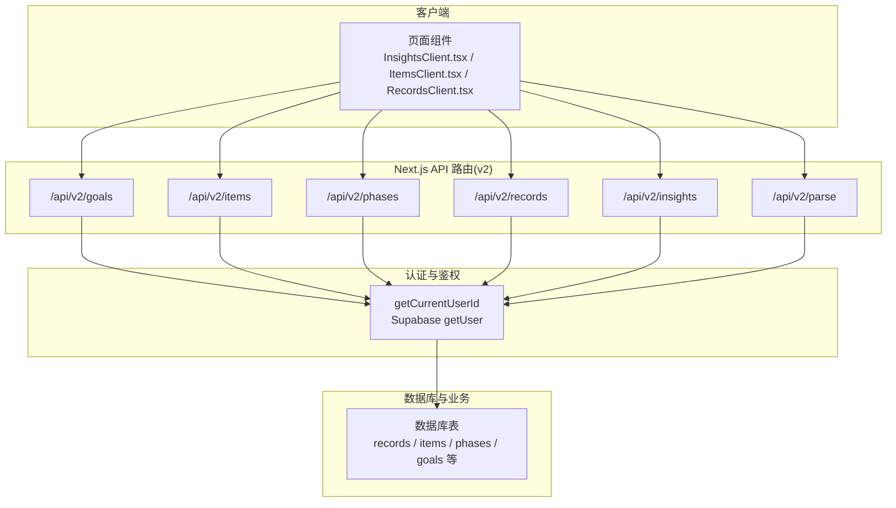
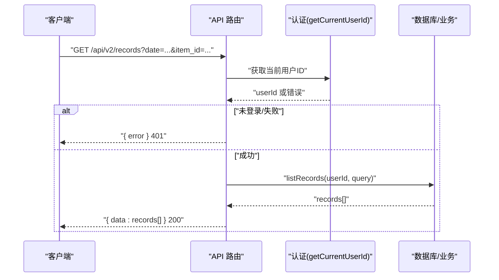
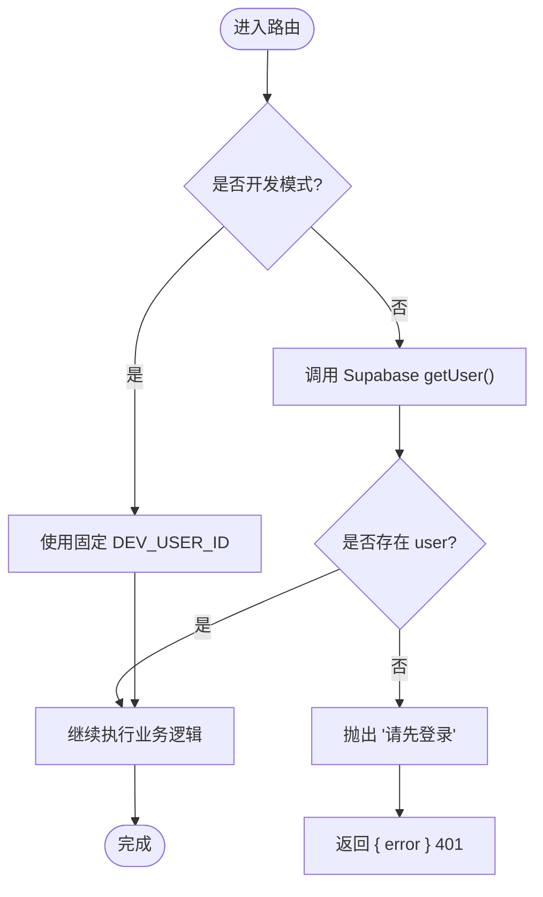
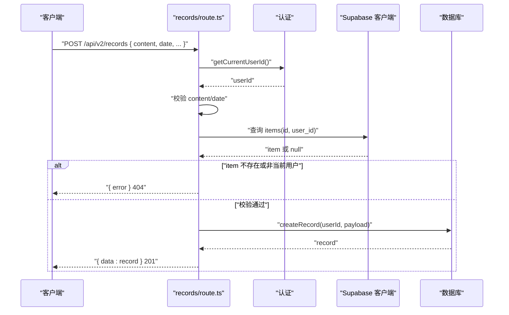
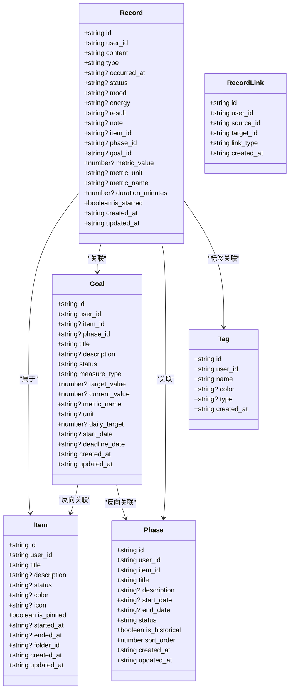
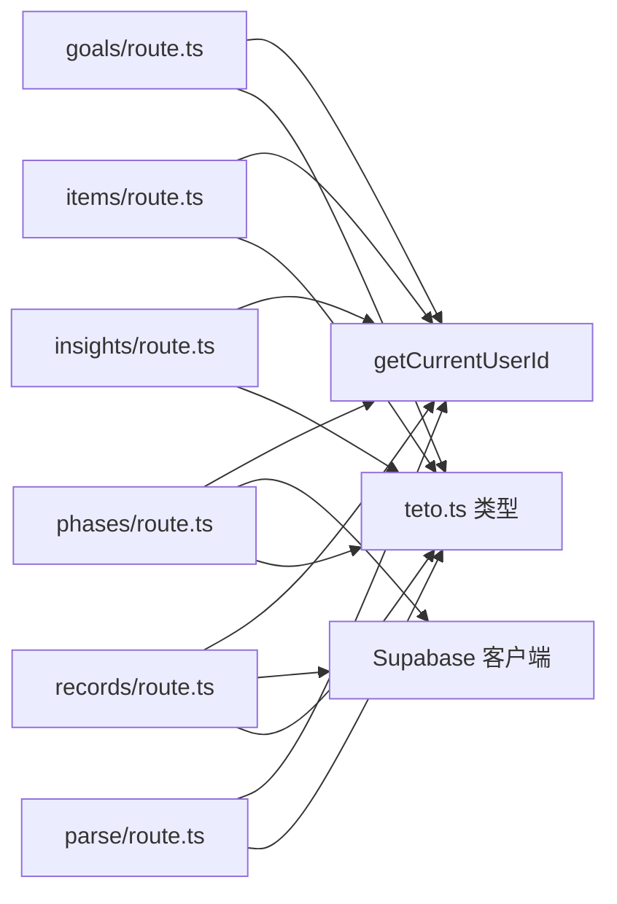

# 数据流设计

<cite>
**本文引用的文件**
- [README.md](file://README.md)
- [DATA_RULES.md](file://DATA_RULES.md)
- [src/app/api/v2/goals/route.ts](file://src/app/api/v2/goals/route.ts)
- [src/app/api/v2/records/route.ts](file://src/app/api/v2/records/route.ts)
- [src/app/api/v2/items/route.ts](file://src/app/api/v2/items/route.ts)
- [src/app/api/v2/phases/route.ts](file://src/app/api/v2/phases/route.ts)
- [src/app/api/v2/insights/route.ts](file://src/app/api/v2/insights/route.ts)
- [src/app/api/v2/parse/route.ts](file://src/app/api/v2/parse/route.ts)
- [src/lib/auth/server/get-current-user-id.ts](file://src/lib/auth/server/get-current-user-id.ts)
- [src/types/teto.ts](file://src/types/teto.ts)
</cite>

## 目录
1. [简介](#简介)
2. [项目结构](#项目结构)
3. [核心组件](#核心组件)
4. [架构总览](#架构总览)
5. [详细组件分析](#详细组件分析)
6. [依赖分析](#依赖分析)
7. [性能考虑](#性能考虑)
8. [故障排查指南](#故障排查指南)
9. [结论](#结论)
10. [附录](#附录)

## 简介
本文件面向 TETO v2 数据流设计，系统性阐述从前端到后端的数据传输机制、API 调用流程、数据序列化处理、状态管理策略、数据缓存机制、实时数据同步、数据验证规则、错误传播机制与异常处理流程，并给出数据转换管道、格式化策略、性能优化方案、异步加载与并发请求处理、数据一致性保障、以及数据流监控与调试方法。

## 项目结构
- 前端采用 Next.js App Router，页面组件位于 src/app 下，v2 API 路由位于 src/app/api/v2。
- 后端 API 层通过 NextRequest/NextResponse 处理请求与响应，统一返回 { data } 或 { error } 结构。
- 认证与鉴权通过 Supabase 客户端获取当前用户，支持开发模式下模拟用户。
- 类型定义集中在 src/types/teto.ts，涵盖实体模型、查询参数、创建/更新载荷、洞察数据结构等。
- 数据规则与统计口径见 DATA_RULES.md，指导前端与后端对数据的预期与处理。

**图表来源**
- [src/app/api/v2/goals/route.ts:1-49](file://src/app/api/v2/goals/route.ts#L1-L49)
- [src/app/api/v2/items/route.ts:1-47](file://src/app/api/v2/items/route.ts#L1-L47)
- [src/app/api/v2/phases/route.ts:1-72](file://src/app/api/v2/phases/route.ts#L1-L72)
- [src/app/api/v2/records/route.ts:1-86](file://src/app/api/v2/records/route.ts#L1-L86)
- [src/app/api/v2/insights/route.ts:1-32](file://src/app/api/v2/insights/route.ts#L1-L32)
- [src/app/api/v2/parse/route.ts:1-43](file://src/app/api/v2/parse/route.ts#L1-L43)
- [src/lib/auth/server/get-current-user-id.ts:1-85](file://src/lib/auth/server/get-current-user-id.ts#L1-L85)

**章节来源**
- [README.md:1-126](file://README.md#L1-L126)

## 核心组件
- API 路由层：各资源的 GET/POST 路由，负责参数解析、权限校验、调用数据库层、统一响应封装。
- 认证与鉴权：通过 getCurrentUserId 获取当前用户 ID，支持开发模式；未登录或获取失败统一返回 401。
- 类型系统：集中定义实体、查询参数、创建/更新载荷、洞察数据结构，确保前后端契约一致。
- 数据规则：明确真源、统计口径、目标值与完成值规则，指导后端聚合与前端展示。

**章节来源**
- [src/app/api/v2/goals/route.ts:1-49](file://src/app/api/v2/goals/route.ts#L1-L49)
- [src/app/api/v2/records/route.ts:1-86](file://src/app/api/v2/records/route.ts#L1-L86)
- [src/app/api/v2/items/route.ts:1-47](file://src/app/api/v2/items/route.ts#L1-L47)
- [src/app/api/v2/phases/route.ts:1-72](file://src/app/api/v2/phases/route.ts#L1-L72)
- [src/app/api/v2/insights/route.ts:1-32](file://src/app/api/v2/insights/route.ts#L1-L32)
- [src/app/api/v2/parse/route.ts:1-43](file://src/app/api/v2/parse/route.ts#L1-L43)
- [src/lib/auth/server/get-current-user-id.ts:1-85](file://src/lib/auth/server/get-current-user-id.ts#L1-L85)
- [src/types/teto.ts:1-516](file://src/types/teto.ts#L1-L516)
- [DATA_RULES.md:1-174](file://DATA_RULES.md#L1-L174)

## 架构总览
- 前端页面组件通过 fetch 或同构 API 调用 v2 路由。
- 路由层执行：
  - 读取 URL 查询参数或请求体 JSON。
  - 调用 getCurrentUserId 进行鉴权。
  - 对关键字段进行业务校验（如必填、归属校验）。
  - 调用数据库层函数执行查询或写入。
  - 统一返回 { data } 或 { error }，状态码遵循 REST 语义。
- 认证模块支持开发模式，便于本地调试。

**图表来源**
- [src/app/api/v2/records/route.ts:7-42](file://src/app/api/v2/records/route.ts#L7-L42)
- [src/lib/auth/server/get-current-user-id.ts:12-37](file://src/lib/auth/server/get-current-user-id.ts#L12-L37)

## 详细组件分析

### 认证与鉴权组件
- 功能要点：
  - 开发模式下强制使用固定用户 ID，便于本地联调。
  - 正式环境通过 Supabase getUser 获取用户，若无用户则抛出“请先登录”，若获取失败抛出“获取用户信息失败”。
  - 统一错误消息用于上层路由捕获并返回 401。
- 错误传播：
  - “请先登录”/“获取用户信息失败” -> 401
  - 其他错误 -> 500

**图表来源**
- [src/lib/auth/server/get-current-user-id.ts:12-37](file://src/lib/auth/server/get-current-user-id.ts#L12-L37)

**章节来源**
- [src/lib/auth/server/get-current-user-id.ts:1-85](file://src/lib/auth/server/get-current-user-id.ts#L1-L85)

### 记录 API（/api/v2/records）
- 查询参数：
  - date/date_from/date_to、item_id、type、tag_id、is_starred、search、limit。
- 业务校验：
  - POST 创建时校验 content 与 date 必填。
  - 若传入 item_id，需校验其归属（user_id）与存在性。
- 响应：
  - 成功返回 { data: record }，失败返回 { error }，状态码 400/401/404/500。

**图表来源**
- [src/app/api/v2/records/route.ts:44-86](file://src/app/api/v2/records/route.ts#L44-L86)
- [src/lib/auth/server/get-current-user-id.ts:12-37](file://src/lib/auth/server/get-current-user-id.ts#L12-L37)

**章节来源**
- [src/app/api/v2/records/route.ts:1-86](file://src/app/api/v2/records/route.ts#L1-L86)

### 事项 API（/api/v2/items）
- 查询参数：status、is_pinned。
- 业务校验：POST 创建时校验 title 必填。
- 响应：统一 { data }/{ error }，状态码 400/401/500。

**章节来源**
- [src/app/api/v2/items/route.ts:1-47](file://src/app/api/v2/items/route.ts#L1-L47)

### 目标 API（/api/v2/goals）
- 查询参数：status、item_id、phase_id。
- 业务校验：POST 创建时校验 title 必填。
- 响应：统一 { data }/{ error }，状态码 400/401/500。

**章节来源**
- [src/app/api/v2/goals/route.ts:1-49](file://src/app/api/v2/goals/route.ts#L1-L49)

### 阶段 API（/api/v2/phases）
- 查询参数：item_id、status、is_historical。
- 业务校验：POST 创建时校验 item_id 与 title 必填，并校验 item 归属。
- 响应：统一 { data }/{ error }，状态码 400/401/404/500。

**章节来源**
- [src/app/api/v2/phases/route.ts:1-72](file://src/app/api/v2/phases/route.ts#L1-L72)

### 洞察 API（/api/v2/insights）
- 查询参数：date_from、date_to。
- 业务校验：必填参数校验。
- 响应：统一 { data }/{ error }，状态码 400/401/500。

**章节来源**
- [src/app/api/v2/insights/route.ts:1-32](file://src/app/api/v2/insights/route.ts#L1-L32)

### 语义解析 API（/api/v2/parse）
- 请求体：{ input, date?, recent_records?, items? }。
- 业务校验：input 必填且非空。
- 错误传播：
  - “请先登录”/“获取用户信息失败” -> 401
  - DeepSeek API 错误 -> 502
  - 其他错误 -> 500

**章节来源**
- [src/app/api/v2/parse/route.ts:1-43](file://src/app/api/v2/parse/route.ts#L1-L43)

### 类型系统与数据契约
- 实体与枚举：Record、Item、Tag、RecordLink、Goal、Phase 等。
- 查询参数：RecordsQuery、ItemsQuery、GoalsQuery、PhasesQuery、InsightsQuery。
- 创建/更新载荷：CreateRecordPayload、UpdateRecordPayload、CreateItemPayload、UpdateItemPayload、CreateGoalPayload、UpdateGoalPayload、CreatePhasePayload、UpdatePhasePayload。
- 响应结构：ApiResponse<T>、ApiListResponse<T[]>、ApiError。
- 洞察数据结构：InsightsData。
- 量化目标引擎输出：GoalEngineResult、PhaseAggregation、ItemAggregation。

**图表来源**
- [src/types/teto.ts:37-121](file://src/types/teto.ts#L37-L121)
- [src/types/teto.ts:316-354](file://src/types/teto.ts#L316-L354)
- [src/types/teto.ts:96-111](file://src/types/teto.ts#L96-L111)

**章节来源**
- [src/types/teto.ts:1-516](file://src/types/teto.ts#L1-L516)

## 依赖分析
- 路由层依赖认证模块以获取 userId，再调用数据库层函数。
- 记录与阶段路由在创建时对 item_id 进行归属校验，避免越权访问。
- 类型系统集中定义了前后端契约，降低耦合与沟通成本。
- API 统一返回结构与状态码，便于前端统一处理。

**图表来源**
- [src/app/api/v2/goals/route.ts:1-49](file://src/app/api/v2/goals/route.ts#L1-L49)
- [src/app/api/v2/items/route.ts:1-47](file://src/app/api/v2/items/route.ts#L1-L47)
- [src/app/api/v2/phases/route.ts:1-72](file://src/app/api/v2/phases/route.ts#L1-L72)
- [src/app/api/v2/records/route.ts:1-86](file://src/app/api/v2/records/route.ts#L1-L86)
- [src/app/api/v2/insights/route.ts:1-32](file://src/app/api/v2/insights/route.ts#L1-L32)
- [src/app/api/v2/parse/route.ts:1-43](file://src/app/api/v2/parse/route.ts#L1-L43)
- [src/lib/auth/server/get-current-user-id.ts:1-85](file://src/lib/auth/server/get-current-user-id.ts#L1-L85)
- [src/types/teto.ts:1-516](file://src/types/teto.ts#L1-L516)

**章节来源**
- [src/app/api/v2/records/route.ts:57-74](file://src/app/api/v2/records/route.ts#L57-L74)
- [src/app/api/v2/phases/route.ts:45-60](file://src/app/api/v2/phases/route.ts#L45-L60)
- [src/lib/auth/server/get-current-user-id.ts:1-85](file://src/lib/auth/server/get-current-user-id.ts#L1-L85)
- [src/types/teto.ts:1-516](file://src/types/teto.ts#L1-L516)

## 性能考虑
- 请求合并与批量查询：在前端对高频查询进行去抖/节流与合并，减少重复请求。
- 分页与限制：利用 limit 参数控制单次返回量，避免一次性拉取过多数据。
- 缓存策略：
  - 前端缓存：对只读数据（如历史记录、洞察）设置短期缓存，结合 ETag/Last-Modified。
  - 服务端缓存：对热点聚合结果（如最近 N 天统计）进行短期缓存，降低数据库压力。
- 并发控制：对高并发场景限制同时请求数，避免数据库峰值抖动。
- 数据压缩：对大文本字段（如 content、note）在传输前进行必要压缩或延迟加载。
- 网络优化：启用 HTTP/2 多路复用，合理使用 Connection Keep-Alive。

## 故障排查指南
- 认证失败：
  - 现象：返回 401，错误信息为“请先登录”或“获取用户信息失败”。
  - 排查：确认 Supabase Cookie 是否携带、开发模式环境变量是否正确、用户是否已登录。
- 参数缺失：
  - 现象：返回 400，错误信息包含“为必填字段”。
  - 排查：核对请求体/查询参数是否满足必填条件（如 content、date、title、item_id、title 等）。
- 资源归属校验失败：
  - 现象：返回 404，错误信息为“事项不存在或不属于当前用户”。
  - 排查：确认 item_id 是否存在、是否属于当前用户。
- 洞察参数缺失：
  - 现象：返回 400，错误信息为“date_from 和 date_to 为必填参数”。
  - 排查：确认查询参数是否包含 date_from 与 date_to。
- 语义解析错误：
  - 现象：返回 502（DeepSeek API 错误）或 500（其他错误）。
  - 排查：检查 input 是否为空、网络连通性、第三方服务可用性。

**章节来源**
- [src/app/api/v2/records/route.ts:49-55](file://src/app/api/v2/records/route.ts#L49-L55)
- [src/app/api/v2/records/route.ts:71-73](file://src/app/api/v2/records/route.ts#L71-L73)
- [src/app/api/v2/phases/route.ts:38-43](file://src/app/api/v2/phases/route.ts#L38-L43)
- [src/app/api/v2/phases/route.ts:58-60](file://src/app/api/v2/phases/route.ts#L58-L60)
- [src/app/api/v2/insights/route.ts:14-19](file://src/app/api/v2/insights/route.ts#L14-L19)
- [src/app/api/v2/parse/route.ts:36-40](file://src/app/api/v2/parse/route.ts#L36-L40)
- [src/lib/auth/server/get-current-user-id.ts:21-32](file://src/lib/auth/server/get-current-user-id.ts#L21-L32)

## 结论
TETO v2 数据流以清晰的 API 路由层、严格的认证与参数校验、统一的响应结构为核心，配合完善的类型系统与数据规则，实现了从前端到后端的稳定数据传输与处理。通过合理的缓存与并发控制策略，可在保证数据一致性的同时提升整体性能。建议在后续版本中引入本地缓存与多端同步机制，进一步完善离线体验与冲突处理。

## 附录
- 数据规则与统计口径参考：DATA_RULES.md
- 技术栈与环境变量说明：README.md

**章节来源**
- [DATA_RULES.md:1-174](file://DATA_RULES.md#L1-L174)
- [README.md:1-126](file://README.md#L1-L126)