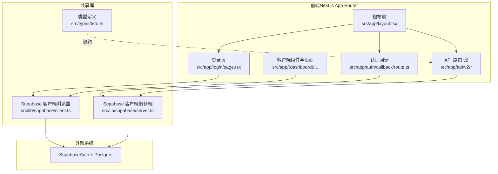
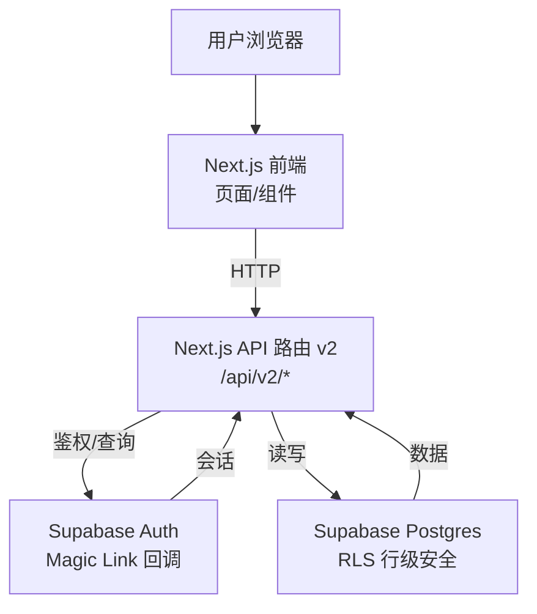
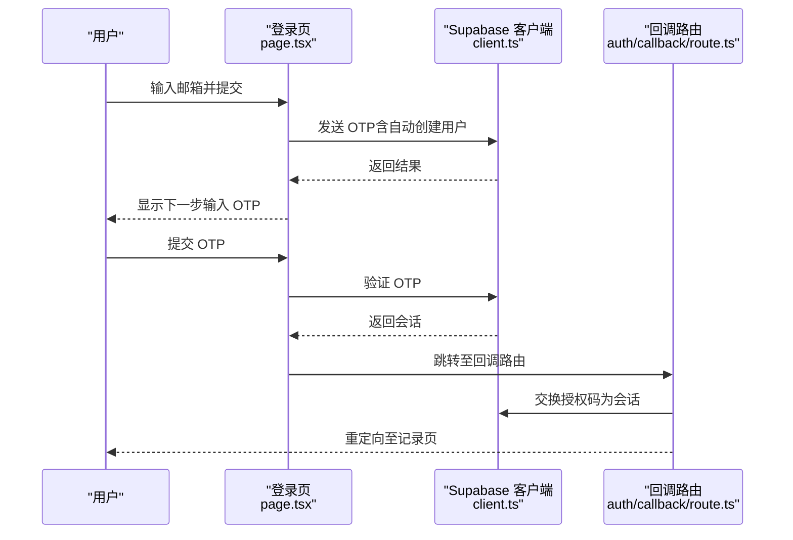
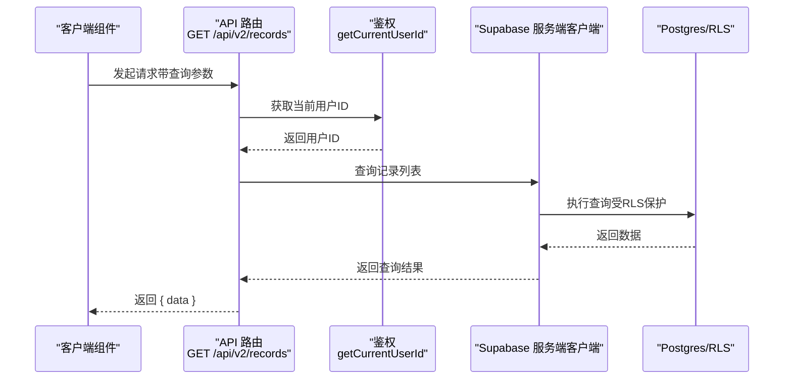
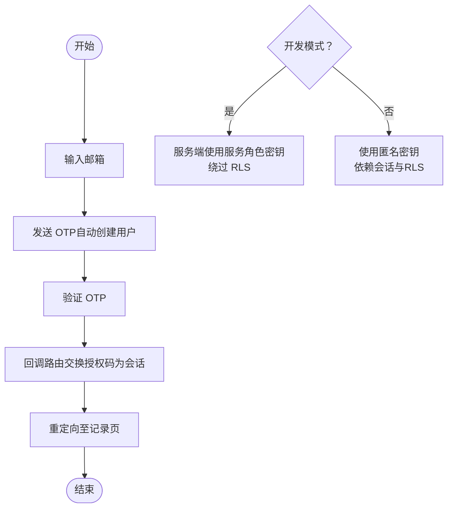
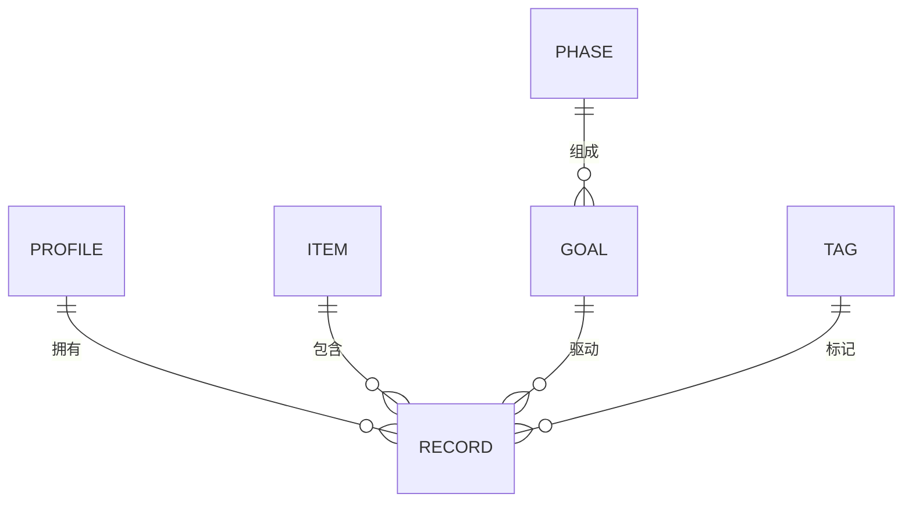
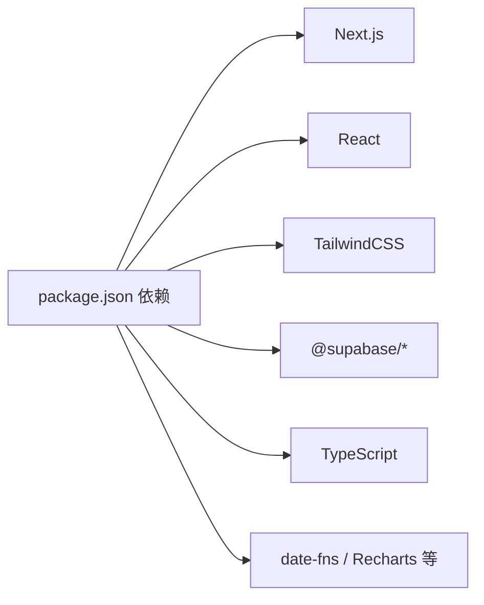

# 系统架构

<cite>
**本文引用的文件**
- [README.md](file://README.md)
- [package.json](file://package.json)
- [next.config.js](file://next.config.js)
- [src/app/layout.tsx](file://src/app/layout.tsx)
- [src/app/auth/callback/route.ts](file://src/app/auth/callback/route.ts)
- [src/app/login/page.tsx](file://src/app/login/page.tsx)
- [src/lib/supabase/client.ts](file://src/lib/supabase/client.ts)
- [src/lib/supabase/server.ts](file://src/lib/supabase/server.ts)
- [src/app/api/v2/goals/route.ts](file://src/app/api/v2/goals/route.ts)
- [src/app/api/v2/records/route.ts](file://src/app/api/v2/records/route.ts)
- [src/types/teto.ts](file://src/types/teto.ts)
</cite>

## 目录
1. [引言](#引言)
2. [项目结构](#项目结构)
3. [核心组件](#核心组件)
4. [架构总览](#架构总览)
5. [详细组件分析](#详细组件分析)
6. [依赖分析](#依赖分析)
7. [性能考虑](#性能考虑)
8. [故障排查指南](#故障排查指南)
9. [结论](#结论)
10. [附录](#附录)

## 引言
本文件为 TETO 系统的架构文档，面向开发者与运维人员，系统性阐述前端（Next.js App Router、React 组件体系）、后端（API 层、数据库层）、认证架构（Supabase Auth 集成）的整体设计与实现要点。文档覆盖数据流、组件交互、API 设计原则、系统边界、外部依赖、安全与合规、可扩展性与性能、部署拓扑以及跨领域关注点（安全、监控、灾备）。

## 项目结构
TETO 采用 Next.js 16 App Router 应用结构，前端页面与 API 路由分层清晰；认证与数据库访问通过 Supabase SDK 实现；类型定义集中于 types 目录，便于前后端契约一致。

**图示来源**
- [src/app/layout.tsx:1-13](file://src/app/layout.tsx#L1-L13)
- [src/app/login/page.tsx:1-86](file://src/app/login/page.tsx#L1-L86)
- [src/app/auth/callback/route.ts:1-19](file://src/app/auth/callback/route.ts#L1-L19)
- [src/app/api/v2/goals/route.ts:1-49](file://src/app/api/v2/goals/route.ts#L1-L49)
- [src/app/api/v2/records/route.ts:1-86](file://src/app/api/v2/records/route.ts#L1-L86)
- [src/lib/supabase/client.ts:1-9](file://src/lib/supabase/client.ts#L1-L9)
- [src/lib/supabase/server.ts:1-35](file://src/lib/supabase/server.ts#L1-L35)
- [src/types/teto.ts](file://src/types/teto.ts)

**章节来源**
- [README.md:1-126](file://README.md#L1-L126)
- [package.json:1-44](file://package.json#L1-L44)
- [next.config.js:1-4](file://next.config.js#L1-L4)

## 核心组件
- 前端框架与样式
  - Next.js 16 App Router 提供页面路由、布局与数据获取能力；Tailwind CSS 提供原子化样式工具。
- 认证与会话
  - 使用 Supabase Auth 的 Magic Link（OTP）登录流程，回调路由完成授权码换会话。
- 数据访问层
  - 通过 Supabase JS SDK（浏览器侧）与 SSR 客户端（服务端侧）访问数据库，结合行级安全策略（RLS）保障数据隔离。
- API 层
  - App Router API 路由统一处理业务请求，进行鉴权、参数校验、调用数据库操作并返回标准化响应。
- 类型系统
  - 通过 TypeScript 类型定义约束请求/响应契约，减少前后端不一致风险。

**章节来源**
- [README.md:13-21](file://README.md#L13-L21)
- [package.json:15-32](file://package.json#L15-L32)
- [src/app/auth/callback/route.ts:1-19](file://src/app/auth/callback/route.ts#L1-L19)
- [src/app/login/page.tsx:1-86](file://src/app/login/page.tsx#L1-L86)
- [src/lib/supabase/client.ts:1-9](file://src/lib/supabase/client.ts#L1-L9)
- [src/lib/supabase/server.ts:1-35](file://src/lib/supabase/server.ts#L1-L35)
- [src/app/api/v2/goals/route.ts:1-49](file://src/app/api/v2/goals/route.ts#L1-L49)
- [src/app/api/v2/records/route.ts:1-86](file://src/app/api/v2/records/route.ts#L1-L86)
- [src/types/teto.ts](file://src/types/teto.ts)

## 架构总览
TETO 采用“前端 SPA + 服务端 API 路由 + Supabase 后端”的三层架构。前端负责 UI 与交互，API 路由负责鉴权与业务编排，Supabase 提供认证、数据库与边缘函数等能力。开发模式下可绕过 RLS 以提升调试效率，生产模式严格依赖会话与 RLS。

**图示来源**
- [src/app/login/page.tsx:1-86](file://src/app/login/page.tsx#L1-L86)
- [src/app/auth/callback/route.ts:1-19](file://src/app/auth/callback/route.ts#L1-L19)
- [src/lib/supabase/server.ts:1-35](file://src/lib/supabase/server.ts#L1-L35)
- [src/app/api/v2/records/route.ts:1-86](file://src/app/api/v2/records/route.ts#L1-L86)

## 详细组件分析

### 前端架构（Next.js App Router 与 React 组件体系）
- 根布局与全局样式
  - 根布局负责注入全局样式与语言属性，作为所有页面的容器。
- 登录流程（Magic Link）
  - 登录页通过浏览器端 Supabase 客户端发送 OTP，并在验证成功后重定向至记录页。
- 页面与组件
  - dashboard 下的 records/items/insights 等页面采用客户端组件与服务端 API 路由协同，组件按功能模块拆分，职责清晰。

**图示来源**
- [src/app/login/page.tsx:1-86](file://src/app/login/page.tsx#L1-L86)
- [src/lib/supabase/client.ts:1-9](file://src/lib/supabase/client.ts#L1-L9)
- [src/app/auth/callback/route.ts:1-19](file://src/app/auth/callback/route.ts#L1-L19)

**章节来源**
- [src/app/layout.tsx:1-13](file://src/app/layout.tsx#L1-L13)
- [src/app/login/page.tsx:1-86](file://src/app/login/page.tsx#L1-L86)
- [src/lib/supabase/client.ts:1-9](file://src/lib/supabase/client.ts#L1-L9)
- [src/app/auth/callback/route.ts:1-19](file://src/app/auth/callback/route.ts#L1-L19)

### 后端架构（API 层设计与数据库层）
- API 设计原则
  - 统一鉴权：所有 API 路由在处理前调用鉴权函数获取当前用户 ID。
  - 参数校验：对必填字段进行校验，非法请求返回 400。
  - 错误分级：区分未登录（401）与服务器错误（500），保证前端可感知的错误语义。
  - 结果标准化：统一返回 { data } 或 { error } 结构，便于前端消费。
- 数据库访问
  - 浏览器端：用于轻量交互与查询。
  - 服务端：用于需要更高权限或绕过 RLS 的场景（开发模式）。
  - RLS：生产环境启用行级安全策略，确保用户仅能访问自身数据。

**图示来源**
- [src/app/api/v2/records/route.ts:1-86](file://src/app/api/v2/records/route.ts#L1-L86)
- [src/lib/supabase/server.ts:1-35](file://src/lib/supabase/server.ts#L1-L35)

**章节来源**
- [src/app/api/v2/goals/route.ts:1-49](file://src/app/api/v2/goals/route.ts#L1-L49)
- [src/app/api/v2/records/route.ts:1-86](file://src/app/api/v2/records/route.ts#L1-L86)
- [src/lib/supabase/server.ts:1-35](file://src/lib/supabase/server.ts#L1-L35)
- [README.md:83-90](file://README.md#L83-L90)

### 认证架构（Supabase Auth 集成）
- 登录方式
  - 使用 Magic Link（邮箱 + OTP），支持自动创建用户。
- 回调与会话
  - 回调路由接收授权码并换取会话，随后重定向至记录页。
- 开发模式
  - 通过环境变量开启开发模式，服务端客户端使用服务角色密钥，绕过 RLS，便于本地联调。

**图示来源**
- [src/app/login/page.tsx:1-86](file://src/app/login/page.tsx#L1-L86)
- [src/app/auth/callback/route.ts:1-19](file://src/app/auth/callback/route.ts#L1-L19)
- [src/lib/supabase/server.ts:1-35](file://src/lib/supabase/server.ts#L1-L35)

**章节来源**
- [src/app/login/page.tsx:1-86](file://src/app/login/page.tsx#L1-L86)
- [src/app/auth/callback/route.ts:1-19](file://src/app/auth/callback/route.ts#L1-L19)
- [src/lib/supabase/server.ts:1-35](file://src/lib/supabase/server.ts#L1-L35)
- [README.md:75-80](file://README.md#L75-L80)

### 数据模型与 API 契约（类型系统）
- 类型定义
  - 通过类型文件约束请求/响应结构，例如目标（Goals）与记录（Records）的查询与创建载荷。
- API 与类型耦合
  - API 路由显式声明请求体与查询参数类型，确保前后端契约一致。

**图示来源**
- [src/types/teto.ts](file://src/types/teto.ts)

**章节来源**
- [src/types/teto.ts](file://src/types/teto.ts)

## 依赖分析
- 前端依赖
  - Next.js、React、Tailwind CSS、Recharts、date-fns 等，支撑页面渲染、UI 与图表展示。
- Supabase 依赖
  - @supabase/ssr、@supabase/supabase-js 提供浏览器与服务端客户端能力。
- 工具链
  - TypeScript、TailwindCSS、PostCSS 等，保障类型安全与样式工程化。

**图示来源**
- [package.json:15-32](file://package.json#L15-L32)

**章节来源**
- [package.json:1-44](file://package.json#L1-L44)

## 性能考虑
- 前端性能
  - App Router 支持并发数据加载与缓存策略，建议在客户端组件中合理使用 Suspense 与缓存。
- API 性能
  - 对高频查询增加索引与分页参数（如 limit），避免一次性返回大量数据。
- 数据库性能
  - 合理使用 RLS 与查询过滤条件，避免全表扫描；必要时在 Supabase 控制台配置索引。
- 缓存策略
  - 对只读数据（如静态枚举、标签）可在客户端缓存，减少重复请求。

## 故障排查指南
- 登录失败
  - 检查 Supabase URL 与密钥配置是否正确；确认回调路由可达且未被防火墙拦截。
- 未登录或 401
  - 确认浏览器已正确设置会话 Cookie；检查回调路由是否成功交换授权码。
- 开发模式异常
  - 确认开发模式开关与服务角色密钥配置；注意开发模式下 RLS 被绕过。
- API 返回 500
  - 查看服务端日志定位具体错误；优先检查数据库连接与 RLS 策略。

**章节来源**
- [src/app/login/page.tsx:1-86](file://src/app/login/page.tsx#L1-L86)
- [src/app/auth/callback/route.ts:1-19](file://src/app/auth/callback/route.ts#L1-L19)
- [src/lib/supabase/server.ts:1-35](file://src/lib/supabase/server.ts#L1-L35)
- [src/app/api/v2/records/route.ts:1-86](file://src/app/api/v2/records/route.ts#L1-L86)

## 结论
TETO 以 Next.js App Router 为核心，结合 Supabase 的认证与数据库能力，构建了简洁、可演进的全栈架构。通过明确的 API 设计原则、严格的鉴权与 RLS 策略、清晰的类型契约，系统在易用性与安全性之间取得平衡。未来可在可观测性、缓存与异步任务方面进一步增强，以支撑更复杂的业务场景。

## 附录
- 部署拓扑
  - 前端部署于 Vercel，后端逻辑由 Next.js API 路由承载，数据库与认证由 Supabase 提供。
- 安全与合规
  - 使用 RLS 与会话控制访问；生产环境禁用开发模式；敏感信息通过环境变量管理。
- 监控与灾备
  - 建议接入 Supabase 监控与日志；对关键 API 添加超时与重试；定期备份数据库。

**章节来源**
- [README.md:92-126](file://README.md#L92-L126)