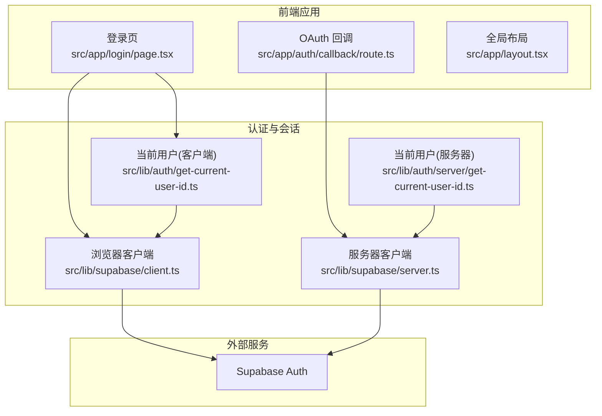
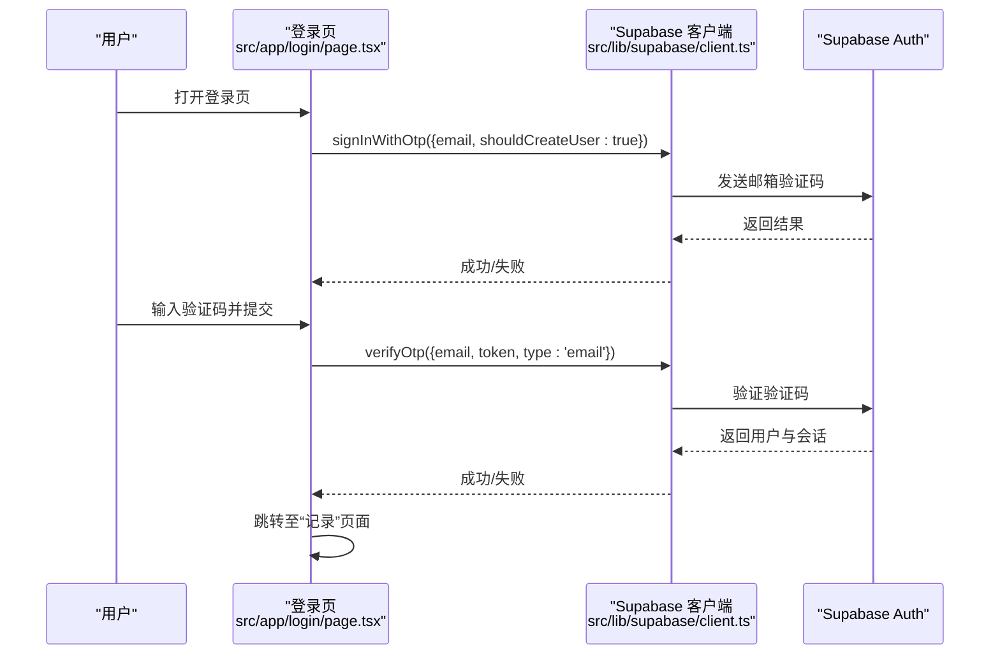
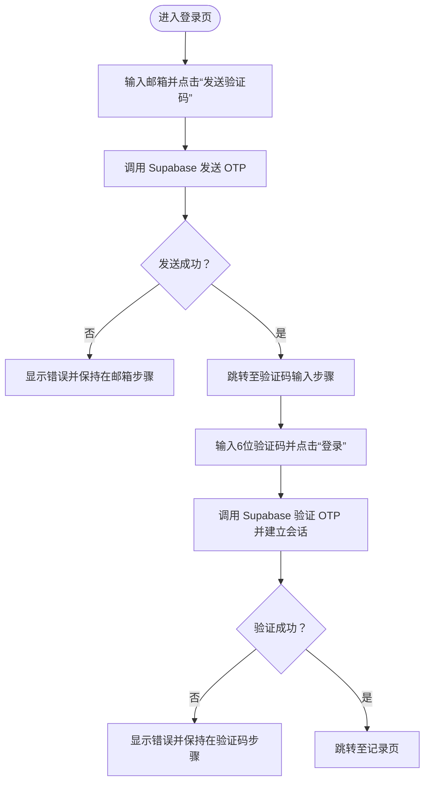
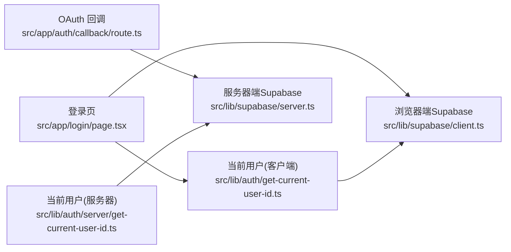

# 认证架构

<cite>
**本文引用的文件**
- [src/lib/supabase/client.ts](file://src/lib/supabase/client.ts)
- [src/lib/supabase/server.ts](file://src/lib/supabase/server.ts)
- [src/app/auth/callback/route.ts](file://src/app/auth/callback/route.ts)
- [src/app/login/page.tsx](file://src/app/login/page.tsx)
- [src/lib/auth/get-current-user-id.ts](file://src/lib/auth/get-current-user-id.ts)
- [src/lib/auth/server/get-current-user-id.ts](file://src/lib/auth/server/get-current-user-id.ts)
- [src/app/layout.tsx](file://src/app/layout.tsx)
- [next.config.js](file://next.config.js)
- [package.json](file://package.json)
</cite>

## 目录
1. [引言](#引言)
2. [项目结构](#项目结构)
3. [核心组件](#核心组件)
4. [架构总览](#架构总览)
5. [详细组件分析](#详细组件分析)
6. [依赖关系分析](#依赖关系分析)
7. [性能考虑](#性能考虑)
8. [故障排除指南](#故障排除指南)
9. [结论](#结论)
10. [附录](#附录)

## 引言
本文件面向TETO认证架构，基于仓库现有实现进行系统化梳理与说明。当前系统采用Supabase Auth作为认证与会话管理的核心，结合Next.js App Router的路由与服务器客户端库，实现了基于邮箱的一次性验证码（OTP）登录流程，并通过开发模式与生产模式的差异化配置实现本地调试与线上运行的兼容。

认证能力包括：
- Supabase Auth集成与会话管理
- OAuth回调处理（用于外部OAuth场景）
- 邮箱OTP登录流程（含注册与自动创建用户）
- 会话获取与当前用户识别
- 开发模式下的免登录与测试用户注入
- 基于环境变量的安全配置要点

尚未在仓库中发现以下功能的实现：密码重置、账户激活策略、JWT令牌处理细节、权限验证与角色管理、CSRF/XSS防护、多因素认证（MFA）、账户锁定与活动监控、认证中间件与路由保护策略等。后续可在现有Supabase Auth基础上扩展实现。

## 项目结构
围绕认证的关键目录与文件如下：
- 客户端Supabase客户端封装：src/lib/supabase/client.ts
- 服务器端Supabase客户端封装：src/lib/supabase/server.ts
- OAuth回调处理：src/app/auth/callback/route.ts
- 登录页（邮箱OTP）：src/app/login/page.tsx
- 当前用户工具（客户端/服务器）：src/lib/auth/get-current-user-id.ts、src/lib/auth/server/get-current-user-id.ts
- 全局布局：src/app/layout.tsx
- Next.js配置：next.config.js
- 依赖声明：package.json

图表来源
- [src/app/login/page.tsx:1-196](file://src/app/login/page.tsx#L1-L196)
- [src/app/auth/callback/route.ts:1-19](file://src/app/auth/callback/route.ts#L1-L19)
- [src/lib/supabase/client.ts:1-9](file://src/lib/supabase/client.ts#L1-L9)
- [src/lib/supabase/server.ts:1-36](file://src/lib/supabase/server.ts#L1-L36)
- [src/lib/auth/get-current-user-id.ts:1-88](file://src/lib/auth/get-current-user-id.ts#L1-L88)
- [src/lib/auth/server/get-current-user-id.ts:1-85](file://src/lib/auth/server/get-current-user-id.ts#L1-L85)

章节来源
- [src/app/login/page.tsx:1-196](file://src/app/login/page.tsx#L1-L196)
- [src/app/auth/callback/route.ts:1-19](file://src/app/auth/callback/route.ts#L1-L19)
- [src/lib/supabase/client.ts:1-9](file://src/lib/supabase/client.ts#L1-L9)
- [src/lib/supabase/server.ts:1-36](file://src/lib/supabase/server.ts#L1-L36)
- [src/lib/auth/get-current-user-id.ts:1-88](file://src/lib/auth/get-current-user-id.ts#L1-L88)
- [src/lib/auth/server/get-current-user-id.ts:1-85](file://src/lib/auth/server/get-current-user-id.ts#L1-L85)
- [src/app/layout.tsx:1-13](file://src/app/layout.tsx#L1-L13)
- [next.config.js:1-4](file://next.config.js#L1-L4)
- [package.json:1-44](file://package.json#L1-L44)

## 核心组件
- 浏览器端Supabase客户端：封装NEXT_PUBLIC_SUPABASE_URL与NEXT_PUBLIC_SUPABASE_ANON_KEY，供前端调用认证API。
- 服务器端Supabase客户端：封装cookies读写与密钥选择逻辑（开发模式使用服务角色密钥），供服务端路由与SSR使用。
- OAuth回调路由：接收并处理来自Supabase的授权码，换取会话并重定向。
- 登录页（邮箱OTP）：实现邮箱发送验证码与验证码校验，自动创建用户并建立会话。
- 当前用户工具：提供客户端与服务器端获取当前用户ID与用户信息的能力；开发模式下返回测试用户。
- 全局布局：承载页面主体，认证状态由各组件通过Supabase客户端判断。

章节来源
- [src/lib/supabase/client.ts:1-9](file://src/lib/supabase/client.ts#L1-L9)
- [src/lib/supabase/server.ts:1-36](file://src/lib/supabase/server.ts#L1-L36)
- [src/app/auth/callback/route.ts:1-19](file://src/app/auth/callback/route.ts#L1-L19)
- [src/app/login/page.tsx:1-196](file://src/app/login/page.tsx#L1-L196)
- [src/lib/auth/get-current-user-id.ts:1-88](file://src/lib/auth/get-current-user-id.ts#L1-L88)
- [src/lib/auth/server/get-current-user-id.ts:1-85](file://src/lib/auth/server/get-current-user-id.ts#L1-L85)
- [src/app/layout.tsx:1-13](file://src/app/layout.tsx#L1-L13)

## 架构总览
下图展示从用户访问到会话建立与页面渲染的整体流程，以及与Supabase的交互点。

图表来源
- [src/app/login/page.tsx:17-86](file://src/app/login/page.tsx#L17-L86)
- [src/lib/supabase/client.ts:1-9](file://src/lib/supabase/client.ts#L1-L9)

章节来源
- [src/app/login/page.tsx:1-196](file://src/app/login/page.tsx#L1-L196)
- [src/lib/supabase/client.ts:1-9](file://src/lib/supabase/client.ts#L1-L9)

## 详细组件分析

### 浏览器端Supabase客户端
- 功能：基于NEXT_PUBLIC_SUPABASE_URL与NEXT_PUBLIC_SUPABASE_ANON_KEY创建浏览器可用的Supabase客户端实例。
- 使用场景：登录页、前端组件内调用认证API（如发送/验证OTP、获取会话）。
- 注意事项：仅暴露公共密钥，避免泄露服务端密钥。

章节来源
- [src/lib/supabase/client.ts:1-9](file://src/lib/supabase/client.ts#L1-L9)

### 服务器端Supabase客户端
- 功能：创建带cookies读写的服务器端Supabase客户端；开发模式下使用服务角色密钥以绕过行级安全策略；生产模式使用匿名密钥。
- 使用场景：服务端路由（如OAuth回调）、SSR、需要更高权限的操作。
- 注意事项：cookies接口在错误时静默处理，确保在无cookies上下文时也能工作。

章节来源
- [src/lib/supabase/server.ts:1-36](file://src/lib/supabase/server.ts#L1-L36)

### OAuth回调处理
- 功能：接收来自Supabase的授权码，调用exchangeCodeForSession换取会话；成功则重定向至记录页，否则重定向至登录页并携带错误参数。
- 使用场景：外部OAuth登录后回调处理。
- 注意事项：需确保回调URL已在Supabase项目中正确配置。

章节来源
- [src/app/auth/callback/route.ts:1-19](file://src/app/auth/callback/route.ts#L1-L19)

### 登录页（邮箱OTP）
- 功能：两步式登录流程
  - 第一步：发送OTP（shouldCreateUser=true，自动创建用户）
  - 第二步：验证OTP并建立会话，随后跳转至记录页
- 错误处理：捕获并显示错误消息；加载态控制。
- 开发模式：通过isDevMode切换，不执行真实登录。

图表来源
- [src/app/login/page.tsx:17-86](file://src/app/login/page.tsx#L17-L86)

章节来源
- [src/app/login/page.tsx:1-196](file://src/app/login/page.tsx#L1-L196)

### 当前用户工具（客户端）
- 功能：在开发模式下返回测试用户ID；否则通过getUser获取当前用户，未登录时抛出错误。
- 使用场景：前端组件根据是否登录决定UI与行为。

章节来源
- [src/lib/auth/get-current-user-id.ts:1-88](file://src/lib/auth/get-current-user-id.ts#L1-L88)

### 当前用户工具（服务器端）
- 功能：与客户端版本类似，但适用于服务端上下文（如API路由、SSR）。
- 使用场景：服务端需要识别当前用户或进行受保护的数据操作。

章节来源
- [src/lib/auth/server/get-current-user-id.ts:1-85](file://src/lib/auth/server/get-current-user-id.ts#L1-L85)

### 全局布局
- 功能：承载页面主体内容，认证状态由各组件自行判断。
- 使用场景：作为页面容器，配合路由与客户端工具完成认证感知。

章节来源
- [src/app/layout.tsx:1-13](file://src/app/layout.tsx#L1-L13)

### Next.js配置
- 功能：允许指定开发时的源地址白名单，便于跨设备联调。
- 使用场景：开发环境联调时限制来源。

章节来源
- [next.config.js:1-4](file://next.config.js#L1-L4)

### 依赖声明
- 功能：声明Next.js、React、Supabase相关依赖。
- 使用场景：构建与运行时的依赖解析。

章节来源
- [package.json:1-44](file://package.json#L1-L44)

## 依赖关系分析
- 组件耦合
  - 登录页依赖浏览器端Supabase客户端与当前用户工具（客户端）。
  - OAuth回调依赖服务器端Supabase客户端与cookies上下文。
  - 当前用户工具分别依赖对应端的Supabase客户端。
- 外部依赖
  - @supabase/ssr与@supabase/supabase-js用于浏览器与服务器端的Supabase通信。
  - Next.js App Router用于路由与SSR。
- 潜在风险
  - 服务器端cookies读写异常时可能影响会话同步。
  - 开发模式下服务端使用服务角色密钥，需确保仅在本地开发启用。

图表来源
- [src/app/login/page.tsx:1-196](file://src/app/login/page.tsx#L1-L196)
- [src/app/auth/callback/route.ts:1-19](file://src/app/auth/callback/route.ts#L1-L19)
- [src/lib/supabase/client.ts:1-9](file://src/lib/supabase/client.ts#L1-L9)
- [src/lib/supabase/server.ts:1-36](file://src/lib/supabase/server.ts#L1-L36)
- [src/lib/auth/get-current-user-id.ts:1-88](file://src/lib/auth/get-current-user-id.ts#L1-L88)
- [src/lib/auth/server/get-current-user-id.ts:1-85](file://src/lib/auth/server/get-current-user-id.ts#L1-L85)

章节来源
- [src/app/login/page.tsx:1-196](file://src/app/login/page.tsx#L1-L196)
- [src/app/auth/callback/route.ts:1-19](file://src/app/auth/callback/route.ts#L1-L19)
- [src/lib/supabase/client.ts:1-9](file://src/lib/supabase/client.ts#L1-L9)
- [src/lib/supabase/server.ts:1-36](file://src/lib/supabase/server.ts#L1-L36)
- [src/lib/auth/get-current-user-id.ts:1-88](file://src/lib/auth/get-current-user-id.ts#L1-L88)
- [src/lib/auth/server/get-current-user-id.ts:1-85](file://src/lib/auth/server/get-current-user-id.ts#L1-L85)

## 性能考虑
- 减少不必要的会话查询：在客户端组件中按需调用getSession，避免频繁请求。
- 合理使用开发模式：仅在本地启用开发模式，避免在生产环境暴露服务角色密钥。
- Cookies读写优化：服务器端客户端对cookies写入的异常处理保证了稳定性，但仍建议在部署环境中确保cookies可用性。

## 故障排除指南
- 登录页无法收到验证码
  - 检查邮箱配置与Supabase邮件模板是否正确。
  - 查看浏览器端Supabase客户端初始化参数是否正确。
- 验证码无效或登录失败
  - 确认输入验证码格式与有效期。
  - 检查Supabase返回的错误信息与状态码。
- OAuth回调重定向失败
  - 确认回调URL已在Supabase项目中配置。
  - 检查服务器端Supabase客户端密钥与cookies上下文。
- 开发模式下无法获取当前用户
  - 确认NEXT_PUBLIC_DEV_MODE与NEXT_PUBLIC_DEV_USER_ID配置正确。
  - 检查客户端/服务器端当前用户工具的导入路径与调用方式。

章节来源
- [src/app/login/page.tsx:17-86](file://src/app/login/page.tsx#L17-L86)
- [src/app/auth/callback/route.ts:1-19](file://src/app/auth/callback/route.ts#L1-L19)
- [src/lib/supabase/client.ts:1-9](file://src/lib/supabase/client.ts#L1-L9)
- [src/lib/supabase/server.ts:1-36](file://src/lib/supabase/server.ts#L1-L36)
- [src/lib/auth/get-current-user-id.ts:1-88](file://src/lib/auth/get-current-user-id.ts#L1-L88)
- [src/lib/auth/server/get-current-user-id.ts:1-85](file://src/lib/auth/server/get-current-user-id.ts#L1-L85)

## 结论
当前TETO认证架构以Supabase Auth为核心，结合浏览器与服务器端Supabase客户端，实现了邮箱OTP登录与会话管理，并通过开发模式适配本地调试需求。后续可在现有基础上扩展密码重置、账户激活、JWT处理、权限与角色管理、CSRF/XSS防护、MFA、账户锁定与活动监控、认证中间件与路由保护等高级能力，逐步完善整体安全体系。

## 附录
- 环境变量建议
  - NEXT_PUBLIC_SUPABASE_URL：Supabase项目URL
  - NEXT_PUBLIC_SUPABASE_ANON_KEY：浏览器端匿名密钥
  - SUPABASE_SERVICE_ROLE_KEY：服务器端服务角色密钥（开发模式下使用）
  - NEXT_PUBLIC_DEV_MODE：是否启用开发模式
  - NEXT_PUBLIC_DEV_USER_ID：开发模式下的测试用户ID
- 依赖版本
  - @supabase/ssr、@supabase/supabase-js：用于浏览器与服务器端的Supabase通信
  - next、react：框架与运行时

章节来源
- [package.json:1-44](file://package.json#L1-L44)
- [src/lib/supabase/client.ts:1-9](file://src/lib/supabase/client.ts#L1-L9)
- [src/lib/supabase/server.ts:1-36](file://src/lib/supabase/server.ts#L1-L36)
- [src/lib/auth/get-current-user-id.ts:1-88](file://src/lib/auth/get-current-user-id.ts#L1-L88)
- [src/lib/auth/server/get-current-user-id.ts:1-85](file://src/lib/auth/server/get-current-user-id.ts#L1-L85)