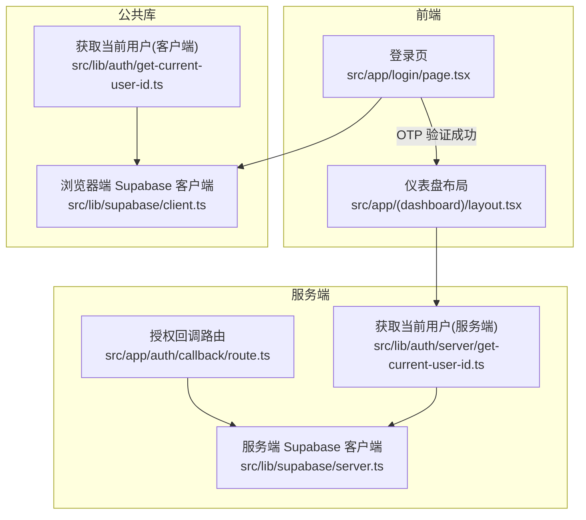
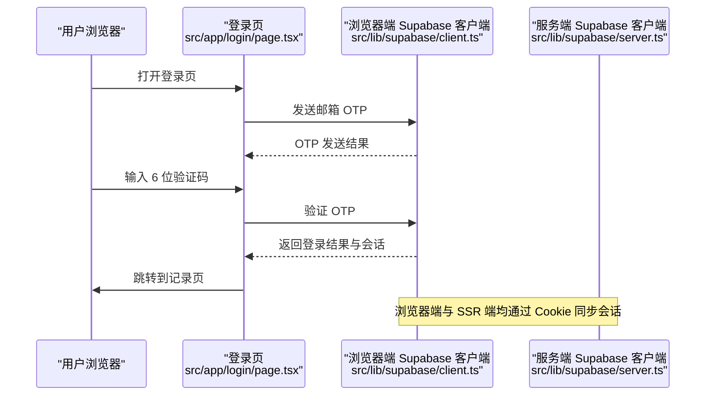
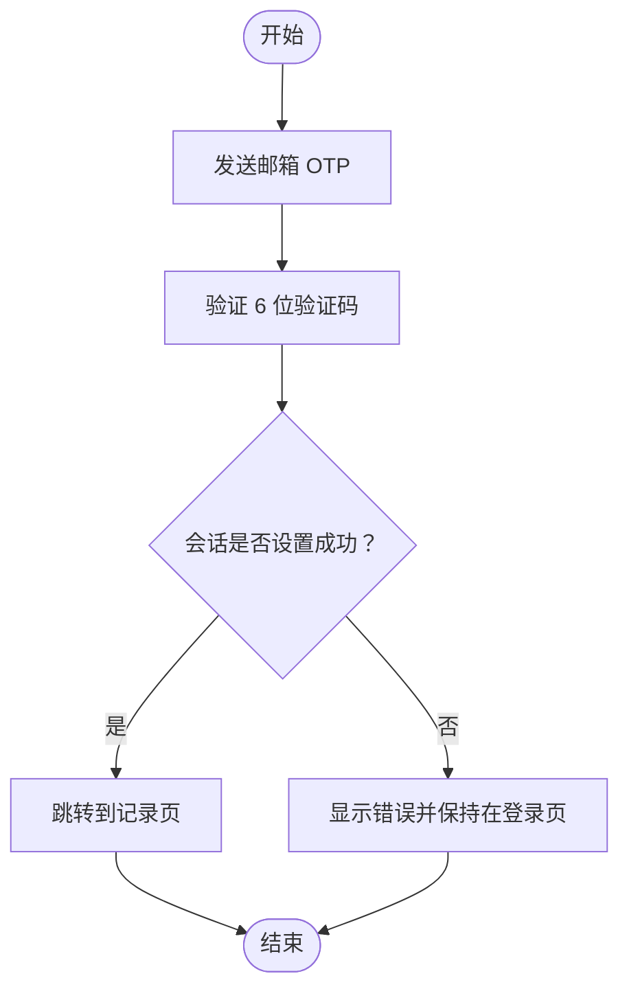
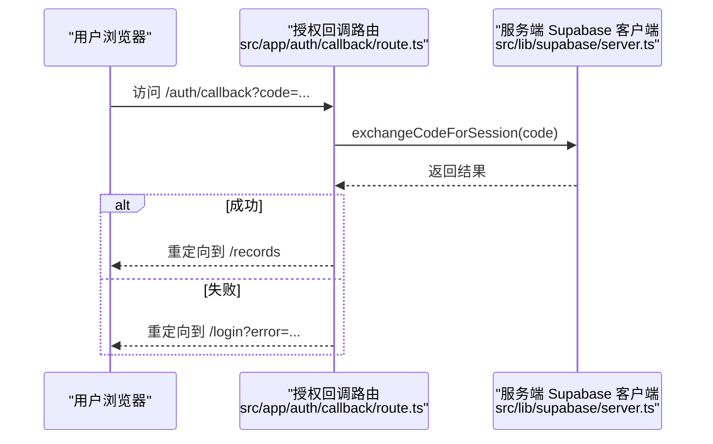
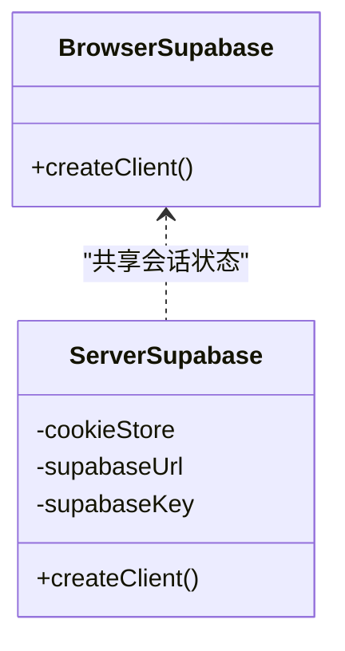
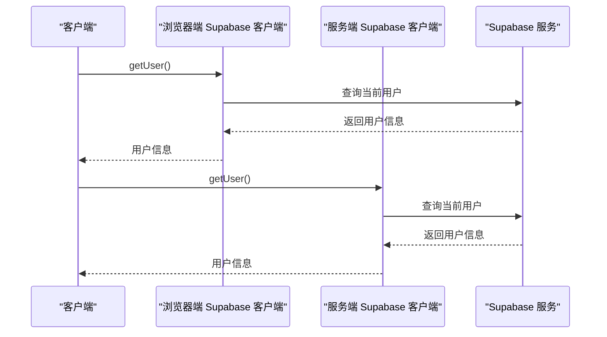
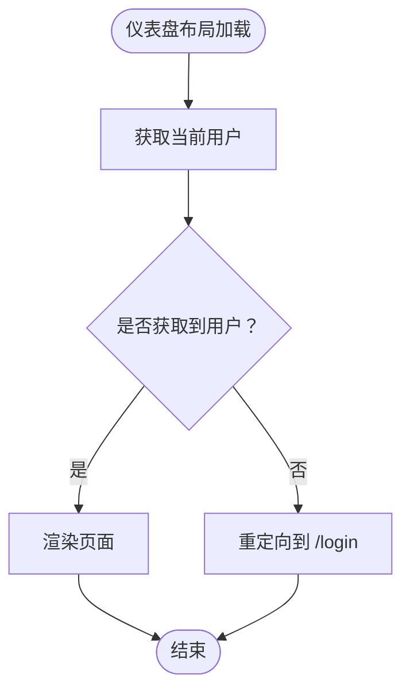
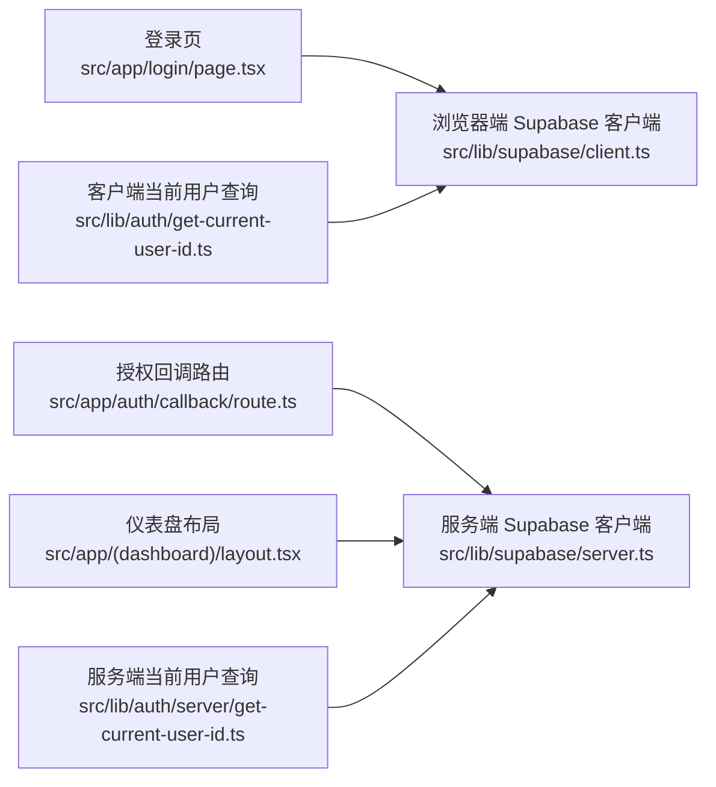
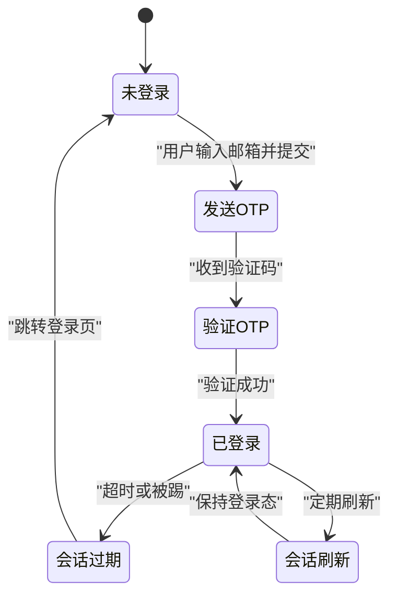

# 会话管理

<cite>
**本文引用的文件**
- [src/app/auth/callback/route.ts](file://src/app/auth/callback/route.ts)
- [src/app/login/page.tsx](file://src/app/login/page.tsx)
- [src/lib/supabase/server.ts](file://src/lib/supabase/server.ts)
- [src/lib/supabase/client.ts](file://src/lib/supabase/client.ts)
- [src/lib/auth/server/get-current-user-id.ts](file://src/lib/auth/server/get-current-user-id.ts)
- [src/lib/auth/get-current-user-id.ts](file://src/lib/auth/get-current-user-id.ts)
- [src/app/(dashboard)/layout.tsx](file://src/app/(dashboard)/layout.tsx)
- [next.config.js](file://next.config.js)
</cite>

## 目录
1. [简介](#简介)
2. [项目结构](#项目结构)
3. [核心组件](#核心组件)
4. [架构总览](#架构总览)
5. [详细组件分析](#详细组件分析)
6. [依赖关系分析](#依赖关系分析)
7. [性能考量](#性能考量)
8. [故障排除指南](#故障排除指南)
9. [结论](#结论)
10. [附录](#附录)

## 简介
本文件系统性梳理 TETO 的会话管理方案，覆盖用户会话生命周期、服务器端与客户端会话存储、会话状态的获取与更新、会话过期与刷新策略、安全机制（CSRF/XSS 防护）、多设备登录管理、调试工具与性能监控、以及最佳实践与常见威胁防护。文档以仓库现有实现为依据，结合代码路径进行说明，帮助开发者与运维人员快速理解并优化会话体系。

## 项目结构
围绕会话管理的关键文件分布如下：
- 登录与回调：登录页、邮箱 OTP 流程、授权回调路由
- 客户端与服务端 Supabase 客户端封装：浏览器端与 SSR 端的会话同步与 Cookie 管理
- 会话状态获取：服务端与客户端统一的当前用户查询接口
- 路由保护：仪表盘布局对未登录用户的拦截与跳转
- 开发模式：开发环境下的免登录与用户 ID 注入

图表来源
- [src/app/login/page.tsx:1-196](file://src/app/login/page.tsx#L1-L196)
- [src/app/auth/callback/route.ts:1-19](file://src/app/auth/callback/route.ts#L1-L19)
- [src/lib/supabase/server.ts:1-36](file://src/lib/supabase/server.ts#L1-L36)
- [src/lib/supabase/client.ts:1-9](file://src/lib/supabase/client.ts#L1-L9)
- [src/lib/auth/server/get-current-user-id.ts:1-85](file://src/lib/auth/server/get-current-user-id.ts#L1-L85)
- [src/lib/auth/get-current-user-id.ts:52-87](file://src/lib/auth/get-current-user-id.ts#L52-L87)
- [src/app/(dashboard)/layout.tsx:38-89](file://src/app/(dashboard)/layout.tsx#L38-L89)

章节来源
- [src/app/login/page.tsx:1-196](file://src/app/login/page.tsx#L1-L196)
- [src/app/auth/callback/route.ts:1-19](file://src/app/auth/callback/route.ts#L1-L19)
- [src/lib/supabase/server.ts:1-36](file://src/lib/supabase/server.ts#L1-L36)
- [src/lib/supabase/client.ts:1-9](file://src/lib/supabase/client.ts#L1-L9)
- [src/lib/auth/server/get-current-user-id.ts:1-85](file://src/lib/auth/server/get-current-user-id.ts#L1-L85)
- [src/lib/auth/get-current-user-id.ts:52-87](file://src/lib/auth/get-current-user-id.ts#L52-L87)
- [src/app/(dashboard)/layout.tsx:38-89](file://src/app/(dashboard)/layout.tsx#L38-L89)

## 核心组件
- 登录页与 OTP 流程：负责邮箱 OTP 发送与校验，登录成功后设置会话并跳转
- 授权回调路由：接收第三方授权回调，换取并设置会话
- 客户端 Supabase 客户端：浏览器端通过匿名密钥与 Supabase 通信，自动同步 Cookie
- 服务端 Supabase 客户端：SSR 环境下通过 CookieStore 读写会话，支持开发模式下的服务端密钥
- 当前用户查询：服务端与客户端分别提供获取当前用户信息的能力
- 路由保护：仪表盘布局在加载时检查会话，未登录则跳转至登录页

章节来源
- [src/app/login/page.tsx:17-86](file://src/app/login/page.tsx#L17-L86)
- [src/app/auth/callback/route.ts:4-18](file://src/app/auth/callback/route.ts#L4-L18)
- [src/lib/supabase/client.ts:1-9](file://src/lib/supabase/client.ts#L1-L9)
- [src/lib/supabase/server.ts:6-35](file://src/lib/supabase/server.ts#L6-L35)
- [src/lib/auth/server/get-current-user-id.ts:12-76](file://src/lib/auth/server/get-current-user-id.ts#L12-L76)
- [src/lib/auth/get-current-user-id.ts:52-87](file://src/lib/auth/get-current-user-id.ts#L52-L87)
- [src/app/(dashboard)/layout.tsx:38-47](file://src/app/(dashboard)/layout.tsx#L38-L47)

## 架构总览
TETO 的会话管理基于 Supabase Auth，采用“浏览器端匿名密钥 + SSR 服务端密钥”的双客户端模式，并通过 Cookie 在前后端之间同步会话状态。登录采用邮箱 OTP，登录成功后 Supabase 自动设置会话 Cookie；授权回调路由用于处理外部授权后的会话交换；仪表盘布局在每次加载时进行会话校验，未登录则强制跳转。

图表来源
- [src/app/login/page.tsx:27-83](file://src/app/login/page.tsx#L27-L83)
- [src/lib/supabase/client.ts:3-8](file://src/lib/supabase/client.ts#L3-L8)
- [src/lib/supabase/server.ts:17-35](file://src/lib/supabase/server.ts#L17-L35)

## 详细组件分析

### 登录与会话建立（邮箱 OTP）
- 功能要点
  - 邮箱 OTP 发送：调用 Supabase Auth 的邮箱登录接口，允许自动创建用户
  - OTP 验证：提交 6 位验证码，验证通过后 Supabase 设置会话
  - 会话验证：登录成功后主动查询当前会话状态，确保已正确设置
  - 跳转：验证成功后跳转至记录页
- 关键路径
  - 发送 OTP：[src/app/login/page.tsx:27-32](file://src/app/login/page.tsx#L27-L32)
  - 验证 OTP：[src/app/login/page.tsx:60-64](file://src/app/login/page.tsx#L60-L64)
  - 会话验证：[src/app/login/page.tsx:78-79](file://src/app/login/page.tsx#L78-L79)
  - 跳转：[src/app/login/page.tsx:82](file://src/app/login/page.tsx#L82)

图表来源
- [src/app/login/page.tsx:27-83](file://src/app/login/page.tsx#L27-L83)

章节来源
- [src/app/login/page.tsx:17-86](file://src/app/login/page.tsx#L17-L86)

### 授权回调与会话交换
- 功能要点
  - 从回调 URL 中提取授权码
  - 使用服务端 Supabase 客户端将授权码兑换为会话
  - 成功后重定向至记录页，失败则回退到登录页并携带错误参数
- 关键路径
  - 回调处理：[src/app/auth/callback/route.ts:4-17](file://src/app/auth/callback/route.ts#L4-L17)
  - 会话交换：[src/app/auth/callback/route.ts:10](file://src/app/auth/callback/route.ts#L10)

图表来源
- [src/app/auth/callback/route.ts:4-17](file://src/app/auth/callback/route.ts#L4-L17)
- [src/lib/supabase/server.ts:17-35](file://src/lib/supabase/server.ts#L17-L35)

章节来源
- [src/app/auth/callback/route.ts:1-19](file://src/app/auth/callback/route.ts#L1-L19)

### 客户端与服务端 Supabase 客户端
- 浏览器端客户端
  - 使用匿名密钥初始化，自动与 Cookie 同步会话
  - 适合在浏览器中进行用户态操作
- 服务端客户端
  - 通过 Next.js 的 CookieStore 读写会话
  - 开发模式下使用服务端密钥，绕过行级安全策略；生产模式使用匿名密钥
- 关键路径
  - 浏览器端初始化：[src/lib/supabase/client.ts:3-8](file://src/lib/supabase/client.ts#L3-L8)
  - 服务端初始化：[src/lib/supabase/server.ts:6-35](file://src/lib/supabase/server.ts#L6-L35)

图表来源
- [src/lib/supabase/client.ts:1-9](file://src/lib/supabase/client.ts#L1-L9)
- [src/lib/supabase/server.ts:1-36](file://src/lib/supabase/server.ts#L1-L36)

章节来源
- [src/lib/supabase/client.ts:1-9](file://src/lib/supabase/client.ts#L1-L9)
- [src/lib/supabase/server.ts:1-36](file://src/lib/supabase/server.ts#L1-L36)

### 会话状态获取与更新
- 服务端获取当前用户
  - 支持开发模式直返固定用户 ID
  - 非开发模式通过服务端 Supabase 客户端查询当前用户
- 客户端获取当前用户
  - 通过浏览器端 Supabase 客户端查询当前用户
- 关键路径
  - 服务端获取用户：[src/lib/auth/server/get-current-user-id.ts:12-76](file://src/lib/auth/server/get-current-user-id.ts#L12-L76)
  - 客户端获取用户：[src/lib/auth/get-current-user-id.ts:52-87](file://src/lib/auth/get-current-user-id.ts#L52-L87)

图表来源
- [src/lib/auth/get-current-user-id.ts:52-87](file://src/lib/auth/get-current-user-id.ts#L52-L87)
- [src/lib/auth/server/get-current-user-id.ts:12-76](file://src/lib/auth/server/get-current-user-id.ts#L12-L76)
- [src/lib/supabase/client.ts:3-8](file://src/lib/supabase/client.ts#L3-L8)
- [src/lib/supabase/server.ts:17-35](file://src/lib/supabase/server.ts#L17-L35)

章节来源
- [src/lib/auth/server/get-current-user-id.ts:1-85](file://src/lib/auth/server/get-current-user-id.ts#L1-L85)
- [src/lib/auth/get-current-user-id.ts:52-87](file://src/lib/auth/get-current-user-id.ts#L52-L87)

### 路由保护与会话失效处理
- 仪表盘布局在挂载时检查当前用户，若获取失败则跳转到登录页
- 关键路径
  - 路由保护逻辑：[src/app/(dashboard)/layout.tsx:38-47](file://src/app/(dashboard)/layout.tsx#L38-L47)

图表来源
- [src/app/(dashboard)/layout.tsx:38-47](file://src/app/(dashboard)/layout.tsx#L38-L47)

章节来源
- [src/app/(dashboard)/layout.tsx:38-47](file://src/app/(dashboard)/layout.tsx#L38-L47)

### 多设备登录管理
- 当前实现未显式区分多设备登录策略，会话状态由 Supabase 统一管理并通过 Cookie 同步
- 若需实现多设备登录控制（如单点登录、踢下线），可在 Supabase Auth 层面配置并结合应用层策略扩展

[本节为概念性说明，不直接分析具体文件]

## 依赖关系分析
- 组件耦合
  - 登录页依赖浏览器端 Supabase 客户端进行 OTP 发送与验证
  - 授权回调路由依赖服务端 Supabase 客户端进行会话交换
  - 仪表盘布局依赖服务端当前用户查询接口进行路由保护
- 外部依赖
  - Supabase Auth：提供会话管理、用户查询、授权码交换等能力
  - Next.js CookieStore：服务端读写 Cookie，支撑 SSR 会话同步

图表来源
- [src/app/login/page.tsx:1-196](file://src/app/login/page.tsx#L1-L196)
- [src/app/auth/callback/route.ts:1-19](file://src/app/auth/callback/route.ts#L1-L19)
- [src/lib/supabase/client.ts:1-9](file://src/lib/supabase/client.ts#L1-L9)
- [src/lib/supabase/server.ts:1-36](file://src/lib/supabase/server.ts#L1-L36)
- [src/lib/auth/server/get-current-user-id.ts:1-85](file://src/lib/auth/server/get-current-user-id.ts#L1-L85)
- [src/lib/auth/get-current-user-id.ts:52-87](file://src/lib/auth/get-current-user-id.ts#L52-L87)
- [src/app/(dashboard)/layout.tsx:38-89](file://src/app/(dashboard)/layout.tsx#L38-L89)

章节来源
- [src/app/login/page.tsx:1-196](file://src/app/login/page.tsx#L1-L196)
- [src/app/auth/callback/route.ts:1-19](file://src/app/auth/callback/route.ts#L1-L19)
- [src/lib/supabase/client.ts:1-9](file://src/lib/supabase/client.ts#L1-L9)
- [src/lib/supabase/server.ts:1-36](file://src/lib/supabase/server.ts#L1-L36)
- [src/lib/auth/server/get-current-user-id.ts:1-85](file://src/lib/auth/server/get-current-user-id.ts#L1-L85)
- [src/lib/auth/get-current-user-id.ts:52-87](file://src/lib/auth/get-current-user-id.ts#L52-L87)
- [src/app/(dashboard)/layout.tsx:38-89](file://src/app/(dashboard)/layout.tsx#L38-L89)

## 性能考量
- 会话查询成本
  - 服务端与客户端均需向 Supabase 发起请求以获取当前用户，建议在服务端缓存短期用户信息，减少重复查询
- Cookie 同步
  - 服务端通过 CookieStore 写入会话，注意避免频繁写入导致的性能损耗
- 路由保护
  - 仪表盘布局在挂载时进行会话检查，建议在必要时延迟检查或使用更细粒度的保护策略

[本节提供通用指导，不直接分析具体文件]

## 故障排除指南
- 常见问题与定位
  - 登录页无法收到 OTP：检查浏览器端 Supabase 客户端初始化与邮箱配置
  - OTP 验证失败：查看浏览器控制台与 Supabase 日志，确认验证码与邮箱匹配
  - 会话未设置：登录成功后主动查询会话状态，确认 Cookie 已写入
  - 授权回调失败：检查回调路由是否正确接收授权码并调用会话交换接口
  - 仪表盘未登录跳转：确认服务端当前用户查询是否抛出异常，以及路由保护逻辑是否执行
- 调试建议
  - 在登录页与回调路由中增加日志输出，记录关键步骤与错误信息
  - 使用浏览器开发者工具查看 Cookie 是否正确设置
  - 在服务端启用更详细的日志，捕获 Supabase 错误码与状态

章节来源
- [src/app/login/page.tsx:27-83](file://src/app/login/page.tsx#L27-L83)
- [src/app/auth/callback/route.ts:4-17](file://src/app/auth/callback/route.ts#L4-L17)
- [src/lib/auth/server/get-current-user-id.ts:21-28](file://src/lib/auth/server/get-current-user-id.ts#L21-L28)
- [src/app/(dashboard)/layout.tsx:42-46](file://src/app/(dashboard)/layout.tsx#L42-L46)

## 结论
TETO 的会话管理以 Supabase Auth 为核心，结合浏览器端与服务端客户端，在 Cookie 的驱动下实现了前后端一致的会话状态。登录采用邮箱 OTP，授权回调支持外部授权码交换，仪表盘布局提供基础的路由保护。建议在生产环境中进一步完善多设备登录策略、会话刷新与安全加固，并通过日志与监控持续优化用户体验与安全性。

[本节为总结性内容，不直接分析具体文件]

## 附录

### 会话生命周期与状态流转

[本图为概念图，不直接映射具体文件]

### 安全机制与最佳实践
- CSRF 防护
  - 使用 Supabase Auth 默认的 CSRF 保护
  - 在表单提交时遵循同源策略，避免跨站请求
- XSS 防护
  - 对用户输入进行严格校验与转义
  - 使用受信任的模板与渲染库，避免内联脚本
- 会话安全
  - 启用 HTTPS，限制 Cookie 的 SameSite 与 Secure 属性
  - 控制会话有效期，定期刷新令牌
- 多设备登录
  - 在 Supabase Auth 层面配置会话策略，结合应用层实现踢人或并发登录控制

[本节为通用指导，不直接分析具体文件]