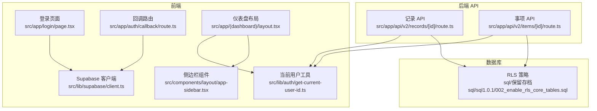
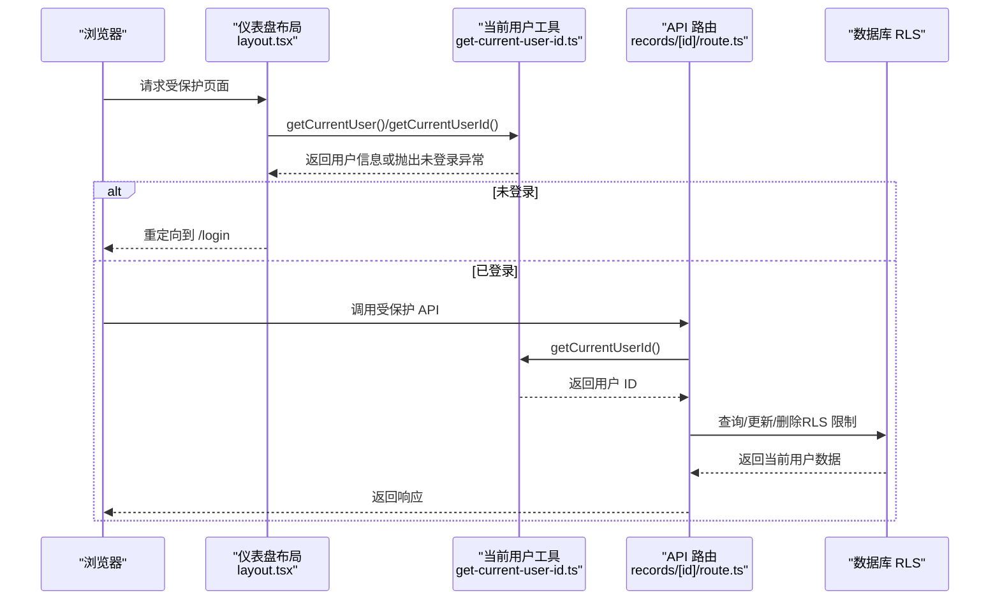
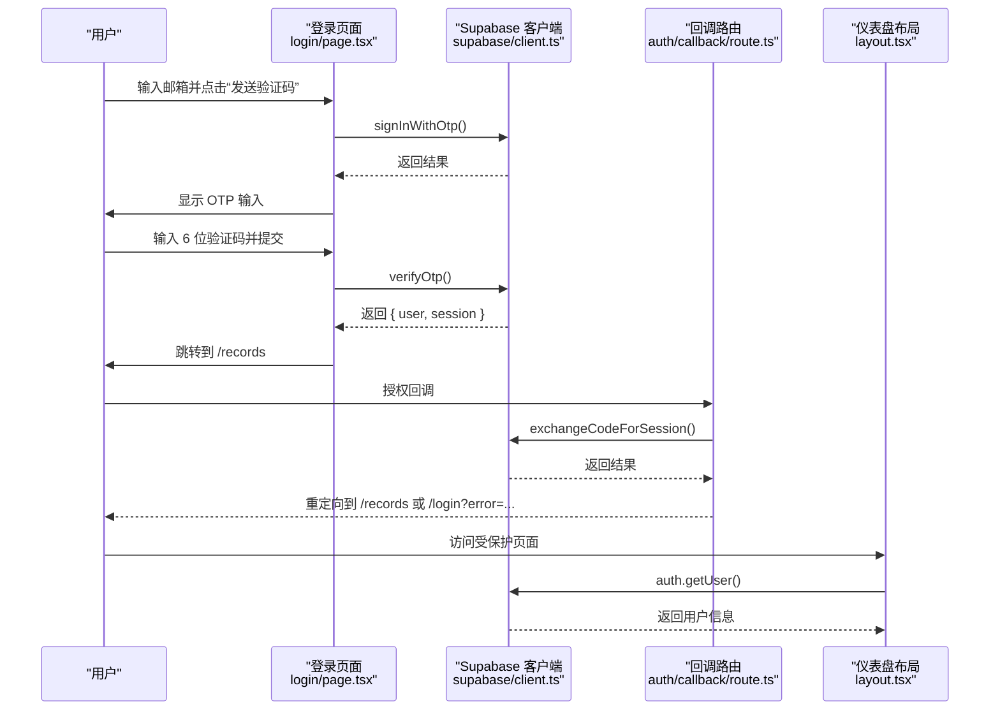
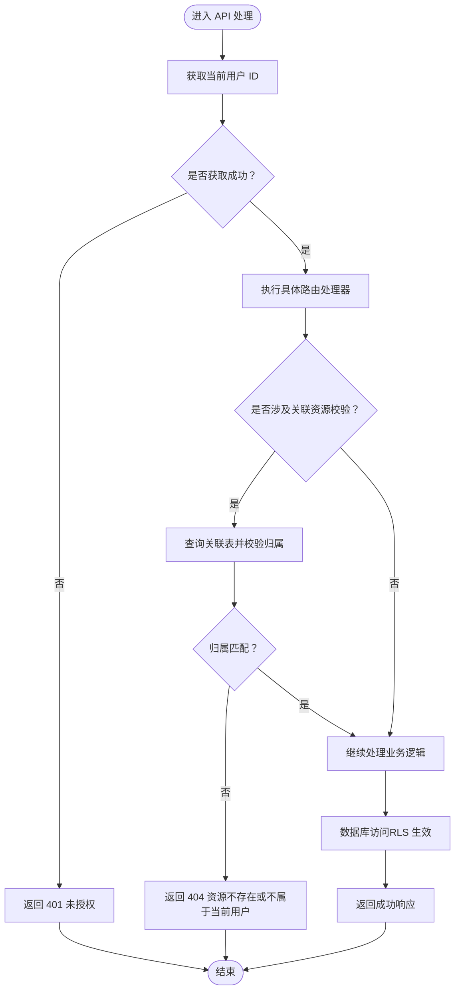
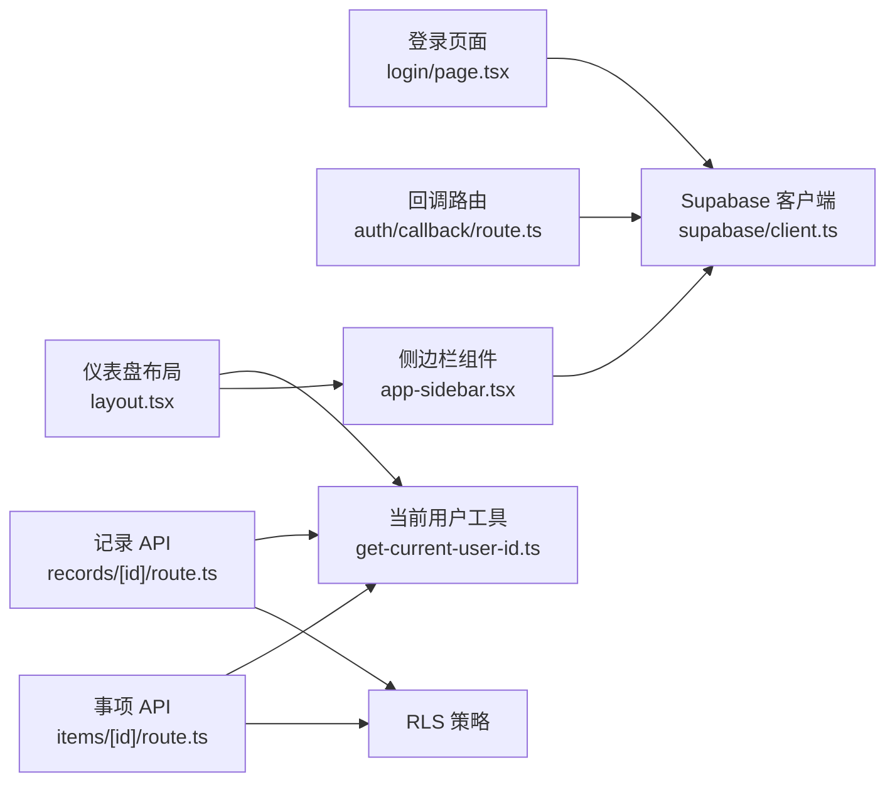

# 权限控制

<cite>
**本文引用的文件**
- [src/app/auth/callback/route.ts](file://src/app/auth/callback/route.ts)
- [src/app/login/page.tsx](file://src/app/login/page.tsx)
- [src/lib/supabase/client.ts](file://src/lib/supabase/client.ts)
- [src/lib/auth/get-current-user-id.ts](file://src/lib/auth/get-current-user-id.ts)
- [src/app/(dashboard)/layout.tsx](file://src/app/(dashboard)/layout.tsx)
- [src/components/layout/app-sidebar.tsx](file://src/components/layout/app-sidebar.tsx)
- [src/app/api/v2/records/[id]/route.ts](file://src/app/api/v2/records/[id]/route.ts)
- [src/app/api/v2/items/[id]/route.ts](file://src/app/api/v2/items/[id]/route.ts)
- [sql/保留存档sql/sql1.0.1/002_enable_rls_core_tables.sql](file://sql/保留存档sql/sql1.0.1/002_enable_rls_core_tables.sql)
</cite>

## 目录
1. [简介](#简介)
2. [项目结构](#项目结构)
3. [核心组件](#核心组件)
4. [架构总览](#架构总览)
5. [详细组件分析](#详细组件分析)
6. [依赖关系分析](#依赖关系分析)
7. [性能考虑](#性能考虑)
8. [故障排查指南](#故障排查指南)
9. [结论](#结论)
10. [附录](#附录)

## 简介
本文件系统性梳理 TETO 的权限控制体系，重点覆盖以下方面：
- 基于 Supabase Auth 的认证与会话流转
- 前端布局与页面级访问控制
- 后端 API 的权限校验与资源归属验证
- 数据层行级安全策略（RLS）
- 权限中间件与权限检查函数的使用方式
- 权限缓存策略与优化建议
- 不同用户角色的权限差异、资源访问控制规则、权限继承与传递机制
- 实际应用场景与扩展指南（API 保护、前端路由权限、组件级权限显示）

## 项目结构
围绕权限控制的关键目录与文件如下：
- 认证与会话
  - 登录页面与 OTP 流程：src/app/login/page.tsx
  - 回调处理：src/app/auth/callback/route.ts
  - Supabase 客户端封装：src/lib/supabase/client.ts
  - 当前用户信息获取（客户端/服务端工具）：src/lib/auth/get-current-user-id.ts
- 前端布局与导航
  - 仪表盘布局与鉴权拦截：src/app/(dashboard)/layout.tsx
  - 侧边栏组件（登出等）：src/components/layout/app-sidebar.tsx
- 后端 API
  - 记录 API 权限校验：src/app/api/v2/records/[id]/route.ts
  - 事项 API 权限校验与资源归属校验：src/app/api/v2/items/[id]/route.ts
- 数据层安全
  - RLS 策略（启用与策略定义）：sql/保留存档sql/sql1.0.1/002_enable_rls_core_tables.sql

图表来源
- [src/app/login/page.tsx:1-196](file://src/app/login/page.tsx#L1-L196)
- [src/app/auth/callback/route.ts:1-19](file://src/app/auth/callback/route.ts#L1-L19)
- [src/lib/supabase/client.ts:1-9](file://src/lib/supabase/client.ts#L1-L9)
- [src/lib/auth/get-current-user-id.ts:1-88](file://src/lib/auth/get-current-user-id.ts#L1-L88)
- [src/app/(dashboard)/layout.tsx:1-90](file://src/app/(dashboard)/layout.tsx#L1-L90)
- [src/components/layout/app-sidebar.tsx:1-147](file://src/components/layout/app-sidebar.tsx#L1-L147)
- [src/app/api/v2/records/[id]/route.ts:1-87](file://src/app/api/v2/records/[id]/route.ts#L1-L87)
- [src/app/api/v2/items/[id]/route.ts:1-211](file://src/app/api/v2/items/[id]/route.ts#L1-L211)
- [sql/保留存档sql/sql1.0.1/002_enable_rls_core_tables.sql:163-249](file://sql/保留存档sql/sql1.0.1/002_enable_rls_core_tables.sql#L163-L249)

章节来源
- [src/app/login/page.tsx:1-196](file://src/app/login/page.tsx#L1-L196)
- [src/app/auth/callback/route.ts:1-19](file://src/app/auth/callback/route.ts#L1-L19)
- [src/lib/supabase/client.ts:1-9](file://src/lib/supabase/client.ts#L1-L9)
- [src/lib/auth/get-current-user-id.ts:1-88](file://src/lib/auth/get-current-user-id.ts#L1-L88)
- [src/app/(dashboard)/layout.tsx:1-90](file://src/app/(dashboard)/layout.tsx#L1-L90)
- [src/components/layout/app-sidebar.tsx:1-147](file://src/components/layout/app-sidebar.tsx#L1-L147)
- [src/app/api/v2/records/[id]/route.ts:1-87](file://src/app/api/v2/records/[id]/route.ts#L1-L87)
- [src/app/api/v2/items/[id]/route.ts:1-211](file://src/app/api/v2/items/[id]/route.ts#L1-L211)
- [sql/保留存档sql/sql1.0.1/002_enable_rls_core_tables.sql:163-249](file://sql/保留存档sql/sql1.0.1/002_enable_rls_core_tables.sql#L163-L249)

## 核心组件
- Supabase 客户端封装
  - 提供浏览器端与服务端的 Supabase 客户端实例，统一环境变量配置入口，便于在前后端复用。
- 当前用户工具
  - 提供获取当前用户 ID、获取当前用户信息、开发模式判断与开发用户 ID 获取等能力；支持开发模式下的“免登录”直通。
- 前端仪表盘布局
  - 在客户端侧进行认证检查，若未登录则跳转至登录页；开发模式下直接放行。
- API 层权限校验
  - 所有受保护的 API 在处理请求前调用当前用户工具以获取用户 ID，并对资源归属进行二次校验（如涉及跨表关联时）。
- RLS 数据层策略
  - 对核心业务表启用行级安全策略，确保 SQL 查询默认只返回当前用户的数据。

章节来源
- [src/lib/supabase/client.ts:1-9](file://src/lib/supabase/client.ts#L1-L9)
- [src/lib/auth/get-current-user-id.ts:1-88](file://src/lib/auth/get-current-user-id.ts#L1-L88)
- [src/app/(dashboard)/layout.tsx:1-90](file://src/app/(dashboard)/layout.tsx#L1-L90)
- [src/app/api/v2/records/[id]/route.ts:1-87](file://src/app/api/v2/records/[id]/route.ts#L1-L87)
- [src/app/api/v2/items/[id]/route.ts:1-211](file://src/app/api/v2/items/[id]/route.ts#L1-L211)
- [sql/保留存档sql/sql1.0.1/002_enable_rls_core_tables.sql:163-249](file://sql/保留存档sql/sql1.0.1/002_enable_rls_core_tables.sql#L163-L249)

## 架构总览
TETO 的权限控制采用“前端布局拦截 + 后端 API 校验 + 数据层 RLS”的三层防护：
- 前端布局拦截：在仪表盘布局中进行认证检查，未登录自动跳转登录页。
- 后端 API 校验：API 入口统一获取当前用户 ID，并对资源归属进行校验。
- 数据层 RLS：数据库层面强制限制用户只能访问自己的数据，作为最后一道防线。

图表来源
- [src/app/(dashboard)/layout.tsx:1-90](file://src/app/(dashboard)/layout.tsx#L1-L90)
- [src/lib/auth/get-current-user-id.ts:1-88](file://src/lib/auth/get-current-user-id.ts#L1-L88)
- [src/app/api/v2/records/[id]/route.ts:1-87](file://src/app/api/v2/records/[id]/route.ts#L1-L87)
- [sql/保留存档sql/sql1.0.1/002_enable_rls_core_tables.sql:163-249](file://sql/保留存档sql/sql1.0.1/002_enable_rls_core_tables.sql#L163-L249)

## 详细组件分析

### 认证与会话流程
- 登录页面（OTP）：前端通过 Supabase 客户端发起发送 OTP 与验证 OTP 请求，成功后获取并验证会话，随后跳转到受保护页面。
- 回调路由：处理第三方授权回调，将临时授权码兑换为会话，成功后重定向到受保护页面，失败则回退到登录页并携带错误参数。
- Supabase 客户端：封装浏览器端客户端创建逻辑，统一读取环境变量。
- 当前用户工具（客户端）：在非开发模式下调用 Supabase 获取当前用户，开发模式下直接返回开发用户信息。

图表来源
- [src/app/login/page.tsx:1-196](file://src/app/login/page.tsx#L1-L196)
- [src/app/auth/callback/route.ts:1-19](file://src/app/auth/callback/route.ts#L1-L19)
- [src/lib/supabase/client.ts:1-9](file://src/lib/supabase/client.ts#L1-L9)
- [src/lib/auth/get-current-user-id.ts:1-88](file://src/lib/auth/get-current-user-id.ts#L1-L88)
- [src/app/(dashboard)/layout.tsx:1-90](file://src/app/(dashboard)/layout.tsx#L1-L90)

章节来源
- [src/app/login/page.tsx:1-196](file://src/app/login/page.tsx#L1-L196)
- [src/app/auth/callback/route.ts:1-19](file://src/app/auth/callback/route.ts#L1-L19)
- [src/lib/supabase/client.ts:1-9](file://src/lib/supabase/client.ts#L1-L9)
- [src/lib/auth/get-current-user-id.ts:1-88](file://src/lib/auth/get-current-user-id.ts#L1-L88)
- [src/app/(dashboard)/layout.tsx:1-90](file://src/app/(dashboard)/layout.tsx#L1-L90)

### 前端布局与页面级权限控制
- 仪表盘布局在客户端侧执行认证检查：若处于开发模式则直接放行；否则调用当前用户工具获取用户信息，失败则重定向到登录页。
- 侧边栏组件提供登出功能，调用 Supabase 客户端执行 signOut 并跳转到登录页。

章节来源
- [src/app/(dashboard)/layout.tsx:1-90](file://src/app/(dashboard)/layout.tsx#L1-L90)
- [src/components/layout/app-sidebar.tsx:1-147](file://src/components/layout/app-sidebar.tsx#L1-L147)

### 后端 API 权限校验与资源归属验证
- 记录 API（GET/PUT/DELETE）：
  - 统一通过当前用户工具获取用户 ID；
  - GET：按用户 ID 与记录 ID 查询，不存在则返回 404；
  - PUT：若更新包含关联事项 ID，则额外查询 items 表确认归属，不匹配则返回 404；
  - DELETE：按用户 ID 删除记录。
- 事项 API（GET/PUT/DELETE）：
  - 统一通过当前用户工具获取用户 ID；
  - GET：查询事项并返回关联阶段、目标与聚合数据，内部对 records/record_days 等进行聚合统计；
  - PUT：更新事项；
  - DELETE：删除事项。

图表来源
- [src/app/api/v2/records/[id]/route.ts:1-87](file://src/app/api/v2/records/[id]/route.ts#L1-L87)
- [src/app/api/v2/items/[id]/route.ts:1-211](file://src/app/api/v2/items/[id]/route.ts#L1-L211)
- [src/lib/auth/get-current-user-id.ts:1-88](file://src/lib/auth/get-current-user-id.ts#L1-L88)

章节来源
- [src/app/api/v2/records/[id]/route.ts:1-87](file://src/app/api/v2/records/[id]/route.ts#L1-L87)
- [src/app/api/v2/items/[id]/route.ts:1-211](file://src/app/api/v2/items/[id]/route.ts#L1-L211)
- [src/lib/auth/get-current-user-id.ts:1-88](file://src/lib/auth/get-current-user-id.ts#L1-L88)

### 数据层行级安全策略（RLS）
- 对核心业务表启用 RLS，并为每张表定义“仅本人可见/增删改”的策略，确保 SQL 查询默认只返回当前用户的数据。
- 示例策略涵盖：
  - diary_reviews 表：SELECT/INSERT/UPDATE/DELETE 均基于 user_id = auth.uid()；
  - projects 表：SELECT/INSERT/UPDATE/DELETE 均基于 user_id = auth.uid()；
  - project_logs 表：SELECT 通过子查询关联 projects 表间接验证归属。

章节来源
- [sql/保留存档sql/sql1.0.1/002_enable_rls_core_tables.sql:163-249](file://sql/保留存档sql/sql1.0.1/002_enable_rls_core_tables.sql#L163-L249)

### 权限中间件与权限检查函数
- 权限中间件
  - 前端：仪表盘布局在客户端侧执行认证检查，未登录重定向至登录页，属于“页面级中间件”。
  - 后端：API 路由在处理请求前统一调用当前用户工具获取用户 ID，失败则返回 401，属于“路由级中间件”。
- 权限检查函数
  - getCurrentUserId：获取当前用户 ID（服务端）；
  - getCurrentUser：获取当前用户信息（客户端/服务端）；
  - isDevMode：判断是否为开发模式；
  - getDevUserId：获取开发用户 ID。

章节来源
- [src/app/(dashboard)/layout.tsx:1-90](file://src/app/(dashboard)/layout.tsx#L1-L90)
- [src/app/api/v2/records/[id]/route.ts:1-87](file://src/app/api/v2/records/[id]/route.ts#L1-L87)
- [src/app/api/v2/items/[id]/route.ts:1-211](file://src/app/api/v2/items/[id]/route.ts#L1-L211)
- [src/lib/auth/get-current-user-id.ts:1-88](file://src/lib/auth/get-current-user-id.ts#L1-L88)

### 权限缓存策略
- 前端缓存
  - 仪表盘布局中将侧边栏折叠状态持久化到本地存储，减少重复渲染与状态丢失风险。
- 后端缓存
  - 当前实现未见显式后端缓存逻辑；建议在高频读取场景引入短期缓存（如 Redis）以降低数据库压力，注意与 RLS 结合时的键空间隔离与失效策略。
- 数据库缓存
  - RLS 本身不提供缓存，但可通过应用层缓存与数据库查询优化（索引、选择性列过滤）提升整体性能。

章节来源
- [src/app/(dashboard)/layout.tsx:1-90](file://src/app/(dashboard)/layout.tsx#L1-L90)

### 角色与权限差异、继承与传递
- 角色与权限
  - 当前代码未定义显式的“角色”字段或“权限矩阵”。权限控制以“用户 ID”为核心，结合 RLS 与 API 层二次校验实现资源归属控制。
- 继承与传递
  - 通过 RLS 策略在数据库层强制“用户 → 数据”的一对一绑定；API 层在涉及多表关联时补充“用户 → 关联对象”的二次校验，形成“数据层 + 应用层”的双保险。

章节来源
- [sql/保留存档sql/sql1.0.1/002_enable_rls_core_tables.sql:163-249](file://sql/保留存档sql/sql1.0.1/002_enable_rls_core_tables.sql#L163-L249)
- [src/app/api/v2/items/[id]/route.ts:1-211](file://src/app/api/v2/items/[id]/route.ts#L1-L211)

### 实际应用场景与示例路径
- API 端点保护
  - 受保护的记录与事项 API：参考路径
    - [src/app/api/v2/records/[id]/route.ts](file://src/app/api/v2/records/[id]/route.ts#L1-L87)
    - [src/app/api/v2/items/[id]/route.ts](file://src/app/api/v2/items/[id]/route.ts#L1-L211)
- 前端路由权限控制
  - 仪表盘布局拦截未登录用户：参考路径
    - [src/app/(dashboard)/layout.tsx](file://src/app/(dashboard)/layout.tsx#L1-L90)
- 组件级权限显示
  - 侧边栏登出按钮等交互：参考路径
    - [src/components/layout/app-sidebar.tsx:1-147](file://src/components/layout/app-sidebar.tsx#L1-L147)

章节来源
- [src/app/api/v2/records/[id]/route.ts:1-87](file://src/app/api/v2/records/[id]/route.ts#L1-L87)
- [src/app/api/v2/items/[id]/route.ts:1-211](file://src/app/api/v2/items/[id]/route.ts#L1-L211)
- [src/app/(dashboard)/layout.tsx:1-90](file://src/app/(dashboard)/layout.tsx#L1-L90)
- [src/components/layout/app-sidebar.tsx:1-147](file://src/components/layout/app-sidebar.tsx#L1-L147)

### 扩展方法与自定义权限规则
- 引入角色/权限模型
  - 在用户表或独立角色表中增加角色字段，配合中间件在进入页面或 API 前进行角色判定。
- 自定义权限规则
  - 在数据库层新增策略或在应用层增加更细粒度的权限检查函数（如按组织/团队/项目维度），并在 API 中统一调用。
- 缓存与性能
  - 对热点数据与频繁查询结果引入短期缓存，注意缓存键需包含用户标识，避免越权。
- 审计与日志
  - 记录关键权限事件（登录、未授权访问尝试、资源变更等），便于审计与问题追踪。

## 依赖关系分析
- 前端依赖
  - 登录页面依赖 Supabase 客户端与当前用户工具；
  - 仪表盘布局依赖当前用户工具与侧边栏组件；
  - 侧边栏组件依赖 Supabase 客户端用于登出。
- 后端依赖
  - API 路由依赖当前用户工具与 Supabase 客户端（用于二次校验）；
  - 数据库依赖 RLS 策略作为基础安全屏障。
- 外部依赖
  - Supabase Auth/SSR 提供认证与会话管理；
  - Next.js App Router 提供路由与中间件能力。

图表来源
- [src/app/login/page.tsx:1-196](file://src/app/login/page.tsx#L1-L196)
- [src/app/auth/callback/route.ts:1-19](file://src/app/auth/callback/route.ts#L1-L19)
- [src/lib/supabase/client.ts:1-9](file://src/lib/supabase/client.ts#L1-L9)
- [src/lib/auth/get-current-user-id.ts:1-88](file://src/lib/auth/get-current-user-id.ts#L1-L88)
- [src/app/(dashboard)/layout.tsx:1-90](file://src/app/(dashboard)/layout.tsx#L1-L90)
- [src/components/layout/app-sidebar.tsx:1-147](file://src/components/layout/app-sidebar.tsx#L1-L147)
- [src/app/api/v2/records/[id]/route.ts:1-87](file://src/app/api/v2/records/[id]/route.ts#L1-L87)
- [src/app/api/v2/items/[id]/route.ts:1-211](file://src/app/api/v2/items/[id]/route.ts#L1-L211)
- [sql/保留存档sql/sql1.0.1/002_enable_rls_core_tables.sql:163-249](file://sql/保留存档sql/sql1.0.1/002_enable_rls_core_tables.sql#L163-L249)

章节来源
- [src/app/login/page.tsx:1-196](file://src/app/login/page.tsx#L1-L196)
- [src/app/auth/callback/route.ts:1-19](file://src/app/auth/callback/route.ts#L1-L19)
- [src/lib/supabase/client.ts:1-9](file://src/lib/supabase/client.ts#L1-L9)
- [src/lib/auth/get-current-user-id.ts:1-88](file://src/lib/auth/get-current-user-id.ts#L1-L88)
- [src/app/(dashboard)/layout.tsx:1-90](file://src/app/(dashboard)/layout.tsx#L1-L90)
- [src/components/layout/app-sidebar.tsx:1-147](file://src/components/layout/app-sidebar.tsx#L1-L147)
- [src/app/api/v2/records/[id]/route.ts:1-87](file://src/app/api/v2/records/[id]/route.ts#L1-L87)
- [src/app/api/v2/items/[id]/route.ts:1-211](file://src/app/api/v2/items/[id]/route.ts#L1-L211)
- [sql/保留存档sql/sql1.0.1/002_enable_rls_core_tables.sql:163-249](file://sql/保留存档sql/sql1.0.1/002_enable_rls_core_tables.sql#L163-L249)

## 性能考虑
- 减少不必要的数据库往返：在 API 层合并查询与批量处理，避免 N+1 查询。
- 利用索引：为 user_id、关联键等常用过滤字段建立索引，提升 RLS 与查询性能。
- 缓存策略：对只读聚合数据与静态配置引入短期缓存，注意缓存键包含用户标识。
- 会话与网络：合理设置 Supabase 客户端的超时与重试策略，避免阻塞主线程。

## 故障排查指南
- 未登录或会话异常
  - 现象：仪表盘布局重定向到登录页；API 返回 401。
  - 排查：确认 Supabase 会话是否正确设置；检查回调路由是否成功兑换会话。
- 资源归属校验失败
  - 现象：API 返回 404（资源不存在或不属于当前用户）。
  - 排查：确认请求体中的关联 ID 是否属于当前用户；检查 RLS 策略是否生效。
- 开发模式行为
  - 现象：开发模式下无需登录即可访问。
  - 排查：确认环境变量是否正确设置；开发用户 ID 是否符合预期。

章节来源
- [src/app/(dashboard)/layout.tsx:1-90](file://src/app/(dashboard)/layout.tsx#L1-L90)
- [src/app/api/v2/records/[id]/route.ts:1-87](file://src/app/api/v2/records/[id]/route.ts#L1-L87)
- [src/app/api/v2/items/[id]/route.ts:1-211](file://src/app/api/v2/items/[id]/route.ts#L1-L211)
- [src/lib/auth/get-current-user-id.ts:1-88](file://src/lib/auth/get-current-user-id.ts#L1-L88)

## 结论
TETO 的权限控制以 Supabase Auth 为基础，结合前端布局拦截、后端 API 校验与数据库 RLS，形成了“前端引导 + 应用层校验 + 数据层防护”的完整闭环。当前实现聚焦“用户 → 数据”的最小权限模型，具备清晰的扩展路径：可在应用层引入角色/权限模型与更细粒度的权限规则，并通过缓存与索引优化性能。

## 附录
- 关键实现路径参考
  - [src/app/login/page.tsx:1-196](file://src/app/login/page.tsx#L1-L196)
  - [src/app/auth/callback/route.ts:1-19](file://src/app/auth/callback/route.ts#L1-L19)
  - [src/lib/supabase/client.ts:1-9](file://src/lib/supabase/client.ts#L1-L9)
  - [src/lib/auth/get-current-user-id.ts:1-88](file://src/lib/auth/get-current-user-id.ts#L1-L88)
  - [src/app/(dashboard)/layout.tsx](file://src/app/(dashboard)/layout.tsx#L1-L90)
  - [src/components/layout/app-sidebar.tsx:1-147](file://src/components/layout/app-sidebar.tsx#L1-L147)
  - [src/app/api/v2/records/[id]/route.ts](file://src/app/api/v2/records/[id]/route.ts#L1-L87)
  - [src/app/api/v2/items/[id]/route.ts](file://src/app/api/v2/items/[id]/route.ts#L1-L211)
  - [sql/保留存档sql/sql1.0.1/002_enable_rls_core_tables.sql:163-249](file://sql/保留存档sql/sql1.0.1/002_enable_rls_core_tables.sql#L163-L249)