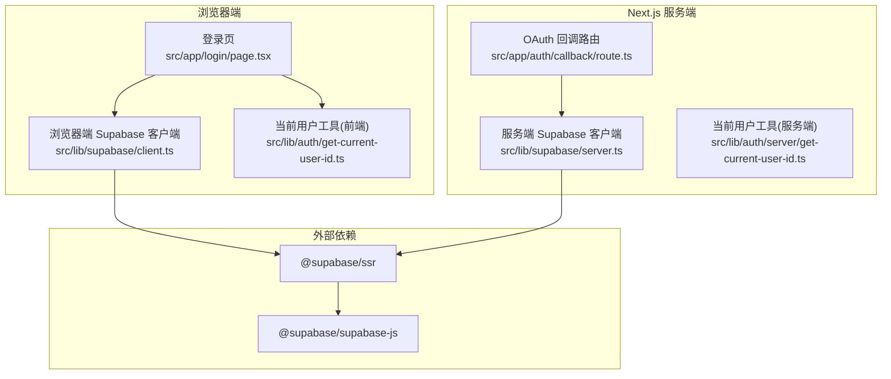
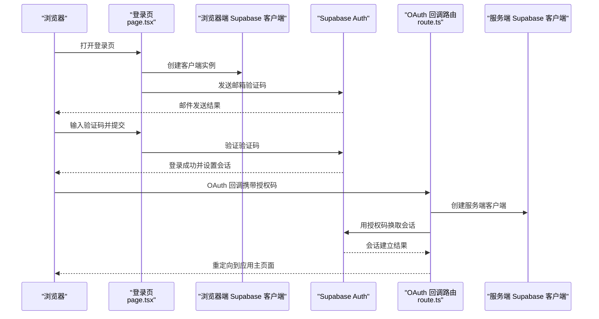
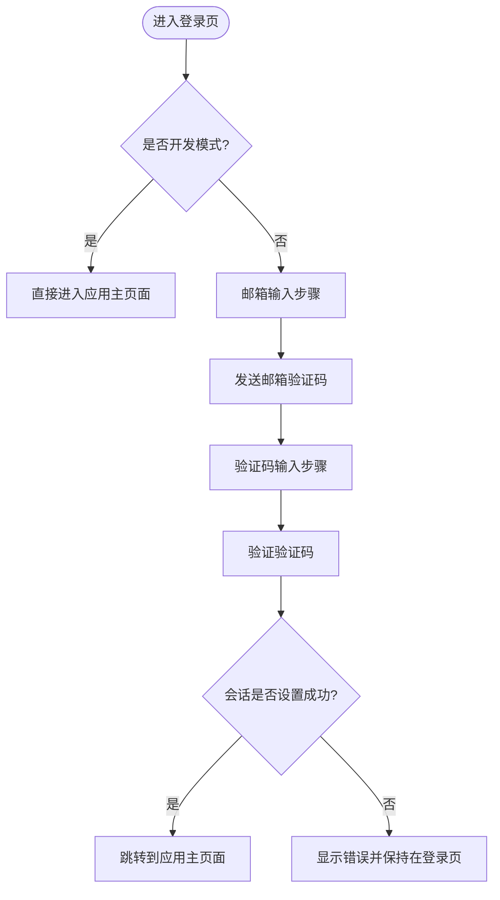
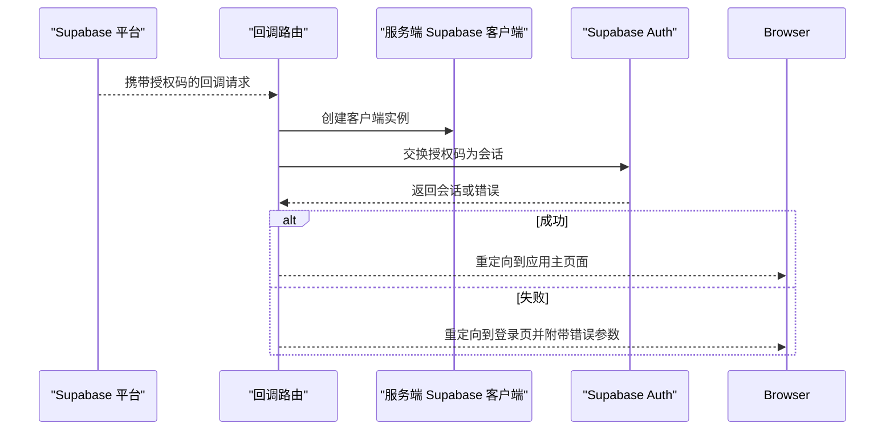
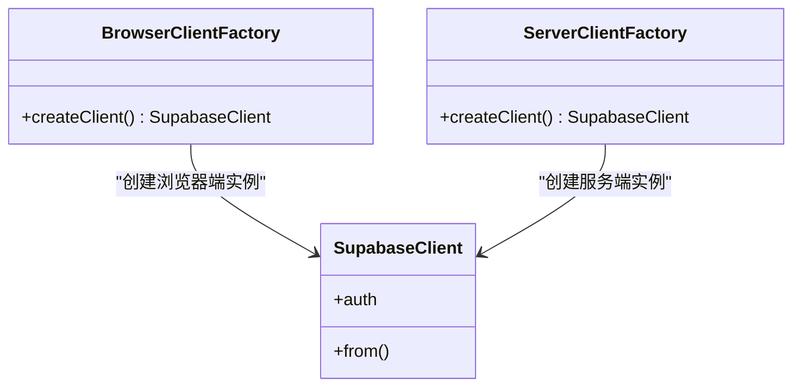
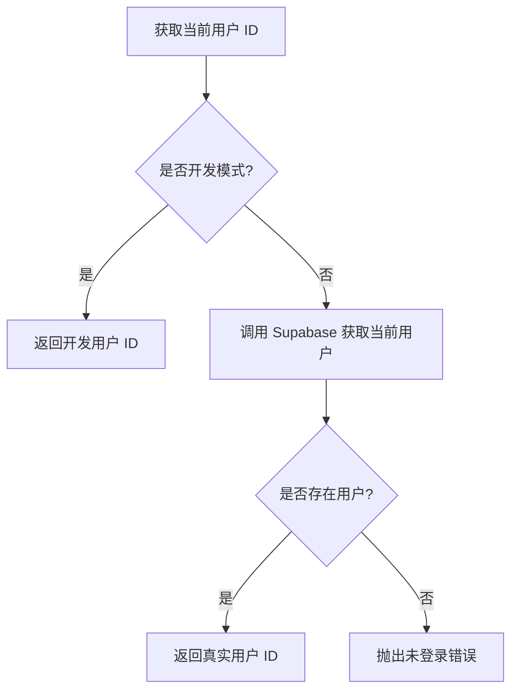
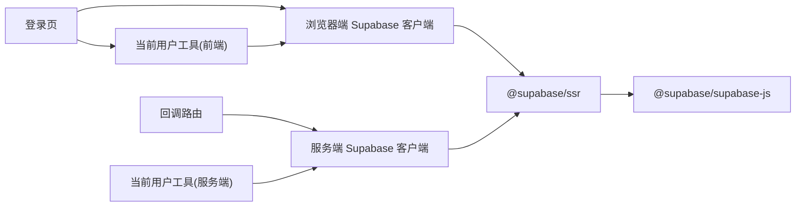

# 用户认证

<cite>
**本文引用的文件**
- [src/app/login/page.tsx](file://src/app/login/page.tsx)
- [src/app/auth/callback/route.ts](file://src/app/auth/callback/route.ts)
- [src/lib/supabase/client.ts](file://src/lib/supabase/client.ts)
- [src/lib/supabase/server.ts](file://src/lib/supabase/server.ts)
- [src/lib/auth/get-current-user-id.ts](file://src/lib/auth/get-current-user-id.ts)
- [src/lib/auth/server/get-current-user-id.ts](file://src/lib/auth/server/get-current-user-id.ts)
- [package.json](file://package.json)
- [README.md](file://README.md)
- [next.config.js](file://next.config.js)
</cite>

## 目录
1. [简介](#简介)
2. [项目结构](#项目结构)
3. [核心组件](#核心组件)
4. [架构总览](#架构总览)
5. [详细组件分析](#详细组件分析)
6. [依赖关系分析](#依赖关系分析)
7. [性能考量](#性能考量)
8. [故障排查指南](#故障排查指南)
9. [结论](#结论)
10. [附录](#附录)

## 简介
本文件面向 TETO 的用户认证系统，聚焦 Supabase Auth 的集成实现，涵盖以下主题：
- 浏览器端客户端初始化与会话管理
- Magic Link 登录机制（邮箱一次性验证码）
- OAuth 回调处理与会话建立
- 登录页面实现逻辑、用户会话状态管理与自动登录检查
- 认证状态的获取与更新流程、用户信息的存储与访问方式
- 完整登录流程示例（前端交互、后端回调、会话建立）
- 错误处理策略、用户体验优化与安全考虑

## 项目结构
认证相关的核心文件分布如下：
- 前端登录页：src/app/login/page.tsx
- OAuth 回调路由：src/app/auth/callback/route.ts
- Supabase 客户端封装（浏览器端）：src/lib/supabase/client.ts
- Supabase 客户端封装（服务端）：src/lib/supabase/server.ts
- 前端当前用户工具：src/lib/auth/get-current-user-id.ts
- 服务端当前用户工具：src/lib/auth/server/get-current-user-id.ts
- 依赖与版本：package.json
- 环境变量与部署说明：README.md
- Next.js 配置：next.config.js

图表来源
- [src/app/login/page.tsx:1-196](file://src/app/login/page.tsx#L1-L196)
- [src/app/auth/callback/route.ts:1-19](file://src/app/auth/callback/route.ts#L1-L19)
- [src/lib/supabase/client.ts:1-9](file://src/lib/supabase/client.ts#L1-L9)
- [src/lib/supabase/server.ts:1-36](file://src/lib/supabase/server.ts#L1-L36)
- [src/lib/auth/get-current-user-id.ts:1-88](file://src/lib/auth/get-current-user-id.ts#L1-L88)
- [src/lib/auth/server/get-current-user-id.ts:1-85](file://src/lib/auth/server/get-current-user-id.ts#L1-L85)
- [package.json:15-31](file://package.json#L15-L31)

章节来源
- [src/app/login/page.tsx:1-196](file://src/app/login/page.tsx#L1-L196)
- [src/app/auth/callback/route.ts:1-19](file://src/app/auth/callback/route.ts#L1-L19)
- [src/lib/supabase/client.ts:1-9](file://src/lib/supabase/client.ts#L1-L9)
- [src/lib/supabase/server.ts:1-36](file://src/lib/supabase/server.ts#L1-L36)
- [src/lib/auth/get-current-user-id.ts:1-88](file://src/lib/auth/get-current-user-id.ts#L1-L88)
- [src/lib/auth/server/get-current-user-id.ts:1-85](file://src/lib/auth/server/get-current-user-id.ts#L1-L85)
- [package.json:15-31](file://package.json#L15-L31)

## 核心组件
- 浏览器端 Supabase 客户端初始化：通过统一工厂函数创建浏览器端客户端，使用公开的项目 URL 与匿名密钥。
- 服务端 Supabase 客户端初始化：根据是否为开发模式选择不同密钥，并通过 Next.js 的 cookies 接口同步会话 Cookie。
- Magic Link 登录流程：前端提交邮箱触发发送一次性验证码；用户输入验证码后进行验证并完成登录。
- OAuth 回调处理：接收来自 Supabase 的授权码，换取会话并重定向至应用主页面。
- 当前用户工具：提供获取当前用户 ID 与用户信息的能力，并支持开发模式下的模拟用户。

章节来源
- [src/lib/supabase/client.ts:1-9](file://src/lib/supabase/client.ts#L1-L9)
- [src/lib/supabase/server.ts:1-36](file://src/lib/supabase/server.ts#L1-L36)
- [src/app/login/page.tsx:17-86](file://src/app/login/page.tsx#L17-L86)
- [src/app/auth/callback/route.ts:1-19](file://src/app/auth/callback/route.ts#L1-L19)
- [src/lib/auth/get-current-user-id.ts:15-79](file://src/lib/auth/get-current-user-id.ts#L15-L79)
- [src/lib/auth/server/get-current-user-id.ts:12-76](file://src/lib/auth/server/get-current-user-id.ts#L12-L76)

## 架构总览
下图展示从浏览器到 Supabase 的认证交互路径，以及服务端如何在回调时建立会话：

图表来源
- [src/app/login/page.tsx:17-86](file://src/app/login/page.tsx#L17-L86)
- [src/app/auth/callback/route.ts:1-19](file://src/app/auth/callback/route.ts#L1-L19)
- [src/lib/supabase/client.ts:1-9](file://src/lib/supabase/client.ts#L1-L9)
- [src/lib/supabase/server.ts:1-36](file://src/lib/supabase/server.ts#L1-L36)

## 详细组件分析

### 登录页组件（Magic Link）
- 功能要点
  - 双步流程：邮箱输入 → 验证码输入
  - 使用浏览器端 Supabase 客户端发起验证码发送与验证
  - 成功后校验会话是否正确设置，并跳转到应用主页面
  - 支持开发模式直接进入应用，无需登录

图表来源
- [src/app/login/page.tsx:17-86](file://src/app/login/page.tsx#L17-L86)
- [src/lib/auth/get-current-user-id.ts:15-40](file://src/lib/auth/get-current-user-id.ts#L15-L40)

章节来源
- [src/app/login/page.tsx:1-196](file://src/app/login/page.tsx#L1-L196)
- [src/lib/auth/get-current-user-id.ts:15-40](file://src/lib/auth/get-current-user-id.ts#L15-L40)

### OAuth 回调处理
- 功能要点
  - 从查询参数中提取授权码
  - 使用服务端 Supabase 客户端将授权码兑换为会话
  - 成功则重定向到应用主页面，失败则回退到登录页并附带错误参数

图表来源
- [src/app/auth/callback/route.ts:1-19](file://src/app/auth/callback/route.ts#L1-L19)
- [src/lib/supabase/server.ts:1-36](file://src/lib/supabase/server.ts#L1-L36)

章节来源
- [src/app/auth/callback/route.ts:1-19](file://src/app/auth/callback/route.ts#L1-L19)
- [src/lib/supabase/server.ts:1-36](file://src/lib/supabase/server.ts#L1-L36)

### Supabase 客户端封装
- 浏览器端客户端
  - 使用公开的项目 URL 与匿名密钥创建浏览器端客户端
  - 用于前端交互（如发送验证码、验证验证码、获取当前用户）
- 服务端客户端
  - 根据开发模式选择密钥（开发模式优先使用服务端角色密钥）
  - 通过 Next.js cookies 接口读写会话 Cookie，确保会话在服务端可用

图表来源
- [src/lib/supabase/client.ts:1-9](file://src/lib/supabase/client.ts#L1-L9)
- [src/lib/supabase/server.ts:1-36](file://src/lib/supabase/server.ts#L1-L36)

章节来源
- [src/lib/supabase/client.ts:1-9](file://src/lib/supabase/client.ts#L1-L9)
- [src/lib/supabase/server.ts:1-36](file://src/lib/supabase/server.ts#L1-L36)

### 当前用户工具
- 前端工具
  - 在开发模式下返回固定测试用户 ID
  - 正常模式下调用浏览器端 Supabase 客户端获取当前用户
- 服务端工具
  - 在开发模式下返回固定测试用户 ID
  - 正常模式下调用服务端 Supabase 客户端获取当前用户

图表来源
- [src/lib/auth/get-current-user-id.ts:15-40](file://src/lib/auth/get-current-user-id.ts#L15-L40)
- [src/lib/auth/server/get-current-user-id.ts:12-37](file://src/lib/auth/server/get-current-user-id.ts#L12-L37)

章节来源
- [src/lib/auth/get-current-user-id.ts:15-79](file://src/lib/auth/get-current-user-id.ts#L15-L79)
- [src/lib/auth/server/get-current-user-id.ts:12-76](file://src/lib/auth/server/get-current-user-id.ts#L12-L76)

## 依赖关系分析
- 外部依赖
  - @supabase/ssr：提供浏览器端与服务端的 Supabase 客户端创建能力
  - @supabase/supabase-js：底层数据库与函数通信库
- 内部依赖
  - 登录页依赖浏览器端 Supabase 客户端与当前用户工具
  - 回调路由依赖服务端 Supabase 客户端
  - 当前用户工具依赖对应端的 Supabase 客户端

图表来源
- [src/app/login/page.tsx:1-196](file://src/app/login/page.tsx#L1-L196)
- [src/app/auth/callback/route.ts:1-19](file://src/app/auth/callback/route.ts#L1-L19)
- [src/lib/supabase/client.ts:1-9](file://src/lib/supabase/client.ts#L1-L9)
- [src/lib/supabase/server.ts:1-36](file://src/lib/supabase/server.ts#L1-L36)
- [src/lib/auth/get-current-user-id.ts:1-88](file://src/lib/auth/get-current-user-id.ts#L1-L88)
- [src/lib/auth/server/get-current-user-id.ts:1-85](file://src/lib/auth/server/get-current-user-id.ts#L1-L85)
- [package.json:15-31](file://package.json#L15-L31)

章节来源
- [package.json:15-31](file://package.json#L15-L31)

## 性能考量
- 客户端初始化成本低：浏览器端与服务端客户端均通过工厂函数创建，避免重复初始化
- 会话同步：服务端通过 cookies 接口同步会话，减少跨请求的认证开销
- 开发模式优化：开发模式下直接返回测试用户 ID，避免不必要的网络请求
- 建议
  - 对频繁的用户状态查询进行缓存（如在前端页面层缓存当前用户信息）
  - 在回调路由中尽量减少额外的数据库查询，仅做必要的会话建立与重定向

## 故障排查指南
- 常见问题与定位
  - 环境变量缺失：确认公开的项目 URL 与匿名密钥配置正确
  - 开发模式异常：检查开发模式开关与测试用户 ID 配置
  - 回调失败：检查回调路由是否正确接收授权码并成功交换会话
  - 会话未设置：登录成功后验证会话是否正确写入 Cookie
- 日志与调试
  - 登录页在关键步骤输出日志，便于定位验证码发送与验证失败原因
  - 回调路由对授权码交换结果进行日志记录
- 用户体验优化
  - 提供清晰的错误提示与重试入口
  - 在加载状态下禁用按钮，避免重复提交
  - 开发模式下提供一键进入应用的入口

章节来源
- [src/app/login/page.tsx:17-86](file://src/app/login/page.tsx#L17-L86)
- [src/app/auth/callback/route.ts:1-19](file://src/app/auth/callback/route.ts#L1-L19)
- [README.md:57-60](file://README.md#L57-L60)

## 结论
TETO 的认证系统基于 Supabase Auth 实现，采用浏览器端与服务端分离的客户端封装，结合 Magic Link 与 OAuth 回调两种登录方式。通过统一的当前用户工具与开发模式支持，系统在功能完整性、可维护性与开发效率之间取得平衡。建议在生产环境中进一步完善错误监控与用户反馈机制，并对会话状态进行更细粒度的缓存与刷新策略。

## 附录

### 环境变量与配置
- 关键环境变量
  - NEXT_PUBLIC_SUPABASE_URL：Supabase 项目 URL
  - NEXT_PUBLIC_SUPABASE_ANON_KEY：Supabase 匿名密钥
  - NEXT_PUBLIC_DEV_MODE：启用开发模式（跳过登录）
  - NEXT_PUBLIC_DEV_USER_ID：开发模式使用的测试用户 ID
- Next.js 配置
  - allowedDevOrigins：允许的开发源地址

章节来源
- [README.md:57-60](file://README.md#L57-L60)
- [README.md:105-106](file://README.md#L105-L106)
- [next.config.js:1-4](file://next.config.js#L1-L4)