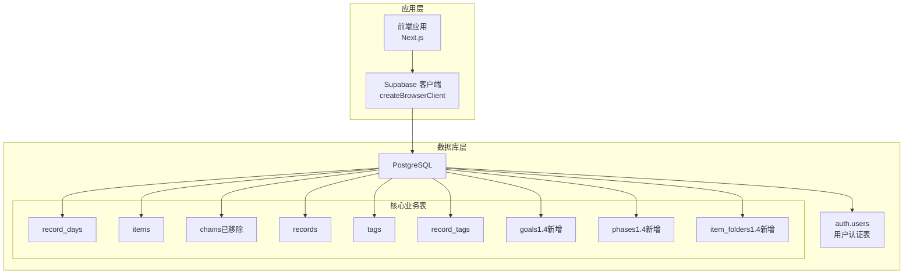
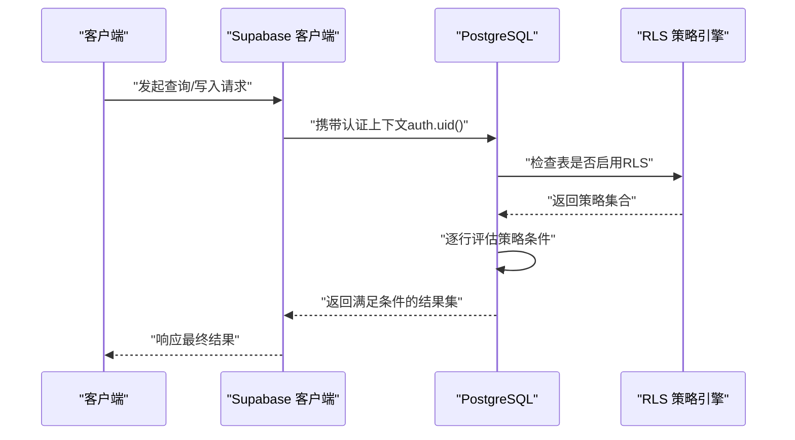
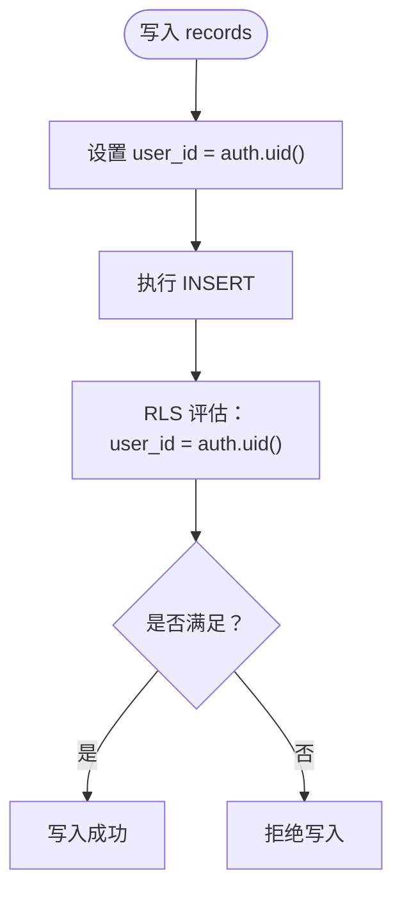
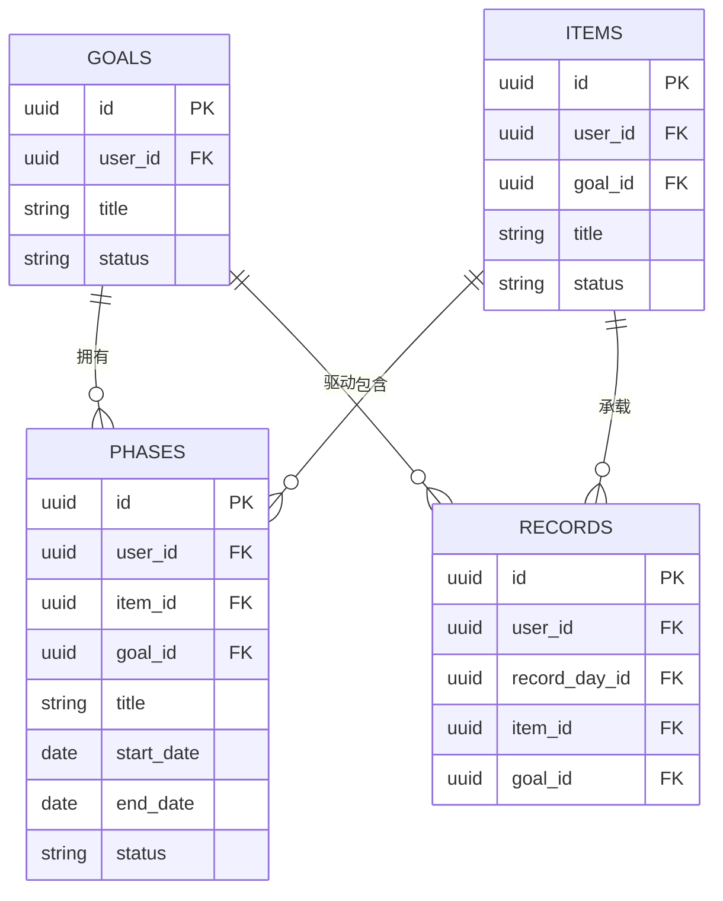
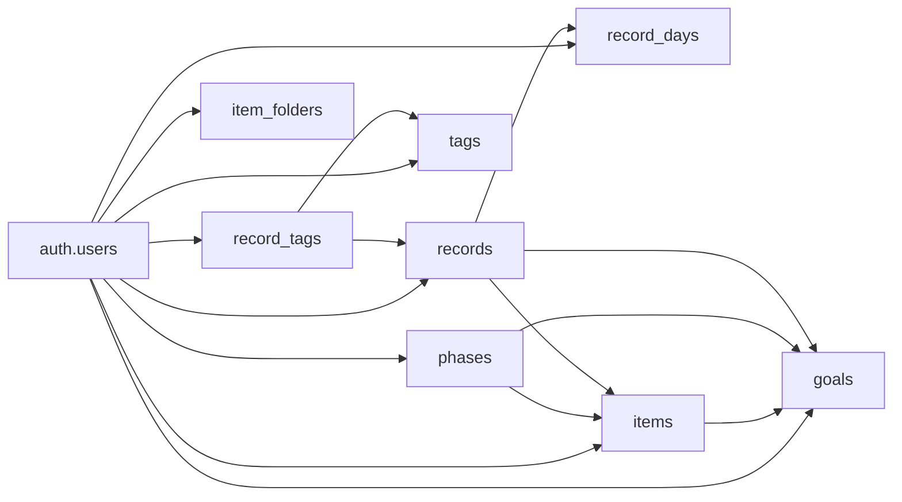

# 行级安全策略

<cite>
**本文引用的文件**
- [001_teto_1_3_records_model.sql](file://sql/001_teto_1_3_records_model.sql)
- [002_drop_chain_structure.sql](file://sql/002_drop_chain_structure.sql)
- [003_teto_1_4_phases_and_goals.sql](file://sql/003_teto_1_4_phases_and_goals.sql)
- [004_teto_1_4_record_type_convergence.sql](file://sql/004_teto_1_4_record_type_convergence.sql)
- [005_teto_1_4_status_chinese_migration.sql](file://sql/005_teto_1_4_status_chinese_migration.sql)
- [006_item_folders.sql](file://sql/006_item_folders.sql)
- [007_record_metric_fields.sql](file://sql/007_record_metric_fields.sql)
- [008_add_raw_input_to_records.sql](file://sql/008_add_raw_input_to_records.sql)
- [002_enable_rls_core_tables.sql](file://sql/保留存档sql/sql1.0.1/002_enable_rls_core_tables.sql)
- [002_disable_rls_dev.sql](file://sql/保留存档sql/sql1.0.0/002_disable_rls_dev.sql)
- [client.ts](file://src/lib/supabase/client.ts)
- [DATA_RULES.md](file://DATA_RULES.md)
</cite>

## 目录
1. [简介](#简介)
2. [项目结构](#项目结构)
3. [核心组件](#核心组件)
4. [架构总览](#架构总览)
5. [详细组件分析](#详细组件分析)
6. [依赖关系分析](#依赖关系分析)
7. [性能考量](#性能考量)
8. [故障排查指南](#故障排查指南)
9. [结论](#结论)
10. [附录](#附录)

## 简介
本文件面向TETO系统的行级安全策略（Row Level Security，简称RLS）实现，系统性阐述PostgreSQL RLS在项目中的工作原理、策略定义与执行机制，以及如何围绕核心数据表构建用户数据隔离、动态绑定与条件判断。文档同时覆盖策略的性能影响、优化建议与监控方法，并提供可操作的配置示例与调试排障流程，帮助开发者在保证数据安全的前提下提升系统稳定性与可维护性。

## 项目结构
TETO的RLS策略主要分布在SQL迁移脚本中，覆盖从1.3版本到1.4版本的数据模型演进。核心表包括记录容器、事项、阶段与目标、标签及关联表等。RLS策略以“每个表启用RLS并在其上定义SELECT/INSERT/UPDATE/DELETE策略”的模式统一实现，确保用户仅能访问自身数据。

图表来源
- [001_teto_1_3_records_model.sql:18-109](file://sql/001_teto_1_3_records_model.sql#L18-L109)
- [003_teto_1_4_phases_and_goals.sql:16-45](file://sql/003_teto_1_4_phases_and_goals.sql#L16-L45)
- [006_item_folders.sql:8-16](file://sql/006_item_folders.sql#L8-L16)
- [client.ts:3-8](file://src/lib/supabase/client.ts#L3-L8)

章节来源
- [001_teto_1_3_records_model.sql:18-109](file://sql/001_teto_1_3_records_model.sql#L18-L109)
- [003_teto_1_4_phases_and_goals.sql:16-45](file://sql/003_teto_1_4_phases_and_goals.sql#L16-L45)
- [006_item_folders.sql:8-16](file://sql/006_item_folders.sql#L8-L16)
- [client.ts:3-8](file://src/lib/supabase/client.ts#L3-L8)

## 核心组件
- 用户认证与会话
  - 应用通过Supabase客户端建立连接，数据库侧使用auth.uid()获取当前登录用户的UUID，作为RLS策略的判定依据。
- 核心业务表与RLS策略
  - record_days、items、records、tags、record_tags：均启用RLS并对每种操作类型（SELECT/INSERT/UPDATE/DELETE）定义策略，策略条件均为“当前用户ID等于记录的user_id”。
  - goals、phases：1.4版本新增，同样启用RLS并采用相同的用户隔离策略。
  - item_folders：1.4版本新增，启用RLS并对每个操作类型定义策略。
  - chains：在1.3版本存在，1.4版本通过迁移脚本被移除，迁移过程中同步清理了相关RLS策略与索引。
- 触发器与约束
  - 记录表与事项表均配置了updated_at自动更新触发器，确保审计字段一致性。
  - 记录表在1.4版本引入了新的字段（如cost、metric_*、duration_minutes、raw_input）以支撑统计与结构化分析，同时保留原有约束与索引策略。

章节来源
- [001_teto_1_3_records_model.sql:197-276](file://sql/001_teto_1_3_records_model.sql#L197-L276)
- [003_teto_1_4_phases_and_goals.sql:86-111](file://sql/003_teto_1_4_phases_and_goals.sql#L86-L111)
- [006_item_folders.sql:28-33](file://sql/006_item_folders.sql#L28-L33)
- [002_drop_chain_structure.sql:27-32](file://sql/002_drop_chain_structure.sql#L27-L32)
- [004_teto_1_4_record_type_convergence.sql:7-19](file://sql/004_teto_1_4_record_type_convergence.sql#L7-L19)
- [007_record_metric_fields.sql:8-19](file://sql/007_record_metric_fields.sql#L8-L19)
- [008_add_raw_input_to_records.sql:9-11](file://sql/008_add_raw_input_to_records.sql#L9-L11)

## 架构总览
下图展示了RLS策略在请求生命周期中的作用位置：当应用发起数据库请求时，PostgreSQL在执行任何DML操作之前，都会根据表级RLS策略对每条记录进行过滤，只有满足条件的记录才会被返回或修改。

图表来源
- [client.ts:3-8](file://src/lib/supabase/client.ts#L3-L8)
- [001_teto_1_3_records_model.sql:197-276](file://sql/001_teto_1_3_records_model.sql#L197-L276)

## 详细组件分析

### 记录容器与记录表（record_days、records）
- 设计要点
  - record_days按用户+日期唯一，用于承载每日汇总信息。
  - records作为最小记录单元，关联record_day、item、tag等，具备丰富的统计字段与时间戳。
- RLS策略
  - 对SELECT/INSERT/UPDATE/DELETE均采用“用户ID=auth.uid()”的强隔离策略，确保跨用户数据完全不可见。
- 索引与约束
  - 为user_id/date、user_id/record_day_id、user_id/occurred_at等组合建立索引，有利于按用户维度快速检索。
  - 记录类型在1.4版本收敛为4类，配合CHECK约束限制取值范围，减少歧义。

图表来源
- [001_teto_1_3_records_model.sql:241-248](file://sql/001_teto_1_3_records_model.sql#L241-L248)

章节来源
- [001_teto_1_3_records_model.sql:18-85](file://sql/001_teto_1_3_records_model.sql#L18-L85)
- [001_teto_1_3_records_model.sql:197-276](file://sql/001_teto_1_3_records_model.sql#L197-L276)
- [004_teto_1_4_record_type_convergence.sql:7-19](file://sql/004_teto_1_4_record_type_convergence.sql#L7-L19)

### 事项与阶段/目标（items、goals、phases）
- 设计要点
  - items承载“主题/事项”，1.4版本新增goal_id外键，形成“目标-阶段-事项”的层级关系。
  - goals定义目标状态，phases描述事项在某时间段内的持续状态与历史标记。
- RLS策略
  - items、goals、phases均启用RLS，策略与记录表一致，保障用户间数据隔离。
- 索引与外键
  - 为items.goal_id、records.goal_id、phases.item_id、phases.goal_id等建立索引，支撑跨表联结与过滤。

图表来源
- [003_teto_1_4_phases_and_goals.sql:16-61](file://sql/003_teto_1_4_phases_and_goals.sql#L16-L61)

章节来源
- [003_teto_1_4_phases_and_goals.sql:16-129](file://sql/003_teto_1_4_phases_and_goals.sql#L16-L129)

### 标签与关联（tags、record_tags）
- 设计要点
  - tags为用户自定义标签，record_tags实现记录与标签的多对多关联。
- RLS策略
  - 与核心表一致，采用“user_id=auth.uid()”的隔离策略。
- 索引
  - 为record_tags的record_id、tag_id建立索引，提升标签查询效率。

章节来源
- [001_teto_1_3_records_model.sql:88-109](file://sql/001_teto_1_3_records_model.sql#L88-L109)
- [001_teto_1_3_records_model.sql:251-276](file://sql/001_teto_1_3_records_model.sql#L251-L276)

### 事项文件夹（item_folders）
- 设计要点
  - 新增item_folders表用于对事项进行分组收纳，items表新增folder_id字段。
- RLS策略
  - 启用RLS并对每种操作类型定义策略，确保用户只能访问自身文件夹与事项。

章节来源
- [006_item_folders.sql:8-33](file://sql/006_item_folders.sql#L8-L33)

### 历史结构迁移（chains）
- 设计要点
  - chains概念在1.3版本存在，1.4版本通过迁移脚本删除，包括触发器、外键字段、索引与RLS策略。
- 影响
  - 清理冗余结构，简化数据模型，降低维护成本。

章节来源
- [002_drop_chain_structure.sql:18-49](file://sql/002_drop_chain_structure.sql#L18-L49)

### 记录字段增强（metric/duration/raw_input）
- 设计要点
  - 新增结构化统计字段（metric_value、metric_unit、metric_name、duration_minutes）与原始输入字段（raw_input），保留自然语言输入以便溯源与二次处理。
- 索引
  - 记录成本字段建立条件索引，便于按花费筛选。

章节来源
- [007_record_metric_fields.sql:8-19](file://sql/007_record_metric_fields.sql#L8-L19)
- [008_add_raw_input_to_records.sql:9-11](file://sql/008_add_raw_input_to_records.sql#L9-L11)

## 依赖关系分析
- 认证依赖
  - RLS策略依赖auth.uid()返回当前用户ID，因此数据库连接必须携带有效的认证上下文。
- 表间依赖
  - records依赖record_days、items、goals；phases依赖items、goals；record_tags依赖records、tags；items依赖goals。
- 策略继承
  - 对于存在外键关联的子表（如daily_record_items、project_logs），早期版本采用EXISTS子查询间接验证父表user_id，当前版本核心表统一采用user_id直连条件，策略更简洁、可读性更强。

图表来源
- [001_teto_1_3_records_model.sql:18-109](file://sql/001_teto_1_3_records_model.sql#L18-L109)
- [003_teto_1_4_phases_and_goals.sql:16-61](file://sql/003_teto_1_4_phases_and_goals.sql#L16-L61)
- [006_item_folders.sql:8-19](file://sql/006_item_folders.sql#L8-L19)

章节来源
- [001_teto_1_3_records_model.sql:18-109](file://sql/001_teto_1_3_records_model.sql#L18-L109)
- [003_teto_1_4_phases_and_goals.sql:16-61](file://sql/003_teto_1_4_phases_and_goals.sql#L16-L61)
- [006_item_folders.sql:8-19](file://sql/006_item_folders.sql#L8-L19)

## 性能考量
- 策略评估开销
  - RLS在每次DML执行时对每行进行条件评估，策略越复杂（如EXISTS子查询）开销越大。当前核心表普遍采用user_id直连条件，评估成本较低。
- 索引优化
  - 为高频过滤字段（如user_id、date、item_id、goal_id）建立复合索引，可显著降低扫描范围。
  - 记录成本字段建立条件索引，仅对非空值建立索引，兼顾查询效率与存储。
- 查询路径
  - 明确查询路径，尽量使用覆盖索引，避免全表扫描与隐式类型转换。
- 监控建议
  - 使用数据库慢查询日志与执行计划分析工具，定期审查RLS相关查询的性能表现。
  - 关注策略变更对热点表的影响，必要时调整索引或拆分查询。

## 故障排查指南
- 常见问题
  - 无法读取数据：确认当前会话是否已登录，auth.uid()是否可用；检查表是否启用RLS且策略是否存在。
  - 写入被拒：核对user_id是否与auth.uid()一致；检查WITH CHECK条件是否满足。
  - 关联表访问异常：早期版本部分子表采用EXISTS子查询验证父表user_id，若父表user_id不匹配会导致拒绝。当前核心表统一采用user_id直连条件，建议优先排查user_id字段是否正确传递。
- 诊断步骤
  - 开发环境临时禁用RLS进行对比测试，定位是否由策略导致的问题。
  - 使用EXPLAIN/EXPLAIN ANALYZE分析查询计划，确认索引命中情况。
  - 核查策略定义与表结构变更历史，确保策略与表结构一致。
- 安全最佳实践
  - 生产环境严禁禁用RLS；开发环境仅在必要时临时禁用并及时恢复。
  - 策略命名清晰，便于审计与维护；避免在策略中使用昂贵的子查询。
  - 对敏感字段（如原始输入）进行最小化暴露，遵循“最小权限”原则。

章节来源
- [002_disable_rls_dev.sql:1-33](file://sql/保留存档sql/sql1.0.0/002_disable_rls_dev.sql#L1-L33)
- [002_enable_rls_core_tables.sql:19-42](file://sql/保留存档sql/sql1.0.1/002_enable_rls_core_tables.sql#L19-L42)

## 结论
TETO的RLS策略以“用户ID直连条件”为核心，覆盖核心业务表与1.4版本新增表，实现了严格的用户数据隔离。通过合理的索引设计与查询路径优化，可在保证安全性的同时维持良好的性能。建议在生产环境中持续监控策略执行与查询计划，结合索引与分区策略进一步优化热点表的访问效率。

## 附录
- RLS策略配置示例（路径）
  - 核心表RLS策略：[001_teto_1_3_records_model.sql:197-276](file://sql/001_teto_1_3_records_model.sql#L197-L276)
  - 目标与阶段RLS策略：[003_teto_1_4_phases_and_goals.sql:86-111](file://sql/003_teto_1_4_phases_and_goals.sql#L86-L111)
  - 事项文件夹RLS策略：[006_item_folders.sql:28-33](file://sql/006_item_folders.sql#L28-L33)
  - 历史RLS策略（1.0版本）：[002_enable_rls_core_tables.sql:19-42](file://sql/保留存档sql/sql1.0.1/002_enable_rls_core_tables.sql#L19-L42)
- 开发环境RLS禁用脚本（路径）
  - [002_disable_rls_dev.sql:1-33](file://sql/保留存档sql/sql1.0.0/002_disable_rls_dev.sql#L1-L33)
- Supabase客户端初始化（路径）
  - [client.ts:3-8](file://src/lib/supabase/client.ts#L3-L8)
- 数据规则与统计口径（路径）
  - [DATA_RULES.md:1-174](file://DATA_RULES.md#L1-L174)