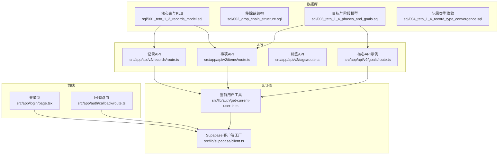
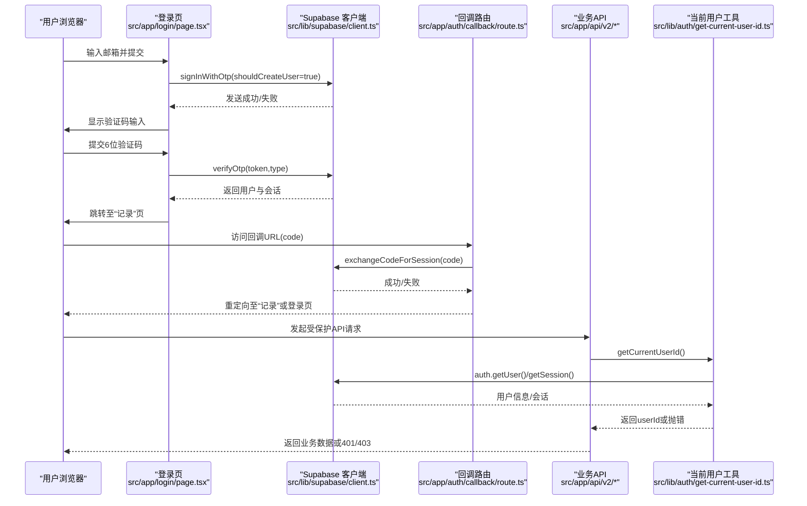
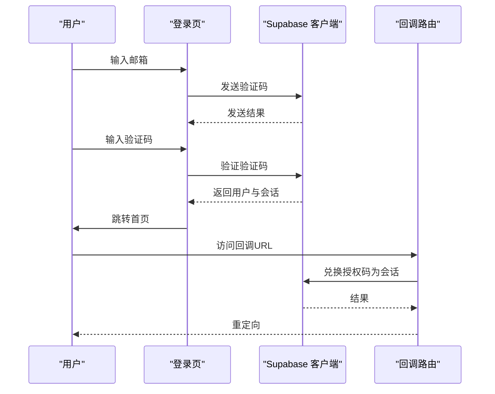
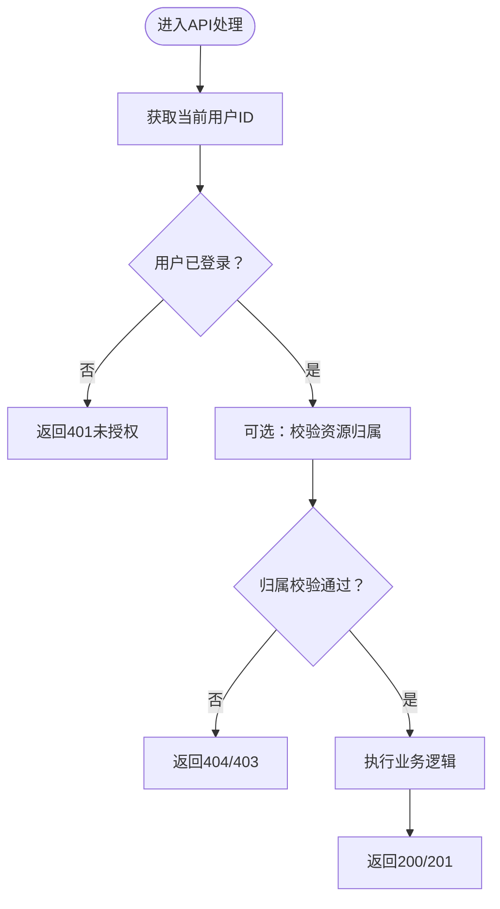
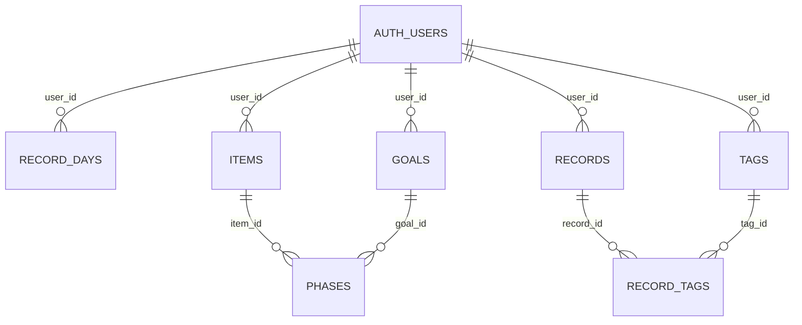
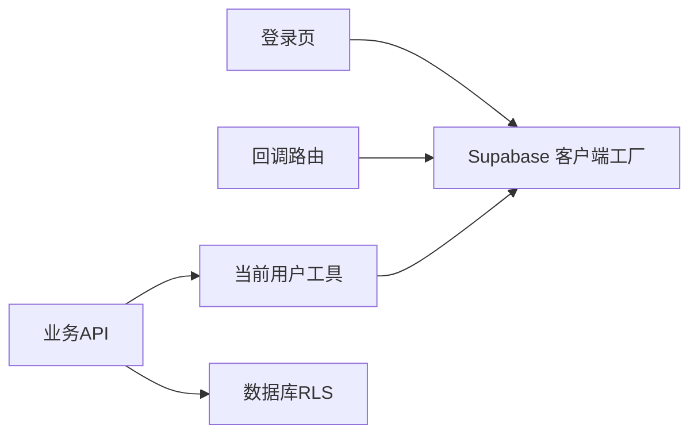

# 认证与授权

<cite>
**本文引用的文件**
- [src/app/auth/callback/route.ts](file://src/app/auth/callback/route.ts)
- [src/app/login/page.tsx](file://src/app/login/page.tsx)
- [src/lib/supabase/client.ts](file://src/lib/supabase/client.ts)
- [src/lib/auth/get-current-user-id.ts](file://src/lib/auth/get-current-user-id.ts)
- [sql/001_teto_1_3_records_model.sql](file://sql/001_teto_1_3_records_model.sql)
- [sql/002_drop_chain_structure.sql](file://sql/002_drop_chain_structure.sql)
- [sql/003_teto_1_4_phases_and_goals.sql](file://sql/003_teto_1_4_phases_and_goals.sql)
- [sql/004_teto_1_4_record_type_convergence.sql](file://sql/004_teto_1_4_record_type_convergence.sql)
- [src/app/api/v2/records/route.ts](file://src/app/api/v2/records/route.ts)
- [src/app/api/v2/items/route.ts](file://src/app/api/v2/items/route.ts)
- [src/app/api/v2/goals/route.ts](file://src/app/api/v2/goals/route.ts)
- [src/app/api/v2/phases/route.ts](file://src/app/api/v2/phases/route.ts)
</cite>

## 目录
1. [简介](#简介)
2. [项目结构](#项目结构)
3. [核心组件](#核心组件)
4. [架构总览](#架构总览)
5. [详细组件分析](#详细组件分析)
6. [依赖关系分析](#依赖关系分析)
7. [性能考量](#性能考量)
8. [故障排查指南](#故障排查指南)
9. [结论](#结论)
10. [附录](#附录)

## 简介
本文件系统性梳理 TETO 的认证与授权体系，覆盖用户认证流程、权限控制与行级安全（RLS）策略、Supabase Auth 集成方式、Magic Link 登录机制、会话管理策略、权限继承与数据隔离规则、认证中间件实现要点、安全最佳实践与常见问题防护，以及用户注册、密码重置与账户管理等技术实现路径。内容从基础概念到高级安全配置层层递进，帮助开发者与运维人员快速理解并安全地扩展系统。

## 项目结构
围绕认证与授权的关键文件分布如下：
- 前端登录与回调：登录页、回调处理
- Supabase 客户端封装：浏览器端客户端工厂
- 用户上下文与开发模式：获取当前用户 ID、判断开发模式
- 数据库与 RLS：核心表结构、RLS 策略、索引
- API 层：受保护的业务接口，统一鉴权入口

图表来源
- [src/app/login/page.tsx:1-196](file://src/app/login/page.tsx#L1-L196)
- [src/app/auth/callback/route.ts:1-19](file://src/app/auth/callback/route.ts#L1-L19)
- [src/lib/supabase/client.ts:1-9](file://src/lib/supabase/client.ts#L1-L9)
- [src/lib/auth/get-current-user-id.ts:1-88](file://src/lib/auth/get-current-user-id.ts#L1-L88)
- [sql/001_teto_1_3_records_model.sql:1-300](file://sql/001_teto_1_3_records_model.sql#L1-L300)
- [sql/002_drop_chain_structure.sql:1-49](file://sql/002_drop_chain_structure.sql#L1-L49)
- [sql/003_teto_1_4_phases_and_goals.sql:1-130](file://sql/003_teto_1_4_phases_and_goals.sql#L1-L130)
- [sql/004_teto_1_4_record_type_convergence.sql:1-20](file://sql/004_teto_1_4_record_type_convergence.sql#L1-L20)
- [src/app/api/v2/records/route.ts:1-86](file://src/app/api/v2/records/route.ts#L1-L86)
- [src/app/api/v2/items/route.ts:1-47](file://src/app/api/v2/items/route.ts#L1-L47)
- [src/app/api/v2/goals/route.ts:1-49](file://src/app/api/v2/goals/route.ts#L1-L49)
- [src/app/api/v2/phases/route.ts:1-72](file://src/app/api/v2/phases/route.ts#L1-L72)

章节来源
- [src/app/login/page.tsx:1-196](file://src/app/login/page.tsx#L1-L196)
- [src/app/auth/callback/route.ts:1-19](file://src/app/auth/callback/route.ts#L1-L19)
- [src/lib/supabase/client.ts:1-9](file://src/lib/supabase/client.ts#L1-L9)
- [src/lib/auth/get-current-user-id.ts:1-88](file://src/lib/auth/get-current-user-id.ts#L1-L88)
- [sql/001_teto_1_3_records_model.sql:1-300](file://sql/001_teto_1_3_records_model.sql#L1-L300)
- [sql/002_drop_chain_structure.sql:1-49](file://sql/002_drop_chain_structure.sql#L1-L49)
- [sql/003_teto_1_4_phases_and_goals.sql:1-130](file://sql/003_teto_1_4_phases_and_goals.sql#L1-L130)
- [sql/004_teto_1_4_record_type_convergence.sql:1-20](file://sql/004_teto_1_4_record_type_convergence.sql#L1-L20)
- [src/app/api/v2/records/route.ts:1-86](file://src/app/api/v2/records/route.ts#L1-L86)
- [src/app/api/v2/items/route.ts:1-47](file://src/app/api/v2/items/route.ts#L1-L47)
- [src/app/api/v2/goals/route.ts:1-49](file://src/app/api/v2/goals/route.ts#L1-L49)
- [src/app/api/v2/phases/route.ts:1-72](file://src/app/api/v2/phases/route.ts#L1-L72)

## 核心组件
- Supabase 浏览器客户端工厂：封装 NEXT_PUBLIC_SUPABASE_URL 与 NEXT_PUBLIC_SUPABASE_ANON_KEY，统一创建 Supabase 客户端实例，供前端调用认证与数据 API。
- 当前用户工具：支持开发模式与生产模式切换；在开发模式下返回固定用户 ID；在生产模式下通过 Supabase 客户端获取当前登录用户，未登录时抛出错误。
- 登录页（Magic Link）：前端表单提交邮箱，调用 Supabase 发送 OTP；收到验证码后调用验证接口，成功后跳转至记录页。
- 回调路由：处理 OAuth/魔法链接回调，交换授权码换取会话，成功则重定向至记录页，否则重定向至登录页并携带错误参数。
- API 层统一鉴权：各业务 API 在处理请求前调用当前用户工具获取用户 ID，未登录或获取失败返回 401；部分接口还校验资源归属（如事项/阶段是否属于当前用户）。
- RLS 策略：核心业务表均启用行级安全，并为每张表定义 select/insert/update/delete 策略，基于 auth.uid() 与 user_id 字段实现用户级数据隔离。

章节来源
- [src/lib/supabase/client.ts:1-9](file://src/lib/supabase/client.ts#L1-L9)
- [src/lib/auth/get-current-user-id.ts:1-88](file://src/lib/auth/get-current-user-id.ts#L1-L88)
- [src/app/login/page.tsx:1-196](file://src/app/login/page.tsx#L1-L196)
- [src/app/auth/callback/route.ts:1-19](file://src/app/auth/callback/route.ts#L1-L19)
- [src/app/api/v2/records/route.ts:1-86](file://src/app/api/v2/records/route.ts#L1-L86)
- [src/app/api/v2/items/route.ts:1-47](file://src/app/api/v2/items/route.ts#L1-L47)
- [src/app/api/v2/goals/route.ts:1-49](file://src/app/api/v2/goals/route.ts#L1-L49)
- [src/app/api/v2/phases/route.ts:1-72](file://src/app/api/v2/phases/route.ts#L1-L72)
- [sql/001_teto_1_3_records_model.sql:191-277](file://sql/001_teto_1_3_records_model.sql#L191-L277)
- [sql/003_teto_1_4_phases_and_goals.sql:82-112](file://sql/003_teto_1_4_phases_and_goals.sql#L82-L112)

## 架构总览
下图展示从前端登录到 API 请求的端到端认证与授权流程，包括 Magic Link 登录、会话建立、RLS 数据隔离与权限校验。

图表来源
- [src/app/login/page.tsx:17-86](file://src/app/login/page.tsx#L17-L86)
- [src/app/auth/callback/route.ts:4-18](file://src/app/auth/callback/route.ts#L4-L18)
- [src/lib/supabase/client.ts:1-9](file://src/lib/supabase/client.ts#L1-L9)
- [src/lib/auth/get-current-user-id.ts:15-40](file://src/lib/auth/get-current-user-id.ts#L15-L40)
- [src/app/api/v2/records/route.ts:7-42](file://src/app/api/v2/records/route.ts#L7-L42)

## 详细组件分析

### 组件A：Magic Link 登录与会话管理
- 登录页采用两步流程：第一步发送验证码（Magic Link），第二步验证验证码并建立会话。
- 前端通过 Supabase 客户端调用发送与验证接口，成功后写入本地会话并跳转。
- 回调路由用于处理外部回调（如 OAuth），将授权码兑换为会话并进行重定向。
- 会话状态可通过客户端 getSession 验证，确保登录态有效。

图表来源
- [src/app/login/page.tsx:17-86](file://src/app/login/page.tsx#L17-L86)
- [src/app/auth/callback/route.ts:4-18](file://src/app/auth/callback/route.ts#L4-L18)
- [src/lib/supabase/client.ts:1-9](file://src/lib/supabase/client.ts#L1-L9)

章节来源
- [src/app/login/page.tsx:17-86](file://src/app/login/page.tsx#L17-L86)
- [src/app/auth/callback/route.ts:4-18](file://src/app/auth/callback/route.ts#L4-L18)
- [src/lib/supabase/client.ts:1-9](file://src/lib/supabase/client.ts#L1-L9)

### 组件B：API 层统一鉴权与资源归属校验
- 各业务 API 在处理请求前调用当前用户工具获取 userId，未登录或获取失败返回 401。
- 部分接口进一步校验资源归属：例如创建阶段前检查所属事项是否属于当前用户，避免越权修改他人数据。
- 该模式结合数据库 RLS 实现“双重保障”，既保证应用层鉴权，又通过 RLS 在存储层实现数据隔离。

图表来源
- [src/app/api/v2/records/route.ts:44-85](file://src/app/api/v2/records/route.ts#L44-L85)
- [src/app/api/v2/phases/route.ts:32-71](file://src/app/api/v2/phases/route.ts#L32-L71)
- [src/lib/auth/get-current-user-id.ts:15-40](file://src/lib/auth/get-current-user-id.ts#L15-L40)

章节来源
- [src/app/api/v2/records/route.ts:7-42](file://src/app/api/v2/records/route.ts#L7-L42)
- [src/app/api/v2/records/route.ts:44-85](file://src/app/api/v2/records/route.ts#L44-L85)
- [src/app/api/v2/items/route.ts:6-26](file://src/app/api/v2/items/route.ts#L6-L26)
- [src/app/api/v2/goals/route.ts:6-28](file://src/app/api/v2/goals/route.ts#L6-L28)
- [src/app/api/v2/phases/route.ts:7-30](file://src/app/api/v2/phases/route.ts#L7-L30)
- [src/app/api/v2/phases/route.ts:32-71](file://src/app/api/v2/phases/route.ts#L32-L71)
- [src/lib/auth/get-current-user-id.ts:15-40](file://src/lib/auth/get-current-user-id.ts#L15-L40)

### 组件C：行级安全策略（RLS）与数据隔离
- 核心业务表（记录日、事项、记录、标签、记录-标签、目标、阶段）均启用 RLS。
- 策略以 auth.uid() = user_id 为核心，确保用户只能访问自己的数据；同时对 select/insert/update/delete 分别配置策略，防止越权。
- 通过外键约束与触发器（如记录-链一致性、updated_at 自动更新）保障数据完整性与一致性。
- 索引覆盖常用过滤条件（如 user_id+date、user_id+status、cost 等），提升查询性能。

图表来源
- [sql/001_teto_1_3_records_model.sql:18-109](file://sql/001_teto_1_3_records_model.sql#L18-L109)
- [sql/001_teto_1_3_records_model.sql:194-277](file://sql/001_teto_1_3_records_model.sql#L194-L277)
- [sql/003_teto_1_4_phases_and_goals.sql:16-61](file://sql/003_teto_1_4_phases_and_goals.sql#L16-L61)
- [sql/003_teto_1_4_phases_and_goals.sql:85-112](file://sql/003_teto_1_4_phases_and_goals.sql#L85-L112)

章节来源
- [sql/001_teto_1_3_records_model.sql:191-277](file://sql/001_teto_1_3_records_model.sql#L191-L277)
- [sql/002_drop_chain_structure.sql:15-49](file://sql/002_drop_chain_structure.sql#L15-L49)
- [sql/003_teto_1_4_phases_and_goals.sql:82-112](file://sql/003_teto_1_4_phases_and_goals.sql#L82-L112)
- [sql/004_teto_1_4_record_type_convergence.sql:7-20](file://sql/004_teto_1_4_record_type_convergence.sql#L7-L20)

### 组件D：权限继承与资源归属规则
- 用户 ID 作为数据所有权标识贯穿多表：记录、标签、目标、阶段等均包含 user_id 外键。
- API 层在创建/更新阶段时，额外校验所属事项是否属于当前用户，形成“二级归属校验”，降低 RLS 失效风险。
- RLS 策略仅依赖 user_id 字段，简化了权限模型，避免复杂的角色/组权限叠加。

章节来源
- [src/app/api/v2/phases/route.ts:47-61](file://src/app/api/v2/phases/route.ts#L47-L61)
- [sql/001_teto_1_3_records_model.sql:66-85](file://sql/001_teto_1_3_records_model.sql#L66-L85)
- [sql/003_teto_1_4_phases_and_goals.sql:30-45](file://sql/003_teto_1_4_phases_and_goals.sql#L30-L45)

### 组件E：认证中间件与会话管理
- 中间件建议：在 Next.js 中间件中读取 Cookie 或 Authorization 头，调用 Supabase 服务端客户端进行会话校验；未通过则拦截并返回 401。
- 会话持久化：Supabase 会在浏览器端存储会话，前端通过 getSession 验证；服务端通过服务端客户端读取会话。
- 开发模式：通过环境变量开启开发模式，绕过真实认证，便于本地调试与演示。

章节来源
- [src/lib/auth/get-current-user-id.ts:15-40](file://src/lib/auth/get-current-user-id.ts#L15-L40)
- [src/lib/supabase/client.ts:1-9](file://src/lib/supabase/client.ts#L1-L9)

### 组件F：用户注册、密码重置与账户管理
- 注册与登录：采用 Magic Link（邮箱验证码）登录，首次登录可由 Supabase 自动创建用户。
- 密码重置：建议通过 Supabase Auth 提供的密码重置流程，前端引导用户点击邮件中的重置链接。
- 账户管理：通过 Supabase Auth 管理用户资料、二次验证、连接第三方账号等。

章节来源
- [src/app/login/page.tsx:27-32](file://src/app/login/page.tsx#L27-L32)
- [src/app/login/page.tsx:60-64](file://src/app/login/page.tsx#L60-L64)

## 依赖关系分析
- 前端依赖 Supabase 客户端工厂，统一创建客户端实例。
- API 层依赖当前用户工具，统一获取用户 ID 并进行鉴权。
- 数据库依赖 RLS 策略与外键约束，实现数据隔离与一致性。
- 回调路由依赖 Supabase 客户端进行授权码兑换。

图表来源
- [src/app/login/page.tsx:1-196](file://src/app/login/page.tsx#L1-L196)
- [src/app/auth/callback/route.ts:1-19](file://src/app/auth/callback/route.ts#L1-L19)
- [src/lib/supabase/client.ts:1-9](file://src/lib/supabase/client.ts#L1-L9)
- [src/lib/auth/get-current-user-id.ts:1-88](file://src/lib/auth/get-current-user-id.ts#L1-L88)
- [src/app/api/v2/records/route.ts:1-86](file://src/app/api/v2/records/route.ts#L1-L86)

章节来源
- [src/app/login/page.tsx:1-196](file://src/app/login/page.tsx#L1-L196)
- [src/app/auth/callback/route.ts:1-19](file://src/app/auth/callback/route.ts#L1-L19)
- [src/lib/supabase/client.ts:1-9](file://src/lib/supabase/client.ts#L1-L9)
- [src/lib/auth/get-current-user-id.ts:1-88](file://src/lib/auth/get-current-user-id.ts#L1-L88)
- [src/app/api/v2/records/route.ts:1-86](file://src/app/api/v2/records/route.ts#L1-L86)

## 性能考量
- RLS 查询：RLS 策略基于 user_id 字段，配合相应索引可显著降低查询成本；建议为高频过滤字段建立复合索引。
- 触发器：updated_at 自动更新触发器在写入频繁场景下可能带来额外开销，建议评估是否需要在高并发写入场景禁用或优化。
- 缓存：前端可对读多写少的数据进行缓存，减少重复查询；注意缓存失效与 RLS 隔离的边界。
- 会话：浏览器端会话存储在 Cookie 中，建议启用安全属性（HttpOnly、Secure、SameSite）并定期刷新。

## 故障排查指南
- 登录失败：检查 Supabase 配置（URL 与匿名密钥）、网络连通性、邮箱服务可用性。
- 回调无会话：确认回调路由正确处理授权码并调用会话兑换接口；检查浏览器 Cookie 设置。
- 401 未授权：确认前端已正确设置会话，服务端能读取到当前用户；检查开发模式开关。
- 资源归属错误：当创建阶段时报“事项不属于当前用户”，需检查前端传参与后端校验逻辑。
- RLS 生效异常：确认表已启用 RLS、策略已创建且未被误删；检查 user_id 字段是否正确写入。

章节来源
- [src/app/login/page.tsx:34-48](file://src/app/login/page.tsx#L34-L48)
- [src/app/auth/callback/route.ts:8-17](file://src/app/auth/callback/route.ts#L8-L17)
- [src/app/api/v2/records/route.ts:78-84](file://src/app/api/v2/records/route.ts#L78-L84)
- [src/app/api/v2/phases/route.ts:54-61](file://src/app/api/v2/phases/route.ts#L54-L61)
- [sql/001_teto_1_3_records_model.sql:197-206](file://sql/001_teto_1_3_records_model.sql#L197-L206)

## 结论
TETO 的认证与授权体系以 Supabase Auth 为基础，结合前端 Magic Link 登录、服务端统一鉴权与数据库 RLS 策略，实现了清晰的用户数据隔离与权限控制。通过开发模式与严格的资源归属校验，系统在保证安全性的同时兼顾了开发效率。建议在生产环境中完善中间件、强化会话安全与监控告警，并持续优化索引与触发器以提升性能。

## 附录
- 环境变量与开发模式：通过环境变量控制开发模式与开发用户 ID，便于本地调试。
- 数据模型演进：记录类型收敛、目标与阶段模型引入、链结构移除等迁移脚本体现了数据模型的演进与优化。

章节来源
- [src/lib/auth/get-current-user-id.ts:6-13](file://src/lib/auth/get-current-user-id.ts#L6-L13)
- [sql/004_teto_1_4_record_type_convergence.sql:7-20](file://sql/004_teto_1_4_record_type_convergence.sql#L7-L20)
- [sql/003_teto_1_4_phases_and_goals.sql:16-61](file://sql/003_teto_1_4_phases_and_goals.sql#L16-L61)
- [sql/002_drop_chain_structure.sql:15-49](file://sql/002_drop_chain_structure.sql#L15-L49)