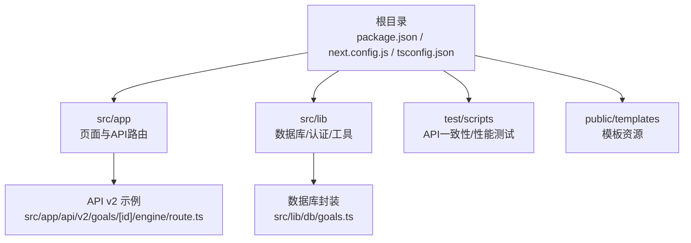
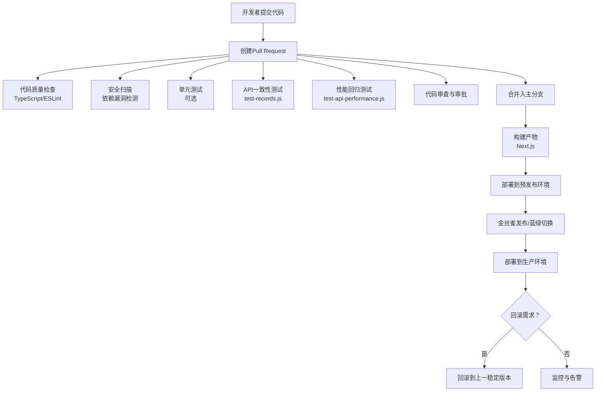
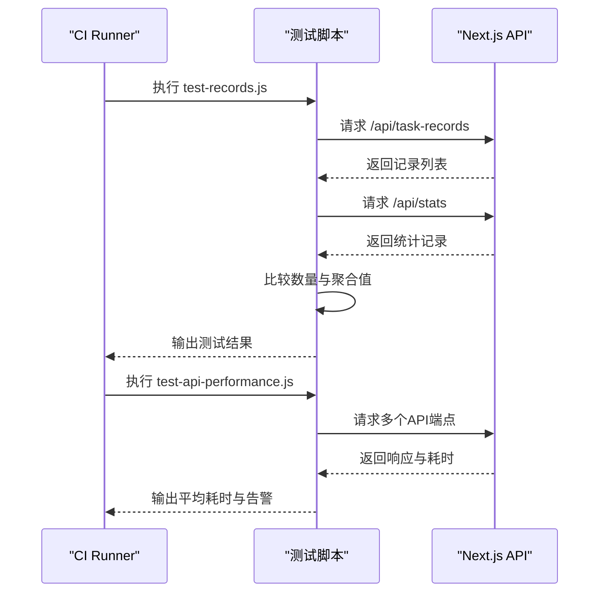
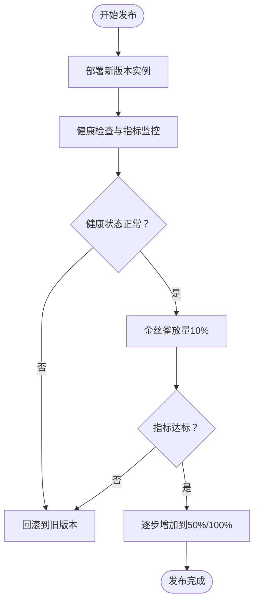
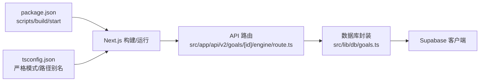

# CI/CD流水线

<cite>
**本文引用的文件**
- [package.json](file://package.json)
- [next.config.js](file://next.config.js)
- [tsconfig.json](file://tsconfig.json)
- [test-records.js](file://test/scripts/test-records.js)
- [test-api-performance.js](file://test/scripts/test-api-performance.js)
- [test-accumulated-values.js](file://test/scripts/test-accumulated-values.js)
- [route.ts](file://src/app/api/v2/goals/[id]/engine/route.ts)
- [goals.ts](file://src/lib/db/goals.ts)
</cite>

## 目录
1. [简介](#简介)
2. [项目结构](#项目结构)
3. [核心组件](#核心组件)
4. [架构总览](#架构总览)
5. [详细组件分析](#详细组件分析)
6. [依赖关系分析](#依赖关系分析)
7. [性能考量](#性能考量)
8. [故障排查指南](#故障排查指南)
9. [结论](#结论)
10. [附录](#附录)

## 简介
本指南面向TETO项目的持续集成与持续交付（CI/CD）流水线配置，覆盖以下主题：
- 自动化构建、测试与部署流程
- 代码质量检查、安全扫描与依赖更新策略
- 分支保护规则、合并策略与发布流程
- 自动化测试集成、部署审批流程与回滚机制
- 多环境部署策略与蓝绿部署/金丝雀发布配置

本指南以Next.js应用与TypeScript技术栈为基础，结合项目现有脚本与API端点，给出可落地的CI/CD实践建议。

## 项目结构
TETO为基于Next.js的应用，采用TypeScript与TailwindCSS，核心目录与职责概览如下：
- 根目录：包管理与构建配置（package.json、next.config.js、tsconfig.json）
- src/app：页面与API路由（含v2 API示例）
- src/lib：数据库与业务逻辑封装（如Supabase访问）
- test/scripts：本地API一致性与性能测试脚本
- public/templates：模板资源（历史导入模板）

**图表来源**
- [package.json](file://package.json)
- [next.config.js](file://next.config.js)
- [tsconfig.json](file://tsconfig.json)
- [route.ts](file://src/app/api/v2/goals/[id]/engine/route.ts)
- [goals.ts](file://src/lib/db/goals.ts)

**章节来源**
- [package.json](file://package.json)
- [next.config.js](file://next.config.js)
- [tsconfig.json](file://tsconfig.json)

## 核心组件
- 构建与打包
  - 使用Next.js构建命令生成静态产物与服务端运行时
  - TypeScript编译严格模式与路径别名配置确保类型安全与模块解析
- 测试与验证
  - 提供API一致性与性能测试脚本，便于CI中执行
  - 可扩展至单元测试与端到端测试框架
- 部署目标
  - 支持传统服务器部署与容器化部署（Docker镜像）
  - 可对接云平台（如Vercel、Railway、Render等）或自建Kubernetes集群

**章节来源**
- [package.json](file://package.json)
- [tsconfig.json](file://tsconfig.json)

## 架构总览
下图展示从代码提交到多环境部署的典型流水线：

## 详细组件分析

### 代码质量检查（Lint）
- 类型检查与格式化
  - 利用TypeScript严格模式与路径别名，确保类型安全与模块解析一致性
  - 在CI中执行类型检查与格式化校验，失败即阻断流水线
- 规则建议
  - ESLint + TypeScript Parser
  - TailwindCSS类名排序与冲突检查
  - 忽略node_modules与构建输出目录

**章节来源**
- [tsconfig.json](file://tsconfig.json)

### 安全扫描与依赖更新
- 依赖漏洞扫描
  - 使用npm audit或Snyk/Dependabot定期扫描
  - 对高危漏洞设置自动PR修复或手动阻断
- 依赖更新策略
  - SemVer语义化版本范围
  - 定期（如每周）自动提交依赖更新PR，通过CI验证后人工批准
- 敏感信息防护
  - 秘钥与令牌使用CI变量管理
  - 禁止将敏感信息提交到仓库

### 自动化测试集成
- API一致性测试
  - 使用现有脚本作为CI步骤：对比不同API端点返回数据的一致性
  - 建议在本地启动Next.js开发服务器后执行，或在CI中使用服务启动器
- 性能回归测试
  - 使用现有脚本对关键API进行多次请求取平均耗时，设定阈值告警
- 单元/集成测试（建议）
  - 引入Jest/React Testing Library进行组件与工具函数测试
  - 引入Playwright/Cypress进行端到端测试

**图表来源**
- [test-records.js](file://test/scripts/test-records.js)
- [test-api-performance.js](file://test/scripts/test-api-performance.js)

**章节来源**
- [test-records.js](file://test/scripts/test-records.js)
- [test-api-performance.js](file://test/scripts/test-api-performance.js)

### 部署审批流程与回滚机制
- 审批流程
  - 预发布环境：自动部署，无需人工审批
  - 生产环境：需要至少一名维护者批准后方可部署
- 回滚机制
  - 采用版本标签与镜像标签管理
  - 发生问题时一键回滚至上一个稳定版本
  - 记录回滚原因与责任人，触发告警通知

### 多环境部署策略
- 环境划分
  - 开发：本地或专用沙盒
  - 预发布：预上线验证环境
  - 生产：线上正式环境
- 配置分离
  - 不同环境使用独立的环境变量与数据库连接
  - 通过CI变量注入，避免硬编码

### 蓝绿部署与金丝雀发布
- 蓝绿部署
  - 同时维护两套生产实例，切换流量实现零停机
  - 适用于变更风险较低的场景
- 金丝雀发布
  - 将少量流量切向新版本，逐步扩大比例
  - 结合健康检查与指标阈值（如错误率、P95延迟）自动控制流量

## 依赖关系分析
- 构建链路
  - package.json定义的脚本驱动Next.js构建与启动
  - tsconfig.json的严格模式与路径别名影响编译与类型检查
- API与数据库交互
  - API路由调用数据库封装层，封装层通过Supabase客户端访问数据库
  - 量化引擎API示例展示了鉴权、参数解析与错误处理流程

**图表来源**
- [package.json](file://package.json)
- [tsconfig.json](file://tsconfig.json)
- [route.ts](file://src/app/api/v2/goals/[id]/engine/route.ts)
- [goals.ts](file://src/lib/db/goals.ts)

**章节来源**
- [package.json](file://package.json)
- [tsconfig.json](file://tsconfig.json)
- [route.ts](file://src/app/api/v2/goals/[id]/engine/route.ts)
- [goals.ts](file://src/lib/db/goals.ts)

## 性能考量
- 构建性能
  - 合理拆分页面与组件，减少首屏加载体积
  - 使用Next.js内置的代码分割与懒加载
- 运行时性能
  - 对关键API端点进行性能基准测试，建立阈值
  - 使用缓存策略与CDN加速静态资源
- 监控与告警
  - 集成APM与日志系统，对异常与性能退化及时告警

## 故障排查指南
- 构建失败
  - 检查TypeScript编译错误与类型不匹配
  - 确认路径别名与模块解析配置
- 测试失败
  - API一致性测试失败：核对端点返回结构与字段
  - 性能测试失败：定位慢查询与网络延迟
- 部署失败
  - 环境变量缺失或权限不足
  - 容器镜像拉取失败或端口占用

**章节来源**
- [tsconfig.json](file://tsconfig.json)
- [test-records.js](file://test/scripts/test-records.js)
- [test-api-performance.js](file://test/scripts/test-api-performance.js)

## 结论
通过将现有测试脚本与现代化CI/CD工具结合，TETO项目可以实现高质量、可追溯且低风险的交付流程。建议优先落地：
- 代码质量与安全扫描
- API一致性与性能回归测试
- 预发布自动部署与生产审批
- 金丝雀发布与自动回滚

## 附录
- 环境变量建议
  - NEXT_PUBLIC_SUPABASE_URL、NEXT_PUBLIC_SUPABASE_ANON_KEY
  - DATABASE_URL（用于数据库迁移）
  - NODE_ENV（开发/预发布/生产）
- 分支保护规则建议
  - 主分支需通过CI检查与审批
  - 禁止直接推送主分支
  - 强制要求Pull Request与代码审查