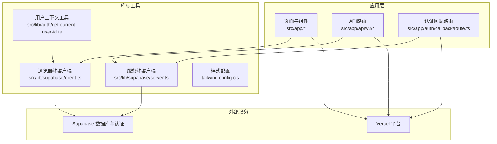
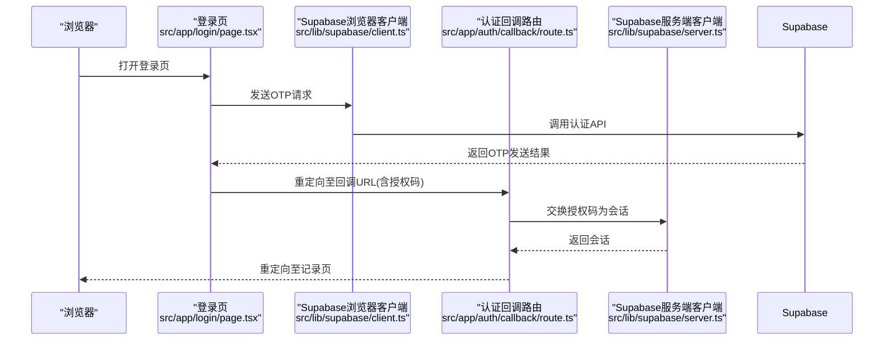
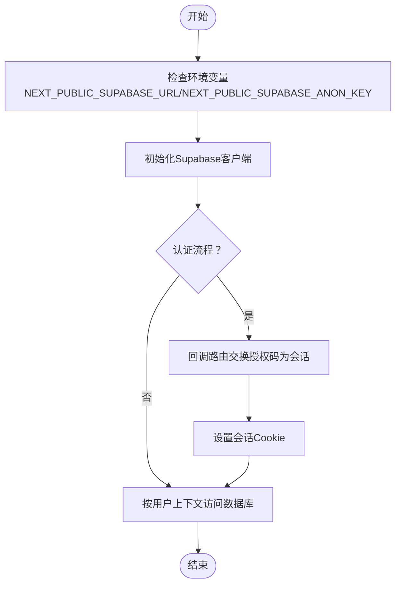
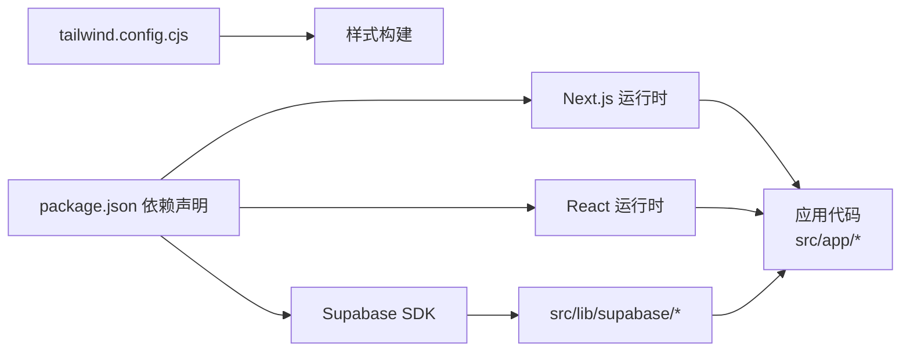

# 云平台部署

<cite>
**本文引用的文件**
- [package.json](file://package.json)
- [next.config.js](file://next.config.js)
- [README.md](file://README.md)
- [src/lib/supabase/client.ts](file://src/lib/supabase/client.ts)
- [src/lib/supabase/server.ts](file://src/lib/supabase/server.ts)
- [src/lib/auth/get-current-user-id.ts](file://src/lib/auth/get-current-user-id.ts)
- [src/app/auth/callback/route.ts](file://src/app/auth/callback/route.ts)
- [src/app/login/page.tsx](file://src/app/login/page.tsx)
- [src/app/api/v2/records/route.ts](file://src/app/api/v2/records/route.ts)
- [src/app/api/v2/goals/route.ts](file://src/app/api/v2/goals/route.ts)
- [tailwind.config.cjs](file://tailwind.config.cjs)
</cite>

## 目录
1. [简介](#简介)
2. [项目结构](#项目结构)
3. [核心组件](#核心组件)
4. [架构总览](#架构总览)
5. [详细组件分析](#详细组件分析)
6. [依赖分析](#依赖分析)
7. [性能考虑](#性能考虑)
8. [故障排查指南](#故障排查指南)
9. [结论](#结论)
10. [附录](#附录)

## 简介
本指南面向TETO项目的云平台部署，重点覆盖以下内容：
- Vercel部署流程：项目导入、环境变量配置、域名绑定与HTTPS设置
- Supabase数据库配置：生产环境URL设置、认证配置与安全策略
- 其他云平台（AWS、Google Cloud）的部署选项与配置思路
- CDN、缓存与负载均衡配置建议
- 多环境管理（开发、测试、生产）与环境隔离策略

## 项目结构
TETO基于Next.js 16 App Router，前端采用TypeScript与Tailwind CSS，后端API通过Next.js API Routes实现，数据层使用Supabase（PostgreSQL + Auth）。项目通过环境变量控制运行模式与数据库连接。

**图示来源**
- [src/app/login/page.tsx:1-196](file://src/app/login/page.tsx#L1-L196)
- [src/app/api/v2/records/route.ts:1-86](file://src/app/api/v2/records/route.ts#L1-L86)
- [src/app/api/v2/goals/route.ts:1-49](file://src/app/api/v2/goals/route.ts#L1-L49)
- [src/app/auth/callback/route.ts:1-19](file://src/app/auth/callback/route.ts#L1-L19)
- [src/lib/supabase/client.ts:1-9](file://src/lib/supabase/client.ts#L1-L9)
- [src/lib/supabase/server.ts:1-36](file://src/lib/supabase/server.ts#L1-L36)
- [src/lib/auth/get-current-user-id.ts:1-88](file://src/lib/auth/get-current-user-id.ts#L1-L88)
- [tailwind.config.cjs:1-61](file://tailwind.config.cjs#L1-L61)

**章节来源**
- [package.json:1-44](file://package.json#L1-L44)
- [next.config.js:1-4](file://next.config.js#L1-L4)
- [README.md:1-126](file://README.md#L1-L126)

## 核心组件
- 浏览器端Supabase客户端：用于前端认证与数据访问，读取公共环境变量进行初始化。
- 服务端Supabase客户端：在服务端路由中使用，根据开发/生产模式切换密钥，并通过Cookie同步会话。
- 认证上下文工具：在开发模式下返回测试用户ID，在生产模式下从会话获取当前用户。
- 认证回调路由：处理第三方登录回调，交换授权码为会话并重定向。
- API路由：统一鉴权与数据访问，调用数据库层接口。
- 构建与样式：Next.js构建配置与Tailwind CSS样式体系。

**章节来源**
- [src/lib/supabase/client.ts:1-9](file://src/lib/supabase/client.ts#L1-L9)
- [src/lib/supabase/server.ts:1-36](file://src/lib/supabase/server.ts#L1-L36)
- [src/lib/auth/get-current-user-id.ts:1-88](file://src/lib/auth/get-current-user-id.ts#L1-L88)
- [src/app/auth/callback/route.ts:1-19](file://src/app/auth/callback/route.ts#L1-L19)
- [src/app/api/v2/records/route.ts:1-86](file://src/app/api/v2/records/route.ts#L1-L86)
- [src/app/api/v2/goals/route.ts:1-49](file://src/app/api/v2/goals/route.ts#L1-L49)
- [tailwind.config.cjs:1-61](file://tailwind.config.cjs#L1-L61)

## 架构总览
下图展示了从浏览器到API再到Supabase的整体交互路径，以及认证流程的关键节点。

**图示来源**
- [src/app/login/page.tsx:1-196](file://src/app/login/page.tsx#L1-L196)
- [src/lib/supabase/client.ts:1-9](file://src/lib/supabase/client.ts#L1-L9)
- [src/app/auth/callback/route.ts:1-19](file://src/app/auth/callback/route.ts#L1-L19)
- [src/lib/supabase/server.ts:1-36](file://src/lib/supabase/server.ts#L1-L36)

## 详细组件分析

### Vercel部署流程
- 项目导入与构建
  - 在Vercel中通过GitHub导入项目，确保本地构建通过后再进行部署。
  - 部署时自动读取项目根目录的环境变量与构建命令。
- 环境变量配置
  - 必填项：NEXT_PUBLIC_SUPABASE_URL、NEXT_PUBLIC_SUPABASE_ANON_KEY
  - 可选项：NEXT_PUBLIC_DEV_MODE（启用开发模式）、NEXT_PUBLIC_DEV_USER_ID（开发模式测试用户ID）
- 域名绑定与HTTPS
  - 在Vercel项目设置中添加自定义域名，平台自动签发与续期Let’s Encrypt证书，实现HTTPS。
  - 在Supabase控制台的URL Configuration中添加Vercel生产域，确保认证回调与重定向可用。
- 部署后验证
  - 验证登录、数据读写与API路由是否正常。

**章节来源**
- [README.md:92-114](file://README.md#L92-L114)
- [README.md:54-62](file://README.md#L54-L62)
- [package.json:6-11](file://package.json#L6-L11)

### Supabase数据库配置
- 生产环境URL设置
  - 在环境变量中配置NEXT_PUBLIC_SUPABASE_URL与NEXT_PUBLIC_SUPABASE_ANON_KEY，确保浏览器端与服务端均可访问。
- 认证配置
  - 在Supabase控制台的Authentication → URL Configuration中配置Site URL与Redirect URLs，启用Magic Link登录方式。
  - 回调路由通过授权码换取会话，随后重定向至应用内记录页。
- 安全策略
  - 数据库表已启用行级安全策略（RLS），用户仅能访问自身数据。
  - 服务端客户端在开发模式下可使用服务端密钥绕过RLS，生产模式使用匿名密钥并依赖会话。

**图示来源**
- [src/lib/supabase/client.ts:1-9](file://src/lib/supabase/client.ts#L1-L9)
- [src/lib/supabase/server.ts:1-36](file://src/lib/supabase/server.ts#L1-L36)
- [src/app/auth/callback/route.ts:1-19](file://src/app/auth/callback/route.ts#L1-L19)
- [src/lib/auth/get-current-user-id.ts:1-88](file://src/lib/auth/get-current-user-id.ts#L1-L88)

**章节来源**
- [README.md:75-90](file://README.md#L75-L90)
- [src/lib/supabase/client.ts:1-9](file://src/lib/supabase/client.ts#L1-L9)
- [src/lib/supabase/server.ts:1-36](file://src/lib/supabase/server.ts#L1-L36)
- [src/app/auth/callback/route.ts:1-19](file://src/app/auth/callback/route.ts#L1-L19)

### 其他云平台部署选项
- AWS
  - 使用AWS Amplify Console托管静态资源与函数，结合API Gateway与Lambda调用Supabase。
  - 或使用EC2/ECS部署Next.js应用，配合RDS/Supabase作为数据库。
- Google Cloud
  - 使用Cloud Run部署Next.js应用，结合Secret Manager管理环境变量。
  - 使用Cloud SQL或直接使用Supabase作为数据库后端。
- 通用建议
  - 保持环境变量与Vercel一致（NEXT_PUBLIC_SUPABASE_URL、NEXT_PUBLIC_SUPABASE_ANON_KEY、可选开发模式变量）。
  - 在平台的SSL/TLS与自定义域名处完成域名绑定与HTTPS配置。

[本节为概念性说明，不直接分析具体文件，故不附“章节来源”]

### CDN、缓存与负载均衡
- CDN与缓存
  - Vercel内置CDN与全球边缘缓存，静态资源与构建产物自动分发。
  - 对于动态API响应，建议在应用层实现合理的缓存策略（如针对只读列表的短期缓存）。
- 负载均衡
  - Vercel自动提供多区域负载均衡与高可用；若自建平台，可在前置层配置LB与健康检查。
- HTTPS
  - 平台自动签发与续期证书，确保全站HTTPS。

[本节为通用实践说明，不直接分析具体文件，故不附“章节来源”]

### 多环境管理与隔离
- 环境划分
  - 开发环境：本地开发或专用分支，可启用NEXT_PUBLIC_DEV_MODE快速调试。
  - 测试环境：独立分支或预发布分支，使用独立Supabase项目与域名。
  - 生产环境：主分支，严格限制环境变量与访问权限。
- 隔离策略
  - 不同环境使用独立的Supabase项目与数据库，避免数据交叉污染。
  - 通过不同域名与证书策略区分环境，防止混淆。
  - 严格控制环境变量权限，避免敏感信息泄露。

**章节来源**
- [README.md:54-62](file://README.md#L54-L62)
- [src/lib/supabase/server.ts:4-15](file://src/lib/supabase/server.ts#L4-L15)

## 依赖分析
- 运行时依赖
  - Next.js、React、Tailwind CSS、Supabase SDK等。
- 构建与开发依赖
  - TypeScript、Tailwind PostCSS插件等。
- 关键运行时行为
  - 浏览器端通过公共环境变量初始化Supabase客户端。
  - 服务端根据开发/生产模式选择密钥并同步Cookie。
  - API路由统一鉴权，调用数据库层接口。

**图示来源**
- [package.json:15-32](file://package.json#L15-L32)
- [tailwind.config.cjs:1-61](file://tailwind.config.cjs#L1-L61)

**章节来源**
- [package.json:1-44](file://package.json#L1-L44)
- [tailwind.config.cjs:1-61](file://tailwind.config.cjs#L1-L61)

## 性能考虑
- 构建优化
  - 使用Next.js的App Router与React 19特性，减少包体积与提升渲染性能。
- 数据访问
  - API路由中对必填参数进行校验，避免无效请求导致的数据库压力。
- 缓存策略
  - 对高频只读列表数据实施短期缓存，降低数据库查询次数。
- 网络与CDN
  - 利用平台CDN就近分发静态资源，缩短首屏加载时间。

[本节提供一般性指导，不直接分析具体文件，故不附“章节来源”]

## 故障排查指南
- 登录与认证
  - 确认Supabase URL与匿名密钥配置正确，且回调URL已在控制台配置。
  - 若回调失败，检查回调路由是否正确交换授权码并设置会话。
- 会话与用户上下文
  - 在开发模式下，确认NEXT_PUBLIC_DEV_MODE与NEXT_PUBLIC_DEV_USER_ID设置。
  - 在生产模式下，确认浏览器已正确设置会话Cookie。
- API路由错误
  - 检查API路由的鉴权逻辑与错误返回码（401/404/500）。
  - 确认必填字段校验与数据库访问权限。

**章节来源**
- [src/app/login/page.tsx:17-86](file://src/app/login/page.tsx#L17-L86)
- [src/app/auth/callback/route.ts:4-18](file://src/app/auth/callback/route.ts#L4-L18)
- [src/lib/auth/get-current-user-id.ts:15-40](file://src/lib/auth/get-current-user-id.ts#L15-L40)
- [src/app/api/v2/records/route.ts:7-42](file://src/app/api/v2/records/route.ts#L7-L42)
- [src/app/api/v2/goals/route.ts:6-28](file://src/app/api/v2/goals/route.ts#L6-L28)

## 结论
TETO项目采用Next.js + Supabase的轻量架构，具备良好的云平台适配性。遵循本文的Vercel部署流程、Supabase认证与安全配置、多环境隔离策略，可快速稳定地完成上线与运维。对于其他云平台，可参考本文的通用建议进行对接。

## 附录
- 环境变量清单
  - NEXT_PUBLIC_SUPABASE_URL：Supabase项目URL
  - NEXT_PUBLIC_SUPABASE_ANON_KEY：Supabase匿名密钥
  - NEXT_PUBLIC_DEV_MODE：启用开发模式（可选）
  - NEXT_PUBLIC_DEV_USER_ID：开发模式测试用户ID（可选）

**章节来源**
- [README.md:54-62](file://README.md#L54-L62)
- [src/lib/supabase/client.ts:4-7](file://src/lib/supabase/client.ts#L4-L7)
- [src/lib/supabase/server.ts:9-15](file://src/lib/supabase/server.ts#L9-L15)
- [src/lib/auth/get-current-user-id.ts:6-7](file://src/lib/auth/get-current-user-id.ts#L6-L7)