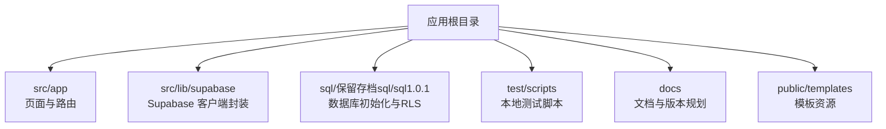
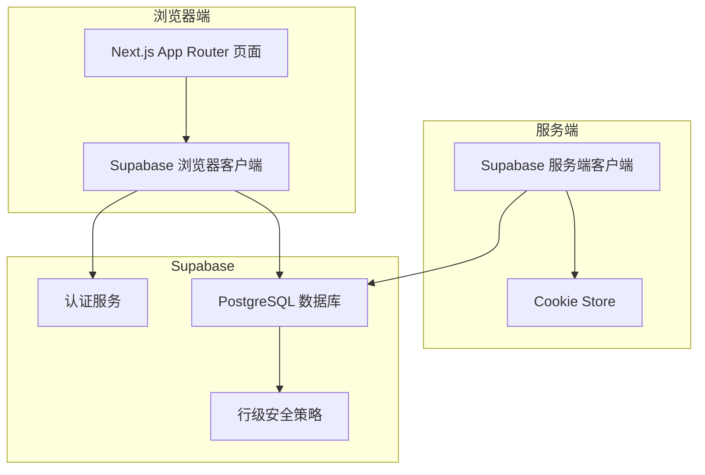
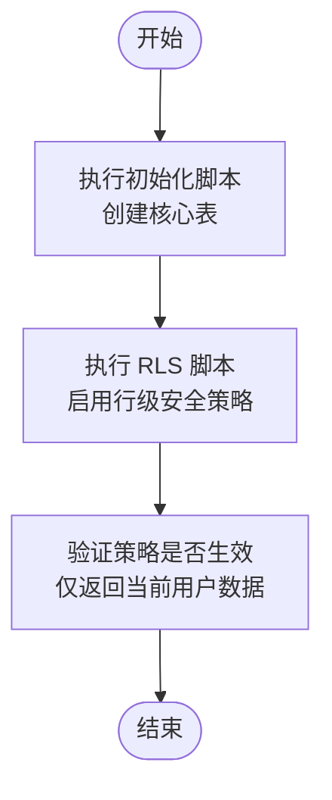
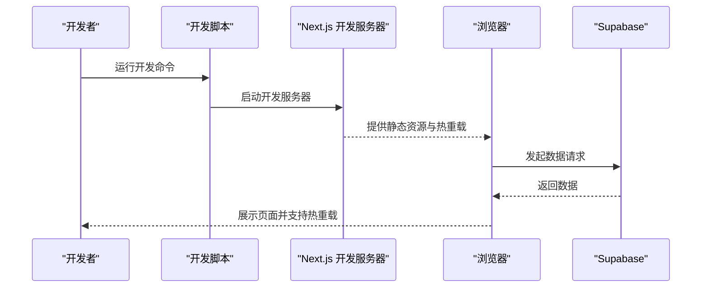
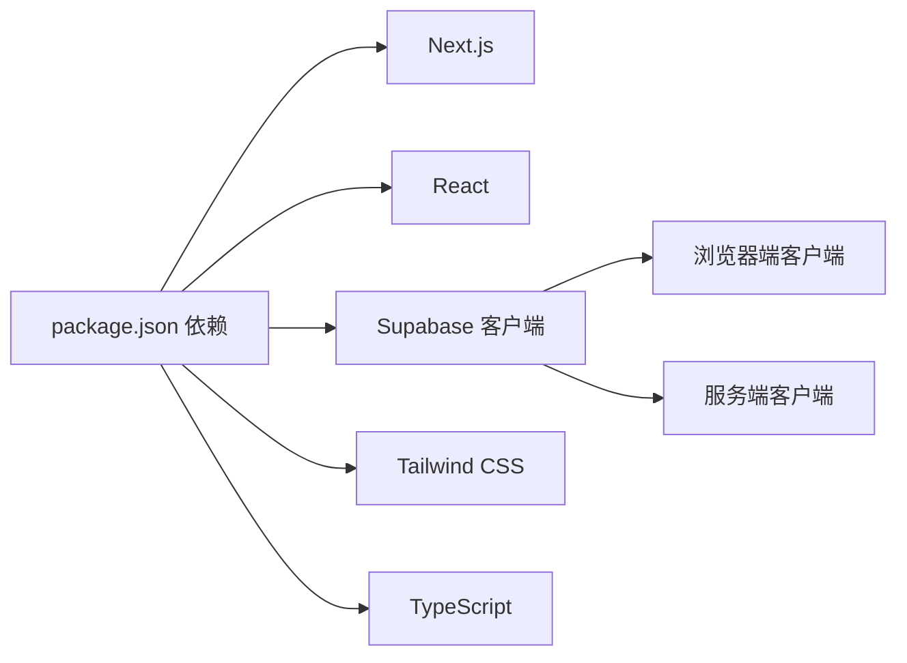

# 本地部署

<cite>
**本文引用的文件**
- [package.json](file://package.json)
- [README.md](file://README.md)
- [next.config.js](file://next.config.js)
- [tsconfig.json](file://tsconfig.json)
- [tailwind.config.cjs](file://tailwind.config.cjs)
- [src/lib/supabase/client.ts](file://src/lib/supabase/client.ts)
- [src/lib/supabase/server.ts](file://src/lib/supabase/server.ts)
- [sql/保留存档sql/sql1.0.1/001_init_core_tables.sql](file://sql/保留存档sql/sql1.0.1/001_init_core_tables.sql)
- [sql/保留存档sql/sql1.0.1/002_enable_rls_core_tables.sql](file://sql/保留存档sql/sql1.0.1/002_enable_rls_core_tables.sql)
- [src/app/layout.tsx](file://src/app/layout.tsx)
- [src/app/globals.css](file://src/app/globals.css)
</cite>

## 目录
1. [简介](#简介)
2. [项目结构](#项目结构)
3. [核心组件](#核心组件)
4. [架构总览](#架构总览)
5. [详细组件分析](#详细组件分析)
6. [依赖分析](#依赖分析)
7. [性能考虑](#性能考虑)
8. [故障排查指南](#故障排查指南)
9. [结论](#结论)
10. [附录](#附录)

## 简介
本指南面向希望在本地快速搭建并运行 TETO 1.0 的开发者，覆盖从 Node.js 版本要求、依赖安装、环境变量配置，到 Supabase 数据库初始化与 RLS 策略启用，再到开发服务器启动、热重载与调试、构建检查、性能优化与本地测试的完整流程，并提供常见问题的解决方案与最佳实践。

## 项目结构
- 应用采用 Next.js 16 App Router，TypeScript 严格模式，Tailwind CSS v4。
- 关键目录与职责概览：
  - src/app：页面与路由（App Router 结构）
  - src/lib/supabase：客户端与服务端 Supabase 客户端封装
  - sql/保留存档sql/sql1.0.1：数据库初始化与 RLS 策略脚本
  - test/scripts：本地性能与 API 测试脚本
  - docs：项目文档与版本规划

章节来源
- [package.json:1-44](file://package.json#L1-L44)
- [README.md:13-21](file://README.md#L13-L21)

## 核心组件
- 本地开发脚本与构建命令由包管理器定义，支持开发、构建、启动与 Lint。
- Next.js 配置允许指定开发时允许的来源，便于多设备联调。
- TypeScript 严格模式与路径别名配置，提升类型安全与工程组织性。
- Tailwind CSS 内容扫描范围覆盖 app、pages、components，确保样式按需生成。

章节来源
- [package.json:6-11](file://package.json#L6-L11)
- [next.config.js:1-4](file://next.config.js#L1-L4)
- [tsconfig.json:19-28](file://tsconfig.json#L19-L28)
- [tailwind.config.cjs:3-7](file://tailwind.config.cjs#L3-L7)

## 架构总览
TETO 本地开发采用“浏览器端 + 服务端代理 + Supabase”的组合：
- 浏览器端通过 Supabase SSR 客户端发起请求，使用公共密钥进行认证与数据访问。
- 服务端通过 Supabase SSR 服务端客户端读写数据库，开发模式可使用服务角色密钥绕过 RLS，便于本地调试。
- RLS 在生产环境启用，保障数据隔离；开发模式可通过环境变量切换密钥来源。

图示来源
- [src/lib/supabase/client.ts:1-9](file://src/lib/supabase/client.ts#L1-L9)
- [src/lib/supabase/server.ts:1-36](file://src/lib/supabase/server.ts#L1-L36)

章节来源
- [src/lib/supabase/client.ts:1-9](file://src/lib/supabase/client.ts#L1-L9)
- [src/lib/supabase/server.ts:1-36](file://src/lib/supabase/server.ts#L1-L36)

## 详细组件分析

### 开发环境搭建与依赖安装
- Node.js 版本：项目未显式声明最低版本，但 Next.js 16 通常需要较新的 LTS 版本。建议使用 Node.js 18 或 20 LTS。
- 依赖安装：使用包管理器安装项目依赖，确保网络稳定以避免下载失败。
- 开发脚本：使用开发脚本启动本地服务，禁用特定打包器以获得更稳定的开发体验。

章节来源
- [package.json:6-11](file://package.json#L6-L11)
- [README.md:22-27](file://README.md#L22-L27)

### 环境变量配置
- 必填变量
  - NEXT_PUBLIC_SUPABASE_URL：Supabase 项目 URL
  - NEXT_PUBLIC_SUPABASE_ANON_KEY：Supabase 匿名密钥
- 可选变量
  - NEXT_PUBLIC_DEV_MODE：设为 true 可启用开发模式（跳过登录）
  - NEXT_PUBLIC_DEV_USER_ID：开发模式下的测试用户 ID
- 配置位置：在项目根目录创建本地环境文件，写入上述变量。

章节来源
- [README.md:54-62](file://README.md#L54-L62)

### Supabase 数据库初始化与 RLS 策略
- 初始化顺序
  1) 在 Supabase 控制台 SQL Editor 中执行核心表初始化脚本，创建 6 张核心表。
  2) 执行 RLS 策略启用脚本，为各表配置行级安全策略，确保用户仅能访问自身数据。
- 核心表
  - profiles：用户扩展信息
  - daily_records：每日记录主表
  - daily_record_items：每日记录项明细
  - diary_reviews：日记复盘
  - projects：项目
  - project_logs：项目进度日志
- RLS 策略
  - 对每张表分别创建“查看/插入/更新/删除”策略，基于 auth.uid() 或外键链路校验实现数据隔离。

图示来源
- [sql/保留存档sql/sql1.0.1/001_init_core_tables.sql:1-185](file://sql/保留存档sql/sql1.0.1/001_init_core_tables.sql#L1-L185)
- [sql/保留存档sql/sql1.0.1/002_enable_rls_core_tables.sql:1-298](file://sql/保留存档sql/sql1.0.1/002_enable_rls_core_tables.sql#L1-L298)

章节来源
- [README.md:63-90](file://README.md#L63-L90)
- [sql/保留存档sql/sql1.0.1/001_init_core_tables.sql:1-185](file://sql/保留存档sql/sql1.0.1/001_init_core_tables.sql#L1-L185)
- [sql/保留存档sql/sql1.0.1/002_enable_rls_core_tables.sql:1-298](file://sql/保留存档sql/sql1.0.1/002_enable_rls_core_tables.sql#L1-L298)

### 开发服务器启动流程（含热重载与调试）
- 启动开发服务器：执行开发脚本，浏览器访问默认端口。
- 热重载：修改源码后自动刷新，无需手动重启。
- 调试建议
  - 使用浏览器开发者工具检查网络请求与 Supabase 返回。
  - 若启用了开发模式，确认环境变量已正确加载。
  - 如需跨设备联调，可在 Next 配置中添加允许的开发来源。

图示来源
- [package.json:7](file://package.json#L7)
- [next.config.js:3](file://next.config.js#L3)

章节来源
- [README.md:43-47](file://README.md#L43-L47)
- [next.config.js:1-4](file://next.config.js#L1-L4)

### 构建检查与性能优化
- 构建检查：在发布前执行构建命令，确保产物可生成且无类型或语法错误。
- 性能优化建议
  - Tailwind CSS 已配置内容扫描范围，确保按需生成样式。
  - 严格 TypeScript 编译选项有助于提前发现潜在问题。
  - 保持依赖更新至兼容范围内的最新版本，减少安全风险与性能退化。

章节来源
- [README.md:49-52](file://README.md#L49-L52)
- [tailwind.config.cjs:3-7](file://tailwind.config.cjs#L3-L7)
- [tsconfig.json:10-18](file://tsconfig.json#L10-L18)

### 本地测试方法
- API 性能与功能测试：项目提供脚本用于本地性能与 API 行为验证，可在测试目录中找到相关脚本。
- 建议流程
  - 先确保数据库初始化与 RLS 已正确执行。
  - 使用脚本对关键接口进行压力与稳定性测试。
  - 结合浏览器控制台与网络面板定位异常。

章节来源
- [README.md:100-114](file://README.md#L100-L114)

## 依赖分析
- 运行时依赖
  - Next.js、React、Tailwind CSS、Supabase 客户端等，构成前端框架与数据库访问层。
- 开发依赖
  - TypeScript、Tailwind PostCSS 插件、Autoprefixer、PostCSS、Tailwind CSS 等，支撑类型检查与样式构建。
- 依赖关系
  - 浏览器端通过 Supabase 客户端直连 Supabase。
  - 服务端通过 Supabase 服务端客户端访问数据库，开发模式下可切换密钥来源以绕过 RLS。

图示来源
- [package.json:15-42](file://package.json#L15-L42)

章节来源
- [package.json:15-42](file://package.json#L15-L42)

## 性能考虑
- 构建与运行
  - 使用开发脚本启动，避免不必要的打包器干扰。
  - 严格 TypeScript 与 ESLint 配置有助于早期发现问题，减少运行时开销。
- 样式与渲染
  - Tailwind 按需生成样式，避免全局样式污染。
  - 页面布局与主题变量集中管理，减少重复计算。
- 数据访问
  - 在开发模式下使用服务角色密钥可简化调试，但请勿在生产开启该模式。
  - RLS 在生产启用，确保查询粒度最小化，避免不必要的全表扫描。

章节来源
- [package.json:6-11](file://package.json#L6-L11)
- [tsconfig.json:10-18](file://tsconfig.json#L10-L18)
- [tailwind.config.cjs:3-7](file://tailwind.config.cjs#L3-L7)
- [src/lib/supabase/server.ts:4-15](file://src/lib/supabase/server.ts#L4-L15)

## 故障排查指南
- 环境变量未生效
  - 确认本地环境文件已创建且变量命名与 README 一致。
  - 检查开发服务器是否重新启动以加载新变量。
- 数据库连接失败
  - 确认 Supabase URL 与匿名密钥正确。
  - 确认数据库初始化脚本与 RLS 脚本均已成功执行。
- 开发模式无法跳过登录
  - 确认开发模式开关与测试用户 ID 已正确设置。
  - 检查服务端客户端密钥来源逻辑是否按预期切换。
- 跨设备联调失败
  - 在 Next 配置中添加允许的开发来源，确保本地网络可达。

章节来源
- [README.md:29-47](file://README.md#L29-L47)
- [README.md:54-62](file://README.md#L54-L62)
- [src/lib/supabase/server.ts:4-15](file://src/lib/supabase/server.ts#L4-L15)
- [next.config.js:3](file://next.config.js#L3)

## 结论
通过本指南，您可以在本地完成 TETO 1.0 的环境搭建、数据库初始化、开发服务器启动与调试，并掌握构建检查、性能优化与本地测试的方法。遇到问题时，可依据故障排查章节逐项核对，确保开发流程顺畅。

## 附录
- 项目技术栈与功能范围详见 README。
- 样式与主题变量集中在全局样式文件中，便于统一管理。

章节来源
- [README.md:1-21](file://README.md#L1-L21)
- [src/app/globals.css:1-88](file://src/app/globals.css#L1-L88)